::: {#resumen}
## Resumen {.unnumbered}

Se presenta la propuesta de coeficientes sísmicos de diseño desarrollada desde el comité AIS-300 para la actualización de la Norma Colombiana de Construcción Sismo Resistente NSR. Esta propuesta aborda los conceptos de coeficientes óptimos de diseño que han sido la base metodológica para los movimientos de diseño en países como México, alejándose de la metodología usada en los Estados Unidos conocida como Risk Targeted Ground Motion (RTGM). Se detallan los criterios empleados en la aplicación del modelo de optimización de costos totales, con el fin de determinar espectros de diseño desligados de algún periodo de retorno. Se incluye una comparación de las nuevas formas espectrales con las actualmente vigentes dadas por la NSR 10.

**Palabras clave**

Coeficientes sísmicos de diseño, optimización de costos totales, Risk Targeted Ground Motion, amenaza sísmica, espectros de diseño, NSR 22

**Update of Structural Design Seismic Coefficients for the Colombian Building Code NSR-22**

:::

::: {#abstract}
## Abstract {.unnumbered}

The proposal of design seismic coefficients developed at the AIS-300 committee for the update of the Colombian Standard for Earthquake Resistant Construction, NSR, is presented. This proposal addresses the concepts of optimal design coefficients that have been the methodological basis for design strong motion in countries such as Mexico, drifting away from the methodology used in the United States known as Risk Targeted Ground Motion (RTGM). The criteria used in the application of the total cost optimization model are detailed, to determine design spectra separated from some return period. A comparison of the new spectral forms with the current ones given by the NSR 10 is included.

**Keywords**

Seismic design coefficients, total cost optimization, Risk Targeted Ground Motion, seismic hazard, design spectra, NSR 22

:::

## 1.1 INTRODUCCIÓN

La Ley 400 de 1997 marca un hito en la historia del país al establecer el marco normativo que provee las exigencias mínimas para el diseño de edificaciones nuevas en Colombia. La Norma Colombiana de Construcción Sismo Resistente, NSR, está circunscrita en dicha ley y sus decretos reglamentarios, estableciendo las condiciones para la práctica de la ingeniería estructural en Colombia. Esta norma fue actualizada en el 2010 en diversos aspectos de la ingeniería estructural y sísmica, incluyendo la evaluación de la amenaza sísmica a nivel nacional y los coeficientes de diseño. En este momento, la Asociación Colombiana de Ingeniería Sísmica (AIS) se encuentra actualizando de nuevo la norma, buscando incorporarle elementos más modernos y ajustados al estado del conocimiento. Como parte de dicha actualización, el comité AIS-300, encargado de la Amenaza Sísmica Normativa dentro de la AIS, realizó una propuesta de coeficientes sísmicos de diseño que deberá ser estudiada por la Comisión Asesora del Régimen de construcciones Sismo Resistentes, creada por la Ley 400 de 1997, y máximo ente encargado de tomar las decisiones acerca de la sismo resistencia de edificaciones en el país. Este documento presenta los resultados del proceso de actualización de los coeficientes de diseño sismo resistente, basados en la evaluación probabilista de la amenaza sísmica de Colombia y en nuevos procedimientos para definir los movimientos de diseño. 

## 1.2 MOVIMIENTOS SÍSMICOS DE DISEÑO

Para la actualización de la norma sismo resistente de edificaciones NSR 22 se plantea el uso de las formas espectrales de los códigos ASCE 7 - 10 y 16 [1], las cuales se establecen en función de dos parámetros: *S**DS* (aceleración espectral de diseño en periodo corto, 0.2 seg) y *S**D1* (espectral de diseño para un periodo de 1 segundo). La forma espectral se presenta en la Figura 1. 

**Figura 1.** Espectro de aceleraciones según ASCE 7 - 10/16. Tomado de ASCE 7 - 16.

::: {#box1 .callout-important style="background-color: #e3f0fbff; border-left: 4px solid #d4e8f9ff;" appearance="minimal" icon="false"}
<h2 style="font-size: 1rem; margin-top: 0; margin-bottom: 0;">Caja 1. Características de los movimientos sísmicos de diseño Los movimientos sísmicos para el diseño estructural se representan por medio de Espectros de Diseño, los cuales indican los valores mínimos requeridos de aceleración espectral según diferentes periodos de vibración de estructuras. A lo largo de muchos años la ingeniería estructural ha desarrollado los métodos necesarios para operar con este tipo de descripción del movimiento fuerte dentro de los procesos de diseño y verificación de una estructura.</h2>

Lo que conocemos como espectro de respuesta no es más que la colección de valores máximos de movimiento (respuesta estructural) de osciladores de un grado de libertad con periodo fundamental variable (cubriendo un rango relevante y representativo), ante un mismo movimiento sísmico en la base.  Los espectros de respuesta, entre muchas otras propiedades interesantes, exhiben un comportamiento como el ilustrado en la Figura. Se presenta un espectro de velocidad para el acelerograma registrado en la estación Bocatoma durante el sismo de Armenia (Eje Cafetero) del 25 de enero de 1999.   Espectro de velocidad del registro Bocatoma del sismo del Eje Cafetero (Colombia) del 25/01/1999 Nótese que, al dibujar los espectros de velocidad en escala logarítmica, es posible encontrar rangos de periodos en donde los valores calculados de respuesta estructural no varían significativamente unos con otros. En particular se revelan tres zonas en el espectro: una de aceleración aproximadamente constante, otra de velocidad aproximadamente constante y una tercera de desplazamiento aproximadamente constante. Las formas espectrales de diseño, similares a la línea negra presentada en la Figura, buscan aproximar lo mejor posible la forma y características de los espectros de respuesta.
:::

Según el reglamento ASCE 7, los coeficientes de diseño se obtienen de los coeficientes SMS y SM1, llamados el sismo máximo considerado, de la siguiente manera.

|  | (1) |
| --- | --- |

Los valores de los coeficientes SMS y SM1 no corresponden a valores de aceleración espectral de algún periodo de retorno. En estos reglamentos, se emplea movimiento fuerte orientado al riesgo (*Risk Targeted Ground Motion* – RTGM) [2], el cual tiene la característica de calcularse como el valor de aceleración asociado a una probabilidad de colapso del 1% en 50 años. Nótese que la definición probabilista se refiere al colapso como variable de decisión, y no a una eventual excedencia de los valores de aceleración. 

La construcción de movimiento de tipo RTGM implica la definición de funciones de fragilidad que permitan dar cuenta de la vulnerabilidad de las edificaciones futuras. Adicionalmente, esta fragilidad se altera de forma iterativa hasta encontrar el punto en el cual la aceleración espectral induce una probabilidad de colapso del 1%. Este procedimiento es, a juicio de los autores, difícil de justificar, no solo por su arbitrariedad (lo cual es más o menos normal en todas las definiciones de movimiento fuerte de diseño normativas) sino por proveer un mensaje de falsa seguridad que no es posible establecer desde antes de iniciar un proceso de diseño estructural. Surgen inquietudes importantes al analizar el significado y procedimientos de la RTGM:

¿Es posible establecer, desde el espectro de diseño, la probabilidad futura de colapso de una estructura?

¿Son las funciones de fragilidad empleadas, realmente representativas de la probabilidad de colapso de cualquier tipo de estructura?

¿Es apropiado afirmar que, siguiendo estas regulaciones para el movimiento sísmico de diseño, las edificaciones futuras tendrán, todas, la misma probabilidad de colapso de, máximo, 1% en 50 años?

A nuestro juicio, no es correcto ni conveniente establecer la probabilidad de colapso de las estructuras desde el movimiento de diseño. No obstante, la RTGM tiene algunas ventajas o bondades que también conviene mencionar. Primero, lo que busca en esencia es reducir el riesgo de las edificaciones futuras, haciendo explícito un objetivo de desempeño, lo cual es algo deseable. También creemos que es correcto no asociar los coeficientes de diseño (y en general los espectros) a periodos de retorno. En el pasado, la asociación de los coeficientes de diseño a un periodo de retorno establecido ha llevado a múltiples malinterpretaciones del nivel de seguridad que se provee, desde el diseño estructural, a las edificaciones futuras. Nótese el espectro presentado en la Figura 2. Este espectro de diseño fue construido siguiendo las formas espectrales del CCP 14, usando tres coeficientes de diseño con periodo de retorno de 1,000 años. Se presenta también el espectro de amenaza uniforme de 1,000 años, el cual es un espectro construido mediante una evaluación probabilista de la amenaza sísmica, y que sí tiene el mismo periodo de retorno en todas las ordenadas espectrales. Como puede observarse, el espectro de diseño resultante solamente tiene 1,000 años de periodo de retorno en los tres puntos en donde de cruza con el de amenaza uniforme. En ciertas porciones del espectro, el periodo de retorno real de las aceleraciones espectrales es mayor a 1,000 y en otras partes es menor a 1,000. Esto no constituye realmente una deficiencia de las formas espectrales, pues este es en general el caso en todos los códigos de diseño sismo resistente conocidos. En conclusión, no es posible, ni lógico, afirmar que un espectro de diseño tiene determinado periodo de retorno. La desvinculación del periodo de retorno de la definición de los coeficientes de diseño en la RTGM es un acierto.

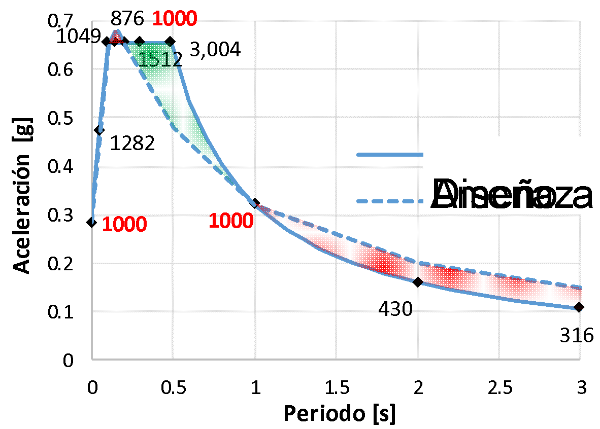

**Figura 2. **Espectro de diseño y espectro de amenaza uniforme. Se indican los periodos de retorno reales de las aceleraciones espectrales de diseño.

Cabe anotar que en este trabajo se mantienen siempre los coeficientes de sitio, asociados a la respuesta del suelo, en un valor constante igual a 1. La respuesta de sitio es materia de investigación profunda y de reflexión también para la actualización de la NSR 22, pero excede el alcance de este trabajo. 

::: {#box2 .callout-important style="background-color: #e3f0fbff; border-left: 4px solid #d4e8f9ff;" appearance="minimal" icon="false"}
<h2 style="font-size: 1rem; margin-top: 0; margin-bottom: 0;">Caja 2. Efecto del suelo Los depósitos de suelo blando modifican en amplitud y contenido frecuencial el movimiento sísmico, como resultado del tránsito de las ondas sísmicas por los materiales geotécnicos, los cuales exhiben un comportamiento fuertemente no lineal, aumentando los amortiguamientos totales y degradando su módulo de rigidez a medida que son sometidos a mayores deformaciones cortantes. Este comportamiento tiende a modificar radicalmente la forma de los espectros de respuesta a nivel de la superficie del terreno (o a nivel de la cimentación de las estructuras), en comparación con el movimiento en la base del depósito.</h2>

Este comportamiento se ilustra a continuación a partir de la respuesta sísmica de un perfil conformado totalmente por materiales aluviales, granulares, de profundidad intermedia (30 metros) y rigidez intermedia (Vs30 = 530 m/s). Este perfil es de tipo C según la clasificación NHERP, misma usada en el NSR-10. La Figura presenta la relación de amplificación de aceleraciones espectrales (superficie/ roca) ante un acelerograma hipotético incidente en la base.  Relación de amplificación de las aceleraciones espectrales  El comportamiento de la relación de amplificación típicamente es el presentado en la Figura. Nótese que es posible identificar tres zonas principales: una de periodos muy cortos (o zona de comportamiento rígido), otra de periodo corto y otra de periodo largo, para las cuales es posible establecer valores de amplificación en términos de un único parámetro representativo. Estos parámetros son los mismos que se emplean en la formulación de las formas espectrales de la NSR 10 (Fa y Fv), despreciando la zona de comportamiento rígido, en donde prácticamente no es posible encontrar ninguna estructura convencional.
:::

## 1.3 UN “NUEVO” ENFOQUE

En vista tanto de las deficiencias como ventajas de la RTGM, se propone un enfoque diferente para la definición de los coeficientes sísmicos de diseño. Este enfoque se basa en la cuantificación de coeficientes *óptimos* de diseño, lo cual no es realmente un nuevo enfoque, no solo por haber sido ya empleado en otros códigos de construcción sismo resistente (como en el caso de México), sino porque su definición es tan antigua como la de la evaluación probabilista de la amenaza sísmica. En palabras de Luis Esteva, los coeficientes óptimos “son los que han de minimizar la suma de los costos asociados a la decisión de haber usado ese valor en el diseño de la edificación” [3]. El padre de la evaluación probabilista nos ofrecía esta definición al mismo tiempo que planteaba su famosa ecuación para el cálculo de las tasas de excedencia de movimiento fuerte (de donde se obtienen los periodos de retorno, tan arraigados en nuestra concepción de seguridad en los diseños estructurales). Su maestro, Emilio Rosenblueth, lo definiría de la siguiente manera: “un diseño es óptimo si minimiza los costos iniciales de construcción y el valor presente neto de las pérdidas futuras debido a terremotos” [4]. No es extraño entonces que estos conceptos hayan sido llevados a la práctica en México desde hace ya varios años.

Siguiendo la definición de Rosenblueth, los coeficientes óptimos de diseño se obtienen de minimizar la suma de costos iniciales de construcción, y costos futuros asociados a las pérdidas que causarán los terremotos. Esto significa que el periodo de retorno de estos coeficientes no solo no participa en su definición, sino que cambiará de sitio a sitio. La Figura 3 muestra esta situación para dos sitios diferentes en un territorio, uno de baja y otro de alta sismicidad. El costo inicial (CI) se asume igual en ambas ubicaciones. Nótese que los costos se presentan como función del valor del coeficiente de diseño *c*, es decir que entre mayores son las exigencias, mayor es el costo inicial. Ahora bien, las curvas de costos futuros (CFL) exhiben comportamientos diferentes dependiendo del nivel de sismicidad del sitio, pero siendo ambas decrecientes con respecto a *c*, indicando que entre mayor sea la exigencia de diseño, se espera que las pérdidas futuras sean menores. La función de costo total (CT) viene de la suma de las anteriores (CT = CI+CFL). Esta función no es totalmente creciente o decreciente con respecto a *c*, presentando un claro valor mínimo en el cual, puede afirmarse, se encuentra el valor óptimo del coeficiente *c*, es decir, el que implica los menores costos totales. 

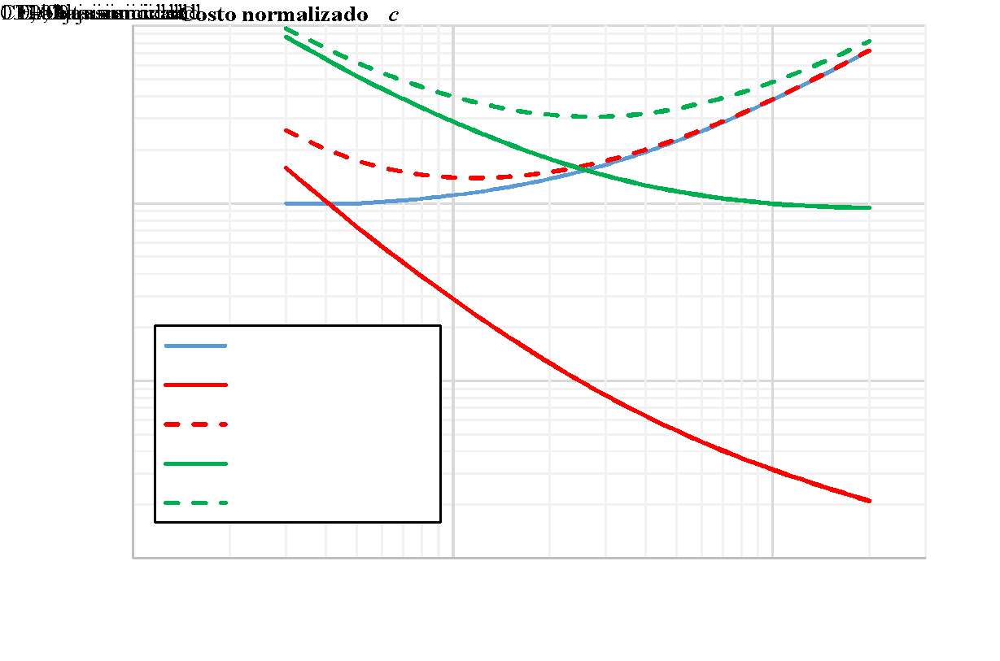

**Figura 3. **Ilustración de la definición de coeficientes óptimos de diseño.

### 1.3.1 Costo inicial

El costo inicial es un indicador del valor económico de la edificación y su variación a medida que la exigencia de diseño aumenta. Nótese que este modelo no pretende ser de características financieras, sino simplemente indicativo, por lo cual no es necesario, ni correcto, intentar incorporar aspectos como la depreciación del inmueble construido. 

El costo inicial se compone de un costo por resistencia lateral gratuita y un costo por resistencia adicional a la gratuita. La resistencia lateral gratuita es aquella resistencia lateral que tiene una estructura que ha sido diseñada exclusivamente para soportar cargas verticales. Es decir, en cualquier configuración estructural, dado que se soportan cargas verticales, se tiene algún nivel de resistencia lateral que es inherente a la estructura, así no se haya concebido como objetivo de diseño. 

Toda resistencia adicional que se provea a la estructura implica un costo adicional a la resistencia gratuita. Este costo es creciente con respecto a la exigencia de diseño, de un modo que se ha visto es ligeramente no lineal. Salgado et al. [5] Proponen un modelo de costos iniciales para las edificaciones en Colombia, que hemos adoptado para el desarrollo de este trabajo.

### 1.3.2 Costo de pérdidas futuras

El costo de las pérdidas futuras se determina en función del costo inicial de la estructura, la tasa de excedencia del coeficiente de diseño, que mide cuantas veces en promedio en el futuro se excederá el nivel de diseño, y un factor de impacto que permite incorporar efectos indirectos asociados a las pérdidas causadas por los temblores. Este factor de impacto es de especial interés en este trabajo, pues permite incorporar de forma más o menos directa las condiciones de contexto que facilitan que se exacerbe el impacto asociado a la ocurrencia de un terremoto, en términos de la fragilidad social y falta de resiliencia en que ocurre dicha pérdida. 

La tasa de excedencia del movimiento fuerte mide el número de veces en un año que se espera se exceda, en promedio, un valor determinado. Este parámetro se obtiene mediante una evaluación clásica de la amenaza sísmica, cuyo principal resultado son precisamente las curvas de amenaza (o curvas de tasa de excedencia) en múltiples ubicaciones de cálculo dentro del país. El modelo de amenaza sísmica de Colombia corresponde a la última versión del proyecto ASLAC (Salgado et al. [6]), el cual es un modelo regional de América Latina y El Caribe, desarrollado con el objetivo de proveer a la región de un modelo continuo de amenaza, con el mayor nivel de detalle posible en cada territorio y siguiendo técnicas del estado del arte en ingeniería sísmica. La Figura 4 muestra como ejemplo los mapas de amenaza uniforme para Colombia de 475 años de periodo de retorno, para aceleración máxima del terreno y aceleración espectral para 0.5 segundos.

|  |  |  |
| --- | --- | --- |

**Figura 4. **Mapas de amenaza uniforme para 475 años de periodo de retorno. Izq: aceleración máxima del terreno. Der: Aceleración espectral para 0.5 segundos. Aceleración en cm/s2.

El factor de impacto pretende reflejar las condiciones de contexto en el cual ocurrirían las pérdidas. Su definición es siempre subjetiva y arbitraria, pero orientada a mostrar el impacto real de los desastres sísmicos y a permitir la diferenciación entre territorios según su nivel de desarrollo. Emilio Rosenblueth llegó a plantear que el factor de impacto debería ser del orden de 12, es decir, que el impacto real de un terremoto, en condiciones socioeconómicas muy desfavorables, podría ser de 12 veces la pérdida directa. Si bien existen diferentes planteamientos en la literatura con respecto al valor del factor de impacto, hay consenso científico en que su definición debe permitir la diferenciación entre territorios, más que dar cuenta exactamente de la amplificación del impacto.

En este trabajo se optó por definir el factor de impacto en términos de dos características particulares a nivel de municipio: i) el nivel de desarrollo según la tipología municipal del DNP y, ii) si el municipio tiene o no microzonificación sísmica. La primera característica habla del nivel de desarrollo del municipio. En este trabajo se considera explícitamente la categoría municipal y su clasificación en dimensión institucional. La segunda característica permite dar cuenta de la tradición en ingeniería estructural y sísmica, el reconocimiento del problema y la inversión realizada por los municipios en seguridad sísmica. La Figura 5 muestra la distribución del valor final determinado para el factor de impacto para todos los municipios del país.

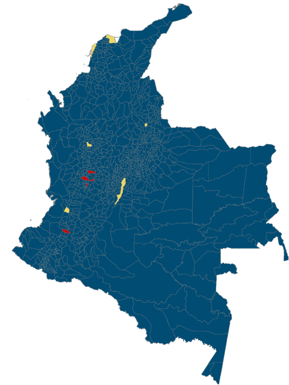

**Figura 5. **Valor del factor de impacto a nivel municipal. Los municipios con factor de impacto igual a 5 son: Bogotá D.C., Medellín, Cali, Bucaramanga, Barranquilla y Cartagena. Los municipios con factor de impacto igual a 7 son: Manizales, Pereira, Armenia y Popayán.

Los valores mostrados en el mapa de la Figura 5 fueron definidos en base a la experiencia de los autores con el fin de revelar el impacto asociado a la ocurrencia de los temblores, y se consideran apropiados y suficientes para los fines de este trabajo. Mayor profundización en su definición será objeto de investigaciones posteriores.

::: {#box3 .callout-important style="background-color: #e3f0fbff; border-left: 4px solid #d4e8f9ff;" appearance="minimal" icon="false"}
<h2 style="font-size: 1rem; margin-top: 0; margin-bottom: 0;">Caja 3. Nuevo modelo de amenaza sísmica de Colombia Como parte del proyecto ASLAC (Amenaza Sísmica de América Latina y El Caribe), se desarrolló un modelo detallado de amenaza sísmica para el territorio colombiano. Los detalles de este modelo pueden consultarse en Salgado et.al. 2017.</h2>

Este nuevo modelo se conforma por 53 fuentes sismogénicas, 26 de ellas corticales, 5 de subducción de interfaz, 20 de subducción intraplaca, una fuente especial para el nido de sismicidad de Bucaramanga y una fuente de background para la sismicidad dispersa del norte colombiano.   Mapa con la ubicación de los 53 polígonos de fuentes sismogénicas Se hizo uso de modelos de movimiento fuerte (GMPM) híbridos, mediante la combinación de los siguientes modelos individuales. Se incluye en todos los casos el modelo de atenuación de Bernal 2014 (actualizado en 2019) como modelo generado en base a observaciones en el territorio nacional. GMPM usados en la modelación de la amenaza sísmica  El cálculo de la amenaza sísmica se desarrolló en el programa R-CRISIS, uno de los más usados a nivel internacional.
:::
| --- | --- |

## 1.4 COEFICIENTES ÓPTIMOS

Usando el software R-CRISIS  [7], mismo usado en la evaluación de la amenaza sísmica del país y del proyecto ASLAC, se aplicó la metodología presentada anteriormente, buscando encontrar los coeficientes óptimos de diseño para diferentes aceleraciones espectrales. Como ejemplo, la Figura 6 muestra los espectros de aceleraciones óptimas para Bogotá y Cúcuta, a nivel de roca firme. Se marcan en la imagen los valores de aceleración en 0.2 y 1 segundos (correspondientes a SDS y SD1 respectivamente). Se muestra también los periodos de retorno de las aceleraciones espectrales. Nótese como los menores periodos de retorno se asocian a periodos bajos (cercanos a 0.2 segundos), punto desde el cual el periodo de retorno es creciente con el periodo estructural. 

|  |  |
| --- | --- |
|  |  |

**Figura 6.** Ejemplo de cálculo de coeficientes de diseño óptimos. Arriba: Bogotá. Abajo: Cúcuta. Izquierda: Aceleraciones espectrales óptimas. Derecha: Periodos de retorno de las aceleraciones óptimas.

También es posible ver en la Figura 6 que para mayor amenaza sísmica (Cúcuta), los periodos de retorno requeridos son menores que en una zona de amenaza intermedia (Bogotá). Esto puede entenderse de dos maneras. Primero, nótese que a medida que la amenaza sísmica disminuye, la resistencia lateral gratuita de la estructura (aquella que se obtiene de la capacidad a cargas verticales) empieza a aportar cada vez más a la seguridad sísmica de la edificación, llevando el problema a que, en zonas de amenaza baja, sea muy “barato” comprar seguridad sísmica, lo que implica el poder usar periodos de retorno muy altos. Segundo, a medida que la amenaza sísmica se incrementa, lo hace también la frecuencia con la que se superan los valores de aceleración de diseño. Esto conlleva un altísimo costo inicial si se quiere reducir el número de veces en que se superará en el futuro, llegando a un punto en el cual incrementar ampliamente el costo inicial puede no ser igualmente efectivo en reducir las pérdidas. Por esta razón, lo más costo-efectivo es precisamente diseñar para un periodo de retorno menor. 

Este mismo tipo de resultados puede verse espacialmente. Las Figuras 7 y 8 presentan los mapas de periodos de retorno óptimos para la aceleración espectral de 0.2 segundos y 1 segundo, respectivamente. Nótese como las zonas de alta amenaza sísmica del país implican menores periodos de retorno para el parámetro de diseño, y viceversa. 

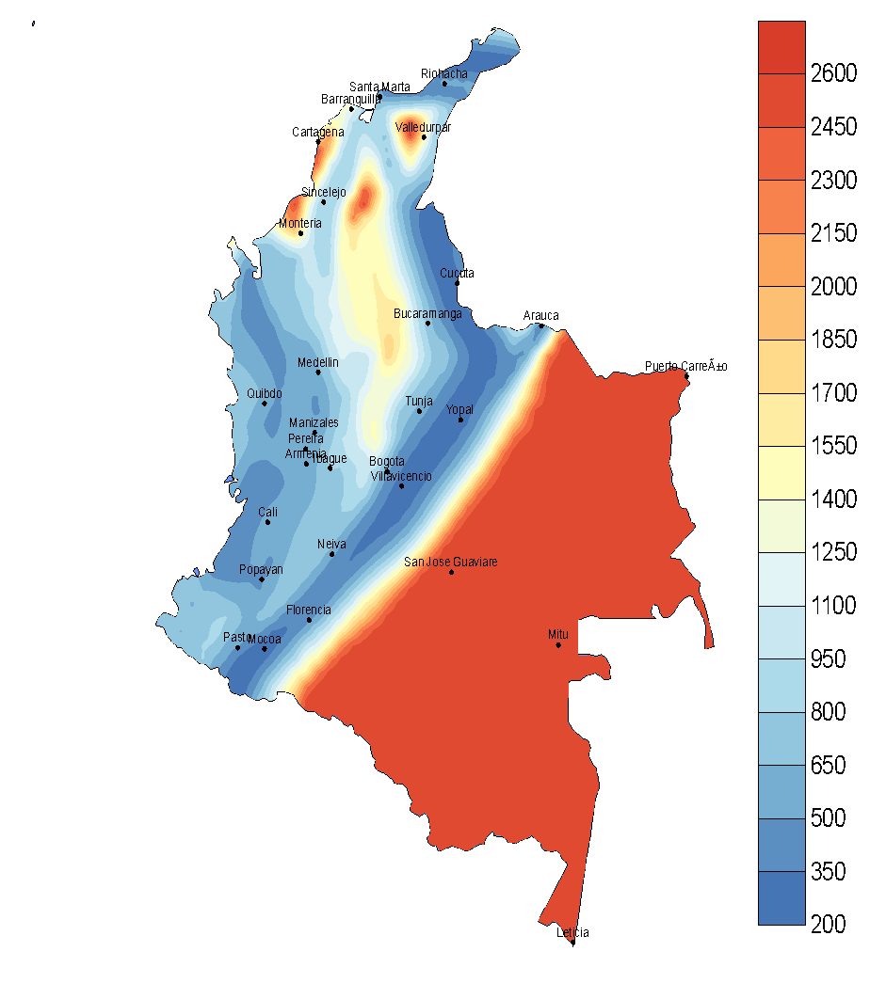

**Figura 7.** Periodos de retorno óptimos para aceleración espectral de 0.2 segundos.

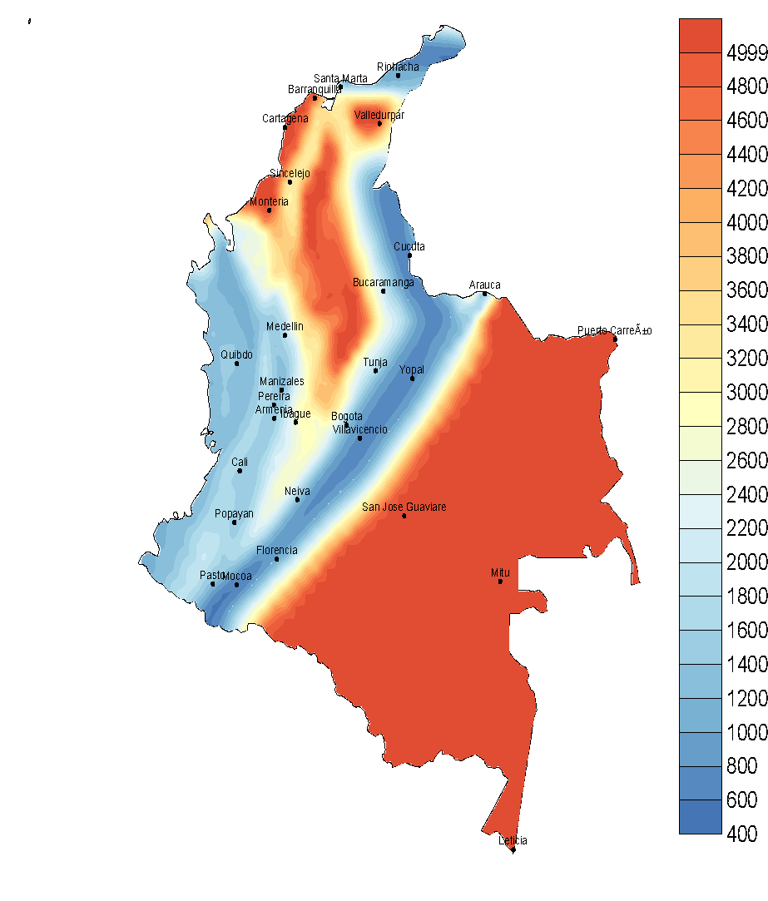

**Figura 8.** Periodos de retorno óptimos para aceleración espectral de 1 segundo (derecha).

::: {#box4 .callout-important style="background-color: #e3f0fbff; border-left: 4px solid #d4e8f9ff;" appearance="minimal" icon="false"}
<h2 style="font-size: 1rem; margin-top: 0; margin-bottom: 0;">Caja 4. R-CRISIS R-CRISIS (Ordaz et al. 2018) es una herramienta versátil para realizar el análisis probabilista de amenaza sísmica (PSHA). Desde su primera versión, desarrollada en 1998, R-CRISIS ha sido utilizado en diferentes proyectos de evaluación de amenaza sísmica alrededor del mundo. Las evaluaciones probabilistas realizada con R-CRISIS se ajustan en su totalidad a los resultados considerados válidos en la más reciente edición del proyecto PEER para validación de software para cálculos sísmicos. R-CRISIS está actualmente avalado para usarse en evaluaciones de amenaza sísmica de instalaciones nucleares en Europa. En Aguilar-Meléndez et al. (2017) se puede encontrar una completa revisión de R-CRISIS.</h2>

R-CRISIS admite la definición de fuentes sísmicas de diversos tipos, desde puntos y líneas, hasta complejas estructuras tridimensionales, que se combinan con una importante variedad de modelos de sismicidad. R-CRISIS facilita el uso de diferentes modelos de atenuación (GMPM), incorporando actualmente más de 60 modelos diferentes. R-CRISIS permite calcular: Mapas de amenaza, espectros de amenaza uniforme, desagregación M-R, desagregación M-R-Epsilon, escenarios sísmicos/mapas de movimiento sísmico y conjunto de eventos (archivo CAPRA ame), entro otros resultados.    Pantalla principal de R-CRISIS Manuales de usuario y referencia técnica, bases documentales, tutoriales y otros recursos pueden ser consultados en www.r-crisis.com
:::

## 1.5 ESPECTROS DE DISEÑO

De acuerdo con la especificación del ASCE 7 -10/16, los coeficientes de diseño se obtienen a partir de los coeficientes del sismo máximo considerado. Los coeficientes óptimos calculados y presentados anteriormente son para diseño estructural, por lo cual es necesario, buscando la adopción del reglamento ASCE, encontrar los coeficientes SSM y SS1 que deriven en los coeficientes de diseño óptimos encontrados. Estos coeficientes se encuentran usando la Ecuación 1. Sus respectivos periodos de retorno deben determinarse en las curvas de amenaza correspondientes a cada aceleración espectral (0.2 y 1 segundos). 

### 1.5.1 Coeficiente SMS

Este coeficiente corresponde a la aceleración espectral de 0.2 segundos del sismo máximo considerado según la especificación del ASCE 7 – 10/16. Este coeficiente determina la altura de la meseta en el espectro de aceleraciones, por lo cual es el que controla los diseños estructurales de edificaciones de altura intermedia. Las bajas alturas (1 y 2 pisos) se diseñan en Colombia haciendo uso del Título E de la NSR, en el cual no participan los espectros de diseño. Las características de las edificaciones de altura intermedia se ligan fuertemente al nivel socioeconómico de la región, es decir, que se reconoce la incidencia del factor de impacto en determinar las aceleraciones óptimas. Esta incidencia pudo ser verificada al analizar los valores de aceleración óptima espectral de 0.2 segundos en las cabeceras municipales, los cuales presentan periodos de retorno muy similares entre sí, para un mismo nivel o factor de impacto. Se definieron tres niveles de desarrollo, según las clasificaciones dadas en el mapa de la Figura 5, estableciendo los periodos de retorno como el promedio de los municipios de una misma clasificación, como se indica en la Tabla 1.

**Tabla 1.** Periodos de retorno del parámetro SMS según el nivel de desarrollo 
(Código de colores según el mapa de la Figura 5)

|  | Nivel | Periodo de retorno SMS |
| --- | --- | --- |
|  | I | 1500 |
|  | II | 2000 |
|  | III | 2500 |

### 1.5.2 Coeficiente SM1

Este coeficiente corresponde a la aceleración espectral de 1 segundo del sismo máximo considerado según la especificación del ASCE 7 – 10/16. Esto significa que el diseño de edificaciones de gran altura estará principalmente dominado por este parámetro. Estas edificaciones típicamente se diseñan con ingeniería de mayor sofisticación, usando métodos más rigurosos y exigentes. Si bien este puede no ser el caso siempre, se espera aquella que en líneas generales se de un tratamiento especial a edificaciones de esta característica. Por esta razón, no se buscó vincular su periodo de retorno directamente al nivel de desarrollo, sino a la ubicación geográfica, tal y como se muestra en el mapa de la Figura 8. A partir de este mapa de periodos de retorno óptimos, se propone una zonificación de la amenaza sísmica del país (Fig. 9) que determina el periodo de retorno del parámetro SM1, así como el nivel de disipación de energía mínimo requerido en cada zona, es decir, reemplazaría el mapa de zonas de amenaza actualmente vigente. Este nuevo mapa, define 5 zonas de amenaza: Alta 1, Alta 2, Intermedia, Baja 1 (Norte), Baja 2 (Llanos).

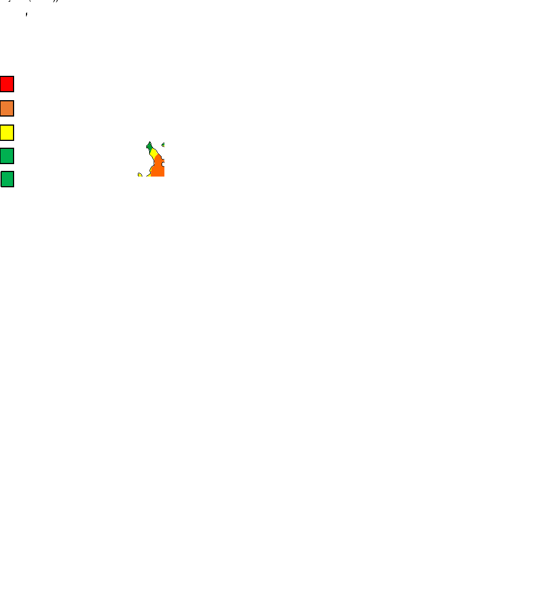

**Figura 9****. **Nuevo mapa de zonificación sísmica propuesto.

A partir de las zonas de amenaza de la Figura 9 es posible establecer los periodos de retorno del parámetro SM1, como se presenta en la Tabla 2.

**Tabla 2. **Periodos de retorno del parámetro SM1 según zona de amenaza 
(Código de colores según el mapa de la Figura 8).

|  | Zona | Periodo de retorno SM1 |
| --- | --- | --- |
|  | Alta 1 | 2500 |
|  | Alta 2 | 5000 |
|  | Intermedia | 5000 |

### 1.5.3 Espectros mínimos

Para las zonas de amenaza baja (Norte y Llanos), se definieron espectros mínimos buscando que estos coincidan con los actuales espectros de diseño dados por la NSR 10 en estas regiones del país. Esta condición, si bien es arbitraria, implica aceleraciones espectrales de más de 5000 años de periodo de retorno en todos los casos, manteniendo además el mismo nivel de seguridad que el actualmente exigido. Los coeficientes SMS y SM1 para las zonas bajas se presentan en la Tabla 3.

**Tabla 3. **Coeficientes SMS y SM1 para zonas de amenaza baja. Valores dados como fracción de g.

| Zona | SMS | SM1 |
| --- | --- | --- |
| Baja 1 (Norte) | 0.38 | 0.18 |
| Baja 2 (Llanos) | 0.19 | 0.09 |

### 1.5.4 Parámetro TL

El parámetro TL (Fig. 1) define el punto a partir del cual las aceleraciones espectrales decrecen con el inverso del periodo al cuadrado. Esta formulación permite controlar los desplazamientos espectrales en la zona de periodos largos. En este trabajo no se incluye una evaluación de los valores para TL, sin embargo, cabe mencionar que este parámetro estará principalmente controlado por la cercanía a fuentes sismogénicas importantes (campo cercano). En principio, TL se mantiene en su definición actual (la dada por la NSR 10) como  $TL = 2.4∙FV$ , siendo FV el parámetro de amplificación del suelo en la zona de velocidades constantes. No obstante, en condición de campo cercano (i.e. a menos de 10 km de un lineamiento de falla activa) se requiere de la definición de este parámetro por medio de un estudio de amenaza local que considere el campo cercano. 

## 1.6 ESPECTROS PROPUESTOS Y COMPARACIÓN CON LA NSR-10

A continuación, se presentan los espectros de diseño propuestos en comparación con los correspondientes dados por la NSR-10, para Bogotá, Medellín y Cali. Los espectros propuestos para todas las capitales de departamento se incluyen en el Anexo 1. Sobre los espectros propuestos se indican los periodos de retorno de las aceleraciones en diferentes puntos, con el objetivo de hacer énfasis en que no se trata de espectros de diseño asociados a un periodo de retorno. Se indica también la zona de amenaza, y los parámetros de las formas espectrales, tanto de la NSR-10 como los nuevos propuestos.

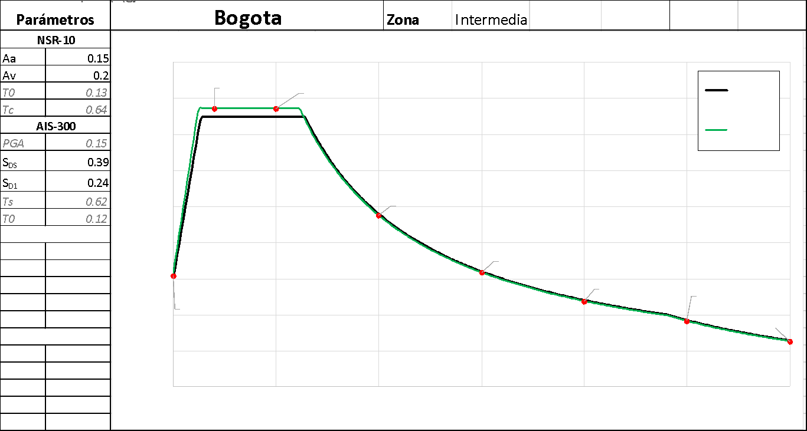

**Figura 10****.** Comparación de espectros de diseño de NSR-10 y propuestos para Bogotá.

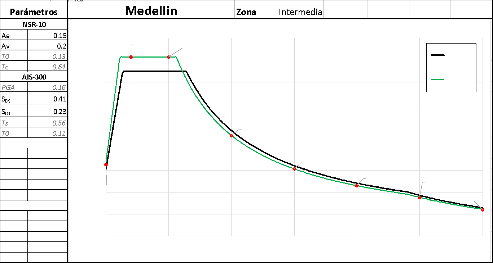

**Figura 11****.** Comparación de espectros de diseño de NSR-10 y propuestos para Medellín.

**Figura 12****. **Comparación de espectros de diseño de NSR-10 y propuestos para Cali.

## 1.7 CONCLUSIONES

El diseño sismo resistente es una de las acciones de gestión del riesgo sísmico más efectivas, pues implica en esencia la reducción de la vulnerabilidad de las edificaciones futuras y, por lo tanto, del riesgo sísmico que afronta la sociedad. Esto es por lo que se requiere de una apropiada definición de los espectros de diseño sismo resistente, que permitan garantizar niveles de seguridad apropiados.

Las diferencias observadas entre las formas espectrales de la NSR-10, actualmente en vigencia, y las nuevas propuestas se deben a los múltiples avances en la ingeniería sísmica en el país, que han llevado a la definición de nuevas y mejores metodologías tanto para el cálculo de la amenaza sísmica como para la definición de los movimientos de diseño. 

La manera de definir los espectros de diseño es única en el mundo, constituyendo una propuesta metodológica que lleva un paso más allá aquellas existentes y aplicadas en el pasado, como con la que se definen los coeficientes de diseño estructural en México, permitiendo su articulación con las normativas ASCE 7-10/16 como base rectora de los requisitos mínimos del diseño sismo resistente. 

En caso de aprobarse esta propuesta de espectros de diseño, el país debe entrar en una fase de actualización y armonización de las microzonificaciones sísmicas del país, de manera que se compatibilicen los requisitos y reglamentos locales con el reglamento nacional. 

| PUNTOS CLAVE Los movimientos sísmicos de diseño no tienen un periodo de retorno asociado. Esta concepción errónea ha llevado a asociar el nivel de seguridad de las edificaciones diseñadas con la NSR a un cierto periodo de retorno, lo cual es incorrecto e incoherente con la práctica de la ingeniería.  El movimiento fuerte orientado al riesgo, RTGM, esta basado en conceptos de la ingeniería de desempeño, lo cual es deseable siempre pues permitiría llevar la práctica de la ingeniería a un nivel mayor de sofisticación. Sin embargo, en la práctica el procedimiento empleado para su determinación es altamente arbitrario y difícil de justificar, así como el intento de cumplir con un objetivo de desempeño explicito previamente al diseño mismo de la edificación. El modelo de coeficientes óptimos de diseño, ideado por Luis Esteva casi al mismo tiempo en que ideó la evaluación probabilista de la amenaza sísmica, provee un camino para mejorar la especificación de coeficientes de diseño, permitiendo considerar aspectos tan relevantes como las tasas de excedencia de aceleraciones, la inversión inicial (de forma aproximada), o el contexto socioeconómico en que ocurren los terremotos.  La propuesta de espectros de diseño permite a la NSR 22 avanzar hacia definiciones del movimiento de diseño más acertadas y también con mayor aproximación a las realidades del país. Los espectros propuestos permiten además una transición relativamente suave entre la NSR 10 y la NSR 22, en la mayoría del territorio nacional. |
| --- |

## 1.8 MATERIALES Y MÉTODOS

### 1.8.1 Risk Targeted Ground Motion (RTGM)

La RTGM, como la define el USGS para ser usada en el ASCE 7-16, se basa en la siguiente ecuación: 

|  | (2) |
| --- | --- |

En donde P (Colapso) es la probabilidad de colapso de la estructura dada como objetivo de desempeño, P (Colapso|Sa) es la función de fragilidad al colapso y fSa es la función de densidad de probabilidad de la aceleración espectral en el sitio de cálculo para un periodo de exposición dado. Nótese que la integral se realiza en todo el dominio de la aceleración espectral. 

La Ecuación 2 es una forma de aplicar el teorema de la probabilidad total sobre la posibilidad de colapso estructural. El término de fragilidad (P(Colapso|Sa)) se asocia a la respuesta estructural, más específicamente a la probabilidad de colapso de la edificación dada una aceleración espectral Sa. En rigor, este término condensa la manera como se causa el daño y el consecuente posible colapso como función del movimiento fuerte inducido en la estructura. Ahora bien, dado que la estructura puede verse sometida a múltiples posibles movimientos sísmicos, la integral se realiza sobre todo el dominio de aceleración (es decir, se consideran todas), pero de forma modulada por la función de densidad de probabilidad de la aceleración espectral, fSa. Esta última depende de la ubicación de la estructura en el país y condensa el aporte de todas las fuentes sísmicas del territorio.

La función de densidad fSa puede obtenerse directamente de la curva de amenaza sísmica de la aceleración espectral como:

|  | (3) |
| --- | --- |

En donde v(Sa) es la tasa de excedencia de la aceleración espectral y T el periodo de exposición. Esta ecuación permite determinar la distribución de probabilidad de la aceleración espectral en base a la curva de amenaza, como se ilustra en la Figura 13. La Ecuación 3 se obtiene directamente de la suposición que la ocurrencia en el tiempo de eventos sísmicos que excedan un determinado valor de aceleración espectral sigue un proceso estocástico homogéneo de Poisson.

**Figura 13****.** Transformación de la curva de amenaza en la función de densidad de probabilidad de la aceleración espectral, para un periodo de tiempo de exposición dado.

Según la metodología definida en los reglamentos ASCE 7-10 y 16, el cálculo de las aceleraciones RTGM sigue un procedimiento iterativo como el indicado a continuación: 

Se define la forma de la función de fragilidad como una distribución lognormal acumulada con parámetros tales que tenga el 10% de probabilidad de colapso para la aceleración que tiene 2,500 años de periodo de retorno, y una desviación estándar del logaritmo natural igual a 0.6.

Se ajusta uno de los parámetros de la distribución lognormal de forma iterativa hasta que el resultado de la Ecuación 2 llegue a ser 1%. 

La aceleración para la cual en la función de fragilidad se tiene 10% de probabilidad de colapso, y que implica un 1% de probabilidad total de colapso según la Ecuación 2, es la medida de movimiento RTGM. La Figura 13 ilustra este proceso iterativo.

|  | Primera iteración: Curva de fragilidad según ASCE 7 – 10/16 Sa = 0.8 g (2,500 años) P(Colapso) = 12% |
| --- | --- |
|  | Segunda iteración: Curva de fragilidad modificada Sa = 1.3 g P(Colapso) = 0.14% |
|  | Tercera iteración: Curva de fragilidad modificada Sa = 1.1 g P(Colapso) = 1.0% |

**Figura 14****.** Ilustración del proceso iterativo para construir la RTGM.

### 1.8.2 Método de los coeficientes óptimos

El método de los coeficientes de diseño óptimos se basa en la minimización del costo total asociado a una estructura. Este costo total se define como el costo inicial por la construcción de la estructura, y el costo de las pérdidas futuras, en función de las pérdidas que los futuros terremotos causarán sobre el inmueble. Esta definición puede expresarse mediante la siguiente ecuación:

|  | (4) |
| --- | --- |

En donde CT es el costo total, CI el costo inicial y CFL el costo de las pérdidas futuras. Todos estos costos se expresan como función del coeficiente de diseño cs. El costo inicial se define de la siguiente manera:

|  | (5) |
| --- | --- |

En donde C0 es el costo por resistencia lateral gratuita, que tiene que ver con la capacidad a cargas laterales que tiene cualquier estructura, incluso si esta ha sido diseñada únicamente para soportar cargas verticales. CRes es el costo por resistencia lateral adicional a la gratuita, es decir dándole una resistencia apropiada a la estructura para las cargas laterales, pero más allá de la inherente a cualquier estructura. Este costo CRes es modificado de manera no lineal como función de la diferencia entre el coeficiente de diseño (que se incrementa a medida que aumenta la exigencia) y el coeficiente c0, que corresponde coeficiente de diseño equivalente a la resistencia lateral gratuita. Esta diferencia es elevada a un exponente positivo α que usualmente se encuentra entre 1 y 2. La Figura 15 muestra la forma de la función CI normalizada (i.e. CI/C0) para edificaciones en Colombia, según Salgado et al. [5]. 

**Figura 15.** Incremento del costo normalizado en función del coeficiente de diseño. Tomado de Salgado et al [5].

En la Figura 15, el Modelo de costos es efectivamente la propuesta de Salgado et al. [5] como función del coeficiente de diseño, mientras que el Modelo ajustado de costos es simplemente una regresión realizada por Salgado et al. [5] sobre su propuesta original para facilitar los cálculos.

El costo de las pérdidas futuras se expresa mediante la siguiente ecuación:

|  | (6) |
| --- | --- |

En donde v(cs) es la tasa de excedencia del coeficiente de diseño, μ es una tasa de descuento y SL es el factor de impacto asociado al contexto socioeconómico en que ocurren las pérdidas por sismos. Según lo recomendado por Salgado et al. [5] la tasa de descuento se fija en un 5%. El factor de impacto SL, que busca dar cuenta de las condiciones de contexto, se evaluó en función de la tipología municipal del DNP [8] y de si el municipio cuenta o no con una microzonificación sísmica, siguiendo este procedimiento:

Si el municipio es categoría A (la más alta) se clasifica como de Nivel I con un factor de impacto SL = 5. 

Si el municipio es categoría B y tiene microzonificación sísmica, o su dimensión institucional según DNP 2015 es mayor a 0.75 entonces se clasifica como de Nivel II con un factor de impacto SL = 7. 

En caso contrario a los anteriores, se clasifica como de Nivel III con un factor de impacto SL = 12. 

Los costos estimados de esta manera, tanto iniciales como futuros, son indicadores que permiten establecer una relación de beneficio-costo para el propósito de determinar coeficientes de diseño. No deben ser vistos como una valoración exacta sino como una aproximación gruesa que permite estimar niveles óptimos de diseño. Son aproximaciones suficientes para estos fines, considerando que tanto lo costos iniciales como las pérdidas futuras serán en realidad función del resultado de diseño. En particular el coeficiente de impacto SL es difícil de estimar analíticamente. Los autores han seleccionado arbitrariamente los valores que, según su experiencia, reflejan apropiadamente condiciones intangibles de falta de resiliencia y fragilidad social que inevitablemente exacerban los efectos negativos netamente estructurales de la ocurrencia de los temblores.

## 1.9 ANEXO 1: ESPECTROS DE DISEÑO PROPUESTOS PARA CAPITALES DE DEPARTAMENTO

En este Anexo se presentan los espectros de diseño propuestos para todas las capitales de departamento en Colombia, comparados con los espectros actualmente vigentes en la NSR-10. Se listan las ciudades en orden alfabético. Las fichas presentadas contienen los valores de los coeficientes de diseño, zona de amenaza sísmica y periodos de retorno de las aceleraciones de diseño propuestas.

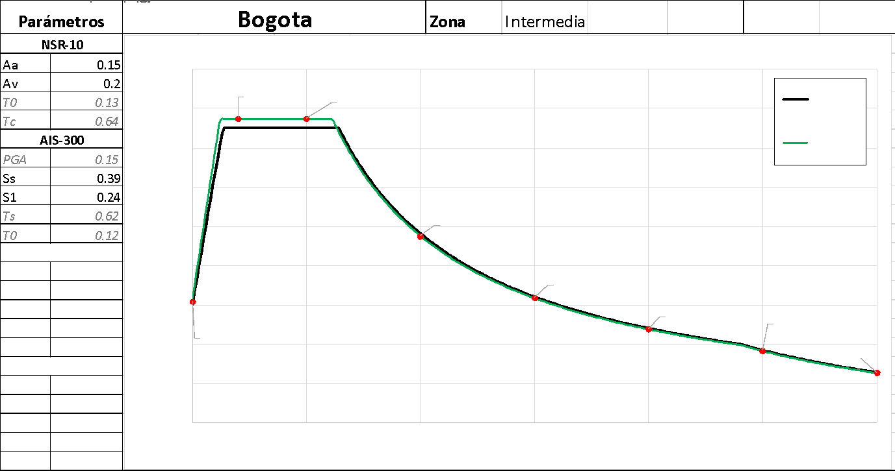

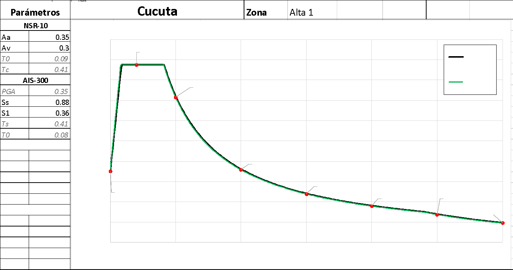

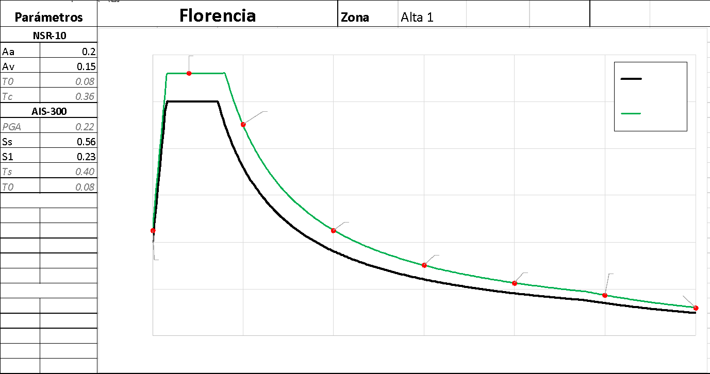

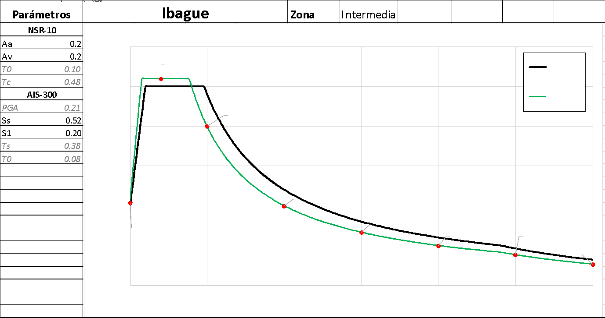

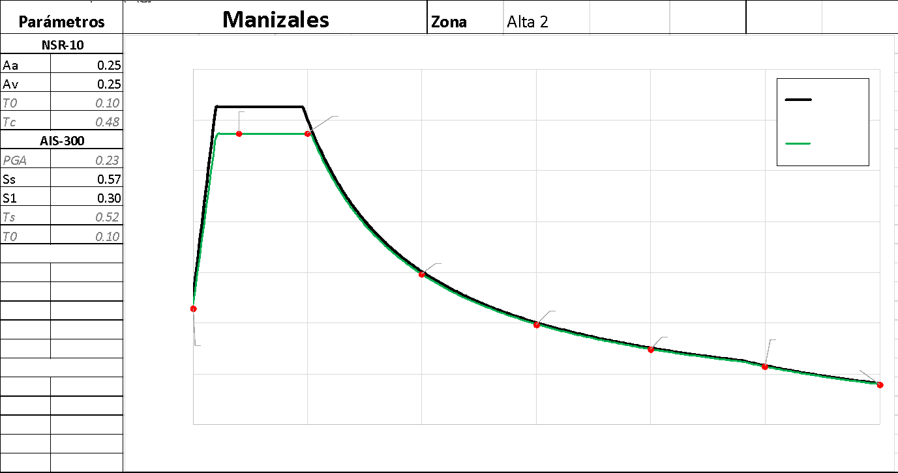

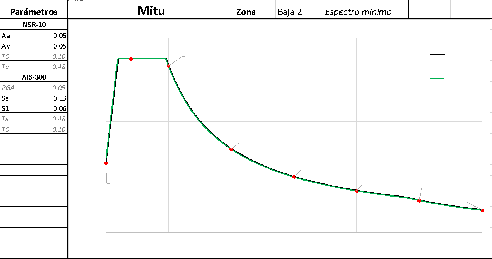

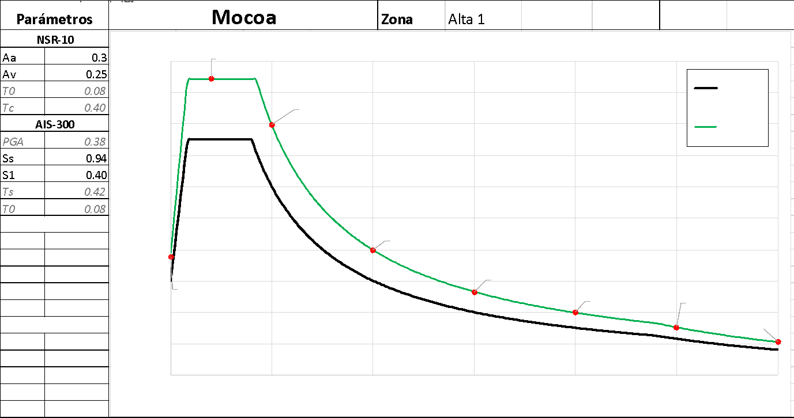

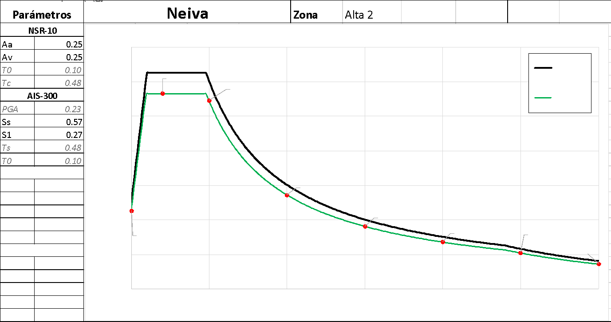

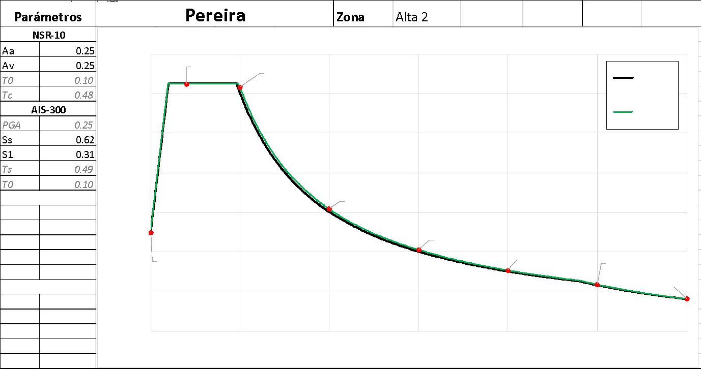

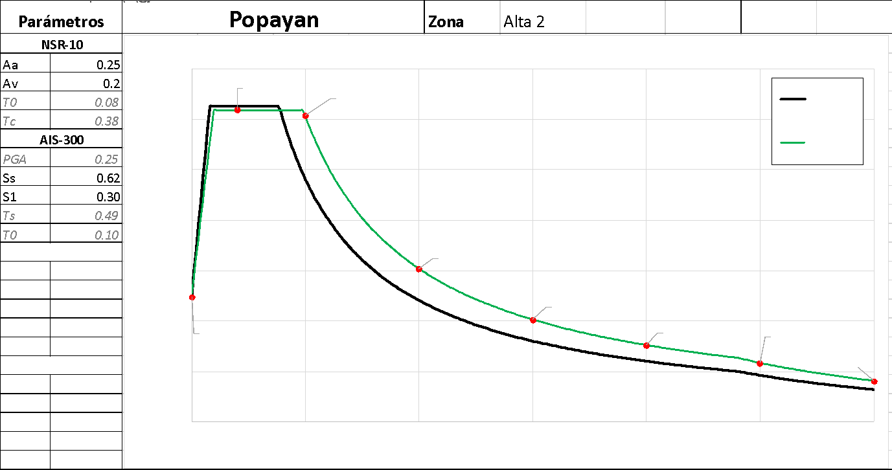

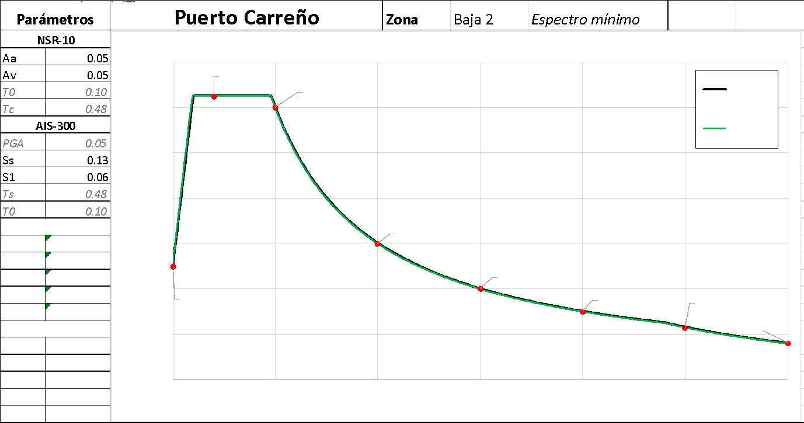

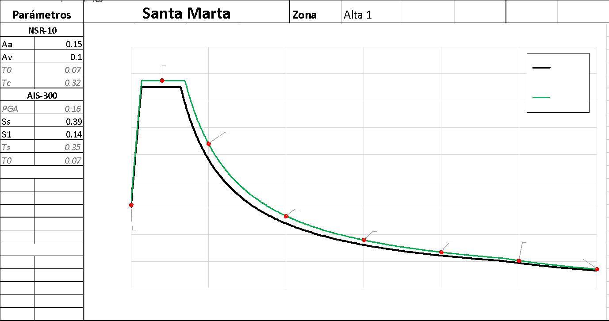

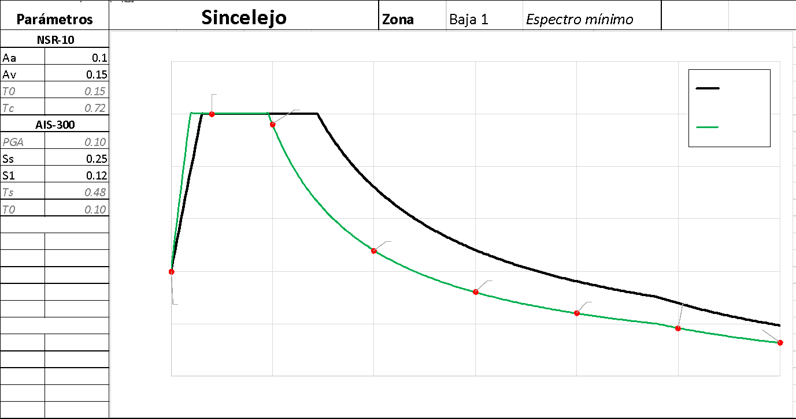

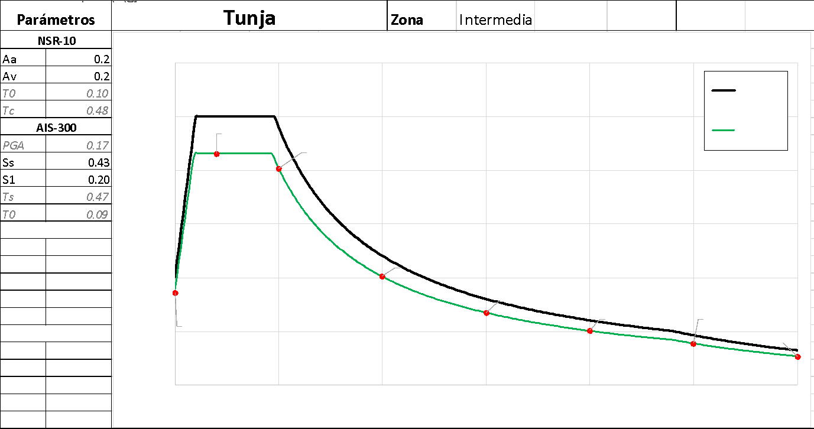

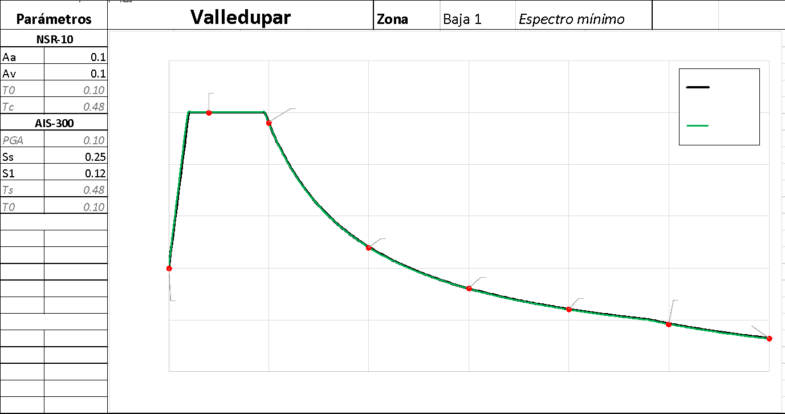

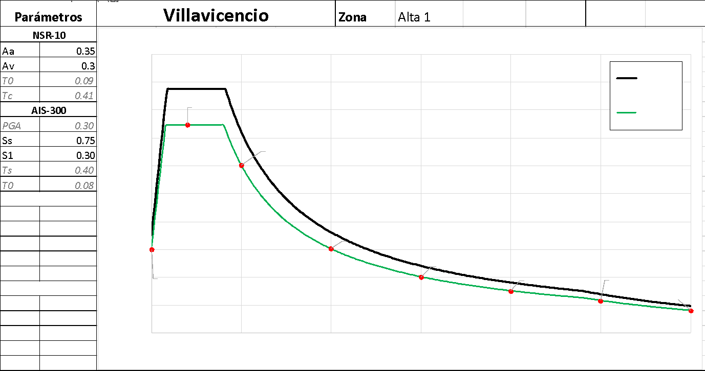

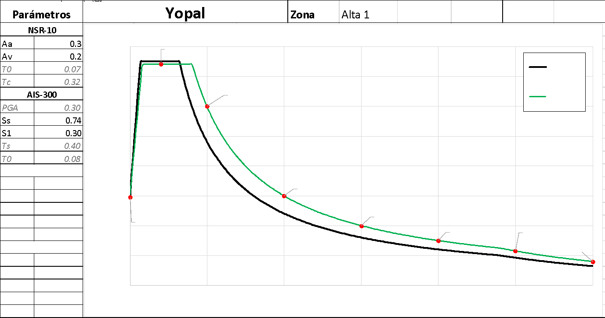

**CONFLICTO DE INTERESES**

Los autores no declaran conflicto de intereses

## 1.10 AGRADECIMIENTOS

Se agradece a los ingenieros Eduardo Castell (presidente AIS), Luis Enrique García (expresidente AIS) y Carlos Eduardo Bernal (Expresidente AIS), así como a los miembros del comité AIS-300, por sus valiosas contribuciones y discusiones durante el desarrollo de este trabajo.

## 1.11 IDENTIFICACIÓN DEL AUTOR

Gabriel Bernal		

Omar Darío Cardona 		

## 1.12 BIBLIOGRÁFIA

American Society of Civil Engineers. *Minimum Design Loads for Buildings and Other Structures*. ASCE 7 - 10/16. 

Luco, N., Ellingwood, B., Hamburger, R.O., Hooper, J.D., Kimball, J.K, and Kircher, C. (2007). Risk-targeted versus current seismic design maps for the conterminous United States. *SEAOC 2007 Convention Proceedings*.

Esteva, L. (1967). Criterios para la construcción de espectros para diseño sísmico. *Tercer Simposio Panamericano de Estructuras.* Universidad Central de Venezuela. Caracas.

Rosenblueth E. (1976). Optimum design for infrequent disturbances. *Journal of the Structural Division ST9*, 1807-1825.

Salgado, M., Ordaz, M., Cardona, O.D. (2017). Coeficientes de diseño sismo resistente óptimos para Colombia. *VIII Congreso Nacional de Ingeniería Sísmica*. Barranquilla.

Salgado, M., Ordaz, M., Singh, K.S., Cardona, O.D., Reinoso, E., Aguado, A., Zuloaga, D., Huerta, B., Bernal, G. (2018). Homogeneous and Continous Probabilistic Seismic Hazard Model for Latin America and The Caribbean. *16th European Conference on Earthquake Engineering*. Tessalonniki.

Ordaz, M., Martinelli F., Aguilar, A., Arboleda, J., Meletti, C., D'Amico, V. (2018). R-CRISIS. Program for computng seismic hazard. 

Departamento Nacional de Planeación. (2015). *Tipologías Departamentales y Municipales: Una propuesta para comprender las entidades territoriales colombianas*. Dirección de Desarrollo Territorial Sostenible. Grupo de Estudios Territoriales. Recuperado de https://colaboracion.dnp.gov.co/CDT/Estudios%20Econmicos/2015may28%20Tipologias.pdf

**2**