::: {#resumen}
## Resumen {.unnumbered}

El desarrollo de planes de mitigación del riesgo de estructuras del sector escolar es una prioridad para los gobiernos por la importancia del sector, la vulnerabilidad de sus ocupantes y la vulnerabilidad de sus edificaciones evidenciada en sismos recientes. El objetivo principal de este capítulo es presentar una metodología para el desarrollo de estos planes de mitigación. La metodología propuesta incluye la identificación de tipologías principales y la consolidación del portafolio de infraestructura expuesta, el análisis del riesgo de desastre y el planteamiento de planes para la reducción del riesgo. Se presentan las tipologías escolares comunes identificadas en diferentes países y dos casos de estudio desarrollados por los autores en Colombia. Finalmente, se discuten los desafíos más importantes tanto para el desarrollo de los planes como en su posible implementación. La metodología y los resultados presentados en este documento buscan sentar unas bases para la evaluación y el desarrollo de planes de mitigación del riesgo para la infraestructura escolar.

**Palabras clave** 

Infraestructura escolar, mitigación, reforzamiento, riesgo, tipologías

**Seismic Risk Mitigation for School Infrastructure**

:::

::: {#abstract}
## Abstract {.unnumbered}

The development of risk mitigation plans for school infrastructure is a priority for the governments due to the sector's importance, the vulnerability of its occupants, and the vulnerability of the buildings identified in recent seismic events. The main objective of this chapter is to present a methodology for the development of these mitigation plans. The proposed methodology includes the identification of the main typologies and the consolidations of the school buildings portfolio, the disaster risk assessment, and the proposal of risk reduction plans. The most common school typologies are presented with two study cases developed by the authors in Colombia. Finally, the most critical challenges are discussed both for the development of the plans and their possible implementation. The methodology and the results presented in this document aims to establish the bases for risk reduction plans in school infrastructure.

**Keywords** 

Mitigation, retrofitting, risk, school’s infrastructure, typologies

:::

## 2.1 INTRODUCCIÓN

El sector escolar es uno de los más vulnerables frente a eventos naturales en particular para eventos sísmicos. Esto se debe a la vulnerabilidad física de edificaciones antiguas y a las características de sus ocupantes [[1]](#ref-1). Por otra parte, sus características arquitectónicas permiten que esta infraestructura se utilice como espacios de refugios para damnificados por eventos de desastre de gran magnitud. La alta vulnerabilidad de este tipo de infraestructura se ha evidenciado en eventos sísmicos recientes en los cuales se han visto colapsos parciales y totales de la infraestructura. En edificaciones de concreto reforzado se han evidenciado daños en diferentes territorios; en particular EERI ha identificado colapsos o daños graves en India, Indonesia, Perú, Turquía, Estados Unidos y Haití en edificaciones con sistemas de pórticos y muros [[2]](#ref-2). Construcciones en muros de mampostería también han sufrido daños importantes como lo evidencia Chen et al. [[3]](#ref-3), en donde se identifican casos de daños y colapsos de edificaciones escolares en el sismo de Ghorka, Nepal en el 2015. En Latinoamérica se han presentado daños importantes en el sector. Por ejemplo, en México, en el sismo de Puebla del 2017 alrededor de 280 escuelas sufrieron daños que necesitaron reparaciones [[4]](#ref-4) y en Ecuador en el sismo de Muisne 2016 se registraron colapsos totales o parciales de escuelas en Manta, Pedernales y Portoviejo [[5]](#ref-5).

Teniendo en cuenta esta problemática, se han desarrollado diferentes iniciativas para el reforzamiento y mejoramiento de la infraestructura escolar a nivel mundial. Una de las iniciativas más importantes es el Programa Global para Escuelas Seguras (GPSS por sus siglas en inglés) del Banco Mundial que ha desarrollado proyectos en Perú, Colombia, El Salvador, República Dominicana, Kirguistán y Grecia, entre otros. Por otro lado, la ONG Build Change tiene un programa de mejoramiento de infraestructura escolar denominado Escuelas Seguras en donde se han desarrollado proyectos en Indonesia, Filipinas y Nepal. Existen también iniciativas gubernamentales que buscan reducir el riesgo sísmico, un ejemplo de este tipo de iniciativas es *Cali Resiliente* que se enfoca en mejorar la infraestructura escolar mediante reforzamientos estructurales en la infraestructura escolar de la capital del Valle del Cauca en Colombia o el desarrollo del *Plan Metropolitano del Riesgo Sísmico* desarrollado por el Área Metropolitana del Valle de Aburrá en Medellín y sus municipios aledaños.

Adicionalmente, existen estudios en la literatura que evalúan el riesgo sísmico en el sector escolar en diferentes países con una perspectiva macro para priorizar recursos y poder realizar estudios detallados y estrategias particulares de intervención. Valcárcel et al. [[6]](#ref-6) presenta un análisis simplificado riesgo probabilista a nivel Latinoamérica a partir de indicadores demográficos y referencias internacionales con el objetivo de priorizar los países cuyo riesgo sísmico sea alto en la infraestructura escolar. Otro ejemplo de este tipo de estudios es el desarrollado por Mora et al. [[7]](#ref-7) en donde se realiza un estudio similar al anterior para los diferentes municipios de Colombia. 

Por otro lado, también existen trabajos detallados como el desarrollado por Chrysostomou et al. [[8]](#ref-8) en el cual se presenta un estudio para Chipre mostrando cómo se desarrolló un programa a nivel nacional de reducción de riesgo en el sector escolar con un resultado positivo en el cual más del 90% de las edificaciones utilizadas en el sector se consideran seguras frente a sismos según las normativas nacionales. Jaimes & Niño [[9]](#ref-9) presentan un estudio similar en México en donde analizan el portafolio de edificaciones escolares a partir de las fechas de construcción y su relación con los códigos de construcción sismorresistente nacionales. Por último, Samadian et al. [[10]](#ref-10) presenta un estudio de resiliencia en Irán en donde presentan los detalles de los modelos y resultados obtenidos para una edificación tipo en mampostería. Como se observa en los ejemplos anteriores, la importancia de la mitigación del riesgo y el aumento en la resiliencia del sector escolar es una de las prioridades de cada país, incluso en Irán se ha incluido la gestión de riesgo de desastres y emergencias en el currículo escolar con el objetivo que los estudiantes sean conscientes de la importancia de la resiliencia desde temprana edad [[11]](#ref-11).

Teniendo en cuenta este contexto, el objetivo de este capítulo es presentar una metodología general para el análisis y desarrollo de planes de mitigación del riesgo en el sector escolar. En la Sección 2 se presentará la metodología propuesta para abordar el problema. La sección 3 describe las tipologías escolares más comunes encontradas en diferentes proyectos. La sección 4 presenta dos casos de estudio de la metodología indicada desarrollados en Colombia por los autores. Por último, las secciones 5 y 6 presentan las recomendaciones y trabajo futuro y los agradecimientos respectivamente.  

## 2.2 METODOLOGÍA

### 2.2.1 Metodología para el desarrollo de planes de mitigación del riesgo

Con el fin de desarrollar una estrategia adecuada para la mitigación del riesgo de desastres es necesario realizar un análisis detallado de la situación actual. En primer lugar, se debe recolectar información para consolidar una base de datos de la infraestructura expuesta que represente adecuadamente la infraestructura de la zona de estudio. Esta base de datos debe contener al menos información en cada colegio del número de edificaciones, el número de pisos y aulas escolares en cada uno, número de estudiantes, año de construcción, material y sistema estructural, y nivel de diseño. Para esto se recomienda desarrollar un sistema taxonómico de identificación o utilizar uno existente como el desarrollado en el marco del Programa Global para Escuelas Seguras (GPSS por sus siglas en inglés) del Banco Mundial, en el cual participaron los autores [[12]](#ref-12). En particular, el nivel de diseño es una variable difícil de obtener puesto que cada país tiene sus propias normativas y cada región sus técnicas constructivas. Se recomienda para esto asignar un nivel de diseño a partir de parámetros como el año de construcción, características estructurales, dimensiones, constructor y experiencias locales según la información disponible.

Una vez se tiene esta base de datos, se debe realizar un análisis del riesgo en el estado actual. Se recomienda realizar un análisis probabilista del riesgo con el objetivo de tener en cuenta la incertidumbre y el riesgo en el proceso de toma de decisiones. Utilizando los resultados de este panorama general, se deben analizar los mecanismos de colapso y las vulnerabilidades de las principales tipologías del portafolio a partir de un análisis no lineal tridimensional con el fin de proponer medidas de reforzamiento estructural [[13]](#ref-13). Estas medidas se deben diseñar a nivel macro con el objetivo que puedan ser aplicadas a gran escala. Una vez se tienen estas medidas identificadas, se debe realizar un análisis de riesgo en un estado “mitigado”. El análisis de este estado ideal de la infraestructura permite desarrollar planes de mitigación del riesgo que se ajusten a las limitaciones económicas y temporales de cada caso particular. Este análisis permite entonces identificar las edificaciones que mayor reducción del riesgo presentan y su priorización por diferentes criterios. La metodología general se presenta en la Figura 1. En los próximos numerales se resumirán algunas de las estrategias más comunes utilizadas en la práctica para el desarrollo de la evaluación del riesgo, la identificación de alternativas de reforzamiento estructural. Los casos de estudio presentados más adelante siguen la metodología indicada en este capítulo; sin embargo, se presentarán desde la descripción del modelo de exposición y no se detallará la fase de recolección de información por limitaciones en el alcance. Sin embargo, vale la pena aclarar, que en esta fase existen múltiples incertidumbres que deben tratarse adecuadamente para obtener resultados confiables.

**Figura 1. **Metodología para desarrollo de planes de mitigación del riesgo sísmico en el sector escolar.

### 2.2.2 Evaluación del riesgo

Análisis de riesgo sísmico

La aproximación utilizada para la evaluación del riesgo sísmico se basa en un catálogo de eventos estocásticos modelados a partir de la información de la sismicidad histórica de la zona de estudio. Esta evaluación sigue un enfoque prospectivo, anticipando eventos de ocurrencia y consecuencias factibles. El análisis contempla incertidumbres asociadas a la estimación de la magnitud y frecuencia en la amenaza, así como también las asociadas a la vulnerabilidad y distribución del portafolio de elementos expuestos. Para esto es necesario evaluar los siguientes componentes principales: la amenaza en términos probabilistas, la exposición que corresponde al portafolio de edificaciones escolares susceptibles de sufrir daño y la vulnerabilidad de estas. La Figura 2 presenta el esquema general del modelo probabilista de evaluación del riesgo. Más información sobre la metodología general de evaluación del riesgo sísmico se puede encontrar en Yamin et al. [[14]](#ref-14) y en Yang [[15]](#ref-15). 

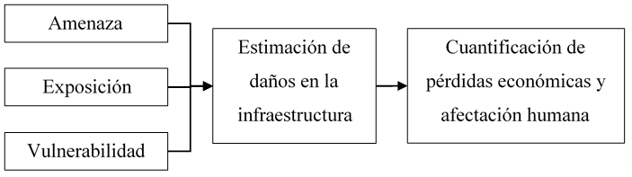

**Figura 2. **Modelo probabilista del riesgo.

Análisis de la amenaza sísmica

El primer paso para el desarrollo de la evaluación del riesgo sísmico es el análisis de la amenaza probabilista. Este análisis permite estimar los niveles de aceleración a las que las edificaciones podrían verse sometidas durante un sismo. Para esto es necesario desarrollar un modelo de aceleración en roca [[16]](#ref-16) y un modelo de aceleración en superficie que tenga en cuenta la amplificación por suelos blandos [[17]](#ref-17). El modelo de amenaza sísmica se representa mediante mapas de distribución de parámetros de intensidad sísmica como la aceleración máxima del terreno o las aceleraciones espectrales para diferentes periodos de vibración y amortiguamiento estructural. Cada uno de estos se evalúa para un conjunto completo de posibles eventos estocásticos que pueden llegar a ocurrir en la zona de influencia teniendo en cuenta los rangos de magnitudes posibles en las diferentes fuentes sísmicas y las distancias relativas entre estas. Cada evento se identifica con la frecuencia media anual de ocurrencia que se obtiene con base en el análisis de la frecuencia de eventos históricos. Para más detalles del procedimiento consultar las referencias [[14]](#ref-14)–[[16]](#ref-16).

Exposición de edificaciones

El modelo de exposición relaciona espacialmente las edificaciones del portafolio con sus características constructivas. El costo y el tiempo asociado para desarrollar el modelo de elementos expuesto varía según la información existente y la resolución definida. En la mayoría de los casos de estudio desarrollados por los autores se ha evidenciado una deficiencia en la información existente, por lo que ha sido necesario llevar a cabo visitas de campo y exploraciones a las escuelas con el fin de obtener datos mínimos. Estas campañas de campo pueden llegar a ser la parte más costosa y dispendiosa del proyecto en caso de que no se cuente con información. Con el fin que los resultados sean útiles para desarrollar el análisis de riesgo, se recomienda que el modelo tenga una resolución a nivel de edificación. Este modelo debe contar con la ubicación de las escuelas, la cantidad de edificaciones, el número de pisos de cada edificación, el material principal, el sistema estructural de resistencia sísmica y gravitacional, y el nivel de diseño sísmico. Este último parámetro se puede clasificar en edificaciones no ingenieriles y edificaciones ingenieriles con nivel de diseño bajo, medio y alto. La definición de cada nivel es particular de cada proyecto y cada país, a manera de ejemplo para el caso colombiano se pueden comparar con los niveles de diseño DMI, DMO y DES de la Norma Sismo Resistente Colombiana - NSR10 [[18]](#ref-18). Este parámetro es uno de los más difíciles de asignar directamente por lo que se debe obtener a partir de correlaciones de otras variables como el año de construcción, el organismo constructor, dimensiones de elementos estructurales y presencia de elementos de detallamiento sísmico, entre otros. 

Para caracterizar estructuralmente las edificaciones se recomienda utilizar el sistema de clasificación taxonómica establecido en el marco de la Librería Global de Infraestructura Escolar (GLOSI por sus siglas en inglés) [[12]](#ref-12). Este sistema de clasificación se diseñó específicamente para catalogar edificaciones escolares y tiene la flexibilidad de la cantidad de información a incluir. El proceso de asignación consiste en clasificar todas las edificaciones escolares mediante la caracterización de los parámetros principales, con estos identificar las edificaciones índice o arquetipo que son aquellas que dominan el portafolio y en estas edificaciones caracterizar los parámetros secundarios y los parámetros intrínsecos como se puede ver en la Figura 3. La cantidad de escuelas a analizar en cada nivel (parámetros principales, secundarios e intrínsecos) debe seleccionarse según las características y las limitaciones de cada proyecto asegurando que las muestras seleccionadas se puedan clasificar como muestras aleatorias representativas. Para más información de esta metodología consultar .

**Figura 3. **Sistema de clasificación taxonómico de la Librería Global para Infraestructura Escolar. Adaptado de GLOSI [[12]](#ref-12). 

Con estos parámetros se debe asignar o generar una función de vulnerabilidad sísmica que represente las características estructurales de la edificación como se mostrará en el siguiente numeral. Teniendo en cuenta lo anterior, para el análisis de riesgo es necesario contar con una base de datos georreferenciada a nivel de edificación que contenga a lo sumo lo siguiente:

Identificación.

Localización.

Valor de reposición.

Función de vulnerabilidad.

Número máximo de estudiantes.

Vulnerabilidad sísmica

La vulnerabilidad sísmica de las construcciones se representa mediante una función que relaciona el valor medio del daño y su varianza (expresado en porcentaje con respecto al valor de reposición del bien) con una medida de intensidad sísmica, como se observa en la Figura 4. La medida de intensidad se puede expresar como la aceleración máxima del terreno o la aceleración espectral para un periodo estructural específico según el comportamiento de la edificación que se evalúa. Utilizando estas curvas es posible cuantificar los daños en edificaciones específicas o en cualquier componente de infraestructura para escenarios sísmicos específicos. 

**Figura 4. **Función de vulnerabilidad típica.

En la literatura se pueden encontrar diferentes catálogos de funciones de vulnerabilidad de edificaciones. Entre las principales fuentes de información se encuentra el programa HAZUS el cual propone una metodología para desarrollar funciones de fragilidad para diferentes tipos de amenazas producida por el FEMA (Agencia Federal para el Manejo de Emergencias por sus siglas en inglés) desde el año 1997 [[19]](#ref-19). Estas funciones de fragilidad se adaptaron y transformaron para el contexto latinoamericano mediante la asignación de pesos relativos para obtener una única función de vulnerabilidad en el marco del proyecto GAR13 [[20]](#ref-20). Estos catálogos se realizaron para diferentes tipos de edificaciones, no necesariamente edificaciones escolares por lo que se debe tener especial cuidado al utilizarlos en este contexto. Teniendo en cuenta esto se recomienda generar funciones particulares para cada proyecto que tengan en cuenta las características constructivas de cada región. Existen diferentes guías metodológicas para la generación de funciones de vulnerabilidad. Entre estas se destacan la iniciativa para la evaluación de vulnerabilidad propuesta por el GEM (Modelo Global de Terremotos) [[21]](#ref-21), la metodología de generación de funciones propuesta por Yamin et al. [[22]](#ref-22) y el GLOSI del Banco Mundial [[13]](#ref-13) entre otros. 

### 2.2.3 Alternativas de reforzamiento estructural

Una vez se ha determinado la vulnerabilidad de cada edificación, es necesario identificar el mecanismo de colapso a partir de un análisis no lineal tridimensional como se indicó anteriormente. Esta identificación permite proponer alternativas de reforzamiento con el fin de reducir la vulnerabilidad. Existen varias limitaciones que deben tenerse en cuenta en este proceso, en particular el cumplimiento de las normativas nacionales que pueden ser más o menos exigentes según el país. Cada país tiene actualmente sus propias normativas que limitan los tipos de reforzamiento. En algunos casos las normas exigen llevar las edificaciones a niveles de desempeño equivalente al de edificaciones nuevas, esto hace que los reforzamientos en ciertos casos no sean costo-efectivos, por lo que se vuelve necesario analizar alternativas como la del reforzamiento incremental en donde la intervención se divide en fases con el fin de reducir la posibilidad de colapso en el menor tiempo y con el menor costo posible para proteger las vidas de los ocupantes [[23]](#ref-23).

Las estrategias de mitigación se pueden dividir en estructurales y no estructurales. Las estructurales son aquellas en las que se intervienen directamente los elementos estructurales y se modifica el comportamiento y los mecanismos de colapso de la edificación. Las intervenciones estructurales pueden enfocarse en rigidizar las estructuras (muros de concreto, contrafuertes, diagonales de acero, etc.) o en darle ductilidad a las estructuras (confinamiento, recubrimiento, rigidización de diafragmas, etc.). Por otro lado, las medidas de mitigación no estructurales se enfocan en asegurar un comportamiento sísmico adecuado de elementos que presenten riesgo a la vida, entre estos están el aseguramiento de cielos rasos, tuberías, estanterías y sistema HVAC (siglas en inglés de Calefacción, Ventilación y Aire Acondicionado) entre otros. Costos aproximados de este tipo de intervenciones se pueden encontrar en Valcárcel et al. [[6]](#ref-6) sin embargo se recomienda realizar presupuesto detallados para cada proyecto. Con el objetivo de asegurar niveles de calidad en los reforzamientos se recomienda seguir normativas internacionales reconocidas, entre las cuales se desatacan las siguientes:

ASCE 41-17 [[24]](#ref-24).

FEMA E-74 [[25]](#ref-25).

British Columbia Ministry of Education [[26]](#ref-26).

FEMA 308 [[27]](#ref-27).

### 2.2.4 Priorización y Planes de Mitigación del Riesgo Sísmico (PMRS)

Los planes de mitigación del riesgo deben desarrollarse a partir de los resultados de los análisis anteriores, pero también deben concertarse con las autoridades locales de cada proyecto. Es fundamental concertar estos planes con el objetivo que su aplicabilidad sea mayor. Los PMRS se deben formular siguiendo los siguientes objetivos, en orden de importancia:

Reducir el riesgo de muerte o accidentes a la comunidad estudiantil.

Reducir los daños en la infraestructura, contenidos, instalaciones y proteger la propiedad.

Beneficiar la mayor cantidad de estudiantes. 

Reducir el tiempo de interrupción de los servicios escolares.

Mejorar la calidad de la infraestructura.

Las edificaciones se pueden dividir en tres grupos principales: edificaciones con riesgo alto de colapso, edificaciones con alto riesgo de sufrir daños, y edificaciones con buen comportamiento. En el primer grupo están las edificaciones que presentan niveles de comportamiento cercanos al colapso para periodos de retorno bajos, en el segundo grupo están las edificaciones que presentan niveles de comportamiento cercanos al colapso para el periodo de retorno de diseño; y en el último, las edificaciones que presentan buen comportamiento para el periodo de retorno de diseño. Dependiendo de las características estructurales de las edificaciones catalogadas en cada uno de los grupos se debe proponer el reemplazo de la edificación, el reforzamiento integral, un reforzamiento estructural menor, el reforzamiento de elementos no estructurales, o ningún reforzamiento. En ciertos casos es posible evaluar un reforzamiento incremental en donde la intervención inicial es menor con el objetivo de reducir el riesgo de muerte o accidentes a la comunidad estudiantil y en una segunda fase se busque reducir daños a la infraestructura y reducir el tiempo de interrupción de los servicios. Esta opción de reforzamiento incremental permite una alternativa a la distribución de recursos, adaptándose a un primer objetivo de reducción de fatalidades o accidentes en el corto y mediano plazo, y el cumplimiento de los demás criterios en segunda instancia, lo cual fortalece la visión de intervenciones en el sector a largo plazo, especialmente desde un punto de vista de políticas públicas para la reducción del riesgo. 

Una vez se tienen identificados los planes, debe realizarse una priorización de las edificaciones a intervenir con el objetivo de reducir la mayor cantidad del riesgo en el menor tiempo posible y con la menor cantidad de recursos. Para este análisis pueden utilizarse diferentes métricas como la Pérdida Máxima Esperada (PAE) o el Beneficio-Costo (B-C). Este último se ha utilizado ampliamente en la literatura en proyectos en el sector educativo para justificar las intervenciones [[6]](#ref-6), [[7]](#ref-7), [[9]](#ref-9), [[28]](#ref-28)–[[30]](#ref-30). Teniendo esto en cuenta, se utiliza una modificación al B-C con el objetivo de usarse como criterio de priorización y utilizar una métrica denominada Eficiencia-Costo (E-C) que relaciona la reducción del riesgo con la cantidad de estudiantes (matrícula), el número de estudiantes beneficiados, el costo del reforzamiento y el costo de oportunidad o interés para traer a valor presente las pérdidas [[14]](#ref-14). Esta métrica puede entenderse como el B-C multiplicado por el número de estudiantes beneficiados. El objetivo de incluir este parámetro en la priorización es dar más importancia a las escuelas más densas, es decir aquellas que concentran más estudiantes en menores áreas, lo cual no se tiene en cuenta al considerar únicamente el criterio del B-C. Para el cálculo de la eficiencia-costo debe dividirse la reducción del riesgo por el costo de oportunidad o interés para obtener los beneficios en valor presente, dividirlo en el costo de la intervención y multiplicarlo por el número de estudiantes como se ve en la siguiente fórmula:

$EC= PAEActual-PAEEstado Mitigado*No. de estudiantes beneficiadosCosto del reforzamiento*Costo de oportunidad$         (1)

## 2.3 TIPOLOGÍAS PREDOMINANTES EN EL SECTOR

El primer paso para la reducción del riesgo en el sector es consolidar el portafolio de edificaciones. Por las características arquitectónicas de este tipo de edificaciones es común encontrar edificaciones cuyas características se repiten en diferentes países. En particular, se ha evidenciado que la mayor parte de estas edificaciones son de concreto reforzado o de mampostería [[6]](#ref-6). En este capítulo se presentan algunas de estas tipologías comunes en el sector escolar. En primer lugar, se presentan las tipologías cuyo sistema estructural es principalmente de concreto reforzado y en después se presentan las tipologías de muros de mampostería.

### 2.3.1 Tipologías de concreto reforzado

Pórticos de concreto reforzado

En este sistema, los muros divisorios no contribuyen a la resistencia lateral o vertical de la edificación. Las divisiones pueden ser ligeras o flexibles como el Drywall por lo que su efecto en el aumento de la rigidez sería despreciable. También se puede dar el caso que las divisiones sean pesadas y rígidas como muros de mampostería, pero estas deben estar dilatadas de la estructura mediante juntas flexibles. En la Figura 5 se identifican ejemplos de este tipo de edificaciones. Estas edificaciones son usualmente de uno y dos pisos y su nivel de diseño es variable.

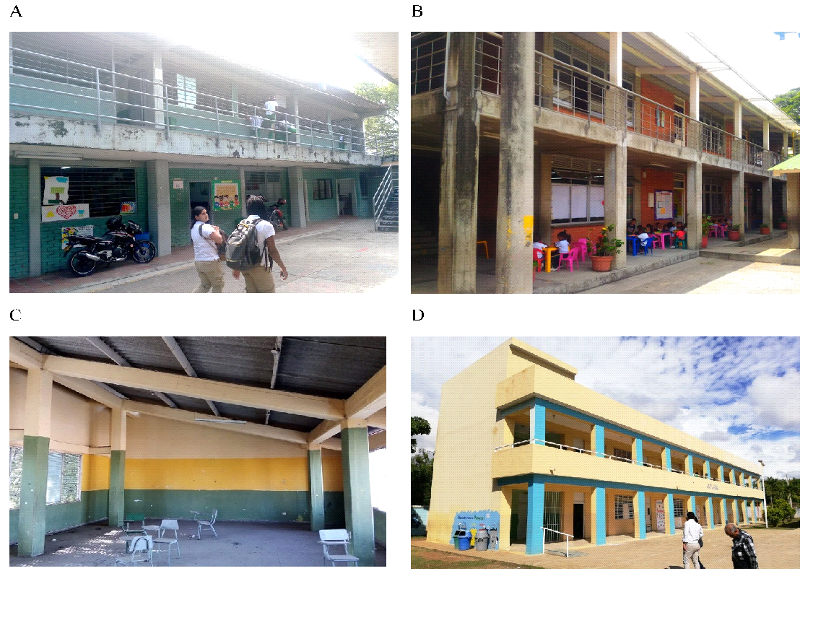

**Figura 5. **Ejemplos de pórticos de concreto reforzado resistente a momento. (**A**) Edificación escolar en Perú. (**B**) Edificación escolar en Colombia. (**C**) Edificación escolar en Colombia. (**D**) Edificación escolar en República Dominicana. Fotos tomadas del GPSS y del archivo personal de los autores.

Pórticos de concreto reforzado con muros de mampostería

En este sistema, los muros divisorios contribuyen a la resistencia lateral y en algunos casos vertical de la edificación. Los muros divisorios se integran al sistema estructural principal y suelen tener un comportamiento frágil. Estas edificaciones tienen alta rigidez en el rango lineal sin embargo suelen tener poca ductilidad. En la Figura 6 se identifican ejemplos de este tipo de edificaciones. Estas edificaciones suelen ser de uno y dos pisos y su nivel de diseño de bajo a medio.

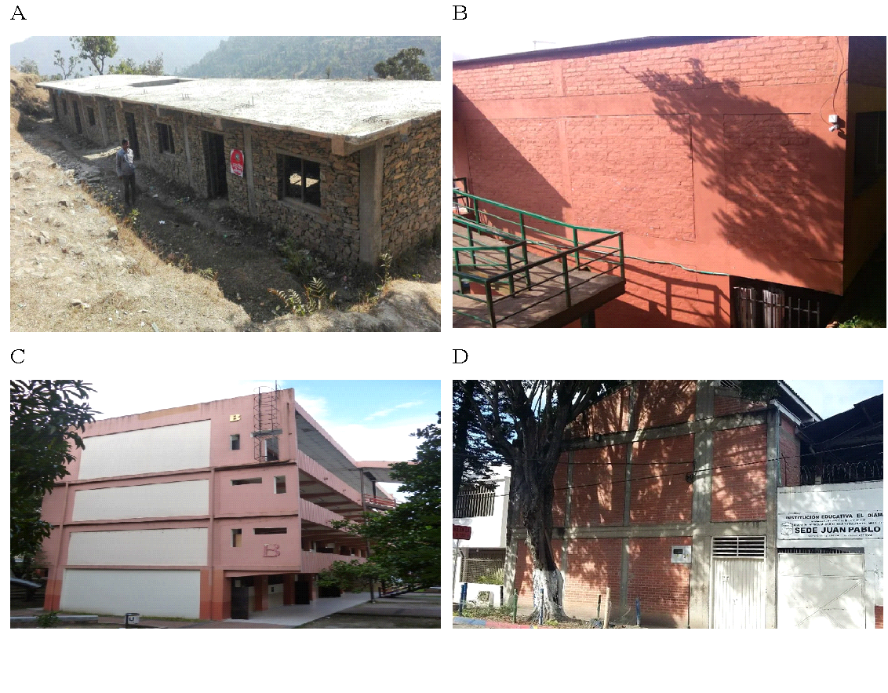

**Figura 6. **Ejemplos de pórticos de concreto reforzado resistente a momento con muros de mampostería integrados. (**A**) Edificación escolar en Nepal. (**B**) Edificación escolar en Colombia. (**C**) Edificación escolar en Colombia. (**D**) Edificación escolar en Colombia. Fotos tomadas del GPSS y del archivo personal de los autores.

Pórticos de concreto reforzado con muros de mampostería generando columna corta

En este sistema, los muros divisorios contribuyen a la resistencia lateral, pero presentan una deficiencia común denominada “columna corta”. Los muros divisorios se integran al sistema estructural principal y suelen tener un comportamiento frágil, sin embargo, inducen a esfuerzos cortantes excesivos a la parte libre de la columna debido a la diferencia de rigideces [[31]](#ref-31). Estas edificaciones presentan una alta vulnerabilidad por su comportamiento frágil [[29]](#ref-29). Este tipo de edificaciones son muy comunes en el contexto de la infraestructura escolar como se verá más adelante. En la Figura 7 se identifican ejemplos de este tipo de edificaciones. Estas edificaciones suelen ser de dos pisos y tener un nivel de diseño bajo a medio.

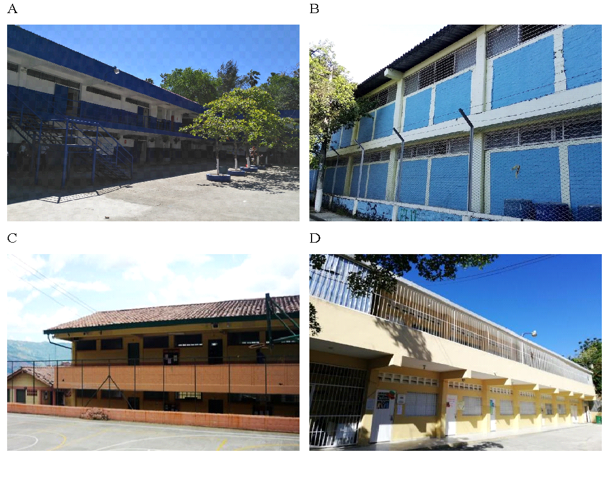

**Figura 7. **Ejemplos de pórticos de concreto reforzado resistente a momento con muros de mampostería generando columna corta. (**A**) Edificación escolar en Perú. (**B**) Edificación escolar en El Salvador. (**C**) Edificación escolar en Colombia. (**D**) Edificación escolar en República Dominicana. Fotos tomadas del GPSS y del archivo personal de los autores.

### 2.3.2 Tipologías de mampostería

Mampostería no reforzada

Son edificaciones construidos con bloque de mampostería de diferentes calidades y materiales que comparten la característica de no tener ningún tipo de confinamiento ni vertical ni horizontal. En Latinoamérica es común encontrar este tipo de edificaciones con mampostería de arcilla, maciza o con perforaciones horizontales [[32]](#ref-32). Este tipo de edificaciones presentan una alta vulnerabilidad sísmica y su comportamiento estructural se caracteriza por ser frágil. En sismos recientes se han presentado colapsos de este tipo de edificaciones [[33]](#ref-33). En la Figura 8 se pueden identificar algunos ejemplos de este tipo de edificaciones, las cuales suelen ser de 1 piso y tener un nivel de diseño sísmico bajo.

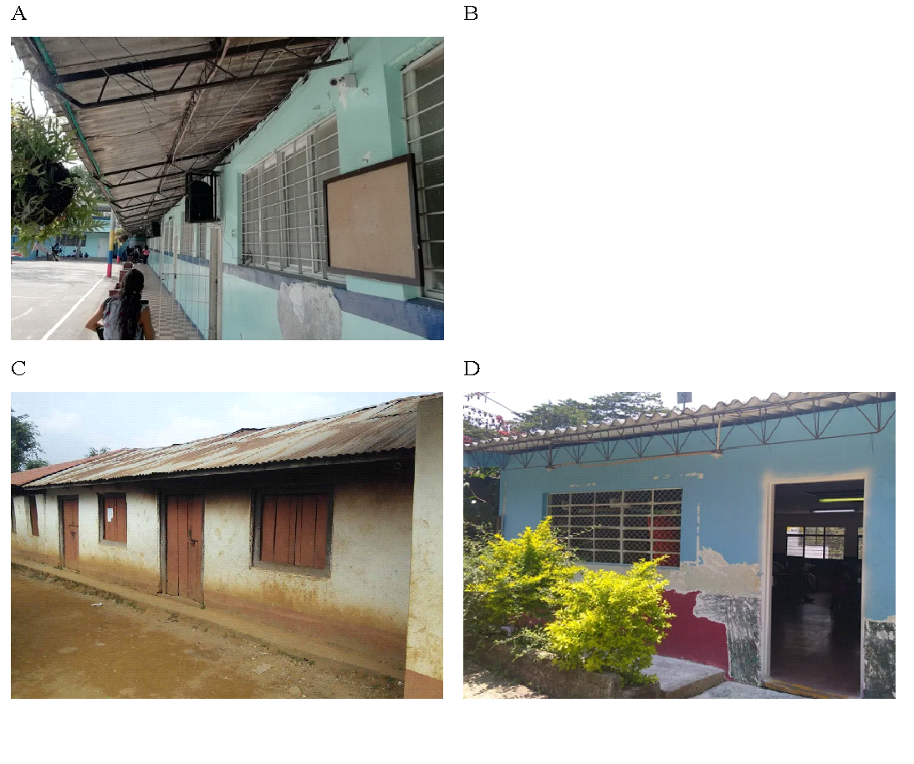

**Figura 8. **Ejemplos de edificaciones de mampostería simple. (**A**) Edificación escolar en El Salvador. (**B**) Edificación escolar en Colombia. (**C**) Edificación escolar en Nepal. (**D**) Edificación escolar en Colombia. Fotos tomadas del GPSS y del archivo personal de los autores.

Mampostería confinada

Son edificaciones cuyo sistema de resistencia sísmica son muros de mampostería confinados por elementos de concreto reforzado vertical y horizontal. El nivel de confinamiento tanto vertical como horizontal es variable según el país y sus normativas de construcción sismo resistente. En Colombia se tiene que los elementos confinantes no deben estar separados a más de 4 metros y deben estar en las aberturas de puertas y ventanas [[18]](#ref-18). Estas edificaciones presentan una mayor ductilidad que las de mampostería no reforzada. En ciertos casos se pueden presentar fallas fuera del plano en este tipo de edificaciones [[34]](#ref-34). En la Figura 9 pueden identificarse ejemplos de este tipo de edificaciones, las cuales suelen ser de uno y dos pisos y tener un nivel de diseño sísmico medio a alto.

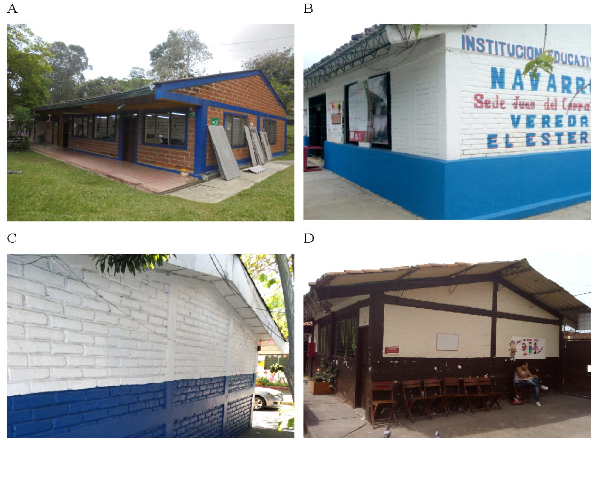

**Figura 9. **Ejemplos de edificaciones de mampostería confinada. (**A**) Edificación escolar en Colombia. (**B**) Edificación escolar en Colombia. (**C**) Edificación escolar en El Salvador. (**D**) Edificación escolar en Colombia. Fotos tomadas del GPSS y del archivo personal de los autores.

Mampostería reforzada

El sistema de mampostería reforzada es un sistema de muros de mampostería con elementos de confinamiento interno. A diferencia del sistema de mampostería confinada, en este sistema los elementos de confinamiento son internos. Los bloques de mampostería son bloque de perforación vertical de arcilla o de concreto, usualmente de buena calidad. Este sistema se ha implementado ampliamente en países de Centroamérica como El Salvador, en donde se ha evidenciado un buen comportamiento sísmico [[35]](#ref-35). En la Figura 10 pueden identificarse algunos ejemplos de este tipo de edificaciones. Suelen ser de uno y dos pisos y tener un nivel de diseño sísmico medio a alto.

**Figura 10. **Ejemplos de edificaciones de mampostería reforzada. (**A**) Edificación escolar en Colombia. (**B**) Edificación escolar en El Salvador. (**C**) Edificación escolar en El Salvador. (**D**) Edificación escolar en construcción en El Salvador. Fotos tomadas del GPSS y del archivo personal de los autores.

::: {#box1 .callout-important style="background-color: #e3f0fbff; padding:20px; border: none !important;" appearance="minimal" icon="false"}
**Caja 1.** Tipologías escolares en concreto reforzado y en mampostería  Tipologías escolares principales en concreto reforzado: Pórticos de concreto reforzado. Pórticos de concreto reforzado con muros de mampostería. Pórticos de concreto reforzado con muros de mampostería generando columna corta. Tipologías escolares predominantes en mampostería: Mampostería no reforzada. Mampostería confinada. Mampostería reforzada.
:::

## 2.4 CASOS DE ESTUDIO

### 2.4.1 Cali, Colombia

La Universidad de los Andes, en el marco del Programa Global de Escuelas Seguras (GPSS) del Banco Mundial, realizó el acompañamiento técnico a la Alcaldía de Cali con el objetivo de diseñar un plan de intervención a corto, mediano y largo plazo para reducir la vulnerabilidad de la infraestructura educativa del Municipio de Cali frente a amenazas naturales y cambio climático en el marco de la política de Mejoramiento de Ambientes Escolares del Municipio de Cali.

En este proyecto los autores capacitaron a un grupo de ingenieros y arquitectos de la Alcaldía de Cali para realizar recolección de información de la infraestructura en todas las escuelas del municipio. A partir de la información recopilada, se compila una base de datos de infraestructura a nivel de edificación que incluye información del valor expuesto, la ocupación humana y la caracterización de su vulnerabilidad sísmica para todos los elementos del portafolio. La Figura 11 presenta la distribución espacial de 372 sedes educativas del municipio y su sistema estructural asociado. 

**Figura 11. **Distribución espacial del portafolio escolar de Cali.  PCR corresponde a pórticos de concreto reforzado.

Como resultado final del procesamiento de la información y los datos del levantamiento en campo, se obtienen resultados generales con el fin de caracterizar el modelo de exposición escolar del municipio de Cali. A continuación, se muestra el resumen de la información obtenida:

Número total de sedes educativas: 373.

Número total de edificaciones: 1,224.

Ocupación total: 92,013.

Área construida: 417,220 m2.

Valoración total aproximada del portafolio: COP $900,000 millones.

Área promedio por estudiante: 2.97 m2/estudiante.

La distribución de las tipologías constructivas en la zona de estudio se presenta en la Figura 12. Se puede observar que la mayor parte de las edificaciones se clasifican en dos grandes grupos correspondientes a edificaciones de concreto reforzado y de mampostería. Las tipologías clasificadas como “Otros” son tipologías de madera, acero, tapia y prefabricados, estos no se presentan en detalle en este documento pues no son tipologías predominantes en el portafolio, para más información con respecto a esta consultar: [[36]](#ref-36).

**Figura 12. **Distribución de tipologías constructivas en Cali.

Por otro lado, la Figura 13 presenta la distribución de los sistemas estructurales en la zona, los cuales representan un subgrupo de las tipologías constructivas predominantes identificadas. En el caso de las edificaciones de concreto reforzado, el portafolio se constituye principalmente por pórticos de concreto reforzado con muros de mampostería adosados y pórticos de concreto reforzado con muros de mampostería adosados susceptibles a falla por columna corta. Para el caso de edificaciones de mampostería, se el portafolio se constituye únicamente por edificaciones de mampostería simple y mampostería confinada.

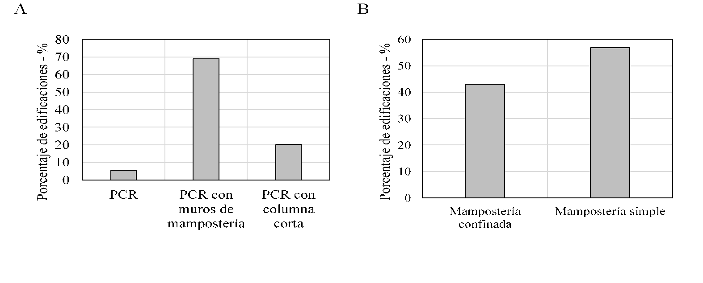

**Figura 13. **Distribución de características estructurales en Cali. (**A**) Tipologías de concreto reforzado. (**B**) Tipologías de mampostería. PCR corresponde a pórticos de concreto reforzado.

Adicionalmente, se incluye una revisión adicional de elementos estructurales que no hacen parte del sistema de resistencia sísmica, pero que ante un evento pueden ser un riesgo para la seguridad a la vida de los ocupantes, como se puede ver en la Figura 14. Para cada uno de los elementos mencionados, se define si éste existe o no, y su estado. A partir de estas calificaciones, se proponen unas intervenciones secundarias las cuales deben ser aplicadas progresivamente con el reforzamiento sísmico.

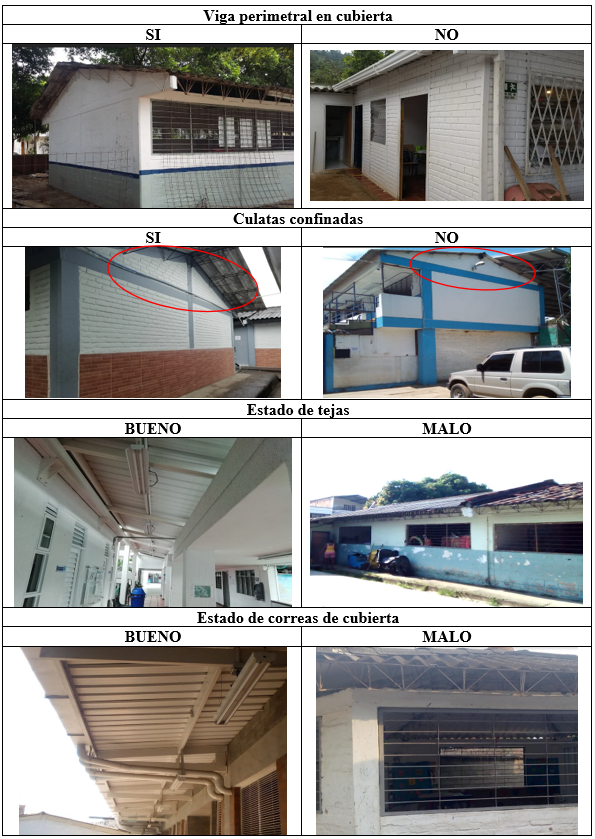

**Figura 14. **Parámetros estructurales complementarios [[36]](#ref-36).

Para el desarrollo del modelo probabilista de amenaza sísmica en la zona de estudio, se incluyen las fallas sísmicas con sus parámetros de sismicidad asociados, y la caracterización de los suelos de acuerdo con los resultados del Estudio de Microzonificación Sísmica de Santiago de Cali realizada en 2006. A partir de este modelo es posible obtener también mapas probabilistas de aceleración en superficie para diferentes periodos de retorno y diferentes periodos estructurales. En la Figura 15 se presentan las fuentes superficiales y corticales, un escenario del catálogo de eventos estocásticos y el mapa probabilista de aceleración del terreno para un periodo de retorno de 475 años.

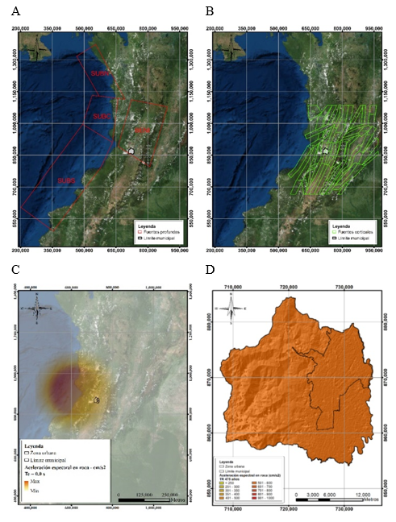

**Figura 15. **Modelo de amenaza sísmica para Cali. (**A**) Fuentes profundas. (**B**) Fuentes superficiales. (**C**) Ejemplo de escenario del catálogo. (**D**) Mapa de aceleración probabilista en el terreno para 475 años de periodo de retorno. Mapas tomados de CIMOC-Uniandes [[36]](#ref-36).

Para el desarrollo del modelo de vulnerabilidad se realizaron modelaciones no lineales de las tipologías predominantes con las cuales se obtuvieron los parámetros de demanda sísmica mediante un análisis incremental dinámico. Las funciones de vulnerabilidad de las tipologías predominantes para un nivel de diseño bajo se presentan en la Figura 16. Estas funciones no son directamente comparables, dado que representan edificaciones con periodos estructurales diferentes, y por ende niveles de amenaza distintos. Sin embargo, permiten identificar el nivel de vulnerabilidad asociado a las tipologías analizadas. 

**Figura 16. **Ejemplo de funciones de vulnerabilidad utilizadas para la evaluación del riesgo del Cali. Figura adaptada de CIMOC-Uniandes [[36]](#ref-36). 

Con la información indicada anteriormente, se evaluó el desempeño y las perdidas esperadas ante un evento sísmico en un periodo de retorno dado. Los resultados del riesgo sísmico para el portafolio escolar del municipio en las condiciones actuales se muestran en Figura 17. En esta, se puede observar que las pérdidas máximas probables para un periodo de retorno de 500 años son del orden de $250,000 millones COP mientras que para un periodo de retorno de 1000 años son del orden de $300,000 millones COP. La magnitud de estos resultados demuestra la necesidad de realizar un reforzamiento estructural que permita reducir la magnitud de estas pérdidas. 

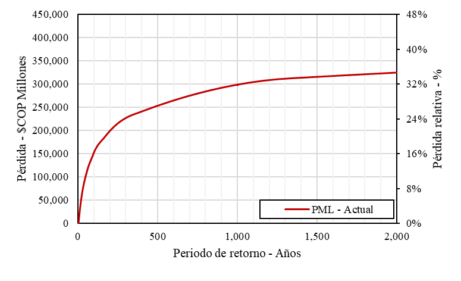

**Figura 17. **Curva de pérdida máxima probable para el portafolio escolar en Cali.

Además de las pérdidas económicas indicadas anteriormente, el reforzamiento estructural es necesario dada la alta vulnerabilidad de tipologías presentes en la zona de estudio, que un 54% de las edificaciones fueron construidas antes de 1986 año en el cual se hizo la primera norma de sismo resistencia en el país, y que de acuerdo con un análisis de desempeño sísmico realizado para un periodo de retorno de 475 años un 80% de las edificaciones quedan en prevención al colapso [[37]](#ref-37). Por tal motivo, se realizaron las propuestas de reforzamientos estructurales y adecuaciones del portafolio escolar mediante una estrategia de intervención progresiva de las instituciones. Para esto se generaron los siguientes programas y estrategias de intervención con el fin de reducir el riesgo sísmico del portafolio escolar:

Programa 1 - Demolición y construcción de aulas temporales: Se incluyen edificaciones con nivel de diseño sísmico pobre y sistemas estructurales precarios o no ingenieriles, cuyas intervenciones estructurales son muy invasivas, por lo que se recomienda la reconstrucción. Se busca proteger la vida y el riesgo de accidentes a los ocupantes con estos reemplazos.

Programa 2 - Reforzamiento prioritario: Se incluyen edificaciones de pórticos de concreto reforzado y mampostería simple con nivel de diseño bajo cuyo reforzamiento sísmico es económicamente viable. Se busca proteger la vida y reducir el tiempo de interrupción del servicio.

Programa 3 - Adecuaciones contingentes: Se incluyen edificaciones de pórticos de concreto reforzado, mampostería simple y mampostería confinada con nivel de diseño bajo o medio cuyo reforzamiento sísmico es menor. Se busca reducir el tiempo de interrupción del servicio y mejorar la infraestructura.

Programa 4 - Mejoramiento y adecuaciones: Se incluyen las edificaciones con nivel de diseño sísmico medio o alto que cumplan con la norma, cuya intervención es principalmente en elementos no estructurales y adecuaciones. Se busca mejorar la infraestructura educativa.

La Tabla 4 resume el número de edificaciones e inversión requerida para cada uno de los programas descritos para el portafolio. Como se puede identificar, se incluyen intervenciones en todo el portafolio, aunque en algunos casos se consideran intervenciones menores de adecuación y mejoramiento.

**Tabla 4. **Planes de mitigación del riesgo en Cali [[36]](#ref-36).

| Programa de intervención | Programa de intervención | Número de edificaciones | Costo aproximado total de intervención  (COP$ millones) |
| --- | --- | --- | --- |
| Programa 1 | Programa de demolición y  aulas temporales | 313 | $220,000 |
| Programa 2 | Programa de reforzamiento prioritario | 100 | $85,000 |
| Programa 3 | Programa de adecuaciones contingentes | 752 | $330,000 |
| Programa 4 | Programa de mejoramiento, ampliaciones y reposición | 58 | $3,000 |
| Total | Total | 1,223 | $638,000 |

Los resultados del riesgo sísmico para el portafolio escolar del municipio luego de aplicar el reforzamiento planteado se muestran en Figura 18. Se puede observar que para un periodo de retorno de 500 años se presenta una reducción del riesgo de más del 50%. Es importante resaltar que estas intervenciones no aseguran un nivel de riesgo cero, sin embargo, reducen significativamente la susceptibilidad de daño y la probabilidad de heridos.  Este riesgo residual puede ser gestionado mediante cobertura financieras, sistema de alerta temprana y planes de emergencias entre otros.

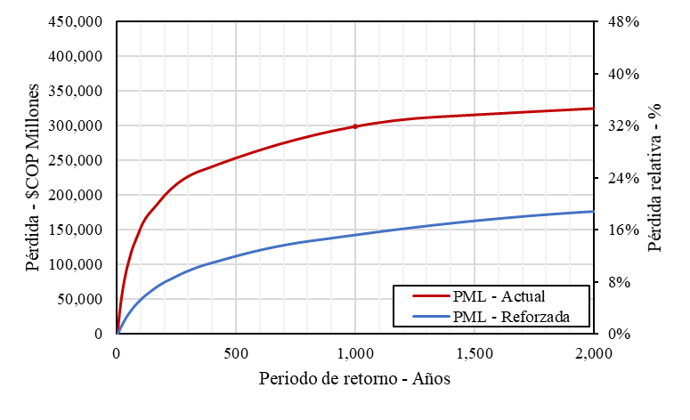

**Figura 18. **Curva de pérdida máxima probable para el portafolio escolar en el estado actual vs. estado reforzado en Cali

Por último, con el objetivo de priorizar los recursos se utilizó el criterio de eficiencia costo indicado en secciones anteriores. A partir de éste es posible identificar el orden óptimo de intervención de las escuelas con el objetivo de maximizar el número de estudiantes beneficiados como se presenta en la Figura 19.

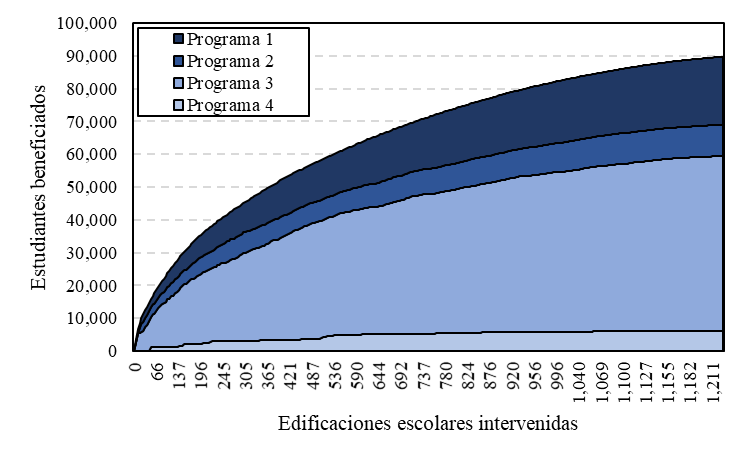

**Figura 19. **Priorización de intervenciones por programas en Cali.

### 2.4.2 Valle de Aburrá, Colombia

Mediante el convenio de asociación 1108 de 2016 entre la Universidad de los Andes y el Área Metropolitana del Valle de Aburra (AMVA) se realizó el estudio de la vulnerabilidad y riesgo sísmico de las edificaciones del sector escolar en los diez municipios del Valle de Aburrá. El objetivo principal fue identificar las intervenciones estructurales y no estructurales requeridas en cada una de estas edificaciones, y con base en esto diseñar un Plan de Mitigación del Riesgo Sísmico como parte del Plan Metropolitano del Riesgo Sísmico desarrollado por el AMVA. El plan incluía, entre otras cosas, las propuestas preliminares de intervención, la información básica para la eventual contratación de las obras identificadas, el presupuesto aproximado requerido y una programación tentativa de actividades para la contratación y ejecución de las obras.

En este proyecto, con el fin de seleccionar las edificaciones de interés se realizó una depuración de las bases de datos oficiales proporcionadas por las entidades gubernamentales correspondientes, tales como las secretarías de educación de los diferentes municipios y el AMVA. A partir de esto se obtuvo una base de datos con los colegios y escuelas públicas y privadas en zonas urbanas de niveles de educación básica primaria, básica secundaria, y educación media. Dentro de la información recopilada se encuentran los registros oficiales del número de estudiantes matriculados, el tipo de servicio (público y privado), así como los niveles de educación impartida. A partir de la información recopilada en registros oficiales fue posible realizar una caracterización general del sector para obtener estadísticas de las edificaciones expuestas, identificando que el inventario de centros educativos se conforma por un total de 460 colegios públicos y 227 colegios privados, para un total de 687 sedes educativas municipales. 

En este estudio se consideró únicamente una muestra de 200 escuelas públicas que fueron inspeccionadas. Se seleccionaron únicamente escuelas públicas dado que se enfoca a la elaboración de planes de mitigación a cargo de los gobiernos nacionales y locales. En la Figura 20 se presenta la distribución espacial de las instituciones educativas del Valle de Aburrá.

**Figura 20. **Distribución de instituciones educativas en los municipios del Valle de Aburrá.

Se realizaron visitas de campo con el objetivo de identificar el sistema estructural de las instituciones educativas públicas ubicadas en las zonas urbanas de los municipios del Valle de Aburrá e identificar las tipologías constructivas dominantes. A continuación, se muestra el resumen de la información obtenida para la muestra de escuelas públicas:

Número total de sedes educativas: 200.

Número total de edificaciones: 883.

Ocupación total: 142,778.

Área construida: 669,630 m2.

Valoración total aproximada del portafolio: COP $1,625,000 millones.

Área promedio por estudiante: 4.69 m2/estudiante.

En la Figura 21 presenta la distribución de las tipologías constructivas identificadas en las inspecciones visuales, donde se observa que los sistemas dominantes son las edificaciones construidas en concreto reforzado y en mampostería.

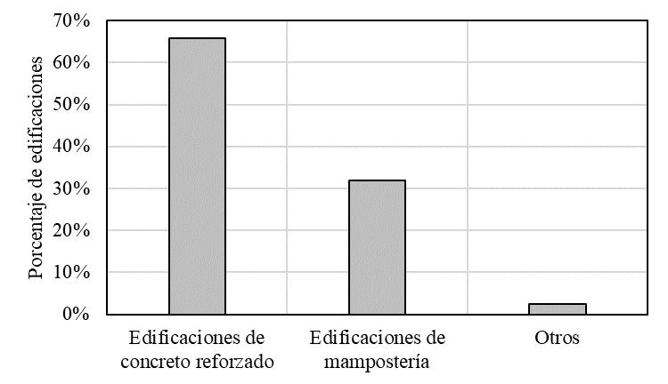

**Figura 21. **Distribución de tipologías constructivas identificadas en campo en el Valle de Aburrá.

Además, se observa que el mayor porcentaje de estructuras son construidas en pórticos de concreto reforzado con muros de mampostería, pórticos de concreto reforzado con muros de mampostería que generan columna corta y edificaciones de mampostería no reforzada, donde este último caso representa un porcentaje importante de las edificaciones del portafolio del sector educativo. La Figura 22 presenta la distribución relativa de las tipologías constructivas.

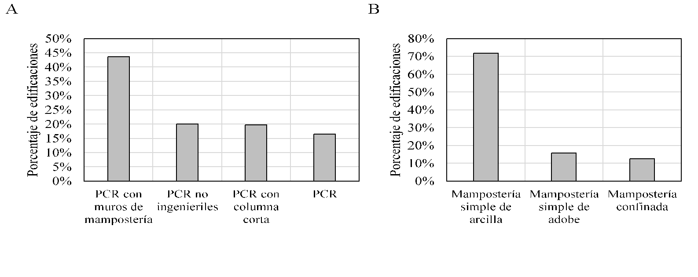

**Figura 22. **Distribución de sistemas estructurales en el Valle de Aburrá. (**A**) Tipologías de concreto reforzado. (**B**) Tipologías de mampostería. PCR corresponde a pórticos de concreto reforzado.

En cuanto a las condiciones desfavorables observadas en las edificaciones durante el levantamiento en campo, se encontró que las edificaciones visitadas presentaban agrietamientos, asentamientos, baja calidad de materiales, deflexiones, entre otras. En la Figura 23 se presenta un registro fotográfico representativo de las condiciones desfavorables observadas.

**Figura 23. **Condiciones desfavorables observadas en algunas edificaciones en el Valle de Aburrá. (**A**) Agrietamiento de muros. (**B**) Pérdida de concreto de recubrimiento. (**C**) Deficiencias constructivas. (**D**) Deficiencias de diseño.

El siguiente paso fue el desarrollo del modelo probabilista de amenaza sísmica en la zona del Valle de Aburrá. Para esto, se identificaron las fuentes sísmicas de la zona de estudio a partir de los resultados indicados en el estudio de Armonización de la microzonificación sísmica de los municipios del Valle de Aburrá [[38]](#ref-38). A partir de las fuentes sísmicas, se desarrolló un catálogo estocástico de eventos para la evaluación probabilista del riesgo y se desarrollaron mapas probabilistas para diferentes periodos de retorno y diferentes periodos estructurales. En la Figura 24 se presentan las fuentes sísmicas superficiales y corticales definidas, así como un escenario del catálogo y el mapa probabilista de aceleración del terreno para un periodo de retorno de 475 años.

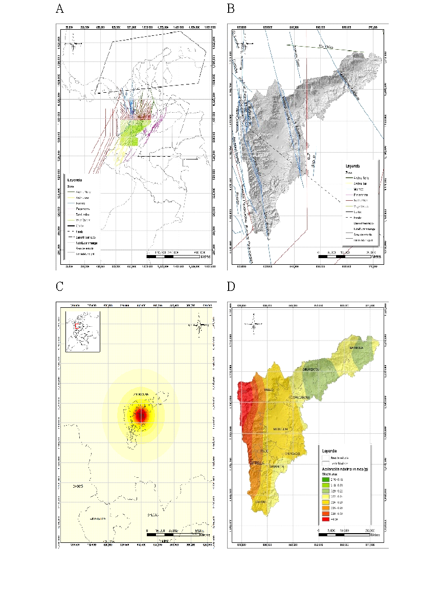

**Figura 24. **Modelo de amenaza sísmica para el Valle de Aburrá. (**A**) Fuentes profundas (modelo nacional). (**B**) Fuentes superficiales. (**C**) Ejemplo de escenario del catálogo. (**D**) Mapa de aceleración probabilista en el terreno para 475 años de periodo de retorno. Mapas tomados de CIMOC-Uniandes [[38]](#ref-38).

Las funciones de vulnerabilidad de las tipologías predominantes fueron desarrolladas de acuerdo con la metodología descrita en la sección 2.2.4, y se presentan en la Figura 25. Estas funciones no son directamente comparables, dado que representan edificaciones con periodos estructurales diferentes, y por ende niveles de amenaza distintos. Sin embargo, permiten identificar el nivel de vulnerabilidad asociado a las tipologías analizadas. 

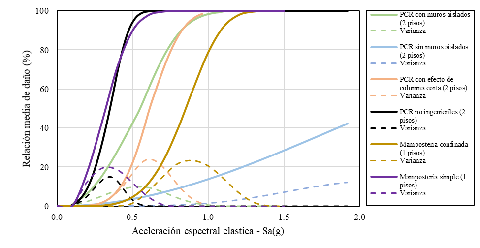

**Figura 25. **Ejemplo de funciones de vulnerabilidad utilizadas para la evaluación del riesgo del Valle de Aburrá. Figura adaptada de CIMOC-Uniandes [[38]](#ref-38).

Posteriormente se evaluaron las pérdidas probables esperadas ante un evento sísmico en un periodo de retorno dado. Los resultados del riesgo sísmico para el portafolio escolar del municipio en las condiciones actuales se muestran en Figura 26. En esta se observa que para un periodo de retorno de 500 años se esperan pérdidas máximas probables del orden de $450,000 millones COP mientras que para un periodo de retorno de 1,000 años se esperan pérdidas del orden de $600,000 millones COP. Al igual que en el caso de estudio anterior, se establece que es necesario realizar un programa de reforzamiento estructural que reduzca la magnitud de las pérdidas.

**Figura 26****. **Curva de pérdida máxima probable para el portafolio escolar en el Valle de Aburrá.

Adicional a lo anterior, el reforzamiento estructural es necesario dada la necesidad de brindar la total seguridad a los estudiantes y prevenir que se vea afectada la vida de cada uno de ellos. Por tal motivo, se realizaron reforzamientos estructurales del portafolio escolar con una estrategia de intervención progresiva de las instituciones. Por lo tanto, se plantearon las siguientes estrategias de intervención, basadas en las agrupaciones indicadas anteriormente:

Programa 1 – Sustitución de edificaciones de alto riesgo de colapso.

Programa 2 – Reforzamiento integral de edificaciones con bajo potencial de daño.  

Programa 3 – Reforzamiento contingente especial de edificaciones con alto riesgo de sufrir daños. 

Programa 4 – Reforzamiento integral de edificaciones con alto riesgo de sufrir daños.

Además, para cada una de las tipologías de edificaciones que presentan niveles medios o altos de vulnerabilidad se proponen esquemas y opciones generales de reforzamiento estructural que permitan la reducción considerable de la vulnerabilidad sísmica. A manera de ejemplo, se presentan alternativas de reforzamiento de edificaciones de concreto reforzado que presenten columna corta y de mampostería simple en la Figura 27. Estas alternativas de reforzamiento buscan eliminar el problema de columna corta y darle rigidez a la estructura para el caso del ejemplo de concreto y de darle ductilidad a la edificación en el caos de mampostería simple. Este tipo de soluciones se desarrollaron para cada una de las tipologías predominantes, para mayor información consultar [[36]](#ref-36).

**Figura 27. **Esquemas generales de reforzamiento estructural. (**A**) Reforzamiento de pórticos de concreto. (**B**) Reforzamiento de edificaciones de mampostería [[39]](#ref-39).

La Tabla 5, resume el número de edificaciones e inversión requerida para cada uno de los programas descritos para el portafolio.

**Tabla 5. **Planes de mitigación del riesgo en el Área Metropolitana del Valle de Aburrá [[39]](#ref-39).

| Programa de intervención | Programa de intervención | Número de edificaciones | Costo aproximado de intervención  (COP$ millones) |
| --- | --- | --- | --- |
| Programa 1 | Sustitución de edificaciones de alto riesgo de colapso | 162 | 350,000 |
| Programa 2 | Reforzamiento integral de edificaciones con bajo potencial de daño | 86 | 30,000 |
| Programa 3 | Reforzamiento contingente especial de edificaciones con alto potencial de daño | 238 | 70,000 |
| Programa 4 | Reforzamiento integral de edificaciones con alto potencial de daño | 333 | 200,000 |
| Total | Total | 819 | 650,000 |

Teniendo en cuenta las estrategias de mitigación del riesgo y los reforzamientos estructurales implementados en cada una de las tipologías constructivas, en la Figura 28 se presentan los resultados del riesgo sísmico para el portafolio escolar del municipio. Se puede identificar que la reducción del riesgo en este caso es mayor a la reducción identificada para el caso de Cali, bajando las pérdidas para un periodo de retorno de 1,000 años alrededor del 20% de las pérdidas en el estado actual.

**Figura 28. **Curva de pérdida máxima probable para el portafolio escolar en el estado actual vs. estado reforzado en el Valle de Aburrá.

Por último, con el objetivo de priorizar los recursos se utilizó el criterio de eficiencia costo indicado anteriormente. A partir de éste es posible ordenar las intervenciones con el objetivo de maximizar el número de estudiantes beneficiados. En la Figura 29 se presenta la reducción de las Pérdidas Anuales esperadas si se sigue el criterio de priorización de eficiencia. En esta gráfica se observa que, a diferencia del caso de Cali, se tiene una reducción mayor para las primeras escuelas mostrando que el riesgo se concentra en unas tipologías y no se distribuye en todo el portafolio. Esto permite que los recursos se utilicen de forma eficiente, reduciendo la mayor cantidad de riesgo para las limitaciones de recursos económicos existentes.

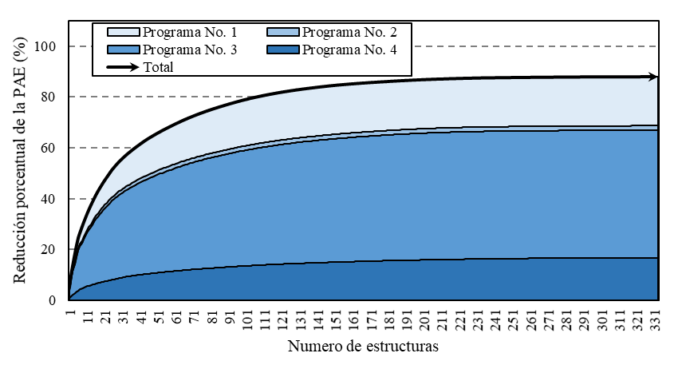

**Figura 29. **Priorización de intervenciones por programas en el Valle de Aburrá.

## 2.5 CONCLUSIONES

Existen diferentes metodologías para el desarrollo de planes de mitigación del riesgo en el sector escolar. Para esto el primer paso es desarrollar una base de datos con información suficiente para caracterizar el portafolio de infraestructura expuesta. Este paso es uno de los más importantes pues su resolución y calidad determinarán la resolución y la calidad del plan de mitigación del riesgo. Se han identificado diferentes tipologías de concreto reforzado y mampostería en diferentes partes del mundo con deficiencias constructivas y estructurales similares. Entre estas se destacan las edificaciones de pórticos de concreto reforzado, de pórticos de concreto reforzado con muros de mampostería y pórticos de concreto reforzado con muros de mampostería generando columna corta. En las edificaciones de muros de mampostería se destacan las edificaciones de mampostería simple, mampostería confinada y mampostería reforzada. La documentación de estas deficiencias y también de técnicas de reforzamiento permite sentar las bases para futuros proyectos en los cuales se analicen edificaciones similares.

Una vez se identifican el portafolio y las tipologías principales se debe desarrollar una evaluación del riesgo sísmico en el estado actual y a partir de este diseñar un sistema de reforzamiento sísmico para las tipologías vulnerables más relevantes o representativas. Una vez se tienen identificadas estas medidas se debe evaluar el riesgo en un escenario mitigado y a partir de esto diseñar planes de mitigación del riesgo ajustados a las limitaciones de cada caso de estudio. En este documento se presentan dos casos de estudio en Colombia, el primero en Cali y el segundo en el Valle de Aburrá. Se puede identificar que la reducción del riesgo para las estrategias de mitigación del Cali lleva a una reducción menor que el caso del Valle de Aburrá, reduciendo el riesgo en el primer caso al 50% del riesgo original y en el segundo al 20%. Así mismo, es posible identificar a partir de las gráficas de priorización que el riesgo en el portafolio de Cali se distribuye en todo el portafolio mientras que en el caso del Valle de Aburrá se concentra en alrededor de la mitad de las escuelas. Como se puedo identificar, cada caso presentado tiene sus particularidades sin embargo es posible identificar que el desarrollo comparte elementos comunes, en particular deficiencias en las tipologías constructivas y medidas de reforzamiento aplicables.

Existe una gran cantidad de trabajo por desarrollar en proyectos similares a los casos de estudio presentados. Como se puedo evidenciar, existen limitaciones de esta metodología con respecto a incertidumbres en los modelos de amenaza, vulnerabilidad y exposición que deben ser estudiados a mayor profundidad. Por otro lado, es necesario ampliar el espectro de amenazas e incluir otro tipo de eventos, entre ellos eventos de carácter hidrometeorológico como los huracanes y las inundaciones. Adicionalmente es necesario entender las métricas de riesgo y definir unos parámetros indicativos con el objetivo limitar posibles errores en los procedimientos. Por último, es necesario identificar y evaluar la vulnerabilidad de tipologías vulnerables menos recurrentes como las de acero o madera con el objetivo de desarrollar planes a menor escala.  

Los resultados de los casos de estudio presentados como ejemplo son el punto de partida para la definición concreta de planes concertados con las autoridades locales y/o nacionales para su implementación. A partir de estos, y basados en un presupuesto disponible, es posible definir y listar en orden de importancia o relevancia, las intervenciones que se deberán priorizar para maximizar la reducción del riesgo con los recursos limitados. Adicionalmente, se deberán considerar factores como procesos constructivos que puedan implementarse a mayor escala, esquemas de contratación según especialidad o tipo de intervención, tipificación de las intervenciones buscando alcanzar un nivel de reducción de riesgo definido, pero remitiendo la adaptabilidad a las condiciones particulares de cada edificación, entre otros.

::: {#puntos-clave-1 .callout-important style="background-color: #f4ebffff; padding:20px; border: none !important;" appearance="minimal" icon="false"}
**Puntos clave.** Las edificaciones de pórticos de concreto, pórticos de concreto con muros de mampostería y pórticos de concreto con muros de mampostería generando columna corta son las tipologías escolares predominantes de concreto reforzado. Las edificaciones de muros de mampostería no reforzada, mampostería confinada y mampostería reforzada son las tipologías escolares predominantes de mampostería. Se debe analizar el estado de la infraestructura actual mediante un análisis de riesgo, incluyendo los módulos de amenaza, exposición y vulnerabilidad. Se recomienda que el modelo de exposición sea a nivel de edificación. Cada elemento del modelo debe contar con información estructural suficiente para caracterizar su comportamiento estructural. Se deben identificar los mecanismos de colapso de las edificaciones y generar sistemas de reforzamiento que sean aplicables a gran escala en edificaciones con comportamiento estructural similar. Se deben plantear estrategias de intervención particulares para las tipologías que incluyan el reemplazo de las edificaciones, reforzamientos integrales, reforzamientos incrementales, reforzamientos en elementos no estructurales o adecuaciones menores. Las intervenciones deben ser priorizadas utilizando criterios adecuados como la eficiencia costo con el objetivo de beneficiar la mayor cantidad de estudiantes reduciendo el mayor riesgo posible.
:::
::: {#recomendaciones-1 .callout-important style="background-color: #fff0f3ff; padding:20px; border: none !important;" appearance="minimal" icon="false"}
**Recomendaciones para tomar decisiones.** El modelo de exposición determina la calidad de los planes de mitigación, es necesario que el modelo tenga una resolución mínima a nivel de escuela y una resolución ideal a nivel de edificación. La evaluación del riesgo sísmico en el estado actual y mitigado deben evaluarse utilizando la misma metodología, modelos de amenaza y modelos de exposición con el objetivo que sean comparables. La participación de entidades gubernamentales en el desarrollo del plan de mitigación es esencial. Un adecuado entendimiento del componente técnico e identificación anticipada de limitaciones permitirán una implementación exitosa del plan. Se debe tener en cuenta que los ciclos de gobierno particulares pueden afectar el desarrollo y la implementación de los planes diseñados.
:::
## 2.6 CONFLICTO DE INTERESES

Los autores no declaran conflicto de intereses.

## 2.7 AGRADECIMIENTOS

Los autores agradecen en primer lugar al Banco Mundial y en particular al equipo de trabajo del Programa Global de Escuelas Seguras (GPSS) por impulsar iniciativas de reducción del riesgo en el sector escolar. Así mismo, agradecen a la Alcaldía de Santiago de Cali por el desarrollo de la Asistencia técnica para el diseño de una estrategia de intervención y un plan de inversión para la reducción de la vulnerabilidad sísmica de edificaciones educativas en el municipio de Cali, y al Área Metropolitana del Valle de Aburrá por el desarrollo conjunto del Convenio de Asociación 1108 del 2016. Adicionalmente, los agradecimientos se extienden a los integrantes del Centro de Investigación en Materiales y Obras Civiles de la Universidad de los Andes que participaron en el desarrollo de los proyectos mencionados anteriormente.

## 2.8 IDENTIFICACIÓN DEL AUTOR

Rafael Fernández	

Luis Yamin		

Juan Carlos Reyes	

Angie García		

Gustavo Fuentes	

Juan Echeverry	

**BIBLIOGRÁFIA**

1. ICC (International Code Council). (2017). *2018 International Building Code*. International Code Council, Incorporated.

2. EERI (Earthquake Engineering Research Institute). (2019). *Concrete Buildings Damaged in Earthquakes*. Recuperado de

3. Chen, H., Xie, Q., Lan, R., Li, Z., Xu , C., & Yu, S. (2017). Seismic damage to schools subjected to Nepal earthquakes, 2015. *Natural Hazards*, 88(1), 247–84.

4. GEER. (2017). Geotechnical engineering reconnaissance of the 19 September 2017 mw 7.1 Puebla-Mexico City earthquake (September). *Geotechnical Extreme Events Reconnaissance Association*.

5. GEER. (2016). GEER-ATC earthquake reconnaissance April 16th 2016, Muisne, Ecuador. *Geotechnical Extreme Events reconnaissance Association Report* GEER-049. 604. Recuperado de

6. Valcárcel, J.A., Mora, M.G., Cardona, O.D., Pujades, L.G., Barbat, A.H., & Bernal, G.A. (2013) Methodology and applications for the benefit cost analysis of the seismic risk reduction in building portfolios at broadscale. *Natural Hazards*, 69(1), 845–68.

7. Mora. M.G., Valcárcel, J. A., Cardona, O.D., Pujades, L. G., Barbat, A. H., & Bernal, G. A. (2015) Prioritizing interventions to reduce seismic vulnerability in school facilities in Colombia. *Earthquake Spectra*, 31(4), 2535–52.

8. Chrysostomou, C. Z., Kyriakides, N., Papanikolaou. V. K., Kappos, A. J., Dimitrakopoulos, E. G., & Giouvanidis, A. I. (2015). Vulnerability assessment and feasibility analysis of seismic strengthening of school buildings. *Bulletin of Earthquake Engineering*, 13, 3809–40.

9. Jaimes, M. A., & Niño, M. (2017) Cost-benefit analysis to assess seismic mitigation options in Mexican public-school buildings. *Bulletin of Earthquake Engineering*, 15(9), 3919–42.

10. Samadian, D., Ghafory-Ashtiany, M., Naderpour, H., & Eghbali, M. (2019). Seismic resilience evaluation based on vulnerability curves for existing and retrofitted typical RC school buildings. *Soil Dynamics and Earthquake Engineering*, 127, 105844.

11. Amini Hosseini, K., & Izadkhah, Y.O. (2020). From “Earthquake and safety” school drills to “safe school-resilient communities”: A continuous attempt for promoting community-based disaster risk management in Iran. *International Journal of Disaster Risk Reduction*, 45,101512.

12. World Bank, Universidad de los Andes, UCL. (2019). *Global Library of School Infrastructure - Taxonomy Guide. Global Program for Safer Schools*. Recuperado de

13. World Bank, Universidad de los Andes, UCL. (2019). *Global Library for School Infrastructure - Fragility and Vulnerability Assessment Guide. Global Program for Safer Schools*. Recuperado de

14. Yamin, L., Ghesquiere, F., Cardona, O., & Ordaz, M. (2013). *Modelación probabilista para la gestión del riesgo de desastre, El caso de Bogotá, Colombia*. Banco Mundial, Universidad de los Andes.

15. Yang, T. Y. (2013). Assessing seismic risks for new and existing buildings using performance-based earthquake engineering (PBEE) methodology. *Handbook of Seismic Risk Analysis and Management of Civil Infrastructure Systems*, 307–33.

16. Baker, J. W. (2013). *Introduction to Probabilistic Seismic Hazard Analysis*. White Paper version 201.

17. Yamin. L. E, Reyes, J. C, Rueda, R., Prada, E., Rincón, R., Herrera, C., et al. (2018). Practical seismic microzonation in complex geological environments. *Soil Dynamics and Earthquake Engineering*, 114, 480–94.

18. AIS (Asociación Colombiana de Ingeniería Sísmica). (2010). *Norma de construcción Sismo Resistente - NSR10*. 530–827. Bogotá: Asociación Colombiana de Ingeniería Sísmica

19. FEMA (Federal Emergency Management Agency). (2017). *Hazus: FEMA’s Methodology for Estimating Potential Losses from Disasters*. Recuperado de https://www.fema.gov/hazus-mh-user-technical-manuals

20. Yamin, L. E., Hurtado, A. I, Barbat, A.H., & Cardona, O.D. (2014). Seismic and wind vulnerability assessment for the GAR-13 global risk assessment. *International Journal of Disaster Risk Reduction*, 10(PB), 452–60.

21. D’Ayala, D., Meslem, A., Vamvatsikos, D., Porter, K., Rossetto, T., Crowley, H., et al. (2013). Guidelines for Analytical Vulnerability Assessment - Low/Mid-Rise. *Global Earthquake Model Technical Report.*

22. Yamin, L.E., Hurtado, A., Rincon, R., Dorado, J. F., & Reyes, J. C. (2017) Probabilistic seismic vulnerability assessment of buildings in terms of economic losses. *Engineering Structures*, 138, 30 8–23.

23. Aroquipa, H., Rincón, R., & Fernandez, R. (2017). Evaluación de alternativas de reforzamiento sísmico incremental para edificaciones escolares características en el Perú. En* VIII Congreso Nacional de Ingeniería Sísmica*. Barranquilla, Colombia.

24. American Society of Civil Engineers, Structural Engineering Institute. (2013*). Seismic evaluation and retrofit of existing buildings* (41-13). 1275 p.

25. FEMA (Federal Emergency Management Agency) & ATC (Applied Technology Council). (2012). *Reducing the risks of nonstructural earthquake damage – A practical guide.* FEMA. 885 p.

26. British Columbia University. (2017). *The Seismic Retrofit Guidelines SGR-3*.

27. ATC (Applied Technology Council). (1998). *Repair of Earthquake Damaged Concrete and Masonry Wall buildings.* Washington, D.C.: U.S. Dept. of Homeland Security, Federal Emergency Management Agency.

28. Rincón, R., Yamin, L., & Becerra, A. (2017). Seismic Risk Assessment of Public Schools and Prioritization Strategy for Risk Mitigation. En *16th World Conference on Earthquake*. Santiago Chile.

29. Fernández, R. I., Rincón. R., & Yamin, L. E. (2019). Incertidumbre en el Beneficio Obtenido para Opciones de Reforzamiento Sísmico. En *IX Congreso Nacional de Ingeniería Sísmica*. Cali, Colombia.

30. Mechler, R. (2016). Reviewing estimates of the economic efficiency of disaster risk management: opportunities and limitations of using risk-based cost–benefit analysis. *Natural Hazards*, 81(3), 2121–47.

31. Guevara, L. T., & García, L. E. (2005). The captive- and short-column effects. *Earthquake Spectra*, 21(1), 141–60.

32. Villar-Vega, M., Silva, V., Crowley, H., Yepes, C., Tarque, N., Acevedo, A. B., … María, H. S. (2017). Development of a Fragility Model for the Residential Building Stock in South America. *Earthquake Spectra*, 33(2), 581–604.

33. Adhikari, R. K., D’Ayala, D., Ferreira, C. F., & Famirez, F. (2018). Structural classification system for load bearing masonry school buildings. En *16th European Conference on Earthquake Engineering*. 1–12.

34. Fuentes, G. A., Garcia, A, Yamin, L. E, Reyes, J. C. (2019). Funciones de fragilidad para muros de mampostería confinada ante cargas fuera del plano. En *IX Congreso Nacional de Ingeniería Sísmica*. Cali, Colombia.

35. World Bank, Universidad de los Andes, UCL. (2018). *Información Técnica para el Plan de Mitigación del Riesgo Sísmico de las Edificaciones Escolares en El Salvador*. Bogotá: Universidad de los Andes.

36. CIMOC & Universidad de los Andes. (2019). *GPSS Informe técnico Asistencia técnica para el diseño de una estrategia de intervención y un plan de inversión para la reducción de la vulnerabilidad sísmica de edificaciones educativas en el municipio de Cali Plan Piloto 2019*. Bogotá: Universidad de los Andes.

37. Yamin, L. E., Garcia, A., Fuentes, G. A., Lopez, C., & Velez, L. (2019). Seismic performance assessment of representative school buildings. En *IX Congreso Nacional de Ingeniería Sísmica*.

38. AMVA & Universidad de los Andes. (2017). Aunar Esfuerzos para la Armonización de la Microzonificación Sísmica de los Municipios del Valle de Aburrá, al Reglamento NSR-10 e Inclusión de los Cinco Corregimientos del Municipio de Medellín. Convenio marco de asociación 168 de 2015, Área Metropolitana del Valle de Aburrá, Universidad de los Andes.

39. AMVA & Universidad de los Andes. (2018). Aunar esfuerzos para el desarrollo de los estudios de riesgo sísmico del Valle de Aburrá, continuación del Sistema de Información Sísmico del Valle de Aburrá, y la elaboración y formación de la metodología para la evaluación de edificaciones después de un sismo. Bogotá: Convenio de asociación 1108 de 2016, Área Metropolitana del Valle de Aburrá, Universidad de los Andes.

**3**