1Instituto de Estudios Ambientales. Universidad Nacional de Colombia, Sede Manizales, Colombia

2Departamento de Ingeniería Civil y Agrícola. Universidad Nacional de Colombia, Sede Bogotá, Colombia

3INGENIAR Investigación y Consultoría en Ingeniería para Análisis del Riesgo, Bogotá, Colombia

*Autor de contacto: Omar Darío Cardona, correo-e: odcardona@ingeniar-risk.com

## Resumen {.unnumbered}

La sequía es una amenaza de desarrollo lento que no causa pérdidas sobre el ambiente construido (edificaciones e infraestructura en general), pero si ocasiona la degradación de los medios de subsistencia de la población expuesta (principalmente agua y cultivos), aumentando sus condiciones de vulnerabilidad y, en consecuencia, aumentando el riesgo a niveles que pueden exceder los impuestos por eventos catastróficos de otros fenómenos naturales. Para identificar y cuantificar el riesgo por sequía para el sector agropecuario se propone una metodología novedosa para la construcción de modelos probabilistas que estima las potenciales pérdidas asociadas a la reducción de la producción de los cultivos dada la ocurrencia de un desastre. Aquí se presentan los resultados de la aplicación de la evaluación prospectiva del riesgo por sequía en Colombia. Se construyeron mapas de amenaza integrada por sequía para intensidades de severidad y duración de eventos para 50, 100, 250 y 500 años de periodo de retorno, que indican las zonas del país más propensas a sufrir eventos de déficit extremo de precipitaciones. También se obtuvieron los resultados de riesgo para el cultivo de maíz, en términos de la pérdida anual esperada. Esta evaluación de riesgo con enfoque probabilista es inédita en Colombia y permite informar a los tomadores de decisión del proceso de gestión del riesgo en el sector agropecuario. Los resultados que aquí se publican, aunque preliminares, son de utilidad para la planificación del territorio y de los recursos hídricos del país, así como un producto inicial para el desarrollo de instrumentos de protección financiera y transferencia del riesgo.

**Palabras clave**

Evaluación probabilista del riesgo, eventos hidrometeorológicos, generador de clima estocástico, vulnerabilidad de cultivos, sector agropecuario, gestión integral del riesgo

**Probabilistic assessment of drought risk in Colombia's agricultural sector**

## Abstract {.unnumbered}

Droughts are a slow-onset phenomenon that do not damage the built environment (buildings or infrastructure) but degrades the livelihoods of the exposed population (mainly water and crops), increasing their vulnerability conditions; hence, increasing risk to levels higher that the ones imposed by catastrophic events of other natural perils. To identify and quantify drought risk for the agriculture sector, an innovative methodology is proposed for the construction of probabilistic models to estimate the probable losses related to the reduction of crop production due to the occurrence of a disaster. Here we present the results of the application of such methodology for drought risk in Colombia. Integrated hazard maps, for 50, 100, 250, and 500-years of return period, were developed for severity and duration of droughts. Those maps show the regions in the country which are more prone to extreme precipitation deficit. Also, the average annual loss was calculated for maize crops in Colombia. This risk assessment, following a probabilistic approach, is unique in Colombia and brings useful information for decision-makers on disaster risk reduction and disaster risk management. The results published here, although preliminary, are useful for planning the territory and water resources of the country, as well as an initial product for the development of financial protection and risk transfer instruments.

**Keywords**

Probabilistic risk assessment, hydrometeorological events, stochastic climate modelling, crops vulnerability, agriculture and livestock sector, integrated risk management 

## INTRODUCCIÓN {.unnumbered}

La gestión del riesgo comprende todo el conjunto de acciones que pueden ser ejecutadas con el fin de reducir el impacto negativo de los desastres. Ahora bien, el primer paso para una correcta gestión del riesgo es identificarlo y cuantificarlo. En el marco de desastres asociados con fenómenos meteorológicos, se presenta una metodología novedosa con un enfoque único a nivel mundial, para la construcción de modelos totalmente probabilistas de riesgo de sequía, que se puede extender a otras amenazas como inundación o heladas. 

La sequía es una amenaza de desarrollo lento, que genera daños elevados para las actividades agropecuarias y la población expuesta. La sequía degrada los principales medios de subsistencia, agua y cultivos, de las comunidades, aumentando sus condiciones de inseguridad y, en consecuencia, aumentando el riesgo a niveles que pueden exceder los impuestos por eventos catastróficos Hagman, 1984 en [1].

Hasta ahora Colombia no cuenta con una evaluación de la amenaza de sequía [2]. Sin embargo, estudios rigurosos como el Estudio Nacional del Agua han adelantado esfuerzos para caracterizar la sequía en el país. Este estudio utilizó el indicador SPI [3] acumulado a 1 y 12 meses para identificar los eventos de sequía que afectaron a Colombia entre 1980 y 2016 y cuál es su relación con el fenómeno ENSO. Según el ENA [4] en los últimos 30 años se presentaron fuertes periodos de sequía en 1985, 1988–1989, 1991–1992, 1997–1998 y 2014–2016. Éste último coincide con un fuerte evento de El Niño (2015–2016) y afectó principalmente las regiones Caribe y Pacífico. De otro lado, el evento de 1985 ocurrió bajo condiciones del fenómeno de La Niña, con fuertes impactos en la Orinoquía y la Amazonía. En cuanto a la cuantificación de las pérdidas derivados de eventos de sequías, es poco lo que se ha reportado en el país. El Ministerio de Agricultura reporta que en condiciones de déficit hídrico prolongado, los rendimientos de las cosechas del país pueden reducirse en un 5% en promedio [5]. Un Estudio Económico del DNP concluyó que si el país no toma las medidas necesarias para gestionar los riesgos por sequías, se estima que las pérdidas por eventos de variabilidad climática similares al Fenómeno de El Niño 2015 serán cercanas a 0.7% del PIB para el sector agropecuario y de generación de energía [6].

Aunque se han desarrollado a nivel internacional diversas metodologías para la evaluación detallada del riesgo para amenazas como sismos, inundaciones y caída de ceniza volcánica [7–12], pocas metodologías permiten realizar un análisis para la sequía [13,14] por la complejidad del fenómeno (sequía) y los elementos expuestos (cultivos, pastos y ganadería). 

El objetivo de la metodología que aquí se propone es identificar y cuantificar el riesgo catastrófico por sequía en el sector agropecuario, que con un enfoque probabilista considere las incertidumbres propias e inherentes a este tipo de evaluaciones, así como las inevitables limitaciones en la información disponible.

A continuación se presenta la metodología de evaluación probabilista del riesgo por sequía en el sector agropecuario, mostrando los resultados de la evaluación de riesgo para el cultivo de maíz en Colombia. Estos resultados se obtuvieron dentro del marco de una evaluación de riesgo multiamenaza adelantada por los autores, que también considera los impactos de inundaciones y heladas en el sector agropecuario. Algunos ejemplos de aplicación de los resultados del modelo probabilista de riesgo de sequias son:

Planificación del territorio con el uso de mapas de amenaza integrada: *¿dónde y qué sembrar para reducir las pérdidas esperadas? ¿Dónde establecer nuevos proyectos agroindustriales? ¿En qué zonas del país incentivar el uso de semillas resistentes a sequia?*

Inversión en proyectos de infraestructura: *¿qué distritos de riego priorizar?*

Seguros agrícolas para la transferencia del riesgo: *¿Cuál es la prima pura de riesgo? *

Análisis costo-beneficio de estrategias de manejo de cultivos como: distritos de riego, construcción de reservorios, uso de fertilizantes, rotación de cultivos.

Medidas de adaptación a variabilidad climática.

Estimación de pérdidas en el sector pecuario, relacionado con la disminución en la disponibilidad de alimento (pasto).

En la primera sección se presenta el marco conceptual de la evaluación de riesgo por sequía, que brinda una idea general de los conceptos que se utilizan en el capítulo. La segunda sección presenta la metodología para la evaluación de la amenaza a partir de un generador de clima estocástico que permite simular eventos de sequía meteorológica. Con esto se obtienen eventos extremos de clima que potencialmente pueden ocurrir en la zona y derivar en desastres. Luego se presenta el modelo de exposición, centrado en el sector agropecuario, y el modelo de vulnerabilidad, que consiste en evaluar la respuesta de los cultivos a condiciones extremas de disponibilidad de agua y temperatura. Finalmente se presentan resultados de la evaluación de riesgo por sequía para el cultivo de maíz en Colombia. Los detalles de la metodología se presentan al final del documento, en la sección Materiales y Métodos.

## EVALUACIÓN PROBABILISTA DEL RIESGO POR SEQUÍA {.unnumbered}

La Figura 1 muestra el marco conceptual adoptado en esta metodología para la evaluación del riesgo de sequía agrícola, dividida en sus componentes principales: amenaza, vulnerabilidad, exposición y riesgo. En primer lugar, se modela la amenaza a partir de los registros históricos de precipitación y temperatura, con el fin de generar series futuras correlacionadas de parámetros climáticos e identificar condiciones de sequía que podrían ocurrir con una baja frecuencia. Posteriormente, se crea una base de datos de elementos expuestos con información sobre ubicación, características de los cultivos (tipo y estacionalidad) y actividades pecuarias (características de pastizales y manadas bovinas y ovinas), área, productividad y costo de producción de cada unidad de tierra cultivada. Luego, la vulnerabilidad se evalúa como la diferencia entre el rendimiento óptimo (condiciones sin restricciones de agua o nutrientes) y producción bajo déficit hídrico. Dicha disminución en el rendimiento se evalúa mediante un modelo de crecimiento y desarrollo de cultivos [15], el cual es el estándar de evaluación de la FAO (Organización de las Naciones Unidas para la Alimentación y la Agricultura), y se ha adaptado a la evaluación del riesgo con enfoque probabilista. Por último, el riesgo de sequía agrícola se modela en términos de pérdidas económicas derivadas de la pérdida de rendimiento debido a la escasez de agua. El riesgo se expresa en términos de la curva de excedencia de pérdidas, la pérdida anual esperada y las pérdidas máximas probables; métricas de riesgo que son útiles para los procesos de toma de decisiones.

**Figura 1.** Esquema general del modelo probabilista de evaluación de riesgo por sequía (Fuente: elaboración propia).

La modelación probabilista permite entonces realizar pronósticos sobre los niveles futuros de pérdida (no de eventos o sus intensidades), considerando la amenaza propia de la región de estudio y la incertidumbre en su estimación, así como la vulnerabilidad inherente de los elementos expuestos y su incertidumbre. 

::: {.caja-box}
**Caja 1.** Definiciones La evaluación del riesgo determina la naturaleza y el grado de riesgo de desastres a través del análisis de posibles amenazas y la evaluación de las condiciones existentes de vulnerabilidad que conjuntamente podrían dañar potencialmente a la población, la propiedad, los servicios y los medios de sustento expuestos, al igual que el entorno del cual dependen [16]. Los componentes del riesgo son la amenaza, los elementos expuestos y su vulnerabilidad. La amenaza se refiere a la ocurrencia de un fenómeno natural, en este caso las sequías o inundaciones por lluvias intensas, y la severidad con que impacta una región específica. Los elementos expuestos son el conjunto de bienes o activos que se encuentran expuestos a la amenaza y pueden llegar a sufrir daños que deriven en pérdidas económicas o afectación a la población. Por último, la vulnerabilidad es esa medida de susceptibilidad a sufrir daño que tienen los elementos expuestos, tras la manifestación de la amenaza en su ubicación. La evaluación del riesgo resulta entonces de la combinación de sus tres componentes.

:::

## EVALUACIÓN PROBABILISTA DE LA AMENAZA POR SEQUÍA {.unnumbered}

La metodología propuesta considera que los escenarios de amenaza corresponden a eventos de condiciones continúas y simultáneas de estrés hídrico y alta temperatura. Para la evaluación prospectiva del riesgo por fenómenos meteorológicos, el componente de amenaza se define como un conjunto de cientos de eventos estocásticos, derivados de la simulación de variables de precipitación y temperatura, que son colectivamente exhaustivos y mutuamente excluyentes. Estos escenarios describen la distribución espacial, la frecuencia de ocurrencia y la aleatoriedad de la intensidad de eventos extremos de sequía en la región de interés. En un marco más amplio, a partir de las simulaciones de series de precipitación y temperatura, la metodología permite identificar eventos extremos no sólo de sequía, sino también de inundación, olas de calor o heladas, aplicando en cada caso los indicadores pertinentes, y así poder comparar sus potenciales impactos en la zona de interés.

El paso preliminar en la generación de eventos de amenaza de fenómenos meteorológicos es la definición de la accesibilidad a los registros de datos climáticos históricos, para verificar qué parámetros están disponibles (precipitación, temperatura, viento, radiación y humedad) y en qué resolución (espacial y temporal). Después de una evaluación de la calidad de los registros, se generan series estocásticas de parámetros climáticos utilizando un generador de clima sintético que ajusta una distribución de probabilidad para cada día del año y para cada estación en el área bajo estudio para luego hacer la correspondiente correlación temporal y espacial entre estaciones. Posteriormente, se calculan parámetros climáticos adicionales, como la evapotranspiración potencial, que son útiles para definir los índices de evento extremo de clima (sequía, exceso de lluvia, heladas y olas de calor). Al calcular los índices para todo el período de simulación y para todas las estaciones analizadas, se identifican los episodios extremos que ocurren simultáneamente en la región. Los eventos peligrosos, en su conjunto cubren toda el área de estudio, razón por la cual se pueden derivar los mapas de amenaza integrada con un enfoque de evaluación probabilista y con esto obtener medidas de intensidad de la amenaza para diferentes periodos de retorno en toda el área estudiada.

### Información climática {.unnumbered}

La metodología propuesta utiliza datos climáticos históricos de la región de interés, principalmente la acumulación diaria de precipitación y mediciones de temperatura máxima, mínima y media. También hace uso de mediciones de velocidad y dirección del viento, radiación neta, humedad y presión atmosférica, a escala diaria de ser posible. La metodología propuesta permite el uso de datos medidos en estaciones meteorológicas en superficie y también el uso de datos recopilados por teledetección, los cuales son útiles principalmente en caso de que no se puedan obtener registros históricos de las estaciones, para complementar valores faltantes, ante la existencia de datos de baja calidad o la ausencia de estaciones operativas.

Dado que el uso de registros históricos de clima de estaciones meteorológicos es restringido por la cantidad y calidad de la información, al aplicar esta metodología se han utilizado bases de datos globales de información satelital analizada y ajustada por importantes centros de investigación a nivel mundial. Entre estas bases de datos se encuentra CHIRPS Climate Hazards Group InfraRed Precipitation with Station data [17] y el dataset desarrollado por el equipo de hidrología de la Universidad de Princeton en Estados Unidos [18]. Estas bases de datos cuentan con más de 30 años de registros diarios de información global con mallas desde 1° hasta 0.25° de resolución. Los parámetros disponibles son precipitación, temperatura (media, mínima y máxima), radiación de onda corta y de onda larga, humedad específica, presión de aire en la superficie y velocidad del viento, que son ajustadas a los cambios de elevación. También está disponible la base de datos ERA5 del Copernicus Climate Change Service [19] con resolución de 0.1° y registros a escala horaria. 

Es importante notar que dentro de las limitaciones de la metodología se reconoce que las bases de datos globales tienen dificultades para representar las variables a escala diaria, y se debe validar con registros de estaciones en tierra. La Figura 2 muestra el ejemplo de comparación entre una estación en tierra administrada por el IDEAM (Aeropuerto Santiago de Vila) y la estación virtual más cercana. Los registros históricos para estas dos estaciones se muestran en el histograma de precipitación diaria, las series del promedio multianual de precipitación mensual y precipitación total anual, y un ejemplo de serie diaria de precipitación para el año 1981. En este caso, la estación en tierra tiene el 98% de los registros para el rango desde enero de 1981 hasta diciembre de 2010. El valor del coeficiente de correlación para valores diarios es de 0.19 y el error cuadrático medio es de 11.25 mm, que son valores que indican poca correspondencia entre los datos registrados y los del dataset. 

Sin embargo, la Probabilidad de detección de días con lluvia es de 0.77, la relación de falsa alarma es de 0.18 y el índice de éxito es 0.65. Estos indicadores muestran que CHIRPS reconoce en una buena medida los días de no precipitación (ver serie diaria de 1981). De otro lado, los coeficientes de relación y los errores cuadráticos medios de valores mensuales, que se muestran en la Figura 2 indican una mejor correlación al agregar los registros a escala mensual. A estas mismas conclusiones llegó en un ejercicio de validación de CHIRPS en Colombia, en el que se encontró un buen desempeño de la base de datos al compararlo con 338 estaciones en tierra administradas por IDEAM (R = 0.97 y MAE = 38 mm) [17] y se comprobó su buen uso para la identificación de sequías. En un análisis descriptivo y comparativo para Colombia que consideró 902 estaciones del IDEAM [20], se concluyó que CHIRPS conserva características importantes de precipitación como la media y la estacionalidad para escala anual, mensual y diaria, aunque la varianza se representa mejor a escala mensual y anual. Este estudio encontró que CHIRPS sobreestima los valores de precipitación en la región Andina y Pacífica, mientras que subestima las precipitaciones en La Guajira, la Región de la Orinoquía y Amazonía. Además, CHIRPS acierta en más de un 60% los días de lluvia y de no lluvia. 

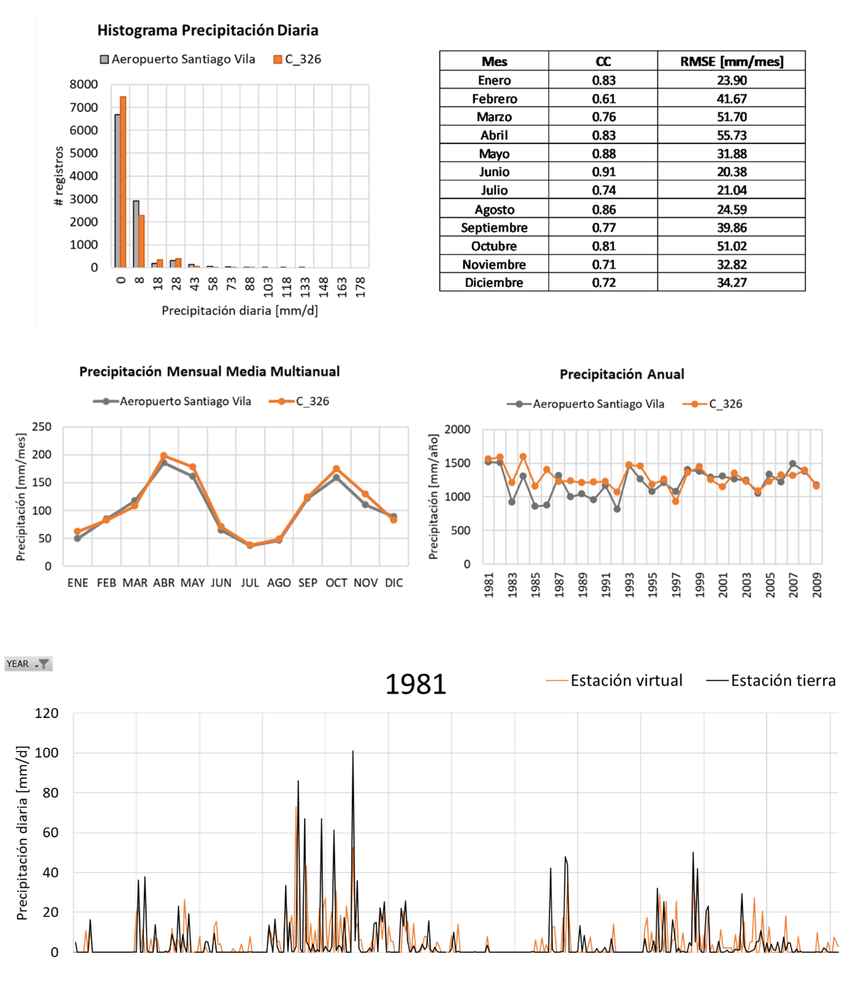

**Figura 30.** Comparación de registros de estación en tierra y registros CHIRPS en estación virtual (Fuente: elaboración propia).

Se han adelantado iniciativas para mejorar la calidad de los registros de CHIRPS a escala diaria [21], y en el caso colombiano el IDEAM genera mapas de seguimiento de la lluvia decadal CHIRPS-IRE/IDEAM, pero esta información no tiene acceso libre. A pesar de estas limitaciones, se considera que las bases de datos globales tienen fortalezas para su uso como valores de entrada al generador de clima, entre las que se reconoce la alta resolución espacial y temporal y que se representan bien los valores medios multianuales, la estacionalidad y la precipitación acumulada total, que son los indicadores seleccionados para medir el ajuste de las simulaciones en esta metodología. Esto se hace considerando que el generador de clima no tiene como objetivo hacer pronósticos de clima, sino generar eventos extremos que se puedan presentar y deriven en peligros y desastres.

### Generación estocástica de series climáticas {.unnumbered}

La metodología propuesta utiliza un generador de clima sintético a partir de distribuciones paramétricas de probabilidad para definir conjuntos de datos climáticos históricos y estimar la probabilidad de ocurrencia de un determinado valor de precipitación o temperatura, incluso fuera del rango de observaciones históricas. La metodología toma cada día del año hidrológico en un análisis separado, y encuentra la distribución de probabilidad que se ajusta mejor a los registros históricos. Posteriormente, se generan números aleatorios para la precipitación y la temperatura diaria para un determinado número de años de simulación, usando los parámetros de las distribuciones seleccionadas. Las series sintéticas de clima son luego utilizadas para generar mapas de amenaza integrada para diferentes periodos de retorno para toda el área de análisis. El esquema que describe el paso a paso del generador sintético de clima se presenta en la Figura 3 y la descripción detallada de la metodología se presenta en la sección de Materiales y Métodos al final de este documento. 

**Figura 31.** Proceso de generación de series sintéticas de precipitación y temperatura para identificación de eventos meteorológicos extremos (Fuente: elaboración propia).

En la Figura 4 se muestra un ejemplo, para el caso de Colombia, del ajuste del promedio diario multianual de las series históricas del periodo 1981–2010 y de la serie sintética simulada aleatoriamente para 1,000 años. Se puede ver cómo la metodología propuesta resulta en series sintéticas con un ajuste preciso a los datos históricos, lo que indica que la serie aleatoria conserva adecuadamente las características del clima de la zona. 

**Figura 32.** Promedio diario multianual de precipitación (arriba) y de temperatura media (abajo) para serie histórica (1981**–**2010) y serie sintética (1,000 años de simulación) (Fuente: elaboración propia).

Una de las ventajas de la metodología de generación estocástica de series climáticas es la obtención de valores atípicos extremos, que hacen referencia a valores de precipitación por encima de los máximos de los registros históricos, y valores de temperatura por fuera del rango medio registrado en estaciones. Esto quiere decir que las series modeladas incluyen valores de precipitación y temperatura que no se han presentado, pero pueden ocurrir con una baja probabilidad en el futuro. 

Para el caso de Colombia, los resultados en escala espacial de la simulación de series de precipitación y temperatura se muestran en la Figura 5 Estos mapas muestran los valores medios multianuales para la precipitación anual y temperatura media, mínima y máxima, a partir de los registros históricos (columna de la izquierda) y de los valores simulados (columna de la derecha). Los resultados, tanto para precipitación como para temperatura muestran que las simulaciones conservan los valores medios en toda el área de estudio y representan la distribución espacial de estas variables climáticas. Los mapas muestran las zonas de clima predominantemente seco, como La Guajira en el norte, y zonas reconocidas por sus intensas lluvias como el Choco. También se reconocen en los mapas de temperatura las zonas más altas del país, como son las cordilleras y la Sierra Nevada de Santa Marta. 

| Precipitación Registros 1981-2010 | Precipitación Simulada |
| --- | --- |
| Temperatura Media Registros 1981-2010 | Temperatura Media Simulada |
| Temperatura máxima Registros 1981-2010 | Temperatura máxima Simulada |
| Temperatura mínima Registros 1981-2010 | Temperatura mínima Simulada |

**Figura 33.** Mapas de valores medios multianuales para precipitación, temperatura media, máxima y mínima de registros históricos (izquierda) y series modeladas (derecha).

Con la verificación de estos resultados, se procede a calcular la evapotranspiración y los indicadores de sequía.

::: {.caja-box}
**Caja 2.** Incorporación del Cambio Climático en la generación de series climáticas futuras De acuerdo con el Reporte AR5 del IPCC (Intergovernmental Panel on Climate Change): "el calentamiento del sistema climático es inequívoco, y desde 1950, muchos de los cambios observados son sin precedentes sobre décadas y hasta milenios. La atmósfera y océano se han calentado, las cantidades de nieve y hielo han disminuido, el nivel del mar ha aumentado, y la concentración de gases de efecto invernadero ha aumentado" [22]. Debido a esto es importante considerar los efectos de este cambio climático en la evaluación del riesgo por eventos extremos climáticos. Con este fin, en la metodología propuesta es posible analizar los modelos de cambio climático y los cuatro diferentes escenarios de forcings antropogénicos (RCP o Representative Concentration Pathways) definidos en el informe AR5 del IPCC, y se escoger los modelos más adecuados para determinar los efectos específicos sobre la temperatura y precipitación para el área de estudio. En total se pueden llegar a evaluar 311 proyecciones, considerando las diferentes corridas de cada modelo. Una vez se determina el/los modelos de cambio climático más adecuado(s), se determinan las proyecciones de temperatura y precipitación en el futuro para la región de estudio, y con esto se perturbarán las series estocásticas de temperatura y precipitación que serán generadas para la modelación de los eventos climáticos extremos. Cada serie modelada debe ser perturbada según su ubicación y los resultados del modelo para ese mismo punto. Esto permite caracterizar completamente las condiciones futuras de ocurrencia de eventos hidrometeorológicos extremos en todo el territorio de análisis.  La incorporación del efecto del cambio climático está por fuera del alcance de la evaluación de riesgo por sequía para el sector agropecuario en Colombia que se presenta en este documento. Para más información visitar https://www.researchgate.net/project/Drought-hazard-and-risk-assessment-New-probabilistic-and-holistic-methodology-Evaluacion-de-amenza-y-riesgo-por-sequia-Nueva-metodologia-probabilista-y-holistica

:::

### Identificación de eventos estocásticos de clima extremo {.unnumbered}

Los indicadores son ampliamente utilizados para identificar eventos extremos de clima, como por ejemplo las sequías o inundaciones. Los indicadores pueden definir la *duración* y la *severidad* de los eventos extremos detectando condiciones anómalas de precipitación (exceso o déficit) y de temperatura (por debajo o por encima del promedio histórico para cada temporada del año). Las fechas de inicio y terminación establecen el período de duración en el que un indicador de clima extremo está continuamente por debajo de un nivel o umbral crítico predefinido. La severidad de un evento denota la deficiencia acumulativa de un parámetro por debajo de un umbral entre las fechas de iniciación y terminación.

Dependiendo del tiempo de evento climático a evaluar, se pueden incluir diferentes variables en el cálculo de los índices. Por ejemplo, para encharcamientos por exceso de lluvia, el parámetro que controla el proceso es la lluvia acumulada en un cierto número de días y la humedad inicial del suelo. Para eventos de sequía meteorológica se tiene en cuenta la precipitación acumulada y la evapotranspiración potencial, que se calcula a partir de la temperatura, viento, humedad, radiación y presión atmosférica. Para el caso de heladas y olas de calor se debe tener en cuenta la humedad del aire además de la temperatura.

::: {.caja-box}
**Caja 3.** ¿Cómo se caracteriza un evento de sequía? A partir de la serie de indicadores de sequía se puede caracterizar cada evento según los siguientes parámetros:   Definición de un evento de sequía dentro de la serie de tiempo sintética Severidad: corresponde al área bajo la curva del evento, es decir, el valor acumulado del indicador durante el evento. Se puede entender como la gravedad de la sequía. Duración: es el tiempo que dura el evento o el número de meses en el que el indicador de sequía está por debajo del umbral que define la severidad. Intensidad: se calcula como la severidad dividida por la duración. Es una medida unitaria de la magnitud del evento. Serie de temperatura: valores contra el tiempo de temperatura diaria (promedio, máxima y mínima) dentro de la duración del evento. Se obtienen de la serie sintética empleada en el cálculo del indicador. Serie de precipitación: valores contra el tiempo de precipitación diaria dentro de la duración del evento. Se obtienen de la serie sintética empleada en el cálculo del indicador.

:::

## CASO DE ESTUDIO: SEQUÍA EN COLOMBIA {.unnumbered}

Para el caso de la sequía, a partir de las series históricas y sintéticas de precipitación y temperatura se calculan los indicadores de sequía (SPI, SPEI, RDI y otros incluidos en la literatura especializada) para todas las estaciones y a diferentes escalas de tiempo en pasos mensuales. Una vez que se obtiene la serie temporal del indicador seleccionado en cada estación, se identifican los eventos de sequía, que ocurren cuando el indicador toma un valor por debajo de un umbral crítico. La descripción detallada de la metodología de indicadores de sequía se presenta en la sección de Materiales y Métodos al final de este documento.

El siguiente paso es identificar los eventos de sequía que ocurren simultáneamente en varias estaciones de la región de estudio. Para cada mes, se identifican las estaciones con un valor de indicador por debajo del umbral definido para la evaluación. Si el número total de estaciones con valores por debajo del umbral es mayor que un cierto porcentaje (por ejemplo, 50%), entonces se identifica una sequía regional. Con cálculos consecutivos para todos los años de simulación, se pueden detectar múltiples sequías regionales, con su valor asociado de duración, severidad e intensidad en cada estación. Cada una de las sequías regionales es un escenario de sequía individual, con una frecuencia anual de ocurrencia igual a 1/N, en donde N es el número total de años de simulación. La Figura 6 muestra esquemáticamente cómo se identifican las sequías regionales, de acuerdo con los criterios de selección definidos por un valor umbral de indicador y un número mínimo de estaciones que satisfacen dicha condición. Este procedimiento puede aplicarse para toda la región de estudio, o para subregiones definidas por otros criterios, como zonas climáticas, zonas productivas, entidades territoriales, etcétera.

**Figura 34.** Identificación de sequías regionales sobre las series de tiempo de todas las estaciones del área de estudio (Fuente: elaboración propia).

### Mapas de amenaza integrada {.unnumbered}

Los resultados de la modelación de la amenaza se presentan en formato de mapas de amenaza integrada para la región de estudio, que permiten comparar las intensidades según el periodo de retorno y establecer zonas que están más o menos expuestas a la amenaza de sequía dentro de la región. La metodología para integrar la amenaza se incluye en la sección de Materiales y Métodos. En los mapas se presenta la severidad como el valor absoluto del acumulado del indicador de sequía, e indica la gravedad de las sequías, la duración se presenta en número de meses y la intensidad como la división entre nivel acumulado del indicador de sequía por debajo del umbral definido para el análisis y el número de meses en que el indicador estuvo bajo el umbral.

Hay que tener en cuenta que la severidad por sí sola no puede definir la gravedad de una sequía, se requiere complementar con los parámetros de duración e intensidad [23]. Por ejemplo, el valor máximo de severidad que se muestra en los mapas igual a 15 se puede interpretar como una sequía severa y baja duración (5 meses de sequía con valores de SPEI = -3) o una sequía moderada con larga duración (10 meses de sequía con valores de SPEI = -1.5). Por esta razón, al interpretar los mapas de amenaza integrada se recomienda analizar en simultánea los indicadores de duración e intensidad, que complementan el análisis espacial de los resultados y brindan más información para la toma de decisiones.

Los mapas de severidad, duración e intensidad calculados para Colombia se muestran en la Figura 7, para diferentes periodos de retorno. Según los resultados, se puede ver que la intensidad de la sequía tiende a ser uniforme en el país, con valores por encima de 1.5, lo que indica sequías severas para periodos de retorno altos (mayores a 50 años). Sin embargo, en la zona de la cordillera central del país, la intensidad de la sequía tiene a ser más baja. 

Un resultado importante a resaltar son los valores de severidad de la sequía en la zona de La Guajira. Los mapas muestran que para la región caribe la severidad es menor que para el resto del país, al igual que algunas zonas de Cundinamarca y Boyacá. Es importante notar que el valor de severidad de la sequía se calcula a partir de los valores normales de la zona de evaluación, por lo que, aunque la región Caribe y en especial La Guajira son de climas secos o desérticos, los mapas que aquí se presentan muestran que en estas zonas las sequías meteorológicas son potencialmente menos graves que en otras zonas del país. Sin embargo, los impactos reales del riesgo a la sequía se determinan al considerar no sólo la amenaza, desde el enfoque meteorológico, sino también condiciones de exposición y vulnerabilidad, tanto física como socioeconómica, que puede incrementar los efectos de la amenaza.

|  |  |  |
| --- | --- | --- |
|  |  |  |
|  |  |  |
|  |  |  |

**Figura 35.** Mapas de amenaza integrada de sequía para 50, 100, 250 y 500 años de periodo de retorno. Severidad (izquierda), duración en meses (centro) e intensidad (derecha) (Fuente: elaboración propia).

## EXPOSICIÓN AGRÍCOLA {.unnumbered}

La metodología propuesta considera los elementos expuestos como uno de los componentes de riesgo, junto con la amenaza y la vulnerabilidad. Un elemento expuesto es cualquier objeto, geográficamente referenciado, que es susceptible de ser afectado por la ocurrencia de un fenómeno amenazante. Los elementos expuestos para la actividad agrícola son los cultivos ubicados en el área donde se estima el riesgo asociado a eventos climáticos extremos. Los elementos expuestos son fundamentales dentro del análisis de riesgo, debido a que comprenden los objetos sobre los cuales se evalúan las pérdidas, es decir, son la fuente de las pérdidas potenciales debido al hecho de estar expuestos a una amenaza y ser susceptibles de sufrir un daño.

Para cada elemento expuesto o unidad de tierra cultivada en la región de análisis, es necesario conocer las características del cultivo que típicamente se siembra en esa ubicación. La información que se debe conocer incluye el tipo de cultivo, su estacionalidad y área sembrada. También se debe contar con información de rendimientos típicos (toneladas producidas por unidad de área). En la medida de lo posible, esta información debe obtenerse de fuentes oficiales. La información mínima para crear la base de datos de elementos expuestos del sector agrícola se muestra en la siguiente tabla.

**Tabla 6.** Información de entrada para modelo de exposición del sector agropecuario 

| Información de entrada | Descripción | Posibles fuentes |
| --- | --- | --- |
| Mapas de ubicación de cultivos | Ubicación de cultivos y unidades de tierra cultivada georeferenciadas. | Mapas oficiales de uso de la tierra y coberturas, censos nacionales agrícolas. |
| Rendimiento de cultivos | Valores de referencia de rendimiento de cultivos para la producción anual y el área total cultivada. | Censos y encuestas agrícolas. |
| Valoración económica de los cultivos | Costo de producción unitario. | Censos y encuestas agrícolas. |
| Mapas de tipo de suelo | Textura, grupo hidrológico, y número de curva. | Mapas oficiales de la clasificación taxonómica del suelo, mapas de uso de la tierra y coberturas. |

### Mapas de ubicación de cultivos {.unnumbered}

La información detallada de localización y caracterización de los cultivos es requerida para modelar la vulnerabilidad de los elementos expuestos; no obstante, esta información por lo general es difícil de obtener. Por tal razón, para recopilarla se consultan fuentes oficiales para desarrollar un proxy con la información más pertinente para zona de estudio.

Para el caso de Colombia se consultó información publicada por fuentes oficiales como el Mapa de Cobertura el Suelo publicado por el IDEAM [24], los resultados del Tercer Censo Nacional Agropecuario 2014 [25] y las Encuestas Nacionales Agropecuarias [26] anuales publicadas por el DANE. De esta forma se obtienen mapas de localización y área de los cultivos más importantes del país, en una malla de resolución ajustable según la resolución del modelo de amenaza y el uso final de la evaluación de riesgo.

Con el objetivo de obtener la base de datos de elementos expuestos, se realizó el análisis de ubicación y cantidad de área sembrada de los principales productos agrícolas producidos en Colombia, así como la localización de pasturas y caracterización de ganado para evaluar el riesgo agropecuario del país a partir de la información del mapa de coberturas, el censo nacional y las encuestas agrícolas. Como resultado se obtuvieron mapas a nivel nacional, en los que el territorio se divide en una malla de 10 km × 10 km y en donde cada celda contiene una cierta área sembrada de cada uno de los productos analizados, para diferentes fechas de siembra (primer y segundo semestre) y tipo de cultivo (monocultivo o asociado). 

Esta metodología permite incluir las diferentes prácticas agrícolas que se realizan en diferentes regiones. Estas pueden incluir la siembra de cultivos anuales en varios ciclos (siembra de primer y segundo semestre), siembra en monocultivo o cultivo asociado (por ejemplo, café y plátano en la misma unidad de tierra cultivada). También se consideran cultivos permanentes dentro del análisis. Esto se resume en la Figura 8. 

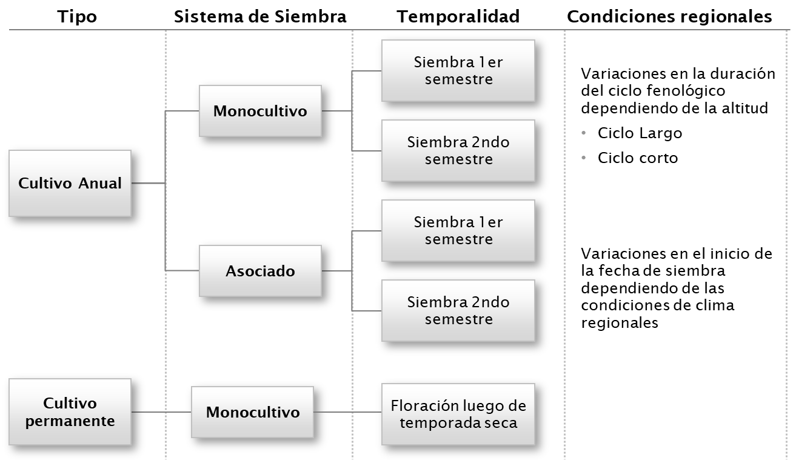

**Figura 36.** Esquema de análisis de cultivos considerado en la generación del modelo de exposición (Fuente: elaboración propia).

Para la generación de los mapas de ubicación y área sembrada de cultivos se consideraron además restricciones en los cultivos en áreas protegidas y se priorizaron zonas cercanas a centros poblados. La validación del área resultante se hizo al comparar la sumatoria del área asignada a cada pixel del mismo municipio con el área total sembrada por municipio reportada en la última versión de la ENA. Por ejemplo, en Colombia la superficie cultivada de maíz a nivel nacional se estimó en 693,800 ha, la distribución espacial de esta área se muestra en la Figura 9, donde también se hace un detalle a los departamentos de Antioquía y Tolima. 

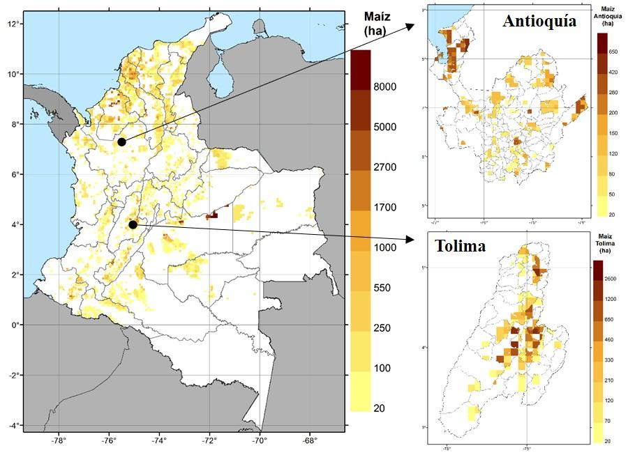

**Figura 37.** Localización y área de cultivos de maíz en Colombia (izquierda), en Antioquía (derecha arriba) y en Tolima (derecha abajo) (Fuente: elaboración propia).

### Estacionalidad {.unnumbered}

Un parámetro de entrada específico para cada región de análisis y tipo de planta es el tiempo en el cual se completa el ciclo de desarrollo del cultivo. Dentro de la modelación de la vulnerabilidad de las plantas, es importante definir, en términos de días calendario, las diferentes etapas de crecimiento del cultivo, desde su siembra hasta la madurez, como se muestra en la Figura 10. Además, se debe contar con información sobre la fecha típica de siembra y cosecha de cada producto. Estos datos van a ser luego utilizados en el módulo de vulnerabilidad que relaciona el desarrollo día a día del cultivo con las series diarias de precipitación y temperatura, para evaluar posibles reducciones en el rendimiento de la cosecha debido a condiciones de déficit de agua.

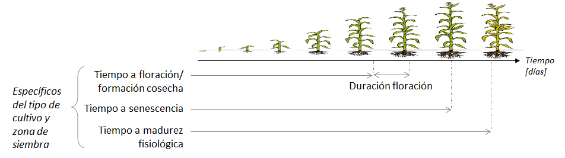

**Figura 38.** Esquema de etapas de crecimiento de una planta (Fuente: elaboración propia).

### Rendimiento {.unnumbered}

Dentro de la información que se debe conocer en el modelo de exposición se incluye el rendimiento típico de cada cultivo, que dentro del modelo se define como la producción total en toneladas de un cultivo por hectárea de terreno sembrada. Estos datos se utilizan en el módulo de vulnerabilidad, que relaciona el desarrollo día a día del cultivo con las series diarias de precipitación y temperatura, para evaluar posibles reducciones en el rendimiento de la cosecha debido a condiciones extremas de clima.

Estos rendimientos, obtenidos de fuentes oficiales, son rendimientos de referencia que permiten verificar los resultados de rendimiento obtenidos con el modelo para estimar las pérdidas. Sin embargo, cabe resaltar que dichos rendimientos se asumen estáticos en el modelo dado que no se tienen en cuenta las mejores prácticas agrícolas que en un futuro puedan adoptarse y que resulten en un incremento del rendimiento de los cultivos. 

El modelo de vulnerabilidad, acoplado al modelo de amenaza que incluye generación estocástica de eventos climáticos extremos, permite el cálculo de rendimientos tanto para la serie de clima histórico como para la serie de clima simulado. De esta forma se genera mayor cantidad de información de la relación entre la severidad del daño por el evento climático y el rendimiento del cultivo, y se incorporan eventos que no han ocurrido en la historia y que son importantes para la evaluación probabilista del riesgo.

### Avalúo {.unnumbered}

Para cuantificar las pérdidas generadas al momento de exponer los cultivos a los escenarios que definen la amenaza por sequía, es necesario realizar una valoración económica de la producción obtenida por cultivo, para ello se considera el valor unitario en dólares (USD) o moneda local de una tonelada producida para cada cultivo. La valoración económica es considerada como el precio recibido por los agricultores por sus productos, sin considerar los costos de transporte, almacenamiento, procesamiento, comercialización ni impuestos; es decir, no cubre ningún otro costo después de que el producto deja la unidad de tierra cultivada. La información sobre avalúos se obtiene de fuentes oficiales como ministerios de agricultura y ganadería o institutos estadísticos de los países. Por ejemplo, en Colombia las series históricas del precios a mayoristas por tipo de cultivo se puede encontrar en servicios como AGRONET [27].

### Mapas de suelo {.unnumbered}

La base de datos de elementos expuestos de cultivos incluye las variables necesarias para parametrizar el suelo, que sirve de soporte para el crecimiento de las plantas, y son parámetros de entrada para el modelo de vulnerabilidad. El modelo que se aplica en este estudio toma un volumen de referencia del suelo, en la que se ubica la zona radicular, y estima su balance hídrico para determinar la cantidad de agua que tiene disponible la planta. Con esto se evalúan las interacciones suelo-planta-atmósfera que permiten modelar el crecimiento de cultivos y su rendimiento. 

La información de suelos puede ser generada a múltiples escalas, según la información disponible. Por ejemplo, el modelo a escala nacional, al ser una resolución de trabajo gruesa no incluye parámetros de afectación local como presencia de múltiples horizontes de suelo o variaciones en el nivel freático. En ese caso del perfil de suelo se supone un perfil homogéneo para la profundidad máxima que alcanzan las raíces según cultivo y no se considera la presencia de barreras físicas que limiten la profundización de las raíces. Entonces, el modelo de suelo se complementa en la medida en que se obtenga información detallada del área de estudio. 

Ahora bien, en caso de no contar con información de tipo y textura de suelo, se puede hacer uso de la Base de Datos Armonizada de los Suelos del Mundo [28], que tiene información global de 15,000 unidades cartográficas de suelo. Esta base de datos es el resultado de la base de datos de la Organización de las Naciones Unidas para la Alimentación y la Agricultura (FAO) con el Instituto Internacional de Análisis de Sistemas Aplicados (IIASA), Información Mundial de los Suelos (ISRIC), Instituto de Ciencias de Suelos, Academia China de las Ciencias (ISSCAS), y el Centro Común de Investigación de la Comisión Europea (JRC). La base de datos se puede descargar de forma gratuita de la página web de la FAO.

## REPRESENTACIÓN DE LA VULNERABILIDAD PARA LA EVALUACIÓN DEL RIESGO	 {.unnumbered}

La vulnerabilidad es una característica intrínseca de los elementos expuestos y que caracteriza el comportamiento de los elementos expuestos (cultivos) durante la ocurrencia de un evento peligroso (sequía, por ejemplo). Para la metodología aplicada en este estudio, no se considera la definición de vulnerabilidad mediante curvas en las que la pérdida en el elemento expuesto es función de la intensidad de amenaza que ocurra en su ubicación. Por el contrario, la metodología de vulnerabilidad de respuesta de los cultivos a eventos extremos climáticos está asociada a reducciones en el rendimiento del cultivo según el uso de parámetros específicos por especie que definen los procesos físicos, químicos y biológicos que intervienen en el modelo de desarrollo de la planta y sus interacciones con los sistemas de atmósfera y suelo.

En el caso de la evaluación de riesgo por eventos climáticos extremos, el componente de vulnerabilidad se conforma por la metodología de respuesta de los cultivos a la disponibilidad de agua y estrés por temperatura, aplicada por la FAO y publicada en el Artículo 66 de la Unidad de Drenaje e Irrigación [15] y resumida en este documento en la sección de Materiales y Métodos. El resultado del módulo de vulnerabilidad cuantifica las diferencias entre el rendimiento óptimo alcanzado por la planta sin restricciones de agua y el rendimiento real logrado bajo condiciones de estrés hídrico o térmico. 

Este enfoque permite calcular la biomasa de los cultivos con base en la cantidad de agua transpirada y el rendimiento del cultivo como la proporción de biomasa que entra en las partes cosechables de las plantas. 

::: {.caja-box}
**Caja 4.** ¿Por qué aplicar el modelo de respuesta de cultivos al agua de la FAO para la evaluación del riesgo?  Algunas de las características del modelo de la FAO, que son interesantes para la evaluación del riesgo son: El modelo considera la relación proporcional entre el estrés hídrico y la reducción de la producción de biomasa. En consecuencia, la reducción de la producción de biomasa se relaciona con la reducción de los rendimientos y las pérdidas económicas asociadas con el peligro de sequía. El modelo de la FAO incluye el efecto de las anomalías de la humedad del suelo y la respuesta fisiológica de los cultivos al déficit o exceso hídrico. El modelo calcula la producción de biomasa en una escala de tiempo diaria, para representar mejor la dinámica de la respuesta del cultivo al agua en diferentes etapas de crecimiento. Esta característica es conveniente porque los parámetros meteorológicos, utilizados para calcular el riesgo de sequía, también tienen una escala de tiempo diaria. Como la producción de biomasa se calcula a partir de las series de precipitación y temperatura, el modelo puede introducir el efecto de los escenarios de cambio climático. Se incluye también la concentración de dióxido de carbono en la atmósfera. La FAO ha establecido parámetros estándar para los cultivos, con sus correspondientes procedimientos de calibración y validación. Es posible incorporar modificadores asociados a prácticas agrícolas (por ejemplo, riego o fertilización), en función de la información disponible.

:::

## EVALUACIÓN DEL RIESGO POR SEQUÍA EN EL SECTOR AGROPECUARIO {.unnumbered}

Como se muestra en la Figura 11, la evaluación probabilista del riesgo se puede resumir en los siguientes pasos (más detalles en la sección de Materiales y Métodos):

Para cada evento, se determina la pérdida en todas y cada una de las unidades cultivadas, considerando tipo de suelo, tipo de cultivo, estacionalidad y fase fenológica.

Se calcula la pérdida causada por todo el evento, como la suma de las pérdidas individuales causadas en las unidades cultivadas.

Una vez se conocen las pérdidas de todos los escenarios, se calculan las tasas de excedencia.

**Figura 39.** Diagrama de flujo para la metodología de evaluación de riesgo por sequía

::: {.caja-box}
**Caja 5.** Cuantificación del impacto de los desastres en el sector agrícola  En términos generales, la cuantificación del impacto de los desastres en el sector agrícola hace una diferencia importante entre los conceptos de daño y pérdida: Daño: es la destrucción parcial o total de los activos físicos e infraestructura en áreas afectadas por desastres. Se expresa en términos de los costos de reemplazo o reparación. En el sector agrícola, el daño incluye impactos a cultivos permanentes, maquinaria, sistemas de irrigación, refugios de ganado, entre otros. Pérdida: se refiere a los cambios en los flujos económicos derivados de un desastre. En el sector agrícola, las pérdidas incluyen la disminución de ingresos asociado a reducción del rendimiento de la cosecha, disminución de ingresos asociados a reducción en la producción de derivados pecuarios. También se puede considerar el momento después de ocurrido el desastre en el que el incremento de los costos de los insumos, mayores costos operacionales, gastos más altos en imprevistos significan menores ganancias de la actividad agrícola general. La siguiente figura muestra la diferencia que hace la FAO [29] en términos de daño y pérdida para la producción y los activos en el sector agrícola y que aplica en la metodología propuesta de evaluación de riesgo por eventos climáticos extremos.   Diferencias entre pérdidas y daños en el sector agrícola (Elaboración propia a partir de [29]) En cuanto a la producción, el daño corresponde a los impactos de los desastres a insumos y producción almacenada, así como impactos en cultivos permanentes; mientras que, para la pérdida, los impactos se ven reflejados en la variación de los ingresos al productor asociado con disminuciones en los rendimientos de la cosecha. Por otro lado, para los activos los daños se asocian a impactos en maquinaria, equipo y herramienta y no se consideran pérdidas, al no asociar cambios en flujos económicos a los activos.  La medición se hace a partir de avalúos y costos de reparación/reemplazo estimados en condiciones anteriores al evento y diferencias en ingresos percibidos entre cosecha óptima y cosecha en condición de desastre. La metodología también puede incluir los costos temporales que deben incurrir los productores para mantener las actividades agrícolas durante o luego de la ocurrencia de un desastre. La metodología puede entonces incluir todos estos factores según la disponibilidad de la información y la amenaza analizada (por ejemplo, para el caso de la sequía no se consideran afectaciones a activos).

:::

### Riesgo por sequía para el cultivo de maízen Colombia  {.unnumbered}

Con el fin de ilustrar los resultados de la metodología de evaluación de riesgos con enfoque probabilista, a continuación, se presentan los resultados de una evaluación preliminar de caso de riesgo por sequía para Colombia. Estos resultados son ilustrativos y hacen parte del desarrollo actual de la metodología, por lo que no se consideran definitivos.  

::: {.caja-box}
**Caja 6.** Métricas de riesgo A partir de la curva de excedencia de pérdidas es posible obtener diversas métricas del riesgo, las cuales son útiles para diferentes fines dentro de la toma de decisiones y la gestión del riesgo. Estas métricas pretenden proporcionar una representación integral del riesgo, por lo general condensada en uno o unos pocos números, en lugar de proporcionar todo el conjunto de las pérdidas por escenarios o la curva de excedencia de pérdidas completa. La pérdida anual esperada (PAE) La PAE corresponde al valor esperado de la pérdida anual. Indica el valor anual que debe pagarse para compensar, en el largo plazo, todas las pérdidas futuras. En un esquema simple de seguro, la PAE sería la prima pura anual justa. Se calcula como a partir del conjunto de eventos como: Es decir, se trata del valor esperado de las pérdidas anuales. La PAE se puede obtener también como el área bajo la curva de excelencia de pérdidas.  La pérdida anual esperada es un indicador importante dado que integra en un único valor el efecto, en términos de pérdida, de la ocurrencia de los escenarios de amenaza sobre los elementos expuestos vulnerables. Se considera como el indicador más robusto de riesgo, no solo por su capacidad de resumir el proceso de generación de pérdidas en un solo número, sino por ser relativamente insensible a la incertidumbre.  La pérdida máxima probable (PML) Se denota PML por sus siglas en inglés (Probable Maximum Loss). La PML es una curva que relaciona las pérdidas a su correspondiente periodo de retorno. No obstante, es práctica común definir la PML como un único valor y corresponde a una pérdida que ocurre poco frecuentemente, es decir, que se asocia a un periodo de retorno grande. La selección del periodo de retorno de la PML depende exclusivamente de la aversión al riego del tomador de decisiones. Por ejemplo, en la industria aseguradora el periodo de retorno de la PML se toma usualmente entre 200 y 1,500 años. La selección del periodo de retorno la hace el tomador de decisión, según el objetivo de la evaluación, ya que no existe un estándar aceptado mundialmente. La probabilidad de quiebra (PQ) Asumiendo que el proceso de ocurrencia de las pérdidas en el tiempo sigue un proceso de Poisson, es posible determinar la probabilidad de alcanzar o exceder un nivel de pérdida dado, en un periodo de exposición particular,  en donde Pr(P>p)T es la probabilidad de excedencia de la pérdida p, en el lapso de tiempo T (dado en años). Si la pérdida p corresponde a la PML, entonces el término Pr(P>p)T se conoce como la probabilidad de quiebra (PQ), la cual no es más que la probabilidad de exceder la PML en un lapso de tiempo T.

:::

Inicialmente se presentan los resultados para un evento de sequía en la Región Caribe de Colombia. Este evento no es un pronóstico, es una condición que se puede presentar en el futuro en esta región. La Figura 12 muestra los mapas de gravedad del evento de sequía, en términos de su severidad, duración e intensidad. Para este mismo evento se evaluó el rendimiento del cultivo de maíz, y los resultados se presentan en términos de la relación entre la producción real alcanzada bajos las condiciones de estrés hídrico y la producción potencial que se alcanzaría sin restricciones de agua o nutrientes. A partir de estos resultados se puede ver en qué lugares se esperan mayores pérdidas en producción, asociados a un evento de condiciones climáticas desfavorables.

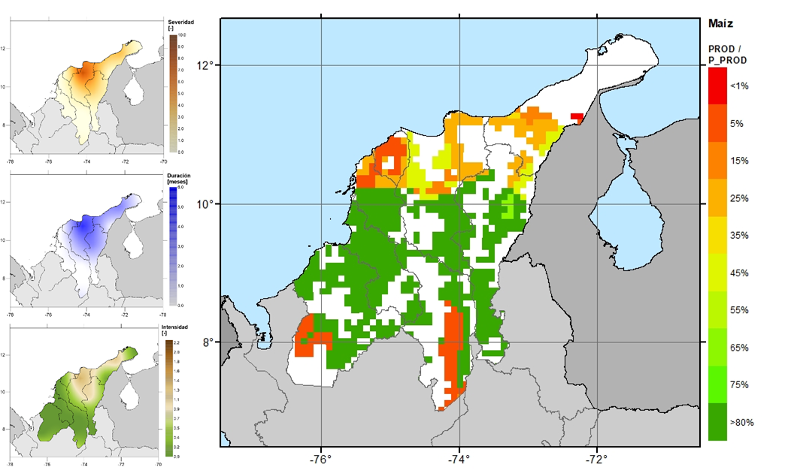

**Figura 40.** Caracterización de un evento de sequía en la Región Caribe de Colombia (elaboración propia).

La evaluación del riesgo se completó también a escala nacional, analizando los potenciales eventos de sequía que pueden ocurrir en el país y que fueron identificados en la etapa de la evaluación de la amenaza. El riesgo se estimó para el cultivo de maíz en Colombia, cuya localización y densidad de área sembrada se estimó en la etapa de modelación de la exposición. Haciendo uso de la metodología de la FAO para la evaluación de la vulnerabilidad y la evaluación del riesgo con enfoque probabilista, se obtuvo la curva de Pérdida Máxima Probable que se muestra en la Figura 13. Esta curva relaciona la pérdida relativa (pérdida del evento dividida por el valor expuesto total) con el periodo de retorno de esta pérdida. Entonces, para Colombia se espera una pérdida máxima probable del 5% para un periodo de retorno de 50 años, esto en términos de reducción de los ingresos del productor asociados a la reducción en el rendimiento de su cultivo. 

**Figura 41.** Curva de Pérdida Máxima Probable para el cultivo de Maíz en Colombia (Elaboración propia). 

Los resultados también se presentan distribuidos espacialmente en los mapas de la Figura 14, en los que se muestra la ubicación de los cultivos de maíz (mapa de la izquierda) y los resultados de la pérdida anual esperada relativa al valor expuesto (mapa de la derecha). A partir de estos mapas se pueden reconocer las zonas en las que el cultivo de maíz está en mayor riesgo (pixeles en rojo). Es interesante notar que, aunque la severidad e intensidad de la sequía en la Región Caribe tiende a ser más baja que en otras zonas del país como se muestra en la Figura 7, los resultados de riesgo indican que las pérdidas relativas pueden ser más altas en esta zona. Esta situación refuerza la idea de la necesidad de evaluar tanto la amenaza como el riesgo para brindar insumos a los procesos de gestión de riesgo de desastres. En este caso, la combinación de las condiciones de clima, de calidad del suelo y de superficie sembrada permiten abordar el problema de la sequía desde un enfoque integral.

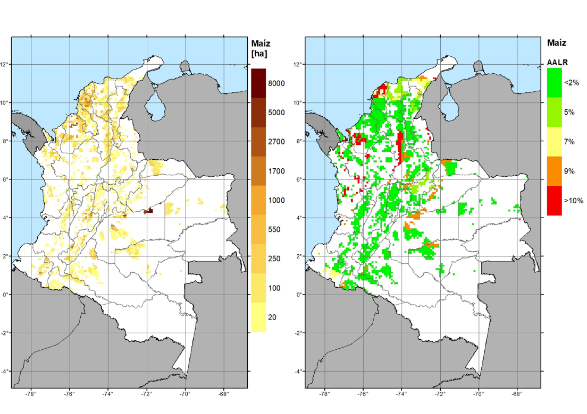

**Figura 42.** Mapas de ubicación y densidad de área sembrada de maíz (izquierda) y de pérdida anual esperada relativa (derecha) de riesgo por sequía (Elaboración propia).

### Alcance de la metodología	 {.unnumbered}

La metodología de evaluación de riesgo pretende evaluar las pérdidas en la producción potencial de cultivos expuestos a eventos extremos de clima. Esto es lo mismo que evaluar la disminución en el rendimiento de los cultivos bajo condiciones de estrés hídrico o térmico, aplicando la metodología de dinámica de respuesta de las plantas a la disponibilidad de agua. Al definir el alcance de la metodología a la estimación de pérdidas en el sector agrícola, esta metodología no considera pérdidas o afectaciones de vidas humanas. Incluso, la presente metodología no considera efectos sobre la disponibilidad de agua para suministro de agua potable, generación de energía o dinámicas del agua subterránea.

Otras consideraciones sobre el alcance de la metodología son:

La metodología de amenaza contempla en su alcance la generación estocástica de series de precipitación y temperatura (proceso estadístico de simulación del clima a partir de registros históricos) que no pretende ser un pronóstico. La modelación de otras variables climáticas (humedad, radiación, velocidad del viento) implica el uso de modelos complejos de circulación atmosférica e interacción de sistemas terrestres, que no está dentro del alcance de este estudio.

En la creación del modelo de exposición, la selección de los productos se hace a partir del nivel de detalle de la información disponible, además de considerar los cultivos más importantes y representativos de la economía del país, tanto en términos de subsistencia como producción con fines comerciales. 

Si este modelo se enfoca en la escala nacional, no es posible diferenciar de forma directa áreas cultivadas para subsistencia o explotación agroindustrial si no existe la información correspondiente. El modelo no está en la capacidad de diferencias tipos de pasturas naturales. 

La base de datos de cultivos generada en este estudio también incluye las prácticas agrícolas típicas de la región. El modelo de exposición incluye detalles como las épocas de primera y segunda siembra, ajustando las áreas y duración del ciclo de crecimiento del cultivo en cada caso. Estos modelos no consideran la rotación de cultivos. En el caso de cultivos permanentes, se considera que los cultivos están en etapa productiva, es decir, los árboles ya completaron su crecimiento vegetativo.

El modelo de vulnerabilidad de este estudio sigue la metodología de cálculo de rendimiento de productos agrícolas propuesta por la FAO. En el marco de este estudio, la vulnerabilidad se define en términos de la pérdida de rendimiento que sufre el cultivo durante un período prolongado de escasez de agua. Dado que se aplica un modelo agronómico de respuesta de cultivos, no se emplearán curvas o funciones de vulnerabilidad.

La estimación de impactos económicos para el sector agrícola se limita a la estimación de pérdidas asociadas a la diferencia entre la cosecha óptima y la alcanzada bajo condiciones de estrés hídrico, avaluadas según costos de producción. No se consideran pérdidas asociadas con disminución en la calidad del producto, que puede implicar un menor precio de venta. Las pérdidas se suponen que son producto del evento amenazante y no considera factores externos como variaciones del mercado, brotes de enfermedades, entre otros. 

La metodología hace uso de rendimientos de producción (total de cosecha producida en toneladas por unidad de área en hectáreas) para las condiciones locales. Estos rendimientos, obtenidos de fuentes oficiales, son rendimientos de referencia que permiten verificar los resultados de rendimiento obtenidos con el modelo para estimar las pérdidas. Sin embargo, cabe resaltar que dichos rendimientos se asumen estáticos en el modelo dado que no se tienen en cuenta las mejores prácticas agrícolas que en un futuro puedan adoptarse y que resulten en un incremento del rendimiento de los cultivos.

::: {.caja-box}
**Caja 7.** DroughtPro. Drought Pro es un software desarrollado por INGENIAR Risk Intelligence Ltda, cuyo objetivo es la evaluación de la amenaza, vulnerabilidad y riesgo por sequía y está en desarrollo para incluir otros tipos de amenazas asociadas a eventos climáticos extremos. Permite estimar las pérdidas en los cultivos expuestos a eventos de sequía, haciendo uso de modelos de vulnerabilidad que relacionan el déficit de agua disponible para el cultivo con su crecimiento y producción de cosecha, y la vulnerabilidad del sector pecuario en términos de la disminución de la capacidad de carga de la pastura. A continuación se observa una ventana ejemplo del programa Drought Pro para la evaluación del riesgo por sequía. Drought Pro permite almacenar, editar y actualizar la información de amenazas, exposición, vulnerabilidad y riesgo. Este software es una plataforma independiente, desarrollada con herramientas de programación avanzadas.  Drought Pro integra los módulos de amenaza con los módulos de exposición y vulnerabilidad para hacer una estimación de riesgo, que se presenta en términos de pérdidas económicas o de producción, para el sector agrícola y pecuario. Para calcular el riesgo por sequía en el sector agrícola en primer lugar, se modela la amenaza a partir de los registros históricos de precipitación y temperatura, con el fin de generar series futuras correlacionadas de parámetros climáticos e identificar condiciones de sequía a muy largo plazo. Posteriormente, se ingresa la base de datos de elementos expuestos con datos sobre ubicación, características de los cultivos (parámetros propios, tipo y estacionalidad), área, productividad y costo de producción de cada unidad de tierra cultivada. Luego, la vulnerabilidad de los cultivos se define a partir de parámetros fenológicos y físicos que representan el desarrollo de los cultivos y permiten estimar la diferencia entre la producción óptima de rendimiento (si no hay límites para agua y nutrientes) y producción bajo déficit hídrico. Por último, el riesgo de sequía agrícola se modela en términos de pérdidas económicas derivadas de la pérdida de rendimiento debido a la escasez de agua. El riesgo se expresa en términos de la curva de excedencia de pérdidas, la pérdida anual esperada y las pérdidas máximas probables; métricas de riesgo que son útiles para los procesos de toma de decisiones. En el caso del cálculo de riesgo del sector pecuario se ingresa la información asociada a la exposición en términos de pasturas y stock ganadero y el programa evalúa su vulnerabilidad en términos de la reducción de capacidad de carga de la pastura natural.  Software Drought Pro para estimación de pérdidas en producción agrícola por sequía. Drought Pro calcula para múltiples escenarios de clima y cultivos las principales métricas de riesgo de forma simultánea. Se obtienen entonces resultados tanto para el portafolio completo de cultivos, como desagregado por producto. Para más información visitar http://www.ingeniar-risk.com/servicios/software/capra/drought-pro

:::

## CONCLUSIONES {.unnumbered}

Con el objetivo de identificar y cuantificar la amenaza asociada a fenómenos hidrometeorológicos para el sector agropecuario, se presentó una metodología con enfoque probabilista para la simulación de eventos peligrosos mediante la simulación de condiciones climáticas que combinan eventos extremos de precipitación y temperatura durante un tiempo prolongado, sobre un área geográfica concreta. Como resultado se obtuvieron mapas de amenaza integrada por sequía para Colombia, caracterizados por condiciones de severidad, duración e intensidad del fenómeno para 50, 100, 250 y 500 años de periodo de retorno. A partir de estos mapas se pueden identificar las zonas más propensas a sufrir sequías graves.

Como parte de este estudio se construyó un modelo de exposición de cultivos para Colombia, con una resolución de 10 km × 10 km para todo el territorio continental. Este modelo de exposición, derivado de información de censos y encuestas agrícolas, caracteriza la ubicación, densidad de siembra, estacionalidad del cultivo y avalúo del producto para la actividad agrícola y pecuaria del país. 

En el marco de este estudio, la vulnerabilidad se define en términos de la pérdida de rendimiento que sufre el cultivo durante un período prolongado de escasez de agua. En este caso no se emplean curvas de vulnerabilidad. Con un enfoque innovador, se acopló un modelo agronómico de respuesta de cultivos al enfoque de evaluación prospectiva del riesgo. 

Se presenta la aplicación de la metodología de evaluación prospectiva del riesgo asociadas a sequías extremas en las áreas cultivadas de maíz en Colombia. Los resultados del modelo indican que la pérdida anual esperada, en términos de costos relativos al productor, es del 5%. Este no es un modelo de pretenda pronosticar eventos meteorológicos extremos, por lo que no es posible su uso como sistema de alerta temprana.

| PUNTOS CLAVE La identificación del riesgo por eventos hidrometeorológicos sigue la metodología de análisis probabilista que tiene como objetivo estimar la distribución de probabilidad de la pérdida que puede presentarse en un conjunto de elementos expuestos, tras la ocurrencia de un fenómeno natural.  La modelación probabilista permite realizar pronósticos sobre los niveles futuros de pérdida más no de eventos; considerando la amenaza propia de la región de estudio y la incertidumbre en su estimación, así como la vulnerabilidad inherente de los elementos expuestos y su incertidumbre. La amenaza se representa por medio de una colección de escenarios, generados de manera estocástica, los cuales representan de manera integral, y en términos de probabilidad, la amenaza de una región. Cada escenario tiene asociada una frecuencia de ocurrencia y contiene la distribución espacial de parámetros que permiten construir la distribución de probabilidad de las intensidades producidas por su ocurrencia. Los elementos expuestos son la fuente de las pérdidas potenciales debido al hecho de estar expuestos a una amenaza y ser susceptibles de sufrir un daño. Estos elementos se caracterizan por su ubicación geográfica, su valor de reposición y tipo. La vulnerabilidad es una característica intrínseca de los elementos expuestos y que caracteriza el comportamiento de los elementos expuestos (cultivos) durante la ocurrencia de un evento peligroso (sequía, inundación, helada, entre otros). La metodología de vulnerabilidad de respuesta de los cultivos al agua está asociada a reducciones en el rendimiento del cultivo según el uso de parámetros específicos por especie que definen los procesos físicos, químicos y biológicos que interactúan en el modelo de desarrollo de la planta y sus interacciones con los sistemas de atmósfera y suelo. El riesgo se expresa en términos de la curva de excedencia de pérdidas, la pérdida anual esperada y las pérdidas máximas probables; métricas de riesgo que son útiles para los procesos de toma de decisiones. |
| --- |

## MATERIALES Y MÉTODOS {.unnumbered}

En esta sección se describen en detalle las metodologías utilizadas para la generación estocástica de series climáticas, la evaluación de la amenaza por sequía y la evaluación de la respuesta de los cultivos a condiciones de estrés hídrico. 

### Generación estocástica de series climáticas futuras {.unnumbered}

La metodología propuesta utiliza distribuciones paramétricas de probabilidad para definir conjuntos de datos climáticos históricos y estimar la probabilidad de ocurrencia de un determinado valor de precipitación o temperatura fuera del rango de observaciones históricas. La metodología toma cada día o grupo de 10 días del año hidrológico en un análisis separado, y encuentra la distribución de probabilidad que se ajusta mejor a los registros históricos. Posteriormente, se generan números aleatorios para la precipitación diaria y la temperatura para un determinado número de años de simulación, usando los parámetros de las distribuciones seleccionadas. Estas series generadas aleatoriamente se correlacionan en el tiempo y en el espacio para representar las condiciones climáticas de la región de análisis. 

Generación de series aleatorias 

El primer paso es seleccionar las funciones de distribución de probabilidad que pueden ser aplicadas a la modelación de cada variable. Se consideran distribuciones normalmente empleadas en ciencias atmosféricas como son Gamma, Lognormal, Normal, Weibull o Gumbel, entre otras. Posteriormente, para cada día del año, los parámetros de las distribuciones seleccionadas se estiman mediante el método de los momentos o de máxima verosimilitud.

El ajuste de las distribuciones de probabilidad se evalúa usando métodos cualitativos y cuantitativos. Los métodos cualitativos incluyen herramientas gráficas para discernir subjetivamente la bondad del ajuste. Se utiliza la superposición de la distribución paramétrica ajustada y el histograma de datos, gráficos cuantil-cuantil, gráficos de distribución acumulativa empírica y teórica (CDF), y gráficos de probabilidad-probabilidad o comparaciones de probabilidad acumulativa. La selección cualitativa se realiza con el Criterio de Información de Akaike (AIC) o el Criterio Bayesiano de Información (BIC), que miden la calidad relativa de los modelos de distribución para un conjunto dado de datos. Está claro que los criterios AIC y BIC no dan ninguna indicación sobre la calidad del modelo, sino que es una comparación entre la bondad de ajuste de cada modelo y su complejidad en términos de un valor de penalización que aumenta con el número creciente de parámetros ajustados [30]. 

Numerosas alternativas de distribuciones de probabilidad se ponen a prueba para cada día del año hidrológico y cada variable climática.  Un ejemplo de las gráficas para definir la selección cualitativa de la distribución de probabilidad que mejor se ajusta se muestra en la Figura 15, tanto para la temperatura media diaria (izquierda) como para la precipitación total diaria (derecha). El número de datos empíricos de cada gráfica es 300, que en este caso corresponden a 30 años de periodo de registro histórico por 10 días de datos diarios en el acumulado decadal.

Luego de definir la distribución de probabilidad más apropiada para la precipitación y la temperatura (media, máxima y mínima), para cada uno de los 365 días del año o grupo de 10 días consecutivos (decadales), se generan números aleatorios para un determinado número de años de simulación (del orden de 1,000 años o más). Así, se producen series aleatorias de datos climáticos para cada una de las estaciones en el área de estudio. 

**Figura 43.** Ajuste de distribuciones de probabilidad para registros históricos del 1ro enero para un punto de la malla de análisis: Temperatura media (izquierda) y precipitación total diaria (derecha) (Fuente: elaboración propia).

Para evaluar el ajuste de las distribuciones de probabilidad se utilizó la prueba de ajuste con los coeficientes de Anderson-Darling (no está definida para distribuciones Pearson Tipo III o Logísticas) y Kolmogorov-Smirnov. Para definir si la muestra sigue una cierta distribución, se comparó el valor de significancia p-value con un nivel de 0.05, que implica que la probabilidad de concluir que los datos no siguen una distribución de probabilidad definida, cuando si siguen esa distribución, es del 5%. Al obtener valores de p-value por encima del nivel de significancia, no se puede rechazar la hipótesis nula ni concluir que los datos no se ajustan a la distribución considerada.

Series de precipitación

Como caso particular, para la generación estocástica de series de precipitación se debe considerar el efecto de los días de no lluvia para el ajuste de la función de distribución de probabilidad. En la Figura 16 se presenta el histograma de valores de precipitación diaria para 1) un día de temporada seca 2) un día de temporada de lluvias. Se puede ver como para la temporada seca más del 95% de los datos se concentran en el valor 0, mientras que para la temporada de lluvias los días secos son menos del 10%. Esto implica que en el momento de la selección de una distribución de probabilidad que mejor se ajuste a los valores de precipitación, se pueden tener inconvenientes cuando la mayoría de los valores son iguales a cero, lo que deriva en un mal ajuste de probabilidades. Por esta razón, para días en temporada seca se hace un procedimiento adicional para el ajuste de la distribución de probabilidad.

**Figura 44.** Histograma para valores de precipitación registrados en día de temporada seca y un día en temporada de lluvias (Fuente: elaboración propia).

La Figura 17 muestra las funciones de densidad de probabilidad y de probabilidad acumulada para el caso en que el número de días secos en la muestra sea muy alto. En ese caso, se divide la función de densidad de probabilidad en dos partes 1) cuando la precipitación es igual a cero  $(P0)$  2) cuando la precipitación es mayor a cero (1- $P0$ ). La probabilidad de que ocurra un día seco se define como:

|  | (1) |
| --- | --- |

**Figura 45.** Funciones de densidad de probabilidad y probabilidad acumulada teniendo en cuenta p = 0 (Fuente: elaboración propia).

Al seguir este procedimiento, se obtienen series de precipitación que mantienen la relación histórica de días de no lluvia con respecto al total de días, según la temporada del régimen de lluvias. Si se utiliza la función de densidad de probabilidad sin hacer este ajuste, no se obtienen días secos en las series aleatorias.

Correlación de series

Enseguida, con el fin de incluir la correlación existente entre valores de precipitación y temperatura en periodos de tiempo sucesivos, se calcula la matriz de autocorrelación para cada una de las series aleatorias generadas. La autocorrelación temporal indica la correlación de una variable con sus valores pasados y futuros [31]. Además, se incluyen los efectos de la correlación espacial, que representan la aparición de datos simultáneos en múltiples estaciones del área de estudio, utilizando la matriz de autocorrelación espacial entre valores de las diferentes estaciones de registro.

Las series de números aleatorios correlacionados son estadísticamente correspondientes a las series históricas y preservan estadísticos de segundo orden (correlación espacial) al hacerlo de forma forzada sobre los registros históricos. De esta manera, se evitan cambios abruptos en los valores de precipitación y temperatura para días consecutivos. 

### Evapotranspiración de referencia {.unnumbered}

El cálculo de los indicadores de sequía propuestos requiere del cálculo previo de la evapotranspiración de referencia, para evaluar las condiciones atmosféricas que definen si se presenta un exceso de agua en la atmósfera (baja evapotranspiración) o un déficit (alta evapotranspiración y poca lluvia). La evapotranspiración de referencia se estima siguiendo el Manual *Crop evapotranspiration: Guidelines for computing crop requirements *[32]*, *que es considerado el método estándar y es el más recomendado. 

La evapotranspiración de referencia es el potencial de evaporación de la atmósfera; se calcula en una superficie vegetal uniforme sin restricciones hídricas. La superficie de referencia es un cultivo hipotético con una altura asumida de 0,12 m, una resistencia superficial fija de 70 s/m y un albedo de 0,23 [32];  es independiente del tipo de cultivo, de su desarrollo o de su manejo. Al no tener restricciones en el contenido de agua, las características del suelo tampoco influyen en su resultado. Estas condiciones permiten comparar los resultados en diferentes localizaciones o estaciones para evaluar las condiciones evaporativas de la atmósfera ya que el ETo únicamente varía según las condiciones climáticas presentes.

Es importante señalar que la evapotranspiración de referencia ( $ET0$ ) es diferente a la evapotranspiración del cultivo bajo condiciones estándar ( $ETc$ ) y a la evapotranspiración del cultivo bajo condiciones no estándar ( $ETc aj$ ). La evapotranspiración del cultivo bajo condiciones estándar ( $ETc$ ) considera características particulares según el tipo de cultivo que se esté evaluando (resistencia del cultivo, albedo, anatomía de las hojas, características de los estomas, propiedades aerodinámicas, entre otros). Por otro lado, la evapotranspiración del cultivo bajo condiciones no estándar ( $ETc aj$ ) considera cultivos que crecen bajo condiciones ambientales y de manejo diferentes a condiciones óptimas de suelo y agua, presencia de enfermedades o fertilización que implican cambios en el rendimiento de la cosecha. 

El método de Penman-Monteith (ver  (2) para el cálculo de la evapotranspiración de referencia permite cuantificar los procesos de evaporación (vaporización de agua desde una superficie: suelo, vegetación húmeda) y transpiración (vaporización del agua contenida en los tejidos vegetales), que ocurren simultáneamente. Los parámetros necesarios para el cálculo son el brillo solar, la temperatura, la humedad, la velocidad del viento, el flujo de vapor y la resistencia aerodinámica.

|  | (2) |
| --- | --- |

En donde  $Rn$  es la radiación neta,  $G$  es el flujo de calor del suelo,  $γ$  es la constante psicrométrica,  $T$  es la temperatura promedio diaria,  $u2$  es la velocidad del viento (a 2m de la superficie),  $es-ea$  representa el déficit de presión de vapor y  $Δ$  es la pendiente de la curva de presión de vapor. La aplicación de la metodología de Penman-Monteith implica la recopilación de información meteorológica que puede no estar disponible en todos los casos. Los parámetros meteorológicos faltantes se establecen a partir de criterio de expertos, información meteorológica general de la región y las reglas de cálculo recomendadas por la FAO [33]. 

El cálculo de la evapotranspiración de referencia puede ser complejo porque involucra numerosos parámetros climáticos que son difíciles de obtener en bases de datos de registros históricos. Variables como la humedad del aire, la radiación, la presión atmosférica y la velocidad del viento no se suelen medir en todas las estaciones de monitoreo, por lo que la cantidad y calidad de registros es muy baja. La Universidad de Princeton publicó una base de datos de información climática [18] que es utilizada como fuente de información para este estudio. La información disponible está en formato NetCDF (archivos de extensión nc) y para este estudio se utilizaron las mallas de resolución 0.5° × 0.5°. 

### Indicadores de sequía {.unnumbered}

Dependiendo del tipo de sequía a evaluar, se pueden incluir diferentes parámetros en el cálculo de los índices. Las sequías meteorológicas están condicionadas a la deficiencia de precipitación en términos de cantidad, intensidad y tiempo de precipitación, y al aumento de la evaporación y transpiración a causa de altas temperaturas, vientos fuertes, baja humedad relativa, intenso sol y menor nubosidad. Las sequías agrícolas están condicionadas por la deficiencia de agua en el suelo en términos de estrés hídrico para las plantas, y la reducción en la biomasa y el rendimiento. Las sequías hidrológicas están determinadas por la reducción en caudales de ríos y quebradas, almacenamiento reducido de los embalses y reducción de los humedales. Esta clasificación de sequías, como sequía meteorológica, agrícola, hidrológica y socioeconómica fue defina por primera vez por Wilhite y Glantz [34].

Según Jayanthi [35], los indicadores de sequía agrícola deben integrar las variables pluviométricas y de temperatura, junto con la evapotranspiración para el monitoreo efectivo de los cultivos de secano, pastos y pastizales. Banimahd y Khalili [30] compararon los índices de sequía agrícola más utilizados, como el Palmer Drought Severity Index (PDSI) [36], el Standarized Precipitation Index (SPI) [37], el Effective Drought Index (EDI) [38], el Reconnaissance Drought Index (RDI) [39] y el Standardized Precipitation Evapotranspiration Index (SPEI) [40]. Sus resultados mostraron que la SPEI y la RDI detectaron de manera más apropiada las severidades de sequía máximas, enfatizando el importante papel de la evapotranspiración. Estos resultados son consistentes con el trabajo de Tsakiris et al. [39], en donde se demuestra que la sola precipitación no correlaciona satisfactoriamente con la producción de rendimiento en cultivos, sino que se requiere la incorporación de la evapotranspiración de referencia (que depende directamente de la temperatura), para describir apropiadamente la ocurrencia de las sequías. Para este modelo, se propone emplear el RDI y el SPEI, los cuales incorporan la precipitación y las temperaturas media, máxima y mínima en su cálculo. 

Este estudio no incluye el uso de indicadores que tienen en cuenta parámetros propios del suelo o del cultivo para definir un evento de sequía, como el Indicador de Palmer. Esto se debe a que en el módulo de amenaza del modelo probabilista de sequía se evalúan las condiciones de tiempo (precipitación y temperatura) únicamente, para clasificar los eventos de sequía independientes de sus posibles efectos en elementos socioeconómicos. De esta forma se puede evaluar la amenaza independiente de la vulnerabilidad de los elementos expuestos. Es en el módulo de vulnerabilidad que se incluyen los parámetros propios del suelo y cultivos existentes en cada unidad de tierra cultivada dentro del área de análisis. 

Los indicadores estandarizados de sequía, como el RDI y el SPEI, pueden compararse entre sí en dimensiones espaciales y temporales. La severidad de la sequía caracterizada aplicando estos indicadores, se puede clasificar de acuerdo con lo presentado en la Tabla 9.1.

**Tabla 9.1.** Clasificación de sequías de acuerdo con el valor de indicadores estandarizados.

| Clase de sequía | Valor del Indicador |
| --- | --- |
| No ocurre sequía | Mayor a 0 |
| Leve | Entre -1 y 0 |
| Moderada | Entre -1.5 y -1 |
| Severa | Menor a -1.5 |

Nótese que, en todos los casos, los indicadores reflejan condiciones de sequía cuando sus valores son negativos, siendo las sequías más severas las asociadas a valores más negativos. Es conveniente evaluar los escenarios de sequía con más de un indicador, ya que ninguno de ellos puede aplicarse universalmente debido a la complejidad de esta amenaza y a las condiciones particulares de las diversas zonas climáticas [39]. Los indicadores se calculan para cada serie (histórica o simulada) en cada uno de los puntos de la malla de análisis.

La selección del indicador más apropiado depende de la adaptación de cada parámetro (α en el caso de RDI y *D* para SPEI) a sus funciones de probabilidad teóricas (log-normal para RDI y log-logística de 3 parámetros para SPEI), así como el ajuste de los indicadores mismos a una distribución de probabilidad Normal Estándar, condición que debe cumplirse como consecuencia de la estandarización.

Adicionalmente, la escala de tiempo también puede definir la selección del indicador apropiado. Las escalas de tiempo cortas se relacionan principalmente con el contenido de agua en el suelo y los flujos superficiales, las escalas de tiempo medias están relacionadas con los almacenamientos de embalses y las escalas de tiempo largo están relacionadas con las variaciones en el almacenamiento de agua subterránea [40]. Por lo tanto, las escalas de tiempo corto (3 a 6 meses) pueden describir mejor las sequías agrícolas, mientras que las escalas a largo plazo (de 12 a 24 meses) pueden describir mejor las sequías hidrológicas. Por ejemplo, para el estudio de caso de Banimahd y Khalili [30], las severidades de sequía máxima en una escala de tiempo anual fueron detectadas por SPEI, mientras que las severidades de sequía de las escalas temporales de 3 y 6 meses fueron detectadas por RDI. La metodología propuesta puede adaptarse a diferentes escalas de tiempo para seleccionar el indicador de sequía más apropiado. 

### Mapas de amenaza por sequía {.unnumbered}

Los resultados de la modelación de la amenaza se presentan a continuación en formato de mapas de amenaza por escenario, y curvas y mapas de amenaza integrada para toda la región estudio. Los mapas de amenaza por escenario permiten comparar la intensidad y distribución espacial de los efectos de un único evento. Los mapas de amenaza integrada permiten comparar las intensidades según el periodo de retorno y establecer zonas que están más o menos expuestas a la amenaza de sequía dentro de la región. 

La interpolación espacial se realiza utilizando el método kriging, que es método geoestadístico que supone una correlación espacial entre puntos y tienen la capacidad de proporcionar al modelador una medida de certeza o precisión de las predicciones [41]. Este método permite obtener predicciones de valores de los parámetros que definen la sequía en ubicaciones diferentes a los puntos donde se hicieron las mediciones (en este caso la malla de análisis sobre los tres países). Usando kriging se puede obtener un mapa de formato ráster, en la que se calcula el valor del parámetro en cada pixel. Kriging es un método conveniente porque permite interpolar espacialmente sin conocer la varianza de los parámetros de interés. Al comparar con otros métodos de interpolación espacial, el kriging se considera un método robusto, pero de alta demanda computacional ya que utiliza los datos medidos para modelar el variograma y hacer las predicciones. Por otro lado, métodos más sencillos, como el de la distancia inversa ponderada (IDW) que es un método determinista, no brindan información sobre la certeza de los resultados, o definen una covarianza generalizada sin considerar los datos medidos como el método spline. Para más información sobre metodologías de interpolación espacial se recomienda consultar el manual de ArcGIS disponible en línea [42] en español que presenta una descripción detallada y sencilla de diferentes métodos, o documentos como el de Li & Heap [43] que presenta un compilado de los diferentes métodos y sus respectivos alcances (en inglés). 

Mapas de amenaza integrada

La amenaza se integra mediante un proceso matemático que permite definir las curvas de excedencia de intensidad en cada punto de la malla de cálculo. La tasa de excedencia es una cantidad que mide el número de veces al año que un valor de intensidad es igualado o excedido. Sea *a* la medida de intensidad calculada (e.g. RDI, severidad, duración, etc), su tasa de excedencia ν(*a*), para una ubicación en la malla de cálculo, se determina como

|  | (3) |
| --- | --- |

en donde *N* es el número total de escenarios calculados, Pr (*A* > *a *| *E**i*) es la probabilidad de exceder *a*, condicionada a la ocurrencia del escenario *i* y *F**i* es la frecuencia anual de ocurrencia del escenario *i*. 

Teniendo las tasas de excedencia de la medida de intensidad en todos los puntos de la malla de cálculo, es posible generar mapas de igual periodo de retorno, por medio de la selección de una tasa de excedencia (que es inversa al periodo de retorno) y la lectura en cada curva del correspondiente valor de intensidad. Los valores leídos son entonces mapeados en una malla que tiene el mismo periodo de retorno en todas las ubicaciones. Estos mapas son una herramienta útil para la toma de decisiones, ya que no representan un único evento de amenaza, sino que integran los efectos de todos los eventos que potencialmente pueden ocurrir en el futuro. También permiten comparar los niveles de amenaza con diferentes períodos de retorno y establecer cuáles ubicaciones o regiones en el territorio tienen una mayor o menor propensión a sufrir sequías. Por lo tanto, son un insumo fundamental en el diseño y ejecución de regulaciones de uso de la tierra o proyectos de sistemas de riego en la región de estudio. Los mapas de amenaza uniforme se calculan mediante la aplicación del teorema de la probabilidad total en la colección de escenarios estocásticos de sequía. 

### Modelo de respuesta de cultivos a eventos extremos {.unnumbered}

El modelo de respuesta de cultivos tiene cuatro componentes principales: el clima (en términos de temperatura, precipitación, demanda por evaporación y concentración de dióxido de carbono), los cultivos (procesos de desarrollo, crecimiento y rendimiento), el suelo (balance de agua y sal) y el manejo y administración (prácticas agrícolas). Cada uno de los componentes se explica brevemente a continuación, según lo contenido en Steduto et al. [15].

Clima

La temperatura influye en el desarrollo de los cultivos y la precipitación es determinante para el balance hídrico del suelo en la zona radicular y el estrés hídrico. Por lo tanto, las principales variables climáticas para el modelo son las temperaturas máximas y mínimas diarias del aire, las precipitaciones diarias totales y la demanda evaporativa de la atmósfera, expresadas como evapotranspiración. Para el caso del modelo de evaluación del riesgo aplicado en este estudio, todas estas variables climáticas se calculan previamente en la evaluación de la amenaza y se utilizan para calcular los indicadores de clima extremo. 

Adicionalmente, la concentración de dióxido de carbono (CO2) se incluye en la evaluación, ya que es un aspecto que afecta la expansión del cultivo y la conductancia estomática. Los valores por defecto de las concentraciones anuales de CO2 se miden en el Observatorio Mauna Loa, en Hawái (). Para el caso de la evaluación prospectiva de riesgo, se utiliza la concentración de dióxido de carbono para el último año disponible en la evaluación base y para la evaluación de los modelos con cambio climático se usan las proyecciones de concentración de dióxido de carbono según el escenario de RCP (trayectoria representativa de concentración) analizada.

Cultivo

Los cultivos se modelan en términos de los procesos biológicos, físicos y químicos que determinan su rendimiento. El modelo permite evaluar cómo los cultivos crecen y se desarrollan a lo largo de su ciclo de crecimiento específico, creciendo el follaje, profundizando sus raíces y acumulando biomasa. Todas las etapas fenológicas (o etapas de crecimiento) se consideran en el modelo: vegetativo, floración, formación de rendimiento y maduración, incluyendo etapas fenológicas distintas para cultivos herbáceos o forrajeros.

La fenología se refiere a las etapas de desarrollo de los cultivos y su duración, que se puede definir en días de grado de crecimiento (GDD – *Growing Deegre Days*) o días calendario. La cobertura vegetal (CC – *Canopy Cover*) es la representación de la cantidad de follaje, la cual se considera proporcional a la cantidad de agua transpirada y la cantidad de biomasa producida. El subcomponente de profundidad de enraizamiento modela el proceso en el cual las raíces se profundizan a una tasa relativa constante mientras que la planta crece hasta la fase de formación de rendimiento. El modelo puede incluir los efectos de capas de suelo o nivel freático superficial que restringen de crecimiento de las raíces.

En la Figura 18 se muestran las curvas de la cobertura vegetal y profundidad de la raíz. La curva en la parte superior representa el desarrollo de la cobertura vegetal a partir de la expansión (CGC: coeficiente de crecimiento vegetal – *Canopy Growth Coefficient*) y la disminución (CDC: coeficiente de disminución vegetal – *Canopy Decline Coefficient*). La cobertura vegetal se expresa como una fracción de suelo sombreado por las hojas o partes aéreas de las plantas, siendo su nivel máximo (CCx) específico del cultivo. La segunda curva representa la profundidad de enraizamiento efectiva, desde su valor mínimo (Zn) en el momento de la siembra hasta su valor máximo (Zx) en la fecha que se alcanza la madurez del cultivo. Este conjunto de curvas representa el desarrollo del cultivo y su interacción con los sistemas de suelo y aire.

El modelo permite calcular la transpiración de los cultivos separadamente de la evaporación del suelo. El subcomponente de transpiración de cultivos determina el uso de agua de la planta cuando no hay estrés que limite la apertura estomática, característica que es específica del tipo de cultivo y cambia durante su desarrollo. La evaporación del suelo considera la pérdida de agua de la superficie del suelo húmedo no sombreado por la vegetación. Los dos últimos subcomponentes, producción de biomasa y rendimiento cosechable, se pueden resumir en las ecuaciones 4 y (5.  La producción de biomasa se define como:

|  | (4) |
| --- | --- |

En donde  $B$  es la biomasa producida acumulada,  $Tr$  es la transpiración del cultivo sumada durante el período de producción de la biomasa y  $WP$  es el parámetro de productividad del agua medido como la cantidad de biomasa seca (kilogramos) por unidad de área (m2) y de agua transpirada (mm). La robustez del modelo depende de la naturaleza conservadora del  $WP$  que permanece constante en un rango de ambientes, cuando se normaliza para demandas evaporativas.

**Figura 46.** Representación esquemática del desarrollo en el tiempo de la cobertura vegetal y la profundidad de enraizamiento (Elaboración propia a partir de [15] p. 23).

Finalmente, se utiliza un índice de cosecha  $HI$  para estimar el rendimiento  $Y$  de la biomasa producida  $B$ . Al hacer esta distinción entre la biomasa y el rendimiento, se pueden evaluar por separado los efectos de las condiciones climáticas sobre la producción de biomasa y la cosecha.

|  | (5) |
| --- | --- |

La Figura 19 muestra la función del cambio del índice de cosecha  $HI$  en el tiempo para cultivos de frutas o granos, para el período de formación del rendimiento (fase de floración hasta la madurez fisiológica).  $HI$  comienza a partir de cero, en un crecimiento lento pero acelerado seguido por una tasa de aumento constante hasta que se alcanza el rango superior  $HIo$ . Este nivel superior es el índice de cosecha de los cultivos en condiciones óptimas, es específico del tipo de cultivo y se dispone de datos para su calibración.

**Figura 47.** Representación esquemática del cambio en el tiempo del índice de cosecha (HI) para cultivos de frutas o granos (Elaboración propia a partir de [15] p. 27).

Suelo

El componente de suelo incluye su perfil en profundidad y las características del nivel freático dentro del sistema radicular de la planta, expresando la región radicular como un volumen de control en donde se estiman los balances de agua y sal. El suelo puede ser subdividido en capas de profundidad variable, cada una con diferentes características físicas como el contenido de agua en el suelo saturado, el límite superior de agua contenida o capacidad de campo (FC – *Field Capacity*), el punto de marchitamiento permanente (PWP – *Permanent Wilting Point*) o límite inferior del nivel de agua, y la conductividad hidráulica del suelo saturado (Ksat). Estos valores son las entradas para determinar la evaporación del suelo, el drenaje interno, la percolación profunda, el escurrimiento superficial y la capilaridad. El nivel freático debe caracterizarse en términos de su profundidad y salinidad.

La Figura 20 es una representación simplificada del modelo del sistema radicular, donde Dr representa el agotamiento de la raíz y Wr es la profundidad equivalente del agua. El agua disponible total (TAW – *Total Avaliable Water*) es la cantidad de agua retenida en la zona de raíces entre la capacidad de campo (límite superior) y el punto de marchitamiento permanente (límite inferior). 

**Figura 48.** Representación esquemática del volumen de control de la zona radicular (Elaboración propia a partir de [15] p. 28).

El balance hídrico dentro de la zona radicular se calcula día a día, y para cualquier momento del desarrollo del cultivo. Los caudales de agua entrantes considerados en el modelo son provistos por las lluvias, el riego y la capilaridad. Por otro lado, los flujos de agua salientes considerados en el modelo son el escurrimiento, la evapotranspiración y la percolación profunda. 

Los parámetros necesarios para estimar la capacidad de suelo de almacenar y retener agua se muestran en la Figura 21. Dependiendo del nivel del agua en el suelo se define la disponibilidad del agua para la planta. Es así como después de una lluvia, el agua puede quedar en exceso de la cual una fracción se convierte en escorrentía y la otra fracción se infiltra por fuerzas gravitacionales. Esta agua infiltrada pasa de un nivel de saturación (en el cual no hay contenido de aire en el suelo) al nivel que tiene el suelo de retener el agua o capacidad de campo (Field capacity en inglés). A medida que el agua se infiltra en el suelo, las plantas pierden la posibilidad de usar el agua, hasta llegar al punto de marchitamiento definitivo, en el que la planta no cuenta con agua disponible y no se puede recuperar. El rango de agua disponible para la planta se ubica entre la capacidad de campo y el punto de marchitamiento, en el que el suelo es capaz de retener el agua. Entonces el modelo de vulnerabilidad evalúa si el contenido de agua en el suelo se ubica dentro del rango de agua disponible que tiene la planta y ajusta el desarrollo del cultivo según las condiciones de estrés hídrico que sufra.

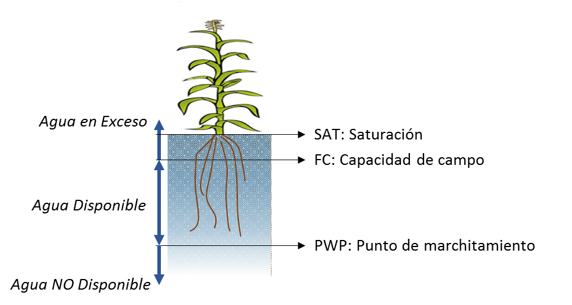

**Figura 49. **Esquema de la disponibilidad del agua en el suelo (Elaboración propia).

La capacidad de retener el agua en el suelo depende en gran medida de su textura. Como el suelo es un medio poroso, dependiendo del tamaño de los espacios entre partículas, el suelo está en capacidad de almacenar más o menos agua.  El tamaño de las partículas del suelo, o textura se define según su contenido de arena, limo y arcilla. Es así como suelos arenosos tienen poca capacidad de retener agua por su estructura de partículas gruesas con macroporos. De otro lado suelos de partículas finas retienen el agua en microporos y tienen una mayor capacidad de campo [44]. Esta relación se puede ver de forma esquemática en la Figura 22, en la que se presenta el porcentaje de volumen de agua para la capacidad de campo según la textura de suelo, desde arenas con partículas gruesas hasta arcilla de partículas finas. 

En la figura se puede ver como la capacidad campo o de retener agua en el suelo aumenta a medida que las partículas de suelo son más finas. Sin embargo, para que el agua sea disponible para las plantas, el contenido de agua en el suelo debe mantenerse sobre el punto de marchitamiento. Como se ve en la figura, el punto de marchitamiento también aumenta en la medida que la textura del suelo es más fina. Esto se debe a que, aunque hay mayor volumen de agua retenida del suelo fino, la fuerza que se ejerce para mantener el agua en los microporos es muy alta y las plantas no tienen capacidad de succionarla. Entonces, para propósitos agrícolas es preferible cultivar en suelos de textura media, tipo francos o franco-limosos, que tienen una alta disponibilidad de agua para las plantas.

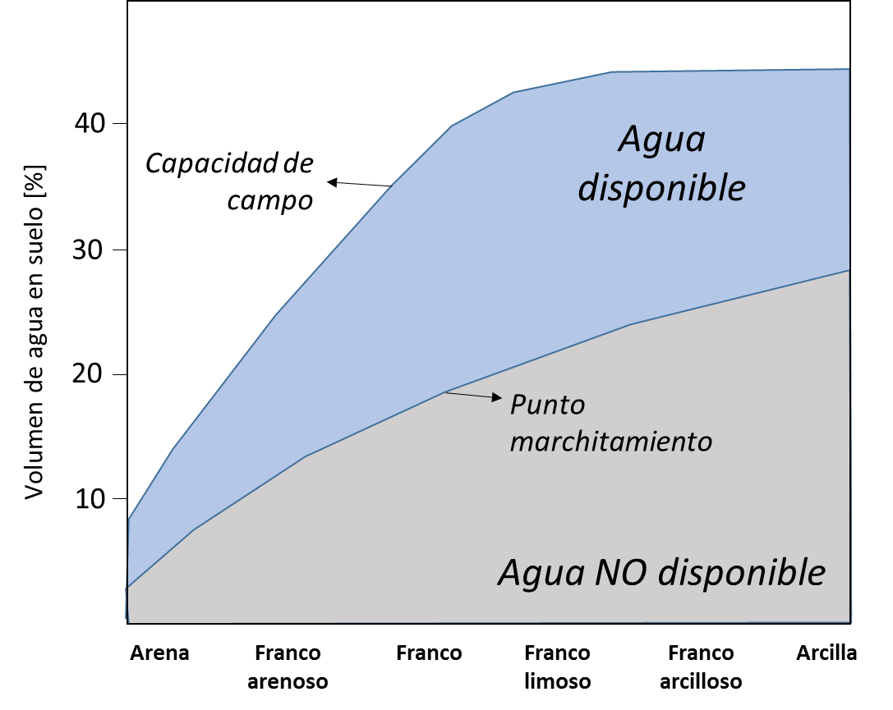

**Figura 50.** Esquema de retención de agua según tipo de suelo (Elaboración propia a partir de [44]).

La información requerida del suelo incluye su tipo, textura, perfil en profundidad y nivel freático. Para el cálculo de la escorrentía se calcula el número de curva a partir de la información de uso y tipo de suelo. Este procedimiento se muestra de forma esquemática en la Figura 23, en la que también se indica el tipo de información de entrada y los resultados. 

**Figura 51.** Esquema metodología aplicada para determinar características del suelo necesarias en el módulo de vulnerabilidad para evaluar riesgo en el sector agrícola. (SCS: Soil Conservation Service) (Fuente: elaboración propia).

Los valores de contenido volumétrico de agua en suelo para condiciones de saturación, capacidad de campo y punto de marchitamiento se determinan a partir de evaluaciones locales. Sin embargo, en caso de no contar con información, la metodología propuesta hace uso de valores recomendados por el modelo AquaCrop que suministra valores por defecto para estos parámetros [45]. 

**Tabla 2.** Valores de parámetros de contenido volumétrico de agua por defecto en el modelo AquaCrop.

| Tipo suelo | SAT [%vol] | FC [%vol] | PWP [%vol] |
| --- | --- | --- | --- |
| arena | 36 | 13 | 6 |
| arenoso franco | 38 | 16 | 8 |
| franco arenoso | 41 | 22 | 10 |
| franco | 46 | 31 | 15 |
| franco limoso | 46 | 33 | 13 |
| limoso | 43 | 33 | 9 |
| franco arcillo arenoso | 47 | 32 | 20 |
| franco arcilloso | 50 | 39 | 23 |
| franco arcillo limoso | 52 | 44 | 23 |
| arcillo arenoso | 50 | 39 | 27 |
| arcillo limoso | 54 | 50 | 32 |
| arcilla | 55 | 54 | 39 |
| impermeable | 0.5 | 0.3 | 0.1 |

La determinación de la textura del suelo se hace a partir de las fracciones de arcilla, limo y arenas que lo compongan. Esta clasificación por tipo que se muestra en la tabla anterior se obtiene a partir del triángulo de clase textural del suelo, publicado por el Departamento de Agricultura de los Estados Unidos, USDA por sus siglas en inglés. Este esquema se presenta en la Figura 24.

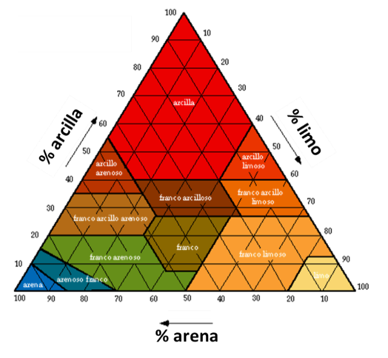

**Figura 52.** Triángulo de clases texturales básicas de suelos según el tamaño de partículas. Elaborado por el Departamento de Agricultura de los Estados Unidos (USDA).

Manejo

El modelo tiene la capacidad de incorporar las prácticas de manejo en la respuesta del rendimiento de los cultivos, incluyendo el riego y manejo de campo. Las opciones de manejo de riego incluyen la selección de métodos de aplicación de agua y la definición de programas de riego. Las opciones de manejo de campo incluyen la fertilización del suelo, la cobertura del suelo para evitar la evaporación y el uso de protecciones para controlar el escurrimiento superficial. Este tipo de características serán incluidas en la modelación en la medida en que la información necesaria esté disponible. 

La dinámica de la respuesta de los cultivos al estrés hídrico o térmico

Las condiciones de estrés hídrico o térmico son representadas por un coeficiente de estrés ( $Ks$ ) y un umbral para los indicadores de estrés.  $Ks$  es un modificador que cuantifica la intensidad del efecto que produce el estrés hídrico en los procesos de crecimiento específicos para un cultivo y etapa de crecimiento. Como se observa en la Figura 25, los valores de  $Ks$  varían entre 0 (estrés total) y 1 (sin estrés), siguiendo una función lineal o convexa (el grado de curvatura se establece durante la calibración del modelo). Los umbrales para el estrés hídrico están relacionados con el agotamiento del agua u oxígeno del suelo, mientras que los umbrales asociados al estrés por temperatura del aire están relacionados con los grados de crecimiento. 

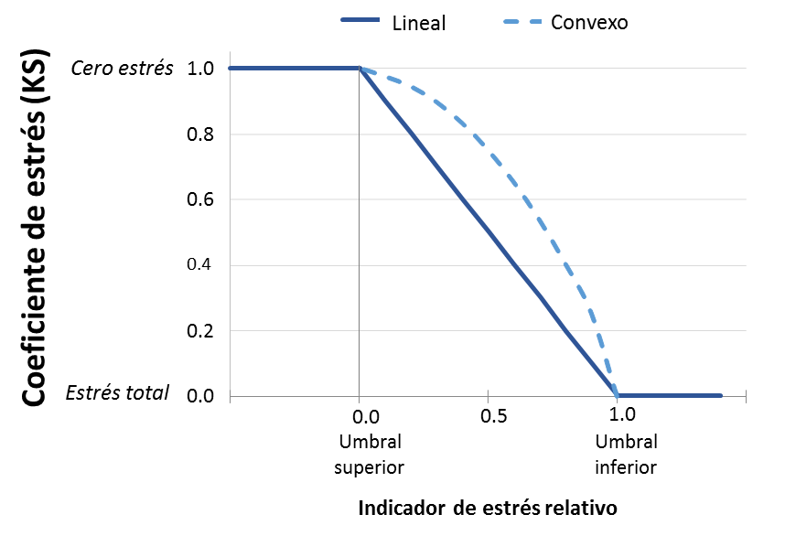

**Figura 53.** Función del coeficiente de estrés (Ks) (Elaboración propia a partir de [1] p. 32).

El modelo permite calcular los efectos del déficit o exceso hídrico (entendido como falta o exceso de agua en la región radicular del suelo) en el crecimiento de la cobertura vegetal, la conductancia estomática, la senescencia temprana, la profundización de la raíz y el índice de cosecha. La Figura 26 muestra estos cinco procesos (líneas punteadas), dentro del esquema general de desarrollo de rendimiento bajo estrés hídrico. Un resumen general del proceso de cálculo se presenta a continuación. Nótese que todos los pasos del proceso se calculan en intervalos de tiempo diarios.

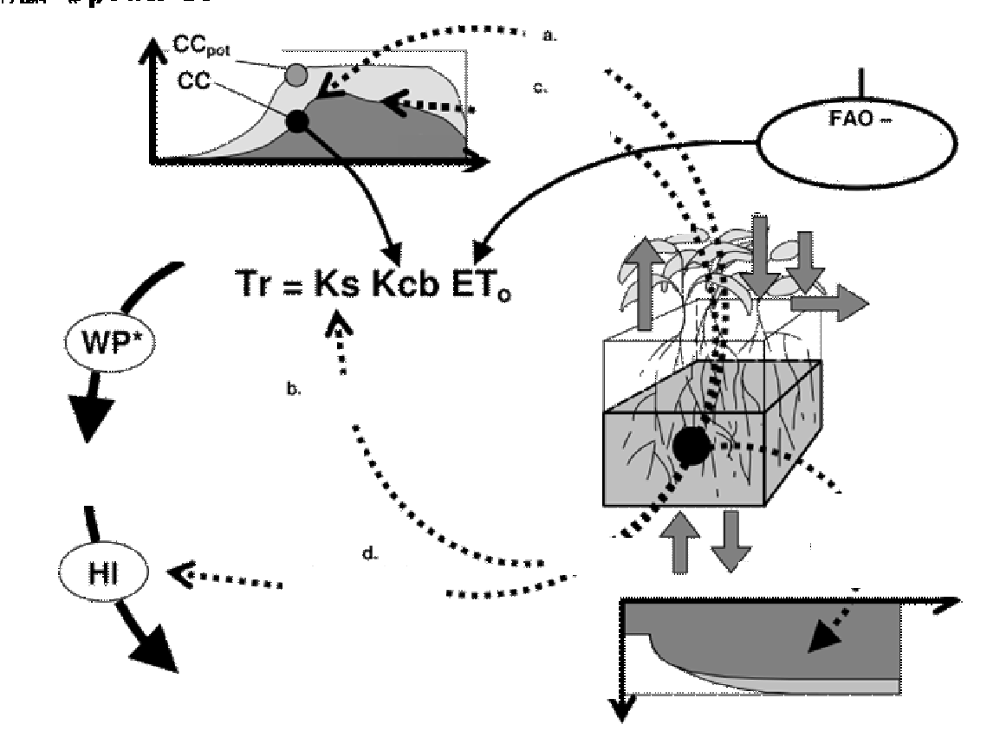

**Figura 54.** Representación esquemática de la respuesta del cultivo al estrés hídrico (Adaptado de [45]).

*Balance del agua en el suelo*: determina la cantidad de agua almacenada en la zona radicular, contabilizando los flujos de agua entrante y saliente. El crecimiento del cultivo no se ve afectado y no hay estrés hídrico ( $Ks=1$ ) entre el nivel de capacidad de campo (FC) y el nivel superior de agotamiento de la zona de raíz. En el otro extremo, entre el umbral inferior en el agotamiento de la zona de raíz y el punto de marchitamiento permanente hay tensión total ( $Ks=0$ ) y el crecimiento del cultivo se ve completamente impactado. A medida que se reduce el agua almacenada en el volumen de control del suelo, el coeficiente de estrés disminuye.

*Expansión de la cobertura vegetal*: Se simula el efecto del déficit hídrico en la expansión de la cobertura, mediante la reducción del coeficiente de crecimiento vegetal (CGC) por el coeficiente de estrés hídrico para la expansión de cobertura  $Ks, exp,w$ , y modificando el coeficiente de disminución de cobertura por coeficiente de estrés hídrico de senescencia temprana  $Ks, sen$ .

Por una parte, cuando el agotamiento de la zona radicular está por debajo de los umbrales superiores de contenido de agua,  $Ks, exp,w$  se hace menor que 1 y la cobertura reduce su tasa de expansión. Cuando el agotamiento de la zona radicular está por debajo del límite inferior,  $Ks, exp,w=0$  y se detiene el desarrollo de la cobertura. Por otra parte, cuando el estrés hídrico es severo (agotamiento de la zona radicular cerca del punto de marchitamiento permanente), se desencadena la senescencia temprana. El grado de senescencia está descrito por  $Ks, sen$ . La cobertura vegetal máxima no puede ser alcanzada bajo condiciones de estrés hídrico, o podría alcanzarse en una última etapa de la temporada, como se muestra en la Figura 28.

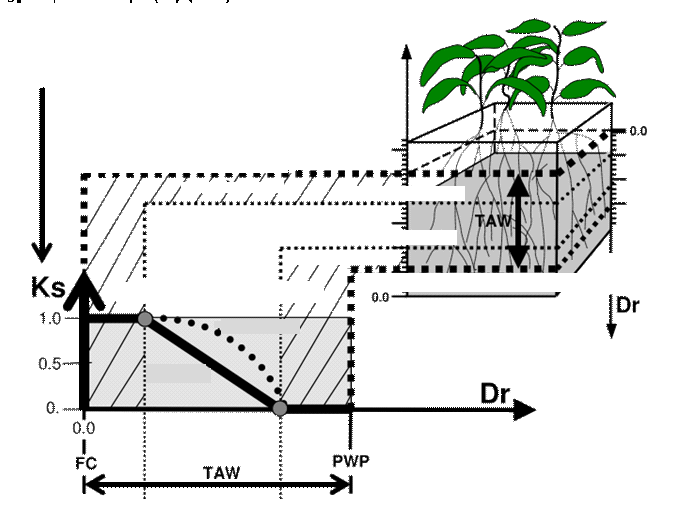

**Figura 55.** Representación esquemática del coeficiente de estrés hídrico (Adaptado de [45])

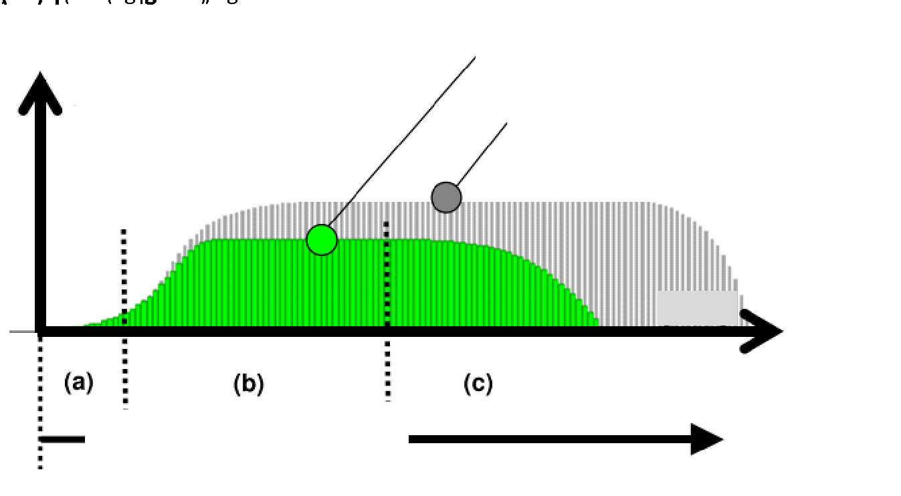

**Figura 56.** Representación esquemática de la expansión de la cobertura vegetal, bajo condiciones óptimas (gris) y bajo estrés hídrico (verde). (Adaptado de [45]).

*Transpiración*: se calcula la potencia de evaporación de la atmósfera considerando un coeficiente de cultivo  $Kcb$  y el coeficiente de estrés hídrico  $Ks$ , como se muestra en la ecuación 6. La evapotranspiración potencial ( $ETo$ ) se calcula usando la ecuación de Penman-Monteith de FAO [32].

|  | (6) |
| --- | --- |

El coeficiente de transpiración del cultivo  $Kcb$  es un parámetro que debe ser ajustado continuamente en función de la cobertura vegetal simulada, con el fin de considerar los efectos de envejecimiento y senescencia. El coeficiente de estrés hídrico  $Ks$ ,  utilizado en caso de escasez de agua es un coeficiente de estrés por cierre estomático  $Ks, sto$ , también con valores entre 1 (sin estrés) y 0 (total estrés).

*Biomasa arriba de la superficie*: La relación entre la biomasa producida y el agua consumida por un cultivo específico se conoce es la productividad del agua (WP), la cual tiende a ser lineal para una condición climática dada, como se muestra en la ecuación 7. Para incluir condiciones climáticas alteradas, se emplea la productividad del agua normalizada  $WP*$ * en la simulación del desarrollo de biomasa sobre el suelo. Utilizando el parámetro normalizado, el modelo puede aplicarse a diferentes regiones y estaciones. La normalización se realiza para la concentración atmosférica de  $CO2$  y la demanda evaporativa de la atmósfera [45].

La producción de biomasa arriba de la superficie se calcula, para un paso de tiempo diario, de la siguiente manera:

|  | (7) |
| --- | --- |

en donde la productividad del agua normalizada  $WP*$  se multiplica por la relación entre la transpiración del cultivo y la evapotranspiración de referencia del día de cálculo  $TriEToi$  (expresión que se agrega durante todo el periodo de desarrollo del cultivo), y por el coeficiente de estrés por temperatura  $Ksb$ . Este coeficiente decrece a medida que la temperatura disminuye, y alcanza un valor de cero cuando hace demasiado frío y se detiene el crecimiento vegetal.

*Rendimiento*: Como se mencionó anteriormente, el rendimiento se calcula de multiplicar la biomasa sobre el suelo por un índice de cosecha, que depende del tipo de cultivo. Para considerar el estrés hídrico, debe ajustarse el índice de cosecha de su valor de referencia  $HIo$  en condiciones óptimas, a su valor en condiciones reales, mediante la inclusión del factor  $fHI$ :

|  | (8) |
| --- | --- |

El índice de cosecha puede ajustarse al déficit hídrico y a las variaciones de la temperatura del aire, y depende de la etapa del cultivo y la intensidad del estrés durante la temporada de crecimiento.

### Enfoque probabilista en la evaluación del riesgo	 {.unnumbered}

Para la metodología propuesta, el objetivo de la evaluación probabilista del riesgo es evaluar las pérdidas potenciales para el sector agropecuario debido a la ocurrencia natural de condiciones de clima extremo, considerando exposición y vulnerabilidad de cultivos, pasturas y ganado. Este enfoque permite identificar áreas geográficas y tierras cultivadas que se encuentran en riesgo. El riesgo se modela en términos de pérdida económica, definida como una variable aleatoria que incorpora la incertidumbre presente en los componentes de amenaza, vulnerabilidad y exposición del modelo. 

Al realizar la evaluación de riesgo por eventos, las condiciones de clima extremo valorados en el módulo de amenaza se organizan en una gráfica de pérdida vs. tiempo, como se muestra en la Figura  29. Al establecer una pérdida económica  $p$ , se puede identificar en la gráfica todos los eventos cuyas pérdidas exceden  $p$ . Los tiempos entre eventos  $(T1, T2, …,T1n)$  también se estiman a partir de la Figura 29 y se usan para estimar el parámetro  $λ$  de una distribución exponencial, la cual corresponde a la distribución de probabilidad del tiempo entre eventos de un proceso de Poisson. Además, este parámetro de la distribución exponencial tiene la particularidad de ser el mismo*λ* que define el proceso de Poisson completamente (i.e. es la misma tasa de excedencia,  $λ$  = ***v(p)***). Para el caso de la evaluación prospectiva del riesgo, la ventana de tiempo considerada para calcular  $λ$  es igual al número de simulaciones estocásticas de las series climáticas, por ejemplo 1,000 años equivalentes.

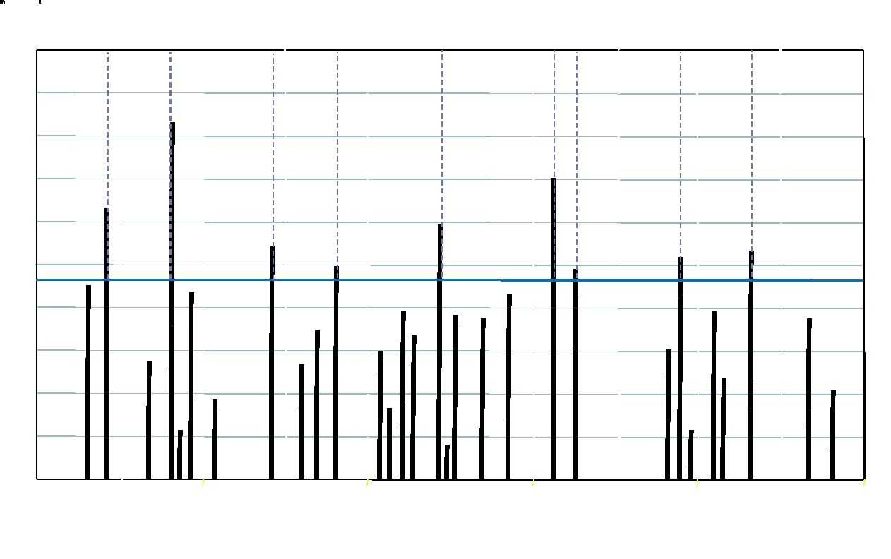

**Figura 57.** Pérdidas por evento en una ventana amplia de tiempo (Elaboración propia).

La tasa de excedencia poblacional ( $λ$ ) es estimada mediante la tasa de excedencia empírica ( $Λ$ ) de la siguiente manera:

|  | (9) |
| --- | --- |

En donde *n* es el número de eventos que superan la pérdida  $p$  y  $Ti$ son los tiempos observados. Este estimador cumple con los cuatro criterios estadísticos de calidad de la estimación de parámetros de distribuciones de probabilidad: es no sesgado, de varianza mínima, consistente y suficiente. Ahora bien, es posible demostrar que el estimador  $Λ$  sigue una distribución de probabilidad *Gamma inversa* con parámetros *n* y (*n*-1) $λ$ , a partir de lo cual se puede determinar su coeficiente de variación (CV) como:

|  | (10) |
| --- | --- |

El coeficiente de variación indica la relación entre la desviación estándar y la media de una variable aleatoria. Como se indica en la Ecuación 7, CV disminuye a medida que el número de datos (*n*) aumenta. La Ecuación 7 es una fórmula estándar, aplicable a cualquier problema de estimación del riesgo por eventos, en donde el CV de la tasa de excedencia varía con el tamaño de la muestra cómo se indica en la Figura 30.

**Figura 58.** Variación del coeficiente de variación de la tasa de excedencia con el tamaño de la muestra (Elaboración propia).

El CV crece rápidamente a medida que *n* disminuye. Esto quiere decir que, al estimar la tasa de excedencia de pérdidas grandes (eventos catastróficos) a partir de pocos eventos modelados, para los cuales se contará con un valor pequeño de *n* (es decir, pocos eventos que exceden esa pérdida dentro del conjunto de escenarios de sequía), la dispersión de la estimación (i.e. su desviación estándar) es muy grande en comparación a la estimación misma, lo cual implica una mayor incertidumbre. Por el contrario, al estimar la tasa de excedencia de pérdidas con un mayor número de eventos modelados, *n* será necesariamente un número más grande y, en consecuencia, la dispersión de la tasa disminuye a valores incluso despreciables en la práctica. Esto es por lo que, para que el resultado sea estadísticamente suficiente se debe hacer uso de un gran número de años simulados dentro de los cuales se pueda identificar un número considerable de eventos de sequía.

Curva de excedencia de pérdidas

Es así como el riesgo se define por medio de la curva de excedencia de pérdidas (ver Figura 31), la cual establece el número de veces en un año en las que un valor de pérdida se verá excedido. Esta cantidad se conoce como la *tasa anual de excedencia*, la cual es un valor único y específico para cada cuantía de pérdida, e incorpora el aporte de todos los posibles escenarios contenidos en la evaluación de la amenaza. Como se mencionó anteriormente, la tasa de excedencia es igual al parámetro  $λ$  que define la ocurrencia en el tiempo de los eventos de pérdida, es decir:

|  | (11) |
| --- | --- |

en donde  $p$  es la pérdida económica,  $νp$  es su tasa anual de excedencia,  $np$  es el número total de eventos en los cuales se supera  $p$  y  $Ti$  es el tiempo  $i$  entre eventos que superan  $p$ . El periodo de retorno  $Tr(p)$  se calcula como el inverso de la tasa de excedencia  $νp$ .

|  | (12) |
| --- | --- |

El periodo de retorno es el valor esperado del tiempo entre eventos. Es decir, corresponde al periodo de tiempo promedio para el cual, considerando una ventana temporal de observación suficientemente amplia, se verá igualada o excedida una pérdida dada, y se muestra en el eje vertical de la derecha de la curva ejemplo mostrada en la Figura 31.

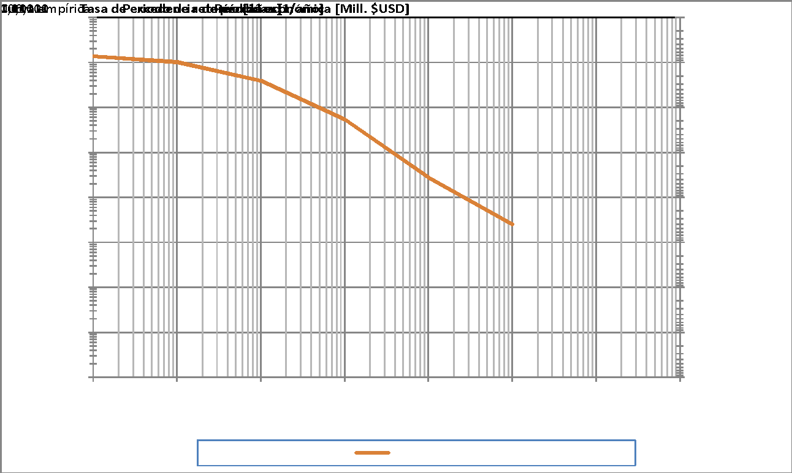

**Figura 59.** Ejemplo de curva de excedencia de pérdidas. El eje vertical muestra la tasa de excedencia (izquierda) y su valor inverso o periodo de retorno (derecha). El eje horizontal muestra la pérdida asociada (Elaboración propia).

El cálculo de la Ecuación (11 corresponde a la estimación de la tasa de excedencia de las cuantías de pérdida que ocurren en todos los activos expuestos (unidades de tierra cultivada) para todos los eventos potencialmente nocivos incluidos en el modelo de amenaza (el conjunto de escenarios estocásticos previamente identificados). La pérdida para un evento se determina mediante la suma de las pérdidas causadas en las unidades individuales cultivadas. 

Para la evaluación del riesgo de sequía, la pérdida  $p$  en la Ecuación (11 se debe a la reducción en los ingresos de producción (lucro cesante) de cultivos debido a la reducción en el rendimiento de cada unidad de tierra cultivada, en donde se conocen el tipo de suelo, tipo de cultivo, su estacionalidad y su valor económico de reposición. La pérdida económica en una unidad cultivada, para un escenario específico, se calcula como:

|  | (13) |
| --- | --- |

en donde  $Pi$  es la pérdida económica para el escenario  $i$ ,  $A$  es el área de la unidad de tierra cultivada,  $PV$  es la valoración económica del cultivo,  $Yx$   es el rendimiento máximo (calculado bajo condiciones óptimas) y  $Yi$  es el rendimiento para el escenario  $i$  bajo condiciones de déficit hídrico. 

**CONFLICTO DE INTERESES**

Los autores no declaran conflicto de intereses.

## IDENTIFICACIÓN DEL AUTOR {.unnumbered}

Omar Darío Cardona 		

Gabriel Bernal 		

María Alejandra Escovar  	https://scholar.google.com/citations?hl=en&user=Ac5JYNoAAAAJ

## BIBLIOGRÁFIA {.unnumbered}

1. 	Wilhite, D. A. (1993). The Enigma of Drought. En: D. A. Wilhite (ed.), *Drought Assessment, Management, and Planning: Theory and Case Studies*. Boston, MA: Springer US; pp. 3-15.  https://doi.org/10.1007/978-1-4615-3224-8_1

2. 	UNGRD (Unidad Nacional para la Gestión del Riesgo de Desastres), Ingeniar Risk Intelligence. (2018). *Atlas de Riesgo de Colombia: revelando desastres latentes*. Bogotá. 264 p.

3. 	Mckee, T. B., Doesken, N. J. & Kleist, J. (1993, January). *The relationship of drought frequency and duration to time scales*. AMS 8th Conference on Applied Climatology. Anaheim, California.

4. 	IDEAM. (2019). *Estudio Nacional del Agua 2018*. Bogota. 452 p.

5. 	UNGRD - (Unidad Nacional para la Gestión del Riesgo de Desastres). (2016). *Fenómeno El Niño: Análisis comparativo 1997-1998/2014-2016*. Bogotá.142 p.

6. 	Melo, S., Riveros, L., Romero, G., Álvarez, A., Diaz, C. & Calderon, S. (2017). *Efectos Económicos de Futuras Sequías en Colombia: Estimación a partir del Fenómeno El Niño 2015*. Bogotá.

7. 	Salgado-Gálvez, M.A., Bernal, G.A., Zuloaga, D., Marulanda, M. C., Cardona, O-D. & Henao, S. (2017). Probabilistic Seismic Risk Assessment in Manizales, Colombia: Quantifying Losses for Insurance Purposes. *International Journal of Disaster Risk Science*, 8, 296–307. https://doi.org/10.1007/s13753-017-0137-6

8. 	Bernal GA, Salgado-Gálvez MA, Zuloaga D, Tristancho J, González D, Cardona O-D. (2017). Integration of Probabilistic and Multi-Hazard Risk Assessment Within Urban Development Planning and Emergency Preparedness and Response: Application to Manizales, Colombia. *International Journal of Disaster Risk Science, *8(3), 270-83. https://doi.org/10.1007/s13753-017-0135-8

9. 	Cardona, O-D., Ordaz, M. G., Mora, M. G., Salgado-Gálvez, M. A, Bernal, G. A., Zuloaga-Romero, D, et al. (2014). Global risk assessment: A fully probabilistic seismic and tropical cyclone wind risk assessment. *International Journal of Disaster Risk Reduction*, 10, Part B, 461-76. https://doi.org/10.1016/j.ijdrr.2014.05.006

10. 	Salgado-Gálvez MA, Cardona OD, Carreño M, Barbat A. (2015). Probabilistic seismic hazard and risk assessment in Spain. En A. H. Barbat (Ed). *Monograph Series in Earthquake Engineering*. https://www.scipedia.com/public/Salgado-Galvez_et_al_2015a

11. 	Torres, M. A., Jaimes, M. A., Reinoso, E. & Ordaz, M. (2014). Event-based approach for probabilistic flood risk assessment. *International Journal of River Basin Management, *12(4), 377-89. https://doi.org/10.1080/15715124.2013.847844

12. 	Jenkins, S., Magill, C., McAneney. J. & Blong, R. (2012). Regional ash fall hazard I: a probabilistic assessment methodology. *Bulletin of Volcanology*, 74(7), 1699-712. https://doi.org/10.1007/s00445-012-0627-8

13. 	Quijano, J. A., Jaimes, M. A , Torres, M. A., Reinoso, E., Castellanos, L., Escamilla, J., et al. (2015). Event-based approach for probabilistic agricultural drought risk assessment under rainfed conditions. *Natural  Hazards*, 76(2), 1297-318. https://doi.org/10.1007/s11069-014-1550-4

14. 	Bernal, G. A., Escovar, M. A., Zuloaga, D., & Cardona, O. D. (2017). Agricultural Drought Risk Assessment in Northern Brazil: An Innovative Fully Probabilistic Approach. En V. Marchezini,  B. Wiesner, S. Saito, L. Londe (Eds.), *Reduction of Vulnerability to Disasters: from Knowledge to Action*. RiMa Edito, pp. 331-56.

15. 	Steduto, P., Hsiao, T. C., Fereres, E. & Raes, D. (2012). *Crop yield response to water.* FAO Irrigation and Drainage Paper 66, pp 174-180.

16. 	UNISDR (United Nations International Strategy for Disaster Reduction). (2009). *Terminología sobre Reducción del Riesgo de Desastres.* Estrategia Internacional para la Reducción Desastres de las Naciones Unidas, 43 p.

17. 	Funk, C., Peterson, P., Landsfeld, M., Pedreros, D., Verdin, J., Shukla, S., et al. (2015) The climate hazards infrared precipitation with stations - A new environmental record for monitoring extremes. *Scientific Data*, *2*, 150066, 1-21. https://doi.org/10.1038/sdata.2015.66

18. 	Sheffield, J., Goteti. G. & Wood, E. F. (2006) Development of a 50-year high-resolution global dataset of meteorological forcings for land surface modeling.* Journal of Climate, 19*(13), 3088-111. https://doi.org/10.1175/JCLI3790.1

19. 	Copernicus Climate Change Service. (2017). *ERA5: Fifth generation of ECMWF atmospheric reanalyses of the global climate.* Copernicus Climate Change Service Climate Data Store (CDS). https://cds.climate.copernicus.eu/cdsapp#!/home

20. 	Urrea, V., Ochoa, A. & Mesa, O. (2017). V*alidación de la base de datos de precipitación CHIRPS para Colombia a escala diaria, mensual y anual en el periodo 1981-2014.* Universidad Nacional de Colombia Sede Medellín.

21. 	Verdin, A, Rajagopalan, B., Kleiber, W. & Funk. C. (2015). A Bayesian kriging approach for blending satellite and ground precipitation observations. *Water Resources Ressearch, 51*(2), 908-21. https://doi.org/10.1002/2014WR015963

22. 	IPCC (Intergovernmental Panel on Climate Change). (2013). *Climate Change 2013 - The Physical Science Basis*. Cambridge: Cambridge University Press; 1535 p.

23. 	Mishra, A. K. & Singh, V. P. (2010). A review of drought concepts. *Journal of Hydrology, 391*,1-2, 202-16. https://doi.org/10.1016/j.jhydrol.2010.07.012

24. 	IDEAM (Instituto de Hidrología, Meteorología y Estudios Ambientales). (2020). *Coberturas Nacionales. Mapas de coberturas de la tierra. Ecosistemas. Monitoreo de suelos y coberturas de la tierra*. http://www.ideam.gov.co/web/ecosistemas/coberturas-nacionales

25. 	DANE (Departamento Administrativo Nacional de Estadística). (2016). *III Censo Nacional Agropecuario 2014.* Tomo 2, Resultados.

26. 	DANE (Departamento Administrativo Nacional de Estadística). (2019). *Encuesta Nacional Agropecuaria - ENA 2017*. Bogotá, pp. 1-31.

27. 	MADR (Ministerio de Agricultura y Desarrollo Rural). (2016). *Producción nacional por producto*. Evaluaciones Agropecuarias del Ministerio de Agricultura y Desarrollo Rural. Agronet.

28. 	FAO/IIASA/ISRIC/ISSCAS/JRC. *Harmonized World Soil Database (version 1.2)*. (2012). FAO, Rome, Italy and IIASA, Laxenburg, Austria.

29. 	FAO (Food and Agriculture Organization of the United Nations) (2018). *The impact of disasters and crises on agriculture and food security*. 168 p.

30. 	Banimahd, S. A. & Khalili, D. (2013). Factors Influencing Markov Chains Predictability Characteristics, Utilizing SPI, RDI, EDI and SPEI Drought Indices in Different Climatic Zones. *Water Resources Management, 27*(11), 3911-28. https://doi.org/10.1007/s11269-013-0387-z

31. 	Wilks, D. S. (2006). *Statistical methods in the atmospheric sciences*. International Geophysics Series. 464 p.

32. 	Allen, R. G., Pereira, L. S., Raes, D. & Smith, M. (1998). Crop evapotranspiration: Guidelines for computing crop requirements. *Irrigation and Drainage Paper No 56*, FAO. 300 p.

33. 	Raes, D. (2009). *The ETo Calculator Reference Manual.* Food and Agricultural Organization of the United Nations (FAO), Rome, pp 1-38. 

34. 	Wilhite, D. A. & Glantz, M. H. (1985). Understanding the Drought Phenomenon: The Role of Definitions. *Water International, 10*(3), 111-20. https://doi.org/10.1080/02508068508686328

35. 	Jayanthi, H. Assessing the agricultural drought risks for principal rainfed crops due to changing climate scenarios using satellite estimated rainfall in Africa. *Background Paper GAR Global Assessment Report on Disaster Risk Reduction. *28 p.

36. 	Palmer W. C. (1965).* Meteorological Drought.* U.S. Weather Bureau, Research Paper No. 45. 58 p.

37. 	Mckee, T. B., Doesken, N. J. & Kleist, J. (1993). The relationship of drought frequency and duration to time scales. *8th Conference Applied Climatology*, pp. 179-84.

38. 	Byun, H. R. & Wilhite, D. A. (1999). Objective quantification of drought severity and duration. *Journal of Climate, 12*(9):2747-56. https://doi.org/10.1175/1520-0442(1999)012<2747:OQODSA>2.0.CO;2

39. 	Tsakiris, G., Pangalou, D. & Vangelis, H. (2007). Regional drought assessment based on the Reconnaissance Drought Index (RDI). *Water Resour Managament, 21*(5), 821-33. https://doi.org/10.1007/s11269-006-9105-4

40. 	Vicente-Serrano, S. M., Beguería, S. & López-Moreno, J. I. (2010). A multiscalar drought index sensitive to global warming: The standardized precipitation evapotranspiration index. *Journal of **Climate, 23*(7), 1696-718. https://doi.org/10.1175/2009JCLI2909.1

41. 	Verdin, A., Funk, C., Rajagopalan, B. & Kleiber, W. (2016). Kriging and local polynomial methods for blending satellite-derived and gauge precipitation estimates to support hydrologic early warning systems. *IEEE Transactions on Geoscience and Remote Sensing, 54*(5), 2552-62. https://doi.org/10.1109/TGRS.2015.2502956

42. 	ArcGIS. (2020). C*ómo funcional el kriging. Conceptos del conjunto de herramientas de interpolación ráster*. https://desktop.arcgis.com/es/arcmap/10.3/tools/spatial-analyst-toolbox/understanding-interpolation-analysis.htm

43. 	Li, J. & Heap, A. D. (2008). A Review of Spatial Interpolation Methods for Environmental Scientists. *Geoscience Australia,* Record 2008/23, 137.

44. 	Sheppard, J. & Hoyle, F. (2018). *Water availability. Healthy Soils for Sustainable Farms programme*. Avon Catchment Council, Department of Agriculture and Food, Western Australia. http://soilquality.org.au/factsheets/water-availability

45. 	Raes, D., Steduto, P., Hsiao. T. C. & Fereres, E. (2011). *FAO cropwater productivity model to simulate yield response to water AquaCrop.* Reference Manual of AQUACROP. 56 p.

**4**

