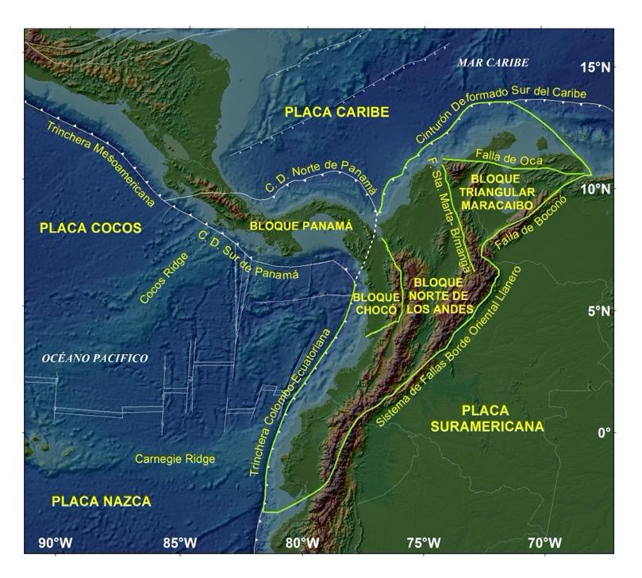
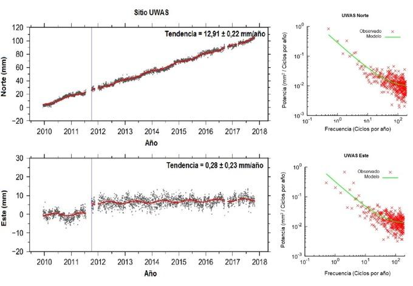
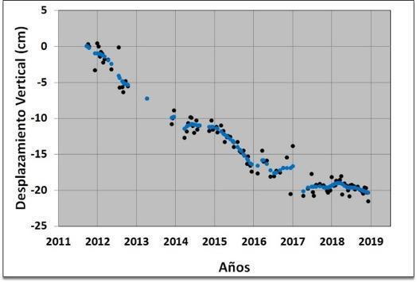
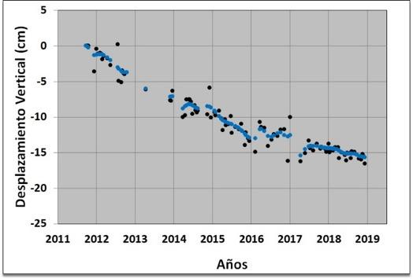
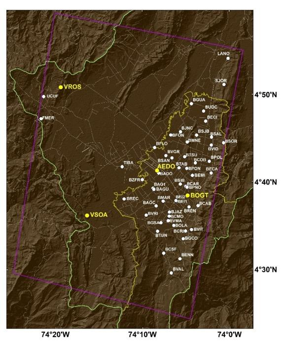
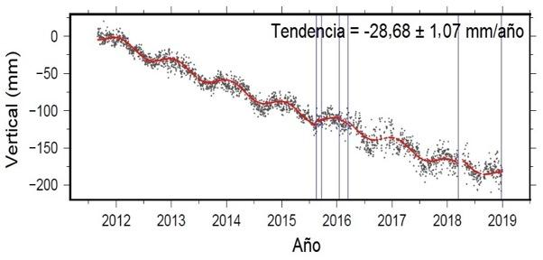
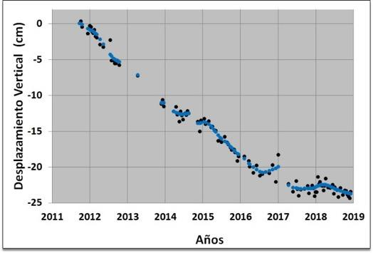
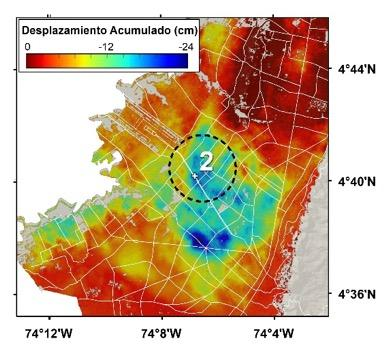
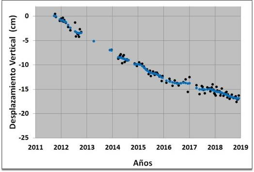
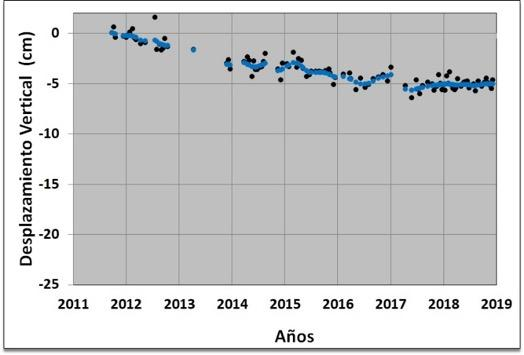

1Servicio Geológico Colombiano, Dirección de Geoamenazas, Grupo Investigaciones Geodésicas Espaciales, Diagonal 53 # 34-53, Bogotá, Colombia

2Centro de Investigación en Mitigación de Desastres, Universidad de Nagoya, Japón

*Autor de contacto: Héctor Mora Páez, Servicio Geológico Colombiano, Grupo Investigaciones Geodésicas Espaciales, Diagonal 53 # 34-53, Bogotá, Colombia.  Correo-e: 

## Resumen {.unnumbered}	

Con el fin de avanzar en el conocimiento de los fenómenos que ocurren en la corteza terrestre en la esquina noroccidental de Suramérica y suroriental de Centroamérica, región de alta complejidad tectónica, el Servicio Geológico Colombiano emplea diferentes tipos de instrumentación, métodos y técnicas, y entre ellas de geodesia espacial, correspondiente a la aplicación en estudios geodinámicos de los conceptos de geodesia tectónica y geodesia de imágenes. En geodesia espacial, basado en posicionamiento GNSS de alta precisión, se han determinado las velocidades en estaciones geodésicas permanentes de operación continúa localizadas en las placas de Nazca, Suramérica y Caribe, y en los bloques Norte de los Andes y Panamá. Estas velocidades permiten confirmar la subducción oblicua de la placa de Nazca por debajo de Suramérica; la acumulación de deformación en el límite de placas Nazca-Suramérica en el margen Colombia-Ecuador, sugiriendo la posibilidad de generación de un sismo fuerte en esta zona; el movimiento general en sentido sur-norte del Bloque Norte de los Andes, hasta la latitud 7.5°N, donde presentan cambio de tendencia hacia el noreste; la convergencia de la placa Caribe en dirección sureste, así como la colisión del bloque de Panamá con respecto al Bloque Norte de los Andes. El concepto de geodesia de imágenes se ha orientado por ahora, al estudio de subsidencia en la ciudad de Bogotá mediante la aplicación de técnicas interferométricas de radar de apertura sintética-InSAR, empleando imágenes del sensor TerraSAR-X, cuyos resultados, combinados con los obtenidos con GPS, permiten establecer valores cuantitativos de este fenómeno en varios sectores de la ciudad. Los resultados obtenidos en las dos aplicaciones constituyen importante insumo en la gestión del riesgo, los primeros, a ser considerados en los estudios de la amenaza sísmica del país, y los segundos, en la planeación urbana de la ciudad de Bogotá, en especial para considerar aspectos del crecimiento horizontal y vertical de las construcciones. 

**Palabras clave**

GNSS, geodinámica, Bloque Norte de los Andes, InSAR, subsidencia, tectónica de placas

**Contribution of Space Geodesy in Risk Management in Colombia. Study cases**

## Abstract {.unnumbered}

In order to advance in the knowledge of the phenomena that occur in the earth's crust in the northwestern corner of South America and southeast of Central America, a region of high tectonic complexity, the Colombian Geological Survey has been using different types of instrumentation, methods and techniques, and among them of space geodesy, corresponding to the application in geodynamic studies of the tectonic and imaging geodesy concepts. Space geodesy, based on high-precision GNSS positioning, velocities have been estimated at GPS permanent stations of continuous operation located on the Nazca, South America, and Caribbean plates, and also in the North Andean and Panama blocks. These velocities confirm the oblique subduction of the Nazca plate beneath South America plate; the accumulation of deformation at the Nazca-South America plate boundary on the Colombia-Ecuador margin, suggesting the possibility of generating a strong earthquake in this area; the general motion in the south-north direction of the North Andean Block, up to latitude 7.5°N, where they present a trend change towards the northeast; the convergence of the Caribbean plate in a southeast direction, as well as the collision of the Panama block with the North Andean Block. The concept of imaging geodesy has been oriented so far, to the study of the land subsidence in the Bogotá city by applying Interferometric radar techniques-InSAR. Results obtained using images from the TerraSAR-X sensor have been combined with those obtained with GPS in order to establish quantitative values ​​of the land-subsidence in several areas of the city. The results obtained in the two applications constitute an important input in risk management, the first one, to be considered in the studies of the seismic hazard in the country, and the second one, in the urban planning of the Bogotá city especially to consider aspects of horizontal and vertical growth of buildings.

**Keywords** 

GNSS, geodynamics, North Andean Block, InSAR, subsidence, plate tectonics

## INTRODUCCIÓN {.unnumbered}

La Tierra es eminentemente un sistema dinámico. Los procesos que ocurren en el interior de la Tierra y el movimiento de grandes volúmenes en la superficie terrestre se ligan estrechamente a la tectónica de placas, y a ello, la sismicidad y el volcanismo. De igual manera, los movimientos de grandes masas tanto en la atmósfera como en los océanos se asocian a procesos dinámicos. Muchas inquietudes que han surgido, generalmente relacionadas con geoamenazas, ciclo hidrológico e incluso acerca del cambio global, entre otras, no pueden explicarse si no se tiene conocimiento y entendimiento de los procesos relacionados con transporte de masas en el sistema Tierra. Para detectar movimientos asociados a procesos dinámicos que ocurren en el sistema Tierra, con alta precisión y resoluciones temporales, se emplean técnicas de geodesia espacial, en dos de sus componentes: geodesia de posicionamiento y geodesia de imágenes. Así, los grandes avances en las técnicas geodésicas espaciales y el rápido desarrollo de sistemas y fortalecimiento de las capacidades de transmisión de datos dan lugar al surgimiento de una verdadera revolución en el campo de estudio de la geodesia, tanto global como regional y local, permitiendo su aplicación en diversas disciplinas del conocimiento, entre ellas las relacionadas con las geociencias. La observación de desplazamientos en la superficie terrestre permite establecer el estado de deformación de la corteza terrestre, y su posible asociación con la ocurrencia de sismos, tsunamis, erupciones volcánicas, entre diversos tipos de amenazas [1]. Este artículo presenta dos casos de aplicación de técnicas geodésicas espaciales que contribuyen aportando nuevo conocimiento para la gestión del riesgo en Colombia.

## GEODESIA ESPACIAL GPS Y EL ESTUDIO DE LA DEFORMACIÓN DE LA CORTEZA TERRESTRE EN COLOMBIA {.unnumbered}

La esquina noroccidental de Suramérica y sureste de Centroamérica es una zona de alto interés científico en las geociencias donde se conjugan diferentes elementos de orden tectónico y volcánico. No hay otra parte en el mundo en la cual exista una placa tectónica mayor subduciendo por debajo de una gran placa continental a lo largo de una trinchera de casi 6,000 km, como es el caso de la subducción de la placa de Nazca por debajo de Suramérica [2]. Esta región se caracteriza por una directa relación de la actividad tectónica y volcánica con la interacción de las placas tectónicas de Suramérica, Nazca, Cocos y Caribe y los bloques Norte de los Andes, Maracaibo, Chocó y Panamá acuñados dentro de dichas placas, Figura 1 [3 -15]. 

**Figura 1.** Marco tectónico de la zona de estudio. Fuente del mapa: ETOPO1 [16].

Esta compleja tectónica dinámica e intensa deformación interplaca se manifiesta en una alta densidad de fallas, muchas de las cuales se consideran como activas o potencialmente activas. Además, la sismicidad se distribuye sobre un área que corresponde a un límite amplio que abarca el noroeste de Suramérica, Centro América y suroeste del Caribe, complejidad referida por Trenkamp [12] como un Margen amplio de placas. Dicha condición, junto con el potencial de ocurrencia de grandes sismos megathrust y tsunamis relacionados con la zona de subducción en el océano Pacífico, significa que un alto porcentaje de la población colombiana habita bajo una amenaza permanente de ocurrencia de sismos y tsunamis, con el potencial de causar grandes daños en términos de pérdida de vidas y destrucción de infraestructura [17]. Otra amenaza se asocia a los volcanes activos localizados en la región norte de los Andes, que tienen el potencial de generar erupciones devastadoras como la ocurrida en el volcán Nevado del Ruiz en noviembre 13 de 1985, el segundo peor desastre a nivel mundial de origen volcánico del siglo pasado [18-19].

### Impacto de la geodesia espacial GNSS con propósitos científicos {.unnumbered}

Dada la complejidad de la región y la potencialidad de ocurrencia de grandes sismos y tsunamis así como de erupciones volcánicas entre otros eventos de origen geológico, se requiere adelantar un estudio sistemático para determinar la actual situación de la deformación de la corteza terrestre. Hay una conciencia creciente a nivel mundial acerca de la valiosa contribución de la geodesia espacial para la observación detallada, análisis y comprensión de la cinemática de la corteza terrestre en regiones tectónicamente activas. Los estudios geodésicos espaciales son ahora el principal método para el estudio de la cinemática en los límites de placas en la superficie terrestre; las mediciones geodésicas espaciales se estiman en virtud de un marco global de referencia, lo cual permite medir los movimientos en los límites de placas así como los movimientos relativos globales al interior de las placas [20]. Así, las redes integradas GPS/GNSS suministran un excelente marco de referencia para el estudio de los procesos tanto en la tierra sólida como en la tierra atmosférica, a escalas globales, regionales y locales. La posición de las estaciones geodésicas a través del tiempo permite generar campos de velocidad para constreñir modelos de bloques cinemáticos y de zonas de deformación en límites de placas [21].  

A pesar de las limitaciones espaciales debido a la cobertura incompleta de redes nacionales GPS/GNSS, algunas redes en Suramérica contribuyen en la investigación sistemática de la magnitud y variabilidad espacial del acoplamiento interplaca, así como de la liberación episódica y asísmica de energía relacionada a fallas [22]. Estas observaciones permiten un mejor entendimiento de la mecánica de procesos que gobiernan el comportamiento de sistemas de fallas. Las redes GPS/GNSS permanentes y en tiempo real tienen además el gran potencial de suministrar datos del movimiento de fallas individuales, que junto con resultados neotectónicos y paleosismológicos, constituyen un insumo esencial para la evaluación del potencial sismogénico de fallas, mencionado por Barka y Reilinger [23], y Blewitt [24], entre varios autores. Hay también muchos estudios que han demostrado la utilidad de redes geodésicas regionales para analizar límites de colisión y la cinemática de la deformación en la parte superior de placas, como los realizados por Sagiya [25] en Japón, y Wallace [26- 27] en Nueva Zelanda, entre otros. 

::: {.caja-box}
**Caja 1.** Términos comunes en geodesia espacial GNSS de posicionamiento  BEIDOU: sistema de navegación por satélite desarrollado por China. CORS: estación geodésica GPS/GNSS de referencia de operación continua. GALILEO: sistema europeo de radionavegación y posicionamiento por satélite desarrollado por la Unión Europea mediante operación de la Agencia Espacial Europea. GIPSY-OASIS: (GNSS-Inferred Positioning System and Orbit Analysis Simulation Software), software científico desarrollado por JPL-NASA de Estados Unidos. GLONASS: sistema de posicionamiento y navegación por satélite desarrollado por la Unión Soviética y administrado en la actualidad por la Federación Rusa. GNSS: (Global Navigation Satellite System). Constelación de satélites que transmite señales de radio utilizadas para posicionamiento y localización en cualquier parte del mundo. En la actualidad, solo los sistemas GPS y GLONASS forman parte del concepto de GNSS. En un futuro cercano, GALILEO y BEIDOU serán parte integrante de este concepto. GPS: Sistema de Posicionamiento Global de Estados Unidos. IERS: Servicio Internacional de Rotación de la Tierra y Sistemas de referencia. IGS: Servicio Internacional GNSS. ITRF: Marco Internacional Terrestre de Referencia. PPP:  Punto preciso de posicionamiento. RINEX: formato universal de intercambio de datos GNSS independiente del receptor. TEQC: herramienta desarrollada por UNAVCO para conversión, edición y análisis de calidad de datos GNSS. UNAVCO: University NAVSTAR Consortium. Consorcio sin ánimo de lucro creado para facilitar la investigación y educación en geodesia.

:::

### Geodesia espacial GPS en Colombia con propósitos geodinámicos {.unnumbered}

Colombia empezó en 1988 a incursionar en la aplicación de geodesia espacial GPS con el  proyecto internacional CASA (Central And South America GPS Project), en el cual científicos de más de 25 organizaciones y 13 países cooperaron en el entonces proyecto más grande de GPS en el mundo, patrocinado por National Science Foundation-NSF y la Agencia Espacial-NASA de Estados Unidos junto con las instituciones de cada uno de los países participantes, el cual permitió establecer una red de estaciones de campo de ocupación episódica en Costa Rica, Panamá, Venezuela, Ecuador y Colombia [28]. Colombia fue el centro de las campañas de campo en el norte de los Andes; la participación entusiasta del entonces INGEOMINAS, hoy Servicio Geológico Colombiano, con logística, entrenamiento y personal fue la clave del éxito del proyecto.

Un hecho significativo en el desarrollo de la red geodésica con propósitos geodinámicos en Colombia, lo constituye la instalación el 4 de noviembre de 1994 en Bogotá, mediante convenio con la agencia espacial estadounidense NASA, de la primera estación GPS permanente de operación continua en Colombia, denominada BOGT, como parte de la entonces iniciativa Laboratorios Fiduciales para una Red Internacional Científica (FLINN, de sus siglas en inglés), que hoy constituye la Red Global de Observación GNSS operada por el IGS [29].

A la terminación del proyecto CASA, el entonces INGEOMINAS comenzó anualmente un proceso sistemático de construcción de estaciones de campo para ampliar la cobertura de la red CASA. En el año 2003, un conjunto de 36 sitios GPS se seleccionaron para toma de datos dentro del marco de un proyecto geológico y geofísico para entender el estado de los esfuerzos y la deformación neotectónica en la región central del Valle del Cauca y la ciudad de Cali, y determinar la amenaza sísmica potencial de Cali y áreas adyacentes [30].

En la actualidad, los resultados de la implementación de redes de estaciones GPS/GNSS permanentes de operación continua en Colombia y regiones vecinas ha comenzado a contribuir en el entendimiento de los procesos dinámicos en la corteza terrestre, que ocurren como consecuencia de la interacción de las placas tectónicas en la esquina noroccidental de Suramérica y sureste de Centro América, permitiendo el monitoreo de la deformación elástica de la corteza, el modelamiento de procesos de acoplamiento intersísmico de placas a lo largo de la interfase de la subducción, y la estimación de la acumulación de deformación a lo largo de fallas de corteza. Durante los últimos 12 años, los esfuerzos en Colombia se han orientado al diseño e instalación de una red con propósitos geodinámicos, conocida como GeoRED (acrónimo de Geodesia: Red de Estudios de Deformación), y el proceso gradual de obtención de datos permite generar un campo de velocidades, el cual registra la tectónica de escape del Bloque Norte de los Andes [31]. Varias redes compuestas por diversos tipos de instrumentación se han instalado con el fin de entender la dinámica de la corteza terrestre en Colombia [32], siendo la más reciente la Red Nacional de Estaciones Geodésicas GPS/GNSS con propósitos geodinámicos, instalándose la primera estación en febrero de 2008.

GeoRED es un proyecto de investigación y desarrollo basado en tecnología geodésica espacial para estudiar la geodinámica en el noroeste de Suramérica. GeoRED, que tiene como propósito principal mejorar la capacidad técnica, científica y operacional en Colombia para el análisis e interpretación del estado actual de deformación de la corteza en Colombia usando tecnología geodésica GNSS [33] es ejecutado por el Grupo Investigaciones Geodésicas Espaciales-GIGE de la Dirección de Geoamenazas del Servicio Geológico Colombiano. GeoRED se compone por dos sub-redes: la primera, por estaciones permanentes de operación continua (CORS), y la segunda, por estaciones geodésicas de ocupación episódica bajo la modalidad de campañas de campo. Es importante señalar que la entidad, a través de los observatorios vulcanológicos y sismológicos establecidos en las ciudades de Manizales, Popayán y Pasto, también han desplegado redes de estaciones geodésicas GNSS para el monitoreo y estudio de la deformación volcánica, empleando algunas de las estaciones de GeoRED como estaciones de referencia [34].

### Datos y procesamiento {.unnumbered}

El Centro Regional de Procesamiento de Datos GNSS del GIGE procesa en la actualidad más de 180 estaciones permanentes de operación continua localizadas en Colombia, Ecuador, Venezuela, Panamá, Costa Rica, en algunos países de Centro América y de la región Caribe. Los datos de los otros países se obtienen mediante intercambio de datos, o del proyecto COCONet (Continuously Operating Caribbean GPS Observational Network), el cual surgió a raíz de la ocurrencia del sismo de Haití de magnitud 7 en enero de 2010, que ocasionó más de 300 mil víctimas [35]. Este proyecto, patrocinado por NSF, se concibió con el fin de implementar una infraestructura geodésica y meteorológica de última generación en el Caribe, que sirviera además como plataforma para establecer alianzas internacionales para aplicaciones científicas y sociales [36, 37]. Bajo este proyecto, se instalaron cuatro estaciones en Colombia, las cuales se integraron a GeoRED; además, se actualizó la estación SAN0 de la isla de San Andrés, la cual se instaló en diciembre de 2007 mediante convenio con UCAR (University Corporation for Atmospheric Research) de Estados Unidos. 

Los datos de las estaciones se convirtieron del formato propio de cada receptor a archivos del formato universal RINEX empleando la herramienta TEQC  (Translating, Editing, Quality Check) desarrollada por UNAVCO [38], los cuales se procesaron con el software científico GIPSY-OASIS II v. 6.3, desarrollado por JPL (Jet Propulsion Laboratory) de CALTECH (California Institute of Technology) [39, 40], diseñado para aplicaciones geodésicas de alta precisión. Las coordenadas de cada estación, obtenidas diariamente usando la estrategia de procesamiento conocida como PPP (Precise Point Positioning), se calcularon en un marco no-fiducial y transformadas al marco internacional terrestre de referencia ITRF2008 (International Terrestrial Reference Frame) [41, 42]. Posteriormente, las posiciones diarias X, Y, Z se transformaron en coordenadas topocéntricas, lo cual permite expresar los cambios de las coordenadas diarias en cada estación en términos de desplazamientos locales en las componentes Norte, Este y Vertical (N, E, U) con respecto a una posición en una época inicial.

::: {.caja-box}
**Caja 2.** Conceptos fundamentales en geodesia aplicada en geodinámica  Un Sistema Terrestre de Referencia-TRS (por sus siglas en inglés) es un sistema de referencia espacial co-rotante con la Tierra en su movimiento diurno en el espacio. Así, las posiciones de los puntos anclados a la superficie sólida de la Tierra tienen coordenadas que experimentan solo pequeñas variaciones en el tiempo debido a efectos geofísicos tales como deformaciones de orden tectónico o debido a las mareas.   Un Marco de Referencia Terrestre-TRF (por sus siglas en inglés) se define como la realización del TRS a través de su origen ejes de orientación y escala, así como su evolución temporal. El término realización significa que se obtiene por un conjunto de puntos físicamente establecidos con coordenadas determinadas con precisión expresadas en un sistema de coordenadas específico como realización de un TRS [43]. Así, un TRF es un marco de referencia global, geocéntrico, basado en el empleo de técnicas geodésicas espaciales diferentes tales como GPS, VLBI, SLR y DORIS, y ser tridimensional y dinámico.   El Marco Internacional Terrestre de Referencia-ITRF (por sus siglas en inglés) es la referencia que permite cuantificar, mediante técnicas geodésicas espaciales, la deformación observada en la Tierra. Corresponde a una iniciativa global liderada por el IERS (Servicio Internacional de Rotación y Sistemas de Referencia de la Tierra, de sus siglas en inglés), que realiza la actualización de los TRF a través del tiempo considerando diferentes fenómenos geodinámicos tales como los movimientos de las placas, entre otros.   El Polo de Euler es un teorema empleado para entender los movimientos de placas o bloques tectónicos, en el cual se establece que cualquier movimiento de un cuerpo rígido en la superficie de una esfera puede representarse como una rotación sobre un polo denominado Polo de Euler. Dichos movimientos se observan en la actualidad mediante estaciones GPS.

:::

Para el procesamiento se emplearon productos de órbitas finales JPL-NASA v2.1, que incluyen órbitas de los satélites, parámetros de relojes de los satélites y de orientación de la Tierra, offsets del centro de fase de la antena del satélite, y se suministran en formatos nativos para GIPSY. Como la troposfera en los últimos 10 km retarda las señales emitidas por los satélites GNSS, los modelos numéricos de clima son una importante fuente de datos para el modelamiento de las fuentes de error en posicionamiento geodésico, mejorando la exactitud en el análisis de las observaciones geodésicas. Así, se emplearon las Funciones de Mapeo de Viena (VMF1), que es la actualización del modelo previo VMF [44]; las correcciones se obtuvieron de la Universidad Tecnológica de Viena [45]. Se aplicaron además modelos de correcciones de carga oceánica para remover la carga de mareas tanto en la tierra sólida como en el océano, empleando el modelo GOT4.8 (Goddard Ocean Tide), derivado de datos de altimetría de las misiones satelitales TOPEX/Poseidon, Jason-1, ERS y GFO [46], OSO [47].

Las series de tiempo de los datos GPS se generaron mediante el empleo del software HECTOR [48], desarrollado por SEGAL (Space & Earth Geodetic Analysis Laboratory,  University of Beira Interior, Portugal), que permite estimar la tendencia lineal en series de tiempo con ruido temporal correlacionado. A cada serie de tiempo se le aplicó el modelo de ruido combinado de ley de potencia + ruido blanco; el modelo de ruido de ley de potencia es el más popular para las series de tiempo GNSS. Para verificar que el modelo estimado corresponde al más adecuado, se generaron diagramas de densidad espectral de potencia que permiten analizar los residuos de los valores observados con respecto al modelo empleado en la serie de tiempo, y su comportamiento con respecto a la frecuencia. Se tuvo en cuenta además la señal estacional anual, así como los *offsets* instrumentales debido a factores tales como cambio de instrumental GNSS, como antena y/o receptor, actualización de firmware, reorientación de antena. Para el tratamiento de datos atípicos o *outliers* se usó el rango intercuartil 3.0 [49], con el objeto de reducir su influencia en la estimación de las velocidades. Se usó como época de referencia enero 1 de 2010 para todas las estimaciones en lugar del punto medio de cada serie de tiempo individual. 

La Figura 2 muestra ejemplos de series de tiempo y los correspondientes diagramas de densidad espectral de potencia para dos estaciones GPS de GeoRED, denominadas MITU y UWAS. La estación MITU (Vaupés) ha operado ininterrumpidamente desde su fecha de instalación. Por su parte, la estación UWAS (Guicán, Boyacá) señala con la línea azul, la interrupción en la obtención de los datos y la afectación (*offset*) en el comportamiento de las componentes debido tanto al cambio de la antena GPS así como a problemas en su operación. Todos estos factores se evaluaron para generar una serie de tiempo confiable, y así obtener un vector de velocidad coherente con los datos. En los dos casos, los errores en las estimaciones de las velocidades son iguales o menores a 0.23 mm/año, indicando la bondad de cada estación, lo cual es posible de obtenerse mediante adecuada monumentación de la antena y prolongados tiempos de observación.

**Figura 2.** Series de tiempo GPS y diagramas de densidad espectral de las estaciones MITU (A) y UWAS (B). El término *cpy* en la frecuencia significa ciclos por año.

A partir de las series de tiempo con observaciones hasta finales de 2017 superiores a 2.5 años [50], se realizó la estimación de las velocidades geodésicas horizontales con respecto al marco de referencia ITRF2008 [51].

### Resultados {.unnumbered}

El uso de datos de estaciones geodésicas permanentes permite estudiar procesos de deformaciones transitorias, así como aquellos asociados a actividad sismotectónica y otros tipos de señales geofísicas. Esto es posible a partir de las soluciones diarias de las estaciones permanentes, que permiten obtener una estimación más precisa de las tasas de deformación que aquellas obtenidas con mediciones episódicas mediante la ejecución de campañas de campo [52]. Cuando por condiciones de seguridad no es posible la instalación de estaciones permanentes, las estaciones de campo son esenciales en el estudio de la cinemática de fallas, con arreglos geométricos acordes con el tipo de análisis que se requiere obtener, complementando la información obtenida con estaciones permanentes.

Mora-Páez et al. [53] realizaron la estimación de vectores de velocidad geodésica con respecto a Suramérica empleando datos obtenidos hasta marzo 31 de 2016 en 60 estaciones permanentes instaladas en Colombia y países vecinos, 46 de ellas localizadas en nuestro país. En esta ocasión, se emplean datos obtenidos hasta finales del 2017 en 86 estaciones geodésicas permanentes de operación continua para estimar las velocidades geodésicas con respecto a Suramérica siguiendo el procedimiento establecido por Mora-Páez et al. [53]. Los resultados presentados en este artículo, Figura 3, Tabla 1, corresponden a una solución más robusta, con mayor número de estaciones en una distribución espacial más amplia y mayor tiempo de observación en las estaciones, de velocidades de estaciones localizadas en Colombia (57), Ecuador (6), Panamá (4), Costa Rica (1), Honduras (2) y Nicaragua (2), así como en algunos países del Caribe (14), lo que permite tener un mejor panorama del contexto geodinámico de la región.  

De la Figura 3 se puede observar la subducción oblicua de la placa de Nazca, representada en el movimiento hacia el este de dos estaciones GPS, localizadas en las islas de Galápagos (Ecuador) y Malpelo (Colombia). El Bloque Norte de los Andes-BNA, definido originalmente por [5], se limita por la trinchera colombo-ecuatoriana y el bloque de Panamá al oeste, el Cinturón Deformado del Caribe Sur al norte, y las zonas del Borde Oriental Llanero y Falla de Boconó al este.

**Figura 3.** Mapa de velocidades geodésicas de la zona de estudio con respecto a Suramérica, expresadas en ITRF2008.

Dentro del BNA, los vectores de velocidad de las estaciones GPS localizadas en la costa ecuatoriana y colombiana del océano Pacífico, al sur de la latitud 3°N, muestran magnitudes mayores que los obtenidos en las estaciones localizadas al interior del continente, y una tendencia general este-noreste. Por consiguiente, los vectores de velocidad de las estaciones localizadas al sur de 3° de latitud representan acumulación de deformación en la trinchera colombo-ecuatoriana de la placa de Nazca, que implica contracción normal al margen a lo largo de la zona de subducción, lo cual permite concluir que esta zona es potencialmente generadora de sismos representativos, tal como ocurrió en el pasado con los eventos de 1906, 1942, 1958 y 1979, y el más reciente en Ecuador en el 2016, similar al evento de 1942 [54]. Sagiya y Mora-Páez [55] realizaron análisis de la inversión de la tasa de variación de la longitud de las líneas base entre estaciones GPS a lo largo de la costa de Colombia y Ecuador, concluyendo que las regiones fuentes de los sismos de 1942 y 1958 están casi completamente bloqueadas, resultado preliminar que requiere más estudios.

Por su parte, las estaciones localizadas dentro del BNA entre las latitudes 3°N y 7.5°N muestran tendencia general hacia el noreste, y a partir de esta latitud, una tendencia predominante hacia el este, similar a lo expuesto por Mora-Páez et al. [53].  A su vez, las velocidades de las estaciones localizadas en el Bloque de Panamá-BP indican colisión con el Bloque Norte de los Andes, mientras que las estaciones GPS ubicadas en la placa Caribe presentan una dirección general hacia el este-sureste con respecto a Suramérica.

**Tabla 1.** Velocidades con respecto a Suramérica expresadas en ITRF2008.

| Estación | Longitud (grados) | Latitud (grados) | Vel E (mm/año) | Vel (N) (mm/año) | Sig (E) (mm) | Sig (N) (mm) |
| --- | --- | --- | --- | --- | --- | --- |
| ABMF | -61.527535 | 16.262305 | 16.4 | 3.3 | 0.7 | 0.5 |
| ACP1 | -79.949858 | 9.371392 | 22.1 | 1.8 | 0.3 | 0.3 |
| ACP6 | -79.407822 | 9.238476 | 22.1 | 2.3 | 0.6 | 0.6 |
| AJCM | -74.884547 | 5.210409 | 8.8 | 4.7 | 0.8 | 0.6 |
| ALPA | -72.917755 | 11.527983 | 14.3 | 3.2 | 1.1 | 1.0 |
| ANCH | -76.870138 | 3.534661 | 9.1 | 3.6 | 1.0 | 0.7 |
| AUCA | -76.882732 | -0.640818 | 1.7 | -0.2 | 0.5 | 0.2 |
| BAAP | -73.554010 | 4.071802 | 0.1 | -0.7 | 0.6 | 0.3 |
| BACO | -75.691927 | 9.402437 | 18.4 | -2.0 | 1.3 | 1.2 |
| BAME | -74.565083 | 4.235596 | 5.9 | 4.0 | 0.7 | 0.3 |
| BAPA | -74.657507 | 5.466415 | 7.6 | 4.2 | 0.4 | 0.3 |
| BARU | -75.589981 | 10.257608 | 17.7 | -0.7 | 0.9 | 0.7 |
| BASO | -77.393229 | 6.202969 | 11.9 | 5.3 | 0.8 | 0.4 |
| BOBG | -73.357552 | 8.312444 | 11.9 | 4.4 | 0.9 | 0.7 |
| BOGT | -74.080937 | 4.640073 | 4.4 | 4.8 | 0.5 | 0.3 |
| BUGT | -76.995796 | 3.825685 | 9.9 | 4.7 | 0.5 | 0.3 |
| CAPI | -72.427755 | 5.351423 | 1.8 | 0.9 | 0.5 | 0.4 |
| CAYS | -79.846118 | 15.795140 | 15.2 | -2.8 | 0.4 | 0.5 |
| CCAN | -76.299870 | 3.360122 | 7.4 | 4.4 | 3.2 | 1.3 |
| CIA1 | -76.357424 | 3.505288 | 7.1 | 3.7 | 2.5 | 1.0 |
| CIOH | -75.533882 | 10.390817 | 17.9 | 0.1 | 1.0 | 0.7 |
| CN05 | -68.359391 | 18.563901 | 12.2 | 0.0 | 0.6 | 0.6 |
| CN06 | -70.656108 | 18.789824 | 9.0 | -3.4 | 0.8 | 0.6 |
| CN10 | -75.970551 | 17.415190 | 15.1 | -2.0 | 0.5 | 0.7 |
| CN11 | -77.784116 | 17.021179 | 15.2 | -2.3 | 0.6 | 0.6 |
| CN12 | -76.749050 | 18.004481 | 12.3 | -3.3 | 0.2 | 0.6 |
| CN14 | -73.677948 | 20.975328 | -1.5 | -3.9 | 0.5 | 0.5 |
| CN18 | -83.944310 | 17.407672 | 4.5 | -5.2 | 0.7 | 0.9 |
| CN19 | -70.048500 | 12.611848 | 18.7 | 2.2 | 0.8 | 0.8 |
| CN28 | -79.033718 | 8.625063 | 24.0 | 4.8 | 0.8 | 0.8 |
| CN29 | -83.374636 | 14.048796 | 15.2 | -3.2 | 0.9 | 0.9 |
| CN33 | -80.326666 | 8.487239 | 23.6 | -1.1 | 1.8 | 1.7 |
| CN35 | -81.362919 | 13.375495 | 17.2 | -2.7 | 0.7 | 0.6 |
| CN37 | -75.263173 | 10.792576 | 14.3 | 3.5 | 1.6 | 2.0 |
| CN38 | -71.988025 | 12.221821 | 17.0 | 3.4 | 0.6 | 0.4 |
| CN40 | -68.958013 | 12.180043 | 18.3 | 1.6 | 0.7 | 0.6 |
| CN47 | -60.940494 | 13.710786 | 18.4 | 4.0 | 0.8 | 0.5 |
| COEC | -77.786983 | 0.716067 | 6.1 | 1.0 | 1.2 | 0.6 |
| CORO | -75.287853 | 9.328087 | 17.3 | 1.1 | 0.7 | 0.4 |
| CRO1 | -64.584317 | 17.756898 | 16.1 | 1.9 | 0.4 | 0.3 |
| CUC1 | -72.512812 | 7.932275 | 11.8 | 2.5 | 1.6 | 0.6 |
| ESMR | -79.724371 | 0.934648 | 21.7 | 6.0 | 1.0 | 0.6 |
| GLPS | -90.303667 | -0.742999 | 54.9 | 2.2 | 0.2 | 0.2 |
| GUAP | -77.894678 | 2.574479 | 12.7 | 2.7 | 0.6 | 0.5 |
| INRI | -75.897181 | 4.908586 | 8.6 | 4.9 | 1.3 | 0.9 |
| INTO | -76.042778 | 4.642218 | 7.4 | 4.6 | 0.7 | 0.6 |
| ISCO | -87.055829 | 5.544342 | 55.1 | 64.1 | 0.6 | 0.8 |
| MALO | -81.606138 | 4.003245 | 53.2 | 4.2 | 0.7 | 0.3 |
| MANA | -86.248991 | 12.148939 | 12.5 | -1.2 | 0.6 | 0.8 |
| MECE | -73.712014 | 7.107247 | 9.6 | 4.5 | 0.9 | 0.5 |
| MIPR | -66.526960 | 17.886223 | 15.1 | 2.2 | 0.3 | 0.2 |
| MITU | -70.232124 | 1.260781 | -0.1 | 0.5 | 1.1 | 0.3 |
| MOPR | -67.931152 | 18.076898 | 14.5 | 0.6 | 0.2 | 0.2 |
| MZAL | -75.470523 | 5.029994 | 6.3 | 8.4 | 0.6 | 0.7 |
| OCEL | -71.615810 | 4.271182 | 0.0 | 0.4 | 0.6 | 0.4 |
| PAL1 | -73.189135 | 7.136240 | 8.5 | 4.2 | 0.6 | 0.5 |
| PASI | -76.499398 | 0.512778 | 0.2 | -0.4 | 0.6 | 0.4 |
| POVA | -76.614742 | 2.449089 | 9.5 | 2.8 | 0.5 | 0.3 |
| PUIN | -67.903339 | 3.851199 | 0.6 | -0.1 | 1.8 | 0.5 |
| QUIL | -77.290947 | 1.393925 | 8.4 | 4.0 | 1.0 | 0.3 |
| RIOP | -78.651105 | -1.650595 | 3.3 | -3.2 | 0.7 | 0.5 |
| ROA0 | -86.526839 | 16.318152 | 30.8 | 2.9 | 7.0 | 2.9 |
| SAN0 | -81.715720 | 12.580450 | 18.4 | -2.5 | 0.4 | 0.3 |
| SCUB | -75.762315 | 20.012063 | 8.1 | -0.6 | 4.1 | 4.5 |
| SEL1 | -75.529123 | 6.190869 | 8.9 | 4.7 | 0.5 | 0.3 |
| SNLR | -78.847003 | 1.292516 | 13.8 | 0.1 | 1.2 | 0.4 |
| TICU | -69.939384 | -4.187084 | -0.3 | 0.1 | 0.8 | 0.2 |
| TONE | -76.139307 | 6.324426 | 9.5 | 5.2 | 0.5 | 0.3 |
| TUCO | -78.747701 | 1.814852 | 17.9 | 2.6 | 0.5 | 0.3 |
| UNME | -75.577110 | 6.263983 | 11.5 | 8.0 | 1.2 | 0.7 |
| UWAS | -72.391332 | 6.450714 | 5.3 | 2.3 | 0.4 | 0.3 |
| VBUV | -73.858933 | 5.533207 | 8.5 | 4.7 | 0.7 | 0.5 |
| VDPR | -73.247825 | 10.435805 | 13.9 | 4.6 | 0.5 | 0.4 |
| VMAG | -74.847318 | 9.286741 | 14.3 | 3.9 | 1.0 | 0.8 |
| VMAR | -75.324233 | 6.176058 | 9.6 | 4.9 | 1.4 | 0.7 |
| VMER | -77.153294 | 1.785013 | 7.2 | 3.7 | 1.0 | 0.6 |
| VMES | -73.091681 | 6.883333 | 8.5 | 3.0 | 2.0 | 0.9 |
| VNEI | -75.255303 | 3.062246 | 3.9 | 3.7 | 0.5 | 0.4 |
| VORA | -76.721806 | 7.818440 | 19.8 | 1.8 | 2.9 | 2.3 |
| VORI | -77.672487 | 0.863038 | 5.3 | 1.7 | 1.4 | 1.0 |
| VOTU | -74.710301 | 7.018650 | 11.2 | 5.0 | 0.4 | 0.5 |
| VPIJ | -75.106690 | 4.396687 | 6.4 | 4.1 | 0.7 | 0.3 |
| VPOL | -74.860843 | 10.793771 | 13.6 | 5.5 | 1.1 | 0.9 |
| VROS | -74.323327 | 4.847047 | 5.6 | 3.5 | 0.7 | 0.4 |
| VSJG | -72.638968 | 2.532512 | -0.8 | 0.2 | 0.8 | 0.3 |
| VSJP | -75.835558 | 4.781177 | 6.5 | 4.6 | 0.6 | 0.3 |

Una solución combinada de resultados de GeoRED con los de Nocquet et al. [56], permitió a Mora-Páez et al. [53] la estimación del polo de Euler del BNA basado en observaciones de estaciones de campo localizadas principalmente en territorio ecuatoriano, las cuales, al estar localizadas al sur de 7.5°N de latitud, representarían el movimiento rígido del movimiento del Bloque Norte de los Andes en la región central de Colombia y suroeste de Ecuador. Como es establecido a partir de los resultados geodésicos, se aprecia la colisión del BP con el BNA y la convergencia de la placa Caribe con respecto a Suramérica. Por tanto, el polo estimado por Mora-Páez et al. [53] no representaría el movimiento rígido del BNA en la zona norte, lo cual permitiría considerar, basado en resultados geodésicos, la segmentación del BNA en dos bloques. Esta consideración debe tenerse en cuenta en estudios posteriores relacionados con la subducción de la placa Caribe debajo de la placa suramericana [57].

Con el fin de determinar la deformación en el Bloque Norte de los Andes, se realizó el cálculo de los polos de Euler que mejor represente a cada una de las dos zonas, cuyo límite, basado en resultados geodésicos, se señala en 7.5°N de latitud. Para la zona central y sur de NAB, se tomaron 9 estaciones permanentes localizadas al sur del límite mencionado, las cuales fueron seleccionadas evitando estaciones ubicadas cerca a la costa Pacífica y al Sistema de Fallas del Borde Oriental Llanero. De igual manera, para la zona norte del BNA se estimó el polo de Euler a partir de 4 estaciones permanentes, alejadas de la costa caribe. La Tabla 2 indica los parámetros de los polos de Euler estimados. 

**Tabla 2.** Polos de Euler para las dos zonas del Bloque Norte de los Andes.

| BNA sector Central-Sur | BNA sector Central-Sur | BNA sector Central-Sur | BNA sector Norte | BNA sector Norte | BNA sector Norte |
| --- | --- | --- | --- | --- | --- |
| Latitud ° | Longitud ° | Ω (°/Ma) | Latitud ° | Longitud ° | Ω (°/Ma) |
| 65.48 | -163.7 | 0.086 | 9.96 | 112.52 | 0.361 |

El modelo de la Figura 4 izquierda, de la zona Centro-Sur del BNA, confirma la acumulación de la deformación en la región de la costa Pacífica de Ecuador y Colombia, asociada a la subducción de la placa de Nazca, mientras que el modelo de la Figura 4 derecha, zona norte del BNA, permite apreciar deformación acumulada en un sector de la región de la costa caribe.  

|  |
| --- |

**Figura 4.** Modelos de deformación de los sectores Centro-Sur y Norte del Bloque Norte de los Andes. Los círculos rojos corresponden a las estaciones empleadas para la estimación de los respectivos polos de Euler.

## GEODESIA DE IMÁGENES PARA EL ESTUDIO DE LA SUBSIDENCIA EN LA CIUDAD DE BOGOTÁ {.unnumbered}

### 3.1 Introducción {.unnumbered}

El término subsidencia hace referencia al fenómeno que corresponde al hundimiento de la superficie terrestre en un área determinada, lo cual es posible debido a varios factores, tanto naturales como antrópicos [58]**. **La Sabana de Bogotá, donde se ubica la ciudad de Bogotá, corresponde a una cuenca tectónica-sedimentaria consolidada después de la elevación del Norte de los Andes, ocurrida hace alrededor de 5 Ma [59]**, **localizada en zona sísmica moderada, es propensa a la ocurrencia de deslizamientos e inundaciones por su compleja topografía. La subsidencia de la ciudad de Bogotá ha sido objeto de discusión y análisis en diversos escenarios; varios autores y entidades han adelantado investigaciones en este tema, dado que este fenómeno puede afectar directamente las edificaciones y obras civiles de la ciudad. 

### Metodología {.unnumbered}

Bajo el concepto de geodesia de imágenes, la técnica conocida como InSAR (Interferometric Synthetic Aperture Radar), permite determinar cambios de posición del terreno, especialmente en su componente vertical, mediante el uso imágenes de radar de apertura sintética adquiridas en diversos períodos de tiempo [60]. La Figura 5 muestra la forma cómo funciona esta técnica a partir de dos imágenes de dos épocas diferentes para un caso de subsidencia.    

**Figura 5.** Medición mediante InSAR. Se aprecia la diferencia de fase entre una primera toma (pasada 1) respecto a una segunda toma (pasada 2); λ corresponde a la longitud de onda.

Generación de interferogramas

La comparación de las fases de las imágenes de radar requiere contar con dos imágenes: la primera, maestra, adquirida en una fecha inicial, y la segunda, denominada esclava, con fecha posterior, lo cual permite generar el producto de dicha comparación, conocido como interferograma diferencial. Los interferogramas diferenciales son imágenes que contienen un ciclo de colores (rojo, naranja, amarillo, verde, azul, púrpura) conocido como franjas (fringes) interferométricas. Cada ciclo de colores corresponde a la mitad de la longitud de onda del sensor con el cual se obtuvo el interferograma; por lo tanto, se pueden estimar los cambios relativos en la superficie terrestre contando la cantidad de franjas interferométricas respecto a un sitio que aparentemente no presenta cambios [61].

La Figura 6 muestra un interferograma compuesto por una rampa de colores que va del cian hasta el verde pasando por morado, magenta, amarillo, verde, y nuevamente cian.  Este patrón corresponde a un ciclo colores expresado en el módulo 2π, donde cada ciclo representa un desplazamiento vertical equivalente a la mitad de la longitud de onda del sensor, este caso es de 1.6 cm considerando que las imágenes interferométricas de TerraSAR-X tiene una longitud de onda de 3.2 cm. El sentido del desplazamiento vertical está en función del orden de colores de –π a π, indicado en la barra de colores, el cual en este caso indica subsidencia. De esta manera, se podría estimar el desplazamiento relativo de un punto respecto a otro; por ejemplo, si se tiene como referencia un punto denominado 1 y se compara con otro denominado 2, se observa que entre los dos hay una diferencia de 3 ciclos de colores es decir 4.8 centímetros en el sentido de la subsidencia.

**Figura 6.** Ejemplo de interferograma diferencial generado a partir de imágenes TerraSAR-X para la ciudad de Bogotá entre el 28/09/2011 y 17/10/2012. Modificado de Mora-Páez et al. [62]

La Figura 7 complementa la interpretación de un interferograma diferencial que representa el hundimiento de la superficie del terreno mediante el ciclo de colores. Tomando como referencia un punto de inicio del ciclo de colores (rojo, naranja, amarillo, verde, azul, púrpura), se puede estimar el cambio relativo del terreno. Para este caso, dos ciclos, cada uno correspondiente a 1.6 cm (banda X), arroja un total de 3.2 cm; la barra de colores indica el sentido de la subsidencia.

|  |
| --- |

**Figura 7.** Representación de la interpretación de un interferograma diferencial correspondiente a subsidencia de un terreno. Fuente: modificado de https://ca.water.usgs.gov/land_subsidence (2019). 

Generado el interferograma, se realiza otro procesamiento llamado “*desenrollo” de la fase*, que permite calcular el desplazamiento vertical. Dichas imágenes, denominadas “desenrolladas”, se “apilan” digitalmente, también conocido como stacking, para obtener los desplazamientos acumulados en el tiempo respecto a la imagen maestra, Figura 8. Este procesamiento permite generar tanto mapas de desplazamiento acumulado como series de tiempo. 

|  |
| --- |

**Figura 8.** Esquema representativo de un “stacking” ó “apilación”, generándose un cubo de datos de desplazamiento acumulados para cada periodo de toma de imagen, obtenido a partir de los interferogramas “desenrollados”. Mediante este *stack* se obtienen los mapas de desplazamiento acumulado, así como series de tiempo.

Los interferogramas se generan en el GIGE mediante el empleo del paquete científico ISCE (InSAR Scientific Computing Environment) [63, 64], los cuales se analizan conjuntamente con la técnica denominada “stacking”, correspondiente al apilamiento digital en un cubo haciendo uso del paquete científico GIAnT (Generic InSAR Analysis Toolbox) [65], empleado además para detectar y corregir errores orbitales. El paquete PyAPS (Python-Based Atmospheric Phase Screen estimator) [65] es utilizado para los modelos de corrección atmosféricos en cada interferograma. Como estrategia de procesamiento del “stack” de interferogramas se aplicó el algoritmo NSBAS (New-Small BAseline Subset) [66], que permite la estimación del desplazamiento entre la fecha de adquisición de las imágenes objeto del análisis, basado en mínimos cuadrados. Este algoritmo corresponde a una extensión del enfoque SBAS (Small Baseline Subset) que usa una función de regularización para compensar los enlaces faltantes en las redes interferométricas debido a la falta de superposiciones temporales y geométricas que permitan generar correlaciones temporales y espaciales  [65, 66, 67]. De esta forma, se generaron los mapas de desplazamiento acumulado en función de la época de toma de la imagen, así como las respectivas series de tiempo. 

Previamente, Mora-Páez et al. [62], empleando 76 imágenes TerraSAR-X para el período septiembre 28 de 2011 a octubre 17 de 2017 en la ciudad de Bogotá, obtuvieron un valor máximo de desplazamiento vertical acumulado de 19. cm. El presente estudio emplea 35 imágenes adicionales a las empleadas por Mora-Páez et al. [62], contando así con un total de 111 imágenes Terrasar-X, lo cual extiende el período de observación hasta diciembre de 2018 y permitió generar 501 interferogramas con una línea base menor o igual a 250 m [68]. La Figura 9 corresponde al mapa de desplazamientos generado a partir del nuevo procesamiento.

**Figura 9.** Mapa de desplazamientos verticales acumulados para el periodo septiembre de 2011 a diciembre de 2018.

La Figura 10A muestra un sector del mapa de desplazamientos, resaltándose la zona de máxima subsidencia en Bogotá de -20.4 cm, localizada en la zona de Puente Aranda, (punto 1); la Figura 10B presenta la respectiva serie de tiempo. Los círculos negros corresponden con la fecha de adquisición de la imagen, mientras que los círculos azules son los valores obtenidos mediante la aplicación en GIAnT del filtro Media Móvil Ponderado Gaussiano [64], cuyo valor se ve reflejado en el eje de desplazamiento vertical.    

**Figura 10.** Mapa de desplazamientos acumulados del punto 1 sector Puente Aranda (izquierda). Serie de tiempo del Punto 1 (derecha). Los puntos de color negro corresponden a los valores observados del procesamiento del “stacking”, mientras que los puntos azules a los valores obtenidos mediante la aplicación del filtro Media Móvil Ponderado Gaussiano. 

La Figura 11a presenta otro sitio, punto 2, localizado en Normandía, cercano al aeropuerto, con valor de -15.7 cm; la Figura 11b muestra la respectiva serie de tiempo. A su vez, la Figura 12A muestra desplazamiento acumulado a diciembre de 2018 de -0.83 cm, considerado como mínimo para el caso de Bogotá; este sitio, en algunas ocasiones, ha mostrado variaciones del orden de 2 cm. La Figura 12B muestra la respectiva serie de tiempo. 

**Figura 11. **Mapa de desplazamientos acumulados del punto 2 (Normandía) (izquierda). Serie de tiempo del Punto 2 (derecha).

**Figura 12.** Mapa de desplazamientos acumulados del punto 3 (La Guaca) (izquierda), y serie de tiempo del punto 3 (derecha).

**3.2.2 Integración de resultados InSAR con datos GPS**.  

Para este estudio, se realizó la integración de resultados de InSAR con los resultados obtenidos en las estaciones permanentes y de campo GPS del GIGE-SGC, así como estaciones de campo de la Red Geodésica de la ciudad de Bogotá, iniciativa conjunta desarrollada entre la Unidad Administrativa Especial Catastro Distrital de la Alcaldía de Bogotá y el Servicio Geológico Colombiano mediante ocupación episódica bajo la modalidad de campañas anuales de toma de datos, realizadas a partir de 2011, con observaciones en estación de alrededor 96 horas cada año, y cuyo procesamiento se ha realizado por GIGE.

Para la integración GPS-InSAR se seleccionaron estaciones permanentes con datos de observación mínima de 2.5 años, y estaciones de campo que han sido objeto de toma de datos por lo menos en tres campañas. Así, se contó para esta integración con 58 estaciones GPS, algunas de ellas por fuera del perímetro de la ciudad de Bogotá, de las cuales 4 son estaciones permanentes (BOGT, AEDO, VSOA, VROS). La localización de estas estaciones se puede observar en el mapa de la Figura 13.

**Figura 13.** Mapa de localización de estaciones GPS empleadas para la integración con InSAR. Los círculos amarillos corresponden a estaciones permanentes, mientras los círculos blancos a estaciones de campo. El recuadro morado es la zona de cobertura de las imágenes TerraSAR-X empleadas.

De esta red de estaciones GPS, se destaca la estación permanente BOGT, dada su importancia y su registro histórico como se mencionó con anterioridad. La componente vertical de la serie de tiempo de esta estación ha mostrado un significativo comportamiento descendente vertical desde sus comienzos. Las líneas azules corresponden a *offsets* asociados a cambios de instrumental a través del tiempo.  La Figura 14A muestra la serie de tiempo, así como la estimación de la velocidad anual en esta estación para el mismo período de tiempo de cobertura de las imágenes interferométricas de radar empleadas. Por su parte la Figura 14B muestra la serie de tiempo estimada InSAR para el píxel de localización de la estación GPS BOGT.

**Figura 14**. Serie de tiempo estación GPS permanente BOGT, imagen superior. Serie de tiempo InSAR para el sitio de localización de la estación BOGT, imagen inferior.

Las dos series de tiempo permiten observar una marcada tendencia de descenso vertical, probablemente asociada a la subsidencia. La serie de tiempo GPS presenta una velocidad basada en tendencia lineal de -28.68 mm/año con un error de ± 1.07 mm/año. La línea de tendencia marcada en color rojo en la gráfica señala el comportamiento de la estación a través del tiempo. El resultado del procesamiento de los datos observados se ajusta al modelo aplicado, y permiten identificar un patrón periódico en el tiempo, observándose oscilaciones anuales, que puede deberse a cambios hidrológicos estacionales; por ejemplo, precipitación de aguas lluvias y/o extracción de agua subterránea.  Este componente vertical, por su alto contenido de ruido, influye en el valor estimado de la incertidumbre. El valor de velocidad anual permite estimar un valor de desplazamiento acumulado de -18.06 cm para el mismo período de observación con InSAR. Por su parte, los datos observados (círculos negros) de la serie de tiempo de InSAR, correspondientes a cada época de toma de imágenes antes de la integración con GPS, presentan un valor de correlación R² = 0.82.  

::: {.caja-box}
**Caja 3.** Conceptos de interferometría de radar Radar de Apertura Sintética, SAR (del inglés), es un sistema satelital de adquisición de imágenes con características especiales, con capacidades operativas diurnas, nocturnas y de penetración a través de las nubes por ser un sistema activo. Esta condición es posible porque el sistema de radar trabaja en longitudes de onda larga comparado con otros sensores como los ópticos. Las imágenes interferométricas tienen dos componentes, que las diferencias de las otras imágenes: el primero, denominado Amplitud, el cual depende más de la rugosidad que de la composición química de los dispersores en el terreno; las rocas expuestas y las áreas urbanas muestran amplitudes fuertes, mientras que las superficies planas, como cuencas de agua tranquilas muestran amplitudes bajas. El segundo componente, la Fase, se basa en la radiación transmitida desde el satélite a los elementos de la superficie, que es retornada al sensor, lo que permite formar una imagen SAR. Estas imágenes contienen la información distancia-sensor, en cada uno de los pixeles [61, 69].  Radar Interferométrico de Apertura Sintética-InSAR (del inglés), es un método de detección remota que utiliza microondas para detectar cambios en la elevación de la superficie terrestre. Esta técnica se utiliza para investigar la deformación resultante por la ocurrencia de terremotos, volcanes y subsidencia. La interferometría se basa en la interferencia de las ondas electromagnéticas; el patrón de interferencia se construye a partir de la diferencia de fase de dos imágenes SAR, adquiridas en diferentes épocas, con una separación entre tomas denominada línea base [61, 69].

:::

La integración de resultados GPS-InSAR significa incorporar las velocidades de estaciones GPS localizadas dentro de la escena de la imagen empleando la técnica conocida como GPS De-ramping, componente de GIAnT [60], que permite mejorar, a partir de los resultados GPS, las soluciones InSAR reduciendo los errores generados por retardo atmosférico o en las rampas de fase atribuidas a los residuos de la fase geométrica causada por inexactitudes en las órbitas de los satélites. 

Como resultado de esta integración se muestra el ejemplo de la serie de tiempo InSAR del sitio de localización de la estación GPS BOGT, Figura 15. Se aprecia que la correlación obtenida en los datos integrados corresponde ahora a un valor de R² = 0.95, mejorando el valor estimado antes de la integración.

**Figura 15.** Serie de tiempo InSAR integrada con GPS correspondiente al sitio de ubicación de estación BOGT. 

Como consecuencia de esta integración, el valor final del desplazamiento en la nueva serie de tiempo InSAR para este punto es ahora -15.83 cm, mayor que el valor de 12.25 cm obtenido antes de la integración. 

La Figura 16 muestra el mapa de desplazamientos acumulados para la ciudad de Bogotá generado con la integración GPS-InSAR, donde se evidencian incrementos sustanciales en los valores de subsidencia respecto al mapa presentado en la Figura 9; antes de la integración con GPS, los valores de desplazamiento acumulado máximos estimados con InSAR eran 20.4 cm, y ahora, con la integración son de 24 cm.

**Figura 16.** Mapa de desplazamientos verticales acumulados para el periodo septiembre de 2011 a diciembre de 2018 como resultado de la integración GPS-InSAR.

Realizada la integración de resultados GPS-InSAR, se efectuó un análisis similar para los puntos ubicados en las tres zonas diferentes, Figuras 10, 11 y 12. Así, se obtiene ahora un valor de desplazamiento acumulado hasta diciembre de 2018 para el punto 1 de -23.7 cm, -16.9 cm para el punto 2 y -5 cm para el punto 3, Figuras 17, 18 y 19 respectivamente.

**Figura 17.** Mapa de desplazamientos acumulados del punto 1 sector Puente Aranda (izquierda). Serie de tiempo del Punto 1 (derecha). 

**Figura 18. **Mapa de desplazamientos acumulados del punto 2 (Normandía) (izquierda). Serie de tiempo del Punto 2, sector de Normandía (derecha). 

**Figura 19.** Mapa de desplazamientos acumulados del punto 3 (La Guaca) (izquierda). Serie de tiempo del punto 3 (derecha). 

::: {.caja-box}
**Caja 4.** Glosario de términos de InSAR  Coherencia: coeficiente de correlación cruzada del par de imágenes SAR estimado en una pequeña ventana (pocos píxeles en rango y azimut), una vez que se compensan todos los componentes deterministas de fase.  Decorrelación: pérdida de coherencia entre un par interferométrico, lo que se traduce como ruido en la fase y afectación directa en el desarrollo de ésta.   Espectro electromagnético: Es la distribución energética del conjunto de ondas electromagnéticas, a partir de la cual se puede identificar la energía que emiten los cuerpos en virtud de su longitud de onda. Dicha distribución inicia con longitudes de onda muy cortas como los rayos gamma hasta la mayor longitud de onda que son las ondas de radio.   Fase interferométrica: medición de la posición de un punto en un momento especifico en el ciclo de la onda. El radar solo puede medir la parte del eco reflejada en la dirección de la antena (retrodispersión).  Geocodificación: corrección geométrica de la imagen y consiste en el remuestreo de la imagen teniendo en cuenta la geometría de la toma del sensor y el elipsoide de referencia.    Sensor activo: dispositivo capaz de emitir un haz energético que es posteriormente captado tras su reflexión sobre la superficie que se pretende observar. Entre ellos, el sistema más conocido es el Radar.  Sensor pasivo: plataforma que obtiene la energía electro-magnética procedente de la cobertura terrestre, sea ésta reflejada de los rayos solares o emitida en virtud de su propia temperatura.  Resolución espacial: tamaño de la mínima unidad de información incluida en una imagen denominada píxel.

:::

## CONCLUSIONES {.unnumbered}

Las amenazas geológicas asociadas a la ocurrencia de sismos y el fenómeno de subsidencia pueden afectar a las poblaciones que habitan en zonas vulnerables a estos eventos. Por tal motivo, es fundamental el despliegue de redes instrumentales, entre ellas de GPS y el uso de técnicas diversas para avanzar en el entendimiento de este tipo de fenómenos.  

Las observaciones geodésicas GPS permiten confirmar la subducción oblicua de la placa de Nazca con respecto a Suramérica, basado en datos obtenidos en las estaciones localizadas en las islas de Galápagos (Ecuador) y Malpelo (Colombia), ubicadas en la placa de Nazca. Las estaciones ubicadas en la zona costera de Colombia y Ecuador en el Océano Pacífico muestran vectores de velocidad GPS cuyas magnitudes son mayores a los vectores de estaciones localizadas al interior del continente, lo cual significa acumulación de deformación en la zona de subducción colombo-ecuatoriana de Nazca, y concluir que en esta región existe alta posibilidad de ocurrencia de un gran sismo de subducción. Probablemente, los sismos de 1942, 1958, 1979 y 2016 han liberado solamente una fracción de la energía acumulada desde la ocurrencia del sismo de 1906. 

La deformación al interior del Bloque Norte de los Andes solo es posible de ser explicada mediante la postulación de dos polos de Euler, correspondientes a dos zonas cuyo límite puede establecerse, alrededor de los 7.5°N de latitud. Las velocidades estimadas a partir de los polos respectivos confirman la acumulación de la deformación en la zona de subducción de Nazca, y señalan igualmente acumulación de deformación en un sector de la costa Caribe. 

Los estudios de geodesia de imágenes basados en InSAR para la ciudad de Bogotá indican que el fenómeno de subsidencia se presenta en sectores localizados, cuya magnitud es mayor en la zona central de la ciudad. Aunque esta técnica permite hacer una evaluación cuantitativa inicial de la subsidencia, es fundamental integrar estos resultados con los obtenidos con geodesia de posicionamiento GPS, si existen. Los resultados GPS suministran información 3D de estaciones relativamente dispersas, es decir, discreta espacialmente aunque continua temporalmente a partir de estaciones permanentes, mientras que InSAR genera información de deformación sobre la superficie en la dirección de la línea de vista del satélite, la cual es información continua espacialmente y discreta temporalmente. Por tal motivo, en virtud de las fortalezas de cada uno de los métodos y dada la complementariedad entre los dos resultados, la integración de datos GPS-InSAR es recomendable porque garantiza resultados más confiables acerca de la subsidencia. Por otra parte, los resultados obtenidos necesitan ser complementados mediante la ejecución de estudios adicionales en los cuales se consideren datos de volúmenes de extracción de agua subterránea, una de las posibles causas de la subsidencia en la Sabana de Bogotá, así como incluir datos de precipitación de lluvias en la zona.

| PUNTOS CLAVE La geodesia tiene una doble condición en la actualidad: primero, prestar información de referencia para satisfacer las necesidades de los usuarios para georreferenciación, y segundo, como disciplina integrante de las geociencias que provee información útil para la realización de estudios en la Tierra sólida, líquida y atmosférica. La geodesia espacial GNSS es una herramienta esencial para la realización de estudios geodinámicos. No obstante, es de vital importancia la densificación de redes instrumentales con equipo GNSS para apoyar proyectos con diferentes propósitos en Colombia, lo cual es posible en la medida que se garantice la estabilidad de las estaciones y la perdurabilidad de estas. Por su parte, InSAR brinda una gran oportunidad de aplicación en diferentes campos del conocimiento, cuyo interés es creciente en otras partes del mundo. Sin embargo, se requiere fortalecer el recurso humano en Colombia, por lo cual se requiere la inclusión de este tipo de tecnologías y aplicaciones en los currículos de programas académicas de programas de pregrado y postgrado. |
| --- |

| RETOS Se recomienda la utilización de las señales de las constelaciones GNSS con propósitos múltiples tales como estudios ionosféricos, troposféricos y de nivel del mar, así como ampliar los análisis de fenómenos en la superficie terrestre de origen geológico empleando las técnicas de interferometría de radar de apertura sintética. |
| --- |

**CONFLICTO DE INTERESES**

Los autores no declaran conflicto de intereses.

**AGRADECIMIENTOS**

Al Servicio Geológico Colombiano por su apoyo en el desarrollo de GeoRED y en las aplicaciones de interferometría de radar de apertura sintética. A JICA por su contribución en el marco del proyecto SATREPS. A UNAVCO por el apoyo técnico y conceptual en las operaciones GPS del proyecto GeoRED. A CENICAÑA, Universidad Nacional de Colombia, Área Metropolitana del Valle de Aburrá y Empresa de Acueducto de Bogotá por su contribución en la expansión de GeoRED. A la Aeronáutica Civil, Fuerza Aérea Colombiana, Armada Nacional y DIMAR por su valioso apoyo para la instalación y puesta en operación de estaciones geodésicas permanentes GNSS. A Franck Audemard y un revisor anónimo, por sus valiosos comentarios y sugerencias que permitieron mejorar el artículo.

**IDENTIFICACIÓN DE AUTORES**

Héctor Mora Páez 		

Fredy Díaz Mila 		

Takeshi Sagiya 		

Yuli Corchuelo Cuervo	

Leidy Giraldo Londoño	

## BIBLIOGRAFÍA {.unnumbered}

Plag, H. & Pearlman, M. (Eds) (2009). *Global Geodetic Observing System: Meeting the Requirements of a Global Society on a Changing Planet in 2020*. Springer, Berlin, Heidelberg. 

Assumpcao, M. (1992). The Regional Intraplate Stress Field in South America. *Journal of Geophysical Research,* 97, 11889-11903. . 

Case, J.E., Duran, S., Lopez, R. A., & Moore, W. R. (1971). Tectonic investigations in western Colombia and eastern Panama. *Geological Society of America Bulletin*, 82, 2685-2712. http://doi.org/c69x89

Dewey, J. W. (1972). Seismicity and tectonics of western Venezuela. *Bulletin Seismological Society of America,* 62 (6), 1711-1751

Pennington, W.D. (1981). Subduction of the Eastern Panama Basin and Seismotectonics of Northwestern South America. Journal of Geophysical Research: Solid Earth, 86 (B11), 10753-10770. 

Kellogg, J. N., & Bonini, W. E. (1982). Subduction of the Caribbean Plate and basement uplifts in the overriding South America plate. *Tectonics*, 1 (3), 251-276.  

Freymueller, J.T., Kellogg, J. N., & Vega, V. (1993). Plate Motions in the North Andean region. *Journal of Geophysical Research: Solid Earth*, 98 (B12), 21853, 21863.  

Ego, F., Sebrier, M., Lavenu, A., Yepez, H., & Eguez, A. (1993). A new geodynamical model for the northern Ecuador Andes. EUG VII, 4-8 April 1933, *Terra abstract,* 5 (1), 203.

Kellogg, J. & Vega, V. (1995). Tectonic development of Panama, Costa Rica, and the Colombian Andes: Constraints from Global Positioning System geodesy studies and gravity. En P. Mann (Ed.), *Geologic and Tectonic Development of the Caribbean Plate Boundary in Southern Central America *(pp. 75-90)*.* Boulder, Colorado. Geological Society of America Special Paper, 295. 

Pindell, J.L., Higgs, R. & Dewey, J. F. (1998). Cenozoic palinspastic reconstruction, paleogeographic evolution, and hydrocarbon setting of the northern margin of South America, En J. L. Pindell & C. L. Drake (Eds.), *Paleogeographic Evolution and Non-glacial Eustasy, Northern South America.* Society for Sedimentary Geology (pp. 45-86). Tulsa, Oklahoma, Special Publication, 58. https://doi.org/10.2110/pec.98.58.0045

Taboada, A., Rivera, L. A., Fuenzalida, A., Cisternas, A., Hervé, P., Harmen, B., Olaya, J., & Rivera, C. (2000). Geodynamics of the northern Andes: Subductions and intracontinental deformation (Colombia). *Tectonics*, 19 (5), 787-813. 

Trenkamp, R., Kellogg, J., Freymueller, J. & Mora, H. (2002). Wide plate margin deformation, southern Central America and northwestern South America, CASA GPS observations. *Journal of South American Earth Sciences*, 15(2), 157-171. 

Cediel, F., Shaw,  R.P. & Cáceres, C. (2003). Tectonic assembly of the Northern Andean Block. En R. Bartolini, T. Buffler & J. Blickwede (Eds.), *The Circum-Gulf of Mexico and the Caribbean: Hydrocarbon habitats, basin formation, and plate tectonics *(pp. 815-848)*.* AAPG Memoir 79.	

Audemard, F. E. & Audemard, F. A. (2002). Structure of the Mérida Andes, Venezuela: relations with the South America-Caribbean geodynamic interaction. Tectonophysics, 345 (1-4), 299-327. http://doi.org/bj9fgc

Audemard, F. (2014). Active block tectonics in and around the Caribbean: a review. En M. Schmitz, F. Audemard & F. Urbani (Eds.),* The Northeastern Limit of the South American Plate - Lithosperic Structures from Surface to the Mantle *(pp. 29-77). Facultad de Ingeniería Universidad Central de Venezuela y FUNVISIS, II.	

Amante, C. & Eakins, B.W. (2009). ETOPO1 1 Arc-Minute Global Relief Model: Procedures, Data Sources and Analysis. NOAA Technical Memorandum NESDIS NGDC-24. National Geophysical Data Center, NOAA. https://doi:10.7289/V5C8276M 

Hermelin, M. (2005). *Desastres de Origen Natural en Colombia 1979-2004*. Medellín, Colombia. Ed. Fondo editorial Universidad EAFIT, 247 pp. 

Herd, D. (1986). The 1985 Ruiz Volcano Disaster. *Eos, Transactions American Geophysical Union*, 67 (19), 457-460, AGU. .

Banks, N., Carvajal, C., Mora, H. & Tryggvasson, E. (1990). Deformation monitoring at Nevado del Ruiz, Colombia - October 1985 - March 1988. *Journal of Volcanology and Geothermal Research,* 41 (19), 269-295. .

Stein, S. & Sella, G. (2002). Plate Boundary Zones: Concepts and Approaches. En S. Stein, & J. Freymueller (Eds.), *Plate Boundary Zones *(pp. 1-26)*.* Geodynamics Series 30, American Geophysical Union, Washington, D.C. https://doi.org/10.1029/GD030p0001.

Davis, J. L., Fialko, Y., Holt, W. E., Miller, M. M., Owen, S. E., & Pritchard, M. E. (Eds.). (2012). A Foundation for Innovation: Grand Challenges. En *Geodesy, Report from the Long-Range Science Goals for Geodesy Community Workshop*, UNAVCO, Boulder, Colorado, 79 p.	

Mora-Páez, H. (2013). *Utilizing Space Geodetic Techniques (GPS/GNSS) to Observe and Model Crustal Deformation in South America, Regional Model of Seismic Hazard in South America. SARA Project Workshop, GEM (Global Earthquake Model), Topic 5: Crustal Deformation from GPS/GNSS in S.A*., Bogota, Colombian Geological Survey, December 4-6, 2013.	

Barka, A. & Reilinger, R. (1997). Active tectonics of the Eastern Mediterranean region: deduced from GPS, neotectonics and seismicity data. *Annali di Geofisica XL,* (3), 587-610.

Blewitt, G. (2009). GPS and Space-Based Geodetic Methods. En: *Treatise on Geophysics: Geodesy*, 3. G. Schubert (Ed), Elsevier, Amsterdam, 351-390. 

Sagiya, T., Nishimura, T., Iio, Y. & Tada, T. (2002). Crustal deformation around the northern and central Itoigawa-Shizuoka Tectonic Line. *Earth Planets Space*, 54 (11), 1059-1063.  

Wallace, L. M., McCaffrey, R., Beavan, J. & Ellis, S. (2005). Rapid microplate rotations and backarc rifting at the transition between collision and subduction. *Geological Society of America, Geology,* 33, 857-860. 

Wallace, L. M., Barnes, P., Beavan, J., Van Dissen, R., Litchfield, N., Mountjoy, J., Langridge, R., Lamarche, G., & Pondard, N. (2009). The kinematics of a transition from subduction to strike-slip: An example from the central New Zealand plate boundary. *Journal of Geophysical Research, *117, B02405. .

Kellogg, J. N., & Dixon, T.H. (1990). Central and South America GPS Geodesy - CASA UNO. *Geophysical Research.Letters*, 17 (3), 195-198. .

Mora-Páez, H., Kellogg, J. N., & Freymueller, J. T. (2020). Contributions of space geodesy for geodynamic studies in Colombia: 1988 to 2017. En J. Gómez & A.O. Pinilla–Pachon (Eds.), *The Geology of Colombia, Volume 4 Quaternary *(pp. 1-20). Servicio Geológico Colombiano, Publicaciones Geológicas Especiales 38. Bogotá. 

Trenkamp, R., Mora, H., Salcedo, E. & Kellogg, J. (2004). Possible Rapid Strain Accumulation Rates near Cali, Colombia, determined from GPS Measurements (1996-2003). *Earth Sciences Research Journal*, 8 (1). 25-33. 

Mora-Páez, H., Peláez-Gaviria, J.-R., Diederix, H., Bohórquez-Orozco, O., Cardona-Piedrahita, L., Corchuelo-Cuervo, Y., Ramírez-Cadena, J. & Díaz-Mila, F. (2018). Space Geodesy Infrastructure in Colombia*. Seismological Research Letters,* (2A): 440–445. .

Vargas, C. A., Caneva, A., Monsalve, H., Salcedo, F. & Mora, H. (2018). Geophysical Networks in Colombia. *Seismological Research Letters*, 89 (2A): 440–445.  

Mora-Páez, H. (2006). *Red Nacional de Estaciones Geodésicas con propósitos geodinámicos, Documento BPIN e información complementaria*. Propuesta de Proyecto, Presentado y aprobado por el Departamento Nacional de Planeación, Colombia, INGEOMINAS, 63 p. + 5 módulos.

Ordóñez, M., López, C., Alpala, J., Narváez, L., Arcos, D., & Battaglia, M. (2015). Keeping Watch Over Colombia´s Slumbering. *Volcanoes, Eos*, 96, .

DesRoches, R., Comerio, M., Eberhard, M., Mooney, W. & Rix G. J. (2011). Overview of the 2010 Haiti Earthquake. *Earthquake Spectra*, 27 (S1), S1-S21.  

Dixon, T., Robertson, R., Braun, J., Calais, E., Carlson, D., Jackson, M., Kursinski, R., Mattioli, G., Miller, M. M., Mora-Paez, H., Pandya, R. & Wang G. (2011). *Report on the activities of the COCONet Workshop for Community Science,* Station Siting, and Capacity Building, February 2-4, 2011, San Juan, Puerto Rico.	

Braun, J., Mattioli, G., Calais, E., Carlson, D., Dixon, T. H., Jackson, M., Kursinski, R., Mora-Paez, H., Miller, M., Pandya, R-. Robertson, R., & Wang, G. (2012). Focused Study of Interweaving Hazards Across the Caribbean. *Eos*, 93 (9), 89-90.  

Estey, L. H. & C. Meertens, M. (1999). TEQC: The Multi-Purpose Toolkit for GPS/GLONASS Data. *GPS Solutions*, 3 (1), 42-49. .

Bertiger, W., Desai, S., Haines, B., Harvey, N., Moore, A., Owen, S. & Weiss, J. (2010). Single Receiver Phase Ambiguity Resolution with GPS Data. *Journal of Geodesy*.  

Zumberge, J. F., Heflin, M. B., Jefferson, D. C., Watkins, M. M. & Webb, F. H. (1997). Precise point positioning for the efficient and robust analysis of GPS data from large networks. *Journal of Geophysical Research*, 102 (B3). 

Altamimi, Z., Collilieux, X., & Métivier L. (2011). ITRF2008: an improved solution of the international tererstrial reference frame. Journal of Geodesy, 85, 457–473.  

Altamimi, Z., Métivier, L., & Collilieux, X. (2012). ITRF2008 plate motion model. *Journal of Geophysical Research: Solid Earth*, 117 (B07402), 1-14.  

Petit, G. & Luum, B. (Eds). (2010). *IERS Technical Note 36*. IERS Conventions Center, 179 p. 

Boehm, J., Werl, B., & Schuh, H. (2006). Troposphere mapping functions for GPS and very long baseline interferometry from European Centre for Medium-Range Weather Forecasts operational analysis data. *Journal of Geophysical Research*, 111 (B2), 9 pp B02406.  

Nilsson, T., Böhm, J., Wijaya, D. D., Tresch, A., Nafisi, V. & Schuh, H. (2013). Path Delays in the Neutral Atmosphere. En J. Böhm & H. Schuh (Eds). *Atmospheric Effects in Space Geodesy* (pp. 73-136). Springer Verlag.  

Turner, J. F., Iliffe, J. C., Ziebart, M. K. & Jones, C. (2013). Global Ocean Tide Models: Assessment and Use within a Surface Model of Lowest Astronomical Tide. *Marine Geodesy*, 36:2, 123-137. 

OSO (Junio 11 de 2018). Onsala Space Observatory, Chalmers University of Technology. Recuperado de http://holt.oso.chalmers.se/loading/tidemodels.html 	

Bos, M. S., Fernandes, R.M.S., Williams, S.D.P. & Bastos, L. (2013). Fast Error Analysis of Continuous GNSS Observations with Missing Data. *Journal of Geodesy*, 87 (4), 351-360. .

Langbein, J. & Bock, Y. (2004). High-rate real-time GPS netwok at Parkfield: Utility for detecting fault slip and seismic displacements. *Geophysical Research Letters*, 31 (15), L15S20. 

Blewitt, G. & Lavallée, D. (2002). Bias in Geodetic Site Velocity due to Annual Signals: Theory and Assessment. En J. Ádám & K. P. Schwarz (Eds.), *Vistas for Geodesy in the New Millennium *(pp. 499-500). International Association of Geodesy Symposia, 125. Springer, Berlin, Heidelberg. 

Mora-Páez, H., Giraldo, L., Corchuelo, Y., Bohórquez, O., Diederix, H., Cardona, L., Ramírez, J., Díaz, F., Martínez, G., Álvarez, C., Moreno, R. & Lizarazo S. (2019). *Velocidades Geodésicas Horizontales GPS GeoRED 1.0*. Bogotá, Servicio Geológico Colombiano, 25 p.  

Bastos, L., Bos, M. & Fernandes, R.M.  (2010). Deformation and Tectonics: Contribution of GPS Measurements to Plate Tectonics - Overview and Recent Developments. En G. Xu (Ed). *Sciences of Geodesy*. 155-184, 

Mora-Páez, H., Kellogg, J. N., Freymueller, J. T., Mencin, D., R. Fernandes, M. S., Diederix, H., LaFemina, P., Cardona-Piedrahita, L., Lizarazo, S., Peláez-Gaviria, J.-R., Díaz-Mila, F., Bohórquez-Orozco, O., Giraldo-Londoño, L. & Corchuelo-Cuervo, Y. (2019). Crustal deformation in the northern Andes - Space geodesy velocity field. *Journal of South American Earth Sciences*, 89, 76-91. 

Nocquet, J.M., Jarrin P., Vallée, M., Mothes, P. A., Grandin, R., Rolandone, F., B., Delouis, Yepes, H.  , Font, Y. C., Fuentes, D., Régnier, M., Laurendeau, A., Cisneros, D., Hernandez, S., Sladen, A., Singaucho, J. C., Mora, H., Gomez, J., Monte L., Charvis, P., (2017). Supercycle at the Ecuadorian subduction zone revealed after the 2016 Pedernales earthquake. *Nature Geoscience*, 10, 145–149. https://doi:10.1038/ngeo2864

Sagiya, T. & Mora–Páez, H.  (2019). Interplate coupling along the Nazca subduction zone on the Pacific coast of Colombia deduced from GeoRED GPS observation data. En: Gómez–Tapias, J. (ed.), *The Geology of Colombia Book.* Servicio Geológico Colombiano–Universidad Nacional de Colombia, 4, Quaternary, Chapter 15, p. 305–321. Bogotá, 

Nocquet, J., Villegas-Lanza, J.C., Chlieh, M., Mothes, P. A., Rolandone, F., Jarrin, P., Cisneros, D., Alvarado, A., Audin, L., Bondoux, F., Martin, X., Font, Y., Régier, M., Vallée, M., Tran, T., Beauval, C., Maguiña, Mendoza J. M., Martinez, W., Tavera, H. & Yepes H., (2014). Motion of continental slivers and creeping subduction in the Northern Andes. *Nature Geoscience*, 7 (4), 287-291.https://doi.org/10.1038/ngeo2099

Mora-Páez H., (2020), *Crustal Movements in Colombia based on GPS Space Geodesy with the GeoRED Network,* PhD Dissertation, Department of Earth and Environmental Sciences, Graduate School of Environmental Studies, Nagoya University, Japón.

Poland, J. F., Lofgren, B. E. & Riley, F. S. (1972). *Glossary of Selected Terms Useful in Studies of the Mechanics of Aquifer Systems and Land Subsidence due to Fluid Withdrawal*. Geological Survey Water-Supply Paper 2025, U.S. Government Printing Office, Washington, USA, 11 p, .

Van der Hammen, T., Werner, J. H. & Van Dommelen, H. (1973). Palynological record of the upheaval of the Northern Andes: a study of the Pliocene and Lower Quaternary of the Colombian Eastern Cordillera and the early evolution of its High-Andean biota. *Review of Palaeobotany and Palynology*, 16 (1-2), 1_42;47_81,81_122. 

Pritchard M. E. (2006). InSAR, a tool for measuring earth’s surface deformation. *Physics Today,* 59, 7, 68-69. 

Lu, Z. & Dzurisin, D. (2014). *InSAR Imaging of Aleutian Volcanoes: Monitoring a Volcanic Arc from Space*. Springer-Verlag Berlin Heidelberg, 390 p., 

Mora-Páez, H., Díaz-Mila, F. & Cardona, L. 2019. Mapping land subsidence in Bogotá, Colombia, using the interferometric synthetic aperture radar (InSAR) technique with TerraSAR-X images. En: J. Gómez & A.O. Pinilla-Pachon (Eds,), *The Geology of Colombia, Volume 4 Quaternary *(pp. 663-705). Servicio Geológico Colombiano, Publicaciones Geológicas Especiales 38. Bogotá. 

Rosen, P., Fielding, E., Agram, P., Pritchard, M. & Baker, S. (2014). *InSAR: an introduction to processing and Applications for geoscientists, **Short** course*. Unavco, Boulder CO, august 4-6, 2014.	

Rosen, P.A., Gurrola, E., Sacco, G.F. & Zebker, H., 2012. The InSAR scientific computing environment, EUSAR 2012; *9th European Conference on Synthetic Aperture Radar*, 730-733.

Agram, P. S., Jolivet, R., Riel, B., Lin, Y. N., Simons, M., Hetland, E., Doin, M.-P. & Lasserre, C. (2013). New Radar Interferometric Time Series Analysis Toolbox Released. *Eos Transactions, American Geophysical Union*, 94 (7), 69-76.  

Doin, M.-P., Guillaso, S., Jolivet, R., Lasserre, C., Lodge, F., Ducret, G. & Grandin, R. (2011). Presentation of the small baseline NSBAS processing chain on a case example: The Etna deformation monitoring from 2003 to 2010 using Envisat data. En *Proceedings of the European Space Agency Symposium "Fringe" 'Fringe 2011 Workshop*, Frascati, Italy, 19-23 September 2011 (ESA SP-697, January 2012).	

López-Quiroz, P., Doin, M.-P., Tupin, F., Briole, P. & Nicolas, J.-M. (2009). Time series analysis of Mexico City subsidence constrained by radar interferometry. *Journal of Applied Geophysics*, 69, 1-15. 

Eineder, M., Runge, H., Boerner, E., Bamler, R., Adam, N., Schättler, B., Breit, H. & Suchandt, S. (2003). *SAR interferometry with Terrasar-X. FRINGE 2003 Workshop*, Frascati, Italy, 1 - 5 December 2003 (ESA SP-550, June 2004).

Ferretti, A., Monti-Guarnieri, A., Prati, C. & Rocca F. (2007). *InSAR Principles: Guidelines for SAR Interferometry Processing and Interpretation*. ESA Publications, Postbus 299 2200 AG Noordwijk, The Netherlands 48 p. 

**5**

