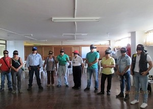
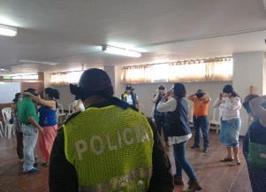
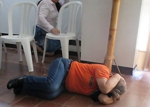
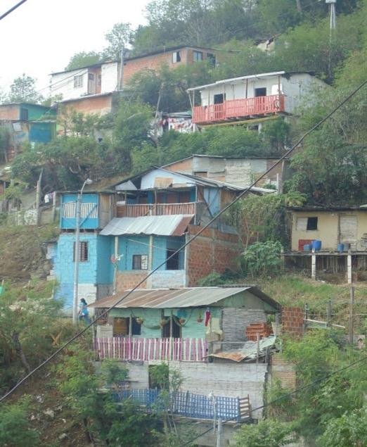
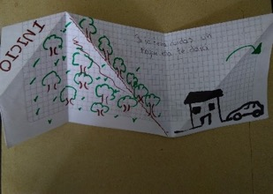
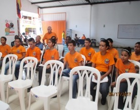
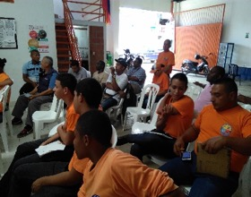

1Departamento de Geografía de la Universidad del Valle, Calle 13 #100-00 Edificio D7 oficina 1012, Cali, Valle, Colombia

2Universidad de San Buenaventura Cali, Colombia

*Autor de contacto: Javier Thomas. Profesor titular del Departamento de Geografía de la Universidad del Valle, Calle 13 #100-00 Edificio D7 oficina 1012, Cali, Valle, Colombia. Correo-e: 

## Resumen {.unnumbered}

El presente trabajo presenta los resultados de una investigación titulada *Armero 30 años: Del desastre a la Gestión Territorial del Riesgo en el Valle del Cauca. Una evaluación crítica de las estrategias comunicativas*, desarrollada por el grupo de investigación Armero 85 del Departamento de Geografía de la Universidad del Valle. Investigación en la cual se implementaron talleres comunitarios en los que se construyeron colectivamente dos estrategias comunicativas importantes: crónicas y fanzines. Igualmente incorpora resultados de talleres comunitarios realizados en la Reserva Natural de Laguna de Sonso, hoy Distrito Regional de Manejo Integrado Laguna de Sonso. Estas experiencias muestran la necesidad de repensar las estrategias comunicativas utilizadas con el propósito de resignificarlas social y culturalmente para potenciar otros espacios y canales de comunicación que generen condiciones más participativas y con mayor significado social, para crear nuevos códigos que no sólo faciliten la comunicación entre los individuos, sino que permitan su réplica en otros espacios y situaciones de su vida cotidiana. Es decir, una comunicación en y para su contexto, desde y para su vida, de manera que se convierta en conocimiento que ayude a construir escenarios más seguros.

**Palabras clave**

Comunicación del riesgo, teoría de la comunicación, gestión del riesgo, estrategias comunicativas, experiencias locales, talleres comunitarios

**Risk Communication: Reflections and Local Experiences in the Department of Valle del Cauca**

## Abstract {.unnumbered}

This work presents the results of an investigation entitled *Armero 30 years: From disaster to Territorial Risk Management in Valle del Cauca*. *A critical evaluation of the communication strategies*, by the research group Armero 85 of the Geography Department of the Universidad del Valle. This research was implemented community workshops in which were collectively built two important communication strategies: chronicles and fanzines. It also incorporates results of community workshops made in the Natural Reserve of Laguna de Sonso, now Laguna de Sonso Regional Integrated Management District. This experiences show the need to rethink the communication strategies used, with the purpose of resignify then socially and culturally, to enhance other spaces and communication channels that generate more participate conditions and with more social meaning, to create new codes that no only facilitate the communication between individuals, but allow their replication in others spaces and situations in their everyday life. That is to say, a communication in and for their context, from and for their life, so that it becomes knowledge that helps to build more secure stage.

**Keywords**

Risk communication, communication theory, risk management, communication strategies, local experiences, community workshops

## INTRODUCCIÓN {.unnumbered}

Este capítulo se sustenta en procesos investigativos de carácter participativo sobre la gestión del riesgo y la comunicación del riesgo, del grupo de investigación Armero 85. La investigación desarrollada evaluó el papel de las estrategias comunicativas desplegadas por el Departamento del Valle del Cauca en la reducción de las condiciones de vulnerabilidad de las comunidades expuestas ante eventos potencialmente destructivos, tomando como referencia para la evaluación seis municipios del Valle del Cauca: Jamundí, Yumbo, Buga, Buenaventura, Sevilla y Ansermanuevo, que al localizarse en los diversos puntos cardinales del departamento y tener distintas categorías administrativas son representativos de sus condiciones.	

Los talleres comunitarios buscaron acercar la gestión territorial del riesgo a un instrumento para el reconocimiento de restricciones y potencialidades territoriales, de modo que posibilitara una intervención social y comunitaria en la reducción de vulnerabilidades locales. En el transcurso de casi un año se realizaron cuatro talleres con presencia de personas entre 25 y casi 40 años, desde niños hasta la tercera edad representativos de los diversos actores territoriales presentes en la laguna (pescadores, areneros, agricultores, grupos ecológicos de base, guías turísticos, madres y padres cabeza de hogar, representantes de ONGs ambientales, líderes comunales, niños, etc.).

El presente trabajo tiene dos grandes secciones. La primera, se refiere a los aspectos teóricos sobre comunicación del riesgo que atravesaron transversalmente los ejercicios referenciados. La segunda, presenta los resultados más significativos de las experiencias desarrolladas.

## LA COMUNICACIÓN DEL RIESGO: ALGUNAS REFLEXIONES {.unnumbered}

Hablar de comunicación del riesgo nos obliga inicialmente a referenciar los trabajos centrales de la teoría de la comunicación planteados por Carey [1], Anderson [2], Holmes [3] y Lunenburg [4], y luego aquellos que implican directamente la comunicación del riesgo (Luhmann [5], Beck [6], Gonzalo y Farré [7]; Thomas, Rubio y Muñoz [8]), como parte integral de la gestión del riesgo, pero vinculada necesariamente con la teoría de la comunicación. Pero ¿qué implican una y otra? 

Podría afirmarse que la teoría de la comunicación estudia la capacidad que tienen algunos seres vivos de relacionarse con otros intercambiando información, para controlar tanto su entorno, como los factores que los afectan, aislándolos de posibles factores perturbadores, como el ruido, el cual regularmente siempre está presente en el proceso y puede afectar en forma parcial o total el contenido del mensaje originalmente enviado [9]. No obstante, son en realidad múltiples intereses los que definen la investigación en comunicación y que consecuentemente inciden en su corpus teórico; Katz et al. (citado en [10]) identifica cinco universidades que establecen importantes campos de investigación: “Chicago, donde sitúan la primera investigación en comunicación; Columbia, donde Lazarsfeld y otros desarrollaron estudios sobre los efectos persuasivos y de gratificación de los medios en el público; Frankfurt, donde surge la investigación crítica; Toronto, donde Innis y McLuhan desarrollaron la corriente del determinismo tecnológico; y Birmingham, donde aparecen los estudios culturales. También mencionan París, con su gran tradición de estudios semióticos del cine y la cultura, y la Universidad de Yale, donde Hovland dirigió un importante grupo de investigación sobre la persuasión de masas”. Más importante en este momento que las Escuelas y sus representantes, resultan los ámbitos de trabajo que dibujan, de forma significativa, algunos de los aspectos prioritarios de la teoría de la comunicación: lingüística y semiótica, sociología de la comunicación de masas, estudios críticos, determinismo tecnológico y cibernética y estudios socioculturales, entre los mencionados.

::: {.caja-box}
**Caja 1.**  La comunicación humana  Gifreu [11] establece que la comunicación humana es un proceso histórico, simbólico e interactivo, por el cual la realidad social se produce, comparte, conserva, controla y transforma simultáneamente. Esta interpretación pone de relieve las condiciones, dinámica, contextual, procesal, social, histórica, cultural y de poder del acto comunicativo, más allá de la semiótica y la lingüística.

:::

Carey [1] convencido de la posibilidad de converger los estudios culturales genéricos con la investigación en comunicación, rompe la barrera existente entre sociedad y comunicación y orienta el enfoque de los primeros al estudio más concreto de los medios; ya Burke [12] había seguido el papel que juegan los estímulos durante el proceso de comunicación, estudiando la incidencia de los símbolos culturales en la forma como las personas se identifican con un grupo social. Para estos pensadores, la comunicación de masas tiene un importante carácter reflexivo, ya que no se trata sólo de describir o informar, sino que ella en sí misma crea y transforma las realidades y los sujetos mismos. La comunicación es entonces algo más que una observación de acontecimientos es una transmisión de un mensaje o un acercamiento de la audiencia a los medios masivos que tiene como resultante dialéctica los vectores de poder, los intereses y los actores sociales que delinean momentos de la realidad.

Más adelante con el impacto generado en la sociedad por el desarrollo de los medios de comunicación masiva, Bateson y Ruesch [13] introdujeron el concepto de metacomunicación, o comunicación sobre la comunicación, como un estudio de la comunicación más allá de las ideas superficiales y la transmisión de un mensaje. Como se observa, existen diversas y complejas perspectivas sobre la comunicación, pero nos quedaremos con la definición de comunicación humana de Gifreu [11], que en extenso define el alcance de la teoría de la comunicación que queremos relievar acá: “la comunicación humana es un proceso histórico, simbólico e interactivo por el cual la realidad social es producida, compartida, conservada, controlada y transformada”*.*

Esta definición hace evidente que, primero, el acto comunicativo es dinámico, contextual y procesal; segundo, es un hecho concreto en un espacio-tiempo particular; tercero, es producto de relaciones sociales entre sujetos, pero también produce relaciones sociales; agencia una sociedad que define símbolos, códigos que configuran imágenes, unas abstractas otras concretas; cuarto, que es un instrumento de poder que incide en su equilibrio y en las formas particulares que este adquiere en la sociedad. 

Estos elementos mencionados son importantes, porque definen aspectos claves en la teoría de la comunicación que están presentes también, en mayor o menor medida, en la teoría de la comunicación del riesgo, a ver. 

Iniciaremos preguntándonos ¿existe una teoría de la comunicación del riesgo o simplemente se trata de informar a la comunidad sobre los riesgos a los que está expuesta? ¿Materializa esta comunicación del riesgo relaciones de poder, asimetría de la información, percepciones sociales y/o institucionales y valoraciones y cálculos políticos o empresariales? 

Basados en los argumentos expuestos anteriormente, es claro que comunicar no es lo mismo que informar. Informar trata de un proceso unidireccional, unilateral, que asume al receptor de un mensaje como sujeto pasivo, cuasi-objeto, que bajo un mecanismo causa-efecto, dispara una reacción en función del mensaje recibido; mientras que el comunicar implica una construcción conjunta de mensajes, en doble vía, en donde las interacciones permanentes entre emisor-receptor, generan constantes intercambios de sus roles y una reconfiguración continua de los mensajes. Es por tanto un proceso recíproco e iterativo de significación y resignificación de códigos y de construcción, deconstrucción y reconstrucción de significados, en aras de edificar socialmente lenguajes. Podríamos afirmar en consecuencia, que “la comunicación del riesgo se trata de un complejo proceso de reconocimiento, visibilización y configuración, de conceptos, intenciones, percepciones, reglas e incluso situaciones, en las que se construye pensamiento y acción sobre el riesgo y sus componentes y el significado e impacto social y político que adquiere su descodificación” [8].

En esta comunicación del riesgo juegan papel preponderante las particularidades del mundo contemporáneo que, como expresión de la sistemática, generalizada y vigorosa aplicación de la tecnología en todos y cada uno de los campos de la vida cotidiana, definen, como su impronta indeleble, una condición global del riesgo [6], [5], que debe ser visibilizada, reconocida y significada, para establecer, en lo posible, agentes, canales, implicaciones, responsables y alternativas posibles. No desde una perspectiva perturbadora o paranoica, sino desde aquella que permita acercarse a una dimensión social, política y ética del riesgo, que propicie una relación más equitativa, justa y diáfana con los actores hegemónicos y con las relaciones de poder que ellos despliegan y que subyacen a la construcción de vulnerabilidades y riesgos en sus diversas escalas y que, la mayoría de las veces, la comunicación masiva enmascara, desvirtúa o niega, al tiempo que los amplifica.

::: {.caja-box}
**Caja 2.**  La comunicación del riesgo  La comunicación es un proceso recíproco e iterativo de significación y resignificación de códigos y de construcción, deconstrucción y reconstrucción de significados en aras de edificar socialmente lenguajes. Por su parte, la comunicación del riesgo es un complejo proceso de identificación, significación, configuración, decodificación y asimilación social de conceptos, voluntades, valoraciones, reglas y condiciones, en las cuáles se construye pensamiento y acción sobre el riesgo y sus componentes y el significado e impacto social y político de éste.

:::

“La ignorancia de la globalización del riesgo no hace más que incrementarlo” [7], ya que se reduce la percepción de éste, se diluyen las responsabilidades políticas e institucionales frente a él, se disipa la consciencia colectiva del riesgo, se desconocen o menguan las capacidades inherentes de la población, para responder efectivamente ante situaciones de riesgo y de emergencias, y se acallan o moderan las demandas sociales por justicia social, espacial y ambiental, como requisito *sine-quanon* para la reducción de las vulnerabilidades. No obstante, es importante tener presente, simultáneamente, las expresiones de aquello que Beck [14] llamó la Modernidad Reflexiva, o Giddens & Pierson [15] la incertidumbre fabricada, refiriéndose, en uno y otro caso, a las “consecuencias no deseadas de la modernidad” [14], y que materializan la permanente contradicción-dualidad entre conocimiento y riesgo. Es decir, a medida que crece el conocimiento, el riesgo lo hace de la mano de él, como respuesta a las nuevas condiciones, situaciones e información que se crean, fabricándose así sistémicos y complejos impactos, no imaginados o reconocidos por registros históricos, ya que no existen los datos previos que permitan modelar el comportamiento de éstos. Beck [14] asume la incertidumbre fabricada, como una “mezcla de riesgo, más conocimiento, más desconocimiento y reflexividad, y por tanto un nuevo tipo de riesgo”.

Es por esto que “la comunicación del riesgo más que herramienta al servicio de la información del Establecimiento debe permitir construir espacios, mecanismos e instrumentos permanentes de interacción y retroalimentación, tanto, entre los distintos niveles de la realidad que establece la sociedad del riesgo, como de la gestión social de éste y por ello, no puede considerarse ni independiente, ni externa, ni únicamente producto final, de salida, del proceso instrumental de la gestión del riesgo. Ésta debe contemplar las esferas políticas, técnica y social, como fuentes poderosas en los procesos de definición, significación y gestión del riesgo” [8].

Si “el riesgo es un juego de poder que en la era global cuenta con los gobiernos occidentales y el poder económico entre sus actores protagonistas” [7], entonces la comunicación del riesgo debe: 

“fortalecer la relación entre episteme, percepción, consciencia, ética (deontología) y gestión del riesgo, para producir procesos comunicativos que propicien la construcción de supuestos y acciones más acordes con condiciones de mayor seguridad de los individuos y las sociedades; en esa medida, es claro que la comunicación es un instrumento de poder al servicio de quien la maneja, si sus expresiones, relaciones e intenciones se hacen más transparentes, se resquebrajará la hegemonía y el poder de quien la controla y emergerán mayores demandas sociales de equidad a la información, de acceso a los recursos satisfactores, como condición de fortaleza ante amenazas y riesgos, y de responsabilidad política y empresarial ante los agentes y factores generadores de vulnerabilidad”[8].

La relación comunicación-conocimiento-consciencia-ética-gestión del riesgo, que es afectada por la percepción del riesgo y los sesgos asociados que ello implica, Sandman [16], correlaciona el nivel de molestia del público y el conocimiento-percepción de la amenaza de los expertos. Si aceptamos el modelo propuesto por él, se puede decir que la comunicación del riesgo pretende, en estos casos, equilibrar estas variables para generar respuestas propicias en el público que faciliten la gestión del riesgo.

Es claro aquí que sentimientos o sensaciones como temor, daño potencial, daño perceptible, controlabilidad de situaciones, incluidos en el concepto genérico de riesgo, se internalizan a través de la praxis cultural y social e inciden en la valoración perceptual de los riesgos, calificándolos como insignificantes, serios o inaceptables. Renn [17] y Rohrmann [18], mostraron datos empíricos sobre ello, en estudios realizados en Estados Unidos, Canadá, Alemania, Francia, Austria, Japón y Australia. De hecho, lo que la gente cree que es cierto acerca de un riesgo, pasa por la evaluación, consciente o intuitiva, de ese conocimiento y por el tamizaje de los referentes perceptuales y afectivos previos. Rohrmann [18] y Sjöberg [19] demostraron que los sentimientos emocionales acerca de los generadores de riesgo influyen en las evaluaciones de riesgo e inciden en la importancia asignada al daño potencial a sufrir. Así mismo, trabajos sobre la percepción de los riesgos tecnológicos [Kals [20]], también muestran que los factores emocionales y cognitivos se relacionan mutuamente, no obstante, persiste la duda sobre su relación causal; si las creencias cognitivas activan las respuestas emocionales respectivas, o, si los iniciales impulsos emocionales "construyen" argumentos que apoyen la postura emocional del individuo. 

Lo cierto es que tanto los elementos cognitivos como los afectivos influyen en la percepción del riesgo y requieren ser reconocidos y abordados al comunicarse con el público en general o con grupos específicos. La comunicación del riesgo no puede ser efectiva sin una comprensión integral de cómo perciben, sienten, ponderan y evalúan los riesgos los individuos, y cuáles son los factores que determinan la variación de la percepción del riesgo, sujeto a sujeto, comunidad por comunidad.

Además, el marco social y político en el que individuo y grupos están insertos es esencial también, ya que inciden en el nivel de confianza que las instituciones generan, los valores y compromisos sociales que propician y asumen, la complejidad de sus estructuras, las limitaciones organizativas propias y el estatus socioeconómico que le posibilitan o crean a cada individuo. Una variable importante en la evaluación del riesgo es la percepción de equidad y justicia en la asignación de beneficios y riesgos a diferentes individuos y grupos sociales [20,21].

Las variables sociopolíticas, sin duda alguna juegan un papel importante en la configuración de las respuestas individuales y sociales al riesgo "público", y en la construcción de los debates sobre el riesgo. Tanto Luhmann [22], Giddens [23], como Beck [6], mostraron que en un entorno social en el que la experiencia personal se construye en gran medida a partir de información de segunda mano, la confianza es un requisito previo esencial para la comunicación y la coordinación social; confianza que puede ser fácilmente destruida por desastres no previsibles o abusada, fácilmente, relacionando los eventos al azar como explicaciones o excusas para los errores, negligencias o excesos cometidos en la gestión del riesgo. Por esto la confianza está constantemente en juego en las respuestas institucionales al riesgo. Cabe tener presente que “la ambigüedad en la asignación de causalidad o culpa a diversos actores (incluyendo la naturaleza o Dios), hace que el riesgo sea un problema ideal para las maniobras políticas” [24]. 

Es claro que las ciencias sociales y de la comunicación todavía tienen mucho que indagar y validar sobre los temas de la percepción del riesgo y la comunicación del riesgo. Sin embargo, es clarísimo que, si los enfoques provenientes de éstas se consideraran juntos, en lugar de abordarse desde perspectivas aisladas, deberían proporcionar una amplia gama de conocimientos teóricos y de resultados empíricos que podrían ayudar a los investigadores del riesgo a comprender mejor las percepciones, valoraciones y respuestas individuales y colectivas a las situaciones de riesgo y, con base en ellas, diseñar las mejores alternativas para reducir sus vulnerabilidades. A los tomadores de decisiones ayudaría a implementar medidas con mayor probabilidad de aceptación y de más alta eficacia social y política; y a los comunicadores del riesgo, entender en mejor medida, demandas y preocupaciones del público, así como las claves para construir los mensajes más acertados. 

En esa medida, la comunicación del riesgo debe asumirse como un pilar en la construcción de una gobernanza del riesgo, en la que los principios de transparencia y rendición de cuentas trascienda la política pública y se incorporen en exigencias a empresas multinacionales y agentes generadores de riesgo, y en la que los canales de comunicación sean su medio de difusión y control social. Por tanto, la comunicación del riesgo para la gobernanza debe permitir, a través de su actuación, reducir los niveles de incertidumbre, propiciar un aumento de la participación en la toma de decisiones, potenciar procesos eficientes y racionales de autorregulación y ser agente de procesos democráticos. Como se ve, no se trata simplemente de informar sobre alarmas tempranas, procesos de reubicación o restricciones de ocupación y uso del suelo. 

Sin embargo, el objetivo de la comunicación del riesgo no debe ser inducir a la gente a aceptar lo que el comunicador cree que es mejor para ellos. El programa de comunicación ideal debe propiciar la formación de sujetos activos capaces de valorar la información disponible, para formar juicios bien equilibrados, de acuerdo con la evidencia de los hechos, el peso de los diversos argumentos y sus propias necesidades, intereses y expectativas. El objetivo final de la comunicación de riesgos es reconciliar la experiencia, los intereses y las preferencias públicas, con las realidades políticas e institucionales de la sociedad, para así coadyuvar en la construcción de comunidades más informadas y conscientes de las situaciones territoriales más equitativas y seguras.

## LA FUERZA DE LAS EXPERIENCIAS {.unnumbered}

La comunicación del riesgo se abre como un campo importante de reflexión académica y de trabajo gubernamental, en el sentido de lograr contener creativamente, la disonancia o disyunción de tres registros de saberes geográficos que históricamente se suceden separados: el saber geográfico universitario, el saber geográfico de los ciudadanos y el saber geográfico de la escuela [25]. Esta separación también se expresa en términos comunicativos, en particular, en la comunicación del riesgo. Es decir, la experticia ha construido un lenguaje y medios de comunicación que le son propios de la institucionalidad (académica o gubernamental), y las comunidades, ciudadanos o pobladores han configurado sus repertorios y formas de comunicar y comunicarse sobre estos temas. El reto es intentar poner en dialogo ambos mundos comunicativos, en la perspectiva de una mejor gestión del riesgo en los territorios.

Teniendo como marco de acción las reflexiones anteriores, el Grupo de Investigación Armero 85 emprendió un ejercicio investigativo con enfoque participativo, con la intención de explorar las tensiones y posibilidades que supone la comunicación de riesgo en entes territoriales específicos (como se mencionó al inicio del capítulo). Las siguientes ideas quieren poner énfasis en aquellos aprendizajes que a consideración de los autores, dan cuenta de la experiencia y al tiempo, pueden servir como elementos a tener en cuenta para ser profundizados en una propuesta de comunicación del riesgo.

### El taller comunitario {.unnumbered}

Una de las claves identificadas en el proceso de investigación, además de las diferencias en los códigos comunicativos de los actores que hacen parte potencial de la gestión del riesgo, fue el hecho de no encontrar claramente una concepción desde la institucionalidad, de los conocimientos y/o saberes que las comunidades, pobladores, e incluso ONG´s tenían acerca de los riesgos en sus zonas. Ello porque los espacios de encuentro y los diálogos se establecen, en la mayoría de las ocasiones, en un régimen discursivo que privilegia el saber experto y sus dispositivos o tecnologías de soporte. Se supone que mucha de la información experta es producto del reconocimiento de las realidades territoriales, pero lo interesante fue la insistencia desde las comunidades de plantear que no siempre esa información es verídica, en tanto las realidades territoriales son cambiantes y están sujetos a las dinámicas del clima y a las acciones ciudadanas y gubernamentales.

::: {.caja-box}
**Caja 3.**  El trabajo de campo El trabajo de campo se convierte en una condición esencial para el reconocimiento y actualización de las expresiones y dinámicas geográficas y la valoración y significación de los saberes que las comunidades construyen en la vida cotidiana y en su experiencia espacial. Una dimensión comunicativa fundamental, es la posibilidad de generar y/o agenciar el trabajo de campo, no como una técnica de verificación o chequeo, sino como un locus dialógico y colectivo sobre las situaciones o dinámicas socioespaciales.

:::

El primer aprendizaje, en tal sentido, tiene que ver con la importancia del trabajo de campo como condición necesaria para la actualización de los cambios geográficos y para el reconocimiento de los saberes que las comunidades construyen en la vida cotidiana y en su experiencia espacial. Una dimensión comunicativa fundamental, es la posibilidad de generar y/o agenciar esta perspectiva de trabajo de campo, no como una técnica de verificación o chequeo, sino como un locus dialógico y colectivo sobre las situaciones o dinámicas espaciales. Pero este dialogo tiene en sí mismo un rasgo esencial, que igual lo es para la geografía, y es caminar, recorrer y habitar el territorio. No pocas veces el mundo institucional tiene una mirada panorámica de los lugares y sus lógicas que promueve la separación, lo cual obliga a una mirada distinta. 

Pero, la comunicación del riesgo exige una estrategia pedagógica que potencie el trabajo en equipo, el desarrollo de la creatividad, la construcción y apropiación de constructos, la recreación y significación de experiencias previas de los sujetos y la valoración de lo cotidiano, como posibilidad de aprendizaje; esto permitiría que la comunicación no se entienda, equívocamente, como información, sino como proceso activo, abierto y en permanente construcción. Precisamente, el Taller posibilita todo ello, éste permite, en el caso particular de la gestión del riesgo, contextualizar y resignificar el conocimiento cotidiano para la identificación de situaciones de amenazas, vulnerabilidades y riesgos, como las potencialidades y capacidades, individuales y colectivas, para la gestión de éste, así como, descubrir y dimensionar los diferentes niveles de responsabilidad y corresponsabilidad que los diversos actores tienen en unas y otras. Todo esto, en un entorno pedagógico co-creativo, colaborativo y lúdico, que propicia un aprendizaje significativo.

::: {.caja-box}
**Caja 4.**  El Taller pedagógico El Taller pedagógico permite, en el caso particular de la gestión del riesgo, contextualizar y resignificar el conocimiento cotidiano para la identificación de situaciones de amenazas, vulnerabilidades y riesgos, como las potencialidades y capacidades, individuales y colectivas, para la gestión de éste, así como, descubrir y dimensionar los diferentes niveles de responsabilidad y corresponsabilidad que los diversos actores tienen en unas y otras: todo esto, en un entorno pedagógico co-creativo, colaborativo y lúdico, que propicia un aprendizaje significativo.

:::

El taller, segundo aprendizaje, permite poner sobre una balanza la creatividad y el método, el pensamiento y la acción, lo individual y lo colectivo, la experiencia y la vitalidad, enriqueciendo la construcción de saberes, que desde distintos focos entran en interacción, generando contextualizaciones de los conocimientos previos o cotidianos y lenguajes renovados. A través de éste se descubren novedades en lo cotidiano, se adquieren nuevos juicios, se elaboran y contrastan raciocinios, se descubren y desarrollan destrezas y se construyen respuestas a los problemas viejos o a los recientemente descubiertos a través de la interacción con otros y el territorio. 

La dinámica del mundo contemporáneo y la emergencia cada vez más rápida, compleja y generalizada de amenazas y riesgos, obliga a que los saberes construidos localmente se constituyan en un producto social, insumo para el conocimiento y comprensión del territorio y para la gestión del riesgo. En ese sentido, se necesita que la teoría y la práctica puedan interrelacionarse en los momentos de construcción participativa de los planes comunitarios de gestión del riesgo. 

Thomas [8] considera que el taller democratiza las relaciones pedagógicas, unifica la teoría y la práctica, propicia la creatividad, desarrolla la autonomía y el liderazgo, recupera la cotidianidad, da significado social al conocimiento, desarrolla la integralidad del sujeto y del conocimiento, potencia el pensamiento heurístico y, en él, se aprende en contexto. Estos principios pedagógicos del taller lo validan significativamente como estrategia pedagógica para la comunicación del riesgo. Estos principios pedagógicos indican la potencialidad del taller en dos dimensiones. De un lado, promover el encuentro de los diversos actores y/o sujetos comunitarios e institucionales implicados en la gestión del riesgo y del territorio. Este encuentro es al mismo tiempo la posibilidad del dialogo y escucha de diversas miradas sobre los hechos y situaciones que determinan y se desarrollan en los territorios. 	

Dimensión comunicativa que ayuda a complejizar y diagnosticar los sentidos que los actores elaboran de las problemáticas del riesgo. Pero también, como segunda dimensión, el taller permite de manera colectiva discutir y diseñar estrategias y/o acciones contextualizadas de cara a las necesidades de cada zona o lugar. En el caso que nos ocupa, permite diseñar estrategias comunicativas que, sin desconocer el saber experto, logre conectarse con los lenguajes y repertorios comunicativos de las comunidades.

**Figura 1.**  Taller Sevilla, Valle del Cauca. En este taller los participantes con sus ojos vendados (**A** y **B**), que simulan la noche, experimentan a través de sonidos, cómo reaccionarían ante un sismo, para salvaguardar sus vidas, como permanecer inmóvil en el piso, por ejemplo (**C**).

En síntesis, los dos aprendizajes mencionados dentro de una estrategia de comunicación del riesgo permiten reconocer los territorios de primera mano y con los pobladores, por lo que el trabajo de campo es un dispositivo de producción de conocimiento de primer orden que acude a los recorridos y a las narrativas de vida espacial [26] que se expresan en diálogos cotidianos peripatéticos, notas de campo y registros fotográficos que los sujetos producen in situ. Información que es vital para posteriores análisis y fuente esencial para la producción de las estrategias comunicativas. Así mismo, el Taller como acontecimiento colectivo favorece el diálogo y el debate sobre las problemáticas de la gestión del riesgo y las potencialidades para la construcción colectiva de las estrategias. Este dialogo de saberes resulta fructífero para comprender de mejor manera problemas y soluciones, como también mutuos reconocimientos a la hora de diseñar y emprender la acción territorial.

### La crónica. Otra manera de comunicar {.unnumbered}

Expandir la perspectiva sobre la comunicación del riesgo supuso, en el transcurso de la experiencia investigativa, pensar y discutir cómo enfrentar la separación o disociación entre los lenguajes expertos de la academia y la institucionalidad, con los lenguajes del sentido común y de la vivencia territorial de las comunidades. Producto de la revisión documental de las oficinas de gestión de riesgo de la gobernación y de las alcaldías visitadas, y al ver su lenguaje técnico, a veces críptico, se optó por experimentar con la escritura de crónicas como mediación comunicativa en la gestión del riesgo. En el sentido de que la crónica, como genero discursivo, permite mayores márgenes de flexibilidad en el uso del lenguaje y se puede combinar con imágenes que operan, no como ilustraciones, sino como piezas comunicativas. Estas crónicas son producto del trabajo de campo antes descrito. 

La lógica narrativa de la crónica, además de describir, caracterizar y contextualizar espaciotemporalmente lugares y personajes, permite poner como protagonista las experiencias y situaciones vividas por los sujetos, y permite compaginar la cotidianidad de su realidad con la subjetividad en su interpretación. Crónicas que permiten significar las realidades del otro desde una perspectiva más humana, y desde su condición individual (del sujeto), proyectarlas socialmente (hacia el colectivo), estableciendo un puente entre lo que sucede (hechos y situaciones que se dan en la cotidianidad), lo que se entiende de ello (interpretación y visiones), lo que se desea (expectativas, sueños, proyectos) y lo que se espera (cambios de hábitos y respuestas precondicionadas). Estas relaciones son fundamentales para retroalimentar, y en lo posible, reorientar, los proyectos de vida de los sujetos y las prácticas sociales de ellos. Aquí aparece con significancia, entonces, la condición comunicativa y educadora de la crónica.

::: {.caja-box}
**Caja 5.** La crónica La lógica narrativa de la crónica permite, además de describir, caracterizar y contextualizar espaciotemporalmente lugares y personajes, poner como protagonista las experiencias y situaciones vividas por los sujetos, compaginando la cotidianidad de su realidad con la subjetividad en su interpretación. Estas relaciones son fundamentales para retroalimentar, y en lo posible, reorientar, los proyectos de vida de los sujetos y las prácticas sociales de ellos. Aquí aparece con significancia entonces, la condición comunicativa y educadora de la crónica.

:::

La fuerza de este género discursivo, puesto al servicio de la comunicación del riesgo y en clave descriptiva y valorativa de una situación determinada, amplia los públicos a los cuales se les dirige y tiene la intención de hacer legibles aquellas situaciones que técnicamente pueden resultar complejas de comprender. Es importante advertir que la crónica no pretende reemplazar los informes o documentos técnicos y académicos, de hecho, son una estrategia adicional que puede ayudar. Un fragmento de las crónicas elaboradas puede ayudar a ubicar el propósito de su uso. 

De quemas, tierras y gentes. Fragmento crónica municipio de Yumbo

Mónica Rivera es una maestra de escuela pública en el corregimiento de Dapa, zona rural del municipio de Yumbo. Ella y sus estudiantes recuerdan, como si fuera ayer, aquella semana de marzo de 2016, cuando los incendios consumieron buena parte de los árboles y plantas de la zona rural del municipio. “Las llamaradas se veían cerquita”, dicen algunos de los niños. Esa semana, según los registros de los medios de comunicación, Yumbo se vio fuertemente afectado por acciones de personas inescrupulosas que prendieron fuego al pasto, en plena temporada del fenómeno del niño, provocando daños en la flora y la fauna, y un gran riesgo para los habitantes del sector. Además de los riesgos que por lo general las temporadas intensas de verano traen consigo, estas acciones humanas no dejan de presentarse con consecuencias delicadas para el medio ambiente y los mismos pobladores.

El corregimiento de Dapa, en medio del verano y las quemas, tiene otro problema que hace más preocupante la situación: la escasez de agua y la distancia del área urbana. Según comentan sus habitantes, en general el municipio tiene dificultad con el “precioso liquido”, porque su abastecimiento depende de la ciudad de Cali. “Sin agua para las necesidades básicas, imagínese el problema con estos incendios”; afirma la profesora. Y, efectivamente, es enorme el problema de los incendios en la zona rural yumbeña, que ha puesto al gobierno local y sus instituciones, ante un reto de grandes proporciones a la hora de dar respuesta inmediata y efectiva. El año 2015 quizás haya sido uno de los más complicados al respecto, para el mes de agosto ya se reportaban 500 hectáreas quemadas y las causas eran señaladas en los medios de comunicación, de la siguiente manera: "La gente se confía y realiza quemas controladas que terminan saliéndose de sus manos y terminan generando incendios. Son contados los incendios que no son generados por el hombre, ya sea por imprudencia o por piromanía", concluyó el comandante del Cuerpo de Bomberos de Yumbo, al periódico El País.

**Figura 2. **Panorámica comuna 1, Yumbo. Los barrios de esta comuna tienen como rasgo en común ubicarse en una zona de ladera, con historia de excavaciones mineras y altos índices de deslizamientos.

Pero, así como estos incendios se han convertido en problema de verano, también lo es la difícil situación en la cual se encuentra el rio Yumbo que atraviesa el municipio. En palabras de un vendedor de frutas de la Galería Municipal: “hoy por hoy lastimosamente nuestro rio es casi que una alcantarilla, por donde corren muy pocas aguas ya. Total, de que es difícil ya pensar que (sic) nuestro rio realmente represente algún tipo de riesgos para la municipalidad”. Y su opinión no es una exageración, porque en un recorrido por la zona urbana, que le sirve de cauce, es el reflejo de su decadencia y maltrato. Bolsas de basura, colchones viejos, utensilios de cocina y las paredes de las casas que le dan la espalda, son las señales de quizás no se vea como un riesgo. En el pasado éste fue una fuente hídrica importante, pero llama la atención que en los adultos esa función se asocia a las inundaciones que este causaba, además de los paseos de olla. Fernando Quiroz, actual Secretario de Educación, relaciona estas inundaciones con las fuertes lluvias y la falla geológica que atraviesa al municipio. 

“El municipio históricamente ha tenido que enfrentar algunos riesgos, no conozco a profundidad el tema, pero Yumbo está atravesado por una falla geológica, que ha ocasionado en tiempos de lluvias intensas, movimientos de tierra que ha ocasionado que diferentes grupos poblacionales, familias enteras, hayan tenido que ser reubicadas de un sector a otro, especialmente los habitantes del sector conocido como las Cruces, Buenos Aires parte alta”.

Lo sectores señalados y afectados por estos riesgos tienen la característica de ser habitados por gentes de clase popular, que como en muchas ciudades del país, han hecho de las laderas su sitio de vivienda y se han apropiado y asentado hasta configurar conglomerados humanos. Si bien la existencia de la falla geológica es un rasgo natural del territorio, los pobladores han construido su lugar, su hábitat, quizás sin conocer los riesgos de ello, pero encontrando en esos territorios la posibilidad de vivienda. Roberto, un llegado hace cuarenta años a la zona de laderas de Yumbo y de origen patiano, resume en una frase el sentido del lugar: “hace mucho llegamos y nos tocó hacer la casita aquí, este pedacito de tierra es la vida de muchos de nosotros”. Aferrado a esa historia y a los años de andar y vivir en este lugar, Roberto termina sus palabras mirando las calles entrecruzadas por las casas de bahareque que aún son señal de los tiempos: “Esta loma se nos tragó la vida, por eso de aquí no nos vamos. Imagínese, yo con hijos y nietas”. 

### El fanzine. La comunicación flexible {.unnumbered}

El diagnóstico inicial de las estrategias comunicativas que los entes de gobierno tenían e implementaban, se reducía a las cartillas que desde el gobierno nacional se proponían, con sus características genéricas y lenguajes técnico-instrumentales que terminaban convirtiéndose en política para la gestión de riesgo. Algunas de esas cartillas tenían años de desactualización que se confirmaba en las entrevistas con los funcionarios a cargo de estos temas. La segunda estrategia identificada, en algunos de los municipios, eran noticias audiovisuales que comentaban sobre los riesgos y vulnerabilidades de sectores específicos, invitando a la comunidad a tener cuidado y a ser corresponsables con la gestión del riesgo. Lo preocupante de estas noticias, como casi todas, era su efecto post-facto, es decir, aparecen y comunican cuando ya han sucedió los hechos.

::: {.caja-box}
**Caja 6.** El Fanzine El Fanzine es una herramienta importante para la comunicación social del riesgo, dado que sus cualidades y características lo acercan significativamente al sentido social del conocimiento; es fácil de construir y de reproducir e incorpora un lenguaje lo suficientemente sugestivo como para canalizar la atención de aquellos que lo tengan en su poder. Éste, sin duda, posibilita lenguajes renovados para la gestión municipal del riesgo.

:::

Teniendo en cuenta este hallazgo, y reconociendo que las comunidades dependen de las comunicaciones que las instituciones producen y circulan sobre los riesgos, se pensó en los talleres como una posibilidad para que las comunidades mismas pudiesen diseñar y comunicar con sus propias estrategias. Del conjunto de estrategias posibles, se escogió al fanzine por su versatilidad, flexibilidad y potencial comunicativo, en tanto es la comunidad con sus saberes y recursos, quienes elaboran y ponen a circular los fanzines. Además, estos pueden ser una herramienta importante para la prevención y advertir sobre situaciones problemáticas. Lo más significativo de esta estrategia, es la producción colectiva de conocimiento y el diseño colectivo de la comunicación que se valora pertinente socializar. 

**Figura 3.** Taller Fanzine. Jamundí. Luego de las explicaciones sobre la importancia de la comunicación del riesgo (**A**), los participantes diseñan en grupos (**B**) un fanzine, a partir de problemáticas identificadas en los territorios donde habitan (**C**).

Entendiendo lo anterior y reconociendo la flexibilidad enorme de esta herramienta, se subrayan una serie de rasgos o características que orientan la producción del fanzine, no solo en lo técnico, sino su labor y papel comunicativo. Las características más sobresalientes del fanzine son las siguientes [8]:

Una publicación independiente. El propósito es que los sujetos y/o comunidades tenga la libertad y oportunidad de comunicar sus saberes e interpretaciones sobre determinadas situaciones. No pretende la reproducción de un saber experto o institucional. Promueve la expresión de quienes participan en su elaboración.

Un libro sin límites editoriales. Se parte del principio de creatividad, libertad y pluralidad en la comunicación y en el diseño que este puede tener. Ello supone la inexistencia de criterios editoriales fijos, porque depende de los sujetos singulares, pero al mismo tiempo pretende una circulación masiva y legible de los temas que aborda.

Una comunicación ágil y viajera. Debe ser en su diseño un formato ágil que garantice, además de su legibilidad, su circulación o viaje sin contratiempos. Es vital que los lectores lo lleven consigo y lo puedan compartir con otras personas. 

Expresión lúdica y didáctica. En su dimensión educativa, esta herramienta, que se produce en un taller de actores o sujetos ciudadanos, institucionales y académicos, debe propiciar el diálogo en un ambiente de respeto y goce del trabajo colectivo, que potencie la producción de la información y su comunicación de tal manera que sea entendible y replicable por el ciudadano o usuario de la herramienta.

## CONCLUSIONES {.unnumbered}

Las experiencias mostradas han permitido reconocer que es posible construir espacios y mecanismos de divulgación de saber, técnico y comunitario, que de forma situada, responde en forma más orgánica a códigos, símbolos y significados de las comunidades, y en esa medida, puedan ser más eficientes como proceso de gestión del riesgo. 

Sobre la comunicación del riesgo podemos decir que, definitivamente, es un reto de futuro; aún no se entiende en su justa dimensión, ni de parte de las autoridades municipales, que las confunden con informar, ni de las mismas comunidades, que desconocen su papel y posibilidades en ella. Se debe trascender la percepción mecánica de ésta, de su sentido finalista en el proceso (al final se informa a las comunidades de los riesgos a los que se expone), donde la única responsabilidad es del sector público, quién cumple su función al emitir un mensaje, sin importar el tipo de formato, a las comunidades a las que va dirigida. 

El trabajo desarrollado en este lustro ha permitido desde la academia, innovar, pero se pretende que sean las mismas comunidades las que lo hagan, como forma y posibilidad también, de resignificar y sistematizar la información para la gestión del riesgo, valorar la experiencia propia como conocimiento complementario al técnico y especializado y articular las diversas instituciones, organismos y grupos comunitarios, para que las acciones se desarrollen coherentemente amplificando así su capacidad sinérgica. 

Finalmente, la comunicación del riesgo y las estrategias comunicativas son definitivamente un reto para todos: gestores del riesgo, academia y comunidades, ya que sin espacios y herramientas que potencien una comunicación interactiva, social y contextual, será muy difícil que procesos graduales de reducción de la vulnerabilidad y seguridad territorial se den de forma masiva y generalizada.

| PUNTOS CLAVE La comunicación del riesgo debe propender por construir, no sólo mayores niveles de consciencia social y política sobre los riesgos, sino una mayor simetría en la distribución global del riesgo.  La comunicación del riesgo no se puede separar artificialmente de aspectos como su visibilización, significación y percepción social de la gestión de la confianza institucional y social o nivel de indignación que se construye, y como producto de todas las anteriores, de la regulación que se produzca.  La comunicación del riesgo no puede ser efectiva sin una comprensión integral de cómo perciben, sienten, ponderan y evalúan los riesgos, los individuos, y cuáles son los factores que determinan la variación de la percepción del riesgo, sujeto a sujeto, comunidad por comunidad.  La comunicación del riesgo debe propiciar la formación de sujetos activos capaces de valorar la información disponible para formar juicios bien equilibrados, de acuerdo con la evidencia de los hechos, el peso de los diversos argumentos y sus propias necesidades, intereses y expectativas. El objetivo final de la comunicación de riesgos es reconciliar la experiencia, los intereses y las preferencias públicas, con las realidades políticas e institucionales de la sociedad, para así coadyuvar en la construcción de comunidades más informadas y conscientes y situaciones territoriales más equitativas y seguras. Es imprescindible que las diversas autoridades públicas incorporen en los procesos de comunicación del riesgo estrategias comunicativas participativas, plurales, contextuales y democráticas, donde se reconozcan y validen experiencias, saberes e intereses de las comunidades. |
| --- |

**CONFLICTO DE INTERESES**

Los autores no declaran conflicto de intereses

**IDENTIFICACIÓN DEL AUTOR**

Javier Thomas 	

Julio Rubio		

**BIBLIOGRÁFIA**

Carey, J. (1992). *Communication as Culture. Essays on Media and Society*. Nueva York, Routledge.

Anderson, J. (1996). *Communication Theory: Epistemological Foundations*. Londres, Guilford Press.

Holmes, D. (2005). *Communication Theory. Media Technology and Society*. Londres Sage.

Lunenburg, F. (2010). *Communication: The Process, Barriers, And Improving Effectiveness*. Sam Houston State University, 3-6. 

Luhmann, N. (2006). *Sociología del Riesgo*. Universidad Iberoamericana, México, D.F. 

Beck, U. (2008). *La sociedad del riesgo mundial: En busca de la seguridad perdida*. Paidós Estado y Sociedad.

Gonzalo, J. & Farré, J. (2011). *Teoría de la comunicación del riesgo*. Barcelona, Editorial UOC.

Thomas, J., Rubio, J. & Muñoz, I. (2018). El Fanzine y la comunicación del riesgo: Una propuesta para el Valle del Cauca, Colombia. *REDER*, 2(1), 53-70.

Shannon, C (1948). A Mathematical Theory of Communication. *The Bell System Technical Journal*, 27(4), 623-656. 

Algarra, M. (2009). La comunicación como objeto de estudio de la teoría de la comunicación, en *Revista Anàlisi* 38, 2009, 151-172.

Gifreu, J. (1991). *Estructura general de la comunicación pública*. Barcelona: Pòrtic.

Burke, K. (1969). *A Rhetoric of Motives*. University of California Press.

Bateson, G. & Ruesch, J. (1986). Comunicación. La matriz social de la psiquiatría. *Revista Española de Investigaciones Sociológicas*, 33, 241-243. 

Beck, U. (2002*). La sociedad del riesgo global*. Siglo XXI. Madrid.

Giddens, A. & Pierson, C. (1998). *Making Sense of Modernity. Conversations with Anthony Giddens*. Cambridge: Cambridge University Press. 

Sandman, P. (2003), Four Kinds of Risk Communication. *The Synergist, Journal of the American Industrial Hygiene Association*, 26–27.

Renn, O. (1990). Risk perception and risk management: A review. Pt. 2, Lessons for risk management. *Risk Abstracts*, 8 (1), 1-9. https://doi.org/10.1007/978-1-4757-4891-8_6

Rohrmann B. & Renn O. (2000). Risk Perception Research. En: O. Renn & B. Rohrmann B. (Eds.), *Cross-Cultural Risk Perception. Technology, Risk, and Society* *(An International Series in Risk Analysis) *(pp. 11-53*)*, vol 13. Springer, Boston, MA.  

Sjöberg, L. (1997). Explaining risk perception: An empirical evaluation of cultural theory. *Risk Decision and Policy*, 2, 113-130. 

Kals, Elisabeth; Schumacher, Daniel & Montada, Leo. (1999). Emotional affinity toward nature as motivational basis to protect nature. *Environment & Behavior*, 31(2), 178-202. https://doi.org/10.1177/00139169921972056

Linnerooth-Bayer, Joanne & Fitzgerald, Kevin. (1996). Conflicting views on fair siting processes: Evidence from Austria and the U.S. *Risk: Health, Safety & Environment*, 7(2), 119-134.

Luhmann Niklas. (1990), Technology, environment, and social risk: a systems perspective.  *Industrial Crisis Quarterly*, 4, 223-231. 

Giddens, Anthony. (1990). *The consequences of modernity*. Stanford: Stanford University Press.

Renn O., Rohrmann B. (2000) Cross-Cultural Risk Perception: State and Challenges. En: O. Renn O. & B. Rohrmann (eds), *Cross-Cultural Risk Perception. Technology, Risk, and Society (An International Series in Risk Analysis) *(pp. 211-233), vol 13. Springer, Boston, MA. 

Montoya, John. (2003). Geografía contemporánea y geografía escolar: algunas ideas para una agenda en Colombia. *Cuadernos de Geografía*, XII (1-2), Universidad Nacional de Colombia.

Lindón, Alicia. (2008). De las geografías constructivistas a las narrativas de vida espaciales como metodologías geográficas cualitativas. *Revista ANPEGE*, 4(4). 

**9**

