::: {#resumen}
## Resumen {.unnumbered}

En este estudio se presenta la importancia de realizar estudios históricos de fenómenos naturales amenazantes para lograr un mayor conocimiento de los eventos ocurridos en el territorio, en la toma de decisiones en cuanto a la formulación medidas de gestión del riesgo y como insumo fundamental para la calibración de los modelos de amenaza. Se detallan los objetivos indirectos y directos de la realización de este tipo estudios. Se presenta su aplicabilidad para el municipio de Santiago de Cali en el marco del Plan Municipal de Gestión del Riesgo, para el cual se realizó un estudio de historicidad por sismos, movimientos en masa e inundaciones. Se implementó la metodología intensivista para la búsqueda de registros sobre la ocurrencia de eventos en diferentes fuentes de información, lo que permitió la construcción de una sólida y amplia base de datos y de catálogos en torno a la ocurrencia de estos fenómenos. En cuanto a los resultados, para el caso de los sismos, la búsqueda documental arrojó un total de 97 eventos sísmicos que generaron algún tipo de impacto para el periodo comprendido entre 1566 y 2018. Para los movimientos en masa se encontraron un total de 342 eventos, ocurridos en su mayoría en el área urbana del municipio. Para este mismo periodo, se encontraron 227 eventos de inundación relevantes, siendo la mayoría, de origen pluvial. 

**Palabras clave** 

Estudios históricos, gestión del riesgo, historicidad, inundaciones movimientos en masa, sismos

**The historical perspective in disaster risk management: Applications in Santiago de Cali- Colombia**

:::

::: {#abstract}
## Abstract {.unnumbered}

This document presents the importance of carrying out historical studies of natural phenomena hazardness to achieve a greater knowledge of the events that occurred in the territory, in decision-making regarding the formulation of risk management measures and as a fundamental input for the calibration of hazards models. The indirect and direct aims of conducting such studies are detailed. Its applicability for the municipality of Santiago de Cali is presented in the framework of the Municipal Risk Management Plan, for which a survey of historicity was carried out by earthquakes, mass movements and floods. The intensivist method for the search of records on the occurrence of events in different sources of information was implemented, which allowed the construction of a robust and broad database and catalogs around the occurrence of these phenomena. Regarding the results, in the case of earthquakes, the documentary search produced a total of 97 seismic events that generated some type of impact for the period between 1566 and 2018. For mass movements, a total of 342 events were found, mostly in the urban area of ​​the municipality. For this same period, 227 relevant flooding events were found, the majority being of pluvial origin. 

**Keywords** 

Earthquakes, floods, historical studies, historicity, mass movements, risk management.

:::

## 9.1 INTRODUCCIÓN

El presente trabajo sugiere que los estudios históricos –es decir la historicidad de los fenómenos naturales y de los desastres asociados– son de suma importancia en la gestión del riesgo y cobran preponderancia al tomarse como el primer paso para realizar estudios de predicción o valoración de la amenaza o tomar decisiones sobre medidas de prevención y mitigación en una región determinada. Los estudios historicos permitien el acercamiento a los procesos de conocimiento y reducción del riesgo de desastres como son definidos en la Ley 1523 de 2012 que adopta la política nacional de gestión del riesgo de desastres en el territorio colombiano. Por tanto, se plantea que dichos estudios se consideran como la llave que abre la puerta para la percepción del riesgo y la caracterización de los escenarios de riesgos ya que a través de ellos, en primera instancia, se pueden reconocer las zonas propensas o susceptibles a la ocurrencia de eventos amenazantes, la espacialidad, temporalidad y grado de afectación de los eventos ocurridos en el pasado.  

En este estudio se muestran algunos de los resultados obtenidos en el marco de la caracterización de escenarios de riesgo para el Plan Municipal de Gestión del Riesgo de Santiago de Cali desarrollado en el año 2018 por profesionales adscritos al Observatorio Sismológico y Geofísico del Suroccidente Colombiano (OSSO) y el grupo de investigación Georiesgos de la Universidad del Valle, con recursos de la Alcaldía. Se presenta la información sobre la búsqueda documental para la obtención de noticias relacionadas con los diferentes eventos naturales amenazantes, su tipificación como evento específico, la frecuencia de ocurrencia y los respectivos inventarios o catálogos.  

Para el desarrollo de la historicidad del municipio de Santiago de Cali se consideran los fenómenos de sismos, movimientos en masa e inundaciones con el propósito de aportar información fundamental para la evaluación de la amenaza y caracterización del riesgo ante cada tipo de evento, y para la posterior implementación de estos conocimientos en la planificación del territorio. Estos fenómenos se definieron teniendo en cuenta que históricamente son aquellos que han generado mayor recurrencia y severidad en la ciudad. 

## 9.2 LOS ESTUDIOS HISTÓRICOS EN LA GESTION DEL RIESGO

Los impactos que deja la ocurrencia de fenómenos naturales amenazantes como terremotos, erupciones volcánicas, deslizamientos e inundaciones, etc., han ocupado un papel preponderante en la historia de la humanidad, por cuanto los daños y efectos causados, en algunos casos, han destruido completa o parcialmente pueblos y civilizaciones y, en otros casos, han truncado el desarrollo de muchos países del mundo. Por tal razón, el riesgo y los desastres generados por estos fenómenos son materia de estudio de profesionales de diversas disciplinas, incluso del público en general, quienes, a partir de diferentes métodos y enfoques teóricos, analizan no solo los procesos físicos asociados con su ocurrencia sino también los aspectos relacionados con la distribución espacial, la frecuencia o regularidad temporal, la valoración socio económica de los daños y efectos, el diseño y construcción de obras resistentes a sus fuerzas, la planificación de medidas de mitigación y prevención, entre otros.  

Sin embargo, a pesar que la ocurrencia de estos fenómenos tiene una larga trazabilidad temporal en la historia de la Tierra y la humanidad, el estudio histórico de los desastres, hasta hace muy poco tiempo, era un campo no atendido por los investigadores, esto debido a que la ausencia de marcos teóricos y metodológicos específicos para llevar a cabo estudios históricos sobre desastres desde una perspectiva social, fue quizás una de las razones que inhibió durante mucho tiempo su desarrollo [1].

Es así como podemos afirmar que la ocurrencia de desastres causados por fenómenos naturales amenazantes ha sido un problema frecuente con el que toda la humanidad ha tenido que lidiar. El estudio histórico sistemático, como elemento relevante para la gestión del riesgo y la planificación territorial, puede considerarse como un campo poco explorado y desarrollado, puesto que generalmente no se ha tenido claridad sobre el significado e importancia de la historicidad de estos fenómenos y sus desastres. Entendiendo la historicidad como el conjunto complejo de condiciones y circunstancias que a lo largo del tiempo constituyen el entramado de relaciones en las cuales se inserta y cobra sentido algo: puede ser un proceso, un concepto o la propia vida [2]. 

El principal objetivo de un estudio histórico o de historicidad sobre fenómenos naturales o de los desastres es aumentar el grado de conocimiento de su ocurrencia en una región, aspecto que se materializa con la identificación y tipificación del mayor número de eventos ocurridos y la determinación precisa de sus parámetros físicos y efectos socioeconómicos, logrando con ello tener mejores elementos para la toma de decisiones en cuanto a las medidas de mitigación o prevención, e insumos fundamentales para la calibración de los modelos de amenaza. Sin embargo, acorde con Salcedo-Hurtado [3] se puede decir que la importancia real de los estudios históricos sobre los fenómenos naturales amenazantes o de desastres depende de la aplicación para la cual se desarrolla el estudio, conforme a objetivos prácticos, los cuales pueden ser directos o indirectos (Fig. 1).  

**Figura 1.** Objetivos de los estudios históricos para la gestión del riesgo. Fuente**: **elaboración propia.

Los objetivos directos se relacionan con el conocimiento necesario que debe tenerse sobre los diferentes eventos ocurridos en un sitio y periodo específicos para determinar todas las circunstancias de tiempo, modo y lugar, como para establecer sus posibles causas y efectos que haya dejado. En este caso, los objetivos directos se pueden agrupar de la siguiente manera:

Geo-Históricos: se refieren a la necesidad de precisar el lugar y fecha del evento, detallando los nombres de los sitios y elementos geográficos de ocurrencia o de afectación. Contribuyen a la determinación de los parámetros del evento, intensidades y aportan información que alimenta los catálogos o inventarios de eventos en una región determinada.

Geomorfológicos: sirven para asociar o correlacionar la ocurrencia de los diferentes eventos con unidades geomorfológicas o geológicas, tal como la ocurrencia de terremotos con el tipo de estructura tectónica, fallas activas y terreno geológico que pudo estar involucrado en su origen. También pueden ser útiles para establecer la relación que guarda la ocurrencia de un determinado evento con otros fenómenos geológicos, por ejemplo, la correlación entre, terremotos con movimientos en masa, erupciones volcánicas, o avenidas torrenciales, etc. 

Estadísticos: a partir de la asignación de intensidades y otros parámetros físicos que describan los diversos fenómenos naturales amenazantes, los estudios de historicidad permiten identificar zonas susceptibles, en las cuales es posible definir variables estadísticas (frecuencia de ocurrencia, período de recurrencia o de retorno para eventos extremos o máximos) y la elaboración de inventarios o catálogos.

Socio-Económicos: un aspecto interesante de los estudios históricos de fenómenos naturales consiste en la evaluación socioeconómica de los efectos y daños causados en una región determinada. Es una forma de valorar el impacto o severidad de los efectos no deseados de los fenómenos naturales o desastres sobre los humanos y el medio ambiente. Además, aportan información valiosa para los tomadores de decisión en torno a la dimensión presupuestal asociada a las pérdidas y daños causados por estos eventos.  

Los objetivos indirectos  se orientan a la aplicación social de los estudios históricos de fenómenos naturales y los desastres, es decir, muestran la utilidad práctica y el servicio que prestan estos estudios en la planificación territorial y urbana, planes de emergencia y en los estudios de zonificación de amenazas a diferentes escalas. Así, los objetivos indirectos de los estudios históricos de fenómenos naturales y desastres, muestran ser útiles en áreas como:

Percepción del riesgo: permitiendo que los individuos y la comunidad en general interpreten y comprendan donde pueden ocurrir eventos o fenómenos naturales amenazantes, que pueden causarles daños.

Planificación territorial y urbanismo: permitiendo establecer las restricciones de actividades socio-económicas en torno a los eventos amenazantes recurrentes en el territorio o en una zona determinada.

Definición de planes de emergencia: la definición de zonas susceptibles a presentar eventos amenazantes, identificados a partir de la frecuencia de ocurrencia, permite establecer medidas para los planes de emergencia.

Zonificación de amenazas: Con la elaboración de catálogos homogéneos sobre determinado tipo de fenómeno natural, se establecen periodos de recurrencia de fenómenos y posibles funciones de probabilidad que expliquen el régimen de su ocurrencia, información necesaria para los estudios de zonificación de amenazas.  

Es necesario plantear que en los estudios históricos de los fenómenos naturales o de los desastres producidos deben proponerse objetivos sociales que apunten no sólo al hecho de saber qué tipos de eventos ocurren en una zona determinada, sino que a través de ellos se logre avanzar en la determinación de los diversos escenarios de riesgos que conduzcan a la formulación de los planes de gestión del riesgo y su correspondiente apoyo en la planeación y ordenación del territorio en diversas escalas para los tipos de suelo urbano, de expansión urbana y rural.  

Para que los estudios históricos sean de utilidad en gestión del riesgo deben tener un sentido práctico social, de tal manera que se analicen a la luz del contexto histórico y geográfico de una región determinada. Es decir, que si se estudia un evento catastrófico especifico ocurrido en un periodo lejano o cercano, debe establecerse como pudo modificar las relaciones y procesos económicos y políticos que caracterizaron o caracterizan a una población, lo cual servirá para la planificación de las medidas de desarrollo y la toma de decisiones en los planes de ordenamiento del territorio. Sólo así se puede garantizar un interés común, al igual que la continuidad y vigencia de este tipo de estudios.

## 9.3 APLICACIONES EN LA CIUDAD SANTIAGO DE CALI

Como aplicación, en el presente trabajo se enseña el estudio de historicidad por sismos, movimientos en masa e inundaciones realizado para el municipio de Santiago de Cali en el marco de la formulación del Plan Municipal de Gestión del Riesgo, el cual fue desarrollado por el Observatorio Sismológico y Geofísico del Suroccidente Colombiano (OSSO) y el grupo de investigación Georiesgos de la Universidad del Valle, con recursos de la Alcaldía. 

Como aplicación, el presente trabajo muestra algunos de los resultados obtenidos en el marco de la caracterización de escenarios de riesgo para el Plan Municipal de Gestión del Riesgo, desarrollado por profesionales adscritos al Observatorio Sismológico y Geofísico del Suroccidente Colombiano (OSSO) y el grupo de investigación Georiesgos de la Universidad del Valle, con recursos de la Alcaldía. 

### 9.3.1 Área de estudio

El área de estudio se enmarca en el municipio de Santiago de Cali, el cual se localiza al suroccidente colombiano, entre las coordenadas 3°27’26"N y 76°31’42"W. Geográficamente, se situa en la región s, entre la cordillera Occidental y el valle del río Cauca a una altura promedio de 1,000 m.s.n.m. [4]. Presenta una superficie total de 561.7 km2, distribuida en 120.4 km2 del área urbana, 424.4 km2 del área rural, 16.3 km2 de la zona expansión urbana y 0.5 km2 área de protección del río Cauca [5] (Fig. 2). 

Dada su localización geográfica, en el municipio se distinguen claramente tres unidades de paisaje distribuidas de occidente a oriente: la cordillera, el piedemonte y la zona plana, cada una con características particulares en los aspectos geológicos, geomorfológicos y climáticos, que a su vez influyen en la ocurrencia de fenómenos de origen natural.  

A nivel hídrico, el sistema se conforma por ecosistemas acuáticos lóticos y lénticos, tales como ríos, quebradas, nacimientos, humedales y aguas subterráneas. Los ríos Cauca, Cali, Aguacatal, Pance, Meléndez, Lili y Cañaveralejo forman la red hídrica que ha determinado focos de desarrollo habitacional y económico en el municipio de Santiago de Cali, desde las zonas altas de las cuencas hasta su desembocadura o canalización en la zona baja de la ciudad [4].

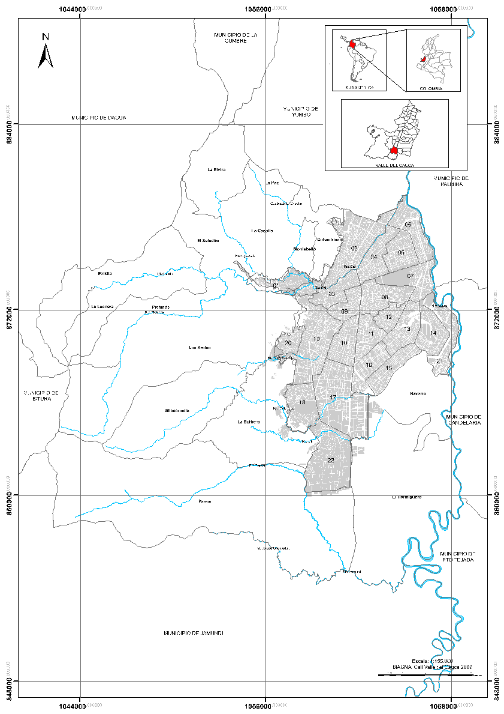

**Figura 2.** Mapa de localización de la ciudad de Santiago de Cali. Fuente**: **elaboración propia.

Además, como producto del contexto tectónico presente en el suroccidente del país y del fallamiento regional, la ciudad es definida con un nivel de amenaza sísmica alta con un valor de aceleración pico efectiva promedio por encima de los Aa = 2.84 m/s² donde, según el Estudio de Microzonificación Sísmica de Cali [6], la zona con mayor aceleración tiene un valor Aa = 3.92 m/s².

## 9.4 MÉTODOLOGÍA Y FUENTES DOCUMENTALES

### 9.4.1 Metodología

El desarrollo metodológico para la ejecución de los estudios históricos por sismos, movimientos en masa e inundaciones en el municipio de Santiago de Cali, consistió en la búsqueda sistemática de fuentes primarias y secundarias de información. Se realizó siguiendo la metodología intensivista propuesta por Rodríguez de la Torre [7], la cual plantea que al tener un previo conocimiento de la ocurrencia de un determinado evento y mediante la búsqueda de diversas fuentes (publicaciones periódicas, archivo, documentos, bases de datos, catálogos) puede adquirirse una mayor y mejor cantidad de información con el fin de precisar datos de los eventos y establecer parámetros de medición acerca de la frecuencia de estos. 

La historicidad se realizó para el municipio de Santiago de Cali en el periodo 1949–2018. Una aproximación inicial consistió en datar eventos históricos asociados a los fenómenos arriba indicados a partir de la revisión de diferentes bases de datos de carácter abierto. Una vez obtenido el registro de las diferentes bases, se procedió con la búsqueda en fuentes de información primarias, tales como periódicos, informes técnicos o bases de datos de las instituciones relacionadas con la gestión del riesgo en el municipio. Posteriormente, la búsqueda se complementó con la revisión de fuentes bibliográficas. 

Después de reunir la mayor cantidad de información, se analiza individualmente y se unifica para extraer los parámetros más importantes como fecha de ocurrencia, lugar, tipo de evento y los posibles daños y efectos. Cada registro o noticia encontrada se transcribe textualmente en fichas bibliográficas, para finalmente construir un catálogo para cada fenómeno bajo estudio. En la Figura 3 se esquematiza el proceso metodológico llevado a cabo.

::: {#box1 .callout-important style="background-color: #e3f0fbff; border-left: 4px solid #d4e8f9ff;" appearance="minimal" icon="false"}
<h2 style="font-size: 1rem; margin-top: 0; margin-bottom: 0;">Caja 1. Método extensivista Existe otro método para el desarrollo de estudios históricos denominado extensivista.</h2>

Se refiere a la búsqueda de fuentes de información que den cuenta de la ocurrencia de eventos que no aparecen registrados en bases de datos, ni catálogos oficialmente conocidos. Con este método extiende el conocimiento de eventos históricos ocurridos.
:::

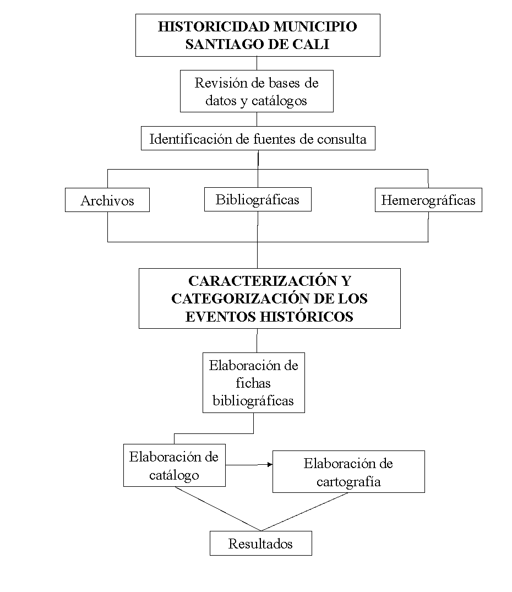

**Figura 3.** Diseño metodológico intensivista. Se representa esquemáticamente el tratamiento de la información histórica desde su búsqueda hasta la elaboración de catálogos y cartografía. Fuente: elaboración propia.

### 9.4.2 Fuentes y documentos consultados

Bases de datos y catálogos 

En la actualidad se dispone de inventarios de desastres no solo a escala global, sino también a escala local y regional, que permiten dar cuenta de eventos históricos. Se realizó la revisión de bases de datos como Sistema de Inventario de Efectos de Desastres (Desinventar), Sistema de Información de Movimientos en Masa (SIMMA) –SGC, Catálogo Sismicidad Histórica de Colombia–SGC, Catálogo de Terremotos para América del Sur- Colombia (CERESIS), Consolidado de emergencias – UNGRD y Datos Abiertos Colombia– UNGRD. Además, se obtuvo información de las bases de datos de la Defensa Civil Colombiana y Cuerpo de Bomberos Voluntarios de Cali.

Archivos

Como archivo se designa el lugar que tiene como finalidad la recopilación y conservación de documentos. En los archivos se localizan una serie de documentos no publicados, donde se registra la información de la entidad y se utiliza como evidencia de las acciones realizadas y eventos ocurridos. Estos documentos pueden ser actas de visitas, fotografías, fotocopias, documentos de administración, legislación, etc. Dentro de esta categoría se consultaron los documentos de las oficinas de la Cruz Roja, Empresas Municipales de Cali- EMCALI y de los Talleres del Municipio.

Fuentes bibliográficas

Las fuentes bibliográficas se refieren a documentos de  puntual especializada de un tema específico. En esta categoría se encuentran  , informes técnicos de investigaciones, etc. Algunos de los documentos bibliográficos consultados son Historia de los Terremotos en Colombia (Ramírez, 1975), el informe de sismicidad histórica regional del Estudio de Microzonificación Sísmica de Cali (INGEOMINAS-DAGMA, 2005) y la Historia Sísmica de Colombia 1550–1830 (Espinosa, 2012).

Hemerográficas

La fuente hemerográfica se refiere a los documentos de  como  s y periódicos, en ellos se registran los hechos y sucesos a nivel local, regional, nacional y mundial.  Los documentos hemerográficos consultados se localizan en la Hemeroteca de la Biblioteca Departamental Jorge Garcés Borrero y en el Observatorio Sismológico y Geofísico del Suroccidente Colombiano (OSSO) de la Universidad del Valle. 

Se consultaron los principales diarios locales y regionales de acuerdo con el periodo trabajado y a la temporalidad de circulación, entre estos El Tiempo, Diario El País, Diario Occidente, El Caleño, El Espectador, El Relator, El Pueblo, El Constitucional del Cauca, Correo ABC, Correo del Cauca y Diario El Liberal. La síntesis de las fuentes de información utilizadas para abordar el estudio de historicidad para los diferentes fenómenos trabajados en el presente Plan, se describen en el Cuadro 1.

| Cuadro 1. Listado de Fuentes de información utilizadas para el desarrollo del trabajo Bases de datos Red de Estudios Sociales en Prevención de Desastres en América Latina (LA RED). DesInventar. 1949-2018. En línea http://www.desinventar.org/es/ Servicio Geológico Colombiano (SGC). Sistema de Información de Movimientos en Masa (SIMMA). 2018. Versión electrónica disponible en: http://simma.sgc.gov.co Servicio Geológico Colombiano (SGC). Red Sismológica Nacional de Colombia- RSNC (2018). Sismicidad Histórica de Colombia. Versión electrónica disponible en: http://sish.sgc.gov.co/visor/ Defensa Civil Colombiana. Territorial Cali. 2018. Sistema Nacional de Información para la Prevención y Atención de Desastres – SINPAD. Unidad Nacional de Gestión del Riesgo de Desastres (UNGRD. 2018. Consolidado de emergencias. Versión electrónica disponible en: http://portal.gestiondelriesgo.gov.co/Paginas/Consolidado-Atencion-de-Emergencias.aspx Gobierno Digital de Colombia.2018. Datos Abiertos Colombia. Versión electrónica disponible en: https://www.datos.gov.co/ Cuerpo de Bomberos Voluntarios de Cali. 2013-2018. Base de datos de incendios forestales.  Periódico Diario El País. 1949-2018. Hemeroteca Biblioteca Departamental de Santiago de Cali. Occidente. 1962-2018. Hemeroteca Biblioteca Departamental de Santiago de Cali. El Tiempo. 1980-2018. Hemeroteca Biblioteca Departamental de Santiago de Cali. El Caleño. 1976-2018. Hemeroteca Biblioteca Departamental de Santiago de Cali. El Pueblo. 1976-1986. Hemeroteca Biblioteca Departamental de Santiago de Cali. El Relator. 1954-1961. Hemeroteca Biblioteca Departamental de Santiago de Cali. El Constitucional del Cauca. Observatorio Sismológico y Geofísico del Sur Occidente Colombiano- OSSO- Universidad del Valle. Correo ABC. Observatorio Sismológico y Geofísico del Sur Occidente Colombiano- OSSO- Universidad del Valle. Correo del Cauca. Observatorio Sismológico y Geofísico del Sur Occidente Colombiano- OSSO- Universidad del Valle Diario El Liberal. Observatorio Sismológico y Geofísico del Sur Occidente Colombiano- OSSO- Universidad del Valle. Libros Centro Regional de Sismología para América del Sur. Colombia (CERESIS). 1985. Catálogo de terremotos para América del Sur. Datos de hipocentros e intensidades. Volumen 4. 136 p. Ramírez, J. E. 1975. Historia de los terremotos en Colombia. Bogotá: Instituto Geográfico Agustin Codazzi. 250 p. CD  Espinosa, A. 2012. Enciclopedia de desastres naturales históricos de Colombia. Volúmenes 1-7. Documentos INGEOMINAS-DAGMA. 2005. Informe No.1-4 Estudio de Sismicidad Histórica Regional. Capítulo 4.3. Características de los terremotos históricos importantes para la amenaza sísmica de la ciudad de Santiago de Cali. 86 p. Versión electrónica disponible en: https://miig.sgc.gov.co/Paginas/Resultados.aspx?k=BusquedaPredefinida=DGAMicrZonSismSantiagoCali. Empresas Municipales de Cali (EMCALI). 2016-2018. Formato para evaluación de daños. Plan de emergencia y contingencias UENAA.  Cruz Roja. 2013-2018. Censo para damnificados. Talleres del Municipio. 2013-2018. Informe de talleres del municipio. |
| --- |

## 9.5 RESULTADOS

A continuación, se presentan los principales resultados y conclusiones del estudio de historicidad de fenómenos naturales realizado para la caracterización de escenarios de riesgos dentro del Plan Municipal de Gestión del Riesgo del municipio Santiago de Cali, en el cual se tuvieron en cuenta los eventos sísmicos, movimientos en masa e inundaciones, aportando información fundamental para la evaluación de la amenaza y caracterización del riesgo en el municipio ante cada tipo de evento y, posteriormente, la implementación de estos conocimientos en la planificación del territorio.

### 9.5.1 Sismos históricos en Santiago de Cali

La búsqueda documental para la identificación de los sismos históricos ocurridos en Santiago de Cali, contempló una ventana de tiempo que abarca los eventos registrados por diferentes fuentes desde 1566 hasta el 2018. La principal consigna fue evidenciar los factores de ocurrencia, frecuencia y las consecuencias sufridas por el municipio frente a la ocurrencia de estos fenómenos, siendo un insumo fundamental para la caracterización de escenarios de riesgo de la ciudad. A continuación, se muestran los resultados obtenidos de la búsqueda documental a partir de la consulta en bases de datos, informes técnicos, periódicos y libros, correspondientes a la aplicación rigurosa de la metodología abordada en los primeros apartes del capítulo.

Conceptualización de sismos

Un terremoto es la vibración de la Tierra producida por una rápida liberación de energía. Los terremotos se producen por la interacción de las placas tectónicas que componen la corteza y por la liberación de esfuerzos de las fallas geológicas presente en el interior del continente. Los sismos se propagan en todas direcciones en forma de ondas [8]. Los esfuerzos en los límites de placa producen numerosas fracturas, dando lugar a grandes fallas con desplazamientos importantes, y a lo largo de estas zonas de falla se producen movimientos repetidamente, por lo que la mayoría de los sismos se concentran en dichos límites de placa [9]. 

Los principales parámetros de un evento sísmico son los de localización y tamaño [10], los cuales, son esenciales para definir las fuentes sismogénicas presentes en un determinado territorio. Estos pueden ser representados en niveles de magnitud, intensidad, aceleración, velocidad y desplazamiento del suelo. La magnitud se relaciona con la energía liberada en el foco del terremoto, la intensidad con los efectos ocasionados por el evento y la aceleración, velocidad y desplazamiento del suelo se relaciona con la energía recibida en un punto cualquiera de la superficie.  

La sismicidad en Colombia se relaciona con la actividad en la zona de subducción del pacífico colombiano y con sus principales fallas geológicas.

Reportes sobre eventos sísmicos 

En la búsqueda de información para la elaboración del documento de historicidad para eventos sísmicos, se recurrió a diferentes fuentes de información, cubriendo el periodo entre 1566 y 2018. Esto se hizo para abarcar un amplio periodo de tiempo y lograr identificar la mayor cantidad de eventos sísmicos que han sido relevantes para la ciudad de Santiago de Cali a lo largo de su historia.

En la Figura 4 se presenta un histograma que sintetiza el resultado del número de eventos sísmicos encontrados en el periodo señalado que dejaron algún tipo de afectación en la ciudad Santiago de Cali.  

|  |
| --- |

**Figura 4.** Distribución por año del número de sismos para el municipio de Santiago de Cali, ocurridos en el periodo 1566-2018. Fuente: elaboración propia.

La búsqueda documental arrojó un total de 97 eventos sísmicos relevantes para el periodo comprendido entre 1566 y 2018. Es importante mencionar que para el desarrollo del informe de historicidad en la formulación del Plan Municipal de Gestión de Riesgo de Desastre del municipio de Santiago de Cali, se definió como periodo de tiempo de análisis el comprendido entre 1949 y 2018; sin embargo, dada la naturaleza de la sismicidad, en donde los periodos de retorno son largos y su frecuencia de ocurrencia es menor, comparada con otros fenómenos, se decidió realizar la búsqueda documental, solo para este tipo de fenómeno, desde 1566, año en el cual se tiene el primer registro de un terremoto en Colombia, el cual precisamente afectó las poblaciones de Cali y Popayán. Se tomaron sismos sentidos desde la época de la Conquista y la Colonia, que hayan tenido efectos regionales o locales con influencia sobre la ciudad de Cali. [11,12]. 

El estudio de historicidad permite analizar que los eventos sísmicos en la ciudad de Cali, han generado afectaciones de consideración a través de los años en las estructuras y personas, concentrándose en un inicio en lo que ahora se considera el centro de la ciudad, dado que por esa zona inició la urbanización. Para sismos recientes, las afectaciones se han presentado principalmente en la zona del Cono Cañaveralejo, que debido a las características del suelo tiene una respuesta sísmica alta [6], sobre todo por sismos regionales que tienen ocurrencia en fuentes sismogénicas lejanas a la ciudad.

Mapa de sismos históricos del municipio de Santiago de Cali en el periodo 1566–2018

En la Figura 5 se presenta la distribución espacial de los eventos sísmicos encontrados que han generado efectos en el municipio de Santiago de Cali. Para el presente informe, se tomaron los epicentros estimados en el Catálogo de terremotos para América del Sur [13] y la información del Catálogo de Sismicidad Histórica de Colombia, del Servicio Geológico de Colombia [14] con el fin de mostrar un marco general de la distribución espacial de los eventos sísmicos. Cabe mencionar, que la distribución espacial de los eventos sísmicos se trabaja a una escala regional, dado que su ocurrencia no se presenta de manera puntual sobre el municipio como en el caso de otros fenómenos [15–24].

Se puede observar que los sismos que han generado algún impacto sobre el municipio se concentran en gran medida en la zona límite del Valle del Cauca con el Chocó, Quindío y Risaralda [25–34]. 

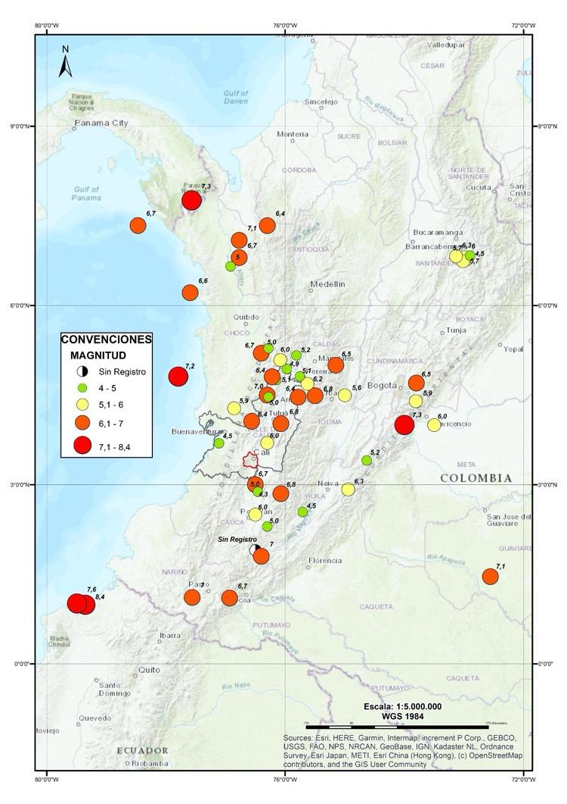

**Figura 5.** Mapa histórico de eventos sísmicos de influencia en Santiago de Cali. Se representan los eventos sísmicos en diferente tamaño y color de acuerdo con su magnitud. Fuente: elaboración propia.

### 9.5.2 Movimientos en Masa históricos en Santiago de Cali

A continuación, se presentan los resultados sobre los eventos por movimientos en masa ocurridos en la ciudad Santiago de Cali en el periodo entre 1949 y 2018, obtenidos de la búsqueda documental en bases de datos, informes técnicos, periódicos y libros. 

Conceptualización de movimientos en masa

Los movimientos en masa o movimientos de ladera, se definen como "todo desplazamiento hacia abajo (vertical o inclinado en dirección del pie de una ladera) de un volumen de material litológico importante, en el que el principal agente es la gravedad" [35]. Para Calvo [36], los movimientos de ladera son eventos que suelen asociarse a otros procesos, como los terremotos, lluvias extraordinarias, procesos morfológicos (que no incluyen riesgo necesariamente, como puede ser la erosión fluvial) y la acción antrópica la cual tiene un papel de primer orden al modificar las características del terreno. Los elementos que permiten definir el grado de peligrosidad de un deslizamiento de terreno son la velocidad del fenómeno y la superficie afectada.

Reportes sobre eventos por movimientos en masa 

Con respecto al número de noticias por movimientos en masa encontrados para el área urbana y rural del municipio Santiago de Cali, en el periodo 1949–2018 se encontraron 342 noticias, siendo los años 2016 y 2017 los que presentan la mayor cantidad de reportes (Fig. 6). En 1999 se muestra un número representativo de 21 noticias, que se relacionan con un periodo de lluvia que afectó significativamente las zonas de ladera de la zona urbana de la ciudad y sus corregimientos. Para los años más recientes las noticias corresponden principalmente a información referente a trabajos de recolección de deslizamientos en todo el municipio [37–46].

El histograma del número de eventos por año denota tres periodos marcados en los cuales el promedio de noticias se duplica o triplica con respecto al primer periodo (Fig. 7). El primer periodo va desde 1949 a 1983, donde el promedio de eventos es 2. El segundo comprende los años 1984 a 1992 con promedio de 4 eventos por año, y finalmente, el tercero corresponde al periodo 1991–2018, donde se aprecian en promedio 9 eventos por año [47–53].

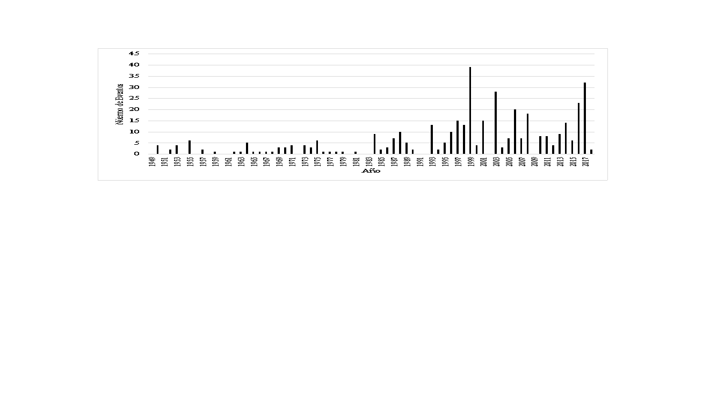

**Figura 6.** Distribución anual del número de noticias de movimientos en masa por año en el municipio de Santiago de Cali, periodo 1949–2018. Fuente: elaboración propia.

**Figura 7.** Distribución anual del número de eventos por año de movimientos en masa en el municipio Santiago de Cali en periodo 1949–2018. Fuente: elaboración propia.

En lo que se refiere a la distribución en el área de estudio, el 66% de los eventos se presentan en el casco urbano y un 25% en el área rural (Fig. 8a), lo cual puede asociarse al número de viviendas ubicadas en la zona de ladera y actividades desarrolladas en ellas con relación a los corregimientos, el 9% restante no se reporta a un área específica en de las fuentes consultadas. 

De la historicidad revisada se encontró, que las zonas más afectadas corresponden a las comunas 20, 18 y 1 (Fig. 8b**) **donde se presentan movimientos en masa tipo deslizamientos de tierra y flujo, provocados por la inestabilidad del terreno en temporada de lluvias. En la comuna 20, los movimientos en masa se concentran principalmente en Siloé, el barrio Brisas de Mayo y Tierra Blanca, en la comuna 18 en el barrio Los Chorros y, finalmente, en la comuna 1 en los barrios Terrón Colorado y Aguacatal (Fig. 9). Los corregimientos de la ciudad también sufren por el desenlace de este fenómeno natural, siendo Felidia, La Buitrera, Los Andes y El Saladito los más afectados (Fig. 10). 

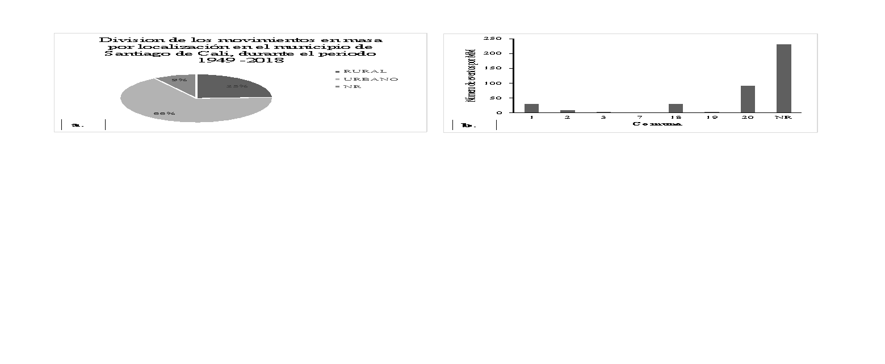

**Figura 8.** Distribución del número por movimientos en masa (MM) por localización en el municipio de Santiago de Cali, durante el periodo 1949 -2018. Representa la distribución de eventos entre el área urbana y rural (izquierda), y la distribución del número de eventos por comunas (derecha). Fuente: elaboración propia.

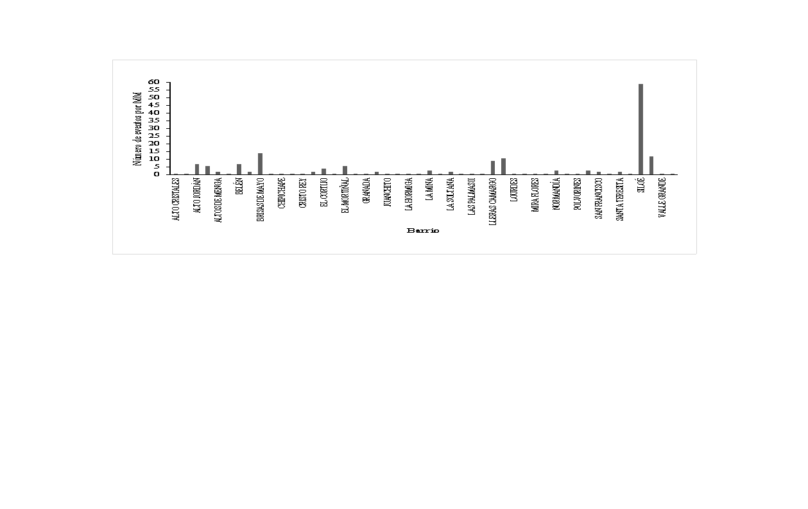

**Figura 9.** Distribución de eventos de movimientos en masa por barrios en el municipio de Santiago de Cali, durante el periodo 1949 -2018. Fuente: elaboración propia.

**Figura 10.** Número de eventos de movimientos en masa por corregimiento en el municipio de Santiago de Cali, durante el periodo 1949 -2018. Fuente: elaboración propia.

Cartografía de movimientos en masa

Con la información obtenida y debidamente espacializada se presentan a continuación los mapas de movimientos en masa para la zona urbana y rural del municipio de Santiago de Cali (Fig. 11 y 12).

**Figura 11**. Historicidad de movimiento en masa zona urbana. Los colores representan la frecuencia de eventos en cada barrio. Fuente**:** elaboración propia.

**Figura 12.**  Historicidad de movimientos en masa zona rural. Los colores y tamaños de los círculos representan la cantidad de registros por movimientos en masa. Fuente: elaboración propia.

### 9.5.3 Inundaciones históricas en Santiago de Cali

A continuación, se muestran los resultados obtenidos de la búsqueda documental a partir de la consulta en bases de datos, informes técnicos, periódicos y libros, correspondientes a la aplicación rigurosa de la metodología abordada en los primeros apartes del capítulo.

Conceptualización de inundación

Una inundación es un evento natural y recurrente que se produce como resultado de la acumulación de agua causada por intensas o continuas lluvias sobre áreas planas o llanuras de inundación que, al sobrepasar la capacidad de retención del suelo y de los cauces se desbordan e inundan los terrenos aledaños a los cursos de agua [54]. Para el Ministerio de Ambiente y Desarrollo Sostenible – Universidad Nacional de Colombia [55], las inundaciones son parte de un proceso natural como respuesta a eventos climáticos de autorregulación del propio ciclo hidrológico. 

El territorio colombiano se caracteriza por tener un régimen bimodal, es decir, temporadas alternadas de bajas precipitaciones y altas precipitaciones, en estas últimas hay probabilidad de que se presenten crecientes de los afluentes y cuerpos de agua generando inundaciones que pueden ocasionar afectaciones en la población.

::: {#box2 .callout-important style="background-color: #e3f0fbff; border-left: 4px solid #d4e8f9ff;" appearance="minimal" icon="false"}
<h2 style="font-size: 1rem; margin-top: 0; margin-bottom: 0;">Caja 2. Definiciones para la clasificación de las inundaciones fluviales y pluviales: Inundaciones fluviales por desbordamientos de los ríos: son causadas por los desbordamientos de los ríos y los arroyos, lo cual se atribuye, en primera instancia, a un excedente de agua. El aumento brusco del volumen de agua que un lecho o cauce es capaz de transportar sin desbordarse produce lo que se denomina como avenida o riada, un mayor aumento del volumen es la causa de la inundación [56].</h2>

Inundaciones pluviales por precipitaciones in situ: son las que se producen por la acumulación de agua de lluvia en un determinado lugar o área geográfica sin que ese fenómeno coincida necesariamente con el desbordamiento de un cauce fluvial. Este tipo de inundación se genera tras un régimen de precipitaciones intensas o persistentes, es decir, por la concentración de un elevado volumen de lluvia en un intervalo de tiempo muy breve o por la incidencia de una precipitación moderada y persistente durante un amplio período de tiempo. Lógicamente, es el primero de estos casos el que conlleva el mayor peligro para la población y sus bienes y el que plantea los principales inconvenientes a los servicios de coordinación e intervención para prevenir y controlar sus daños. Las precipitaciones torrenciales, que se acumulan peligrosamente en un lapso muy breve de tiempo, hacen que el tiempo de respuesta de los servicios de emergencia sea más reducido [56].
:::

Reportes sobre eventos por inundación

En la búsqueda de información en diferentes fuentes, se encontró un total de 227 eventos relevantes por inundaciones en el municipio de Santiago de Cali para el periodo comprendido entre 1949 y 2018 [57– 59]. En la Figura 13 se muestra el histograma con número de reportes de eventos de inundación que se presentaron por cada año de la ventana de tiempo seleccionada [60–65].

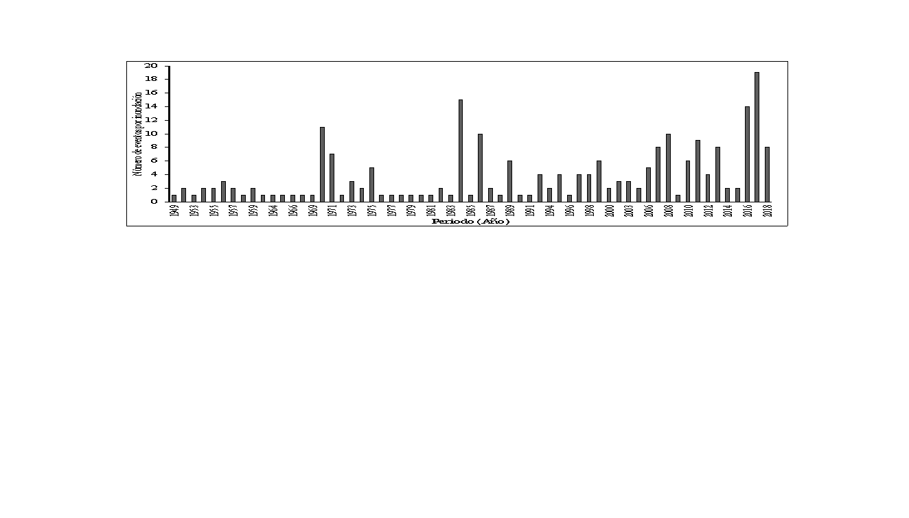

**Figura 13.** Número de reportes sobre eventos por año inundación en el municipio de Santiago de Cali, encontrados en el periodo entre 1949–2018. Fuente**:** elaboración propia.

En la Figura 14a se muestra el número de eventos por inundación que se han presentado en cada una de las comunas del municipio durante el periodo indicado. En la Figura 14b se muestran los eventos por inundación registrados en la zona rural del municipio, donde el corregimiento que más eventos se han registrado es el de Navarro con 40 registros. Seguido por el corregimiento de Pance con 18 eventos registrados. Los corregimientos de El Hormiguero y Montebello se han registrado siete y seis eventos respectivamente. Por último, se encuentran los corregimientos de La Buitrera, La Castilla y Pichinde con un evento cada uno.

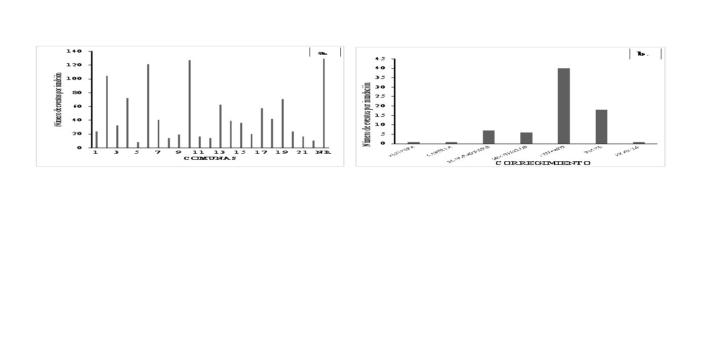

**Figura 14.** Distribución de eventos por inundación en el municipio de Santiago de Cali para el periodo de 1949-2018 (izquierda). Registro de eventos por comunas. Registro por corregimientos (derecha). Fuente: elaboración propia.

Las inundaciones que se presentan en el municipio son pluviales y fluviales (Fig. 15). Se observa que 195 de las inundaciones ocurridas en el municipio Santiago de Cali son pluviales, correspondientes al 61% del total de las inundaciones y 125 son de tipo fluvial, es decir el 39% de total de los eventos que se registraron en el municipio. 

**Figura 15.** Número de eventos por tipo de inundación en el municipio de Santiago de Cali, periodo 1949 – 2018. Fuente: elaboración propia.

Las Figuras 16, 17 y 18 muestran la representación cartográfica o distribución espacial de los eventos por inundación reportados en la ciudad Santiago de Cali.

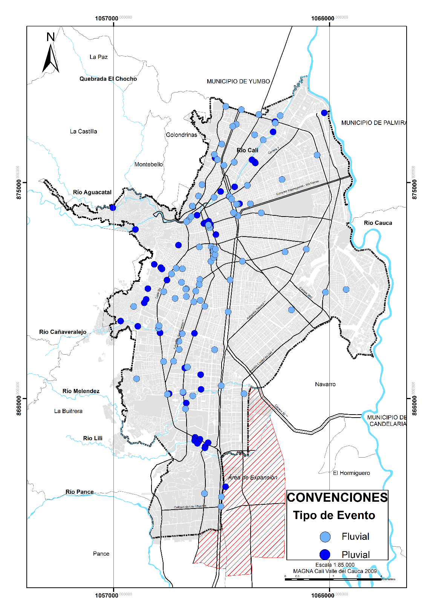

**Figura 16.** Historicidad de eventos de inundación fluvial y pluvial en la zona urbana del municipio de Santiago de Cali. Fuente: elaboración propia.

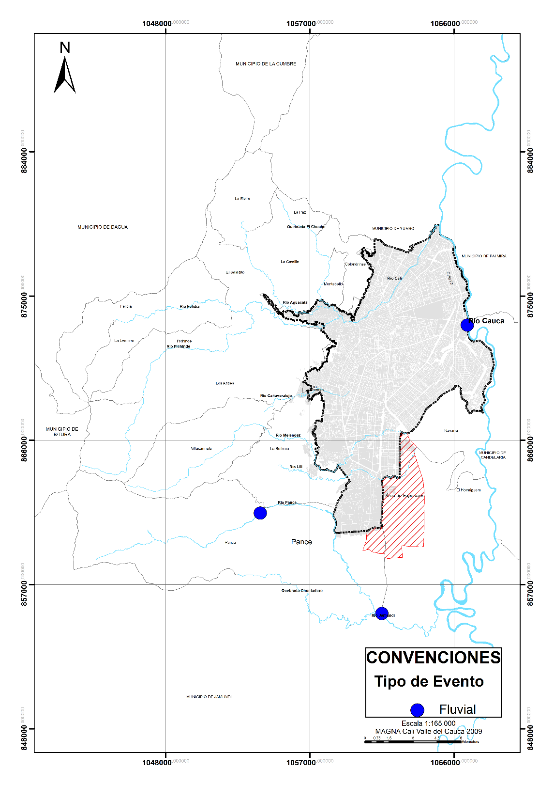

**Figura 17.** Historicidad de eventos de inundación fluvial en la zona rural del municipio de Santiago de Cali. Fuente: elaboración propia.

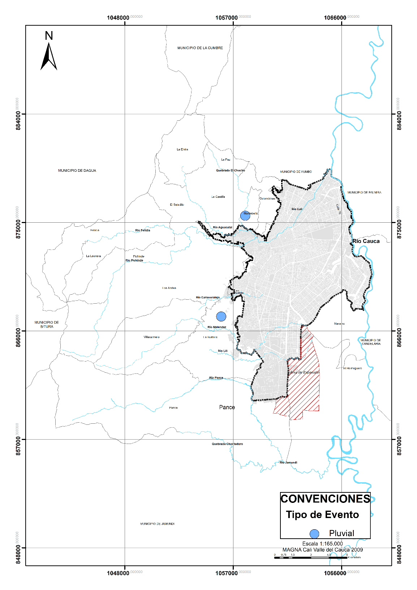

**Figura 18.** Historicidad de eventos de inundación pluvial en la zona rural del municipio de Santiago de Cali. Fuente: elaboración propia.

## 9.6 GESTIÓN DEL RIESGO EN CALI Y SU RELACIÓN CON LA OCURRENCIA DE EVENTOS HISTÓRICOS

El municipio de Santiago de Cali, específicamente su área urbana, fue un epicentro importante de recepción de flujos migratorios, convirtiéndose en un centro de actividades económicas para una vasta porción del eje comercial y en un polo de desarrollo para la región [66]. Sin embargo, al mismo tiempo fue consolidando un desarrollo desordenado de su trama urbana. 

En este contexto, debido a la carencia de instrumentos institucionales para una adecuada planificación de la ciudad, se conformaron asentamientos ilegales que derivaron posteriormente en conflictos por la tierra [67] y en la toma de acciones populares por parte de la población migrante para acceder a un predio y a la aplicación de políticas de desarrollo urbano, propiciando la dilatación físico-urbana y la ampliación del perímetro urbano entre 1950 y 1990 hacia el oriente de la ciudad [68]. Se consolido un modelo de ciudad que muestra una expansión discontinua, dispersa e incontrolada, mediante la ocupación de terrenos aislados y sin urbanizar.

Cuando se analiza la distribución espacial de los eventos históricos ocurridos en el municipio, específicamente para el caso de inundaciones y movimientos en masa, se logra evidenciar que existe una mayor concentración hacia las zonas y barrios que recibieron la mayor parte de la población inmigrante y que se consolidaron de manera ilegal. Situación que, demuestra como los problemas en planificación se ven materializados en la ocurrencia fenómenos que pueden dejar un impacto sobre el territorio urbano. 

A nivel reglamentario, el municipio cuenta con diferentes instrumentos para la gestión del riesgo que se han desarrollado a través de los años. El primero de estos, corresponde al Plan General para la Atención de Emergencias en Cali, realizado en el año 1989 por el Fondo de Emergencia Ciudadana (FES) y el Comité Operativo de Emergencia (COE) [69]. Este instrumento, tuvo como objetivo principal, plantear estrategias previas a la ocurrencia de los eventos, durante el periodo de emergencia y medidas de reparación de daños. 

En el 1996, se formuló el Plan de Mitigación de Riesgos para Cali, el cual generó acciones de mitigación, intervenciones físicas y de planeación territorial, constituyéndose en una base aprovechable para el diseño y puesta en funcionamiento a futuro de un Plan de Gestión de Riesgos [70]. 

Posteriormente, en el año 2009 mediante el acuerdo Decreto 411.020.0744 se adopta el Plan Local de Emergencias y Contingencias del municipio de Santiago de Cali (PLEC) [70]. Prioriza los escenarios de riesgo, de sismos e inundaciones como los que podrían generar más daños y mayores damnificados en el municipio. 

Todos estos instrumentos anteriormente mencionados, se enmarcaron en un enfoque de la atención del desastre, de acuerdo a la normatividad vigente a la fecha de su formulación. Con la entrada en vigencia de la Ley 1523 de 2012 [71] y del Decreto 1807 de 2014 [72], se cambia el paradigma de la gestión del riesgo en el país y se resalta la importancia de incorporarla en los procesos de planificación del territorio. 

En sentido, surge la obligatoriedad para todas las entidades de formular planes de gestión del riesgo. El municipio de Santiago de Cali, en cumplimiento con la normatividad establecida, adopta en el año 2012 su Plan Municipal de Gestión del Riesgo de Desastres, mediante Decreto 411.020.0681 [73]. Sin embargo, este proceso solamente se realizó en el papel, dado que no llegó a la caracterización de escenarios de riesgos y a la formulación de un componente programático.

Por otro lado, en el año 2014 en la Revisión y Ajuste del de Plan de Ordenamiento Territorial del municipio, se involucra la gestión del riesgo en todos los componentes del plan, teniendo en cuenta estudios existentes, el planteamiento de acciones y medidas [4].

Con base a todo lo anterior, se debe mencionar que, de acuerdo al estudio de historicidad realizado en el presente trabajo, estos instrumentos para la gestión del riesgo no han representado una herramienta contundente que permitan dar frente a la ocurrencia de fenómenos en el municipio, sobretodo de inundación y movimiento en masa, pues en los últimos años se muestra un aumento significativo en la frecuencia de ocurrencia de estos eventos. 

Finalmente, dado que este trabajo hace parte de la formulación del Plan Municipal de Gestión del Riesgo de Santiago de Cali, desarrollado en el año 2018, resulta conveniente analizar en un futuro, su impacto en la frecuencia de ocurrencia y severidad de eventos. 

## 9.7 CONCLUSIONES

En este estudio historicidad se encontraron 97 sismos que por sus características de localización y efectos, son importantes para entender la dinámica sísmica de la ciudad de Santiago de Cali; aunque muchos no dejaron grandes efectos negativos para la ciudad, siendo los de mayor intensidad y consecuencia los de 7 de junio de 1925, 30 julio de 1962, 23 de noviembre de 1979, 8 de febrero de 1995 y 15 de noviembre de 2004. 

La mayoría de los efectos negativos tanto estructurales, como en personas se evidenciaron en la zona del Cañaveralejo, debido a las características del suelo que ocasionan una respuesta sísmica es alta. 

Del análisis de historicidad realizado para movimiento en masa, se puede concluir que las zonas más propensas a presentar este fenómeno, corresponden a barrios ubicados en zonas de ladera en el municipio de Santiago de Cali, donde las pendientes superan los 5°, los suelos son inestables por las actividades antrópicas que en un momento se desarrollaron en ellos y los canales de drenaje no son adecuados permitiendo en temporada de lluvias la acumulación y posterior infiltración del agua en el suelo, generando la inestabilidad del mismo. Esta situación se da, para el área urbana principalmente en el sector de Siloé en la comuna 20, en el barrio Los Chorros (Comuna 18) y en el Sector de Terrón colorado (Comuna 1).

Para la zona rural, la mayoría de los deslizamientos en masa se presentan en los corregimientos localizados al Noroccidente de la Ciudad, de los cuales, Felidia, La Elvira, Los Andes y El Saladito, se ven constantemente afectados por este fenómeno.

En el municipio de Santiago de Cali se han presentado varios eventos por inundación afectando la población durante los periodos de altas precipitaciones. Por tal motivo, es de vital importancia mantener la huella histórica en documentos, reportes e informes para que se puedan realizar estudios que permitan identificar la recurrencia de las inundaciones, logrando así, plantear acciones para la prevención y mitigación de los daños a futuro.

La revisión histórica se planteó desde el año de 1949 de acuerdo a la inundación presentada entre 1949 y 1950, dado que fue uno de los eventos que ha dejado mayores afectaciones, dejando incomunicados por 10 días los municipios de Santiago de Cali y Candelaria.

En el periodo comprendido desde el año de 1949 hasta mayo de 2018, se puede concluir que el municipio de Santiago de Cali ha sido afectado por inundaciones fluviales y pluviales. Las inundaciones fluviales, han sido producto del desbordamiento de los ríos Cali, Aguacatal, Cañaveralejo, Meléndez, Lili, Pance y el río Cauca, afectando el municipio en mayor medida en la zona urbana. Las inundaciones pluviales, se deben al desbordamiento de los canales, colectores y el colapso del sistema de alcantarillado.

Según lo consultado, las afectaciones presentadas corresponden en parte a la baja capacidad hidráulica por la sedimentación y los residuos sólidos que son arrojados a estos afluentes y canales que en época de máximas precipitaciones afectan su dinámica. Además, el municipio al estar localizado entre el piedemonte de la cordillera Occidental y la llanura de inundación del río Cauca, presenta una baja capacidad para drenar sus aguas por gravedad en época de máximas precipitaciones al río Cauca. 

Finalmente, la distribución espacial de los eventos históricos, específicamente para el caso de las inundaciones y movimientos en masa, permite vislumbrar una relación con las debilidades en los procesos de planificación del municipio y su crecimiento desordenado. Evidenciándose carencias en la formulación de instrumentos de gestión del riesgo para evitar la nueva ocurrencia de eventos. 

| RECOMENDACIÓNES PARA TOMAR DECISIONES Con el propósito de cumplir con los objetivos de los estudios históricos y que representen una herramienta útil en los procesos de gestión del riesgo y de la planificación del territorio, es fundamental que, desde las diferentes administraciones municipales e instituciones, se reconozca la importancia de llevar una adecuada sistematización de los eventos que ocurren en el territorio. Es común encontrar que en los diferentes municipios no se tiene registro de los eventos ocurridos o de las emergencias atendidas, y cuando lo tienen, no detallan las características del evento y sus efectos. |
| --- |

**CONFLICTO DE INTERESES **

Los autores no declaran conflicto de intereses 

**AGRADECIMIENTOS**

A la Alcaldía Municipal de Santiago de Cali por intermedio de la Secretaria Municipal de Gestión del Riesgo de Desastres y Emergencias quienes priorizaron dentro de sus proyectos el contrato interadministrativo 4163.00126.1.357 de 2018 cuya ejecución estuvo a cargo del Observatorio Sismológico de la Universidad del Valle y de la cual se derivan los resultados del PMGRD de Santiago de Cali.  

**IDENTIFICACIÓN DE AUTORES  **

Nathalie Garcia-Millan                  	

Jorge Andrés Velez Correa          	

Karen Sanchez Estupiñan                	

Nisley Zuñiga Estacio                      	

Yeli C Castillo Gonzales                  	

Alba Nidia Castaño Castaño            	

Jorge Andrés Diaz Renteria             	

Elkin de J. Salcedo Hurtado             	

## 9.8 BIBLIOGRAFÍA

García-Acosta, V. (1996). El estudio histórico de los desastres. *Historia y Desastres en América Latina*, 1, 15–37.

Girola, L. (2011). Historicidad y temporalidad de los conceptos sociológicos. *Sociológica*, 26(73), 13-46.  

Salcedo-Hurtado, E. (2002). Sismicidad Histórica y Análisis Macrosísmico de Bucaramanga. Boletín Geológico. *Boletín Geológico*, 40 (1).

DAP (Departamento Administrativo de Planeación Municipal). (2014). *Plan de Ordenamiento Territorial de Santiago de Cali*. Documento Técnico de Soporte. 1170 p.

DAP (Departamento Administrativo de Planeación Municipal). (2016). *Cali en cifras 2016*. 244 p.

INGEOMINAS & DAGMA. (2005). *Estudio de Microzonificación Sísmica de Santiago de Cali*

Rodríguez de la Torre, F. (1993). Lecturas sistemáticas de prensa periódica. Hacia una revisión de la sismicidad europea durante los siglos XVII y XVIII. En *Historical investigation of European earthquakes. Materials of the CEC project Review of Historical Seismicity in Europe*. pp. 247-258. 

Tarbuck, E. J., Lutgens, F. K., Tasa, D., & Científicas, A. T. (2005). *Ciencias de la Tierra*. Madrid: Pearson Educación.

Olcina Cantos, J., & Ayala-Carcedo, F. J. (2002*). Riesgos naturales*. *Ariel SA*.

Muñoz, D (1989). Conceptos básicos en riesgo sísmico.  *Física de la Tierra. 1*. 199-215.

Arboleda, G. (1956). *Historia de Cali: desde los orígenes de la ciudad hasta la expiración del período colonial*. Tomo II, Capitulo LI. Cali. Universidad del Valle. 420 pp.

Arroyo, J. (1955*). Historia de la Gobernación de Popayán*. Bogotá. Santafe. 264 pp.  

CERESIS (Centro Regional de Sismología e Intensidades). (1985). *Datos e Intensidades*

Servicio Geológico Colombiano (2018). *Sismicidad Histórica de Colombia*. Disponible en línea   

Diario Correo del Cauca (1925 a). *Cali al influjo de un terremoto. - la catástrofe sísmica de anoche - el fatídico domingo 7*. 

Diario Correo del Cauca (1925 b). *Ecos del terremoto.*

Diario Correo ABC (1925).  *El domingo a las 7 menos 10 minutos de la noche, se sintió un fuerte temblor.*

Diario El Espectador (junio 9 de 1925). *Nuevas informaciones sobre los temblores del domingo*

Diario El Relator (1925 a). *El pavoroso terremoto de anoche. *

Diario El Relator (1925 b). *Resumen noticioso de la semana.*

Diario El Tiempo (1925 a). *Ayer se sintieron fortísimos temblores en casi todo el país.* 

Diario El Tiempo (1925 b). *El temblor del domingo.*

Diario Occidente (1962). *Instantes de terror vivió Cali con el terremoto.*

Diario El País (1962). *Drama de Cali Instantes Después del Sismo. Muerte y desesperación.*

Diario El Tiempo 1962). *Pánico por el terremoto Calda, Valle, y Antioquia resultaron los sectores más castigados por la tragedia. Cuarenta muertos y cuantiosos daños. *

Diario El País (1979 a). *35 muertos. Tembló durante sesenta segundos en Colombia.*

Diario El País (1979 b). *Cali se defendió bien “Hubo daños **costosos** pero no graves”, dicen arquitectos.*

Diario El País (1979 c). *Temblor afectó la normal de señoritas.*

Diario El Pueblo (1979). *Manizales, epicentro del terremoto.* 

Diario El País (1995 a). *Sismo, muerte y destrucción. Más de una veintena de muertos y alrededor de 250 heridos. Pereira en emergencia*.

Diario El País (1995 b). *Daños en 77 edificaciones. El CLE hizo el balance de los efectos en Cali del sismo del 8 febrero.*

Diario El País (2004). *Caleños vivieron madrugada de pánico*.

Diario El Tiempo (2004). *Sismo sacude a Valle y Chocó*.

Diario El Caleño (2004). *En Cali amaneció temblando. Segundos de terror vivió la población.*

Moncayo J., Castro Marín E., Valencia Núñez A., y Fonseca González S. (2001). *Evaluación de riesgo por fenómenos de remoción en masa: Guía Metodológica*. Colombia: Escuela Colombiana de Ingeniería. 166p. 

Calvo García, Francisco (2001). *Sociedades y territorios en riesgo*. Barcelona, España: Ediciones el Serbal. 186p. 

Diario El País. (1955). *Tragedia en Golondrinas: Un minero muerto y varios heridos por un alud de rocas en las minas.*

Diario El País. (1965). *Mueren dos niños al derrumbarse una casa en la parte alta de Cali, menor*.

Diario El País. (1970). *11 muertos en explosión y derrumbe.*

Diario El País. (1973). *En Terrón Colorado dos niñas heridas al desplomarse vivienda.*

Diario El País. (1984 a). *Deslizamiento en Siloé.*

Diario El Pueblo. (1984 b). *Drama en Lleras Restrepo: Emergencia en Siloé por deslizamientos.*

Diario El País. (1989). *Seis los muertos por el invierno: Alud mató a cuatro miembros de una familia en El Aguacatal.*

Diario El País. (1993). *Familias de los cerros en la calle. Crece emergencia en las laderas.*

Diario El País. (1995). *Derrumbe en la obra tumbó dos casas: Canal de Nápoles causa accidente.*

Diario El País. (1996). *El invierno afectó a cuatro familias en laderas de Cali.*

Diario El País. (1997). *Se desmoronan 20 casas.*

Diario El País. (1999). *Deslizamientos en la Comuna 20.* 

Diario El País. (1999). *La vía a Pance se desmorona.   *

Diario El País. (1999). *Tragedia en la loma de Belén.*

Diario El País. (2004). *Los Chorros, en alto riesgo.*

Diario El País. (2006). *Zona de ladera, en alerta por deslizamientos.*

Diario El País. (2013). *Lluvias causaron estragos. Lluvias causaron deslizamientos*.

Ministerio de Medio Ambiente y Desarrollo Sostenible (2014). *Guía técnica para la formulación de los planes de ordenación y manejo de cuencas hidrográficas*.

Ministerio de Hacienda y Crédito Público. (2013). *Estrategia de protección financiera para la reducción de la vulnerabilidad fiscal ante la ocurrencia de desastres naturales en Colombia*. Bogotá D.C. Colombia.

Aparicio, J. (2003). *Lluvias e inundaciones*. Recuperado el 24 de febrero del 2012 de la Web: 

Corporación OSSO- Colombia, LA RED y UNIDR (2017). *Desinventar. Sistema de inventario de efectos de desastres. *Recuperado de

Diario el País (20 de abril de 1998). *Un muerto y cien viviendas inundadas dejó el aguacero de ayer. Cali, en emergencia invernal un muerto*. 

Diario el País. (05 de mayo de 2010). *Invierno sigue causando estragos. El invierno colapsó al Nororiente. Altos niveles del rio Cauca provocaron la emergencia. Una mujer habría muerto electrocutada en Calimio. *

Diario el País. (07 de noviembre de 2011). *Baño dominical en el río terminó en tragedia*.

Diario el País. (18 de abril de 2018). *Trágico aguacero causó dos muertos y generó caos*.

Diario el País. (21 de mayo de 1971). *Cali baja la furia de las aguas. Estragos por las inundaciones en la ciudad*.

Diario el País. (24 de febrero de 1999). *Emergencia por ola invernal.*

Diario el País. (29 de junio de 1959). *Rescatados sin vida los 4 menores.*

Diario El Pueblo. (01 de julio de 1984). *Por desbordamiento del rio Cali. Más de $500 millones en pérdidas.*

Castillo, C. (2014). *El Control Territorial en el Departamento del Valle del Cauca*. Primera edición. Programa Editorial Universidad del Valle. Cali.

Vásquez, H. (1985). *El proceso de urbanización en la historia colombiana. *Primera edición.  Bogotá. Universidad Externado de Colombia.

Mosquera, G. (2011). *Expansión urbana y políticas estatales en Cali*. POLIS. Observatorio De Políticas Públicas. Sexta edición.

Fondo de Emergencia Ciudadana (FES) & Comité Operativo de Emergencia (COE) (1989). *Plan General para la Atención de Emergencias en Cali.* 

Alcaldía de Santiago de Cali & CORPORIESGOS (2009). *Plan Local de Emergencias y Contingencias del municipio de Santiago de Cali* (PLEC). 253 pp.

República de Colombia. Congreso de la República (2012). *Ley 1523 de 2012*. Bogotá, Colombia.

República de Colombia. Ministerio de Vivienda, Ciudad y Territorio (2014). *Decreto número 1807 de 2014*. Bogotá, Colombia.

Alcaldía de Santiago de Cali (2012). *Decreto 411.020.0681*. Cali, Colombia.

10