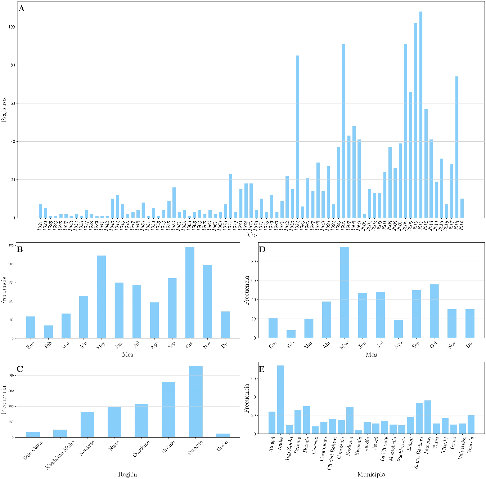
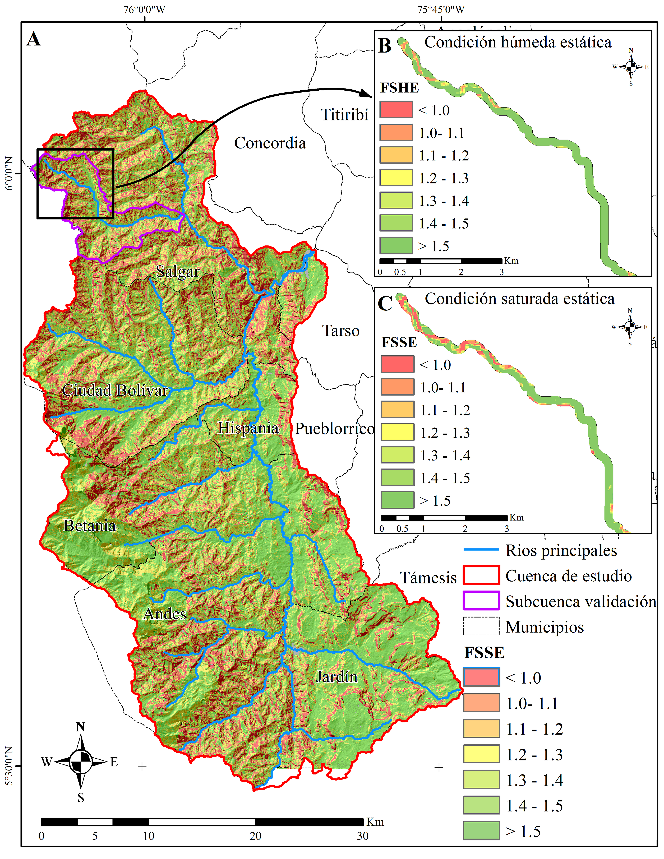
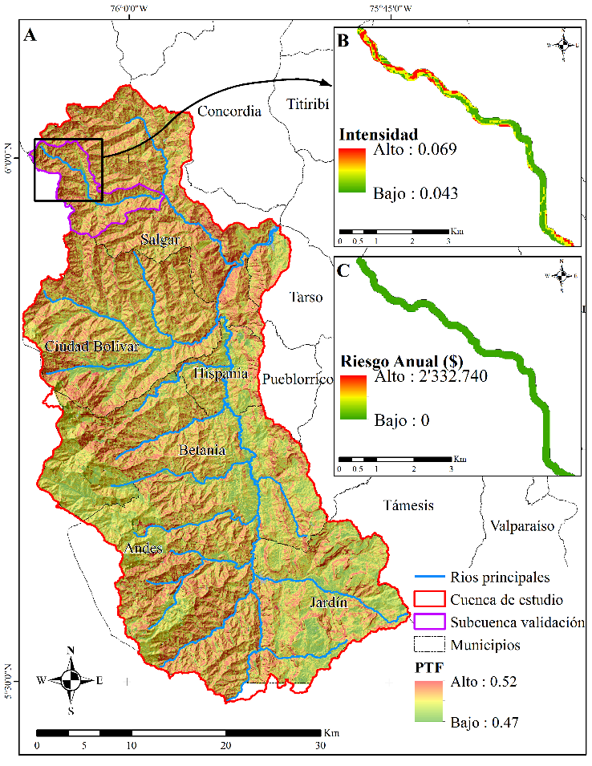
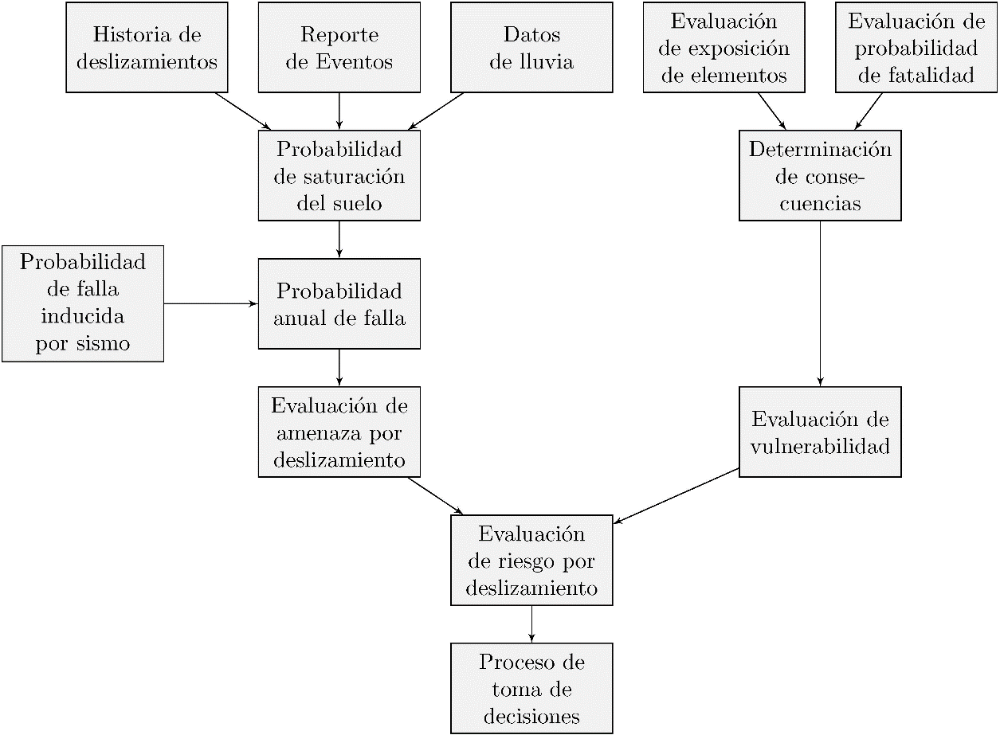
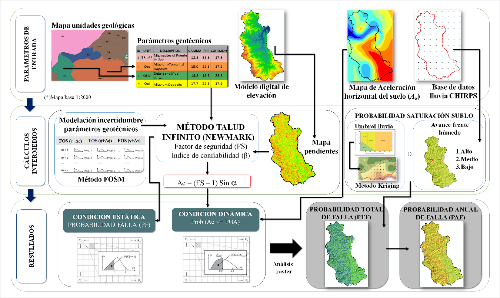
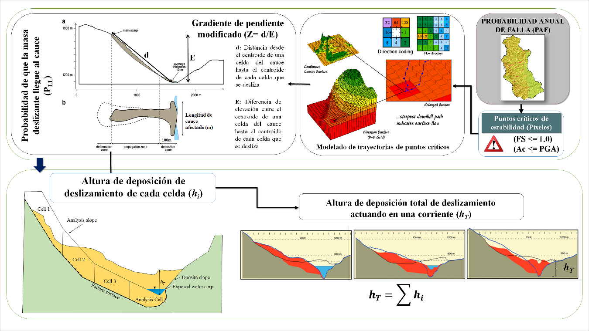
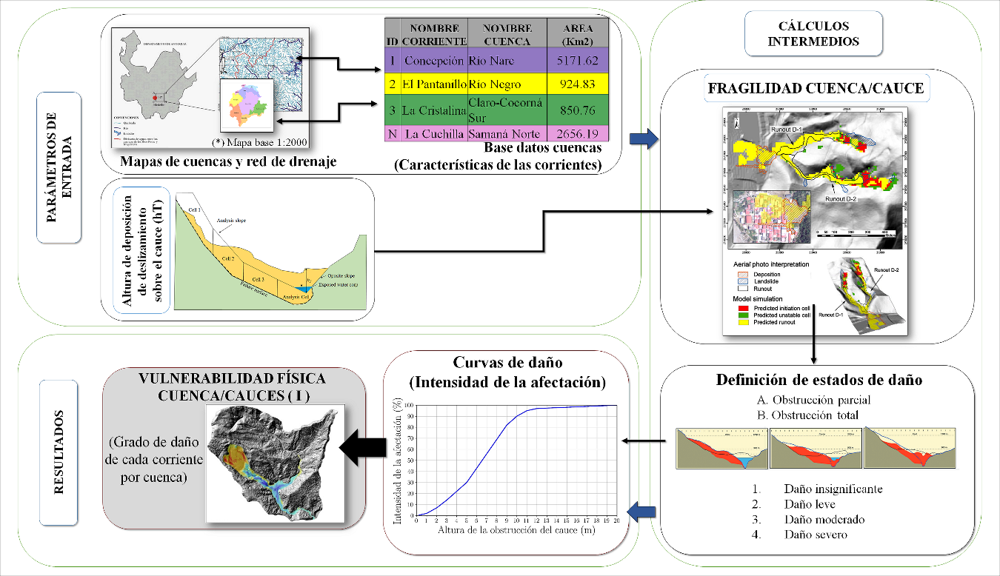
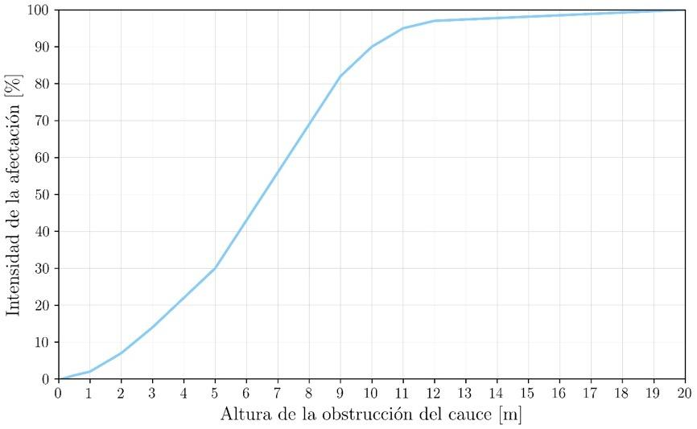

::: {#resumen}
## Resumen {.unnumbered}

Los movimientos en masa se consideran uno de los peligros naturales que causan mundialmente mayor cantidad de pérdidas. En países como Colombia, los movimientos en masa que causan el mayor número de muertes y pérdidas económicas se relacionan con avenidas torrenciales causadas por movimientos en masa en cuencas. Este capítulo presenta una metodología para evaluar el riesgo asociado con movimientos en masa en cuencas abastecedoras. La amenaza se evalúa considerando métodos probabilistas que incluyen los efectos de la lluvia y los sismos. Además, este estudio evalúa la probabilidad de que una masa deslizante llegue a los lechos de los ríos y la probabilidad de obstrucción en sus cauces. Por otro lado, la vulnerabilidad se estima utilizando curvas de daño basadas en la altura de obstrucción de los cauces. Finalmente, el riesgo se estima como la probabilidad de que ocurran pérdidas económicas a lo largo del lecho del río. Esta metodología se basa en métodos de probabilidad, como el método de primer orden segundo momento (FOSM) y el método de estimaciones puntuales (MEP), y se ha aplicado en la cuenca del río San Juan, en el suroeste Antioqueño, donde las condiciones morfodinámicas e hidrometeorológicas han generado desastres que han causado daños a la infraestructura y población con pérdidas económicas significativas. Los resultados evidencian alta coincidencia de zonas afectadas con movimientos en masa de acuerdo al inventario de eventos en la zona, con áreas de alta probabilidad de falla predichas por el modelo, indicando su coherencia para identificar zonas a estudiar con mayor detalle. En conclusión, las pérdidas directas estimadas en la cuenca de la zona de estudio, sin considerar edificaciones, serían del orden de $3,782 millones de pesos colombianos, valor que sirve de referencia para evaluaciones más detalladas y la toma de decisiones para la gestión del riesgo. 

**Palabras clave** 

Amenaza, deslizamientos, cuencas, movimientos en masa, riesgo, vulnerabilidad

**Landslide risk study in supplying hydrographic basins in the southwest of Antioquia using probabilistic methods**

:::

::: {#abstract}
## Abstract {.unnumbered}

Landslides are considered one of the natural hazards that cause the most significant losses worldwide. In countries such as Colombia, landslides events that cause the highest number of deaths and economic losses are related to flash floods or debris flow caused by landslides in basins. This chapter presents a methodology to assess the associated risk with landslides in water supply basins. The hazard is assessed considering probabilistic methods that include the effects of rainfall and earthquakes. Furthermore, this study assesses the probability of a sliding mass reaching riverbeds and the probability of obstructions in its channels. Besides, vulnerability is assessed using damage curves based on the obstruction height of the channel. Finally, the risk is estimated as the probability of the most likely economic losses occurring along the riverbed. This methodology is based on probability methods, such as the first-order second-moment method (FOSM) and the point estimate method (PEM). It was applied in the San Juan River basin, in the southwest of Antioquia, where morphodynamic and hydrometeorological conditions have generated several disasters that have caused damage to the infrastructure and its population with significant economic losses. The results show a high coincidence of affected areas with landslides according to the inventory of events in the study zone, with areas of a high probability of failure predicted by the model, indicating its coherence to identify areas to be studied with more detail. In conclusion, the estimated direct losses in the basins of the study area, without considering buildings, would be of the order of $ 3,782 millions of Colombian pesos, a reference value for more detailed assessments and decision-making for risk management.

**Keywords** 

Hazard, landslide, mass movement, risk, vulnerability, water supply basins

:::

## 10.1 INTRODUCCIÓN

Debido a los altos niveles de afectación de los movimientos en masa, a nivel mundial se ha generado una gran dinámica en el estudio de los fenómenos asociados en procura de entender los aspectos físicos [[1]](#ref-1)-[[6]](#ref-6) y económicos [[7]](#ref-7)-[[11]](#ref-11) relacionados con los movimientos en masa. En particular, se ha identificado la ocurrencia de procesos complejos en los cuales de movimientos en masa de suelo obstruyen corrientes de agua relativamente pequeños formando represamientos que al romperse generan avenidas torrenciales que terminan generando una gran afectación a las comunidades asentadas en las riberas y una gran afectación a la infraestructura.

El suroeste antioqueño, y en particular las cuencas de esta subregión, son frecuentemente afectadas por movimientos en masa, los cuales han causado numerosas pérdidas de vidas, heridos, damnificados y cuantiosas pérdidas económicas. Muchos de ellos asociados a cuencas hidrográficas abastecedoras de acueductos como el río Tapartó, la quebrada La Liboriana y el cerro Las Nubes, por citar algunos de los más emblemáticos. Una fuente abastecedora, se entiende como una corriente de agua que se utiliza para el suministro de agua potable, riego de cultivos o para actividades industriales. Entendiendo que la estimación y evaluación del riesgo por movimientos en masa y su afectación a las fuentes de abastecimiento de agua es un problema complejo, en el marco del proyecto Piragua de la Corporación Autónoma Regional del Centro de Antioquia-Corantioquia, la Universidad de Medellín ha desarrollado una metodología para la evaluación de riesgos por movimientos en masa en fuentes hídricas abastecedoras de agua potable.

En este capítulo se presenta la metodología aplicada a un caso de estudio en la cuenca del río San Juan. En primer lugar, se presenta una evaluación de la información disponible para la elaboración de un inventario de movimientos en masa (Fig. 1). Segundo, se presenta la evaluación de amenaza por movimientos en masa detonados por sismos y lluvia a escala regional, se presentan los materiales usados y los resultados obtenidos; por último, se presenta el análisis de riesgo, y finalmente se presentan conclusiones y recomendaciones para futuros trabajos.

**Tabla 1**. Se estima que los costos directos e indirectos de los movimientos en masa en pueden ser significativas en términos del producto interno bruto (PIB), incluso en países desarrollados [[16]](#ref-16).

| País | Pérdidas anuales (USD miles de millones | Pérdidas (% PIB) |
| --- | --- | --- |
| Estados Unidos | 2.1 - 4.3 | 0.01 - 0.03 |
| Japón | 3.0 | 0.06 |
| Italia | 3.9 | 0.19 |
| India | 2.0 | 0.11 |
| China | 1.0 | 0.01 |
| Alemania | 0.3 | 0.01 |

**Figura 1.** Pérdida de vidas (**A**) y daño a propiedades (**B**) por diversos fenómenos naturales en el Valle de Aburrá entre 1880–2007 (adaptado de [[19]](#ref-19)).

En recientes años, se han presentado varios movimientos en masa que han causado numerosas muertes y pérdidas económicas. La Tabla 2 muestra algunos movimientos en masa seleccionados por su gran impacto a nivel mundial y también en área en estudio. La mayoría de estos eventos ocurrieron en zonas de ocupación irregular; sin embargo, taludes en proyectos formales también han presentado problemas [[20]](#ref-20). 

**Tabla 2.** Algunas tragedias debidas a movimientos en masa (Modificado de [[15]](#ref-15)).

| Clasificación de los movimientos en masa | Fecha | Localización | Daños | Daños |
| --- | --- | --- | --- | --- |
| Clasificación de los movimientos en masa | Fecha | Localización | Muertes | Personas afectadas |
| Flujo de lodos | Feb. 4, 2005 | El Barro (Bello-Colombia) | 42 | 60 |
| Deslizamiento rotacional complejo | May 28, 2007 | La Cruz (Medellín-Colombia) | 8 | > 60 |
| Flujo de escombros | May 31, 2008 | El Socorro (Medellín-Colombia) | 27 | > 60 |
| Deslizamiento | Nov. 16, 2008 | Alto Verde (Medellín-Colombia) | 12 | > 12 |
| Deslizamiento | Dic. 5, 2010 | La Gabriela (Bello-Colombia) | 85 | > 130 |
| Deslizamiento | Mar 22, 2014 | Oso (USA) | 43 | > 100 |
| Deslizamiento | Oct 29, 2014 | Badulla (Sri Lanka) | 22 | > 300 |
| Deslizamiento | May 28, 2015 | Salvador (Brasil) | 14 | - |
| Deslizamiento | Oct 2, 2015 | El Cambray II (Guatemala) | 280 | > 200 |
| Deslizamiento | Abr 23, 2015 | Badakhshan(Afganistán) | 52 | > 100 |
| Avenida torrencial | Mar 31, 2017 | Mocoa (Colombia) | 300 | > 1000 |
| Avenida torrencial | May 18, 2015 | Salgar (Colombia) | 104 | 542 |
| Deslizamiento | Oct 26, 2016 | Cabuyal, Copacabana | 16 | - |
| Avenida torrencial | Abr 26, 1993 | Tapartó (Andes-Colombia) | 92 | - |

El control de estos eventos es una prioridad para las autoridades alrededor del mundo. Sin embargo, la ausencia de una delimitación racional y clara de las zonas susceptibles a movimientos en masa resulta en la ocupación de zonas inadecuadas creando escenarios de alto riesgo para la vida y pérdidas materiales [[13]](#ref-13), [[16]](#ref-16), [[21]](#ref-21). En este contexto, surge la necesidad de adaptar o desarrollar nuevas metodologías para entender mejor las condiciones que causan los movimientos en masa en zonas montañosas y crear herramientas de planeación que permitan un mejor manejo de los procesos de ocupación de laderas. 

En Colombia, los movimientos en masa, al igual que las inundaciones, constituyen los fenómenos naturales que traen consigo los riesgos más severos para la sociedad, lo cual se debe principalmente a sus diversas y variadas características geográficas y fisiográficas, siendo detonados por factores tanto naturales como antrópicos. Como caso particular de esto, las condiciones de la zona montañosa de la ciudad de Medellín y los municipios vecinos, en cuanto a relieve, clima, topografía, geología, entre otros, hacen a la región susceptible para la ocurrencia de procesos morfodinámicos, que pueden afectar tanto a la población como a su infraestructura [[10]](#ref-10).

De acuerdo con la información del Servicio Geológico Colombiano, en Colombia para el periodo 1970–2011, excluyendo las pérdidas asociadas a la erupción del Volcán Nevado del Ruiz en 1985, los mayores porcentajes de pérdidas de vidas y de viviendas destruidas correspondieron a los movimientos en masa y a las inundaciones, respectivamente; a los primeros se les atribuye la destrucción del 10% de las viviendas y el 36% de las pérdidas de vidas, en tanto que las inundaciones destruyeron el 43% de las casas y ocasionaron el 10% de las muertes [[22]](#ref-22). Igualmente, entre 1900 y 2015 en Colombia se han reportado 16,969 movimientos en masa. Debido a estos, 5,119 personas han perdido la vida y 548,810 familias se han visto afectadas; el departamento de Antioquia cuenta con el mayor número de registros (5,495), seguido por Cundinamarca (1,552) y Cauca (1,280). Los departamentos con mayor número de personas y familias afectadas han sido Caldas, Caquetá, Tolima, Antioquia, Bolívar, Boyacá, Cauca, Cesar, Cundinamarca, Huila, Meta, Nariño, Norte de Santander, Putumayo, Quindío y Santander [[23]](#ref-23). 

En general, los movimientos en masa pueden ser originados por la conjugación de diversos factores detonantes como sismos o lluvia, y se constituyen en una causa frecuente de desastres alrededor del mundo [[24]](#ref-24). Específicamente en el Valle de Aburrá (VA), subregión político administrativa ubicada en el centro-sur del departamento de Antioquia y que reúne a diez municipios conurbados (Barbosa, Girardota, Copacabana, Bello, Itagüí, Sabaneta, Envigado, La Estrella, Medellín y Caldas), los movimientos en masa han causado considerables pérdidas económicas y humanas. Debido a la ocupación de las laderas por asentamientos humanos y por obras de infraestructura, los riesgos asociados a los movimientos en masase han incrementado en los últimos años. Se estima que en el VA el 35% de los daños a edificaciones y 74% de las muertes debidas a fenómenos naturales se asocian con movimientos en masa [[19]](#ref-19), mientras que a nivel mundial, se les atribuye a tales movimientos el 14% de las pérdidas económicas y el 0.53% de las muertes debidas a desastres por fenómenos naturales [[18]](#ref-18).

En el Plan Departamental para La Gestión del Riesgo de Desastres de Antioquia (PDGRA) [[25]](#ref-25), se advierte de falencias en la disponibilidad y calidad de las fuentes de información para la verificación de los antecedentes históricos en el departamento, y que se hace necesario desarrollar una plataforma, que pueda ser alimentada de manera ágil y oportuna y poder así obtener registros confiables, que permitan una adecuada toma de decisiones. También se advertía la importancia de que las fichas se completen en su totalidad en campos específicos como el de pérdidas económicas y causas del desastre. Igualmente, se llamaba la atención respecto a la necesidad de que los municipios registren los llamados “pequeños desastres”, que muchas veces son ignorados, porque no superan la capacidad de respuesta y sus efectos no son de consideración a escala departamental, pero que sumados pueden llegar a generar pérdidas tan o más significativas que las que causan los grandes desastres. A partir de estos resultados se realizó un análisis por cada región encontrando que las de mayor afectación por movimientos en masa son el suroeste y la del Oriente. Respecto a la región del suroeste, se indica que históricamente los eventos de origen hidrometeorológico han tenido gran significancia en esta zona por tratarse de municipios ubicados en la vertiente oriental de la cordillera occidental en laderas de alta pendiente, lo que los hace altamente susceptibles a sufrir daño por fenómenos como movimientos en masa. En el periodo 1894–2014 se registraron 391 movimientos en masa y los municipios que registraron mayor ocurrencia de este evento fueron: Andes, Támesis, Santa Bárbara, Betania, Betulia, Fredonia, Ciudad Bolívar y Salgar.

En el informe final del estudio de Actualización de la Línea Base de Gestión del Riesgo y Mapa de Susceptibilidad al Cambio Climático 2014–2015 en la Jurisdicción de Corantioquia [[26]](#ref-26), se reporta un total de 322 movimientos en masa en la jurisdicción de Corantioquia, cada uno con su respectiva localización, pero no se reporta la fecha de ocurrencia. De acuerdo con este trabajo, y como se observa en las zonas que presentan una mayor recurrencia de movimientos en masa es el suroeste con 109 reportes, el Valle de Aburra con 68 y el Norte con 56. Los movimientos en masa de este informe se obtuvieron a partir de reportes directos de los municipios. 

Para ampliar la información y obtener un análisis más concluyente sobre la ocurrencia de movimientos en masa en el suroeste Antioqueño, se recurrió a los reportes del sistema Desinventar hasta el año 2019. De acuerdo con los datos que para Antioquia se encuentran en Desinventar (Fig. 2A), los movimientos en masa se presentan con mayor frecuencia en los trimestres mayo-junio-julio y septiembre-octubre-noviembre como se observa en la Figura 2B. En total se tienen 1,566 registros, los cuales muestran que las zonas con mayor ocurrencia son la zona del suroeste (462 registros) y la del oriente (358 registros) como se aprecia en la Figura 2C. Los 462 registros de la región de suroeste cubren un periodo desde 1921 hasta 2019 como se muestra en la Figura 2A y al igual que para el departamento de Antioquia en general, para la región del suroeste también se observa que los movimientos en masa son más frecuentes en los trimestres mayo-junio-julio y septiembre-octubre-noviembre como se observa en la Figura 2D.  El municipio del Suroeste que presenta el mayor número de reportes de eventos es Andes como se observa en la Figura 2E.

**Figura 2**. Registros de movimientos en masa para el departamento de Antioquia (Desinventar) (**A**). Distribución mensual de los movimientos en masa en Antioquia (**B**). Distribución de movimientos en masa en Antioquia por regiones (excluyendo el Valle de Aburrá) (**C**). Distribución mensual de movimientos en masa en el Suroeste (**D**). Movimientos en masa por municipios del Suroeste (**E**).

## 10.2 RESULTADOS DE LOS MODELOS DE ESTIMACIÓN

### 10.2.1 Amenaza

Se aplicó la metodología mostrada en la Figura  6 y descrita en la Sección 6, para calcular la probabilidad de falla, considerando que la superficie de falla se presenta a una profundidad media de *H* = 2 m, con coeficiente de variación de 25%, para simular un deslizamiento superficial, que corresponde al tipo característico de movimiento en masa en terrenos montañosos tropicales como la zona de estudio, los cuales suelen inducirse por lluvias de alta intensidad o larga duración principalmente. Los coeficientes de variación empleados para los demás parámetros corresponden a 5% para el peso específico del suelo, 10% para el ángulo de fricción interna, 30% para la cohesión, y finalmente, 50% para el coeficiente de aceleración horizontal de sismo. La lluvia usada para la evaluación de la probabilidad de saturación del suelo y la probabilidad anual de falla del terreno, tiene un periodo de retorno de 20 años.

::: {#box1 .callout-important style="background-color: #e3f0fbff; padding:20px; border: none !important;" appearance="minimal" icon="false"}
**Caja 1.** Teoría del equilibro límite   Los movimientos en masa superficiales en las laderas boscosas generalmente involucran horizontes superficiales del suelo y pueden modelarse como un volumen rígido de tierra delgada que se desliza sobre una superficie de corte plana. Por lo tanto, la estabilidad de la pendiente puede evaluarse esquemáticamente aplicando la teoría del equilibrio límite. Esto significa que se establece una relación entre la resistencia al corte de un material disponible para resistir la falla y alguna condición de las fuerzas de corte que están presentes para causar la falla.  La teoría de la falla de Mohr-Coulomb establece que, si bien la falla es esencialmente por corte, el esfuerzo crítico de corte es una función del esfuerzo normal como una combinación de la cohesión y la resistencia a la fricción que actúa sobre una superficie potencial de falla.  Esta relación se expresa comúnmente en la forma de un "Factor de seguridad (FS)", un indicador global que permite medir el grado de estabilidad del terreno. El factor se expresa por la relación de la resistencia al cizallamiento del suelo (fuerzas estabilizadoras que actúan sobre el terreno) con respecto las solicitaciones que tienden al movimiento (fuerzas desestabilizadoras). La naturaleza de la relación definitoria de los cálculos del FS significan que las situaciones inestables se representan por un número entre 0 y 1, mientras que las consideraciones estables se representan por un número entre 1 e infinito. Este indicador de estabilidad de la pendiente se representa mediante la siguiente ecuación:  Dónde: Ah es la aceleración horizontal del suelo dada como fracción de la gravedad g, H es el espesor de la zona de falla [m], Hw es la altura medida desde el nivel freático hasta la superficie de agua [m], c es la cohesión del suelo [kPa], φ es el ángulo de fricción interna del suelo [°], γ  es el peso unitario del suelo en condición húmeda [kN/m3], y γw es el peso unitario del agua [kN/m3]. En este estudio, el factor de seguridad se evalúa en dos condiciones de saturación del suelo (húmedo y saturado) bajo dos escenarios (estático y sísmico), obteniendo así, el factor de seguridad húmedo estático (FSHE), saturado estático (FSSE), húmedo sísmico (FSHS) y saturado sísmico (FSSS).
:::

En el proceso de estimación de la amenaza, se calculan los factores de seguridad considerando dos escenarios de condiciones de humedad del suelo. El primer caso, corresponde a un escenario estático, es decir, sin la inclusión de un detonante del movimiento en masa por condición sísmica. El segundo caso, corresponde a un escenario que considera la inclusión de un movimiento sísmico, por medio de un coeficiente de aceleración horizontal del suelo (*A**h*) de 0.2 *g*. Ambos casos fueron evaluados para condiciones de humedad natural del suelo (*H**w **= 0*) y una eventual condición de saturación total por efecto de la lluvia (*H**w **= H*). En la Figura  se presentan los resultados de factores de seguridad en condición saturada estática y en la Figura 4A la probabilidad de total de falla (*PTF*).

**Figura 3.** Resultados del factor de seguridad (*FS*) en condición saturada estática para la cuenca del río San Juan (**A**). Se hace un zoom sobre la quebrada La Liboriana para presentar y detallar los resultados del factor de seguridad en condición húmeda estática (*FSHE*) (**B**) y en condición saturada estática (*FSSE*) (**C**).

### 10.2.2 Vulnerabilidad

Se realizó el análisis de vulnerabilidad física calculando para esto la intensidad de acuerdo con las Ecuaciones 6 y 7. Analizando la intensidad de afectación de los cauces en una zona de 100 m a lado y lado de los mismos, se obtiene un valor promedio de 0.052 (grado de afectación del 5.2%) en las corrientes principales de la zona de estudio. Como ejemplo, en la Figura 4B se muestran los resultados de vulnerabilidad obtenidos para la quebrada La Liboriana.

3.3 Riesgo

Usando el procedimiento descrito en la Sección 6 e ilustrado en la Figura , se estimó el riesgo en los cauces en una zona de 100 m a cada lado. Se realizó el análisis de riesgo calculando las perdidas probables de acuerdo con las ecuaciones 9 y 10. Como ejemplo, en la Figura se muestran los resultados de pérdidas estimadas obtenidos para la quebrada La Liboriana.

**Figura 4.** Resultados de probabilidad total de falla en la cuenca del río San Juan (**A**). Vulnerabilidad (en término de “Intensidad”) en una zona de influencia de 100 m a cada lado de la quebrada La Liboriana (**B**). Riesgo anual ($) en una zona de influencia de 100 m a cada lado de la quebrada La Liboriana (**C**).

## 10.3 DISCUSIÓN

### 10.3.1 Factor de seguridad

Se consideraron como zonas críticas de estabilidad, aquellas celdas con un valor de factor de seguridad (*FS)* < 1.1, obteniendo los resultados mostrados en la Tabla .

**Tabla 3.** Comparativo celdas críticas de estabilidad del terreno en la cuenca de estudio.

| Escenario/Condición suelo | Área (km2) | Área total de la cuenca  San Juan (%) |
| --- | --- | --- |
| Estático/Húmedo | 6.1 | 0.4 |
| Estático/Saturado | 221.6 | 15.8 |
| Dinámico/Húmedo | 118.9 | 8.5 |
| Dinámico /Saturado | 815.9 | 58.2 |

En ambos escenarios se aprecia un incremento notable las áreas inestables en la eventual condición de saturación del suelo, puesto que la presencia de agua en la masa de suelo tiene un efecto negativo en la estabilidad dado que ésta reduce el esfuerzo cortante, disminuye la cohesión e incrementa la presión de poros, facilitando un potencial movimiento en masa.

También es muy claro el efecto inducido por un sismo, dado que, con respecto a las condiciones más adversas de ambos escenarios, se puede deducir un incremento de las zonas inestables dentro de la cuenca, de aproximadamente un 40%.

Para evaluar la capacidad de predicción del modelo de evaluación de amenaza por movimientos en masa propuesto, se seleccionó una subcuenca de validación (quebrada La Liboriana) en el municipio de Salgar, dado que se encuentra bien documentada a raíz de la tragedia ocurrida en mayo de 2015, donde decenas movimientos en masa fueron desencadenados por lluvia, con su consecuente avenida torrencial y flujo de lodos y escombros, causando centenares de muertes y una pérdida económica considerable. Para el proceso de validación, se usó un inventario de movimientos en masa en la cuenca de La Liboriana levantado y documentado en Ruiz-Vásquez & Aristizábal [[28]](#ref-28), el cual fue generado a partir de un análisis multi-temporal de imágenes de satélite y fotografías aéreas, obteniendo un área de movimientos en masa en la zona que cubre aproximadamente 0.6 km2 correspondiente al 1% de la cuenca.

En primera instancia, se realizó una correlación espacial de los movimientos en masa documentados y georreferenciados en la zona de estudio con respecto a los resultados obtenidos, encontrando que en aproximadamente el 74% de los polígonos del inventario de movimientos en masa usado como referencia, se detectaron zonas de inestabilidad (Factor de seguridad saturado estático *FSSE* < 1.1, de acuerdo al valor umbral propuesto en [[23]](#ref-23), clasificado como amenaza alta) con el modelo propuesto, lo cual indica una buena aproximación en la evaluación de este complejo fenómeno. Así mismo, en un 17% de los polígonos restantes del inventario, se encontraron valores promedio de *FSSE* entre 1.1 y 1.25, y que cuyo límite superior corresponde al umbral establecido por la norma sismo resistente colombiana (NSR-10) para taludes en condición de agua subterránea normal para la etapa de construcción, indicando zonas potenciales de inestabilidad ante un cambio moderado en las condiciones de saturación del suelo por efecto de las lluvias. Igualmente, el valor de 1.25 es considerado como un indicador de amenaza media para estudios de amenaza y riesgo por movimientos en masa [[23]](#ref-23). Un 5% de polígonos del inventario presentan un *FSSE* promedio entre 1.25 y 1.5, cuyo valor superior corresponde al umbral de diseño de taludes según NSR-10, lo cual se considera como amenaza baja [[23]](#ref-23). El porcentaje restante, supera el valor umbral de *FSSE* de 1.5, lo cual se considera como de amenaza baja. Sólo en un 4% de los polígonos del inventario de los movimientos en masa, se presentan valores de *FSSE* superiores a 1.5.

Con el fin de establecer un proceso de validación de mayor robustez cuantitativa en torno a la capacidad predictiva del modelo propuesto, se efectuó un análisis ROC (Receiver Operating Characteristic, por su sigla en inglés), el cual es un método de evaluación del desempeño de un modelo para predecir valores clasificados [[29]](#ref-29), el cual permite explicar que tan bien el modelo y las variables involucradas predicen un evento [[30]](#ref-30), en este caso, una potencial zona inestable conducente a un movimiento en masa. Si bien este método es comúnmente aplicado a la validación de modelos estadísticos de susceptibilidad de movimientos en masa, también puede ser aplicado para la validación de modelos físicamente basados [[31]](#ref-31) como el propuesto en este capítulo, mediante el uso de un valor umbral en el indicador de estabilidad usado (en este contexto corresponde al *FSSE*), cuyo valor umbral para indicar una condición de inestabilidad del terreno corresponde a un valor inferior a 1.1 [[23]](#ref-23).

Se usó el análisis ROC para determinar la confiabilidad de los valores predichos de estabilidad, usando los resultados obtenidos del *FSSE* como indicador de estabilidad del terreno bajo condiciones de saturación del suelo. Para ello, cada celda de los mapas de factor de seguridad se categorizó en una de las cuatro categorías de interpretación posibles, las cuales corresponden a la denominada matriz de confusión o tabla de contingencia: [[1]](#ref-1) Verdadero positivo (true positive, *TP*), que representa celdas con un valor de *FSSE* inferior a 1.1 (inestables de acuerdo al modelo físico) y que fueron correctamente predichas como inestables dado que en el inventario se clasifican como “movimiento en masa”; [[2]](#ref-2) Verdadero negativo (true negative, *TN*), que representa celdas con valor de *FSSE* superior a 1.1 (estables según el modelo físico) y correctamente predicha como estable en el inventario (no movimiento en masa); [[3]](#ref-3) Falso positivo (false positive, *FP*), que representa aquellas celdas con valores de *FSSE* inferior a 1.1 (inestables) y representan falsas predicciones de inestabilidad dado que no aparecen reportadas en el inventario de movimientos en masa; [[4]](#ref-4) Falso negativo (false negative, *FN*), que representa aquellas celdas consideras estables por el modelo físico (*FSSE* superior a 1.1) pero que aparecen reportadas en el inventario como zonas con un movimiento en masa ocurrido, y por tanto no fueron correctamente predichas inestables por el modelo físico.

Para el análisis ROC, se calculó la tasa de aciertos (hit rate o true positive rate, *TPR*), que corresponde a una cuantificación de las celdas correctamente clasificadas como inestables respecto al total de casos positivos (clasificados como movimientos en masa) en el inventario. Así mismo, se calculó la tasa de falsa alarma (false positive rate, *FPR*), que corresponde a una cuantificación de las celdas incorrectamente clasificadas como inestables respecto al total de casos negativos (clasificados como no movimientos en masa) en el inventario. De acuerdo al valor umbral de *FSSE* adoptado, se obtuvo un *TPR* de 54% y un *FPR* de 39%, que ubica este punto en la parte central izquierda de la gráfica ROC. Según [[29]](#ref-29), los resultados que aparecen tienden hacia el lado inferior izquierdo (por encima de la diagonal principal) de un gráfico ROC pueden considerarse "conservadores", es decir que corresponden a clasificaciones positivas solo con evidencia sólida, con sus consecuentes pocos errores falsos positivos y bajas tasas verdaderas positivas. 

Adicionalmente, el área bajo la curva ROC (area under curve, AUC) se puede usar como una métrica para cuantificar el rendimiento general de un modelo, de modo que cuanto mayor sea esta área, mejor será el rendimiento del mismo. Para clasificar la precisión, se consideró la clasificación propuesta por Hosmer y Lemeshow, citada por [[32]](#ref-32): 0.9 –1.0 (excelente), 0.8 – 0.9 (bueno), 0.7 – 0.8 (regular), 0.6 – 0.7 (pobre), y 0.5 – 0.6 (falla). El área bajo la curva ROC obtenida para el umbral *FSSE* usado es de 0.61, lo que significa que la tasa de éxito general de la evaluación de amenaza por movimientos en masa con el modelo propuesto es del 61%, de manera que el rendimiento del modelo se considera pobre ya que se acerca a una predicción que tiende a la aleatoriedad [[33]](#ref-33), y valores cercanos a 0.5 reflejan modelos neutrales [[34]](#ref-34). En este contexto es pertinente considerar que la incertidumbre de varios parámetros involucrados durante el proceso de cálculo del factor de seguridad, tienen una alta incidencia en la tasa de éxito predictivo del modelo físico propuesto, más aún cuando varios de los parámetros involucrados se obtuvieron de información secundaria.

Es importante destacar que tanto en el enfoque de validación por correlación espacial efectuado inicialmente como en el análisis de área bajo la curva ROC, se obtuvo un resultado promedio del orden de 68% de correspondencia para un valor umbral de *FSSE* de 1.1, que quizá en las condiciones de alta variabilidad espacial de los parámetros geomecánicos, no sea el valor umbral más apropiado para determinar rigurosamente la estabilidad del terreno. En este sentido, y para analizar la sensibilidad de este valor umbral, se recalcularon las tasas ROC para un umbral de *FSSE* < 1.25, valor referenciado por la norma NSR-10 para taludes en condiciones de saturación normal del suelo por efecto de las lluvias, obteniendo un *TPR* de 75% y un *FPR* de 58%, lo refleja un incremento en la capacidad de predicción del modelo propuesto.

### 10.3.2 Probabilidad de falla

Se calculó la probabilidad de falla (PF) considerando las dos metodologías de evaluación de la probabilidad de saturación del suelo (*P**s*), es decir, mediante el establecimiento de umbrales de lluvia a partir de los registros de la base datos de lluvia censados a partir de satélite CHIRPS, y mediante la evaluación del avance del frente húmedo a partir curvas de saturación del suelo. 

De acuerdo con los resultados obtenidos para la probabilidad de saturación del suelo, según la metodología de umbral de lluvia se obtuvieron valores interpolados por el método de Kriging, que oscilan entre 36% y 75%, mientras que, según la metodología del avance del frente húmedo, se obtuvieron valores discretos del 83% y 93% según el tipo de suelo generado en función de las unidades geológicas de la zona de estudio. Sin embargo, es preciso destacar que, pese a las variaciones en los resultados de la *P**s* del suelo, los valores de probabilidad total de falla (*PTF*) obtenidos por ambas metodologías presentan un 99.96% de correlación.

Vale resaltar que, tanto las zonas de *FSSE* < 1.1 como de *PTF* > 50%, se presentan en mayor porcentaje en zonas de fuertes pendientes (> 30°) en zonas de cobertura vegetal tipo bosque de alta montaña, aproximadamente en el 4% del área de la cuenca de estudio, y en una combinación de zonas de pastos y cultivos con fuertes pendientes, que cubren más del 7%.

En cuanto a la probabilidad anual de falla (*PAF*), usando una lluvia detonante de los movimientos en masa con periodo de retorno de 20 años, se encontró que la cuenca de estudio presenta una amenaza alta según la clasificación establecida por Chowdhury et al., [[18]](#ref-18), con valores que oscilan entre 2.3 y 2.8%, cuyos valores altos predominan en los municipios de Salgar, Ciudad Bolívar y Andes.

Usando los datos del inventario de movimientos en masa para la subcuenca de validación, se encuentra que los polígonos del inventario presentan un valor promedio de *PAF* de 2.5% (Alta) que presenta correspondencia con las zonas de inestabilidad encontradas con el indicador de estabilidad *FSSE*. De acuerdo a las directrices dadas por el Servicio Geológico Colombiano [[23]](#ref-23) para el territorio nacional, la clasificación de la amenaza en función de la probabilidad de falla anual queda definida en la categoría “media”. 

De acuerdo con los resultados obtenidos con relación a las zonas críticas de estabilidad, el municipio de Andes presenta una alta ocurrencia de movimientos en masa en condición de saturación del suelo, lo cual es habitual en temporada de invierno. Esto se ve reflejado también, en la frecuencia de eventos geodinámicos registrados en la base de datos Desinventar, donde este municipio presenta el pico más alto de desastres registrados hasta el año 2019 (Fig. 2E). Sin embargo, los eventos registrados en esta base de datos para municipios como Salgar y Ciudad Bolívar con gran porcentaje de su área en condición de inestabilidad, no reflejan las cifras reportadas, lo cual no necesariamente implica falta de correlación con el modelo propuesto, dado que no en todos los municipios se mantiene actualizado el inventario desastres y hay eventos ocurridos que no se reportaron.

A continuación, en la Tabla  se presenta el análisis de resultados de la amenaza por municipios en la cuenca de estudio, y se hace énfasis en aquellas zonas consideradas como críticas por presentar niveles de potencial afectación altos.

**Tabla 4.** Resultados de la amenaza por municipios en la cuenca de estudio.

| Municipio | Probabilidad anual de falla [[18]](#ref-18) | Zonas críticas por inestabilidad de taludes |
| --- | --- | --- |
| Ciudad Bolívar | El municipio presenta una PAF promedio de 0.024974 (Alta) | ZONA 1. Corresponde a la cuenca de la quebrada La Linda entre las veredas La Linda, Ciudad Bolívar y Cabecera, la cual hace parte de la sub-cuenca del río Bolívar. La zona sugerida para seguimiento corresponde a la parte alta y media del cauce de la quebrada La Linda. Entre la infraestructura expuesta en esta zona se destaca la cabecera municipal (con toda su infraestructura) y algunos puentes a las afueras de la cabecera.  ZONA 2. Corresponde a la zona alta de la cuenca del río Farallones, en la vereda San Bernardo de Los Farallones. La zona de seguimiento corresponde a las confluencias de La quebrada Sucre, Colecaballo y San José con el río Farallones. En esta zona, existe la presencia de varias edificaciones.    ZONA 3. Corresponde a parte de la cuenca del río Bolívar, veredas San Miguel y Remolino. La zona de seguimiento corresponde a una franja de terreno desde la quebrada La Soledad hasta la confluencia del río Bolívar con el río San Juan. Cerca de esta zona (aproximadamente unos kilómetros, se puede encontrar un sistema de cable de transporte). Se destaca la presencia de varias edificaciones a lo largo de la zona. |
| Salgar | El municipio presenta una PAF promedio de 0.025044 (Alta). | ZONA 1. Corresponde a la cuenca del río Barroso, parte alta de la quebrada La Liboriana, que se ubica en la vereda La Liboriana. Específicamente, corresponde a la parte alta de la quebrada La Liboriana y llega hasta las cercanías con la vereda Las Margaritas. En esta vereda se encuentra un centro poblado importante, cercano a la cabecera municipal ubicada aguas abajo de esta zona entre las veredas Montañita y Montebello Abajo.  ZONA 2. Corresponde a la cuenca del río Barroso, parte alta de éste río. Ubicado entre las veredas El León, Las Andes y La Clara Arriba. Se destaca la presencia de varias edificaciones.  ZONA 3. Corresponde a la cuenca del río Barroso, parte alta de éste río, específicamente en la confluencia con el Río San Juan. Ubicado entre las veredas El Junco, La Siberia, y La Chuchita. |
| Hispania | El municipio presenta una PAF promedio de 0.024831 (Alta). | ZONA 1. Corresponde a la cuenca del río Pedral entre las veredas Cortaderal, Potrerillo, La Palmira y la Cabecera Municipal. Corresponde a una zona demarcada por una franja al lado del río Pedral hasta la cabecera del municipio.  ZONA 2. Corresponde a parte de la cuenca del río San Juan, específicamente en la zona norte del municipio, entre la desembocadura del río Pedral con el río San Juan hasta la confluencia de la quebrada La Tirana, con esta gran corriente, en la vereda Zarzagueta. |
| Betania | El municipio presenta una PAF promedio de 0.024871 (Alta). | ZONA 1. Corresponde a una zona en la cuenca del río Pedral, entre las veredas Pedral Arriba, Las Mercedes, Pedral Abajo y El Tablazo. Se aprecian varias edificaciones de vivienda en la zona.  ZONA 2. Corresponde a una zona en las veredas de Guadalejo y Las Ánimas, cuenca del río Guadalejo. Corresponde en parte a una franja al margen de la quebrada Angosturas (El Carmelo) que se extiende hasta la quebrada La Libia. De ahí continúa siguiendo la quebrada El Carmelo extendiéndose hasta el municipio de Hispania. Se aprecia una hacienda dentro de la zona propensa a movimientos en masa.  ZONA 3. Corresponde a la parte alta de la cuenca del río Guadalejo, vereda Bellavista, Santa Ana y La Florida. Corresponde a una faja del río hasta cercanías con la cabecera municipal, cerca de la confluencia con la quebrada La Sucia. |
| Andes | El municipio presenta una PAF promedio de 0.024920 (Alta). | ZONA 1. Corresponde a una zona al margen derecho del río Tapartó desde la quebrada La Zarca del municipio de Betania hasta la quebrada Cementio. Compromete algunas zonas de las veredas La Rochela y La Siria, que se encuentra al borde del rio. Se aprecia expuesta la infraestructura de Tapartó como la Inspección Departamental de Policía, el SENA y gran cantidad de viviendas.  ZONA 2. Corresponde a la zona media de la cuenca del río La Chaparrala, en la vereda La Piedra. Corresponde a una franja de terreno siguiendo la quebrada El Silencio que luego se pasa a llamar La Chaparrala hasta la quebrada Santa Teresa.   ZONA 3. Margen derecho del río La Chaparrala en la vereda El Chispero.  ZONA 4. Sub-cuenca Río San Agustín hasta su confluencia con el río Santa Rita, a ambos lados del río.  ZONA 5. Sub-cuenca río Santa Rita, sobre ambos lados del río en toda su extensión, hasta su desembocadura con el río San Agustín, desde la reserva forestal en la parte alta de la cuenca hasta la vereda San Agustín.  ZONA 6. Confluencia río Santa Rita con la quebrada El Silencio.  ZONA 7. Sub-cuenca de la quebrada Santa Bárbara, a lo largo de la corriente hasta su desembocadura con el río San Juan, entre las veredas Santa Isabel, La Borraja, Las Flores, El Crucero, San Julián y San Antonio. En la zona aledaña a la parte central de la corriente existe aglomeración de edificaciones. |
| Jardín | El municipio presenta una PAF promedio de 0.024795 (Alta). | ZONA 1. Desembocadura del rio Dojurgo con el río San Juan a ambos lados del río en la vereda Macanas. Así mismo, en la parte media de esta corriente (llamada a esta altura quebrada Los Chorros) en ambos lados de la corriente.  ZONA 2. Zona de confluencia de las quebradas La Bonita (más adelante Volcanes), La Soñadora y San Rafael, en la vereda quebrada Bonita.  ZONA 3. Cercanías a la cabecera municipal, al margen izquierdo de la quebrada Volcanes, en la vereda Serranías. |
| Tarso | El municipio presenta una PAF promedio de 0.024957 (Alta). | ZONA 1. Corresponde a parte de la cuenca del río San Juan, al margen derecho del río, entre las veredas La Herradura y San Francisco. |
| Pueblorrico | El municipio presenta una PAF promedio de 0.025107 (Alta). | ZONA 1. Corresponde a parte de la cuenca del río San Juan, al margen derecho del río, entre las desembocaduras del río Bolívar y el río Barroso con el río San Juan, jurisdicción de la vereda Hoyo Grande. |

### 10.3.3 Vulnerabilidad

Aplicando el procedimiento descrito en el Capítulo 6.2, se estimó la vulnerabilidad de la quebrada. Los valores más altos de vulnerabilidad (> 0.06) corresponden a zonas escarpadas de alta montaña con pendientes que superan los 30° en las riberas de los cauces, los cuales se presentan generalmente en la parte alta de las sub cuencas que conforman la cuenca del río San Juan. Esto implica que la masa deslizante proveniente de un movimiento en masa puede generar una mayor obstrucción en los cauces debido a la geomorfología encañonada de las corrientes de agua en estas zonas. 

De acuerdo a los resultados obtenidos, se debe prestar especial atención en la parte alta de las quebradas La Liboriana y el río Barroso en el municipio de Salgar; Santa Rosa, La Linda y Sucre en el Municipio de Ciudad Bolívar; quebrada San Antonio, Guadalejo y río Pedral en el municipio de Betania; quebradas Santa Rita, El Silencio, Santa Bárbara, ríos Chaparrala y San Agustín en el municipio de Andes; parte baja del río Dojurgo en el municipio de Jardín, y del río San Juan en la jurisdicción de los municipio de Salgar, Ciudad Bolívar y Pueblorrico.

### 10.3.4 Riesgo

Con respecto al riesgo anual asociado a un periodo de retorno de 20 años para la lluvia detonante de los movimientos en masa, se obtiene un valor promedio de $58,990 y un valor total de $3,782,883,043 en potenciales pérdidas económicas directas por efecto de obstrucciones de los principales cauces de la cuenca de estudio. A esto, se le debe tener en cuenta adicionalmente, los costos indirectos y el impacto social generado por los potenciales desabastecimientos hídricos parciales o totales de las comunidades aledañas.

Los resultados indican que los valores más altos de riesgo corresponden a zonas con alta probabilidad de ocurrencia de un movimiento en masa en zonas de riberas escarpadas cerca de las corrientes de agua, las cuales poseen una cobertura vegetal tipo mosaico de cultivos, es decir, tierras productivas con alto valor comercial, en especial zonas cafeteras dentro de las cuencas de los Municipio de Andes, Ciudad Bolívar, Betania, Salgar y Jardín.

## 10.4 CONCLUSIONES

Se realizó un análisis de ocurrencia de movimientos en masa en Antioquia usando la base de datos de Desinventar sin incluir el Valle de Aburrá, a partir del cual se ha identificado que la subregión de mayor afectación es el suroeste, en especial los municipios como Andes y Támesis. Igualmente, se identifica que los movimientos en masa se presentan más frecuentemente en los trimestres abril-junio y septiembre-noviembre meses que corresponden a las temporadas lluviosas de la región. Con base en los registros existentes es difícil identificar si todos los municipios tienen la misma calidad en la información. Con base en lo anterior se seleccionó la cuenca del rio San Juan como el caso de estudio para la metodología de evaluación de riesgo en cuencas abastecedoras. Es de anotar que la información de movimientos en masa en general es incompleta en cuanto a ubicación, tipología del movimiento y sus consecuencias. Por lo anterior es recomendable que se propenda por mejorar el sistema de recolección y gestión de esta información en el departamento. Una alternativa para mejorar esto registros, es usar imágenes de satélite de alta resolución espacial y temporal y herramientas informáticas que competen a la rama de la geomática como los Sistemas de Información Geográfica (SIG).

Se presenta una metodología para evaluación de riesgo por movimientos en masa detonados por sismo y lluvias en cuencas abastecedoras. El módulo de amenaza ha mostrado la capacidad de identificar zonas inestables, usando para esto información secundaria. Con base en esto se evaluó la amenaza en la cuenca y se identificaron las zonas de mayor amenaza, se compararon las zonas de mayor amenaza con las áreas afectadas por movimientos en masa en la cuenca de la quebrada La Liboriana, evidenciándose una alta coincidencia de zonas afectadas con movimientos en masa, con áreas de alta probabilidad de falla, lo cual indica que el modelo es robusto para identificar zonas a ser estudiadas con mayor detalle.

La evaluación de vulnerabilidad muestra que en general la zona de La Liboriana presenta una vulnerabilidad entre baja y media, sin embargo, se debe tener en cuenta que no se ha considerado el efecto acumulativo de eventos con diferentes periodos de retorno. También es importante determinar curvas de daño a partir de registros de movimientos en masa en diferentes lugares y épocas. Esto debe incluir pérdidas directas e indirectas.

En cuanto al riesgo, se encontró que en un eventual sismo que genere aceleraciones del orden de 0.2 g, las pérdidas estimadas en la zona, sin considerar edificaciones, sería del orden de $3,782 millones, en las cuencas de la zona estudiada. Esta estimativa debe servir de referencia para evaluaciones más detalladas y la toma de decisiones para la gestión del riesgo.

Como una recomendación general para la evaluación de estos riesgos, se propone que se realice una caracterización geotécnica de los suelos superficiales. Esto debe incluir parámetros de resistencia al cortante y parámetros hidráulicos en condiciones no saturadas. Esto permitirá disminuir la incertidumbre en los parámetros usados y la inclusión del proceso de infiltración bajo modelos de base física.

::: {#puntos-clave-1 .callout-important style="background-color: #f4ebffff; padding:20px; border: none !important;" appearance="minimal" icon="false"}
**Puntos clave.** Se analiza la ocurrencia de movimientos en masa en Antioquia a partir del cual se ha identificado que la subregión de mayor afectación es el suroeste y municipios como Andes y Támesis. Se presenta una metodología para evaluación de riesgo por movimientos en masa detonados por sismo y lluvias en cuencas abastecedoras. El módulo de amenaza ha mostrado la capacidad de identificar zonas inestables, usando para esto información secundaria y un enfoque que considera modelos físicos y probabilísticos.  En cuanto al riesgo, se encontró que en un eventual sismo que genere aceleraciones del orden de 0.2 g, las pérdidas estimadas en la zona, sin considerar edificaciones, sería del orden de $3,782 millones, en las cuencas de la zona estudiada. Esta estimativa debe servir de referencia para evaluaciones más detalladas y la toma de decisiones para la gestión del riesgo.
:::
::: {#trabajo-futuro-1 .callout-important style="background-color: #fffbebff; padding:20px; border: none !important;" appearance="minimal" icon="false"}
**Trabajo a futuro.** Para disminuir la incertidumbre en los parámetros usados y la inclusión del proceso de infiltración con base física, se deben efectuar caracterizaciones geotécnicas de los suelos superficiales en esta región tanto de parámetros de resistencia al cortante como hidráulicos en condiciones no saturadas.
:::
## 10.5 MATERIALES Y MÉTODOS

Se planteó una metodología que permite el cálculo del riesgo definido mediante la ecuación general:

$R=P[T]×P[C/T]×u(C)$ 					(1)

donde *R* es el riesgo, *P[T]* es la amenaza entendida como la probabilidad de que ocurra un evento amenazante, *P[C|T]* es la vulnerabilidad (*V*) entendida como la probabilidad condicional de que se produzcan daños considerando que ya ocurrió una falla y *u(C)* es el costo de las consecuencias. Para el caso de los movimientos en masa, la *P[T]* se entenderá como la probabilidad de falla, es decir la probabilidad de que un talud falle, que este caso corresponde a la *PTF*. Aunque la falla se podría dar solo por efecto de la gravedad, lo más común es que la falla sea desencadenada por un agente detonante como los sismos o la lluvia. La  Figura  muestra esquemáticamente el modelo propuesto.

::: {#box2 .callout-important style="background-color: #e3f0fbff; padding:20px; border: none !important;" appearance="minimal" icon="false"}
**Caja 2.** Definiciones Cuantitativamente, se puede definir el riesgo como la probabilidad de que se presente una pérdida o un daño del elemento expuesto cuando se presenta un evento con una intensidad mayor que la intensidad considerada como límite en el análisis. De acuerdo con la Sociedad Internacional de Mecánica de Suelos e Ingeniería Geotécnica (ISSMGE, por su sigla en inglés, 2004), riesgo es la probabilidad y severidad de un efecto adverso para la vida, la salud, la propiedad o el medio ambiente. También puede definirse de forma cuantitativa, como la probabilidad de que un evento adverso ocurra multiplicada por las consecuencias de la ocurrencia del evento. La amenaza, es la probabilidad de que se presente un evento con una intensidad mayor o igual que la considerada en el proceso de análisis. De acuerdo con la Sociedad Internacional de Mecánica de Suelos e Ingeniería Geotécnica (ISSMGE, 2004), la probabilidad de que un particular peligro ocurra dentro de un determinado período de tiempo. La vulnerabilidad es la predisposición de un elemento a sufrir daños o afectarse debido a la ocurrencia de un evento de cierta intensidad. Según la ISSMGE, la vulnerabilidad se define como el nivel de perdidas esperadas en un elemento o sistema en relación a una amenaza especificada. La vulnerabilidad depende de la exposición a la amenaza, la propensión del elemento expuesto a sufrir daños, de las consecuencias de los daños y de los posibles costos de los daños y las consecuencias.
:::

**Figura 5. **Presentación esquemática del modelo de análisis de riesgo.

Como se observa en la Figura , la determinación de la amenaza se hace considerando la saturación del suelo y el efecto de los sismos, y la vulnerabilidad considera la exposición y las consecuencias de la falla.

### 10.5.1 Amenaza

El modelo de estimación de la amenaza fue implementado usando el software EPADYM, desarrollado por el Grupo de Investigación en Ingeniería Civil (GICI) de la Universidad de Medellín, y que calcula el índice de confiabilidad, la probabilidad de falla y el factor de seguridad del terreno bajo condiciones sísmicas y estáticas. 

La metodología implementada para la estimación de la amenaza [[6]](#ref-6) y [[27]](#ref-27) se basa en el método FOSM. Esta metodología, que se muestra gráficamente en la Figura , permite calcular la probabilidad de falla del terreno (PTF) de acuerdo con teorema de probabilidad total por medio de la ecuación:

$PT=PTF=Pfs×Ps+Pfns×(1-Ps)$  		(2)

Donde *P**fs* es la probabilidad de falla del talud debido a la acción de un sismo en condición de saturación de suelos, *P**fns* es la probabilidad de falla en condición no saturada, *P**s* es la probabilidad marginal de que el suelo este saturado y (1 - *P**s*) representa la probabilidad marginal de que el suelo no esté saturado. La probabilidad de falla de los taludes las condiciones saturada y no saturada pueden ser calculadas independientemente, pero la determinación de la probabilidad que el suelo este saturado es difícil debido a la complejidad del fenómeno de variación de las condiciones del contenido de agua en el suelo. Una descripción detallada del modelo para la evaluación de probabilidad de falla se puede consultar en [[35]](#ref-35).

**Figura 6. **Esquema de la metodología adoptada para la evaluación de la amenaza.

::: {#box3 .callout-important style="background-color: #e3f0fbff; padding:20px; border: none !important;" appearance="minimal" icon="false"}
**Caja 3.** Datos estadísticos de las propiedades del suelo En análisis probabilistas es necesario disponer de información de las distribuciones de probabilidad de las variables, sin embargo, diversos estudios han mostrado que cuando no se dispone de un número suficiente de datos se pueden obtener buenas estimativas conociendo la media del parámetro y utilizando valores típicos del coeficiente de variación (desviación estándar sobre la media), que han mostrado tener poca sensibilidad temporal y espacial. En la siguiente tabla se presentan rangos típicos de coeficientes de variación de parámetros geotécnicos de interés para análisis de estabilidad de taludes medidos en suelos del Valle de Aburra. Con base en estos datos, se hizo la estimativa de los CV usados en la evaluación de amenaza en este trabajo. Resultados de ensayos de corte directo [[24]](#ref-24)
:::
| --- | --- |

El cálculo de la probabilidad de saturación se efectuó usando la metodología descrita por [[35]](#ref-35) usando de precipitación diaria de la base de datos CHIRPS entre el año 1951 y 1996. Los registros se organizaron con ventanas móviles de lluvia acumulada de 15 y 3 días para cada fecha. Igualmente, para cada fecha se calculó la lluvia de 3 días usando la ecuación del umbral de falla de la Ecuación 4. La comparación de los valores reales con los valores estimados se realizó usando la Ecuación 3. Con el fin de establecer la probabilidad de excedencia del umbral, se determinó el número de veces que se excedió el umbral durante el tiempo de registros y luego este número de ocurrencias se dividió por el número total de registros. Con base en los análisis realizados, se estima que las precipitaciones que superan el umbral de falla, tienen un periodo de recurrencia de 20 años. La Figura  esquematiza el proceso seguido aquí.

$R3m≥R3$ 							(3)

Donde R3m es la lluvia acumulada de 3 días calculada a partir de registros de pluviómetros y R3 es la lluvia acumulada de 3 días calculada usando la ecuación del umbral de falla.

$R3=75-0.5R15$ 						(4)

Donde R15 es la lluvia acumulada precedente de 15 días y R3 la lluvia acumulada antecedente de 3 días.

### 10.5.2 Vulnerabilidad

La vulnerabilidad (*V*) de un elemento puede ser entendida como la probabilidad de daño que ésta presenta cuando se somete al efecto particular de un fenómeno natural o antropogénico potencialmente dañino, pero en este caso se asocia a un movimiento en masa. Cuantitativamente se puede establecer como una función de la intensidad (*I*) de un movimiento en masa y de la fragilidad (*S*) de los elementos expuestos a tal movimiento, es decir:

$V=f(I,S)$ 							(5)

La intensidad se asocia al potencial destructivo de la masa de suelo que se desliza, la cual se influencia directamente por factores como la velocidad de la masa deslizante de suelo, volumen, energía cinética, energía cinemática, área de afectación, etc. La evaluación de este parámetro se encuentra ligada a la magnitud (volumen) de la masa potencialmente inestable y a su distancia de viaje, la cual depende de la configuración geométrica de la ladera.

En este trabajo se calcula la intensidad en función de la altura de la obstrucción que se puede generar por el suelo deslizado en el cauce de una quebrada, en la Figura  puede apreciarse el esquema adoptado para el cálculo de la intensidad. La altura *h**T* de la obstrucción, depende del volumen del material removido, de la distancia que debe recorrer el material, de la pendiente del terreno y de la forma de la geometría del cauce de la corriente. El volumen movilizado se calcula como el producto del área de la celda y la profundidad de la superficie de falla asumida, en este caso *H* = 2 m. La distancia que recorre el material deslizante se determina como la longitud de la trayectoria más corta entre los centroides de la celda que falla y la celda donde se acumula. La obstrucción puede ser total como muestra en la Figura , o puede afectar solo una parte de la quebrada, caso en el cual el nivel de afectación cambia. El grado de obstrucción de la quebrada dependerá de factores como la cantidad y tipo de material deslizado, la forma del canal de la quebrada (altura, ancho, pendiente de los taludes). La afectación se considerará con la altura total de depositación del movimiento en masa actuante en la quebrada (*h**T*) calculada con la Ecuación 6:

$hT=1nhi$ 							(6)

donde *h**i* es la altura que puede ser generada por cada celda inestable. El proceso para estimar *h**i* se puede ver detalladamente en [[11]](#ref-11).

**Figura 7**. Esquema adoptado para el cálculo de la altura de depositación del movimiento en masa (*h**T*).

**Figura 8.** Esquema adoptado para el cálculo de la vulnerabilidad cuencas/cauces.

La fragilidad (*S*) o probabilidad de daño se asocia a la resistencia de los elementos expuestos, para garantizar su funcionalidad e integridad física ante la interacción ejercida por la masa deslizante de suelo. En este trabajo se usó el concepto de las curvas de daño, las representan la probabilidad de que un elemento expuesto esté en un estado de daño determinado para un nivel de demanda dado. Se elaboraron curvas que describen la probabilidad de excedencia de un estado límite predeterminado de exposición de las quebradas ante la amenaza de un movimiento en masa, dada una medida de intensidad del mismo como se ilustra en la Figura , que depende de la altura de depositación del movimiento en masa (*h**T*). Para el cálculo de la intensidad (*I*) o *P[C|T]* que puede generar la masa de suelo deslizante sobre una quebrada se utilizó la Ecuación 7. Esta ecuación se obtuvo mediante la adaptación de curvas de fragilidad para vías usadas por el programa europeo de gestión de riesgo Safeland [[36]](#ref-36) mediante ajustes de regresión.

$PCT=I=11+αe-hTnm$ 					(7)

Donde:

α, n y m son constantes que toman valores de 2350, 0.71 y 0.57 respectivamente.

**Figura 9. **Ejemplo de curva de daño para la afectación de una quebrada.

### 10.5.3 Costos de los elementos expuestos

La afectación a la corriente debido a la obstrucción se puede considerar de varias formas:

Interrupción de los acueductos y otros suministros que se obtienen aguas abajo de la obstrucción.

Afectación al ecosistema acuático.

Posible generación de avalanchas debido al embalse que se genera por la obstrucción.

Como punto de partida para la evaluación del riesgo, se tiene la identificación de los elementos en riesgo (Elementos expuestos). En zonas rurales de Antioquia, los elementos físicos afectados por amenaza ante movimientos en masa pueden ser calificados dentro de cuatro categorías principales:

Edificaciones de diferentes categorías y tipologías.

Líneas Vitales: Sistemas de transportes (incluidas autopistas, vías de tren, aeropuertos y accesos), líneas de conducción de agua potable, alcantarillado, gas natural, redes de energía eléctrica.

Zonas de bosques.

Cultivos arbustivos, cafetales y frutales.

Pastizales ganaderos.

En este caso, no se incluye el efecto de los elementos físicos sobre la población, excluyendo edificaciones.

Los costos se determinaron para cada celda de 30 m en que fue dividida la zona de estudio, considerando la proporción de elementos expuestos existentes en ella. Con base en estas áreas y usando el método de las estimativas puntuales, se determinó el valor medio del costo de cada celda y la desviación estándar de ese costo considerando para ello una distribución triangular de los costos usando la siguiente ecuación:

$Ccelda=Cvias+Czv+Cconst$ 				(8)

Donde *C**celda* es el costo total de la celda ($), *C**vias* es el costo de las vías ($) que se obtiene como el costo de las vías por el área de vías en la celda, *C**zv* es el costo de las zonas verdes que se obtiene como el costo de las zonas verdes por el área de zonas verdes en la celda ($) y *C**const* es el costo de las construcciones ($).

### 10.5.4 Riesgo

El riesgo se calcula en términos de las pérdidas económicas que pueden ser generadas en la corriente de agua debido a los movimientos en masa, de acuerdo a la ecuación:

$R=TPF × I ×Ccelda$ 					(9)

Se estimó el riesgo en cada celda localizada sobre la corriente de agua en las condiciones actuales. En la Figura 10 se presenta la forma de cálculo de un índice de riesgo (*R*), obtenido como el producto de la probabilidad anual de falla (*PAF*), y la pérdida económica potencial (*PEP*) derivada de la vulnerabilidad de un cauce en términos de la intensidad y de la valoración económica del tipo de cobertura vegetal.

$R=PAF×PEP$ 						(10)

**Figura 10.** Esquema metodología adoptada para la evaluación del riesgo

## 10.6 CASO DE APLICACIÓN

Para el desarrollo y explicación de la metodología propuesta, se tomó como caso de estudio la cuenca del río San Juan. Esta cuenca presenta unas condiciones geomorfológicas, geológicas y climáticas que la hacen particularmente susceptible a movimientos en masa, como lo demuestra la información existente en las bases de datos. En específico, las corrientes de agua han causado grandes avenidas torrenciales, que a su vez han estado ligadas a la ocurrencia previa de movimientos en masa debidos a las lluvias. Debido a la complejidad de cada proceso, la amenaza por movimiento en masa se determinó para la totalidad de la cuenca, mientras que la vulnerabilidad y el riesgo se determinaron en la subcuenca de la quebrada La Liboriana en jurisdicción del municipio de Salgar, la cual se encuentra bien documentada y facilitó el proceso de validación de los resultados obtenidos con el modelo propuesto. 

::: {#box4 .callout-important style="background-color: #e3f0fbff; padding:20px; border: none !important;" appearance="minimal" icon="false"}
**Caja 4.** Cuenca río San Juan La cuenca del rio San Juan se localiza en la vertiente oriental de la cordillera occidental de los Andes colombianos. El relieve es montañoso con pendientes fuertes. Abarca tierras en las márgenes del Río Cauca y es la más cafetera del departamento de Antioquia. También existen cultivos de caña de azúcar, frutales, plátano y algunas áreas se dedican a la ganadería. La cuenca del Río San Juan se extiende desde el nacimiento del rio en el nudo Paramillo (3000 m.s.n.m) y la desembocadura en el Río Cauca (1000 m.s.n.m) [[37]](#ref-37).
:::

**Figura 11. **Localización del área en estudio (Cuenca río San Juan).

Para la aplicación de la metodología propuesta se tienen las siguientes consideraciones:

El tamaño de las celdas de análisis es: 30 m (cuadradas).

Los movimientos en masa probables en la zona tienen espesores del orden de 2 m. 

Tipo de movimiento en masa: Movimiento en masa lento (descartados movimientos con desprendimientos de roca o tipo avalanchas).

De acuerdo a lo planteado mediante la Ecuación 1, es posible obtener el riesgo asociado a los daños que puede llegar a ocasionar un movimiento en masa accionado por un evento sísmico en las corrientes de agua de la zona de estudio. Para ello, fue preciso determinar un índice de riesgo (*R*), obtenido como el producto de la probabilidad anual de falla (*PAF*) para un periodo de retorno de la lluvia detonante de 20 años, y la pérdida económica potencial (*PEP*) derivada de la vulnerabilidad de un cauce en términos de la intensidad y de los costos suscitados por un eventual desastre a partir de los valores promedio de cada celda obtenidos a partir de precios comerciales y registros catastrales según el tipo de cobertura del suelo, y una valoración de la infraestructura. La información utilizada para este trabajo se obtuvo de las siguientes fuentes secundarias:

Cartografía Base: Base de datos suministrada por la Corporación Regional CORANTIOQUIA.

Precipitación: Registros diarios de lluvia obtenidos de la base de datos CHIRPS (US Geological Survey).

Unidades Geológicas: Corporación Regional CORANTIOQUIA, IGAC–Ingeominas. Planchas 1:25,000.

Parámetros geotécnicos: Bases de datos de los proyectos de la Universidad de Medellín. 

**CONFLICTO DE INTERESES**

Los autores no declaran conflicto de intereses

## 10.7 AGRADECIMIENTOS

Los autores agradecen a la Universidad de Medellín y a Corantioquia por el apoyo en la realización de la investigación que dio pie a este estudio.

## 10.8 IDENTIFICACIÓN DEL AUTOR

Cesar Hidalgo 	

Johnny Vega		

## 10.9 BIBLIOGRAFÍA

1. Jibson, R. W., Harp, E. L., & Michael, J. A. (1998). A method for producing digital probabilistic seismic landslide hazard maps. *Engineering Geology*, 58, 271-289.

2. Jaiswal, P., & Van Westen, C. J. (2009). Estimating temporal probability for landslide initiation along transportation routes based on rainfall thresholds. *Geomorphology*, 112, 96-105.

3. Jaiswal, P., Van Westen, C., & Jetten, V. (2010). Quantitative landslide hazard assessment along a transportation corridor in southern India. *Engineering Geology*, 116, 236-250.

4. AMVA. (2009). *Amenaza, vulnerabilidad y riesgo por movimientos en masa, avenidas torrenciales e inundaciones en el Valle de Aburrá*. Formulación de propuestas de gestión. Medellín.

5. Hidalgo, C. A., Vega, J. A., Assis, A. P., & Villarraga, M. R. (2012). Estimation of sliding threat in linear projects: roads in residual soils (Spanish). *Memorias del IV Simposio Panamericano de Deslizamientos*. Paipa: Sociedad Colombiana de Geotecnia.

6. Hidalgo, C., & Vega, J. (2014). Estimación de la amenaza por deslizamientos detonados por sismos y lluvia (Valle de Aburrá-Colombia). *Revista EIA*, 11(22), 3-117.

7. Zêrere, J., García, R., Oliveira, S., & Reis , E. (2008). Probabilistic landslide risk analysis considering direct costs in the area north of Lisbon (Portugal). *Geomorphology* (94), 467–495.

8. Remondo, J., Bonachea, J., & Cendrero, A. (2008). Quantitative landslide risk assessment and mapping on the basis of recent occurrences. *Geomorphology*, 98(3-4), 496-507.

9. Godt, J. W., Sener, B., Verdin, K. L., Wald, D. J., Harp, E. L., & Jibson, R. W. (2008). Rapid assessment earthquake-induced landsliding. *Proceedings of the First World Landslide Forum*, November, Parallel Sessions Volume, International Program on. Tokyo, Japan.

10. Vega, J. A. (2013). *Estimación del riesgo por deslizamientos de laderas generados por eventos sísmicos en la ciudad de Medellín usando herramientas de la Geomática. Caso aplicado a edificaciones urbanas*. La Plata, Argentina: Facultad de Ingeniería y Ciencias Astronómicas y Geofísicas de la Universidad Nacional de La Plata.

11. Vega, J. A., & Hidalgo, C. A. (2017). Risk Assessment of Earthquake-Induced Landslides in Urban Zones. En M. Mikoš, B. Tiwari, Y. Yin & K. Sassa (Eds.), *Advancing Culture of Living with Landslide – Advances in Landslide Science, *(pp. 953-963), Volume 2. Springer International Publishing.

12. Dragicevic, S., Lai, T., & Balram, S. (2015). GIS-based multicriteria evaluation with multiscale analysis to characterize urban landslide susceptibility in data-scarce environments. *Habitat International*, 45, 114-125.

13. Saboya, F., Alves, M., & Pinto, W. (2006). Assessment of failure susceptibility of soil slopes using fuzzy logic. *Engineering Geology*, 86, 211–224.

14. Sepulveda, S. A., & Petley, D. N. (2015). Regional trends and controlling factors of fatal landslides in Latin America and the Caribbean. *Natural Hazards and Earth Systems Science*, 15, 1821–1833. https://doi.org/10.5194/nhess-15-1821-2015

15. Isaza-Restrepo, P. A., Martinez, H. E., & Hidalgo, C. A. (April de 2016). Methodology for quantitative landslide risk analysis in residential projects. Habitat International, 53, 403-412. https://doi.org/10.1016/j.habitatint.2015.12.012

16. Klose, M. (2015). *Landslide Databases as Tools for Integrated Assessment of Landslide Risk*. Switzerland: Springer, p. 156.

17. Bryant, E. A., Head, L., & Morrison, R. J. (2005). Planning for natural hazards-how can we mitigate the impacts. En R. J. Morrison, S. Quin, & E. A. Bryant (Eds.), *Proceedings of a symposium Planning for natural hazards-how can we mitigate the impacts, *(pp. 1-21). Wollongong: GeoQuEST Research Centre and School of Earth and Environmental Sciences, University of Wollongong.

18. Chowdhury, R., Flentje, P., & Bhattacharya, G. (2010). *Geotechnical Slope Analysis*. London, England: Taylor & Francis, p. 737. https://doi.org/10.1201/9780203864203-f

19. Aristizabal, E., & Gomez, J. (2007). Inventario de emergências e desastres no vale de Aburrá originados por fenómenos naturais e antrópicos no período 1880-2007.* Revista Gestión y Ambiente, *10(2), 17-30.

20. Isaza, P. (2011). *Avaliação do Risco Aceitável por Escorregamentos de Encostas em Regiões Tropicais Montanhosas: Caso de Aplicação, Medellín - Colômbia*. Dissertação de Mestrado. Brasilia: Departamento de Engenharia Civil, Universidade de Brasilia.

21. Vélez, M., Hoyos, F., Vélez, J., & Gómez, S. (1993). A methodology for the study of the hydrogeologic parameters in landslides. *3a Conferencia Latinoamericana de Hidrogeología Urbana*, 349 – 359. Cartagena.

22. SGC. (2017). *Las amenazas por movimientos en masa de Colombia. Una visión a escala 1:100.000.* Bogotá: Servicio Geológico Colombiano, Bogotá: Servicio Geológico Colombiano, 2017, p. 319.

23. SGC. (2015). *Guía metodológica para estudios de amenaza, vulnerabilidad y riesgo por movimientos en masa*. Bogotá: Servicio Geológico Colombiano, 2015, 179 p.

24. Hidalgo, C. A. (2013). *Incertezas, Vulnerabilidade e Avaliação de Risco Devido a Deslizamento em Estradas, Brasilia*. Tesis de doctorado Departamento de Engeniería Civil y Ambiental, Universidad de Brasilia, 2013, 250 p.

25. DAPARD. (2015). *Plan Departamental para La Gestión del Riesgo de Desastres. Gobernación de Antioquia*. Medellín: Departamento Administrativo del Sistema de Prevención, Atención y Recuperación de Desastres en Antioquia.

26. GAIA. (2015). *Actualización de la Línea Base de Gestión del Riesgo y Mapa de Susceptibilidad al Cambio Climático 2014-2015 en la Jurisdicción de Corantioquia*. Corantioquia. Medellín: Corantioquia.

27. Vega, J. A., & Hidalgo, C. A. (2016). Quantitative risk assessment of landslides triggered by earthquakes and rainfall based on direct costs of urban buildings. *Geomorphology*, 273, 217–235.

28. Ruiz-Vásquez, D., & Aristizábal, E. (2018). Landslide susceptibility assessment in mountainous and tropical scarce-data regions using remote sensing data: A case study in the Colombian Andes. *Geophysical Research Abstracts*, 20, EGU2018-3408

29. Fawcett, T. (2006). An introduction to ROC analysis. Pattern Recognition Letters, 27, 861–874. https://doi:10.1016/j.patrec.2005.10.010

30. Pourghasemi, H. R., Jirandeh, A. G., Pradhan, B., Xu, C., Gokceoglu, C. (2013). Landslide susceptibility mapping using support vector machine and GIS at the Golestan Province, Iran. *Journal of Earth System Science*, 122, 2, 349–369.

31. Dikshit, A., Satyam, N., Pradhan, B. (2019). Estimation of Rainfall‑Induced Landslides Using the TRIGRS Model. *Earth Systems and Environment*, 3, 575–584.

32. Pradhan, A. M. S., Kim, Y. T. (2016). Evaluation of a combined spatial multi-criteria evaluation model and deterministic model for landslide susceptibility mapping. *Catena* 140, 125–139.

33. Kritikos, T., Davies, T. (2015). Assessment of rainfall-generated shallow landslide/debris-flow susceptibility and runout using a GIS-based approach: application to western Southern Alps of New Zealand. *Landslides*, 12, 1051–1075.

34. Chen, W., Pourghasemib, H. R., Kornejadyc, A., Zhanga, N. (2017). Landslide spatial modeling: Introducing new ensembles of ANN, MaxEnt, and SVM machine learning techniques. *Geoderma*, 305, 314–327.

35. Hidalgo, C.A., Vega, J.A., & Parra, M. (2017). Effect of the rainfall infiltration processes on the landslide hazard assessment of unsaturated soils in tropical mountainous regions. Engineering and Mathematical Topics in Rainfall, T. V. V. Hromadka II y P. Rao, Edits. Londres, Intechopen, pp.

36. Safeland. (2011). D2.5: Physical vulnerability of elements at risk to landslides: Methodology for evaluation, fragility curves and damage states for buildings and lifelines. *SafeLand Living with landslide risk in Europe: Assessment, effects of global change, and risk management strategies*. 195 p.

37. Marin, A. L., Toro, L. J., & Uribe, S. I. (2008). Conectividad estructural del paisaje cafetero en la cuenca alta del rio San Juan, Suroeste Antioqueño, Colombia*. Boletín de Ciencias de la Tierra*, (23), 43-54.

11
