1Departamento de Ingeniería Civil, Universidad de La Salle. Carrera 2 No. 10-70, Bogotá, Colombia

*Autor de contacto: Rafael Muñoz Quintero. Departamento de Ingeniería Civil, Universidad de La Salle. Carrera 2 No. 10-70, Bogotá, Colombia. Correo-e: rmunoz02@unisalle.edu.co

## Resumen {.unnumbered}

Históricamente las crecientes del río Unete han afectado el área urbana de Aguazul (Casanare) impactando su población, economía e infraestructura, condición que se agrava tanto por el desarrollo de barrios sobre geoformas susceptibles a inundaciones (caños y vegas), como por el desconocimiento de sus habitantes a la amenaza a la cual se encuentran expuestos, por cuanto, la percepción suele construirse con antecedentes de los eventos ocurridos en los últimos años, caracterizados por alta frecuencia y poca magnitud, siendo preciso contrastar dicha percepción con registros históricos y modelos hidráulicos. Al igual que, en muchos otros municipios, en Aguazul se han construido estructuras de mitigación, que, aunque aportan a reducir los efectos de las crecientes, tienen una eficiencia limitada y persiste la amenaza sobre los barrios y las obras públicas, e incluso, se desconocen los criterios de diseño. Lo anterior, conduce a la necesidad de cuantificar dicha amenaza aun en condiciones de escasez de información, para esto se realizó un modelo hidráulico 2D en  Iber para periodos de retorno de hasta 200 años, demandando, entre otros insumos, el  levantamiento topográfico y cálculo del caudal para cada periodo de retorno. Como resultado se obtuvieron mapas que indican el grado de amenaza por inundación en el casco urbano de Aguazul debido al desbordamiento del río Unete, correspondiendo a 72.94% a amenaza alta, 13.92% media y 13.13% baja, afectando los barrios Porvenir, Las Vegas, Villaluz y Los Esteros, así como infraestructura pública como un colegio y el matadero municipal, demostrando que los sistemas de contención existentes resultan insuficientes para contrarrestar crecientes con periodo de  retorno superiores a 10 años, hallazgos que permiten formular nuevas obras de mitigación y estrategias para una ocupación del territorio más segura y planificada.

**Palabras clave** 

Amenaza, modelación hidráulica, inundaciones, Aguazul, Iber 2D

**From hazard´s perception to its quantification. Case study: Overflow of the Unete river in Aguazul, Casanare, Colombia**

## Abstract {.unnumbered}

Historically, the floods of the Unete River have affected the urban area of Aguazul (Casanare), impacting its population, economy and infrastructure, a condition that is aggravated both by the development of neighborhoods on geo forms susceptible to floods (pipes and vegas), as well as by the lack of knowledge of its inhabitants to the threat to which they are exposed, since, perception usually is constructed with a history of the events that have occurred in recent years, characterized by high frequency and low magnitude, it is necessary to contrast this perception with historical records and hydraulic models. As in many other municipalities, mitigation structures have been built in Aguazul, which, although they contribute to reducing the effects of floods, have limited efficiency, and the threat to neighborhoods and public works persists, and even unknown The design criteria. This leads to the need to quantify this threat even in conditions of information shortages; for this, a 2D hydraulic model was carried out in Iber for return periods of up to 200 years, demanding, among other inputs, the topographic survey and flow calculation for each return period. As a result, maps were obtained indicating the degree of flood threat in the urban area of Aguazul due to the overflow of the Unete River, corresponding to 72.94% of high, 13.92% average and 13.13% low threat, affecting the neighborhoods Porvenir, Las Vegas, Villaluz and Los Esteros, as well as public infrastructure such as a school and the municipal slaughterhouse, demonstrating that the existing containment systems are insufficient to offset floods with a return period of more than 10 years, findings that allow formulating new mitigation works and strategies for occupation of the safest and most planned territory.

**Keywords** 

Threat, hydraulic modeling, flooding, Aguazul, Iber 2D

## INTRODUCCIÓN {.unnumbered}

En Colombia, la combinación entre las cordilleras y altas precipitaciones dan lugar a un alto nivel de amenaza por inundaciones y avenidas torrenciales, afectando especialmente algunos municipios y ciudades localizadas en zonas de piedemonte. Estas amenazas ocurren en Aguazul, en el departamento de Casanare, donde producto del desbordamiento del río Unete se registran frecuentes inundaciones sobre el área urbana que alberga alrededor de 29,000 habitantes.

**Figura 1.** Localización de Aguazul en el departamento de Casanare, Colombia.		

::: {.caja-box}
**Caja 1** 1. Antecedentes El 30 de noviembre del 2000 se cayó nuevamente el puente sobre el río Unete en la vía Boyacá Casanare. Este puente estaba en reparación hace más de tres meses cuando colapsó por acción del río [1]. El 17 de agosto de 2002 se presentó el desbordamiento del río Unete, inundando los barrios El Porvenir, Porvipaz, Villaluz, Seila, Los Esteros y Los Guaduales dejando por la fuerte corriente del río 645 familias damnificadas, 19 viviendas destrozadas y 20 viviendas afectadas [2]. El 12 de septiembre de 2012 se presentó el desbordamiento del río Unete, afectando las veredas de Guadualito, Manoguia, San José del Bubuy, Vegana, Cachiza, Los Lirios, Bella Vista, Guaduales, Sabanales y el casco urbano además de siete vías principales, se registran 800 familias damnificadas y 160 viviendas afectadas [2]. El 1 de septiembre de 2016, una avalancha del río Unete ocasionó la caída de la banca en el kilómetro 7 hacia el municipio de Pajarito en Boyacá. Dos viviendas también resultaron afectadas y los organismos de socorro tuvieron que rescatar a sus habitantes [3].

:::

Históricamente en Colombia, la principal amenaza hidrometereológica generadora de daños económicos y población afectada es la inundación [4], muestra de ello, es que el 28% del territorio está en alto potencial de inundación y el 8% en amenaza alta por movimientos en masa [5], como se demuestra con los casos de Mocoa (marzo 2017), Choachí (octubre 2018), Canal del Dique (diciembre 2010) y los continuos cierres de la vía Bogotá-Villavicencio.

| Cuadro 2. Antecedentes Los eventos geológicos ocasionan grandes pérdidas concentradas en un territorio y en un lapso relativamente corto de tiempo los fenómenos hidrometereológicos generan impactos más localizados, pero de alta frecuencia, lo cual de manera acumulativa significa pérdidas, incluso mayores a las asociadas a los eventos sísmicos y erupciones volcánicas. La posición de Colombia en la zona de confluencia intertropical hace que se presente un patrón de lluvias unimodal en las regiones Amazonía, Orinoquía y en la mayor parte del Caribe, y una distribución bimodal en la región Andina, en donde los valores extremos de precipitación y sequía se exacerban fuertemente por la influencia de los fenómenos de El Niño y La Niña [5]. |
| --- |

Acorde con los antecedentes en el municipio de Aguazul, el esquema de ordenamiento territorial (EOT) en el mapa riesgos y amenazas delimita una zona con riesgo por inundación sin definir ni delimitar el nivel de amenaza (alto, medio o bajo) y sin una aparente correlación con las  geoformas (Fig. 2). En el plan municipal de gestión de riesgos de desastres actualizado en el año 2012 se proponen medidas estructurales y no estructurales, incluyendo la reubicación de familias en alto riesgo, así como la delimitación de las zonas de expansión acorde con la zonificación de amenazas, aunque persiste la carencia de zonificación según el nivel de amenaza [6], razón por la cual se consideró pertinente mejorar el conocimiento de riesgo por inundación en el municipio mediante la modelación hidráulica y la construcción de mapas de inundación. 

**Figura** **2. **Mapa de riesgos y amenazas del EOT de Aguazul.

Para zonificar el nivel de amenaza al cual se encuentra expuesta el área urbana delmunicipio de Aguazul, resulta pertinente realizar una modelación hidráulica bidimensional que permita simular el flujo hacia zonas inundables, como vegas y planicies aluviales, para lo cual Iber ofrece esquemas numéricos especialmente estables y robustos para simular flujos en cauces torrenciales y regímenes irregulares, donde predominan los flujos horizontales [7]. Sin embargo, las carencias en la información topográfica implicaron realizar el levantamiento sobre el lecho del río y su posterior complemento con un modelo de elevación digital, estrategia que permitió un mejor desempeño del modelo y a su vez constituye la principal limitación de este estudio. De igual forma, se combinan métodos  tradicionales en estudios de gestión del riesgo con herramientas novedosas como son la  construcción de mapas a partir de encuestas y el análisis multitemporal de fotografías aéreas. 

## MATERIALES Y MÉTODOS {.unnumbered}

Este proyecto se desarrolló en tres etapas. La primera incluyó la toma de datos en campo (topografía, aforo líquido, encuestas, registro fotográfico y georreferenciación de estructuras hidráulicas). La segunda etapa comprendió el procesamiento de la información (topografía, cálculo de coeficiente de rugosidad de Manning, modelos de distribución de probabilidad de precipitación, construcción de hidrogramas, análisis de encuestas, entre otros) y el modelo hidráulico empleando el software Iber 2D (versión 2.4) que de acuerdo a análisis geomorfológicos, del tipo de flujo y a la información disponible, ofrece el mejor desempeño en la simulación 2D del nivel del agua para eventos de inundación en ríos de piedemonte y planicie de inundación [8]. Finalmente, se delimitaron y categorizaron las zonas de amenaza siguiendo los lineamientos de la UNGRD en la *Guía Metodológica Para la Elaboración de Planes Departamentales para la Gestión del Riesgo* [9].

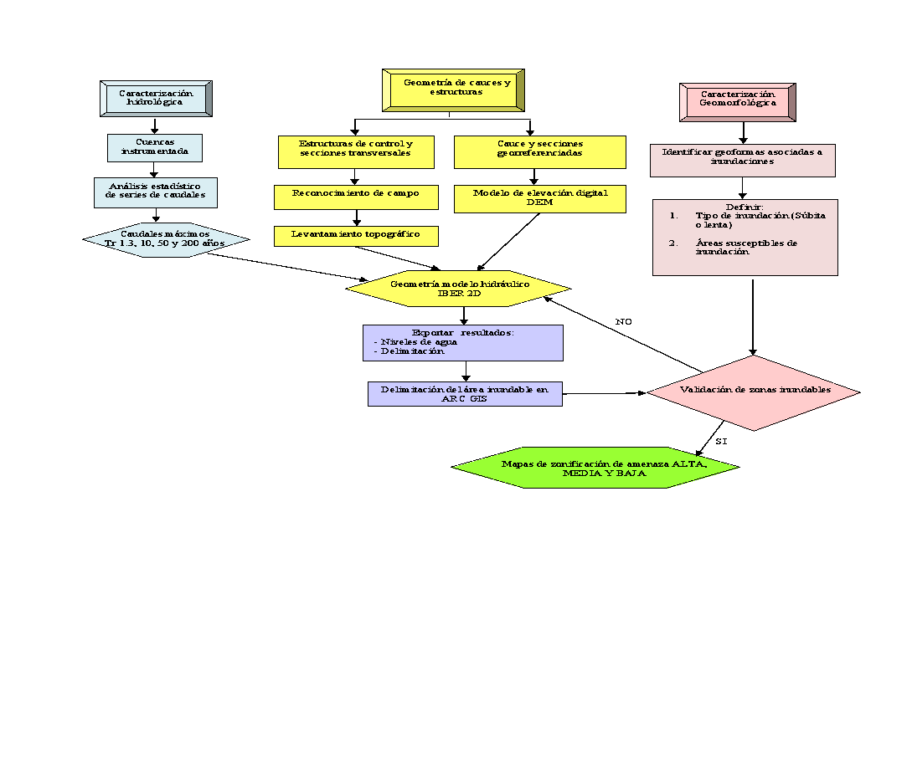

**Figura 3. **Diagrama de flujo para la cuantificación de la amenaza.

Gracias a las actuales herramientas SIG, los resultados de la modelización numérica se pueden combinar con datos georreferenciados para realizar una cuantificación  sistemática del riesgo de inundación [9]. Iber 2D se desarrolló por el Instituto Flumen y GEAMA, el cual aporta mayor precisión respecto a un software de modelación hidráulica en una dimensión debido a que permite construir la topografía mediante una malla no estructurada de elementos finitos [10], tiene en cuenta la dirección del vector de velocidad, resuelve las ecuaciones de Saint Vennat 2D que son la expresión matemática de las leyes de conservación de masa y de la cantidad de movimiento [11] y predice de forma más precisa las zonas de inundación y su profundidad. Adicionalmente, es de uso libre (www.iberaula.es), ofrece documentación adicional y soporte a través de un foro de discusión y cursos de formación [7]. 

**Tabla 1.** Calificación de la frecuencia. La frecuencia determina cada cuanto se presentan eventos amenazantes a partir de la cronología de eventos ocurridos. UNGRD, 2012, p. 28.

| Descripción | Valor | Calificación |
| --- | --- | --- |
| Evento que se presenta una vez aproximadamente cada 10 años. | 3 | Alta |
| Evento que se presenta por lo menos una vez en un período de tiempo aproximado de 50 años. | 2 | Media |
| Evento que se presenta al menos una vez en un período de tiempo aproximado a 100 años. | 1 | Baja |
|  |  |  |

Para el río Unete la modelación se realizó en dos dimensiones sin considerar flujos hiperconcentrados, por cuanto no se evidencian geoformas asociadas a este tipo de flujos, como son conos de deyección y abanicos aluviales. Como resultado de la modelación hidráulica se obtuvieron mapas de intensidad de inundación para distintos periodos de retorno, que son un insumo indispensable para definir el nivel de amenaza como la sumatoria de frecuencia, territorio afectado e intensidad. Cada indicador se evalúa en escala de 1 a 3, de tal forma que la sumatoria fluctúa entre 3 (amenaza mínima) y 9 (amenaza máxima) [9]. Para evaluar la intensidad de la inundación en términos del territorio afectado, se adopta como 100% la mancha de inundación con período de retorno de 200 años.

**Tabla 2.** Porcentaje y calificación del territorio afectado. Fuente: UNGRD, 2012, p. 29.

| Descripción | Valor | Calificación |
| --- | --- | --- |
| Más del 80% del territorio afectado por la inundación | 3 | Alta |
| Entre el 50% y 80% del territorio afectado por la inundación | 2 | Media |
| Menos del 50% del territorio afectado por la inundación | 1 | Baja |

La intensidad representa el nivel potencial de daños materiales y de pérdida de vidas humanas, valorada igualmente en escala de 1 a 3, según la profundidad y velocidad de  flujo, siendo conveniente diferenciar entre inundaciones estáticas y dinámicas [12]. Si la inundación es estática, la velocidad del flujo es inferior a 0.50 m/s y la variable a tener en cuenta es la profundidad; mientras que si es dinámica, se tendrá en cuenta el producto de la velocidad por la profundidad de flujo, y es este el criterio adoptado en Aguazul, para lo cual los resultados de la simulación en Iber 2D se exportaron al software Arcgis y se reclasificaron estableciendo tres rangos: profundidad baja (0 – 1.0 m), profundidad media (1.0 – 1.5 m) y profundidad alta (1.5 m – profundidad máxima).

**Tabla 3.** Criterios valoración intensidad de inundación. Fuente: Instituto Nicaragüense de Estudios Territoriales, 2005, p. 16.

| Nivel de intensidad | Valor | Profundidad del flujo (H) (m) (inundaciones estáticas) | Profundidad × vol. de flujo (m/s) (inundaciones dinámicas) |
| --- | --- | --- | --- |
| Alto | 3 |  |  |
| Medio | 2 |  |  |
| Bajo | 1 |  |  |

Para los mapas de velocidad se siguió un proceso similar para cada uno de los periodos de retorno (200 años, 50 años, 10 años y 1.3 años), los cuales se exportaron y reclasificaron en el software Arcgis estableciendo tres rangos: velocidad baja (0 – 1.0 m/s), velocidad (1.0 – 1.5 m/s) y velocidad alta (1.5m/s –  velocidad máxima). Finalmente, la amenaza es el resultado de sumar frecuencia, territorio afectado e intensidad, cuyo resultado se reclasifica en tres intervalos.

**Tabla 4.** Calificación de amenazas. Fuente: UNGRD, 2012, p. 29.

| Intervalo | Calificación de la amenaza |
| --- | --- |
| 7-9 | Alta |
| 4-6 | Media |
| 1-3 | Baja |

Previo a la modelación hidráulica, se realizó una visita de campo donde se realizó el aforo líquido y levantamiento topográfico. Esta información se utilizó para calcular el coeficiente de rugosidad de Manning, definir la geometría del modelo y sus condiciones de control.

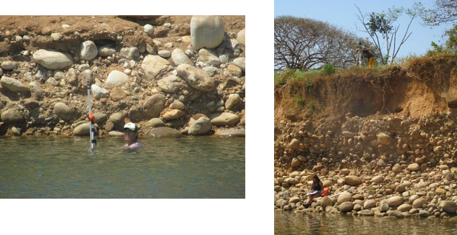

**Figura 4. **Trabajo de batimetría efectuado en el río Unete en enero de 2018 (izq) y (der).

En el sitio del aforo se obtuvo una pendiente del lecho del río (S) del 3.0%, área (A) de 46.17 m2 y perímetro (P) de 90.74 m. Seguidamente se calculó el caudal (Q) por el método área – velocidad, para ello, la sección transversal se dividió en 18 secciones, en cada una se registra el área y la velocidad, cuyo producto es el caudal, que en este caso fue de 107.09 m3/s, caudal aforado en noviembre de 2017 tras precipitaciones la noche anterior.	

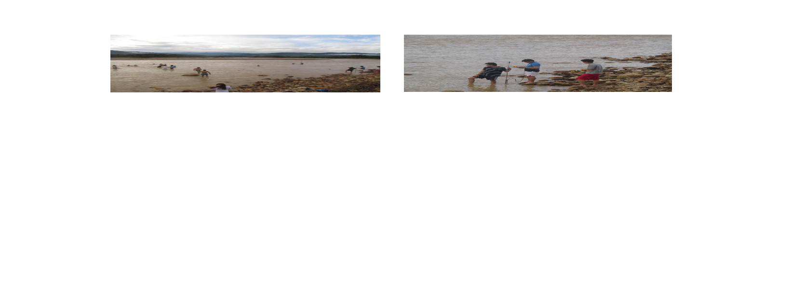

**Figura 5.** Aforo líquido del río Unete realizado el 04-11-2017. 

Con estos valores, se llegó a un coeficiente de rugosidad de Manning (n) de 0.048, que concuerda con la clasificación dada en la literatura técnica [13], cuya descripción corresponde a un cauce con presencia de gravas, cantos rodados y algunas rocas grandes.

$n= 1Q*A53P23*S$            $n= 1107.09*46.175390.7423*0.03=0.048$            (1)

En la Figura 6 se observa el lecho del río Unete, incluyendo una barra de sedimento compuesta por arenas, gravas y cantos rodados, así como, espolones y una estructura de contención construida con rocas y hexápodos posicionada sobre la margen izquierda del río y una terraza en la margen derecha.

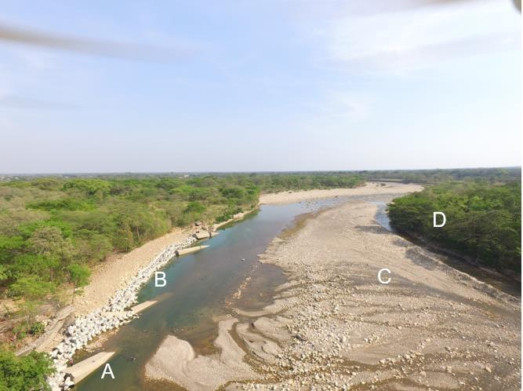

**Figura 6.** Vista panorámica del río Unete tomada con drone. Trabajo de campo efectuado en el río Unete en enero de 2018. (**A**) Espolones en concreto, (**B**) Estructura de contención con hexápodos, (**C**) Barra de sedimentos y (**D**) Terraza.

Las geoformas identificadas en el río Unete en proximidad al área urbana de Aguazul, incluyen barras de sedimento, vega, terrazas de distintos niveles y planicie de inundación (Fig. 7), su identificación y delimitación permite establecer la susceptibilidad del terreno ante el desbordamiento del río.

**Figura** **7. **Geoformas río Unete.

La susceptibilidad hace referencia a la facilidad con que un fenómeno puede ocurrir sobre la base de las condiciones locales del terreno, en este caso la susceptibilidad es una propiedad del terreno que indica qué tan favorables son las condiciones de éste, para que pueda ocurrir una inundación, en función de las geoformas, que son indicador del tipo de material, origen, granulometría y edad del depósito, condición que es validada con el análisis de amenaza.

**Tabla 5.** Susceptibilidad de inundación según geoformas.

| Geoforma | Símbolo | Tipo | Tipo | Susceptibilidad |
| --- | --- | --- | --- | --- |
| Cauce activo | Fr | Depósitos aluviales conformado por suelo transportado, con tamaño desde arenas hasta bloques | Alta | Alta |
| Vega aluvial | Fv | Depósitos aluviales conformado por suelo transportado subreciente, con tamaño desde limos hasta arenas, inundado periódicamente | Alta | Alta |
| Planicie de inundación | Fi | Depósitos aluviales conformado por suelo transportado, matriz soportados con arenolimosa, afectados por inundaciones periódicas y/o excepcionales | Alta | Alta |
| Barra de sedimento | Fb | Depósitos aluviales conformado por suelo transportado reciente, con tamaño desde gravas hasta arenas, generalmente inestable, que bajo ciertas condiciones puede llegar a ser estabilizada por la vegetación | Alta | Alta |
| Terraza de acumulación baja | Ft1 | Depósitos fluviotorrenciales transportado reciente con tamaño desde gravas hasta arenas, matriz soportados con arenolimosa | Media | Media |
| Terraza de acumulación subreciente | Ft2 | Depósitos fluviotorrenciales matriz soportados con tamaño desde gravas hasta guijarros, la matriz es arenolimosa | Media | Media |
| Terraza de acumulación alta | Ft3 | Suelos transportados limoarenosos generados a partir de acumulación de materiales de lavado de laderas | Baja | Baja |
| Escarpe de terraza | Fs | Depósitos fluviotorrenciales matriz soportados con tamaño desde gravas hasta bloques, de formas redondeadas, la matriz es arenolimosa | Media | Media |

Para la caracterización del régimen de precipitación se utilizaron los registros de 15 estaciones hidrológicas, entre ellas la estación Aguazul (3519530) posicionada en el piedemonte de la cordillera oriental, está última con registros continuos desde 1974 y un 10.7% de datos faltantes. Una vez la serie de datos suministrada por el IDEAM fue validada y completada, se obtuvo un régimen monomodal con periodo húmedo entre abril y octubre, precipitación anual de 2,796 mm, distribuidos en promedio en 158 días al año.

**Tabla 6.** Resumen registro de precipitación en la estación Aguazul (3519530) del IDEAM.

| Parámetro | Ene | Feb | Mar | Abr | May | Jun | Jul | Ago | Sep | Oct | Nov | Dic |  |
| --- | --- | --- | --- | --- | --- | --- | --- | --- | --- | --- | --- | --- | --- |
| Precipitación media mensual (mm) | 12.8 | 41.0 | 125.2 | 286.1 | 426.2 | 410.2 | 357.0 | 310.7 | 329.3 | 287.5 | 163.0 | 46.9 | 2796 |
| Precipitación mínima mensual (mm) | 0 | 0 | 3.6 | 68.2 | 191.4 | 204 | 169.1 | 100.4 | 73.4 | 151.3 | 2.7 | 0 | 0 |
| Precipitación máxima en 24 horas (mm) | 35 | 105 | 146 | 131 | 136.3 | 136.2 | 170.1 | 121.4 | 134.6 | 155 | 187 | 85 | 187 |
| Promedio No de días con precipitación | 2 | 4 | 9 | 17 | 20 | 20 | 21 | 18 | 16 | 16 | 12 | 4 | 158 |

A nivel regional, la menor precipitación tiene lugar en la parte alta de la cuenca hacia la zona de páramo (1,313.7 mm en la estación Toquilla), mientras que las máximas precipitaciones se desarrollan en el piedemonte (4,806.1 mm en la estación Chameza), de tal forma que la cuenca del río Unete se posiciona en el corredor de máximas precipitaciones, con valores entre 2,500 y 3,500 mm anuales.

** Figura** **8.** Precipitación en la cuenca del Unete.

Los caudales para cada periodo de retorno (200 años, 50 años, 10 años y 1.3 años) se analizaron a partir de registros históricos de la estación limnigráfica Los Esteros (35197030) del IDEAM [14], con estos se realizaron las distribuciones de probabilidad tipo Gumbel y Pearson tipo III, obteniendo los respectivos caudales máximos y el cálculo de los hidrogramas. Así, el caudal de diseño para cada periodo de retorno fue de 361.78 m3/s (1.3 años), de 1,161.3 m3/s (10 años), de 1,645.65 m3/s (50 años) y de 2,054.43 m3/s (200 años) (Figura 9). 

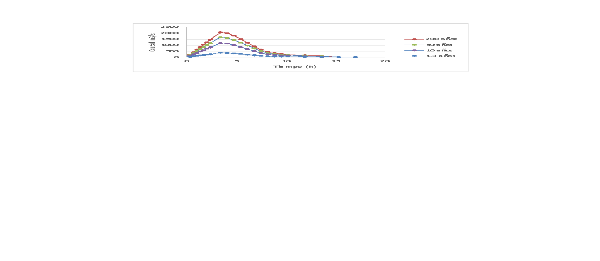

**Figura 9. **Hidrograma del río Unete para distintos periodos de retorno; elaborado a partir de registros históricos de la estación Los Esteros (35197030) del IDEAM del año 2018

Por otro lado, se realizó el levantamiento de 13 secciones transversales del lecho del río Unete (Fig. 10), en el tramo próximo al área urbana de Aguazul, abarcando una longitud de 3.7 km sobre el eje del cauce. Cada sección incluyó las terrazas de margen  derecha e izquierda, barras de sedimento intermedias, así como el canal principal y secundarios. En la Figura 11 se observar la sección número 6 del río Unete, con poca profundidad (1.05 m) respecto a su ancho.

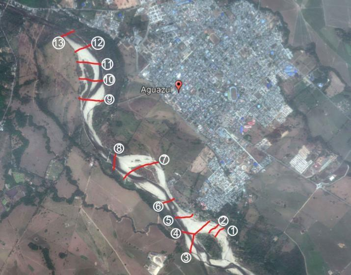

**Figura 10.** Localización de secciones topográficas en el río Unete. Las secciones transversales obtenidas del río Unete se representaron en una imagen de Google Earth de 2018.

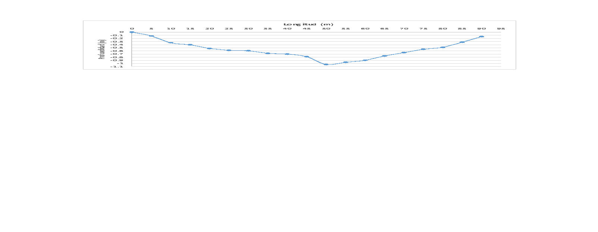

**Figura 11.** Sección transversal del río Unete. El perfil se utiliza como ejemplo para representar como es la vista transversal de las secciones tomadas.

Es importante mencionar que la metodología utilizada para la integración de las dos fuentes de información no es propia de este estudio. Se ha visto implementada en trabajos como Modelación Hidráulica 2D de Inundaciones en Regiones con Escasez de Datos. Tal es el caso del Delta del Río Ranchería, Riohacha-Colombia, donde se digitalizó la elevación disponible en Google Earth y está se integró con secciones levantadas en el río y datos topográficos, obteniendo una nube de puntos topográfica, la cual fue interpolada a una red de triángulos irregular, y finalmente, transformada en un Modelo Digital del Terreno [15].

Utilizando el software Arcgis, se integraron las 13 secciones transversales levantadas mediante topografía y el modelo de elevación digital (DEM), obteniendo el relieve y lecho del río requeridos para el modelo hidráulico, estas se combinaron a partir de la conversión de las dos fuentes de información a formato vectorial de puntos, estos fueron interpolados mediante la función merge y finalmente transformado a formato raster. El DEM fue descargado del satélite ALOS PALSAR [16], con tamaño de celda de 12.5 × 12.5 m. 

En campo se realizó la georreferenciación con GPS de las estructuras hidráulicasexistentes en el cauce del río Unete para el control de procesos de socavación y de la dinámica fluvial, incluyendo gaviones o espigones de hexápodos en concreto, muros de contención y muros de gavión (Fig. 12). Igualmente se realizó el reconocimiento y georreferenciación de taludes con erosión en las dos márgenes del río.

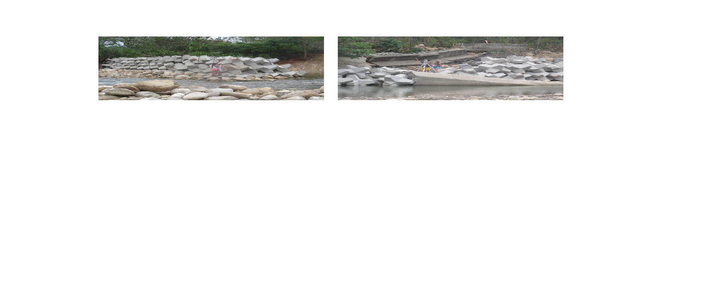

**Figura 12.** Estructuras hidráulicas para control de socavación en el río Unete. Trabajo de campo de topografía e identificación de estructuras hidráulicas efectuado en el río Unete en enero de 2018 (izq) y (der).

La información anteriormente descrita se incorporó al modelo hidráulico en el software Iber. Se tuvieron en cuenta tres usos de suelo, con su respectivo coeficiente de rugosidad: 0.048 para el lecho calculado a partir de datos experimentales con la Ecuación 1 (0.15 para el área urbana y 0.05 para praderas y terrazas aluviales) estos últimos corresponden a valores predeterminados por el software Iber. Como condición inicial se adoptó una profundidad media de 0.55 m con base en el caudal medio de 27.57 m3/s, este último a partir de los registros históricos del IDEAM y lo observado durante las visitas de campo (Fig. 13)

**Figura 13.** Usos de suelo en Iber. Los usos de suelo se determinaron a partir de las imágenes satelitales y las visitas realizadas a la zona del proyecto. (A) Usos de suelo identificados a partir de malla triangular no estructurada en el software Iber, (B) Terraza aluvial y (C) Material del lecho del río Unete.

Para realizar los mapas de amenaza por inundación se definió una reclasificación con el fin de ponderar la amenaza obtenida para cada periodo de retorno (10, 50 y 200 años) y generar un mapa definitivo, reflejando la situación del municipio Aguazul debido al desbordamiento del río Unete, siguiendo la metodología de la UNGRD [9]. Para cada periodo de retorno (10, 50 y 200 años) se evaluó la intensidad en escala de 1 a 3, la frecuencia asignando 3 para Tr de 10 años, 2 para Tr de 50 años y 1 para Tr de 200 años, y el área inundada tomando como 100% el área correspondiente a Tr 200 años. De esta manera, la suma de las tres variables alcanza un valor entre 3 y 9, cuyo resultado se clasifica en amenaza baja (1-3), media (4-6) y alta (7-9).

Para validación de resultados, se realizaron 40 encuestas a los habitantes de los barrios El Porvenir, Las Vegas y Los Esteros en el municipio de Aguazul, de forma que se contara con un periodo de residencia en el sector superior a 10 años, con el fin de garantizar el conocimiento del entorno, estrategia utilizada en estudios similares en la etapa de validación [8]. Las preguntas realizadas fueron: ¿Se le ha inundado su casa? ¿Se inundó el patio o la vivienda? ¿Cada cuánto se inunda? ¿Cuántas veces se ha inundado? ¿Hasta qué altura llego el agua? ¿Cuándo fue la última inundación? ¿Ha tenido pérdidas? ¿Qué tipo de pérdidas?

**Figura 14.** Registro fotográfico de encuestas. Las fotografías muestran evidencia de la realización de las encuestas, para este caso, en los barrios Los Esteros y Las Vegas (izq) y (der).

Los resultados de las encuestas se contrastaron con las geoformas del río, obteniendo un mapa de amenaza por inundación según la percepción de la comunidad. Finalmente, este mapa se comparó con los resultados de modelación hidráulica y con fotografías aéreas de distintos años, permitiendo validar e interpretar el mapa final de amenaza por inundación.

## RESULTADOS Y DISCUSIÓN {.unnumbered}

La modelación hidráulica considerando únicamente el DEM (12.5 × 12.5 metros) como el  relieve, no permitió definir con claridad el lecho del río y arrojó el desbordamiento del río por toda el área urbana, lo cual no resulta razonable a partir de los antecedentes históricos ni con las geoformas identificadas que incluyeron terrazas altas en donde se posiciona la mayor parte del área urbana (Fig. 15).

**Figura 15.** Resultados de profundidad para la modelación hidráulica considerando el modelo digital de elevación obtenido de ALOS PALSAR para un tiempo de retorno de 200 años. Los resultados sin topografía demuestran la importancia del trabajo de campo para el desarrollo de modelos hidráulicos en Iber 2D.

Una vez complementado el DEM con las secciones trasversales, la simulación hidráulica en Iber 2D arrojó mapas de profundidad de flujo donde se identifica con claridad el lecho del río y la inundación aumenta progresivamente conforme al periodo de retorno, al incluir las secciones transversales se permite que el modelo reconozca el lecho del río como zona de flujo preferente y se reduzca la afectación en las zonas de terraza y planicies de inundación, pasando de parches desconectados a zonas inundadas más compactas. 	

Se observa que, para el periodo de retorno de 1.3 años, correspondiente con la  creciente anual (361.78 m3/s), se afecta un sector del barrio Las Vegas, coincidiendo con lo expuesto en las encuestas. El área afectada por las inundaciones aumenta progresivamente con el periodo de retorno, de tal forma que el río Unete alcanza en su lecho profundidades máximas de 12.28 m para un tiempo de retorno de 10 años (1,161.3 m3/s), 12.48 m para un tiempo de retorno de 50 años (1,645.65 m3/s) y 12.64m para un tiempo de retorno de 200 años (2,054.43 m3/s). Los barrios más afectados son: Los Esteros, Las Vegas, Villaluz y El Porvenir (Fig. 16).

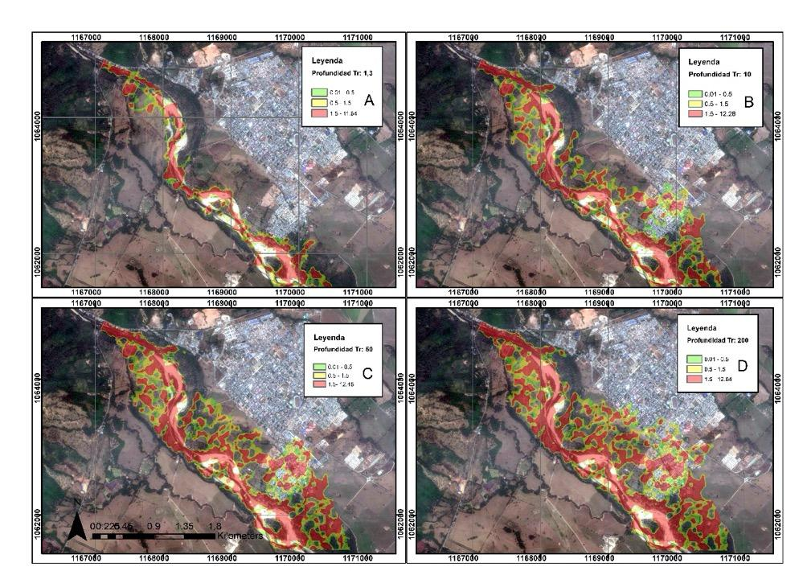

**Figura 16. **Mapa de profundidad de flujo en el río Unete según período de retorno.

En la figura anterior se observa que la profundidad y área inundada con la creciente con periodo de retorno de 1.3 años representa la condición anual del río Unete con una probabilidad de ocurrencia del 80% (Fig. 16A). La profundidad correspondiente a un periodo de retorno representa una probabilidad de ocurrencia del 10%, condición en la cual se afectan parcialmente de 10 años, los barrios Villaluz y Porvenir (Fig. 16B). La profundidad correspondiente a un periodo de retorno de 50 años, representa una probabilidad de ocurrencia del 2% afectando todo el barrio Porvenir (Fig. 16C). Por su parte, la profundidad correspondiente a un periodo de retorno de 200 años representa una probabilidad de ocurrencia de 0.5%, superando la rasante de la Calle 7 y afectando otros barrios y la  estación de bomberos (Fig. 16D).

Lo anterior refleja la importancia del trabajo de campo, por cuanto al predominar una topografía plana y ante la ausencia de grandes cambios de nivel entre geoformas, el DEM no logra diferenciar entre el cauce principal, cauces secundarios, terrazas y planiciesinundables. No obstante, aún se observan parches de zonas inundadas aparentemente desconectadas, condición que no corresponde con la realidad y que en la simulación es resultado de la sobreestimación de la elevación en algunas celdas del DEM por la presencia de vegetación densa y cercas vivas [15], razón por la cual se hace preciso editar en formato vector las manchas de inundación uniendo zonas que según resultados de IBER están aisladas.

La velocidad máxima registrada para el periodo de retorno de 10 años fue de 7.19 m/s, para el periodo de retorno de 50 años fue de 7.65 m/s y para el periodo de retorno de 200 años fue de 8.1 m/s. La simulación demuestra que las zonas de mayor velocidad corresponden al lecho o cauce principal del río en el cual también se registraron las profundidades máximas, además se evidencia que las velocidades disminuyen en las zonas donde se desborda el río, esto debido al cambio del coeficiente de rugosidad de Manning puesto que la vegetación disminuye la velocidad del flujo significativamente (Fig. 17).

**Figura 75.** Mapa de velocidad de flujo en el río Unete según período de retorno.

En el periodo de retorno de 10 años aumenta la inundación en los barrios Los Esteros y Las Vegas y se observa afectación adicional en los barrios Villaluz y El Porvenir. Adicionalmente, se reconoce que la función principal del muro de contención es el control geomorfológico debido a que una vez que el nivel del agua sobrepasa el muro, el flujo sigue la geoforma del río, que corresponde con un canal de estiaje o una vega, afectando las viviendas localizadas en dicha geoforma (Fig. 18).

A partir de los resultados de la modelación hidráulica se determina que en el barrio Los Esteros se presenta una inundación dinámica con una intensidad alta producto de un cauce más estrecho y un flujo más veloz, mientras que en los barrios Las Vegas, El Porvenir y Villaluz se presenta una inundación estática asociada al cambio hacia un rio trenzado con planicies de desborde, y a la derivación de parte del flujo hacia el caño El Samán.

Para el periodo de retorno de 50 años se observa un aumento en el área e intensidad en los barrios Villaluz y Los Esteros, especialmente en inmediaciones al caño El Samán, por donde se desarrolla una zona de flujo preferente, es así que, el barrio El Porvenir progresivamente va quedando aislado del casco urbano, limitando las posibles acciones de evacuación y atención de la emergencia. Finalmente, en el periodo de retorno de 200 años se evidenció una afectación total con una intensidad alta en los barrios El Porvenir, Las Vegas, Los Esteros, Villaluz. Así mismo, la Estación de Bomberos y los barrios San Agustín y El Centro se empiezan a afectarse por la inundación (Fig. 18).

En la Figura 18A se observa que la intensidad correspondiente a un periodo de retorno de 1.3 años, representa la condición anual del río Unete en la cual la creciente es contenida por el lecho del río sin afectar ningún área urbana. La intensidad de la creciente para un período de retorno de 10 años representa una probabilidad de ocurrencia del 10% en cuyo caso el barrio Las Vegas (Fig. 18B) y Los Esteros alcanzan una valoración de alta y el barrio Porvenir baja (Fig. 18C). El mapa de intensidad de amenaza por inundación en el río Unete para un período de retorno de 50 años demuestra un aumento en extensión e intensidad en los barrios Villaluz y Porvenir donde predomina una amenaza alta (Fig. 18D). Para la creciente con período de retorno de 200 años la mayor parte del área inundable alcanza una valoración de alta con una probabilidad de ocurrencia del 0.5%, llegando hasta el barrio San Agustín y Centro.

**Figura 76.** Mapa de intensidad de amenaza por inundación en el río Unete según período de retorno.

Considerando que el 100% del área afectada corresponde al periodo de retorno de 200 años con un área 460.97 hectáreas, se determinó el porcentaje de afectación para cada periodo de retorno, según se indica a continuación (Figura 77).

**Tabla 7.** Clasificación de territorio afectado por inundación del río Unete.

| Periodo de retorno (años) | Territorio afectado (ha) | Porcentaje respecto a Tr 200 (%) | Calificación |
| --- | --- | --- | --- |
| 200 | 460.97 | 100 | 3 |
| 50 | 400.58 | 86.9 | 3 |
| 10 | 347.64 | 75.4 | 2 |
| 1.3 | 163.39 | 35.5 | 1 |

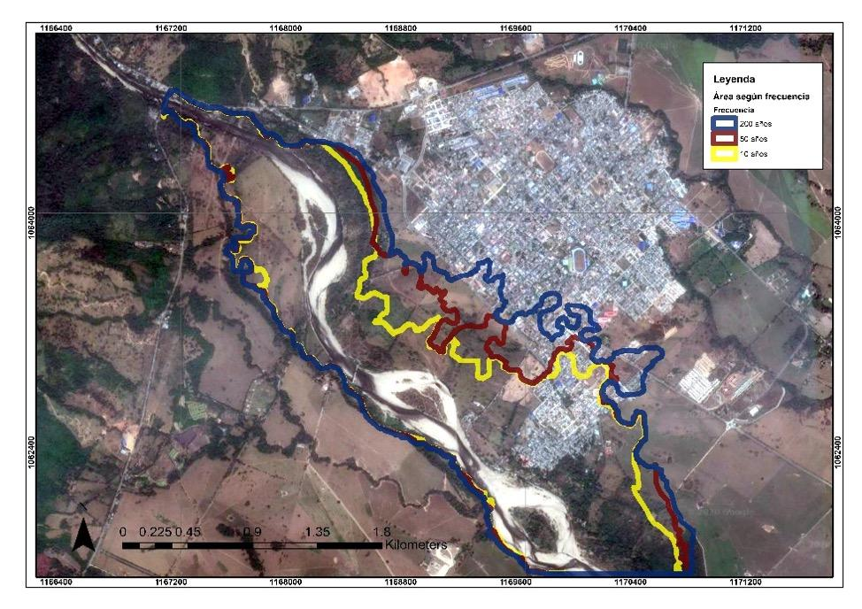

**Figura 19.** Mapa de área según frecuencia. Las áreas identificadas corresponden a los periodos de retorno de 10, 50 y 200 años.

Como resultado de la suma o combinación de intensidad, frecuencia y territorio afectado se obtuvo la amenaza de cada periodo de retorno, según tres intervalos de valores entre 1 y 3 que corresponden a amenaza baja, entre 3 y 6 a amenaza media y entre 6 y 9 amenaza alta, concluyendo que todo el territorio alcanza una amenaza entre media (amarillo) y alta (rojo) (Fig. 20).

**Figura 20.** Mapa de amenaza por inundación en el río Unete según período de retorno.

En la figura anterior (Fig. 20A), la amenaza correspondiente a un periodo de retorno de 1.3 años representa la condición anual del río Unete. A partir de la creciente con período de retorno de 10 años los barrios Los Esteros y Las Vegas se afectan con amenaza alta, con una probabilidad de ocurrencia del 10% (Fig. 20B). Para la creciente con período de retorno de 50 años los barrios Villaluz y Porvenir llegan a amenaza alta (Fig. 20C), condición que se incrementa con la inundación en el río Unete para un período de retorno de 200 años (Fig. 20D).

De acuerdo con los resultados obtenidos de los mapas de amenaza parciales se construyó el mapa de amenaza definitivo a partir del promedio de la amenaza en cada periodo de retorno, reflejando la situación del municipio Aguazul debido al desbordamiento del río Unete (Fig. 21).

**Figura 21.** Mapa de amenaza por inundación en el municipio de Aguazul. La clasificación de amenaza por inundación se realizó a partir de los periodos de retorno de 10, 50 y 200 años.

De esta manera se concluye que Los barrios Los Esteros, Las Vegas y El Porvenir obtuvieron una calificación de amenaza alta, por otro lado, el barrio Villaluz presenta una transición entre los tres niveles de amenaza, mientras que barrios como San Agustín y El Centro solo alcanzan una amenaza baja.

Igualmente, se evidencia que la afectación por inundación por la creciente con periodo de retorno de 10 años coincide con los antecedentes registrados el 17 de agosto de 2002, en los cuales el desbordamiento del río Unete afectó los barrios El Porvenir, Villaluz, Los Esteros y Los Guaduales.

En los resultados obtenidos de la modelación hidráulica se observa que el río Unete no desborda por la margen del río opuesta al municipio, esto se justifica por la presencia de terrazas de acumulación alta (Fig. 7) con menor susceptibilidad a inundación y que funcionan como barreras protectoras, que impiden el desbordamiento hacia la margen derecha, por tanto, el río siempre va a desbordar hacia el área urbana en la margen izquierda, donde las geoformas de planicie aluvial, planicie aluvial, terraza baja y terraza de acumulación subreciente tienen una susceptibilidad alta y media ante inundaciones.

## VALIDACIÓN DE RESULTADOS {.unnumbered}

Aunque la modelización numérica es una de las herramientas más utilizadas para representar la amenaza por inundación, es preciso la búsqueda de soluciones dinámicas o evolutivas que permitan superar el déficit de información, siendo importante recurrir a registros históricos y datos geomorfológicos, entre otros, como lo recomienda la directiva europea 2007/60CE [10].

Para la validación de los resultados del modelo hidráulico y ante la falta de información geográfica se buscó solventar complementando métodos tradicionalmente utilizados con el calculó el porcentaje de área en cada nivel de amenaza para cada geoforma, se realizó un análisis multitemporal por medio de fotografías aéreas de los años 1995 y 2004, y se construyó un mapa a partir de encuestas a pobladores ribereños.

De acuerdo con los resultados obtenidos en la Figura 7 en la delimitación de geoformas se calculó el porcentaje de cada una respecto a la Figura 21 correspondiente al mapa definitivo de amenaza del municipio de Aguazul.

**Tabla 8.** Porcentaje de área en amenaza por geoforma.

| Geoforma | Porcentaje de amenaza | Porcentaje de amenaza | Porcentaje de amenaza |
| --- | --- | --- | --- |
|  | Alta | Media | Baja |
| Cauce activo | 100 | 0 | 0 |
| Barras de sedimentos | 100 | 0 | 0 |
| Vega | 78.16 | 11.35 | 10.49 |
| Planicie de inundación | 91.48 | 7.04 | 1.48 |
| Terraza baja | 52.87 | 25.90 | 21.23 |
| Terraza intermedia | 70.06 | 15.68 | 14.25 |
| Terraza alta | 70.74 | 11.75 | 17.51 |

Debido a que el municipio de Aguazul no cuenta con un mapa de eventos históricos de inundación y que el mapa de riesgos e inundaciones del EOT de Aguazul del año 2010 [17] tan solo identifica un área susceptible a inundaciones sin delimitar las zonas de amenaza alta, media y baja, fue preciso incorporar para la validación de los resultados del modelo: encuestas a pobladores ribereños, análisis multitemporal de fotografías aéreas y valoración de susceptibilidad según geoformas.

Cabe resaltar en el caso del barrio El Porvenir que en la fotografía aérea del año 2004 el caño El Samán atravesaba el barrio El Porvenir, coincidiendo con la mancha deinundación con periodo de retorno de 10 años que rodea el barrio El Porvenir y afecta directamente el barrio Villaluz (Fig. 22).

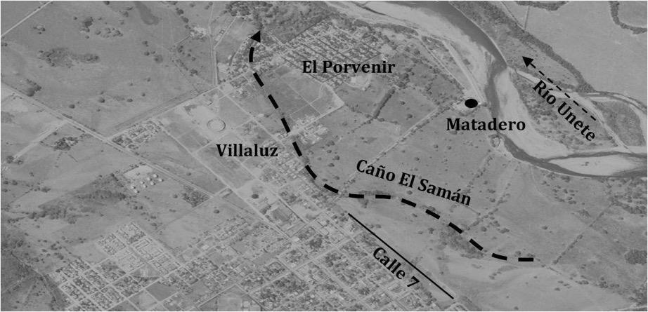

**Figura 22.** Cruce del caño Samán por el barrio Porvenir. Fotografía aérea de Aguazul del año 2004. Modificado a partir del vuelo C-2710, n°. 207, 2004.

A su vez, en la fotografía aérea del año 1995 se observa que el caño El Samán y el canal de estiaje se encuentran activos y no estaba construido el muro de contención, demostrando que ante una posible creciente que supere la cresta del muro, la zona de Las Vegas y Los Esteros se inundan siguiendo la geoforma natural del río. De igual forma, se observa que para 1995 el barrio El Porvenir se empieza a desarrollar, ocupando áreas en condición de amenaza por inundación, ignorando la presencia del caño El Samán (Fig. 23).

**Figura 23.** Canal de estiaje en el sector Las Vegas. Fotografía aérea de Aguazul del año 1995. Modificado a partir del vuelo C-2564, n°. 3, 1995.

En contraste, en la fotografía aérea del año 1995 no existían los barrios El Porvenir y Villaluz, pero el caño El Samán se encontraba seco, permitiendo inferir que el desarrollo de estos barrios se dio durante un periodo de fuerte estiaje, desconociendo el recorrido histórico de este cuerpo de agua, es decir, las viviendas y barrios afectadas por inundaciones se desarrollaron sobre geoformasasociadas a vegas y antiguo cauce del río Unete, caracterizadas por alta susceptibilidad a inundaciones.

Las encuestas establecen que el 72.5% de la muestra encuestada ha sufrido inundaciones por el río Unete, las cuales han alcanzado profundidades superiores a los 50 cm correspondiendo a una intensidad alta. En cuanto a la frecuencia, se asigna categoría alta debido al predominio de inundaciones una vez cada dos años, que corresponde a un periodo de retorno inferior a 10 años.

**Tabla 9.** Resultados encuestas municipio de Aguazul.

| Pregunta | Respuesta | Porcentaje% |
| --- | --- | --- |
| ¿Se le ha inundado su casa? | Si | 72.5 |
| ¿Se le ha inundado su casa? | No | 27.5 |
|  | Menos de 3 veces | 62.1 |
| ¿Cuántas veces se ha inundado? | 4 a 8 veces | 34.5 |
|  | Más de 10 veces | 3.4 |
|  | Más de una vez por año | 13.8 |
| ¿Cada cuánto se inunda? | Una vez por año | 17.2 |
| ¿Cada cuánto se inunda? | Una vez cada dos años | 58.6 |
|  | otro | 10.3 |
| ¿Se	inundó	el	patio	o	la vivienda? | Patio | 37.9 |
| ¿Se	inundó	el	patio	o	la vivienda? | Vivienda | 17.3 |
| ¿Se	inundó	el	patio	o	la vivienda? | Ambos | 44.8 |
|  | Menos de 10 cm | 6.9 |
| ¿Hasta qué altura llego el agua? | Entre 10 y 30 cm | 20.7 |
| ¿Hasta qué altura llego el agua? | Entre 30 cm y 50 cm | 13.8 |
|  | Más de 50 cm | 58.6 |
| ¿Ha tenido pérdidas? | Si | 100 |
| ¿Ha tenido pérdidas? | No | 0 |
|  | Año anterior | 41.4 |
| ¿Cuándo	fue	la	última inundación? | Hace 2 años | 34.5 |
| ¿Cuándo	fue	la	última inundación? | Hace 5 años | 10.3 |
| ¿Cuándo	fue	la	última inundación? | Hace 10 años | 13.8 |
|  | Más de 10 años | 0 |

Para calificar la amenaza a partir de estos atributos, se definieron 3 indicadores (frecuencia, profundidad y última vez que ocurrió el evento), teniendo en cuenta la severidad de cada uno de los parámetros se asignó un valor que varía entre 1 y 5, siendo 5 el más crítico y 1 el menos crítico, tal y como se muestra a continuación:

**Tabla 10.** Clasificación de amenaza por inundación según resultados de encuestas.

| Profundidad | Valor | Frecuencia | Valor | Ultima vez | Valor |
| --- | --- | --- | --- | --- | --- |
| No se inunda | 1 | No se inunda | 1 | No se inunda | 1 |
| Menor a 10cm | 2 | Otro | 2 | Mayor a 9 años | 2 |
| Entre 10 y 30cm | 3 | Una vez cada dos años | 3 | Entre 6 y 8 años | 3 |
| Entre 30 y 50cm | 4 | Una vez por año | 4 | Entre 3 y 5 años | 4 |
| Mayor 50cm | 5 | Más de una vez por año | 5 | Entre 1 y 2 años | 5 |

Los umbrales de la tabla anterior se determinaron de acuerdo al planteamiento de preguntas abiertas, las respectivas respuestas se reclasificaron conservando una escala de 1 a 5 de tal manera que los rangos son particulares para cada área específica, especialmente para la profundidad de inundación. A partir de los indicadores definidos se categorizó la amenaza en tres rangos: Baja (1 – 2.5), Media (2.5 – 4) y Alta (> 4). Para esto se sumaron los valores obtenidos en los indicadores de profundidad, última vez que ocurrió el evento y frecuencia, posteriormente, el número resultante se dividió en 3, obteniendo una escala de amenaza entre 1 y 5. Con estos resultados se realizó un mapa de amenaza por inundación del río Unete en el cual a partir del color de los puntos obtenidos y siguiendo las geoformas del río se delimitaron áreas homogéneas según cada nivel de amenaza (Fig. 24).

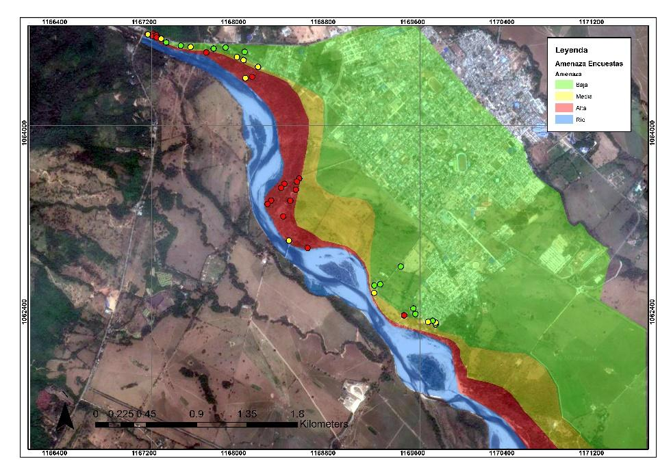

**Figura 24.** Mapa de amenaza por inundación en el municipio de Aguazul a partir de encuestas. Las zonas de amenaza corresponden a las áreas que la comunidad identifico y los límites se trazaron a partir de las geoformas.

Comparando los resultados obtenidos de la modelación hidráulica por medio del software Iber y las encuestas realizadas a la población en el municipio de Aguazul, se encontró que las manchas de inundación del periodo de retorno 1.3 años coinciden con los testimonios de los habitantes de los barrios encuestados. Sin embargo, evaluando periodos de retorno superiores, los resultados difieren entre la modelación hidráulica y las encuestas, debido a que la construcción de mapas de inundación a partir de encuestas solo logra reproducir eventos recientes, con alta frecuencia y poca magnitud, permitiendo afirmar la necesidad de apoyarse en modelación hidráulica y registros históricos de caudal para determinar los mapas de amenaza por inundación, mientras que las encuestas son una herramienta útil para validar los resultados del modelo para los eventos de menor frecuencia.

## CONCLUSIONES {.unnumbered}

El grado de amenaza encontrado en el casco urbano del municipio de Aguazul debido al desbordamiento del río Unete corresponde a 72.94% a amenaza alta, 13.92% a amenaza media y 13.13% a amenaza baja. Además de esto, a través de la modelación hidráulica fue posible evidenciar que los sistemas de contención y protección no son suficientes para contrarrestar el desbordamiento del río a partir de un periodo de retorno de 10 años.

Particularmente, por medio de las encuestas realizadas a la población se evidenció que los habitantes de los barrios cercanos a la ribera del río Unete desconocen la posibilidad de una inundación producto de una creciente con periodo de retorno superior a 10 años, por lo tanto, en el momento en que ocurra una creciente de magnitud superior a esta, la población no estará preparada para la atención de esta amenaza. Se demuestra una memoria corta en la población respecto a la ocurrencia de fenómenos amenazantes que solo puede ser superada apoyándose en el uso de registros históricos (IDEAM, Desinventar, entre otros) y modelos hidráulicos.

Se pudo reconocer el proceso de urbanización de barrios en zonas de amenaza por inundación, desconociendo la existencia de antiguos cauces y geoformas (vegas, terrazas bajas y canales de estiaje). Así mismo, se evidenció que la población no dimensiona de forma adecuada la amenaza a la cual se exponen y que tienen memoria únicamente de los eventos ocurridos en los últimos años (alta frecuencia y poca magnitud), lo cual condicionó los resultados de las encuestas.

Para determinar la amenaza por inundación en Aguazul se utilizó el software Iber,demostrando mejores resultados en términos de resolución, profundidad y vector de velocidad, aunque para su correcta utilización es preciso disponer de excelente informacióntopográfica. De esta forma, se concluye la importancia de soportar los estudios de amenaza con trabajo de campo e información primaria, contrario a la práctica habitual del contexto colombiano. 

Obtener un modelo de elevación con la escala y nivel de detalle apropiado para la modelación hidráulica 2D constituye un desafío, especialmente, porque la información disponible de forma gratuita es de baja resolución y con frecuencia tiende a sobreestimar la  elevación en algunas celdas por la presencia de vegetación. Para superar este déficit de información topográfica es necesario integrar secciones transversales levantadas mediante topografía y un modelo de elevación digital (DEM), acompañado de ajustes manuales a criterio del modelador tendientes a mejoraban visualmente la respuesta de las simulaciones y lograr mayor correlación entre las manchas de inundación y la susceptibilidad de las geoformas existentes.

Para la validación de resultados el análisis de susceptibilidad por geoformas, las  encuestas a pobladores ribereños y el análisis multitemporal por medio de fotografías, constituyen alternativas valiosas que permiten conocer los procesos que configuran los escenarios de riesgo y tomar acciones correctivas en los procesos de simulación. 

| RECOMENDACIÓNES PARA TOMAR DECISIONES Validar los criterios de diseño para las estructuras de contención y mitigación (muros de contención, hexápodos, otros), en caso de no contar con dicha información se recomienda modelarlos y verificar si aún cumplen las características de diseño debido al tiempo en el cual fueron diseñados y el cambio da las condiciones hidrometeorológicas. Realizar análisis multitemporales por medio de sensores remotos (fotografías aéreas e imágenes satelitales) para proyectos que se desarrollen en zonas aledañas a las riberas con el fin de identificar antiguas áreas sujetas a inundación, la dinámica de los cauces y geoformas con mayor susceptibilidad a desastres naturales. En busca de un mejor planeamiento municipal, es indispensable apoyar la identificación de áreas sujetas a amenazas naturales mediante trabajo de campo, información primaria y modelamiento numérico, cuyos resultados deben validarse con la percepción y conocimiento experto de la comunidad. Los resultados obtenidos reflejan la amenaza a la cual se encuentra expuesto el municipio de Aguazul, sin embargo, reconociendo como principal limitación de este estudio la falta de topografía de detalle en el área urbana y zona inundables, es pertinente realizar estudios de detalle en las zonas identificadas con amenaza para obtener resultados más precisos, condición que no es única del municipio de Aguazul, si no que resulta común en la mayoría del contexto colombiano. Ante los escenarios de cambio climático es recomendable modelar escenarios de amenaza por el desbordamiento del río Unete considerando el cambio climático, ya que el IPCC pronostica aumento de precipitaciones. |
| --- |

## CONFLICTO DE INTERES {.unnumbered}

Los autores no declaran conflicto de intereses.

**IDENTIFICACIONES DE AUTORES**

Rafael Muñoz Quintero		

Daniela Jácome Hernández		

Alejandro Franco Rojas		 

Alexander Padilla González		 

## BIBLIOGRAFÍA {.unnumbered}

El Tiempo. (2000). *Por segunda vez se cae el puente*. Consultado el 03 de octubre de 2017. 

Desinventar. (2018). *Sistema de inventario de efectos de desastres*. Consultado el 03 de octubre de 2017. https://online.desinventar.org/desinventar/#COL-1250694506-  colombia_inventario_historico_de_desastres.

Caracol Radio. (2016). *Avalancha en el río Unete incomunica a Boyacá y Casanare*. Consultado el 03 de octubre de 2017. https://caracol.com.co/emisora/2016/09/01/tunja/1472737110_176330.html 

IDIGER (Instituto Distrital de Gestión de Riesgo y Cambio Climático). (2018). *Riesgo por Inundación*. Consultado el 31 de marzo de 2018. 

UNGRD (Unidad Nacional pala la Gestión del Riesgo de Desastres). (2014). *Plan Estratégico Institucional (2014 – 2018).* Bogotá: UNGRD.

Alcaldía Municipal de Aguazul. (2016). *Plan Municipal de Gestión de Riegos y Desastres*. Aguazul, Casanare: Alcaldía Municipal de Aguazul.

E. Blade, L. Cea, G. Corestein, J. Puertas, E Vásquez-Cendón, J. Dolz & A. Coll. (2012). *Iber: herramienta de simulación numérica del flujo en ríos*. España, Elsevier. 

J. Pinos & L. Tumbe, (2019). Evaluación del desempeño de modelos hidráulicos  bidimensionales para la generación de mapas de inundación en ríos de montaña. *Ciencia e ingeniería del agua*. 12(1). 11-18. Ecuador. Elsevier. 

UNGRD (Unidad Nacional para la Gestión del Riesgo de Desastres). (2012). *Programa de Naciones Unidas para el desarrollo Colombia., y Proyecto gestión integral del riesgo y **adaptación al cambio climático caribe. Guía metodológica para la elaboración de planes departamentales para la gestión del riesgo*. Bogotá: UNGRD.

E. Blade, L. Cea & G. Corestein. (2014). Modelación numérica de inundaciones fluviales. *Ingeniería del agua,* 18(1), 71-82. 

Ministerio de Medio Ambiente y Medio Rural & Marino de España, CEDEX, Grupo de Ingeniería del Agua y del Medio Ambiente & Flumen. (2010). *Iber, Modelización bidimensional del flujo en lámina libre de aguas poco profundas: Manual básico de usuario*. España, Ceres.

Instituto Nicaragüense de Estudios Territoriales & Agencia Suiza para el Desarrollo yla Cooperación. (2005). Inundaciones fluviales: Mapas de amenazas. Recomendaciones técnicas para su elaboración. Managua, Nicaragua, Proyecto Met-Alarn.

Ven Te Chow. (1994). *Hidráulica de canales abiertos.* McGraw Hill, México. 

IDEAM (Instituto de Hidrología, Meteorología y Estudios Amiéntales). (2018). *Solicitud de información*. Consultado el 09 de enero de 2018. .

J, Pérez, I, Escobar & J, Frangozo. (2018). Modelación Hidráulica 2D de Inundaciones en Regiones con Escacez de Datos: El Caso del Delta del Río Ranchería, Riohacha-Colombia. *Información tecnológica*, 29(4), 143-146. 

ALOS PALSAR L 1.0: © JAXA / METI ALOS PALSAR [ALPSRS270523500] [2018] Accedido a través de ASF DAAC, https://j.mp/2ON8GK4 [28 de enero de 2018].

Alcaldía Municipal de Aguazul. (2011). *Esquema de Ordenamiento Territorial del Municipio de Aguazul, Casanare*. Aguazul, Casanare: Alcaldía Municipal de Aguazul. 

12

