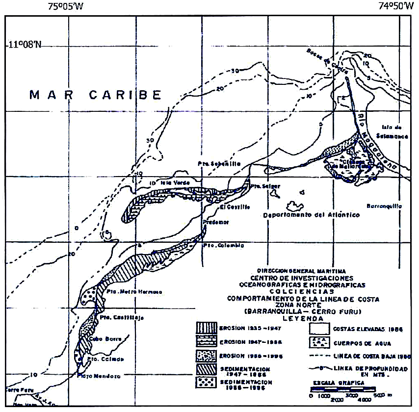
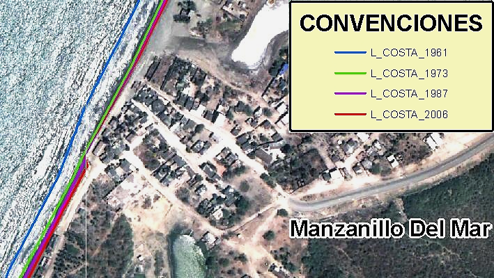
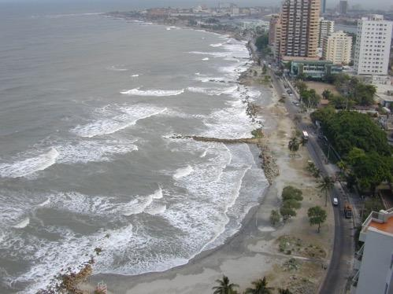
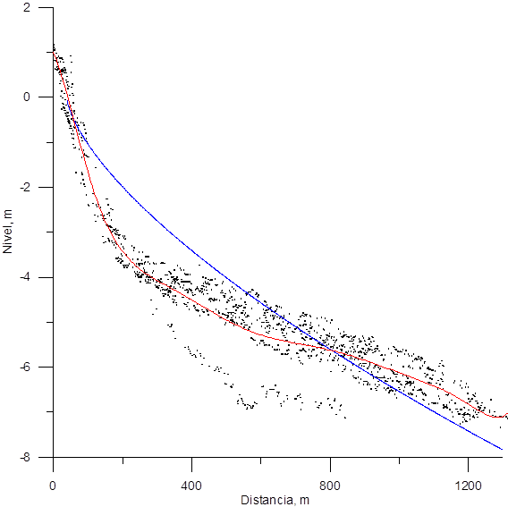
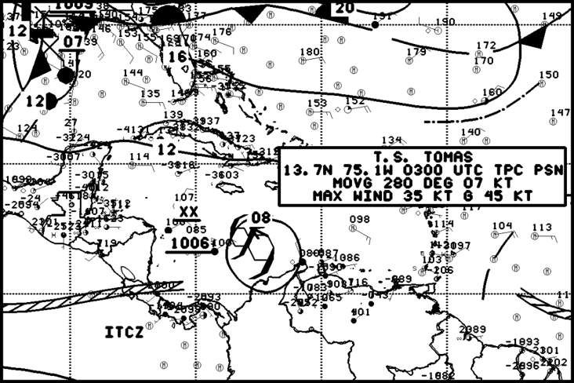
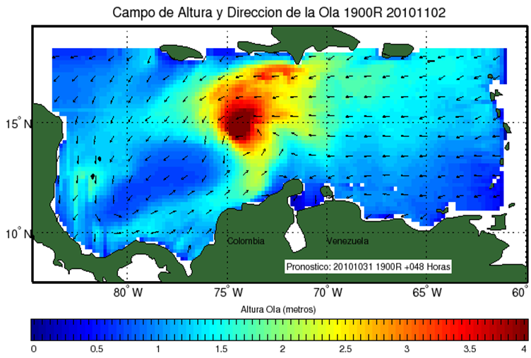
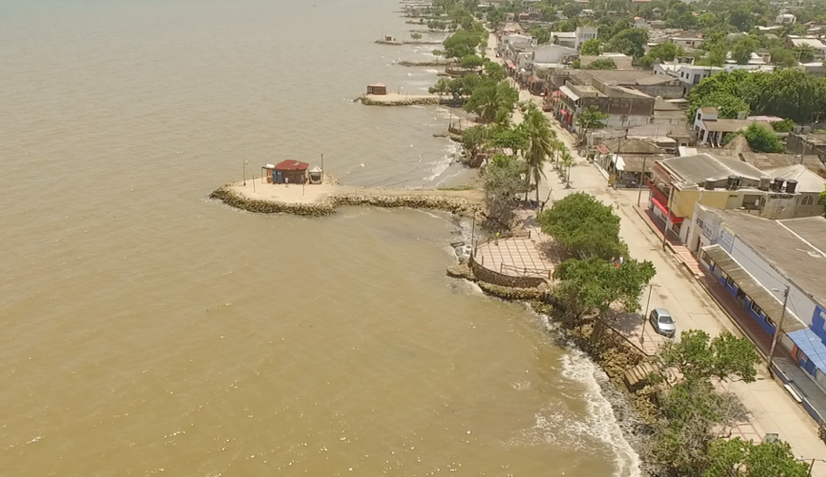
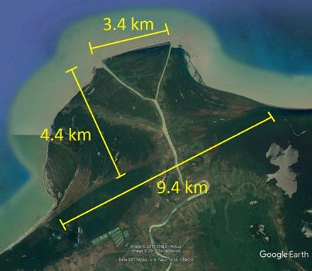

1Grupo de Investigación en Oceanología; Facultad de Oceanografía Física – Escuela Naval de Cadetes “Almirante Padilla”. Isla Naval Manzanillo, El Bosque, Cartagena de Indias, Colombia

*Autor de contacto: Serguei Lonin, 

## Resumen {.unnumbered}

Las estructuras costeras duras son el método preferido usado tanto para mitigar los efectos amenazantes de la erosión en varios ecosistemas como para garantizar el seguro desarrollo de actividades marítimas a lo largo de la costa del Caribe colombiano. Sin embargo, estas obras con frecuencia producen efectos negativos en la zona costera o, eventualmente, resultan siendo obsoletas al no considerar las causas técnicas de la erosión. Las obras costeras, modificando la dinámica local, pueden producir efectos negativos de déficit de sedimentos flujo abajo, provocando erosión. En este capítulo se analizan tres casos relacionados con actividades antropogénicas y procesos naturales cuyo impacto en la dinámica costera se han vuelto progresivamente evidente a través de los años: los tajamares de Bocas de Ceniza, las estructuras costeras del golfo de Morrosquillo y el caso del río Turbo. Las consecuencias no deseadas de estas actividades demostraron la necesidad de generación de conocimiento preliminar detallado de la dinámica costera y de los efectos potenciales de obras de gran escala, previa a la intervención. De todos modos, aunque podría ser imposible de combatir aisladamente (en un solo país) los efectos de largo plazo de los cambios globales tales como el aumento continuo del nivel del mar, los impactos antrópicos locales y regionales todavía pueden ser evitados con un conocimiento más profundo de los procesos costeros. 

**Palabras clave** 

Clima marítimo, espolones, erosión, nivel del mar, protección costera, tajamares

**Coastal Constructions and Maritime Climate: Cases from the Colombian Caribbean**

## Abstract {.unnumbered}

Hard coastal protection structures are the preferred method used both to mitigate the threatening effects of erosion on various ecosystems and to guarantee the safe development of maritime activities along the Colombian Caribbean coast. However, these structures have frequently produced adverse responses in the coastal zones or have eventually become obsolete given the lack of consideration of the technical causes of erosion. Coastal works, modifying local dynamics, can produce negative effects like sediment deficit downstream, triggering coastal erosion. In this chapter, we analyze three cases related to anthropogenic activities and natural processes whose impact on coastal dynamics has become increasingly evident over the years: the jetties at the Bocas de Ceniza, the coastal structures of the Gulf of Morrosquillo, and the Turbo River case. These activities' undesired consequences have demonstrated the necessity of generating detailed preliminary knowledge on coastal dynamics and the potential effects of large-scale works prior to performing interventions. Overall, although it might be impossible to fight, inside one country, the long-term effects of global changes such as the continuous rise of the sea level, the local and regional anthropic impacts may still be avoided by a deeper knowledge of coastal processes.

**Keywords**

Breakwaters, coastal protection, erosion, jetties, maritime climate, sea level

## INTRODUCCIÓN {.unnumbered}

Las costas del Caribe colombiano en gran parte están compuestas de material arenoso con poca fracción de los finos cohesivos. En su mayoría, estas arenas son resultado del aporte de los ríos, arroyos y, en menor medida, de la abrasión de acantilados. Para las áreas coralinas, el material es calcáreo resultado del ciclo de vida de arrecifes de coral y la erosión paulatina de las terrazas marinas. 

La predominancia del oleaje sobre la marea astronómica (costa dominada por energía de olas) hace importantes las corrientes inducidas por olas en las zonas de rotura como el principal mecanismo de transporte litoral de arenas, conformación de playas o erosión costera. Por lo anterior, la estabilidad de una franja costera naturalmente depende de la disponibilidad de sedimentos de una fuente, pero también de la redistribución espacial de sedimentos a lo largo de la costa. Este último está relacionado con los procesos geológicos y geomorfología costera. Los efectos de las obras antrópicas, a su vez, compiten con los de las geoformas naturales y su influencia puede tener efectos dramáticos, si previamente no se estudian profundamente sus impactos. 

Las obras costeras más empleadas en Colombia son los espolones, debido a su bajo costo por ser construidos desde la tierra (sin requerir embarcaciones, por lo tanto más económicos). Normalmente los espolones son retenedores de sedimento, generando una acumulación de arenas en un lado y erosión por el otro, dependiendo de la dirección de la deriva litoral. El clima del Caribe posee carácter bimodal, combinando el oleaje del régimen de los vientos alisios y los casos atípicos de los frentes fríos y ciclones tropicales. Como regla, los espolones se orientan de acuerdo con la dirección de las olas del régimen y cualquier alteración de este régimen por los eventos extremos resulta en que los espolones produzcan efectos nocivos, normalmente relacionados con la pérdida de sedimentos en las playas. Además, su construcción debe ser bien justificada, teniendo en cuenta que la ausencia de los sedimentos en la fuente hace que dichas obras tiendan a quedar obsoletas. Desafortunadamente, la no identificación previa (diagnóstico mal realizado o faltante) de las causas de erosión en un sector dado y los métodos empíricos que se emplean en la mayoría de los casos para el diseño de estas obras, son dos principales razones de los fracasos o de la poca eficiencia de las estructuras de protección costera.

En el presente capítulo se describen algunos casos de efectos naturales y obras construidas en la costa del Caribe colombiano, haciendo énfasis en las causas antrópicas regionales y locales versus el aumento del nivel del mar, cuyo efecto, aunque existe, no debe considerarse como la única o principal causa de los problemas costeros. Sin pretender ahondar demasiado en los aspectos técnicos, este apartado busca dejar en evidencia ante el público general que se hace necesario una gestión inteligente de la protección costera, donde se tomen decisiones bien informadas sobre una sólida base científica por encima de otras consideraciones.

::: {.caja-box}
**Caja 1.** Definiciones Costa dominada por energía de olas: predominancia climática de la acción de olas sobre la variación de la marea astronómica como una proporción entre altura significante de la ola (H) y el rango de la marea (TR), 0.5 < TR/H < 1 [9].  Aumento del nivel del mar: usualmente se refiere al aumento global del nivel medio de la superficie de los océanos debido al calentamiento de la Tierra.  Erosión costera: retroceso de la línea de costa y pérdida de los sedimentos en el perfil subacuático adyacente relacionados con déficit de aporte sedimentario de una fuente o con la obstaculización, antrópica o natural, del transporte litoral.

:::

## OBRAS COSTERAS Y SU EFECTO {.unnumbered}

El aumento global del nivel del mar es un hecho y para el futuro próximo tendrá un incremento más progresivo [1-4]. También es conocido y cuantificable con una regla de Bruun [5] que las playas con menor pendiente sufren la erosión costera debido al aumento del nivel con mayor magnitud que las costas abruptas. Por lo anterior, los escenarios de riesgo podrían caracterizarse en una primera aproximación para todo el país con base en un relativamente simple análisis topográfico de los perfiles subacuáticos de las playas.

Sin embargo, la vulnerabilidad de las costas depende también de una serie de factores de carácter regional y local, frecuentemente causadas por otros impactos antrópicos inconscientes desde el punto de vista de la magnitud de las consecuencias que generan. Si la causa global del calentamiento y aumento del nivel del mar no se puede combatir a nivel de un solo país, las causas regionales y locales sí se pueden regular y controlar y, de esta forma, mitigar el efecto de la erosión costera en muchos casos específicos.

Uno de los primeros ejemplos presentados aquí, se refiere al efecto de los tajamares de Bocas de Ceniza. Son obras costeras conocidas como *jetties*, cuyo propósito es estabilizar la desembocadura de un río, en el caso dado, del río Magdalena. Inaugurados en el año 1936, causaron un efecto regional de erosión costera, el cual se manifestó de forma evidente durante las décadas posteriores a su construcción. El río Magdalena es uno de los aportantes más significativos de sedimentos para las costas caribeñas de Colombia [6]: alrededor de un 85% del material que transporta son limos y arcillas; siendo éstas partículas muy finas, generalmente se propagan en estado de suspensión, generan una pluma turbia en la desembocadura y parcialmente se precipitan en su vecindad por el proceso de floculación de las partículas en un frente halino con una salinidad entre 5 y 10. Sin embargo, por los mecanismos del lavado por oleaje, estas partículas no componen mayor parte de los sedimentos en las playas del Caribe colombiano en el tramo de influencia del río. El 15% del material restante transportado por el Magdalena, son arenas, cuya predominancia en las playas es evidente. 

En los años 50, el ingeniero español Iribarren proyectó el espolón más largo en Colombia de aquella época (150 metros construidos), considerando que el fin de la deriva litoral de sedimentos del río Magdalena en el margen occidental es la ciudad de Cartagena, concretamente el extremo de su flecha litoral de Bocagrande (Fig. 1). Por otro lado, actualmente se considera [7, 8] que el fin de la deriva litoral por el lado oriental es la Boca de la Barra de la Ciénaga Grande de Santa Marta, la parte más frágil de la flecha litoral conformada por la deriva, separando el mar Caribe y la ciénaga. Una vez diagnosticado el tramo de influencia del río, se puede realizar el análisis de los procesos de erosión-sedimentación, relacionados con el aporte de las arenas por el río, la principal fuente de sedimentos en esta región (la abrasión de acantilados) produce una cantidad de sedimentos, pero se sabe que es una fuente secundaria para la mayoría de las costas en el mundo [9]).

**Figura 1.** Características de la dinámica litoral de la flecha de Bocagrande: a) Espolón de Iribarren; b) Ciudad antigua, *head-land*; la línea amarilla demuestra el perfil de equilibrio en planta de Hsu que evidencia que en la época colonial existió una comunicación entre el mar y la bahía de Las Animas. Fuente: Google Earth (2019), autores.

Los tajamares de las Bocas de Ceniza interrumpieron el transporte de la deriva litoral de sedimentos. El efecto negativo fue observado prácticamente de inmediato en el retroceso de la flecha de la Ciénaga de Mallorquín. La dinámica multianual de esta flecha se presenta en la Figura 2. 

**Figura 2.** Comportamiento de la línea de costa en la zona norte del departamento del Atlántico entre 1935 y 1996 [10], se reproduce bajo licencia Creative Commons.

Era de esperar que la respuesta del sistema costero en forma de retroceso tuviera efecto en los tiempos directamente proporcionales a la distancia de la fuente de arena (Bocas de Ceniza). Por lo tanto, el caso de desaparición de la Isla Verde en los años 1935 a 1947 fue detalladamente estudiado en [10], entre otros. En [11] incluso calculan una tasa de desplazamiento de sedimentos en el tramo de Isla Verde a Puerto Colombia de 430 m/año, formando nuevas acumulaciones de arena frente a la costa de este municipio. Lo sorprendente es que, en distancias de más de una centena de kilómetros desde la boca del río, el estudio [12] demostró una respuesta drástica en la zona norte de Cartagena (Fig. 3) para los años 60–70 del siglo pasado con un retroceso de orden de 100 m, es decir, unos 30 años después de la culminación de la obra de los tajamares. 

**Figura 3.** Variación multianual de la línea de costa en el sector Manzanillo del Mar (zona norte de Cartagena de Indias). Imagen del fondo: Google Earth. Estudio geomático [12].

Por el otro lado de la desembocadura del río Magdalena, la isla de Salamanca aún sigue sufriendo el impacto de las obras de los años 30 (Fig. 4), dónde el retroceso para los últimos 60 a 70 años es del orden de los 800 metros.

**Figura 4.** Retroceso costero (línea azul) con respecto a la cartografía del año 1944 en el sector de la Isla Salamanca. Se observa el efecto del déficit de sedimentos provocado por las obras de tajamares. Tramo: Barranquilla-Ciénaga. Fuente: [7].

Siendo los tajamares de Bocas de Ceniza la principal causa de erosión costera durante las décadas en la región de influencia del río Magdalena, es importante señalar que a nivel local existen otras causas antrópicas de este proceso. Volviendo a la Figura 1, se puede observar que la ciudad de Cartagena de Indias fue fundada sobre una base sólida, conocida en la bibliografía como *head-land* [9]. Esta punta, indicada en la Figura 1 con un círculo rojo, produce una difracción importante de oleaje en la flecha litoral de Bocagrande tendiendo a romper sobre una línea de equilibrio en planta, llamada el perfil de Hsu [9]. Resulta que la expansión de la ciudad durante los últimos 50 años hacia la flecha de Bocagrande se materializó en el enrocado de la orilla en el tramo cercano a la punta (de cierta forma con el intento de estabilizar la flecha), y en las construcciones costeras, como la primera avenida y las edificaciones a lo largo de Bocagrande. 

El primer factor (*head-land*) ha venido generando una manifestación natural de los procesos morfodinámicos en planta, mientras que el segundo (infraestructura urbana) provocó un déficit de sedimentos a lo largo del perfil activo subacuático. La Figura 5 muestra la forma no equilibrada de la línea de costa, el resultado del enrocado y también permite observar que debajo de la superficie del agua, entre 1 y 5 m de profundidad (a distancias de 100 y 800 m de la orilla) hay un déficit de sedimentos. Mientras que este déficit exista, ningún espolón con longitudes inferiores a las distancias señaladas y ningún relleno hidráulico de la parte seca de la playa recuperarían la situación crítica, plenamente antrópica.

**Figura 5.** Izquierda: vista de Cartagena desde el espolón Iribarren hacia head-land de la ciudad vieja (Fig.  1). Derecha: Perfiles subacuáticos de la playa de Bocagrande (puntos negros) con un perfil promedio (en rojo) y el perfil de equilibrio de Dean (en azul). Fuente: propia.

Cabe mencionar que las inundaciones de las calles marginales al malecón de Bocagrande, incluso cuando inicialmente sean producto de lluvias fuertes, vuelven a terminar como una intrusión del agua salada del mar. El agua de lluvia, evacuándose por las calles hacia el mar, socava unos canales de escorrentía, a través de los cuales el agua salada entra con ayuda de olas de mar de fondo de los frentes fríos, típicos para la época húmeda del año.

El efecto de los ciclones tropicales sobre las costas del Caribe colombiano es poco evaluado. La Figura 6 (arriba) muestra el mapa sinóptico correspondiente al ciclón tropical Tomas (año 2010) en el centro del Caribe en su categoría de depresión tropical. Al momento de esperar las ondas de mar de fondo irradiadas por el ciclón y provenientes de él hacía las costas colombianas, el modelo espectral de oleaje (Fig. 6 abajo) implementado en el Centro de Investigaciones Oceanográficas e Hidrográficas del Caribe [13, 14] mostró un efecto particular: La Zona de Convergencia Intertropical, atraída por el sistema de baja presión asociado al centro de la D.T. Tomas, generó vientos fuertes y oleaje que afectaron de manera progresiva todas las costas del Caribe colombiano desde del Golfo de Urabá (en menor medida) hasta la Guajira (daños importantes y retroceso de la línea de costa en algunos sectores superando 50-80 m), evidenciado en posterior inspección física por parte de las autoridades [15]. Por lo anterior, es importante tener en cuenta el clima marítimo en el momento de toma de decisiones sobre las posibles medidas de mitigación de impactos de la naturaleza. 

**Figura 6.** Arriba: Situación sinóptica para el día 3 de noviembre del 2010, indicando el paso de la depresión tropical Tomas. Fuente: Centro Nacional de Huracanes, 2010. Abajo: Pronóstico de oleaje con el sistema SPOA para la fecha 02/11/2010 [13].

Ahora bien, si las condiciones climáticas son tan relevantes, sin discutir los eventos más extremos posibles ocurridos en las costas del Caribe, es evidente que nuestra actuación sobre las medidas de recuperación de playas no es siempre adecuada. Las razones de una mala interpretación de la dinámica marina y costera principalmente se encuentran en el desconocimiento o desconsideración de las causas de los procesos costeros. Las fotos de la Figura 7 demuestran completa ausencia de las arenas en dos sectores del Golfo de Morrosquillo donde en épocas anteriores se encontraban playas, como lo refieren los nativos del sector. La razón de ser construidas estas obras era la expectativa de ganar las playas mediante unas obras duras, sin considerar la viabilidad técnica y sin estudios previos.

**Figura 7.** Fotos de obras de protección costera en el Golfo de Morrosquillo, donde se evidencia su obsolescencia. Arriba: Berrugas. Abajo: Santiago de Tolú. Fuente: propia.

El caso del Golfo de Morrosquillo es un ejemplo muy ilustrativo, cuando en el medio de más de 150 espolones construidos, ninguno resulta ser útil. Desde la época de los trabajos de Lorin et al. [16], mediante el análisis de granulometría de sedimentos del fondo fue determinado que la deriva litoral en este golfo proviene desde el río Sinú, abasteciendo con el material arenoso al menos la mitad de sus playas. El estudio [17], basado en la modelación numérica de la deriva litoral de sedimentos, confirmó esta conclusión. Sin embargo, si se analiza el avance de la acreción del delta del río Sinú (Fig. 8), es evidente de que la formación deltaica de las últimas décadas frenó el aporte de sedimentos, tanto para el norte, como para el sur de la desembocadura [18]. El golfo actualmente no posee los sedimentos arenosos en abundancia, como en el pasado, tanto en sus orillas, como el mar afuera. El anterior es un caso que está asociado con la posición geográfica (que influye directamente en la energía del oleaje y la capacidad potencial de transporte de sedimentos) combinada con cambios morfodinámicos en la fuente del material, naturales [18] o antrópicos [8]. De hecho, si en el estudio [8] se afirma la construcción de embalses en el cauce del río mucho más arriba de su delta, estancando los sedimentos gruesos, entonces en el trabajo [18] se señalan, como las causas del crecimiento del delta, tanto los procesos naturales, como la construcción alrededor del año 1938 de un canal próximo a la costa, resultando el abandono del delta de la bahía de Cispatá y la formación del delta de Tinajones (Fig. 8b).

**Figura 8. **Delta del río Sinú en acreción. Fuente: Google Earth, 2019. Izquierda: Dimensiones del delta crecido desde el año 1938. Derecha: Dirección del cauce antiguo (1) según [18] y el brazo de Tinajones (2); la línea amarilla está trazada por el contorno visible en la figura izquierda de cambios fisiográficos y de vegetación.

Las dimensiones de acreción del delta, observadas en la Figura 8, se estiman alrededor de 18 km2 del área, lo que implica una acumulación superior a 200 millones de metros cúbicos de las arenas (estimación propia). Sin embargo, a pesar de que este sedimento, debido a causas naturales o antrópicas, dejó de llegar a las playas de la región, la *inercia* en la mentalidad sobre las posibles medidas de recuperación de playas continúa desde hace varias décadas, resultando la presencia y tendencia actual de seguir construyendo las obras pétreas de la protección costera, donde su efecto es nulo debido al déficit del sedimento. 

En el caso del río Magdalena el impacto fue causado por una mega obra construida entre 1930 y 1936, sin embargo, en el clima de olas existe suficiente energía para el transporte del material; para el caso de los aportantes más pequeños, las alteraciones en la fuente de sedimentos pueden ser poco apreciables, pero las consecuencias igualmente notorias. Es el caso del río Turbo. La Figura 9 demuestra la evolución de la línea de costa del sector entre 1946 y 2005.

**Figura 9.** Variación de la línea de costa entre la desembocadura del río Turbo, la flecha de Yarumal y la flecha de Punta de Las Vacas entre 1946 (foto aérea) y 2005. (Golfo de Urabá). Los contornos en color representan áreas erosionadas (rojo) y sedimentadas (verde) [19].

Resulta que el uso del agua del río en agricultura, la alteración de su caudal y cauce [20], produjo a partir de los años 60 del siglo XX unas alteraciones en la dinámica de la desembocadura con el crecimiento de su espacio deltaico. Interactuando con el oleaje del clima regional (cuya energía se conserva), el crecimiento deltaico progresó, haciendo la incidencia de los trenes de olas más perpendicular con respecto a la costa norte del delta [19] e impidiendo el transporte de sedimentos hacia el sur de la desembocadura. A su vez, esto produce mayor acumulación del sedimento en el delta, creciendo de manera proporcional a la tasa de avance de erosión costera flujo abajo, provocando la pérdida del terreno en el casco urbano de la ciudad, considerado en [20] como un ejemplo más para ilustrar la importancia del conocimiento científico sobre los procesos costeros y las afectaciones que hemos hecho a nivel regional y local. 

::: {.caja-box}
**Caja 2.** Causas del transporte litoral de sedimentos El transporte litoral de sedimentos bajo el régimen micro-mareal está causado por la rotura de olas de viento en la zona costera, donde el frente de oleaje se refracta buscando llegar de forma normal a las isóbatas. Un pequeño ángulo entre la incidencia de las olas y los contornos batimétricos provoca un movimiento de aguas y sedimentos a lo largo de la costa. En presencia de una desembocadura, el aporte sedimentario del río es capaz de producir una acreción y hasta una formación deltaica. El crecimiento del delta de un río, por causa natural o antrópica, puede obstaculizar el transporte litoral debido al cambio de incidencia del oleaje sobre esta costa deformada. El proceso es progresivo en la medida de que a mayor crecimiento del delta, mayor alteración de la deriva litoral se produce y menor cantidad de sedimento flujo abajo aporta este río.

:::

¿Cuál es entonces el impacto de los cambios climáticos en la erosión costera, manifestados al menos en el aumento del nivel del mar, en comparación con las causas antrópicas locales? Definitivamente, el aumento del nivel del mar está causando siempre una erosión, nunca acreción en una costa dada. Estos cambios de escala global, al sumarse con aquellos de escala local y regional, incrementan el proceso de erosión costera, cuya dinámica sería menos pronunciada con un buen manejo de las costas.  

## CONCLUSIONES {.unnumbered}

La erosión se clasifica como una amenaza para la población, infraestructura y actividades humanas en la zona costera. Las obras de mitigación de la erosión en las costas del Caribe colombiano, en general, hasta la fecha se caracterizan como obras *duras*, generalmente de material pétreo y, con mayor frecuencia, éstas son espolones debido a su bajo costo de construcción y mantenimiento. 

Sin embargo, es de resaltar la importancia de un diagnóstico detallado de las causas de erosión costera, antes de cualquier intervención mediante las obras. Las mismas estructuras podrían generar efectos negativos si las causas no fueron determinadas. 

De acuerdo con lo analizado, dichas causas pueden tener el carácter global, regional, de meso-escala y/o local. La primera y segunda pueden ser reflejo de las actividades humanas a nivel global: el calentamiento global afecta el nivel del mar, lo que directamente tiene influencia sobre la erosión costera; otros efectos de variación climática cambian caudales de los ríos, el transporte de sedimentos y, por ende, posible disminución del transporte en la deriva litoral. Estos factores son *externos* en el sentido que deben ser estudiados, pero no pueden ser mitigados a nivel de un solo país.

Existen casos cuando las acciones antrópicas mediante mega obras afectan toda una región, pero, sin embargo, lo más frecuente es observar los efectos de menor escala de obras costeras pequeñas, también impactantes, pero inconscientemente ignorados. Son aquellos que corresponden a las construcciones urbanas dentro de la franja activa de una playa, pavimento y enrocado de las orillas, edificaciones, préstamo del material mineral y, finalmente, obras de protección costera no adecuadas para los sectores aledaños.  

El problema de erosión crónica usualmente se asocia con el déficit de sedimentos de origen lejano o el aumento paulatino del nivel del mar, pero también puede depender de la estabilidad del perfil subacuático. Este caso se relaciona directamente con el impacto antrópico sobre las costas (construcciones en la playa seca). 

En la práctica de la ingeniería costera hay que implementar las obras acordes con el clima marítimo, siempre y cuando las consecuencias de las condiciones atípicas (no del régimen) se minimicen pronto de manera natural o deben ser recuperadas mediante rellenos de mantenimiento. Las canteras en muchos casos podrían considerarse como posibles zonas de préstamo con un relleno mecánico de las playas, teniendo en cuenta que el clima de oleaje no presenta una estacionalidad fuerte, diferente de los países nórdicos donde el mantenimiento del relleno se realiza anualmente. La principal recomendación para el material de préstamo para el relleno es que éste debe ser preferiblemente más grueso que el sedimento nativo para garantizar mejor estabilidad de la playa; con esto, además, el perfil de equilibrio va a tener una inclinación mayor, lo que requiere menor volumen de material que un relleno de composición similar al sedimento original.

Pero lo más relevante en este proceso es un diseño adecuado basado en el diagnóstico de causas y correcta elección entre diversas alternativas de solución. Esta gestión inteligente de las obras costeras, puede ser una garantía en la mitigación de los posibles efectos negativos. El entender que la base científica de la dinámica litoral es primordial ante las evaluaciones económicas de corto plazo, seguramente llevará a una eficiente protección de las actividades marítimas en nuestras costas. 

Además, es relevante quitar la brecha entre la teoría y la práctica, el conocimiento de la academia y la experiencia de la ingeniería costera [21].

| PUNTOS CLAVE En la erosión costera existen causas locales, regionales y globales. Usualmente las causas globales se relacionan con el aumento de nivel del mar y probablemente con alteraciones de otros parámetros del sistema climático de la Tierra. Las causas locales y regionales generalmente se deben a las intervenciones de los sistemas marítimos y fluviales mediante estructuras costeras, las cuales pueden tener un propósito para protección o aprovechamiento del litoral. Una obra de protección mal diseñada puede causar erosión en las áreas adyacentes a ella. A lo largo de las costas del Caribe colombiano se ubican varias construcciones con diferentes fines, que causan impactos negativos de retroceso de la costa a mediano y largo plazo, comparables con el efecto paulatino de aumento del nivel del mar. Con el fin de tomar decisiones más acertadas sobre la gestión de riesgos costeros, se debe contar con la participación de personal capacitado, herramientas científicas y capacidades tecnológicas, específicamente enfocadas en esta problemática. |
| --- |

**CONFLICTO DE INTERESES**

Los autores no declaran conflicto de intereses.

**IDENTIFICACIÓN DE AUTOR**

Serguei Lonin      

Julio Monroy       

## BIBLIOGRAFÍA {.unnumbered}

Douglas, B. C. (1991). Global sea level rise. *Journal of Geophysical Research: Oceans*, 96(C4), 6981-6992. https://doi.org/10.1029/91JC00064

Rahmstorf, S. (2007). A semi-empirical approach to projecting future sea-level rise. *Science*, 315(5810), 368-370. 

Cazenave, A., & Llovel, W. (2010). Contemporary sea level rise. *Annual review of marine science*, 2, 145-173. https://doi.org/10.1146/annurev-marine-120308-081105

DeConto, R. M., & Pollard, D. (2016). Contribution of Antarctica to past and future sea-level rise. *Nature*, 531(7596), 591. 

Bruun, P. (1988). The Bruun rule of erosion by sea-level rise. *Journal of Coastal Research,* 4(4), 627-648. 

Corredor, H., J.C. Mantilla, G. Vargas (2008) Caracterización hidráulica y Sedimentológica del Río Magdalena entre El Puente Pumarejo (k22) y Bocas de Ceniza (k0). En M. Alvarado (Ed.) *Río Magdalena. Navegación Marítima y Fluvial* (1986-2008). Ediciones Uninorte, Barranquilla, Colombia.

Promigas (2003). *Estudio de la línea de costa entre Bocas de Ceniza y la boca del río Toribio*. Informe técnico CIOH, mayo de 2003.

Rangel-Buitrago, N.G., Anfuso, G., & Williams, A.T. (2015). Coastal erosion along the Caribbean coast of Colombia: Magnitudes, causes and management. *Ocean & Coastal Management*, 114, 129-144.

Van Rijn, L.C. (1998). *Principles of Coastal Morphology*. Aqua Publ. The Netherlands.

Molina, A., Molina, C., Thomas, Y., & Molina, L. E. (2001). Comportamiento de la línea de costa del Caribe colombiano (Sector entre Barranquilla, desde Bocas de Ceniza hasta la Flecha de Galerazamba 1935-1996). *Boletín Científico CIOH*, 19, 68-79. 

Martinez, J. O., Pilkey, O. H., & Neal, W. J. (1990). Rapid formation of large coastal sand bodies after emplacement of Magdalena river jetties, Northern Colombia. *Environmental Geology and Water Sciences*, 16(3), 187-194. 

Oceanmet (2011). *Estudio Oceanográfico para el área de Los Morros. Empresa de Desarrollo de Los Morros, Sucursal Colombia*. Informe Técnico.

Pronósticos meteomarinos del CIOH: 

Anduckia, J.C. & Lonin, S. (2014). Acople entre modelos numéricos en el Sistema de Pronósticos Oceánicos y Atmosféricos (SPOA). *Boletín Científico CIOH*, 32, 197-210. 

Lonin, S. (2010). *Informe pericial de la Capitanía de Puerto de Cartagena*. Diciembre de 2010.

Lorin et al. (1973). *Estudio del régimen del Golfo de Morrosquillo, Protección de playas en Tolú. Informe General*. Cartagena.

Lonin, S.A. (2002). Aplicación del modelo LIZC (CIOH) para el estudio de la dinámica de playa en un sector del Golfo de Morrosquillo. *Boletín Científico CIOH*, 20, 18-27. 

Robertson, K., & Chaparro, J. (1998). Evolución histórica del delta del río Sinú. *Cuadernos de Geografía*, VII(1-2), 70-86.

N&M (2005). *Estudio de factibilidad de construcción de un puerto marítimo en el Golfo de Urabá*. Informe técnico - Naval & Marítima Ingeniería Ltda.

Alcántara-Carrió, J., Caicedo, A., Hernández, J.C., Jaramillo-Vélez, A., & Manzolli, R.P. (2019). Sediment Bypassing from the New Human-Induced Lobe to the Ancient Lobe of the Turbo Delta (Gulf of Urabá, Southern Caribbean Sea). *Journal of Coastal Research*, 35(1), 196-209.

Kamphuis, J.W. (2011). Coastal Engineering – Theory and Practice. *The Proceedings of the Coastal Sediments 2011*, Miami, FL, 02-06 May 2011, 1-14.

13

