::: {#resumen}
## Resumen {.unnumbered}

El modelo de gestión del riesgo para la erosión costera, propone un proceso integral que va de una escala regional a una local, partiendo del conocimiento del fenómeno. Incluye el trabajo integrado entre las instituciones ambientales, los entes territoriales y la comunidad, el monitoreo técnico del fenómeno y los estudios de amenaza y vulnerabilidad por erosión costera, los cuales permitieron identificar las zonas críticas del departamento. Al aumentar la escala y resolución del estudio se definió un modelo conceptual con una propuesta de alternativas mixtas, donde se incluye métodos basados en ecosistemas, que puedan mitigar los impactos. Por último, se realizaron los estudios científicos de detalle (físico, biótico y social) y de validación de estas alternativas y su priorización para ejecución, teniendo en cuenta las políticas o herramientas de planificación del territorio. Convirtiéndose este, en un proceso detallado y planificado para hallar las mejores alternativas de mitigación, prevenir daños y ahorrar costos en alternativas que no generen los efectos positivos esperados. La implementación de esta metodología en el corregimiento de Santander de la Cruz permitió priorizar las alternativas de la siguiente manera: (1) recuperación de las puntas de la bahía con base en la estabilidad del acantilado, (2) manejo de las fuentes de sedimento, (3) control de la extracción de arena, (4) intervención con arrecifes artificiales o barreras sumergidas, (5) reforestación de manglar o bosque seco, y (6) reubicación. 

**Palabras clave**

Adaptación basada en ecosistemas, alternativas de mitigación y control, amenaza y vulnerabilidad, geoamenazas, gestión del riesgo

**Risk Management and Analysis Model for Coastal Erosion. Case Study Department of Córdoba**

:::

::: {#abstract}
## Abstract {.unnumbered}

The risk management model for coastal erosion proposes an integral process that goes from a regional to a local scale, based on knowledge of the phenomenon. It includes integrated work between environmental institutions, territorial entities and the community, technical monitoring of the phenomenon and studies of hazard and vulnerability by coastal erosion, which allowed identifying the department's critical areas. By increasing the study's scale and resolution, a conceptual model was defined with a proposal for mixed alternatives, including ecosystem-based methods that can mitigate the impacts. Finally, the detailed scientific studies (physical, biotic and social) and validation of these alternatives and their prioritization for execution were carried out, taking into account the planning policies or tools of the territory. Turning this into a detailed and planned process to find the best mitigation alternatives, prevent damage and save costs on alternatives that do not generate the expected positive effects. The implementation of this methodology in the district of Santander de la Cruz allowed prioritizing the alternatives as follows: (1) Recovery of the tips of the bay based on the stability of the cliff, (2) management of sediment sources, (3) control of sand extraction, (4) intervention with artificial reefs or submerged barriers, (5) reforestation of mangroves or dry forest, and (6) relocation.

**Keywords**

Alternatives for mitigation and control, ecosystem-based adaptation, geohazards, hazard and vulnerability, risk management

:::

## 13.1 INTRODUCCIÓN

Las zonas costeras cada vez tienen más presiones antrópicas, principalmente asociadas al turismo y las actividades portuarias, generando mayor ocupación, transformación y degradación de ecosistemas, lo que muchas veces se refleja en impactos negativos sobre el paisaje y el territorio. Sumado a todo esto, se encuentran las diferentes amenazas costeras, que en algunos casos se aceleran por procesos relacionados con el cambio climático, entre ellos encontramos huracanes, tsunamis, mares de leva, frentes fríos, erosión costera y ascenso del nivel de mar [[1]](#ref-1), que terminan por aumentar el peligro y por consiguiente el riesgo de los diferentes elementos expuestos de la zona costera [[2]](#ref-2). 

Con respecto a la erosión costera, esta se define como la invasión de la tierra por el mar, o como el retroceso de la línea de costa con pérdidas importantes de terrenos que albergan ecosistemas aptos para las actividades humanas [[3]](#ref-3) y entre las causas naturales de la erosión costera se encuentran el aumento del nivel del mar (ANM), los eventos climáticos extremos, las características de las rocas y sedimentos, movimientos verticales del terreno, entre otros [[4]](#ref-4), lo cual desequilibra el balance de sedimentos, fundamental en sectores de playa. Pero también se encuentran causas relacionadas con la intervención humana, las cuales son muchas y son probablemente las responsables del aumento en la tasa de erosión, como por ejemplo la mala gestión de las zonas costeras, la extracción de arenas y guijos en las playas o en el lecho de los ríos; la tala indiscriminada del mangle y el daño a los arrecifes de coral (ecosistemas que dan una importante protección natural a la línea de costa), la construcción de represas que alteran el aporte de sedimentos desde las cuencas, la instalación de obras fijas que perturban los procesos de transporte litoral, etcétera .

Para poder sobrellevar todas estas acciones, impactos y causas, toma importancia la planificación costera, la cual en general se desarrolla en el mundo y en Colombia [[5]](#ref-5), [[6]](#ref-6), y la planificación en relación directa con los procesos de erosión costera, la cual se ha visto con diferentes enfoques como la gestión del territorio y específicamente las alternativas de adaptación y mitigación de obras en general [[7]](#ref-7), [[8]](#ref-8), [[9]](#ref-9), y basada en ecosistemas [[10]](#ref-10), [[11]](#ref-11), [[12]](#ref-12). No hay muchos trabajos relacionados con la gestión del riesgo para la erosión costera y los que se han realizado abordan índices de riesgo, políticas o estrategias integrales [[13]](#ref-13), [[14]](#ref-14), [[8]](#ref-8).

La gestión del riesgo de desastres es un enfoque de gestión por procesos, lo que permite implementar la gestión en un sentido transversal, que parte del conocimiento del riesgo de desastres, permitiendo tomar medidas correctivas y prospectivas para la reducción del riesgo y fortalecer el proceso del manejo de desastres [[4]](#ref-4). En la gestión del riesgo de desastres es de vital importancia el conocimiento de las amenazas como la erosión costera, y su mitigación es un reto para el mundo y para el país. Para lo cual el análisis de amenaza y vulnerabilidad por erosión costera se convierte en un insumo importante en la gestión del riesgo por este fenómeno, además de constituir información clave para el ordenamiento de las zonas costeras y la generación de los planes o esquemas de ordenamiento territorial, y donde se debe velar por su inclusión en los instrumentos de planificación, en la educación ambiental y los proyectos de adaptación basados en ecosistemas [[4]](#ref-4), [[15]](#ref-15).

A nivel mundial son diversos los métodos o alternativas que existen para defender la costa de la erosión. Sin embargo, ninguna técnica resulta adecuada si carece de estudios pertinentes que garanticen su eficiencia. Algunos de los métodos más empleados comprenden “obras duras” que modifican la dinámica (muros, espigones, rompeolas) causando la reflexión, difracción o refracción de las olas incidentes, pero la experiencia a nivel mundial ha demostrado que estos tipos de estructuras solo tienen efectos positivos en el ámbito local y a corto plazo [[16]](#ref-16), [[17]](#ref-17). Por otro lado, también existen alternativas y métodos blandos o algunos ejemplos de estrategias de defensa basadas en la naturaleza, como restauración de manglares, arrecifes, cultivo de ostras, entre otros [[18]](#ref-18), las cuales no alteran la dinámica costera normal, ya que proponen la simple reconstitución de la playa o ecosistema costero original, controlando la energía de olas, la composición granulométrica y la pendiente de la playa [[19]](#ref-19). De acuerdo con ello y fundamentados en los estudios realizados anteriormente en cada una de las áreas prioritarias, y como avance en el conocimiento y aportando lineamientos para el control de la erosión en la zona costera del departamento de Córdoba, se plantean alternativas para la mitigación basadas en medidas blandas y duras o mixtas, que incluyen además estrategias de planificación y ordenamiento del territorio. 

Por último, para poder llegar a los Planes Locales de Ordenamiento del Territorio (POT) o planes de etno-desarrollo, es necesario entender el territorio, el cual es un concepto multidimensional que delimita la propiedad y garantiza el uso de los recursos contenidos en una porción de superficie terrestre, en donde al interior cohabitan o coexisten grupos sociales con diversos intereses económicos, sociales y culturales, destacando la relación entre el capital y las comunidades locales que privilegian usos ancestrales [[20]](#ref-20). En este mismo territorio convergen estas prácticas sociales, económicas y culturales con todo lo relacionado con el ambiente y sus recursos, obteniendo una visión de paisaje, donde los ecosistemas, el agua, la tierra y el clima juegan un papel fundamental en esta visión integradora del territorio. Bajo esta premisa, la ordenación del territorio debe abordarse a partir de conceptos híbridos como topo-climatología cultural, ciclos hidro-sociales [[21]](#ref-21) o ecología cultural [[22]](#ref-22), [[23]](#ref-23) y perspectivas multidisciplinarias que integren la naturaleza y la sociedad.

### 13.1.1 Área de estudio

El Departamento de Córdoba tiene 172.67 km de línea de costa (WGS-1984-UTM) sobre el mar Caribe, de los cuales 115.62 km son acantilados y 57.05 km son playas y manglares [[4]](#ref-4), se divide administrativamente en cinco municipios costeros: Los Córdobas, Puerto Escondido, Moñitos, San Bernardo del Viento y San Antero (Fig. 1).

**Figura 1.** Área de estudio: Departamento de Córdoba (Municipios de Los Córdobas, Puerto Escondido, Moñitos, San Bernardo del Viento y San Antero).

El corregimiento de Santander de la Cruz hace parte del municipio de Moñitos (Córdoba) y se encuentra entre la punta Coquito y la punta de la Cruz o del Cementerio (Fig. 2). El acceso al corregimiento es por una vía destapada de 9 km desde la entrada sur de la cabecera municipal de Moñitos. El paisaje lo conforman un mosaico de cultivos de plátano, palmas de coco, pastos y bosques.

**Figura 2.** Ubicación del área de estudio para alternativas de adaptación (Santander de la Cruz) y monitoreo basado en cambios de línea de costa (Localidades de municipios).

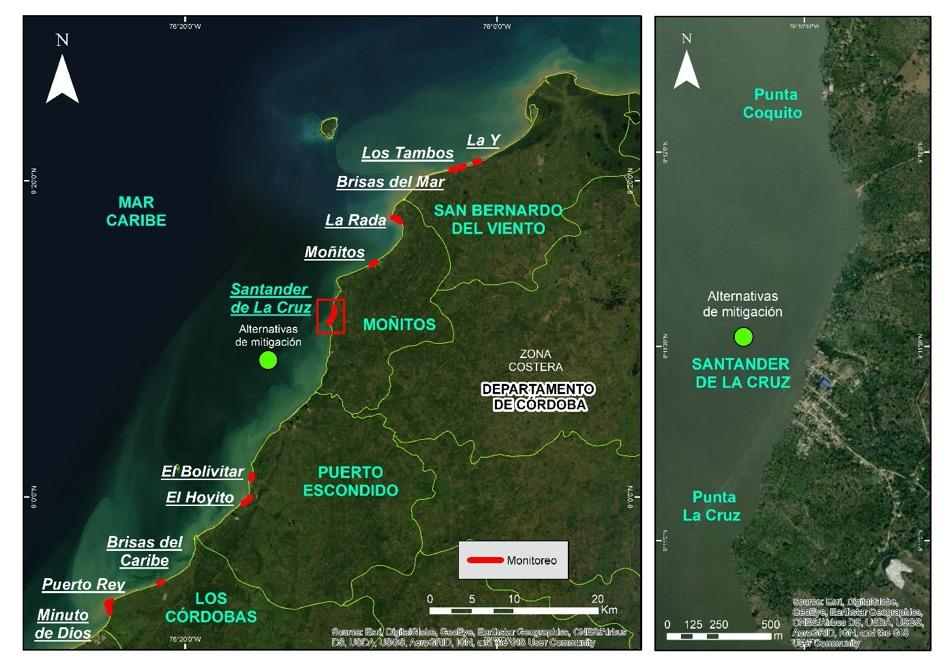

## 13.2 LINEAMIENTOS PARA LA GESTIÓN DEL RIESGO POR EROSIÓN COSTERA (PLAN DE ACCIÓN 2016 – 2020, DEPARTAMENTO DE CÓRDOBA)

El Plan de Acción para la Gestión del Riesgo y la Erosión Costera en el departamento de Córdoba 2016–2020, junto con los lineamientos fueron una herramienta de contribución a la implementación de acciones para el manejo, control, prevención y mitigación de la erosión costera; así como también a la inclusión de la gestión del riesgo por erosión costera. Estos lineamientos se articularon con el PNIEC (Plan Nacional de Investigación de la Erosión Costera [[24]](#ref-24), el cual incluye nueve objetivos que propenden por: 1) caracterizar el riesgo, 2) analizar el escenario de riesgo, 3) mitigar, 4) monitorear, 5) controlar, 6) prevenir y capacitar, 7) intervención correctiva, 8) intervención prospectiva y 9) gestionar. Se sugiere que las autoridades ambientales regionales procuren su ejecución a corto y largo plazo. 

::: {#box1 .callout-important style="background-color: #e3f0fbff; padding:20px; border: none !important;" appearance="minimal" icon="false"}
**Caja 1.** Medidas blandas y duras de acuerdo con escenarios de riesgo De acuerdo con el análisis de los escenarios de riesgo por erosión costera en el departamento de Córdoba, como medidas de mitigación se sugiere la implementación de medidas blandas y duras de la siguiente forma:  Siembra y restauración ecológica del ecosistema de manglar, corales, entre otros. Diseño de relleno artificial de arena y restauración de playas. Obras de disminución de la pendiente de acantilados. Construcción de estructuras duras para la recuperación de las puntas.
:::

Para el desarrollo del Plan de Acción 2016–2020 se identificaron actores de relevancia tales como MADS (Ministerio de Ambiente y Desarrollo Sostenible), DIMAR (Dirección General Marítima de la armada), SGC (Servicio Geológico Colombiano), CIOH (Centro de Investigaciones Oceanográficas e Hidrográficas), INVEMAR (Instituto de Investigaciones Marinas y Costeras, IDEAM (Instituto de Hidrología, Meteorología y Estudios Ambientales), IAVH (Instituto Alexander Von Humboldt), ASOCARS (Asociación de Corporaciones Autónomas Regionales), entes territoriales (alcaldías, gobernaciones), IGAC (Instituto Geográfico Agustín Codazzi), ANLA (Autoridad de Licencias Ambientales), y DNP (Departamento Nacional de Planeación), entre otros. 

Finalmente, el avance del plan de acción 2016–2020 para la Gestión del Riesgo y la Erosión Costera en el departamento de Córdoba, armonizado con los objetivos planteados en el PNIEC se puede resumir de la siguiente manera:

Objetivo 1. Conocimiento del riesgo – caracterización: Abarcó el levantamiento de la línea base de la caracterización del riesgo por erosión costera en el departamento de Córdoba, involucrando la inter institucionalidad representada por CVS, SGC, IGAC, IDEAM, DIMAR, INVEMAR, CIOH, entre otros. 

Objetivo 2. Análisis del riesgo: Para realizar un análisis del riesgo asociado a la problemática de erosión costera en el departamento de Córdoba se identificó y evaluó la amenaza y vulnerabilidad de los elementos expuestos de la zona costera de la región. 

Objetivo 3. Mitigar: La mitigación de los efectos ocasionados por la erosión costera en el departamento de Córdoba se abordó desde el diseño de alternativas de solución de la problemática, posteriormente el monitoreo de las alternativas implementadas evaluará la eficacia de las acciones desarrolladas. 

Objetivo 4. Monitorear: La implementación de sistemas de monitoreo de litorales en el departamento de Córdoba ha contribuido al conocimiento de la dinámica litoral en la región y la toma adecuada de decisiones por parte de autoridades ambientales y entes territoriales locales. 

Objetivo 5. Controlar: El ejercicio de control de las actividades que contribuyen y acrecientan la problemática de la erosión costera, reducirá la problemática y fortalecerá las competencias de la autoridad ambiental en el departamento. 

Objetivo 6. Prevenir – capacitar: La prevención aporta significativamente a la reducción de la problemática a través de medidas que contribuyan a la conservación de los ecosistemas que dan protección a la costa, así como preparar a la comunidad.

Objetivo 7. Intervención correctiva: Para el desarrollo de este objetivo se plantea la definición de las alternativas de intervención para reducir la vulnerabilidad y riesgo por erosión costera en el departamento de Córdoba. 

Objetivo 8. Intervención prospectiva: La proyección de intervención prospectiva incluye la incorporación de los escenarios de riesgos por erosión costera en los instrumentos de planificación para su adecuado manejo, y la implementación de tecnologías que permitan anticiparse a eventos de riesgo por erosión costera. 

Objetivo 9. Gestionar: La inclusión de la gestión del riesgo en las políticas de manejo y ordenamiento costero del departamento de Córdoba por parte las instituciones involucradas. 

El plan de acción y los lineamientos se integraron bajo un esquema conceptual (Fig. 3), donde en primera instancia, se debe tener en cuenta las perspectivas marinas y continentales, esto significa que cada zona tomará en cuenta las condiciones ambientales intrínsecas, este es la premisa para llevar a cabo este proceso, conocer los parámetros naturales y sociales de cada zona o región. Otro factor de gran importancia son los impactos generados por el cambio climático, las variaciones del clima a gran escala en espacio y tiempo, las decisiones que se tomen deberán tener en cuenta las condiciones de cambio de climático futuro como factores de riesgo y estrategias de adaptación.

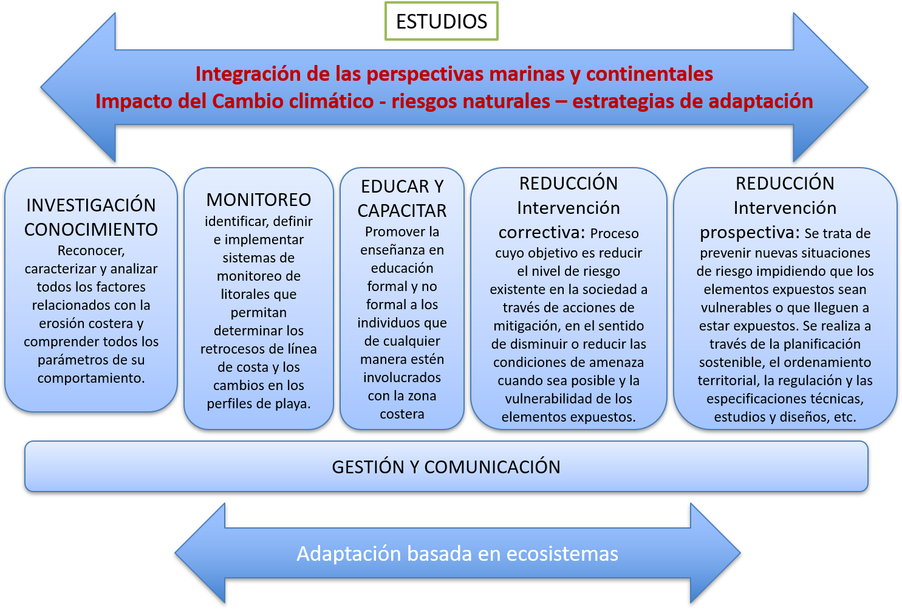

**Figura 3.** Esquema conceptual de los lineamientos para la gestión del riesgo por erosión costera.

## 13.3 IDENTIFICACIÓN DE ZONAS CRÍTICAS: DEPARTAMENTO DE CÓRDOBA

Para la identificación de zonas críticas se relacionaron los resultados de amenaza y vulnerabilidad por erosión costera, así mismo se tuvo en cuenta la información de los monitoreos de la zona costera y el análisis de cambios de la línea de costa.

### 13.3.1 Amenaza y vulnerabilidad por erosión costera

Los resultados de amenaza y vulnerabilidad por erosión costera para el departamento de Córdoba, se basaron en la metodología propuesta por Coca-Domínguez y Ricaurte-Villota [[15]](#ref-15). Donde para la amenaza tuvieron en cuenta diferentes variables físicas para tres componentes: magnitud, susceptibilidad y ocurrencia. De la misma manera para la vulnerabilidad, se enfocaron en tres componentes (variables socioeconómicas y ecológicas): elementos expuestos, fragilidad y falta de resiliencia. Todo esto se presenta en cinco niveles de calificación: muy alta, alta, media, baja y muy baja [[4]](#ref-4), [[15]](#ref-15). De igual manera, los resultados para Colombia obtenidos con este método se presentaron en Ricaurte-Villota *et al*., [[4]](#ref-4). Se observó para el departamento de Córdoba, que la amenaza muy alta por erosión costera se presenta en el 6% de la línea de costa, localizada sobre los poblados de Santander de la Cruz, Puerto Rey y Minuto de Dios; la amenaza alta es la de mayor cobertura con un 51%, seguido por el 31% de la clasificación media, y por último, la amenaza baja con un 12% (Fig. 4a).

En cuanto la vulnerabilidad de la población y los ecosistemas por erosión, la zona costera de Córdoba presenta una vulnerabilidad media de 26%, alta de 69%, y muy alta de 5%. En este último rango se encuentran los sectores de Santander de la Cruz, Moñitos y La Rada [[4]](#ref-4) (Fig. 4b).

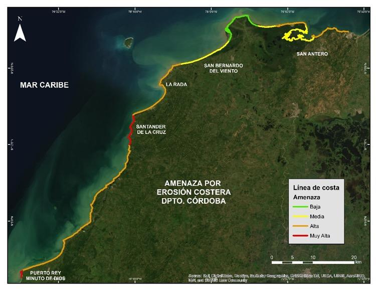

**Figura 4.** Mapas de amenaza (arriba) y vulnerabilidad (abajo) por erosión costera en el departamento de Córdoba. Modificado de Ricaurte-Villota *et al*. [[4]](#ref-4). Con permiso de modificación. 

### 13.3.2 Monitoreo de la erosión costera

El Monitoreo se hace a partir de la toma de datos estacionales, levantados *in situ* con DGPS y con el fin de conocer fluctuaciones intranuales, la cual es independiente de metodologías que usan otro tipo de sensores remotos y se emplean para temporalidades más amplias. En este caso, los resultados también permiten identificar una tendencia a corto plazo y es óptima para la toma de decisiones. Para este monitoreo, los levantamientos de líneas de costa se llevaron a cabo entre 2015 y 2019, siendo tomados en época seca y época húmeda, esto para observar los cambios estacionales, definidos por Ricaurte-Villota y Bastidas-Salamanca [[25]](#ref-25). 

**Cambios de la línea de costa**

La línea de costa se adquirió en campo a través de recorridos paralelos al mar, delineando la zona de cambio de pendiente en las playas, es decir el límite entre el frente de playa y la playa trasera, igualmente se tomó en la zona de acantilados el borde alto, esta definición es usada como variación morfodinámica y permite determinar la variación estacional [[26]](#ref-26). Esta adquisición se realizó mediante tecnología GNSS con corrección diferencial post-proceso, posteriormente se estimaron los cálculos de los cambios cuantitativos (acumulación y/o erosión) de las líneas de costa, obteniendo su evolución.

Las variaciones se midieron empleando la extensión Digital Shoreline Analysis System (DSAS) [[27]](#ref-27) en el software ArcGIS 10.5. Esta extensión permite calcular estadísticas para analizar el comportamiento o los cambios en la línea de costa, dentro de un intervalo de tiempo estudiado [[28]](#ref-28). Se tomaron como datos estadísticos el Linear Regression (LRR), el cual permite determinar la tasa de regresión lineal según la posición de la línea de costa con respecto al tiempo o fecha, tomando todas las líneas de costa del monitoreo y calculando bajo ecuación, donde la pendiente describe las tasas de cambio de la línea, dada en metros por año. Se clasificaron los resultados así: Muy Alta (LRR<-1 m/año), Alta (-1>LRR<-0.5), Estable (-0.5<LRR>0.5) y Acreción (LRR>0.5). Este resultado nos ayuda a entender cómo y cuál es la tendencia de la línea de costa, teniendo en cuenta las épocas climáticas, las cuales modulan su comportamiento. Resultados y análisis en la Tabla 1.

**Tabla 1. **Resultados de los cambios en la línea de costa para cada sector.

| Lugar | Resultado |
| --- | --- |
| Puerto Rey | Se observó el retroceso continuo en los sectores adyacentes al enrocado protector de la vía y en las viviendas que se sitúan en dirección sur de la línea de costa (Fig. 5a). Valores máximos = MUY ALTA |
| Minuto de Dios | Presenta retroceso en toda la zona del poblado (se excluye la zona no poblada); la regresión lineal presenta pérdidas de -24.28 m/año (Fig. 5a). Valores máximos = MUY ALTA |
| El Bolivitar | Está marcada en la zona sur, por una estabilidad (valores que no superan 1 m/año) y acreción en la sombra de los rompeolas que apenas llega a los 1.29 m/año; en la zona norte se observaron procesos de retroceso que llegan a los -1.84 m/año (Fig. 5b). Estos valores muestran que la playa fluctúa con valores cercanos a cero (0), responde a las variaciones estacionales, pero con una tendencia a la erosión costera. ACRECIÓN. |
| Brisas del Caribe | La tendencia general es de acreción, lo que quiere decir que esta playa se mantiene bajo los procesos estacionales sin procesos tendenciales de erosión costera (Fig. 5c). |
| El Hoyito | La tendencia mostró una playa en acreción, sin procesos de erosión costera y en buen estado, respondiendo a la variación estacional sin afectaciones negativas. |
| Moñitos | La playa presenta una tendencia de acreción – estabilidad (hasta 7.08 m/año) (Fig. 5d). |
| La Rada | La costa puede dividirse en 3 partes de acuerdo a su tendencia: la primera parte es hacia el acantilado (al norte), donde los valores tienen tramos de estabilidad y erosión leve; la segunda es de acreción, la cual se genera en la playa norte; por último, el tramo de playa del sur, donde la erosión es alta y alcanza los -21.57 m/año (Fig. 5e). MUY ALTA. |
| Playas de San Bernardo del Viento | La tendencia en La Y es de acreción (4.66 m/año), con algunos tramos de estabilidad (Fig. 5f).  En Brisas del Mar la tendencia es hacia la acreción (4.2 m/año) (Fig. 5g).  En Los Tambos la tendencia es hacia la acreción costera, la cual alcanzo los 12.18 m/año (Fig. 5h). ACRECIÓN. |
| Santander de la Cruz | Presenta una tendencia general hacia la erosión costera con tasas de hasta -4 m/año (Fig. 5i). MUY ALTA. |

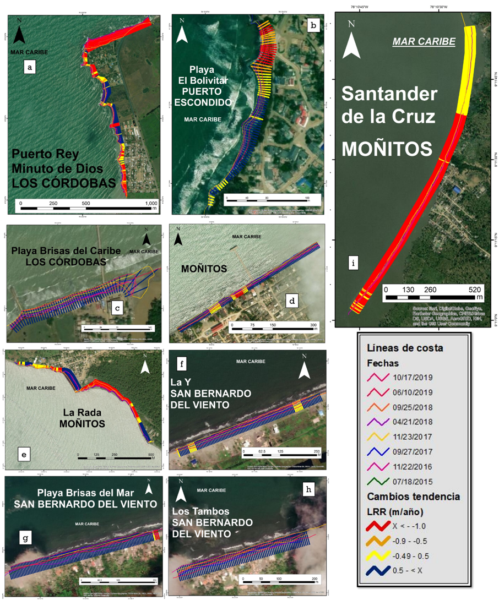

**Figura 5.** Cambios en línea de costa tendenciales para las zonas de monitoreo del departamento. (**a**) Minuto de Dios y Puerto Rey, (**b**) playa El Bolivitar, (**c**) playa Brisas del Caribe, (**d**) Moñitos, (**e**) La Rada, (**f**) La Y, (**g**) Brisas del Mar, (**h**) Los Tambos, (**i**) Santander de la Cruz. Clasificación: Muy Alta (LRR<-1 m/año), Alta (-1>LRR<-0.5), Estable (-0.5<LRR>0.5) y Acreción (LRR>0.5).

### 13.3.3 Priorización de áreas o definición de puntos críticos por erosión costera

La priorización de áreas o definición de puntos críticos de erosión costera, corresponde con los sitios donde dicho fenómeno podría generar daños en población o pérdida de ecosistemas, lo que permite identificar las áreas que requieren medidas a corto, mediano y largo plazo. Para la priorización de áreas, inicialmente se relacionaron los resultados de amenaza y vulnerabilidad mediante una matriz, donde se tomaron la clasificación media, alta y muy alta. Se asignaron valores a cada clase: media (1), alta (3) y muy alta (5), siendo en sumatoria el máximo valor 10 y el mínimo 2, clasificando con intervalos iguales se tuvo: media <4.6, alta 7.3 > 2.6 y muy alta >7.3 (Tabla 2).

Adicionalmente se tomaron en cuenta los resultados del monitoreo de erosión costera, para lo cual se asignaron tres clasificaciones: los que mostraban una tendencia hacia la erosión costera (Alta y Muy Alta) o hacia procesos de acreción. Con valores asignados de acreción (1), erosión Alta (4) y Muy Alta (5). Posteriormente se cruzó con los resultados de la matriz A*V y se usó la misma clasificación de intervalos de la Tabla 2 para obtener las zonas prioritarias (Tabla 3).

**Tabla 2. **Relación entre amenaza y vulnerabilidad para priorización de áreas.

|  |  | Grado de vulnerabilidad | Grado de vulnerabilidad | Grado de vulnerabilidad |  |
| --- | --- | --- | --- | --- | --- |
|  |  | Media (1) | Alta (3) | Muy Alta (5) |  |
| Grado de Amenaza | Media (1) | Media (2) | Media (4) | Alta (6) | A * V Zona Prioritaria |
| Grado de Amenaza | Alta (3) | Media (4) | Alta (6) | Muy Alta (8) | A * V Zona Prioritaria |
| Grado de Amenaza | Muy Alta (5) | Alta (6) | Muy Alta (8) | Muy Alta (10) | A * V Zona Prioritaria |

Los poblados que tienen prioridad Muy Alta para intervención son Puerto Rey, Minuto de Dios, La Rada, Santander de la Cruz y Broqueles. El resto del departamento estudiado se encuentra en prioridad Alta, lo que significa que se debe intervenir de corto a mediano plazo, ya que, si no se toman medidas, los riesgos pueden ir en aumento (Tabla 3).

**Tabla 3**. Tabla de priorización de áreas. Información derivada del monitoreo*.

| Municipio | Localidad | Erosión costera* | Amenaza X Vulnera | Prioridad |
| --- | --- | --- | --- | --- |
| Los Córdobas | Puerto Rey | Muy Alta (5) | Muy Alta (5) | Muy Alta (10) |
| Los Córdobas | Minuto de Dios | Muy Alta (5) | Muy Alta (5) | Muy Alta (10) |
| Los Córdobas | Brisas del Caribe | Acreción (1) | Alta (3) | Media (4) |
| Puerto Escondido | El Bolivitar | Acreción (1) | Alta (3) | Media (4) |
| Puerto Escondido | San Miguel | (0) | Alta (3) | Media (3) |
| Moñitos | La Rada | Muy Alta (5) | Muy Alta (5) | Muy Alta (10) |
| Moñitos | Santander de la Cruz | Muy Alta (5) | Muy Alta (5) | Muy Alta (10) |
| Moñitos | Moñitos | Acreción (1) | Muy Alta (5) | Alta (6) |
| San Bernardo del Viento | Paso Nuevo | (0) | Alta (3) | Media (3) |
| San Bernardo del Viento | Playas del viento | Acreción (1) | Media (1) | Media (2) |
| San Antero | Playa Blanca y El Porvenir | (0) | Alta (3) | Media (3) |

## 13.4 MODELO CONCEPTUAL DE ALTERNATIVAS DE MITIGACIÓN: SANTANDER DE LA CRUZ.

### 13.4.1 Alternativas propuestas

Las alternativas propuestas se adaptaron a partir del trabajo desarrollado por MADS-DELTARES-INVEMAR. (2013) [[10]](#ref-10), con base en la iniciativa *Building with Nature, *tomando en cuenta en el caso específico de Santander de la Cruz otras necesidades derivadas de trabajos con la comunidad y estudios previos. Para cada zona se elaboraron dos modelos, uno del estado actual y el segundo con las alternativas de mitigación propuestas, estos se desarrollaron a través de cartografía social, en talleres con la comunidad e imágenes de sensores remotos. Las propuestas principales son las siguientes (Tabla 4):

**Tabla 4** Alternativas propuestas.

| Alternativa | Descripción |
| --- | --- |
| Reforestación y restauración (manglares, arrecifes artificiales, entre otros) | La estructura de los manglares, en virtud de sus raíces aéreas ayuda a contrarrestar los efectos de la energía del oleaje y propicia paralelamente la sedimentación y la estabilidad de la línea de costa [[29]](#ref-29). La implementación de arrecifes artificiales consiste en estructuras aisladas metálicas (preferiblemente no de concreto) que no causan interrupción de la deriva litoral [[30]](#ref-30), esta forma es diferente a la siembra de arrecife, la cual depende de la previa existencia de manera natural. Su implementación permite la disminución de la energía del oleaje incidente, con el objetivo de generar una zona de calma en la parte posterior que disminuya la erosión y propicie la regeneración en las costas. |
| Alimentación de playas | Consiste en provocar en la playa un aumento artificial del volumen de arena a través de un suministro externo de arena en el segmento de la misma que se pretende proteger. Puede colocarse la arena en un solo tramo aguas arriba de la playa o renovarse en varios puntos a lo largo de ella, cerca de la línea de costa. Para que el transporte de deriva se encargue de distribuir los sedimentos (Esta técnica exige mantenimiento periódico) [[29]](#ref-29). |
| Reubicación de viviendas | Esta alternativa no pretende ser la única para una zona en particular, primordialmente esta solución se usa con otras de manera integral, y solo se propuso para casos extremos. La reubicación de viviendas en muchos casos es costosa, pero la solución es a largo plazo. En la medida de lo posible la relocalización de viviendas se presenta haciendo énfasis en los aspectos socio-económicos y de zonas seguras. |
| Estabilización de acantilados y perfilamiento | El objetivo de esta técnica es definir el ángulo adecuado y aumentar la estabilidad del talud, la cual está en función del tipo de roca, la estructura geológica, el contenido de agua y la altura, el perfilador no es sin embargo aplicable a todos los tipos de rocas y requiere que haya espacio suficiente para que el talud pueda extenderse; además, debe ir acompañada de obras complementarias de drenaje y regeneración de cobertura vegetal [[19]](#ref-19). |

### 13.4.2 Santander de la Cruz

Santander de la Cruz es una de las áreas más afectadas por la erosión costera en el departamento de Córdoba. Actualmente la población se encuentra sobre la playa y la acción de las olas incide sobre los patios de las viviendas causando grandes pérdidas económicas (Fig. 6a). A partir de la configuración del estado actual y de los talleres con la comunidad, se propusieron las siguientes alternativas de mitigación y se generó el siguiente modelo conceptual.

Debido a la proximidad de las casas con el mar, se hace necesario un plan de reubicación para la primera línea de viviendas y una reforestación de manglar en toda la zona litoral, principalmente en las áreas aledañas a los ríos. A pesar de la presencia de afluentes y que la deriva litoral no presenta ninguna intervención de obras de contención, la dinámica del oleaje no permite la sedimentación en la costa y la tendencia históricamente se ha marcado por procesos de retrocesos de la línea (Fig. 6b). Por otro lado, se hace importante la intervención de arrecifes artificiales en pro de reducir la energía incidente de las olas sobre la costa. Se debe tener control de la extracción de arena que padecen las playas actualmente y los procesos de deforestación del manglar alrededor de los ríos, cada una de estas intervenciones aportan al desequilibrio del sistema. 

**Figura 6.** Estado identificado (2017) de zona costera de Santander de la Cruz (a) y Modelo conceptual de las alternativas para el control de la erosión costera en Santander de la Cruz (b). 

## 13.5 ESTUDIOS TÉCNICOS DE VALIDACIÓN Y PRIORIZACIÓN DE ALTERNATIVAS DE MITIGACIÓN: SANTANDER DE LA CRUZ

A partir del análisis de las alternativas de mitigación definidas en la sección anterior, de los resultados del monitoreo de erosión costera y los componentes de investigación, se establecieron los estudios base requeridos para la evaluación de factibilidad de las estrategias de mitigación planteadas. Los estudios contemplaron ocho componentes o disciplinas científicas, los cuales a su vez poseen unas variables o sub-disciplinas que permitieron desarrollar el tipo de muestreo o adquisición de información general. Teniendo en cuenta lo anterior, las alternativas de mitigación se relacionaron con los componentes o disciplinas, los cuales a su vez permitieron identificar la información específica a levantar (Tabla 5). 

**Tabla 5.** Relación de las alternativas de mitigación con los componentes principales, mostrando la información a levantar.

| # | Alternativas | Componentes | Información |
| --- | --- | --- | --- |
| 1 | Debido a la proximidad e inminente riesgo de las casas frente al mar, se analizó la posibilidad de reubicación para la primera línea de viviendas. | Socioeconómico y físico | Usos del suelo, POT, geomorfología, geología, riesgos, pronóstico de comportamiento de la línea de costa |
| 2 | Reforestación de manglar en toda la zona litoral, principalmente en las áreas aledañas a los ríos. | Biofísico | Sedimentos y flora |
| 3 | Intervención con arrecifes artificiales en pro de reducir la energía incidente de las olas sobre la costa o estructura de baja cota de coronación o rompeolas. | Hidrodinámica | Oleaje, corrientes, turbidez, etc. Batimetrías, fondos, sedimentos, etc. |
| 4 | Ninguna construcción de obras duras sobre la línea de costa de Santander, el sistema puede tener la capacidad en la producción de sedimento para la evolución acumulativa de la playa, pero se debe revisar que sucede con la fuente de sedimentos. | Dinámica litoral | Transporte de sedimentos, sedimentología. |
| 5 | Control de la extracción de arena que padecen las playas actualmente y los procesos de desforestación sobre los ríos, cada una de estas intervenciones aportan al desequilibrio del sistema | Sedimentológico, biótico | Áreas deforestadas y fuentes de material |
| 6 | Al igual que La Rada, los representantes de Santander proponen la implantación y recuperación de las puntas de la bahía. | Hidrodinámica y Morfodinámica | Oleaje, corrientes, Transporte de sedimentos |

**Reubicación**

A partir del estudio de cambios en la línea de costa entre los años 1981 y 2018, es decir 37 años de intervalo, usando imágenes de sensores remotos (1981, 2004, 2007, 2011, 2015 y 2018), y tomando como base la regresión lineal del DSAS (LRR), se realizó la proyección de la línea de costa hasta el año 2028, el cual mostró como se perderían viviendas que se localizan en la primera línea, generando pérdida de infraestructura local (Fig. 7a). La alternativa de reubicación en el corregimiento de Santander de La Cruz es poco factible debido a dos razones principales. La primera, es la falta de confianza de los habitantes en los gobiernos locales o regionales, así como la poca capacidad y voluntad institucional para llevar a cabo una alternativa de gran magnitud, debido a que se requeriría de buena planificación, negociaciones con propietarios y amplios recursos económicos, que garanticen el éxito de una reubicación para minimizar los impactos en los pobladores y el corregimiento. La segunda, es el uso turístico y recreacional del 33% de las construcciones en el frente de playa (Fig. 7b), lo que dificultaría la voluntad de sus dueños frente a una negociación de relocalización por no poder ejercer la actividad económica. Solo el grupo de viviendas de uso residencial podrían ser manejadas con este tipo de intervención. 

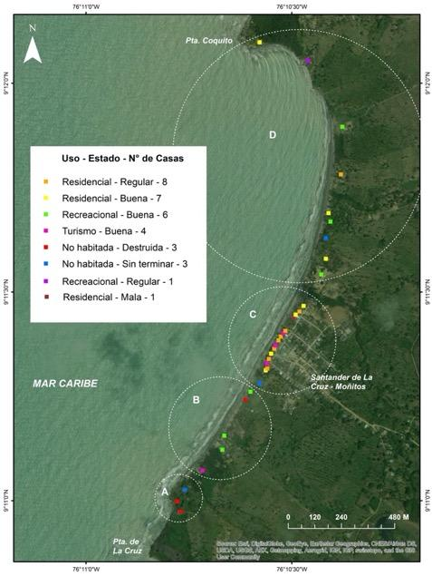

**Figura 7.** Mapa de tendencia de evolución de línea de costa y proyección a 10 años (2028) (izquierda).  Mapa de uso y estado de las viviendas, divido espacialmente en cuatro grupos (A, B, C y D) (derecha).

**Recuperación de puntas**

Para este análisis se realizó el levantamiento topográfico del acantilado a través de un Modelo de Elevación Digital, utilizando el Escáner Laser Terrestre (TLS) FARO FOCUS 3D X330 y el sistema de posicionamiento GeoMax Zenith35 Pro GNSS en modo estático como herramienta para la toma de los puntos de amarre. El procesamiento de los datos se ejecutó en el software SCENE para el ajuste y agrupación de los levantamientos topográficos realizados. Posteriormente se exportó la nube de puntos para realizar el modelo de elevación en el software ArcGIS utilizando el método de interpolación *Natural Neighbor. *

La Punta de la Cruz ha retrocedido desde 1981 una distancia de 170.20 m con una tasa de erosión de -5.21 m/año. El acantilado presenta pendientes fuertes y escarpadas contrastantes en su base con el nivel plano de la playa expuesta en su base durante condiciones de baja energía del oleaje. Se determinó que existen dos tipos de movimientos en masa en este sector. Uno relacionado con la caída de bloques en las puntas con litologías de mayor resistencia y otro, deslizamientos traslacionales con componente rotacional en la zona intermedia de litologías blandas meteorizadas (Fig. 8). Por lo tanto, se recomienda a corto plazo realizar una estabilización con el perfilamiento de taludes y la revegetalización de las bermas, a mediano plazo un revestimiento con roca o geotextiles en la base del acantilado y finalmente, a largo plazo realizar una barrera perpendicular a la línea de costa apoyada por la regeneración artificial de sedimentos que requeriría estudios específicos de ingeniería para su diseño.

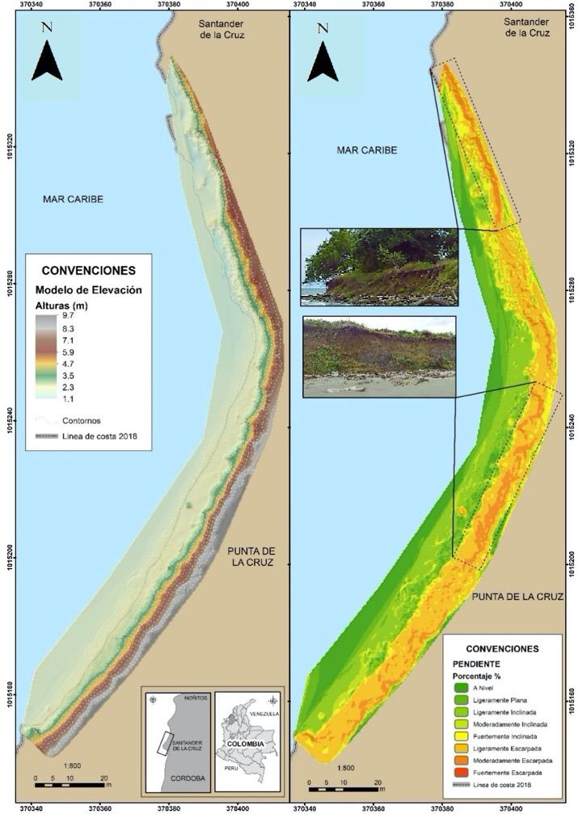

**Figura 8.** Modelos de elevación y pendiente en el sector acantilado de Punta de la Cruz.

**Fuentes de sedimentos**

Se realizó el muestreo sedimentológico en zona de playa (15 estaciones) utilizando una pala sobre un recuadro superficial de 10×10 cm hasta conseguir 500 g de muestra aproximadamente, de acuerdo con el protocolo del Laboratorio de Instrumentación Marina de INVEMAR. De igual manera, se colectaron muestras de sedimento en fondos someros (10 estaciones) a través de una campaña de buceo con recolección manual hasta conseguir 500 g de muestra aproximadamente. Las muestras se almacenaron en bolsas para ser transportadas a INVEMAR donde se realizó el análisis de laboratorio. En los sedimentos se realizó análisis de granulometría por tamices, mineralogía óptica y calcimetría con el objetivo de determinar facies sedimentarias.

Los sedimentos de las playas de Santander de la Cruz corresponden a arenas finas a medias con selección buena a moderadamente buena, provenientes de aportes de escorrentía local. De acuerdo con la composición del tamaño medio de grano, los sedimentos en la playa se distribuyen desde el norte hacia el sur, predominando en la granulometría las arenas finas. Con esto, también cambia la pendiente y la playa reduce su ancho, indicando influencia de oleaje de mayor energía en la parte sur. Los sedimentos del fondo somero presentaron dos tendencias, aquellos localizados en las zonas de baja pendiente corresponden a limo muy grueso a arenas finas, pobremente seleccionados característicos de los ambientes marinos (Fig. 9 a–d), los sedimentos obtenidos en inmediaciones de una franja arrecifal dieron como tamaño medio arena media a gruesa con contenidos de grava, de selección moderada reflejando condiciones ambientales de sedimentación con mayor energía. 

En Santander de La Cruz la arena es también una materia prima cuyo uso es destinado principalmente como material de construcción. Por consiguiente, se recomienda minimizar la extracción de material de las playas en Santander a través de la concientización de la población o la regulación del material extraído, para que no sobrepase la capacidad de carga del sistema natural.

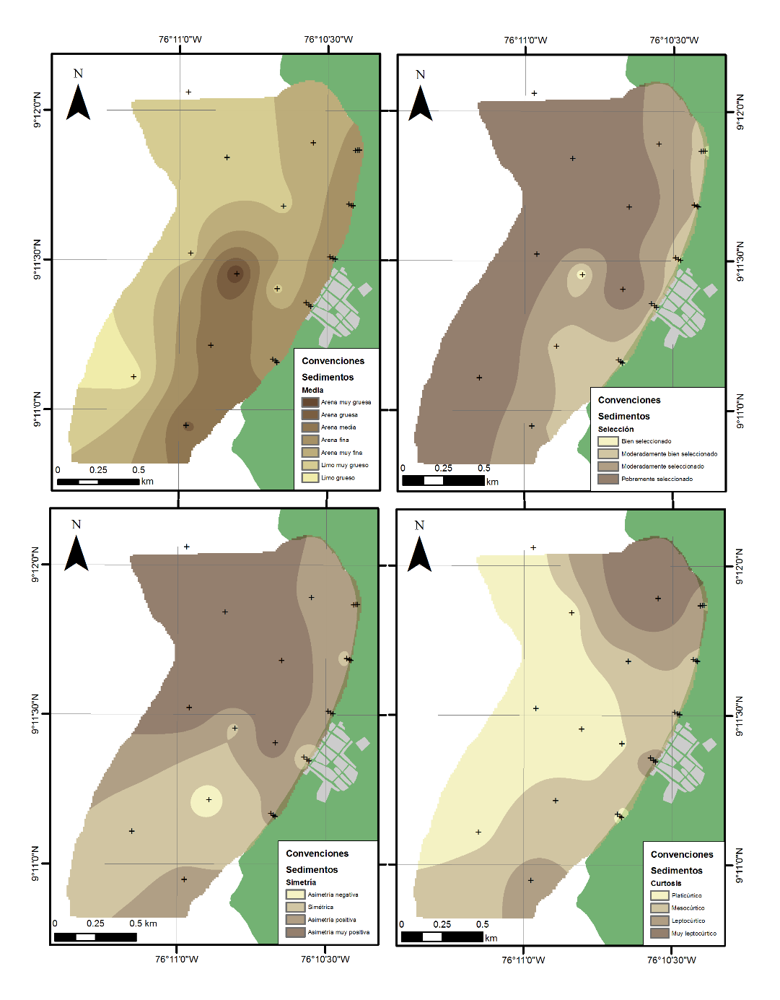

**Figura 9.** Mapas de distribución de parámetros estadísticos de sedimentos: Media (**a**), Selección (**b**), Simetría (**c**), Curtosis (**d**) (+ estaciones de muestreo).

**Alternativas basadas en ecosistemas**

En cuanto a medidas blandas que incluyen ecosistemas, se realizó una revisión bibliográfica correspondiente a los ecosistemas de manglares y arrecifes por estar relacionados con las alternativas de mitigación propuestas y se identificaron las condiciones oceanográficas *in situ* (Tabla 6). Además, la oceanografía del área en estudios anteriores ha identificado que la zona costera del departamento de Córdoba está directamente influenciada por el oleaje [[17]](#ref-17), lo cual indica que los vientos y el oleaje son factores importantes en la configuración de la costa. En la zona marina frente a Santander de La Cruz, Ricaurte-Villota y Bastidas-Salamanca [[25]](#ref-25) emplearon datos del Reanálisis Regional de América del Norte (NARR) y realizaron la caracterización de los vientos en una estación a 35 km de Santander de la Cruz llamada BV_03. Estos autores encontraron que la mayor magnitud del viento se registra entre los meses de diciembre a abril, alcanzando máximos para el mes de febrero con una dirección predominante norte-noroeste. En contraste, de mayo a noviembre disminuye la velocidad del viento, registrando mínimos en el mes de octubre y una dominancia de la dirección proveniente del oeste. 

**Tabla 6**. Características deseadas en los ecosistemas propuestos como medida de mitigación.

| Ecosistema | Parámetro | Intervalo | Medición en campo |
| --- | --- | --- | --- |
| Corales | Temperatura | 18 - 30 °C [[31]](#ref-31) | Perfilador marino |
| Corales | Salinidad | 32 – 38 [[32]](#ref-32) | Perfilador marino |
| Corales | Tipo sustrato | Duro y consolidado [[33]](#ref-33) | Observación directa |
| Corales | Turbidez | Aguas claras con baja turbidez [[32]](#ref-32) | Disco Secchi o muestra de agua para solidos suspendidos totales - SST |
| Corales | Hidrodinámica | 0.5 - 0.7 m/s [[34]](#ref-34) | Correntómetro |
| Corales | Profundidad | 3 a 25 m | Ecosonda manual |
| Manglares | Temperatura | 20 a 35 °C [[35]](#ref-35) | Sonda portátil |
| Manglares | Salinidad | 33 a 38.5 [[36]](#ref-36) | Sonda portátil |
| Manglares | Tipo sustrato | Sustratos arcillosos u arenosos, según especie. [[37]](#ref-37) | Muestra de sedimentos con pala. |

El comportamiento del oleaje a partir de la serie sintética de la boya virtual (BV_03) ubicada a 35 km al noroeste de Santander de la Cruz, mostró que para la época seca (diciembre marzo) el oleaje presenta máximos con alturas de ola promedio de 1.35 ± 0.56 m con un periodo de 6.5 s y una probabilidad del 37% de ocurrencia de olas provenientes del NNO, seguido de direcciones al NO y O-NO. En contraste, para los meses de abril a noviembre (época húmeda), la altura de la ola disminuye hasta un promedio de 1.08 ± 0.56 m, un periodo de 6.4 s y la dirección predominante proviene del tercer cuadrante (entre 180° y 270°), con mayor probabilidad del oeste-noroeste [[25]](#ref-25). Durante los días de muestreo, la altura de ola osciló entre 0.67 y 0.28 m con un promedio de 0.45 ± 0.12 m. La dirección predominante en la zona fue de 306.00º (provenientes del Noroeste) (Fig. 10).

**Figura 10.** Nivel del agua y dirección de procedencia del oleaje durante los días 24 al 26 de julio de 2018.

**Reforestación de manglar**

La reforestación de manglar es ideal para cualquier playa o zona estuarina, puesto que su presencia conlleva varios servicios ecosistémicos como transferencia al mar de detritos y material vegetal y como protección contra oleajes fuertes y continuos de forma que hace que se disipe dicha energía del oleaje [[38]](#ref-38). Para evaluar la potencialidad de su reforestación en la zona de estudio, se realizó un análisis de ecosistemas (coberturas vegetales) empleando imágenes de satélite (2012 y 2018) e imágenes obtenidas durante la salida de campo empleando un Drone DJI Phantom 4 Pro, así como mediciones de variables fisicoquímicas (temperatura y salinidad) y observaciones de campo sobre los cuerpos hídricos existentes. 

Los resultados obtenidos al analizar los años 2012 a 2018 muestran que los manglares de Santander de la Cruz, se redujeron por efecto del aumento de la frontera agrícola en el área. Para el año 2012, se calculó una cobertura de manglar de 15.66 ha ubicada en los alrededores de las riberas de las quebradas Pequín, arroyo Culebra y quebrada San Martín, las cuales fueron reducidas hasta llegar a 8.20 ha aproximadamente para el año 2018, lo que corresponde una pérdida del 47.6% de la cobertura inicial de estos manglares (Fig. 11a, b).

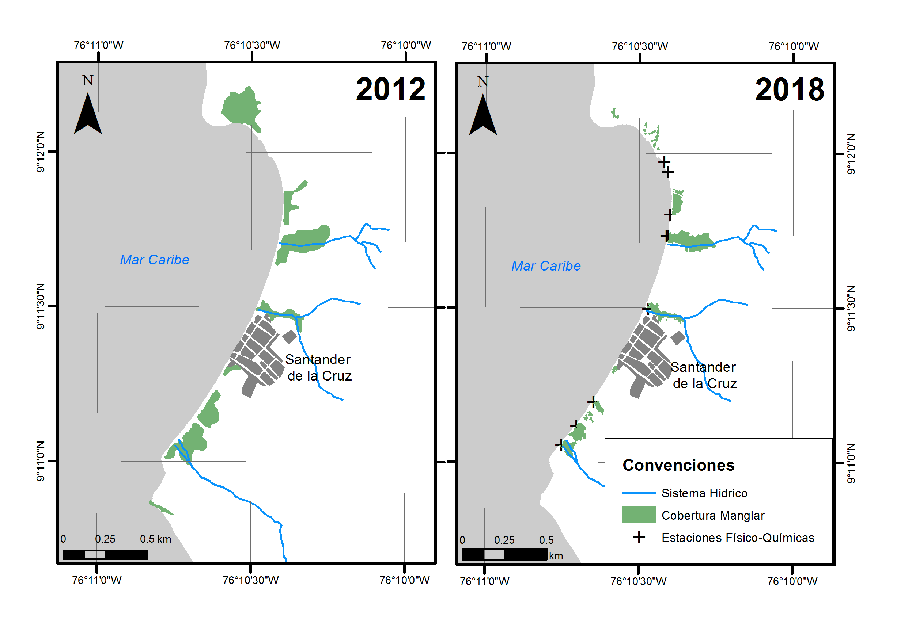

**Figura 11.** Coberturas de manglar en los años 2012 (izquierda) y 2018 (derecha); muestran que los manglares de Santander de la Cruz, se reducen por efecto del aumento de la frontera agrícola que ocurre en el área. 

La temperatura del agua fluctuó entre 29.70 y 33.80 °C y la salinidad entre 24.32 y 34.90; el pH mostró condiciones de basicidad con valores entre 7.06 hasta 8.29. El oxígeno disuelto (OD) osciló entre 4.65 y 8.90 mg/L, encontrándose las mayores concentraciones en los arroyos y quebradas. Estos resultados indicaron que para el momento de la medición (24 de julio de 2018), el agua, tanto en los arroyos, quebradas y pequeños caños, se encontraba estancada y no había comunicación aparente con el mar; de allí, los valores obtenidos: aguas con características salobres o dulces. En algunos lugares, se pudo observar mucha materia orgánica natural (hojarasca, algas, trozos de trocos), que hacen que se aumente el proceso de baja de oxígeno y afectan el movimiento del agua (Fig. 12).

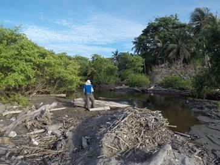

**Figura 12.** Boca del arroyo Culebra y quebrada San Martín.

::: {#box2 .callout-important style="background-color: #e3f0fbff; padding:20px; border: none !important;" appearance="minimal" icon="false"}
**Caja 1.** Conceptos clave Cambio de coberturas: permiten evidenciar cambios en extensión, tipo de especie y aumento de la frontera agrícola. Características fisicoquímicas: determinan el asentamiento o no de determinada especie.
:::

**Intervención con arrecifes artificiales**

Los arrecifes artificiales se han utilizado con éxito en algunos países de Europa y Sudáfrica para la recuperación o formación de playas, así como en la protección de caminos e infraestructura [[39]](#ref-39). Adicionalmente, pueden servir como base para nuevos ecosistemas, albergando variedad de especies marinas. Para identificar su potencialidad en la zona de estudio, se realizaron estudios que incluyeron caracterización del fondo marino (sustrato con perfilador de subsuelo), hidrodinámica de la bahía (mediciones de oleaje y nivel con correntómetro acústico) y propiedades físicas de la columna de agua (temperatura con sonda y sólidos suspendidos totales mediante determinación en laboratorio en muestra de agua superficial). Se tuvo como base la batimetría levantada en la zona (Fig. 13), la cual permitió identificar posibles zonas de restauración. De igual manera se muestra un perfil transversal 2D (Fig. 13 y 14).

En el modelo batimétrico y el perfil transversal se puede observar una franja rocosa sumergida (Fig. 13 y 14), la cual tiene características naturales para la conformación de un arrecife. Un fragmento de roca obtenido en campo muestra que corresponde a la continuidad de las lutitas de la Unidad Moñitos sobre la que se incrustan nemátodos y briozoos entre otros organismos que forman biohermos (acumulaciones biogénicas). Esta estructura podría utilizarse como base la conformación de una barrera natural y con mayor resistencia que permita la reducción de energía del oleaje al que se expone el área de estudio durante los primeros meses del año.

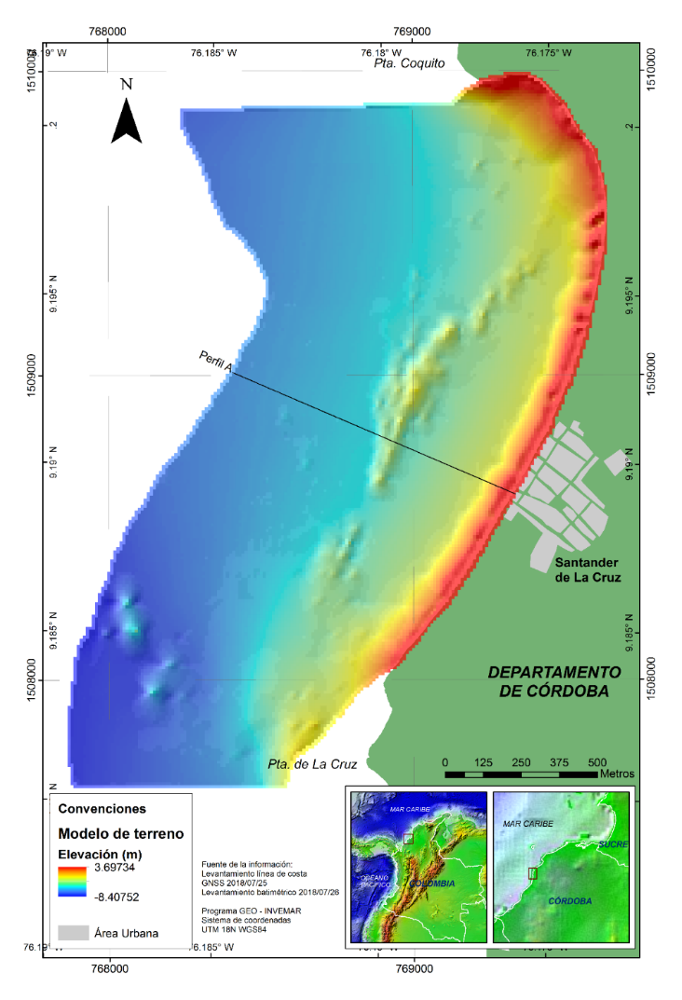

**Figura 13.** Modelo batimétrico para Santander de la Cruz.

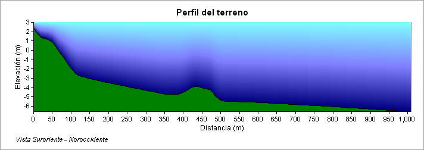

**Figura 14.** Perfil en el área central del área de estudio, nótese la elevación de la franja rocosa a aproximadamente 400 m de la línea de costa.

::: {#box3 .callout-important style="background-color: #e3f0fbff; padding:20px; border: none !important;" appearance="minimal" icon="false"}
**Caja 2.** Conceptos clave Sustrato: Está relacionado con la disponibilidad de superficie favorable para el asentamiento de especies sedentarias y larvales.  Oleaje: su magnitud y dirección son los factores que más inciden en la dinámica litoral. Permitirá determinar la ubicación de estructuras de protección costera.  Temperatura: cumple un papel imprescindible para el asentamiento y crecimiento de los reclutas coralinos; mientras que la Turbidez hace referencia a la disponibilidad de luz solar para realizar fotosíntesis de las zooxantelas (simbiontes).
:::

Se encontró que no es posible hacer siembra de corales en la bahía, ya que la temperatura sobrepasa el rango permitido para un estado óptimo de estos organismos. Lo mismo pasa con la salinidad, la cual se encuentra por debajo del intervalo adecuado para su crecimiento. Esto explica la ausencia de este ecosistema en cercanías a la zona de estudio. Con respecto a la turbidez, los mayores valores de SST se encontraron al norte de la bahía; mientras que los menores (correspondientes con las mayores transparencias), se encontraron en la parte más alejada de la costa, donde la influencia continental es menor. Se procede con otro tipo de ecosistemas que sirvan como barreras vivas (Fig. 15).

**Figura 15.** Concentración de SST (mg/l) en la bahía frente a Santander de la Cruz.

## 13.6 CONCLUSIONES

Este modelo de gestión del riesgo en erosión costera pretende generar oportunidades para que los entes territoriales y corporaciones ambientales puedan tomarlo como guía para generar acciones correctivas y prospectivas adecuadas en sus regiones frente a la erosión costera, ya que este es un fenómeno en aumento y con daños materiales importantes.

Este es un estudio de procesos integrales en cuanto a la gestión del riesgo para la erosión costera, donde se tienen en cuenta las diferentes escalas de trabajo, las necesidades institucionales y de comunidades locales, para así generar las alternativas que faciliten su ejecución y además sean incluidas en las herramientas de planificación de las zonas costeras con énfasis en gestión del riesgo.

Este modelo genera la necesidad de ordenar los territorios en una perspectiva encaminada hacia la corrección prospectiva y de largo plazo, y a escala local, con el fin de poder plantear planes locales de ordenamiento del territorio o planes de etno-desarrollo [[40]](#ref-40). Para llevar a cabo esto se debe partir desde el termino de territorio, el cual se concibe de diferentes maneras, pero es indispensable entenderlo llevado a cabo desde la comunidad a lo institucional y que sirva como hoja de ruta para la gestión del riesgo con un enfoque de desarrollo sostenible. 

Las correcciones prospectivas permitirán reducir la vulnerabilidad, interviniendo la falta de resiliencia a través del fortalecimiento de la institucionalidad de la comunidad como la Junta de Acción Comunal (JAC) y disminuyendo la fragilidad en sus diferentes dimensiones. 

Entre las alternativas de adaptación analizadas se determinó que: la estabilidad del acantilado permitiría mitigar el efecto de erosión costera en la Punta de la Cruz, la cual se consideraba una barrera natural entre las celdas de transporte de sedimento, se recomienda la prioridad de esta alternativa con las medidas de corto plazo. Seguido a esto, debido al carácter local de procedencia de los sedimentos y su distribución es necesario mejorar el manejo de las fuentes hídricas y ecosistemas costeros (bosque seco tropical, relictos de manglar, playa) que permiten el flujo durante las épocas de lluvia, sin embargo, debe analizarse con detalle la reestructuración de una barrera exenta para arrecife como tal, es decir, que las condiciones no están dadas para la siembra de corales y la alternativa propuesta son estructuras que se pueden acompañar con otro tipo de organismo o barrera viva, cuyas condiciones podrían ser óptimas. Esta estructura se encuentra asociada a las elevaciones rocosas existentes a 400 m de la línea de costa y se debe determinar el diseño apropiado para la reducción de energía del oleaje que afecta la región de manera negativa en las épocas secas. Finalmente, la reubicación se dejó como última alternativa en caso que el proceso no se logre mitigar, en tal caso se daría prioridad a las viviendas residenciales, y se requiere de un plan de compensación a las construcciones de tipo turístico.

::: {#recomendaciones-1 .callout-important style="background-color: #fff0f3ff; padding:20px; border: none !important;" appearance="minimal" icon="false"}
**Recomendaciones para tomar decisiones.** La problemática de la erosión costera en el departamento de Córdoba requiere abordarse de forma prioritaria por parte de las entidades del orden nacional y regional pertenecientes al SINA. Como corrección prospectiva, se proponen los lineamientos de ordenamiento local del territorio de Santander de la Cruz, los cuales tendrán los siguientes puntos como factores de hoja de ruta para su formulación: El desarrollo deberá tener principalmente la participación de todos los actores locales: comunidad, privados, industria (cultivos y ganadería) e instituciones. De igual manera, también la participación de instituciones regionales y nacionales. Ordenar la ocupación de las microcuencas (quebrada Pequín, arroyo Culebra y quebrada San Martín) y restaurar los ecosistemas presentes, partiendo de la conservación de la ronda hídrica, lo que permitirá restablecer flujos y descargas de sedimentos. Formular proyectos comunitarios alternativos que permitan el manejo de la extracción del material de playa con un enfoque de desarrollo sostenible. En cuanto a investigación, diferentes estudios se enfocan en los diferentes componentes de la gestión, sin llegar a ser integrales, aunque se han realizado algunos esfuerzos [[41]](#ref-41), mostrando solo las alternativas de mitigación, sus efectos y problemáticas [[42]](#ref-42), [[43]](#ref-43), [[44]](#ref-44), obras de ingeniería [[45]](#ref-45) u obras basada en ecosistemas presentes [[12]](#ref-12), [[46]](#ref-46). Otros estudios se enfocan en las políticas, programas o regulaciones [[47]](#ref-47), [[48]](#ref-48), o las deficiencias de estas herramientas [[49]](#ref-49). Por último, otros se basan en el monitoreo de playas o línea de costa [[50]](#ref-50), [[51]](#ref-51), de ahí la importancia de realizar estudios de carácter integral.
:::
## 13.7 MATERIALES Y MÉTODOS

El esquema metodológico propuesto como modelo para la gestión del riesgo por erosión costera (Fig. 16), partió de los lineamientos del plan de acción 2016–2020 para la gestión del riesgo por erosión costera para el departamento de Córdoba y que consta de nueve objetivos, los cuales se han llevado cabo. 

Para empezar, se tomó como información base el diagnóstico por erosión costera para el Caribe [[29]](#ref-29) y cambios en la línea de costa para Colombia [[52]](#ref-52). Seguidamente, el monitoreo de la erosión costera permitió entender que lugares presentan una tendencia hacia la erosión costera y conocer el comportamiento y/o patrones estacionales de la zona costera en relación con los procesos costeros y cambios ambientales. Este monitoreo junto con los resultados de los análisis de amenaza y vulnerabilidad por erosión costera [[4]](#ref-4), permitió identificar los sitios críticos del departamento que están siendo afectados por este fenómeno.

Posteriormente, en cada sitio critico se realizaron modelos conceptuales de alternativas de mitigación basada en ecosistemas o en construcción con la naturaleza [[10]](#ref-10), donde se hizo una aproximación al estado actual y al estado ideal con las obras o estrategias que mitigarían la erosión costera. Obtenidos estos modelos fue necesario validar las alternativas propuestas en estos, verificar si son válidos, realizables y acordes con los procesos ambientales, de igual manera priorizarlos a corto, mediano y largo plazo. Para obtener esto, se realizaron diferentes estudios de detalle en el poblado de Santander de la Cruz, iniciando por discriminar las variables que dependían de cada alternativa (físicas, bióticos, sociales y económicos), para finalmente obtener un listado priorizado de las alternativas viables y las descartadas que se deben ejecutar para prevenir y mitigar los procesos de la erosión costera en el poblado.

**Figura 16.** Esquema metodológico propuesto como modelo de gestión del riesgo para la erosión costera.

## 13.8 CONFLICTO DE INTERESES

Los autores no declaran conflicto de intereses

## 13.9 AGRADECIMIENTOS

A la Corporación Autónoma Regional de los Valles del Sinú y San Jorge – CVS, Córdoba, bajo los convenios 020 de 2015, 022 de 2017 y 022 de 2018. A los investigadores del programa de Geociencias Marinas y Costeras que han participado en la investigación de la zona costera del departamento de Córdoba en especial Ana Caicedo, Mauricio Bejarano Espinosa, Cesar García Llano, Juan Sebastián Ponce Bastidas, Silvio Andrés Ordóñez Zúñiga y Karla Vanessa Castro Ramírez, quienes aportaron a la propuesta y análisis de las alternativas. A las comunidades y entes territoriales de los municipios costeros del departamento y a los funcionarios de la CVS que han aportado a la adquisición de información durante de las salidas de campo dentro de la ejecución de los convenios. El numero de contribución del INVEMAR es 1264.

## 13.10 IDENTIFICACIÓN DE AUTOR

Oswaldo Coca Domínguez	

Constanza Ricaurte Villota	

David F. Morales Giraldo	

## 13.11 BIBLIOGRAFÍA

1. Martínez-Iglesias, J. C., Areces, A. J., Quintana, M., Viña, L., Zúñiga, A., y Beyris, A. (2007). Lineamientos metodológicos para la gestión integrada de la zona marina–costera (GIZMC) Cuba. *Serie Oceanológica*, (3), 1–37.

2. Yáñez-Arancibia, A., y W. Day, J. (2010). La zona costera frente al cambio climático: vulnerabilidad de un sistema biocomplejo e implicaciones en el manejo costero. En: *Cambio climático en México un enfoque costero-marino. Elementos ambientales para tomadores de decisiones*, 33–60. Estado de Campeche: Universidad Autónoma de Campeche Cetys-Universidad.

3. Merlotto, A., Bértola, G. (2007). Consecuencias socio-económicas asociadas a la erosión costera en el Balneario Parque Mar Chiquita, Argentina. Investigaciones Geográficas, 43, 143–160.

4. Ricaurte-Villota, C., Coca-Domínguez, O., González, M.E., Bejarano-Espinosa, M., Morales, D.F., Correa-Rojas, C., Briceño-Zuluaga, F., Legarda, G.A. y Arteaga, M.E. (2018). *Amenaza y vulnerabilidad por erosión costera en Colombia: enfoque regional para la gestión del riesgo*. Instituto de Investigaciones Marinas y Costeras “José Benito Vives De Andréis” –INVEMAR–. Serie de Publicaciones Especiales de INVEMAR # 33. Santa Marta, Colombia. 268 p.

5. Política nacional ambiental para el desarrollo sostenible de los espacios oceánicos y las zonas Costeras e insulares de Colombia (PNAOCI), 2009.

6. Charles, E., Douvere, F. (2009). *Planificación especial marina una guía paso a paso hacia la gestión ecosistémica. *Planificación especial marina una guía paso a paso hacia la gestión ecosistémica. 99 p.

7. Rangel-Buitrago, N., Williams, A. T. Pranzini, E., Anfuso, G. (2018). Preface to the special issue: management strategies for coastal erosion processes. *Ocean and coastal management*, 156, 1.

8. Simm, J.D.and Samuels, M. (2006). Telling good stories: engaging in dialogue with communities about flood and coastal erosion risk management in a post-modern society. En *41st Defra Flood and Coastal Management Conference*, 4 - 6 July 2006, York, UK.

9. Rangel-Buitrago, N., Anfuso, G., Williams, A. (2015). Coastal erosion along the Caribbean coast of Colombia: Magnitudes, causes and management. *Ocean & Coastal Management,* 114, 129-144.

10. MADS-DELTARES-INVEMAR. (2013). *A quickscan of building-with-nature solutions to mitigate coastal erosión in Colombia. **Interim report*. Delft, Holanda. 85 p.

11. Stronkhorst, J., Levering, A., Hendriksen, G., Rangel-Buitrago, N., Rosendahl Appelquist, L. (2018). Regional coastal erosion assessment based on global open access data: A case study for Colombia. J. Coast. Conserv. 2018, 22, 787–798.

12. Karl F. Nordstrom a, Bingyi Liang b, Emir S. Garilao b, Nancy L. Jackson b, (2018). Topography, vegetation cover and below ground biomass of spatially constrained and unconstrained foredunes in New Jersey, USA*. **Ocean & Coastal Management*. Vol 156.

13. Dodds, W., Cooper, J.A.G., McKenna, J. (2010). Flood and coastal erosion risk management policy evolution in Northern Ireland: “Incremental or leapfrogging?”. *Ocean & Coastal Management,* 53(12), 779-786.

14. Souza, C.R.G., Suguio, K. (2003). The Coastal Erosion Risk Zoning and the São Paulo State Plan for Coastal Management. Journal of Coastal Research, SI 35. *Proceedings of the Brazilian Symposium on Sandy Beaches: Morphodynamics, Ecology, Uses, Hazards and Managemen*t, 530- 547. Itajaí, SC – Brazil.

15. Coca-Domínguez, O., Ricaurte-Villota, C. (2019). Validation of the Hazard and Vulnerability Analysis of Coastal Erosion in the Caribbean and Pacific Coast of Colombia. J. Mar. Sci. Eng. 2019, 7, 260.

16. Wang, L., Li, C., Ying Q., Cheng, X., Wang, X., Li, X., Hu, L., Liang, L., Yu, L., Huang, H., Gong, P. (2012). Urban expansion from 1990 to 2010 determined with satellite remote sensing. *Chinese Science Bulletin*, 57, 2802-2812. https://doi.org/10.1007/s11434-012-5235-7

17. Serrano-Suarez, B.E. (2004). The Sinú river delta on the northwestern Caribbean coast of Colombia: Bay infilling associated with delta development. *Journal of South American Earth Sciences*, 16, 623–631. https://doi.org/10.1016/j.jsames.2003.10.005

18. Morris, R.L., Strain, M.A., Konlechner, T., Fest, B., Kennedy, D., Arndt, E., Swearer, E. (2018). Developing a nature-based coastal defence strategy for Australia. *Australian Journal of Civil Engineering*, 17(2), 167-176. https://doi.org/10.1080/14488353.2019.1661062

19. Isla, F., Lasta, C. (2006). *Manual de manejo costero para la Provincia de Buenos Aires*. Eudem.

20. Moreira, R. (2007). O espaco e o contra-espaco: as dimensoes territoriais da sociedade civil e do estado; do privado ao público na orden especial burguesa. En *Território, territórios: ensaios sobre o ordenamento territorial*, Milton Santos (Ed), 72-107. Río de Janeiro: Lamparina.

21. Aravena, R., Romero-Toledo, H., Opazo, D. (2018). Topoclimatología cultural y ciclos hidrosociales de comunidades andinas chilenas: híbridos geográficos para la ordenación de los territorios. *Cuadernos de Geografía: Revista Colombiana de Geografía,* 27(2): 242-261.

22. Meza, C. A. (2010). *Tradiciones elaboradas y modernizaciones vividas por pueblos Afrochocoanos en la vía al mar*. Bogotá, Colombia: Instituto Colombiano de Antropología e Historia.

23. Coca Domínguez, O y Ricaurte Villota, C. (2019). Análisis de la evolución litoral y respuesta de las comunidades afro-descendientes asentadas en la zona costera: caso de estudio La Barra, Buenaventura, Pacífico colombiano. *Revista Entorno Geográfico*, 17, 7-26.

24. MADS-INVEMAR. (2014). Componente N°9. Formular el Programa Nacional de Monitoreo, Prevención, Mitigación y Control de la erosión costera. Convenio interadministrativo No 190 de 2014 entre el MADS y el INVEMAR: elementos técnicos que permitan establecer medidas de manejo, control, uso sostenible y restauración de los ecosistemas costeros y marinos del país. Código: ACT-BEM-001-014. Informe técnico. 63 p.

25. Ricaurte-Villota, C., Bastidas-Salamanca, M., (Eds.). (2017). *Regionalización oceanográfica: una visión dinámica del Caribe*. Instituto de Investigaciones Marinas y Costeras – INVEMAR. Serie de publicaciones especiales # 14. Santa Marta, Colombia 180 p.

26. Ojeda-Zújar, J., Díaz-Cuevas, M.P., Prieto-Campos, A., Álvarez-Francoso, J. (2013). Línea de costa y Sistemas de Información Geográfica: modelo de datos para la caracterización y cálculo de indicadores en la costa andaluza. *Investigaciones Geográficas*, 60: 37 – 52.

27. Thieler E., Himmelstoss E., Zichichi J., Ergul, A. (2010). *The Digital Shoreline Analysis System (DSAS) Version 4.0 - An ArcGIS extension for calculating shoreline change (2008-1278). *https://doi.org/10.3133/ofr20081278

28. Thieler E. R. y Danforth W. (2005). Historical shoreline mapping: improving techniques and reducing positioning errors*. **Journal of Coastal Research*, 10(3), 549-563.

29. Posada-Posada, B. O., y Henao P., W. (2008). *Diagnóstico de la erosión en la zona costera del Caribe colombiano*. INVEMAR, serie Publicaciones Especiales N°13, Santa Marta ,124 pp.

30. EUROSION. (2005). *Vivir con la erosión costera en Europa, Sedimentos y espacios para la sostenibilidad*. Luxembourg: Office for Official Publications of the European Communities.  http://www.eurosion.org/project/eurosion_en.pdf

31. GREENPEACE. (1999). *El cambio climático y los arrecifes coralinos del planeta*. Recuperado de http://archivo-es.greenpeace.org/espana/Global/espana/report/cambio_climatico/el-cambio-climatico-y-los-arre.pdf.

32. Romero Rodríguez, D. A. (2014). *Variables ambientales durante eventos de blanqueamiento coralino en el Caribe colombiano*. Universidad Nacional de Colombia, Medellín. https://doi.org/

33. Westmacott, S., Teleki, K., Wells, S and West, J. M. (2000). *Manejo de arrecifes de coral blanqueados o severamente dañados*. UICN, Gland, Suiza y Cambridge, Reino Unido. VII + 36 pp.

34. Riveron-Enzastiga, M. L., Carbajal, N., y Salas-Monreal, D. (2016). Tropical coral reef system hydrodynamics in the western Gulf of Mexico. *Scientia Marina*, 802, 237-246. https://doi.org/

35. Noor, T., Batool, N., Mazhar, N., Ilyas, N. (2015). Effects of siltation, temperature and salinity on mangrove plants. European Academic Research, 2, 14172-14179.

36. Ahmed, N. Amir, R. y Talat, M. (1993). Salt-tolerance in mangrove soil bacteria. *Pakistan Journal of Marine Sciences*, 2(2), 129-135.

37. Sánchez-Páez, H., Ulloa-Delgado, G. A., Tavera-Escobar, H. A., Gil-Torres, W. O. (2005). *Plan de manejo integral de los manglares de la zona de uso sostenible del sector estuarino de la Bahía de Cispatá: Departamento de Córdoba No. 333.91809861 S211p*. OIMT, Santa Fé de Bogotá Colombia. Proyecto Conservación y Manejo para el Desarrollo de los Manglares en Colombia Corporación Autónoma Regional de los Valles del Sinú y del San Jorge, Córdoba Colombia Corporación Nacional de Investigación y Fomento Forestal, Bogotá Colombia Proyecto PD 60/01 Rev. 1 F Manejo Sostenible y Restauración de los Manglares por Comunidades Locales del Caribe de Colombia, Bogotá Colombia Ministerio de Ambiente, Vivienda y Desarrollo Territorial, Bogotá Colombia.

38. Giri, C., Ochieng, E., Tieszen, L. L., Zhu, Z., Singh, A., Loveland, T., Duke, N. (2011). Status and distribution of mangrove forests of the world using earth observation satellite data. *Global Ecology and Biogeography*, 201, 154-159. https://doi.org/

39. Arellano, V.A. 2011. *Arrecifes artificiales de enrocamiento para protección de playas*.  Tesis de grado para obtener el título de Maestro en Ingeniería Civil. Instituto Politécnico Nacional. México. 132 p.

40. Consejo Comunitario La Barra. (2015*). Plan de Etnodesarrollo 2014 – 2017*. Consejo Comunitario Comunidad Negra de La Barra, Buenaventura, Colombia. Buenaventura, Colombia: Fundación Suiza de cooperación al desarrollo SWISSAID.

41. Rangel-Buitrago, N., de Jongeb, V., Nealc, W., (2018). How to make Integrated Coastal Erosion Management a reality. *Ocean and Coastal Management*, 156, 290-299.

42. Williams, A.T., Rangel-Buitrago, N., Pranzini, E., Anfuso, G. (2018). The management of coastal erosion. *Ocean and Coastal Management*, 156, 4-20. https://doi.org/10.1016/j.ocecoaman.2017.03.022

43. Pranzini, E. (2018) Shore protection in Italy: From hard to soft engineering … and back. *Ocean and Coastal Management,* 156, 43-57.

44. Isla, F., Cortizo, L., Merlotto, A., Bertola, G., Pontrelli, M., Finocchietti, C. (2018). Erosion in Buenos Aires province: Coastal-management policy revisited. *Ocean and Coastal Management*,156, 107-116. https://doi.org/10.1016/j.ocecoaman.2017.09.008

45. Neelamani, S. (2018). Coastal erosion and accretion in Kuwait e Problems and management strategies. *Ocean and Coastal Management*, 156, 76-91.

46. Gracia, A., Rangel-Buitrago, N., Oakley, J., Williams, A.T. (2018). Use of ecosystems in coastal erosion management. *Ocean and Coastal Management*, 156, 277-289. https://doi.org/10.1016/j.ocecoaman.2017.07.009

47. Neal, W., Pilkey, O., Cooper, A., Longo, N. (2018). Why coastal regulations fail. *Ocean and Coastal Management*, 156, 21-34. https://doi.org/10.1016/j.ocecoaman.2017.05.003

48. Leatherman, S. (2018). Coastal Erosion and the United States National Flood Insurance Program. *Ocean and Coastal Management*, 156, 35-42.

49. Ndour, Raoul, A. Laïbi, Sadio, M., Degbe, C., Diaw, A., Oy, M., Anthony, E., Dussouillez, P., Sambou, H., Balla Di, E. (2018). Management strategies for coastal erosion problems in west Africa: Analysis, issues, and constraints drawn from the examples of Senegal and Benin. Abdoulaye. *Ocean and Coastal Management*, 156, 92-106. https://doi.org/10.1016/j.ocecoaman.2017.09.001

50. Psuty, N., Ames, K., Habeck, A., Schmelz, W.  (2018). Responding to coastal change: Creation of a regional approach to monitoring and management, northeastern region, U.S.A. *Ocean and Coastal Management*, 156, 170-182. https://doi.org/10.1016/j.ocecoaman.2017.08.004

51. Pikelja, K., Ružić, I., Ilića, S., Jamesa, M., Kordićd, B. (2018). Implementing an efficient beach erosion monitoring system for coastal management in Croatia. *Ocean and Coastal Management*, 156, 223-238.

52. Gutiérrez, J., Carvajal, A., Pabón, J., Ruiz, F., Cusva, A., Verdugo, F., Nieto, V., Lecanda, A., Rodríguez, J., Mendoza, J., Álvarez, J., Quimbayo, G., Dorado, J., Camacho, A., Sierra, P., Zamora, A., Ricaurte-Villota, C., Bastidas-Salamanca, M., Ordóñez, S., Navia, j., Coca-Domínguez, O., Andrade, C., Tigreros, P., Rojas, X., Hernández, D., Hernández, T., Vega, A., Romero, D., Pizarro, J. (2017). Capítulo 4: Vulnerabilidad y riesgo por cambio climático. En: IDEAM, PNUD, MADS, DNP, CANCILLERÍA. (2017). *Tercera Comunicación Nacional de Colombia a la Convención Marco De Las Naciones Unidas Sobre Cambio Climático (CMNUCC).* Tercera Comunicación Nacional de Cambio Climático. IDEAM, PNUD, MADS, DNP, CANCILLERÍA, FMAM. Bogotá D.C., Colombia.

14