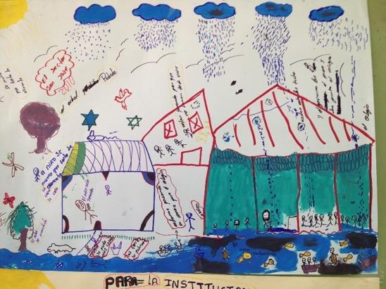
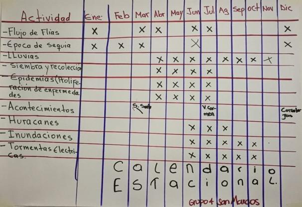
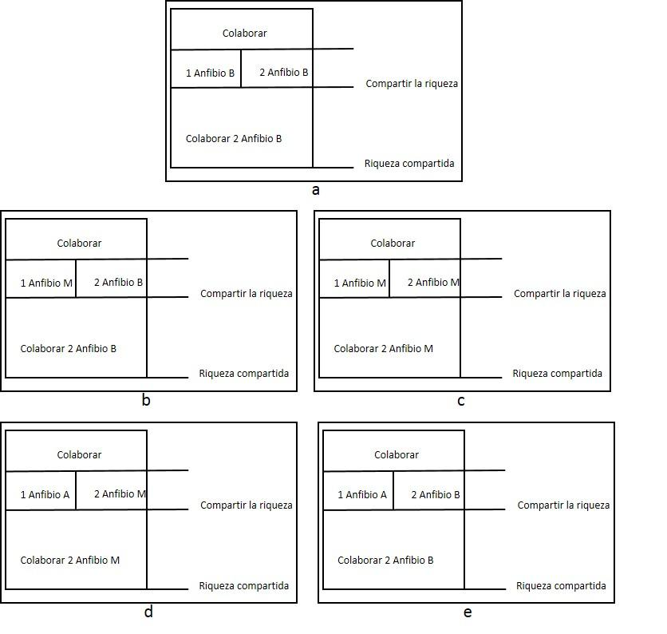
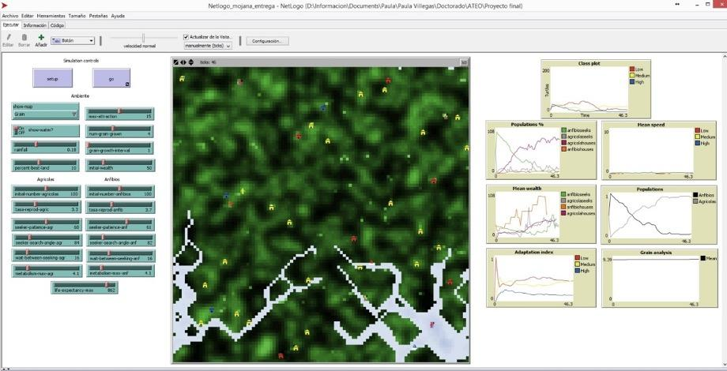
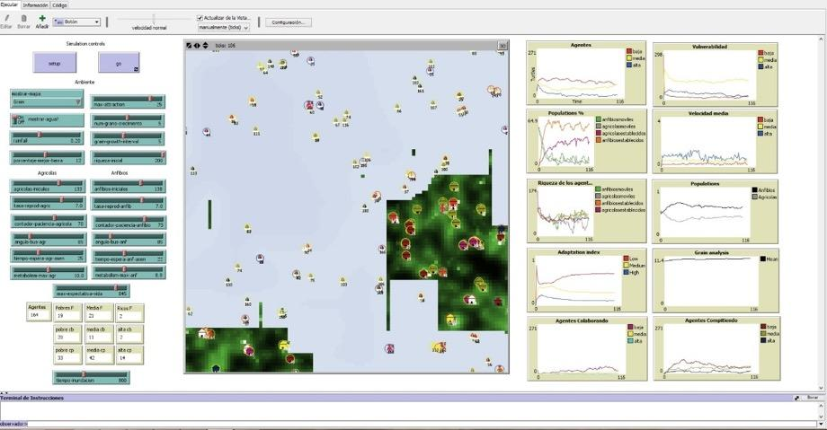

::: {#resumen}
## Resumen {.unnumbered}

Los análisis de riesgo por inundación en Colombia, se han enfocado en la modelación física de la amenaza y en la valoración de la vulnerabilidad física y social, pero no se han integrado estos dos análisis en la evaluación del riesgo. El trabajo presentado hace énfasis en la inclusión de los elementos sociales y el conocimiento de las comunidades, como base para la generación de modelos de evaluación del riesgo. Específicamente, se propone un modelo para hacer modelos, en el marco de procesos de participación local. Para esto se utiliza la metodología GAIA. Los artefactos desarrollados son: MOJANA, MOJANACOOP y MOJANAREAL, los cuales reflejan en su diseño los principales componentes del metamodelo. Las variables y procesos a modelar se representan a través de las reglas, que permiten integrar el fenómeno de la inundación y las características del sistema social. Para el desarrollo de los modelos se utiliza el caso de estudio de la ecorregión de la Mojana y se pudo concluir que las variables más importantes para analizar la vulnerabilidad social son: la condición de habitabilidad, las actividades productivas, los procesos de cooperación y, el acceso a la salud y educación de las comunidades locales. Para el caso específico de la ecorregión de la Mojana, la vulnerabilidad social es media y esta se encuentra relacionada con las formas de adaptación a los procesos de inundación.

**Palabras clave**

Amenaza, comunidades, inundación, modelación, riesgo, vulnerabilidad

**Flood risk management: a metamodel for the development of participatory artifacts. Case study in the ecoregion of La Mojana (Colombia)**

:::

::: {#abstract}
## Abstract {.unnumbered}

Flood risk analyzes in Colombia have been focused on the threat of physical modeling and social vulnerability and physical assessment, yet these two analyzes have not been integrated into the risk assessment. The research goal is to include the social elements and the communities' knowledge for the risk assessment models generation. Specifically, the research proposes a model to make models with the local participation processes. The GAIA methodology was used. The artifacts developed are MOJANA, MOJANACOOP, and MOJANAREAL. They reflect in their design the main metamodel components. The variables and processes were represented through the rules. The rules integrate the flooding phenomenon and social system characteristics. For the model's development, the case study is the Mojana ecoregion. In conclusion, the essential variables to analyze social vulnerability are the habitability condition, the productive activities, the cooperation processes, and the access to health and education of local communities. In the specific case of the Mojana ecoregion, social vulnerability is medium. The vulnerability was related to the types of adaptation to flooding processes.

**Keywords**

Communities, flooding, hazard, modelling with stakeholders, risk, vulnerability

:::

## 14.1 INTRODUCCIÓN

La gestión del riesgo es “un proceso social orientado a la formulación, ejecución, seguimiento y evaluación de políticas, estrategias, planes, programas, regulaciones, instrumentos, medidas y acciones permanentes para el conocimiento y la reducción del riesgo y para el manejo de desastres, con el propósito explícito de contribuir a la seguridad, el bienestar, la calidad de vida de las personas y al desarrollo sostenible” [[1]](#ref-1). 

La Ley 1523 de 2012, afirma que se deben desarrollar los planes departamentales, distritales y municipales de gestión del riesgo y estrategias de respuesta. El Decreto 1807 de 2014 “relativo a la incorporación de la gestión del riesgo en los planes de ordenamiento” [[2]](#ref-2), explica que para la evaluación del riesgo de desastres por inundación se deben hacer: análisis detallado de amenaza, evaluación de vulnerabilidad, evaluación del riesgo y determinación de medidas de mitigación. En conclusión, el problema de la gestión del riesgo por inundaciones en el país implica comprender el fenómeno natural de la inundación y los impactos que este tiene en el territorio; con el propósito no solo de conocer el problema, sino también generar soluciones de prevención, reducción y manejo. En este sentido, esta investigación plantea que no solo se deberían generar modelos que representan la dinámica física de inundación; sino también incorporar el sentido que para las personas tiene su territorio, el lugar que habitan. Una de las formas de integrar estos modelos es a través de artefactos participativos, incorporando el conocimiento local.

Según Medina-Sanson et al [[2014]](#ref-2014), el territorio en esta investigación es entendido como ese espacio que “articula estructuras y procesos bióticos y ecológicos con la dinámica política, económica y cultural de las sociedades humanas. El territorio es un espacio con elementos y recursos de diferente naturaleza, 

ocupado, modificado y regulado por grupos humanos con perspectivas e intereses diferenciados, dentro del cual se dan procesos de disputa, negociación y concertación” [[3]](#ref-3). De esta manera el territorio es concebido como un concepto integrador, que no se restringe a dimensiones físicas y es visto como un sistema complejo que se encuentra compuesto por elementos ecológicos, sociales, culturales, económicos, político institucionales y urbano-regionales. Abordar el análisis de un territorio implica reconocer diferentes escalas espaciales y temporales, procesos “horizontales y verticales de negociación, ocupación y control” [[3]](#ref-3), procesos de cooperación, diversidad de actores e instituciones, así como relaciones. El territorio puede asumir las más diversas “escalas, formas y manifestaciones” [[4]](#ref-4). Esta investigación soporta el análisis de ese territorio desde el concepto de sistemas socio-ecológicos (Social-Ecological System-SES) a través de un modelo de sistema genérico y que se utiliza como herramienta de gestión [[5]](#ref-5). 

::: {#box1 .callout-important style="background-color: #e3f0fbff; padding:20px; border: none !important;" appearance="minimal" icon="false"}
**Caja 1.** Conceptos clave Los sistemas socio-ecológicos contemplan cuatro subsistemas: natural, visión del mundo, control/gestión y tecnología. Además, tiene cuatro órdenes de complejidad: físicos, biológicos, sociales y semióticos. Los problemas sociales y ecológicos son problemas sistémicos y de gestión, que operan en diferentes escalas, desde lo global a lo local. Son problemas de gestión que requieren una solución sostenida, coordinada y una respuesta impulsada por responsables políticos. Este término se relaciona con el sistema holístico hacía elementos humanos y no humanos del problema de interés. Este concepto se ha creado con la idea que “los ecosistemas que muchos quieren proteger se embeben en los diferentes niveles de organización social” [[5]](#ref-5). La noción de Buen vivir esta relacionada con vivir en plenitud, saber vivir en armonía con los ciclos de la Madre Tierra, del cosmos, de la vida y de la historia, y en equilibrio con toda forma de existencia en permanente respeto [[6]](#ref-6).
:::

En este sentido, los sistemas socio-ecológicos en la investigación se pueden ver representados en los artefactos diseñados, y tienen como propósito servir de herramientas de apoyo para orientar procesos de planeación en el territorio y de esta manera, generar estrategias que aporten al bienestar de la población. Este bienestar, puede ser entendido desde diferentes modelos y enfoques. El “Buen vivir” (Caja 1 [[6]](#ref-6)) es uno de ellos y resulta del trabajo con las comunidades.

Por otro lado, esta investigación se aborda desde un enfoque interdisciplinar y orientada por el dialogo de saberes, donde se busca analizar la modelación integrada teniendo en cuenta que la multidimensionalidad de los problemas exige ir más allá de la disciplina de la ingeniería hidráulica. Por ejemplo, de la física (dado que el agua es uno de los componentes estructurales del territorio) o de las ciencias sociales (para considerar las dinámicas sociales y comunitarias como otros determinantes de las dinámicas territoriales).

Remolina (2014) [[7]](#ref-7) entiende la interdisciplinariedad “como el paso de la multiplicidad de las disciplinas a su integración en un pensamiento complejo” y él enfatiza en tres niveles. El primero, la uni-disciplinariedad y multidisciplinariedad que consiste en el estudio de un mismo objeto por varias disciplinas. El segundo, Inter-disciplinariedad que implica la transferencia de métodos de una disciplina a otra. El tercero, la trans-disciplinariedad que se basa en la existencia de diversos niveles de realidad, entre los cuales se da discontinuidad, con saltos cualitativos entre uno y otro nivel. De esta manera, “la interdisciplinariedad busca restituirle a la realidad su integridad reconstruyéndola en su complejidad por medio de la integración de los conocimientos”. Pero, advierte, no todo es integrable inmediatamente dado que la complejidad de la realidad es orgánica, y en un organismo cada dimensión o componente tiene funciones y conectores diferentes.  En el proceso interdisciplinar que se quiere abordar en esta investigación, las diversas disciplinas han de integrarse de manera orgánica y gradual. Aquí se dan los primeros pasos para pasar del primer nivel de interdisciplinariedad al segundo, pues se asume que no es suficiente el abordaje del territorio desde la Ingeniería hidráulica, sino que debe empezar a contemplar aportes de las ciencias sociales para entrar en diálogo con los conocimientos locales. 

## 14.2 ZONA DE ESTUDIO

La Mojana es una ecorregión (Fig. 1) de especial importancia en Colombia que hace parte del complejo de humedales de la Depresión Momposina, la cual es una cuenca hidrográfica sedimentaria de 24,650 km2 reguladora de los caudales de los ríos Magdalena, Cauca y San Jorge. Estos humedales cumplen la función de amortiguación de inundaciones ya que permiten distribuir las cabezas de agua originadas por lluvias en las partes altas de la región Andina, facilitando la decantación y acumulación de sedimentos, funciones de control indispensables para la Costa Caribe [[6]](#ref-6). La ecorregión se localiza en jurisdicción de cuatro departamentos (Sucre, Bolívar, Córdoba y Antioquia) y comprende 28 municipios, con una población de alrededor de 929,669 habitantes y una superficie de 28,461 Km2 [[7]](#ref-7).

**Figura 1. **Mapa de la ecorregión de la Mojana (Fondo de Adaptación).

Los primeros pobladores de la región de La Mojana fueron los indígenas Zenues, quienes colonizaron y adecuaron la depresión Momposina e iniciaron su poblamiento desde el siglo IX a.C, hasta los siglos X-XII d.C [[8]](#ref-8). En este proceso de poblamiento aparecen importantes ingenieros hidráulicos que han marcado la historia del manejo de los recursos hídricos en Colombia y en Latinoamérica. Con el fin de adaptarse a los periodos de inundación construyeron plataformas artificiales (2 o 3 m de altura) para instaurar sus viviendas, de esta forma los niveles del agua no lograban afectar su hábitat. Adicionalmente este sistema estaba compuesto por canales artificiales y camellones –partes elevadas entre canal y canal– que encausaban las aguas facilitando su salida al mar. Las aguas se distribuían de manera uniforme, circulaban más lentamente durante la época de inundaciones y, en época de sequía, permanecían humedeciendo los camellones donde se ubicaban los cultivos [[8]](#ref-8). 

Dichas técnicas se abandonaron y las causas no se establecieron. Sin embargo se le atribuyen a fenómenos ambientales relacionados con periodos de sequías. En el siglo XVI empieza el proceso de poblamiento español, que se caracteriza especialmente por la introducción de ganado en la zona de parte de los hermanos Heredia. Apareciendo de esta forma la ganadería y explotación agrícola. Los hechos del proceso de colonización marcan una nueva historia para la región. Donde las actividades económicas, ya no vistas como procesos de subsistencia de sus habitantes empiezan a enfocarse en la sobreexplotación del suelo, el agua y los seres humanos [[9]](#ref-9).

En los últimos años, la ecorregión ha cambiado debido al uso, ocupación del territorio y por el manejo de las cuencas de los ríos que confluyen en el delta hídrico. Adicionalmente la construcción de obras civiles ha generado cambios en el complejo cenagoso y fluvial. La infraestructura se ha orientado al control del agua mediante obras que afectan la dinámica hídrica y desestabilizan los sistemas hidrobiológicos, en lugar de adaptarse a las condiciones del medio natural para su aprovechamiento.

La ecorregión de la Mojana ha sido el caso de estudio para aplicar los modelos integrados provenientes del metamodelo. Específicamente la información y los procesos fueron desarrollados en los municipios de Nechí (Antioquia), San Marcos (Sucre), Magangué (Bolivar), Montelíbano (Córdoba) y en la Depresión Momposina en Mompox (Bolívar). 

## 14.3 MATERIALES Y MÉTODOS

Según Kroes el diseño “es un proceso de invención, una generación inteligente y evaluación de especificaciones de nuevos objetos, artefactos; cuya forma y función logren los objetivos establecidos y satisfagan las necesidades, pero también contemplen limitaciones y restricciones” [[10]](#ref-10). Ejemplos de artefactos pueden ser: una organización, una máquina, una herramienta, entre otros. El diseño tiene una actividad mental y una actividad física. Respecto al aspecto mental “El verdadero trabajo de fabricación se realiza bajo la guía de un modelo, de acuerdo con el cual se construye el objeto. Dicho modelo puede ser una imagen contemplada por la mente o bien un boceto en el que la imagen tenga ya un intento de materialización mediante el trabajo” [[11]](#ref-11). Según Epstein “Cualquiera que se aventure a proyectar, o imaginar una dinámica” ejecuta un modelo [[12]](#ref-12).

::: {#box2 .callout-important style="background-color: #e3f0fbff; padding:20px; border: none !important;" appearance="minimal" icon="false"}
**Caja 2.** Según Epstein [[12]](#ref-12), además de predecir, los modelos son para (i) explicar, (ii) recopilar datos, (iii) iluminar la dinámica del núcleo, (iv) sugerir analogías, (v) descubrir nuevas preguntas, (vi) fomentar el hábito de la mente crítica, (vii) soportar los resultados de los rangos plausibles, (viii) iluminar las incertidumbres principales, (ix) ofrecer opciones de crisis en tiempo real, (x) demostrar compensaciones y sugerir eficiencia, (xii) desafiar a la robustez que prevalece a través de las perturbaciones, (xiii) exponer lo que suele pensarse como incompatible con los datos disponibles, (xiv) capacitar practicantes, (xv) disciplinar el diálogo sobre políticas, (xvi) educar al público en general y (xvi) revelar lo aparentemente simple al ser complejo.
:::

### 14.3.1 Modelos usados en el diseño

**Modelos participativos:** según Voinov y Bousquet [[13]](#ref-13) tiene entre sus propósitos el aprendizaje compartido, la colaboración y participación de actores en los procesos de modelado. La eficiencia de la participación depende entre otras, de la relación entre los actores, la habilidad para comunicar e intercambiar información y conocimiento, y los métodos que apoyan esta actividad.

**Modelos mentales:** se enfoca en la habilidad de las personas para predecir ciertos resultados, usando razonamientos basados en observaciones previas. Estos razonamientos trasladan los procesos del mundo externo a palabras, números o símbolos [[14]](#ref-14).

**Modelos hídricos:** el modelado hídrico puede realizarse utilizando dos tipos de enfoques: hidrodinámico e hidrológico. Ambos pueden estar relacionados en un modelo de inundación. Para conocer variables como el caudal, la velocidad y la profundidad se pueden utilizar modelos hidrodinámicos, que utilizan métodos numéricos para resolver las ecuaciones de Navier-Stokes, para un flujo incomprensible. De esta manera se puede conocer la forma de la inundación, representada sobre un modelo de elevación digital. Los modelos pueden ser de tipo unidimensional o bidimensional [[15]](#ref-15). Para el modelado de inundaciones se utilizan las ecuaciones de aguas someras donde se parte de las siguientes suposiciones [[16]](#ref-16): (a) fluido homogéneo “H”, (b) velocidades verticales mucho menores que las velocidades horizontales, (c) la extensión vertical es mucho menor que la horizontal, (d) las aceleraciones verticales pueden despreciarse, (e) la distribución de las presiones es hidrostática, (f) las partículas tienen un movimiento rectilíneo en el plano horizontal, (g) las fuerzas inerciales son mucho mayores que las fuerzas viscosas.

El sistema de ecuaciones consta de las correspondientes al movimiento horizontal, la ecuación de continuidad y las ecuaciones de transporte. El conjunto de ecuaciones diferenciales parciales en combinación con condiciones iniciales y de frontera se resuelven en una cuadrícula de diferencias finitas. 

**Figura 2.** Representación de las ecuaciones de aguas someras [[17]](#ref-17).

Donde H es la profundidad promedio del agua, h la perturbación de la superficie libre y u, v las velocidades horizontales, g la gravedad, Sx y Sy representan los términos fuente (fricción, viento coriolis, etc) [[9]](#ref-9).

$$∂u∂t+u∂u∂x+v∂u∂y+zu,v=-g ∂h∂x+Sx              (1)$$

$$∂v∂t+u∂v∂x+v∂v∂y+zu,v=-g ∂h∂y   +Sy           (2)$$

$$∂h∂t+∂u∂xH+h+∂∂yH+hv=0                       3$$

**Modelos basados en agentes**: los modelos basados en sistemas de agentes tienen la capacidad de representar el comportamiento de actores humanos de manera realista, su heterogeneidad, interacción con el ambiente natural y el aprendizaje evolutivo [[18]](#ref-18). 

::: {#box3 .callout-important style="background-color: #e3f0fbff; padding:20px; border: none !important;" appearance="minimal" icon="false"}
**Caja 3.** Retos de la modelación basada en agentes [[18]](#ref-18) El modelado de la conducta de los agentes: la exploración del diseño de las decisiones de los agentes es un reto en la medida que se debe generar un balance en las teorías de toma de decisiones, pero también de las observaciones empíricas.  Análisis de sensibilidad, verificación y validación: el grado de fiabilidad y robustez de este tipo de sistemas pide información de microescala de los comportamientos e interacciones de los agentes. Lo que implica un gran número de parámetros por los cuales el modelo es sensible. Es importante precisar que un análisis de este tipo puede ser vital cuando se aplican en un contexto de políticas. Por lo que se exige solidez en la construcción y éxito en lo relacionado con la reproducción de tendencias y patrones reales.  El acoplamiento de modelos socio-demográficos, ecológico y biofísico: cuando se usan para estudiar las dinámicas de los sistemas complejos se concentran en la necesidad de integrar la conducta humana con otros modelos. Un reto es poder identificar la vinculación de variables y reunir en el mundo real los datos para vincular el modelo.
:::

**Metamodelo**: el prefijo meta, en griego, significa superior o posterior. En filosofía, es usado a menudo para hablar sobre una propia categoría. En el contexto de la ingeniería de software, meta significa que el modelo que se construye representa otros modelos, es un modelo de modelos [[19]](#ref-19).

### 14.3.2 Propuesta de un metamodelo de modelos integrados para el desarrollo de artefactos participativos

En las comunidades que se encuentran ubicadas en zonas de amenaza por inundación periódicas, se ha observado que muchos de sus hábitos se relacionan con la variación de los niveles del agua. En este sentido, comprender los cambios en los niveles del agua y aquellos generados en los hábitos de las comunidades resulta importante para el diseño e implementación de estrategias que promueven disminuir la vulnerabilidad de las comunidades y hacerlas más resilientes frente a dichas amenazas.  

Recientemente, en Colombia se han desarrollado diferentes instrumentos como los planes de gestión del riesgo, los sistemas de alertas tempranas, los planes de ordenamiento y manejo de cuencas, entre otros, que han ganado importancia como herramientas de política pública para disminuir la vulnerabilidad y generar estrategias de gestión del riesgo en el territorio. Para generar escenarios relacionados con la interacción agua-comunidad es fundamental la integración de variables que representan procesos sociales y procesos ecológicos. La dinámica natural de las causas y efectos en cadena, la consideración de los efectos y la no linealidad. A partir del trabajo de campo, realizado en la ecorregión de la Mojana, surge el metamodelo. La selección de los municipios en donde se hizo el trabajo de campo consideró los siguientes criterios: (i) hicieran parte de la ecorregión de la Mojana y hubieran tenido impactos por las inundaciones durante los años 2010-2011, (ii) se pudiera acceder por transporte terrestre, (iii) se hubieran considerado en el proyecto de “Evaluación Probabilística de Riesgo por Inundación” liderado por la UNGRD. 

La información de los talleres se construyó principalmente con el apoyo de las Instituciones educativas, donde se llevaron a cabo espacios de participación que incluyeron jóvenes, profesores y padres de familia. Quienes estuvieron de acuerdo con el uso de los resultados en el proceso de investigación. Los recorridos territoriales se llevaron a cabo en zonas que tuvieron afectaciones por las inundaciones, durante los años 2010 y 2011 y contaron con el consentimiento de los entrevistados. También fueron utilizados los resultados de los ejercicios de participación para el análisis de la vulnerabilidad social, en el marco del proyecto liderado por la UNGRD [[22]](#ref-22) donde se establecen los criterios para realizar dicho análisis a partir de hogares e individuos, con el soporte de los Consejos Municipales para la Gestión del Riesgo. A continuación, se presenta la descripción de algunos de los insumos que fueron usados para el diseño, los cuales se encuentran de manera detallada en la tesis doctoral “Gestión del riesgo por inundaciones: un metamodelo para el desarrollo de artefactos particitipativos” [[23]](#ref-23).

En los talleres llevados a cabo en septiembre del año 2013 en el municipio de San Marcos (Sucre), se identificó con las comunidades que el eje estructurante de las dinámicas del territorio en la región de la Mojana es el agua. Los municipios que habitan esta zona del país están rodeados por agua y allí se presentan inundaciones lentas. En los talleres con las comunidades se observa que el municipio de San Marcos se encuentra rodeado por ciénagas y caños. El problema más relevante que han tenido durante los últimos años ha sido la inundación ocasionada por el Fenómeno de la Niña 2010–2011. Respecto a esta situación hay diferentes percepciones. Los niños consideran que la inundación es un sinónimo de alegría y recreación. Sin embargo, no les gusta que se suspendan las clases en el Colegio. Respecto a los adultos, se identifican problemas en la medida que tuvieron que desplazarse a otros lugares, hubo daños en las viviendas y problemas en los cultivos. En la Figura 3, se observa la descripción que hace la comunidad sobre los efectos de las inundaciones.

**Figura 3. **Descripción de inundaciones, en el municipio de San Marcos (Sucre) [[21]](#ref-21).

En los recorridos territoriales se observaron las formas de adaptación de las comunidades a las inundaciones, principalmente reflejadas en las viviendas. Una característica es el uso de infraestructura palafítica en escuelas, que permite mejorar las condiciones de permanencia de los estudiantes durante períodos de inundación. Además de estos mecanismos, la comunidad construye tambos artesanales (uso de madera) al interior de las viviendas o desarrolla el enterrado, que consiste en rellenar el piso de las viviendas (tierra y residuos sólidos) para levantarlas. De esta forma, el nivel de la inundación no afecta los electrodomésticos, los diferentes elementos de las edificaciones y directamente a los seres humanos. 

En los talleres realizados con la Unidad Nacional para la Gestión del Riesgo de Desastres-UNGRD durante el año 2018, se identificaron las mismas formas de adaptación, no solo en el municipio de San Marcos, sino también en Montelíbano, Magangué y Mompox. Lo que refleja la cultura anfibia de estas comunidades. Se identifican los tambos al interior de las viviendas y también el uso de bolsacretos para controlar el paso del agua a las viviendas. Se puede observar que, durante los períodos de inundación, aumenta la producción de peces y se incrementa esta actividad económica en los municipios. En muchos casos, los pescadores tienen dos viviendas, una en la zona de la inundación (generalmente con tambos) y otra en la zona no inundada. La inundación también resulta clave para la producción de cultivos como el arroz. Sin embargo, en algunos casos los niveles del agua pueden llegar a afectar la cosecha. 

Además de la relación de la inundación con las actividades productivas, también se encontró una relación con la salud. Durante los talleres con las comunidades se identificó que durante los meses de lluvias se presentan epidemias como se observa en la Figura 3 que afectan principalmente a los niños. En los recorridos territoriales que se hicieron en el año 2017, se identificó que las personas se mueven de sus viviendas y no se adaptan, solo en los momentos que el agua empieza a afectar la salud de los habitantes o cuando la vivienda se ha inundado totalmente. Según los relatos, cuando el agua supera los 40 cm y se queda estancada durante varios meses (más de un mes) se empiezan a generar problemas de salud. En estos momentos la comunidad se une y coopera de diferentes formas. Por ejemplo, facilitando entre varias personas el transporte de los niños al centro de salud en canoas.

**Figura 4.** Calendario estacional en el municipio de Magangué (Bolívar) [[22]](#ref-22).

En los talleres llevados a cabo en la UNGRD durante el año 2018 [[22]](#ref-22), se pudo identificar la cooperación como una fortaleza de las comunidad que la hace menos vulnerable. Durante la inundación, las personas se unen para vigilar las viviendas evacuadas, hay personas transmitiendo comunicados de la situación con el apoyo de megáfonos, se hacen monitoreos en el río, y también se unen para hacer la comida y trabajar en equipo en los campamentos (albergues). Diferentes entidades apoyan la situación de emergencia, y allí se destaca el papel de los organismos de socorro y aquellos relacionados con la gestión del riesgo en el municipio como: La Policía, La Defensa Civil, La Iglesia, La Alcaldía y La Emisora. Del procesamiento del trabajo de campo, resultan relatos y análisis que son el insumo para el metamodelo [[20]](#ref-20), y las variables que resultan claves para el análisis de la vulnerabilidad se presentan en la  Figura 5. 

**Figura 5.** Elementos claves para el diseño del metamodelo a partir del trabajo de campo en la ecorregión de la Mojana.

La metodología utilizada para el análisis y diseño del metamodelo se titula GAIA [[23]](#ref-23). Esta metodología se enfoca en una visión de sistemas multiagentes como una organización computacional consistente en la interacción de varios roles. Los agentes representan un avance en la abstracción, dado que pueden ser usados para entender naturalmente los modelos y desarrollar sistemas complejos distribuidos. A través de esta metodología se realiza un análisis que va desde unos requerimientos del diseño que es suficientemente detallado y que se pueden implementar directamente. El principal modelo usado en GAIA incluye dos modelos, el primero de roles y el segundo de interacciones. El rol se define por cuatro atributos: funcionalidad, permisos, actividades y protocolos. Las responsabilidades determinan la funcionalidad. Los permisos son los derechos u obligaciones asociados con el rol. Se relacionan directamente con los recursos que se encuentran disponibles para realizar sus responsabilidades. Las actividades son las acciones privadas de los agentes, sin interactuar con otros agentes. El rol se identifica con un número de protocolos, que se definen por la interacción con otros roles [[23]](#ref-23). 

::: {#box4 .callout-important style="background-color: #e3f0fbff; padding:20px; border: none !important;" appearance="minimal" icon="false"}
**Caja 4.** Modelo de roles: permisos Anfibios: el propósito de este rol es adaptarse a las condiciones de inundación y llevar a cabo sus actividades productivas.  Permisos: revisar Uso del suelo // inundado o seco. Mover Tomar la decisión // moverse a otro lugar si no está inundado o quedarse en el lugar si está inundado. Asentarse Tomar la decisión // asentarse y llevar a cabo sus actividades productivas o seguir moviéndose. Agrícolas: el propósito de este rol es llevar a cabo sus actividades productivas en zonas secas. Permisos: revisar Uso del suelo // inundado o seco. Mover Tomar la decisión // moverse a otro lugar si no está seco o quedarse en el lugar si está seco. Asentarse Tomar la decisión // asentarse y llevar a cabo sus actividades productivas o seguir moviéndose.
:::

En el metamodelo diseñado en esta investigación son identificados dos roles, los anfibios y los agrícolas. Los cuales representan el comportamiento de la población en la Mojana. Estos a su vez pueden adoptar dos estados: buscadores y asentados. Al comienzo el sistema inicializa el número total de agentes; para cada uno de los cuales las rutinas son las mismas por población (buscar, moverse, asentarse, reproducirse y morir). La principal diferencia entre los dos tipos de agentes consiste en que el proceso de asentarse depende de la condición del suelo (seco o inundado). Las rutinas se predefinen en función de la riqueza de las parcelas, no obstante, su incremento y estabilidad dependen adicionalmente de la velocidad de búsqueda y de la riqueza acumulada. Asimismo, estas últimas dan lugar a la configuración de tres clases sociales alta, media y baja. Cuando el tiempo de búsqueda de un agente se agota, este puede cambiar su condición de anfibio a agrícola o viceversa [[27]](#ref-27).

::: {#box5 .callout-important style="background-color: #e3f0fbff; padding:20px; border: none !important;" appearance="minimal" icon="false"}
**Caja 5.** Modelo de roles: responsabilidades Anfibios: siempre que haya agua, adaptarse y llevar a cabo actividades de pesca. Agrícolas: siempre que haya cultivos y el terreno esté seco, realizar las labores de agricultura.
:::

Para el caso del metamodelo se tienen dos roles: anfibios y agrícolas. A continuación, se presenta un ejemplo de uno de ellos. El operador w significa infinitas repeticiones:

**Tabla 3. **Esquema para el rol del anfibio.

| Esquema del rol Anfibio | Anfibio |
| --- | --- |
| Descripción | Este rol se relaciona con garantizar que durante los períodos de inundación se realice una adaptación en términos de habitabilidad y actividades productivas. Además, que se lleven a cabo actividades de cooperación para disminuir las condiciones de vulnerabilidad social |
| Protocolos y actividades | Moverse, asentarse, colaborar, reproducirse, morir |
| Permisos | Revisar Uso del suelo // inundado o seco. |
| Permisos | Asentarse Tomar la decisión // asentarse y llevar a cabo sus actividades productivas o seguir moviéndose |
| Permisos | Aprovechar Valores de riqueza // a través de sus actividades productivas mejorar o no su riqueza acumulada |
| Responsabilidades |  |
| Vida | Anfibio: moverse, asentarse, colaborar, reproducirse, morir |
| Seguridad | Riqueza >0 |
| Seguridad | edad <esperanza de vida |

Un ejemplo de los protocolos presentados en los modelos se presenta en la Figura 5 [[24]](#ref-24). 

Clase baja: cuando está rodeado de agentes clase alta (A), media (M) o no tiene vecinos (N) en su vecindad de Moore [[28]](#ref-28),  el agente decide tomar todos los recursos de la tierra para su beneficio individual. Cuando está rodeado de algún agente clase baja (B) en su vecindad de Moore, el agente decide cooperar con el agente de clase baja, pues este basado en el concepto de la igualdad ayuda a sus semejantes.

Clase media: cuando está rodeado de agentes clase alta (A), o no tiene vecinos (N) en su vecindad de Moore, el agente decide tomar todos los recursos de la tierra para su beneficio individual. Con los individuos de clase superior a él no colabora porque tienen demasiados recursos. Cuando está rodeado de algún agente clase baja (B) o media (M) en su vecindad de Moore, el agente decide cooperar con el agente de clase baja o media, pues con su ideal de sociedad equitativa cree que lo mejor es ayudar a sus semejantes y los menos favorecidos.

Clase alta: cuando está rodeado de agentes clase alta (A) o no tiene vecinos (N) en su vecindad de Moore, el agente decide tomar todos los recursos de la tierra para su beneficio individual. Este agente tiende a competir con los mismos individuos de su clase. Cuando está rodeado de algún agente clase baja (B), o media (M) en su vecindad de Moore, el agente decide cooperar, pues también es consiente que la sociedad debería ser equitativa y por esta razón decide donar parte de sus recursos con sus vecinos. 

**Figura 6.** Modelos de interacción. a reglas clase baja. b y c reglas clase media. d y e reglas clase alta. Para la estructura de un autómata celular se puede definir una vecindad establecida para cada celda, la que consiste en un conjunto contiguo de celdas. Esta vecindad puede estar formada por las celdas inmediatamente contiguas a la celda en cuestión (vecindad de Von Neuman , cuatro celdas, o vecindad de Moore, ocho celdas).

## 14.4 RESULTADOS

Fueron desarrollados diferentes modelos que generaron artefactos, esto a partir del metamodelo presentado. El primer artefacto de simulación que se presenta se denomina MOJANA: Modelo Organizacional Jerárquico de Agentes Naturales del Agua. Este modelo fue evolucionando a partir de los hallazgos encontrados en campo, dando paso al segundo artefacto denominado MOJANACOOP: Modelo Organizacional Jerárquico de Agentes Naturales del Agua Cooperativos. El tercero MOJANAREAL: Modelo Organizacional Jerárquico de Agentes Naturales del Agua en tiempo real. A continuación, se hace una descripción del desarrollo y resultados de cada uno. Para los dos primeros se utiliza como medio para la integración la plataforma NetLogo y para el tercero, se construye un modelo con actores en el municipio de San Marcos que integran su conocimiento al artefacto.

### 14.4.1 MOJANA: Modelo Organizacional Jerárquico de Agentes Naturales del Agua [[25]](#ref-25)

**Propósito del modelo:** analizar la influencia de la inundación y de los usos del suelo en las variables correspondientes a la desigualdad en el territorio y las dinámicas de asentamiento. Variables que son conocidas, que se acostumbran a usar en ejercicios de planeación y en la generación de escenarios de desarrollo territorial [[26]](#ref-26).

**Usuarios y actores: **los usuarios iniciales fueron el equipo de modeladores. Se considera que este tipo de modelos inspirados en una problemática local, pero que no tienen información real del territorio, podrían servir para el diseño de políticas públicas en el marco de la gestión del riesgo por inundación.

**Conceptualización del sistema:** los procesos que se modelan son el fenómeno de inundación, el aprovechamiento del territorio y la interacción de la población con estos. El territorio está modelado como un autómata celular cuyas celdas albergan una cantidad de grano, que representa la riqueza de dicha unidad territorial, medida no solo en términos de recursos naturales sino también en elementos humanos como infraestructura y servicios, entre otros. El territorio tiene capacidad de regeneración por tanto la cantidad de grano que se consuma puede ser recuperada en el tiempo. Las poblaciones humanas se representan por un sistema de agentes que toman provecho del territorio para mejorar su riqueza acumulada, sin embargo, la no adaptación puede degradarla. La interacción de los agentes con el territorio conlleva al mejoramiento o empobrecimiento de este. Otro autómata celular simula una inundación que se produce periódicamente. El nivel de agua en las unidades territoriales puede ser atractivo o repulsivo para los agentes. Dependiendo de la adaptación del agente al agua, esta degrada o no su bienestar. La presencia periódica de la inundación, la capacidad de regeneración y modificación del territorio sumado a la posibilidad de cambio en los agentes hacen que la herramienta computacional se caracterice por exhibir un entorno variante en el tiempo.

**Variables a modelar:** en el aplicativo se consideran dos tipos de agentes que emulan el comportamiento de la población en la ecorregión: agrícolas y anfibios. Al comienzo el sistema inicializa el número total de agentes (agrícolas y anfibios); para cada uno de los cuales las rutinas son las mismas por población (i.e. buscar, moverse, asentarse, reproducirse y morir). La principal diferencia entre los dos tipos de agentes consiste en que el proceso de asentarse depende de la condición del territorio (i.e. seco o inundado).

**Figura 7. **Componentes modelo MOJANA [[25]](#ref-25).

**Disponibilidad de códigos:** integra una jerarquía de tres submodelos (Fig. 7). Estos toman como base a los aplicativos: NetLogo wealth distribution model (Wilensky, 1998), NetLogo Urban Suite-Sprawl Effect model (Felsen y Wilensky, 2007) y NetLogo Erosion model (Dunham, Tisue y Wilensky, 2004) [[25]](#ref-25).

**Implementación:** se hizo en la plataforma NetLogo y los detalles se pueden encontrar en [[25]](#ref-25) . En la Figura 8 se observa la interfase del artefacto construido en NetLogo.

**Figura 8.** Interfase del modelo MOJANA [[25]](#ref-25)*.*

|  |  |
| --- | --- |

**Figura 9.** Resultados del modelo MOJANA (izquierda) Cantidad de agentes por clases sociales. (derecha) Cantidad de agentes por tipos de agentes.

Se observa en la Figura 9 (izquierda), como la clase social baja predomina. Las presiones del entorno son representadas en la cantidad de grano, que seleccionan las clases existentes. En la Figura 9 (derecha) se observa cómo predominan los agrícolas asentados, dado que existe mayor cantidad de territorio sin agua. Un comportamiento similar tiene actualmente la región, donde los niveles de pobreza son muy altos, reflejados en un NBI promedio de: 64.4 y la cantidad de terratenientes es baja. 

### 14.4.2 MOJANACOOP: Modelo Organizacional Jerárquico de Agentes Naturales del Agua Cooperativos

**Propósito del modelo:** analizar la influencia de la inundación y de los usos del suelo en la variable correspondientes a la vulnerabilidad social. Esto en el marco del riesgo por inundación.

**Usuarios y actores:** los usuarios iniciales fueron el equipo de modeladores. Se considera que este tipo de modelos inspirados en una problemática local, pero que no tienen información real del territorio, podrían servir para el diseño de políticas públicas en el marco de la gestión del riesgo por inundación.

**Conceptualización del sistema:** los procesos que se modelan son el fenómeno de inundación, el aprovechamiento del territorio y la interacción de la población con estos. El territorio está modelado como un autómata celular cuyas celdas albergan una cantidad de grano, que representa la riqueza de dicha unidad territorial, medida no solo en términos de recursos naturales sino también en elementos humanos como infraestructura y servicios, entre otros. El territorio tiene capacidad de regeneración por tanto la cantidad de grano que se consuma puede ser recuperada en el tiempo. 

Las poblaciones humanas se representan por un sistema de agentes que toman provecho del territorio para mejorar su riqueza acumulada, sin embargo, la no adaptación puede degradarla. La interacción de los agentes con el territorio conlleva al mejoramiento o empobrecimiento de este. En esta versión las poblaciones de agentes tienen la capacidad de cooperar. Además, dependiendo de sus características individuales, presentan unos niveles de vulnerabilidad social. Los resultados de un modelo hidrodinámico de la ecorregión representan una inundación que se produce periódicamente. El nivel de agua en las unidades territoriales puede ser atractivo o repulsivo para los agentes. Dependiendo de la adaptación del agente al agua, su vulnerabilidad social cambia. La presencia periódica de la inundación, la capacidad de regeneración y modificación del territorio sumado a la posibilidad de cambio en los agentes hacen que la herramienta computacional se caracterice por exhibir un entorno variante en el tiempo.

**Variables a modelar: **similar al modelo MOJANA.

**Figura 10.** Interfase del modelo MOJANACOOP [[20]](#ref-20) .

**Disponibilidad de códigos:** usa los incluidos en MOJANA y además, integra un modelo de cooperación [[24]](#ref-24).

**Implementación:** la implementación del modelo se hizo en la plataforma NetLogo y los detalles se pueden encontrar en [[20]](#ref-20). En la Figura 10 se observa la interface del artefacto construido en NetLogo. Las reglas para el cálculo de la vulnerabilidad se presentan en la Tabla 4:

**Tabla 4. **Reglas de cálculo para la vulnerabilidad social.

| Variables por agente | Condición | Nivel de vulnerabilidad | Valores |
| --- | --- | --- | --- |
| Habitabilidad | Si el agente se adapta a la condición de inundación o seca | Vulnerabilidad baja | 0 |
| Habitabilidad | Si el agente no se adapta a la condición de inundación o seca | Vulnerabilidad alta | 1 |
| Actividades productivas | Clase alta | Vulnerabilidad baja | 0 |
| Actividades productivas | Clase media | Vulnerabilidad baja | 0.5 |
| Actividades productivas | Clase baja | Vulnerabilidad baja | 1 |
| Cooperación | Coopera | Vulnerabilidad baja | 0 |
| Cooperación | No coopera | Vulnerabilidad alta | 1 |
| Educación | Nivel de educación: alto | Vulnerabilidad baja | 0 |
| Educación | Nivel de educación: medio | Vulnerabilidad media | 0.5 |
| Educación | Nivel de educación: bajo | Vulnerabilidad alta | 1 |
| Salud | Nivel de salud: alto | Vulnerabilidad baja | 0 |
| Salud | Nivel de salud: medio | Vulnerabilidad media | 0.5 |
| Salud | Nivel de salud: bajo | Vulnerabilidad alta | 1 |
| Salud en función de la amenaza | Si el agua sube más de 40 cm | Vulnerabilidad alta | 1 |
| Salud en función de la amenaza | Si el agua no sube más de 40 cm | Vulnerabilidad baja | 0 |
| Vulnerabilidad social | Corresponde a la sumatoria de las variables anteriores | Vulnerabilidad social alta | 4.5-6 |
| Vulnerabilidad social | Corresponde a la sumatoria de las variables anteriores | Vulnerabilidad social media | 1.5-4.49 |
| Vulnerabilidad social | Corresponde a la sumatoria de las variables anteriores | Vulnerabilidad social baja | 0-1.49 |

|  |  |
| --- | --- |

**Figura 11.** Resultados del modelo MOJANACOOP. Cantidad de agentes por clases sociales (izquierda). Cantidad de agentes acorde a los niveles de vulnerabilidad social (derecha).

Se observa en la Figura 11 (izquierda), como la clase social baja predomina, seguida de la media y la alta. Las presiones del entorno son representadas en la cantidad de grano, que seleccionan las clases existentes. En la Figura 11 (derecha) se observa como la vulnerabilidad media es la predominante. Este resultado fue similar en el proyecto generado por la Unidad Nacional para la Gestión del Riesgo de Desastres [[27]](#ref-27). Los factores que inciden en este valor son: las condiciones de habitabilidad, las actividades productivas, la capacidad de cooperación y, el acceso a educación y salud.

### 14.4.3 MOJANAREAL: Modelo Organizacional Jerárquico de Agentes Naturales del Agua en tiempo real

**Propósito del modelo:** generar escenarios de inundación para la ecorregión de la Mojana, donde se puedan discutir estrategias para disminuir la vulnerabilidad social en el territorio. Esto se propone a través de un ejercicio de modelado participativo.

**Usuarios y actores:** los actores que participaron fueron los padres de familia, profesores y estudiantes del grado noveno, de la Institución Educativa San José San Marcos. Los usuarios son los demás grados de la Institución, liderado por los coordinadores del curso.

**Conceptualización del sistema:** los procesos que se modelan son el fenómeno de inundación, el aprovechamiento del territorio y la interacción de la población con estos. El territorio está modelado utilizando fichas de color azul y de color verde. Las primeras corresponden a las zonas inundadas y las segundas a las zonas secas. En dichas celdas, se encuentran recursos naturales como fauna y flora. También se ubican las viviendas, las canoas, y la infraestructura es dibujada (puente, vía y monumento a la cultura anfibia). Las poblaciones humanas están representadas por familias, a las cuales pertenecen las diferentes viviendas y las cuales llevan a cabo diversas actividades productivas. La interacción de las personas con el territorio conlleva a aumentar o disminuir la vulnerabilidad social. La inundación se produce de manera hipotética en la generación de los escenarios. Esto se hace precisando un nivel del agua que aumenta en las unidades territoriales. El cual puede ser atractivo o repulsivo para las familias. Dependiendo de la adaptación de la población al agua, esta disminuye o no su vulnerabilidad social. La presencia periódica de la inundación, la modificación del territorio sumado a la posibilidad de cambio en la población y sus viviendas hacen que el artefacto se caracterice por exhibir un entorno variante en el tiempo.

**Variables a modelar:** se consideran dos tipos de agentes que emulan el comportamiento de la población en la ecorregión: agrícolas y anfibios. Esto es caracterizado acorde al tipo de vivienda que cada familia tiene. Al comienzo el sistema inicializa el número total de agentes (agrícolas y anfibios) que hacen parte de cada familia. La principal diferencia entre los dos tipos de agentes consiste en que el proceso de asentarse depende de la condición del territorio y de la tipología de las viviendas. Las rutinas se predefinen en función de la caracterización de la familia.

**Disponibilidad de códigos:** MOJANAREAL utiliza un ejercicio de juego de rol como metodología.

**Implementación:** la implementación del modelo se hizo en tiempo real, como se observa en la

Figura 12.

**Figura 12.** MOJANAREAL.

Respecto a la resolución del modelo, hay cuatro formas de aproximación para la generación de salidas de modelos. La usada en este caso es: escenarios, donde el modelo es desarrollado para analizar los cambios en la vulnerabilidad social de la población, generados por la inundación y los usos del suelo. Se usó el análisis tipo ¿y si? para explorar resultados de diferentes acciones y sus efectos.

**Escenario 1 de condiciones iniciales:** se construye por parte de los participantes el estado actual del territorio. Se representa la zona de inundación y agrícola del municipio de San Marcos. Los cuadrados azules representan el agua y los verdes las zonas de cultivos. Son localizadas las casas teniendo en cuenta los patrones de ocupación del territorio. Se diseñan las casas dependiendo de la zona donde se encuentran ubicadas. Son localizados los peces y demás animales. Así como la vegetación. Se definen el número de familias, su conformación y la dedicación laboral (pesca o agricultura). Son localizadas las personas en el modelo. Así como las canoas. Por iniciativa de los actores, se incluyen obras de infraestructura importantes: puente, vía y monumentos.

**Escenario 2 de condiciones de inundación:** llega la inundación y el agua sube hasta las rodillas de las personas, se hace el escenario moviendo los diferentes elementos del modelo, de qué impacto tiene este fenómeno. Cada grupo construye un relato de lo que ocurre en un día con esta situación.

**Escenario 3 condiciones de inundación:** llega la inundación y el agua sube hasta las rodillas de las personas, se hace un escenario deseado moviendo los diferentes elementos del modelo, de qué acciones tendrían que implementarse en los hogares para disminuir la vulnerabilidad social y física.

Algunos de los resultados de la modelación participativa se presentan a continuación:

Grupo 1: *Llegó la inundación, el esposo y su mujer al ver que el agua le llegaba arriba de la rodilla decidieron alzar sus pertenencias para que no se les dañaran sus pertenencias. Dialogaron y decidieron no salir por temor a que los picara una culebra o algo, sabiendo el riesgo que correrían respecto a enfermedades. También esperando alguna ayuda comunitaria. A pesar de su desesperación al ver que el agua no bajara y no llegara ayuda, se sintieron frustrados. Llegaron a un punto en que no sabían que hacer. Nervioso**s a la situación empezaron a discutir que el esposo llegó a un punto, donde decidió salir, sin saber lo que le ocurriría.*

Grupo 2: *Ante la situación los esposos no perdieron las esperanzas y trabajaron en unión y equipo para enfrentar la situación vivida. Y aunque la inundación empeoraba, ellos siguieron y lucharon y decidieron alzar la casa para que el agua no inundara la casa. Cuando llega la inundación, unos quedan, otros se van. Para no afectar la salud de los bebes cogen mucha infección, le afecta, les hace daño, les da gripa y se les aprieta el pechito a los más débiles y hay veces que el carnet que no les da apoyo y hay que mand**ar a la EPS. Y tampoco les cubren las medicinas. Cuando llega la inundación, lo que nosotros creemos que lo mejor para las personas que viven en esas casas afectadas, es **que las trasladen a zonas más altas para que las inundaciones no las afecten en problemas de salud, de educación. Aunque hay algunas personas que se quedan viviendo en esas zonas inundadas porque hacen construcciones de tambos que hacen más resistentes las casas.*

## 14.5 DISCUSIÓN

En los últimos años, los trabajos de modelación integrada del territorio han aumentado [[28]](#ref-28), debido a que en algunas situaciones los modelos convencionales, o las herramientas empleadas, no logran llegar al nivel de detalle requerido y tampoco integran diferentes técnicas de modelación, y el conocimiento de los expertos y las comunidades. Con los procesos de modelación integrada se busca abordar el problema de la modelación desde una perspectiva que contemple escenarios de modelación espacio-temporal, donde puedan participar diseñadores y actores interesados. Sin embargo, surge la discusión respecto al significado de la palabra integración. En este trabajo la integración surge en la medida que los procesos se piensan integrados y articulados. Por diferentes personas, tantos los modeladores como los actores e instituciones interesadas. Pero los artefactos, surgen del acoplamiento de diferentes fuentes de información. Esto ocurre dada la diversidad de escalas y aplicativos, donde se pueden trabajar los diferentes temas. 

Los artefactos desarrollados no pretenden reemplazar a realidad. Tiene como propósito servir de herramientas de apoyo para propiciar diálogos y poder orientar las estrategias al “buen vivir”. En las dinámicas locales de regiones como la Mojana, se encuentra que a través de la cooperación se aprovechan los bienes comunes como el agua. Este bien común permite el “buen vivir”, dado que se puede acceder a la alimentación, recreación y habitabilidad. Ese “buen vivir” le da a la población felicidad. En algunos casos surgen problemas y se ve afectada la salud, o los cultivos.

La Ley 1523 de 2012 presenta una nueva visión de la gestión del riesgo en Colombia. Esto teniendo en cuenta que presenta un enfoque social, convirtiéndola en un proceso social que tiene como propósito contribuir a la seguridad, el bienestar, la calidad de vida de las personas y el desarrollo sostenible. Dicha conceptualización abre una discusión respecto al significado de bienestar, calidad de vida y desarrollo sostenible. Lo que implica que esa gestión del riesgo se haga a través del uso de políticas y programas diferenciados, que consideren las características particulares de las poblaciones. Dado que su “desarrollo” o “buen vivir”, puede tener enfoques diversos. El desarrollo y bienestar para una comunidad asentada en La Mojana, puede ser diferente a una que se encuentre asentada en la selva amazónica. Lo que implicaría flexibilidad en dichas políticas y por consecuencia en el diseño de sistemas sociales.

El Decreto 1807 de 2014, sobre la incorporación de la gestión del riesgo en los planes de ordenamiento territorial abre otra discusión. Esta se encuentra relacionada con la posibilidad y viabilidad que tiene un municipio de hacer análisis detallados de riesgo. Dichos estudios, en las escalas propuestas resultan muy costosos. Lo que generalmente sucede, es que los municipios no cuentan con los recursos para cubrirlos. Incluir el componente de vulnerabilidad social, aumenta esos costos, al tener que generar esfuerzos adicionales para los estudios detallados en campo y espacios de participación. Sin embargo, lo que muestran las herramientas de simulación desarrolladas en esta investigación, es que, a través del modelado participativo, se pueden encontrar estrategias para la prevención de desastres sin necesitar altos presupuestos. En este sentido se observan dos retos, el primero relacionado con el aumento de presupuesto para el conocimiento del riesgo, en municipios con posibilidades de amenazas altas y el segundo, es metodológico.

## 14.6 CONCLUSIONES

Fue propuesto un metamodelo, que permite desarrollar modelos para la generación de escenarios donde se pueden analizar los cambios en la vulnerabilidad social en un territorio. Esto en el marco de la gestión del riesgo por inundaciones. El metamodelo incluye como componentes fundamentales los niveles del agua, los usos del suelo y las características de la población. Estos elementos se identificaron como los más importantes para el análisis de la vulnerabilidad social, durante el trabajo de campo y con las comunidades. Específicamente se relacionan con las condiciones de habitabilidad, las actividades productivas, la capacidad y oportunidad de cooperación y, el acceso a servicios de salud y educación.

Los artefactos reflejan en su diseño los principales componentes del metamodelo. Lo cual evidencia que las variables y procesos a modelar, incluidos en este, son los suficientemente versátiles para representar las reglas que permitan integrar el fenómeno de inundación y las características del sistema social. En el marco de la gestión del riesgo por inundación, se logra integrar el área de inundación, los elementos sociales y los actores.

Los artefactos se diseñaron para el caso de estudio en la ecorregión de la Mojana. Sin embargo, evidencian un potencial uso para su aplicación en otras zonas de inundación en el país. Siempre y cuando, cuente con el rediseño de los actores locales.

En los ejercicios de postprocesamiento de los artefactos, específicamente en MOJANACOOP, se encontró que la variable más sensible y que genera mayores impactos en la variación de la vulnerabilidad social, es la relacionada con la actividad productiva de los agentes y su desarrollo. Esto ocurre porque se encuentra relacionada con la posibilidad de acceso de la población a diferentes servicios, como salud y educación.

Esta investigación muestra como la interdisciplinariedad puede pensarse como un estado mental. Diferentes asesores desde las ciencias sociales, la filosofía, la ecología, la ingeniería; así como desde los saberes de las comunidades, contribuyeron a generar un diálogo y proceso de síntesis en el proceso de investigación. Lo cual se refleja en las variables y reglas de los modelos. Además, sirvió de inspiración para el desarrollo del metamodelo. 

Al analizar los instrumentos de planeación para la gestión del riesgo por inundación, se lográ identificar la falta de armonización entre estos. Específicamente a nivel de escalas espaciales y temporales. Lo que genera un reto para el desarrollo de modelos integrados. Se observa en la modelación participativa un gran potencial para su armonización, donde más que la integración de los modelos, se logre la integración de las ideas por parte de los actores participantes en los ejercicios de modelación.

::: {#trabajo-futuro-1 .callout-important style="background-color: #fffbebff; padding:20px; border: none !important;" appearance="minimal" icon="false"}
**Trabajo a futuro.** A futuro, resulta interesante realizar ejercicios de modelado participativo con actores vinculados a Entidades Nacionales y analizar cómo la imagen que tienen del territorio interactúa con la imagen que tienen las comunidades que allí habitan. El hecho de tener diferentes enfoques sobre “desarrollo” o “buen vivir” genera aún mayores retos en términos de valores, convivencia y generación de acuerdos. La integración de los tres modelos también es un reto y puede ser viable como trabajo futuro. Por ejemplo, se podrían procesar imágenes y videos de MOJANAREAL para extraer patrones, reglas y atributos que se pudieran integrar en MOJANA y MOJANACOOP. Esto evidencia que la integración puede ser viable no solo al interior de cada artefacto, sino también entre los artefactos.  Uno de los principales retos a futuro, es trabajar en la incorporación de la vulnerabilidad social en la evaluación de riesgo por inundación. Abordándola de manera integrada con la amenaza y los demás componentes de la vulnerabilidad. En este trabajo se demostró que las condiciones de vulnerabilidad social pueden aumentar o disminuir el riesgo por inundación. Actualmente, si esto no se tienen en cuenta, muchas de las intervenciones podrían estar sobreestimándose o subestimándose. Lo que afecta directamente los procesos de gestión presupuestal del riesgo y la calidad de vida de la población.
:::
## 14.7 AGRADECIMIENTOS

Se agradece a las comunidades de la Mojana que hicieron parte de este proyecto en San Marcos (Sucre), Nechí (Antioquia), Mompox (Bolívar), Magangué (Bolívar), Montelíbano (Córdoba). A Colciencias, entidad que otorgó la beca doctoral para el desarrollo de esta investigación, en el marco de la Convocatoria 567 de 2012. A la Unidad Nacional para la Gestión del Riesgo de Desastres, donde a través del proyecto “Evaluación probabilista del riesgo por inundación lenta en las cabeceras municipales de San Marcos (Sucre), Montelíbano (Córdoba), Mompox (Bolívar) y Magangué (Bolívar)”, se pudo complementar el trabajo de campo. A la Pontificia Universidad Javeriana, donde se desarrolló la tesis doctoral.

## 14.8 IDENTIFICACIÓN DE AUTORES

Paula Andrea Villegas González	

Nelson Obregón Neira		

## 14.9 BIBLIOGRAFÍA

1. Congreso de Colombia. (2012). Ley 1523 de 2012. 58 p.

2. Ministerio de Vivienda Ciudad y Territorio (2014). Decreto 1807 de 2014. Bogotá. D.C. 19 p.

3. Medina-Sanson, L., Guevara-Hernández. F. & Tejeda-Cruz C. (2014). Urbis: Revisión crítica y propuesta para integrar los conceptos de tierra, paisaje y territorio. *Boletín Científico Sapiens Research*, 4(1), 54–60.

4. Schneider, S. & Peyré Tartaruga, I. (2006). Territorio y enfoque territorial: de las referencias cognitivas a los aportes aplicados al análisis de los procesos. *Desarro Rural Organizaciones, Instituciones y Territorio*, 71–102.

5. Halliday, A., & Glaser M. A. (2011). Management Perspective on Social Ecological Systems: A generic system model and its application to a case study from Peru. *Human Ecology Review*, 18(1), 1–18.

6. Vanhulst, J., & Beling, A. E. (2013). El Buen vivir: una utopía latinoamericana en el campo discursivo global de la sustentabilidad. *Polis*, 36.

7. Remolina, G. (2014). *Del BIG BANG de las ciencias a su integración en el pensamiento complejo*. 17 p.

8. DNP (Departamento Nacional de Planeación), FAO (Organización de las Naciones Unidas para la Agricultura y la Alimentación). (2003). *Programa de desarrollo sostenible de la región de la Mojana, Colombia*. Primera edición. Comunicaciones IG, editor. Bogotá. 48 p.

9. DNP (Departamento Nacional de Planeación). (2012). *Plan integral de ordenamiento ambiental y desarrollo territorial de la región de la Mojana: caracterización territorial*. 91 p.

10. Aguilera, M. (2004) *La Mojana: riqueza natural y potencial económico*. Documentos de trabajo sobre economía regional.

11. Villegas-González, P. A., Triviño-León, N., Escobar-Vargas, J. A., Obregón-Neira, N., González-Méndez, M., González-Salazar, R. E., et al. (2016). Modelación Integrada de Sistemas socio-ecologicos Complejos: Caso de Estudio la Ecorregión de la Mojana. *Revista de Ingenieria Universidad Distrital*, 391–410.

12. Kroes, P. (2012). Engineering design. En P. Kroes (Ed.), *Technical Artefacts: Creations of Mind and Matter: A Philosophy of Engineering Design* (pp. 127-161). Dordrecht: Springer Netherlands.

13. Arendt H. (2009). *La condición humana*. Editorial Paidos. Buenos aires.

14. Epstein, J. (2008). Why model? *Journal of Artificial Societies and Social Simulation*, 11(4), 12.

15. Voinov, A., & Bousquet, F. (2010). Modelling with stakeholders. *Environmental Modelling & Software*, 25(11), 1268-1281. https://doi.org/10.1016/j.envsoft.2010.03.007

16. Abel, N., Ross, H., Herbert, A., Manning, M., Walker, P. & Wheeler, H. (1998). *Mental models and communication in agriculture*. 90 p.

17. Molero Melgarejo, E. (2018) *La modelización hidrológica-hidráulica y los sistemas de información geográfica* (pp 1–5).

18. Escobar-Vargas, J. A. (2015). *Notas de clase Mecánica de Fluidos Computacional*.

19. Wirasaet, D., Kubatko, E. J., Michoski, C. E., Tanaka, S., Westerink, J. J. & Dawson, C. (2014) Discontinuous Galerkin methods with nodal and hybrid modal/nodal triangular, quadrilateral, and polygonal elements for nonlinear shallow water flow. *Computer Methods in Applied Mechanics and Engineering*, 270(1), 113–49.  https://doi.org/10.1016/j.cma.2013.11.006

20. Filatova, T., Verburg, P. H., Parker, D. C., & Stannard, C. A. (2013). Spatial agent-based models for socio-ecological systems: Challenges and prospects. *Environmental Modelling & Software*, 45, 1-7.

21. González-Pérez C, Henderson-Sellers B. (2008). *Metamodelling for Software Engineering*. John Wiley & Sons. 219 p.

22. UNGRD (Unidad Nacional para la Gestión del Riesgo de Desastres). (2018). *Evaluación probabilista del riesgo por inundación lenta en las cabeceras municipales de San Marcos (Sucre), Montelíbano (Córdoba), Mompox (Bolívar) y Magangué (Bolívar)*. Bogotá, D.C.

23. Villegas González, P. A. (2018). *Gestión del riesgo por inundaciones: un metamodelo para el desarrollo de artefactos participativos Modelos integrados de sistemas socio-ecológicos: caso de estudio en la ecorregión de la Mojana*. Pontificia Universidad Javeriana.

24. Villegas-González, P. A., Ramos-Cañón. A. M., González-Méndez, M., González-Salazar, R. E., Durán Gaviria, E. D., De Plaza Solórzano, J. S., et al. (2017). *Gestión del riesgo en Colombia: vulnerabilidad, reducción y manejo de desastres*. Bogotá, D. C. 111 p.

25. UNGRD (Unidad Nacional para la Gestión del Riesgo de Desastres). (2018). *Evaluación probabilística del riesgo por inundación lenta en municipios priorizados*. Bogotá.

26. Wooldridge, M., Jennings, N. R., & Kinny, D. (2000). The Gaia Methodology for Agent-Oriented Analysis and Design. *Autonomous Agents and Multi-Agent Systems*, 3(3), 285-312. https://doi.org/10.1023/A:1010071910869

27. Villegas, P. A., Melgarejo, M. & Pérez, E. (2014). *MOJANA: Modelo Organizacional Jerárquico de Agentes Naturales del Agua*. Pontificia Universidad Javeriana

28. Pulido, H. A. (2015). *Modelo de interacción social para agentes artificiales en la arquitectura Mojana* (Tesis de grado). Universidad Distrital Francisco José de Caldas. Bogotá, D.C.

29. DNP (Departamento Nacional de Planeación). (2010). *Orientaciones conceptuales y metodológicas para la formulación de visiones de desarrollo territorial*. Dirección de Desarrollo Territorial Sostenible, Subdirección de Ordenamiento y Desarrollo Territorial. Bogotá, D.C.

30. Berger, T., Birner, R., McCarthy, N., DíAz, J., & Wittmer, H. (2007). Capturing the complexity of water uses and water users within a multi-agent framework. *Water Resources Management*, 21(1), 129-148.
