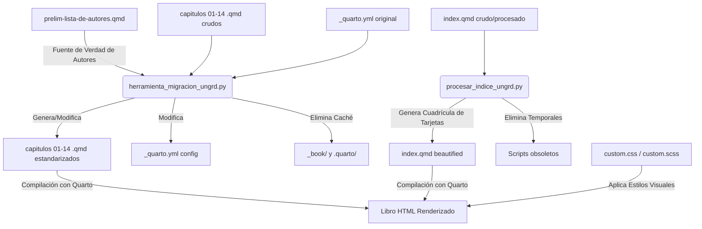

# Guía de Uso y Documentación de Scripts de Estilos y Migración (UNGRD)

Este documento detalla el funcionamiento, las modificaciones realizadas y el manual de uso para los scripts desarrollados para la estandarización arquitectónica y de estilos del libro **"Investigaciones en Gestión del Riesgo de Desastres para Colombia del 2021"**.

---

## Arquitectura General de Procesamiento

El flujo de trabajo automatizado toma los contenidos crudos de Quarto Markdown (`.qmd`) y los transforma en páginas estructuradas que interactúan con las reglas de estilo definidas en `custom.css` y `custom.scss`.



---

## 1. `herramienta_migracion_ungrd.py`
**Propósito:** Es el script maestro de migración y consolidación arquitectónica. Se encarga de procesar los capítulos individuales del libro en una sola pasada para aplicar el estándar oficial de metadatos, cajas, resúmenes y numeración manual.

### Archivos que Modifica
*   `_quarto.yml` (Configuración global del libro)
*   `01-capitulo-*.qmd` hasta `14-capitulo-*.qmd` (Archivos de capítulos individuales)
*   Elimina carpetas temporales de caché: `_book/` y `.quarto/`

### Detalles Técnicos de las Modificaciones

#### A. Configuración Global (`_quarto.yml`)
*   **Idioma:** Inserta `lang: es` al inicio de la raíz si no está presente.
*   **Numeración Nativa de Quarto:** Reemplaza `number-sections: true` por `number-sections: false` o lo inyecta bajo el formato HTML. Esto se hace porque el script implementa una numeración manual in-place, evitando colisiones con la numeración automática de Quarto.

#### B. Metadatos de Autores y Afiliaciones (Frontmatter YAML)
*   **Fuente de Verdad:** Lee `prelim-lista-de-autores.qmd` y mapea los autores por nombre para obtener sus afiliaciones oficiales.
*   **Estructura del YAML:** Convierte las listas de autores simples en bloques estructurados que respetan el orden exacto y relacionan los autores con sus afiliaciones mediante superíndices (e.g., `^1^`, `^1,2^`).
    ```yaml
    author:
      - name: "Nombre Autor ^1,2^"
        orcid: ""
        affiliation: "^1^Institución A; ^2^Institución B"
    ```
*   **Limpieza de Cuerpo:** Elimina cualquier texto plano de afiliaciones que pudiera estar al inicio del cuerpo del capítulo.
*   **Campos Requeridos:** Inyecta las llaves vacías `date: ""` y `doi: ""` requeridas para la compilación correcta en el formato de libro.

#### C. Bloques Especiales (Resumen, Abstract y Cajas)
*   **Resumen y Abstract:** Envuelve las secciones `## Resumen {.unnumbered}` y `## Abstract {.unnumbered}` en bloques contenedores Pandoc Divs (`::: {#resumen}` y `::: {#abstract}`). Esto permite que el archivo CSS aplique los colores de fondo de forma precisa:
    *   **Resumen:** Fondo azul claro (`#eff6ff`) y borde azul (`#bfdbfe`).
    *   **Abstract:** Fondo amarillo claro (`#FDF6D9`) y borde dorado (`#E8D995`).
*   **Cajas de Información (.caja-box):** Transforma la sintaxis obsoleta `::: {.caja-box}` a callouts estilizados oficiales de Quarto (`::: {#boxX .callout-important ...}`) con colores institucionales inline y sin bordes:
    *   **Fondo:** Azul claro (`#e3f0fbff`), padding de `10px` y `border: none !important;` (sin bordes).
    *   **Formato de Texto:** No genera títulos ni encabezados separados, ya que las cajas no tienen títulos. En su lugar, el contenido de la caja se inyecta directamente dentro del callout, destacando en negrita únicamente el identificador inicial `**Caja X.**` al principio del párrafo.
*   **Puntos Clave:** Transforma las tablas de puntos clave (`| PUNTOS CLAVE ... |` y su separador `| --- |`) en callouts estilizados sin bordes:
    *   **Fondo:** Lila muy claro (`#f4ebffff`), padding de `10px` y `border: none !important;`.
    *   **Formato de Texto:** Inserta el texto directamente dentro del callout, destacando en negrita únicamente el identificador inicial `**Puntos clave.**`.
*   **Recomendaciones para Tomar Decisiones:** Transforma las tablas de recomendaciones (`| RECOMENDACIÓNES PARA TOMAR DECISIONES ... |` y su separador `| --- |`) en callouts estilizados sin bordes:
    *   **Fondo:** Rosa muy claro (`#fff0f3ff`), padding de `10px` y `border: none !important;`.
    *   **Formato de Texto:** Inserta el texto directamente dentro del callout, destacando en negrita únicamente el identificador inicial `**Recomendaciones para tomar decisiones.**`.
*   **Retos:** Transforma las tablas de retos (`| RETOS ... |` y su separador `| --- |`) en callouts estilizados sin bordes:
    *   **Fondo:** Verde muy claro (`#eafaf1ff`), padding de `10px` y `border: none !important;`.
    *   **Formato de Texto:** Inserta el texto directamente dentro del callout, destacando en negrita únicamente el identificador inicial `**Retos.**`.
*   **Trabajo a Futuro:** Transforma las tablas de trabajo a futuro (`| TRABAJO FUTURO ... |` o `| TRABAJO A FUTURO ... |` y su separador `| --- |`) en callouts estilizados sin bordes:
    *   **Fondo:** Amarillo claro (`#fffbebff`), padding de `10px` y `border: none !important;`.
    *   **Formato de Texto:** Inserta el texto directamente dentro del callout, destacando en negrita únicamente el identificador inicial `**Trabajo a futuro.**`.

#### D. Numeración In-Place (Jerárquica)
*   Extrae el número de capítulo del nombre del archivo (e.g., `03-capitulo-3...` -> `3`).
*   Analiza los encabezados de segundo y tercer nivel en el cuerpo del capítulo (ignorando Resumen y Abstract) y les asigna manual in-place:
    *   `## Título` $\rightarrow$ `## {Capítulo}.{Secuencia_H2} Título` (ej. `## 3.1 Introducción`)
    *   `### Subtítulo` $\rightarrow$ `### {Capítulo}.{Secuencia_H2}.{Secuencia_H3} Subtítulo` (ej. `### 3.1.1 Antecedentes`)

### Guía de Uso
1.  Asegúrate de estar en la raíz del repositorio.
2.  Ejecuta el script usando Python 3:
    ```bash
    python3 herramienta_migracion_ungrd.py
    ```
3.  **Resultado esperado:** El script imprimirá en consola el progreso de configuración de `_quarto.yml`, la carga de autores, el procesamiento de cada uno de los 14 capítulos y finalmente la purga de caché.

---

## 2. `procesar_indice_ungrd.py`
**Propósito:** Procesa y formatea el archivo `index.qmd` (Portada e Inicio del libro) para aplicar una maquetación moderna con una rejilla responsiva (grid) de Bootstrap y tarjetas homogéneas para cada capítulo.

### Archivos que Modifica
*   `index.qmd` (Página de inicio/portada)
*   Elimina scripts de maquetación antiguos y obsoletos si existen en la raíz: `embellecer_indice.py` y `reparar_indice.py`.

### Detalles Técnicos de las Modificaciones
*   **Detección de Estado:** Evalúa si `index.qmd` ya está procesado buscando la clase `.indice-grid`. Si está en estado "crudo", migra la estructura básica a una rejilla CSS moderna.
*   **Estructura de la Rejilla:** Envuelve el listado de capítulos en una grilla responsiva:
    ```markdown
    ::: {.grid .indice-grid}
    ::: {.g-col-12 .g-col-md-6}
    ::: {.card .h-100 .shadow-sm}
      ::: {.card-header}
         [Enlace al Capítulo]
      :::
      ::: {.card-body}
         
         <p class="autores-text">**Autores:** Nombres de autores</p>
      :::
    :::
    :::
    :::
    ```
*   **Estándar de Miniaturas:** Modifica las referencias a imágenes del cuerpo del índice para aplicarles la clase CSS de tarjetas, lo que interactúa con `custom.css` para recortar las imágenes de forma homogénea a una altura de `190px` usando `object-fit: cover`.
*   **Estandarización de Autores:** Envuelve la línea de autores en un párrafo con la clase `.autores-text` para forzar un diseño más sutil (tamaño de fuente `0.85rem` y color `#6b7280`).

### Guía de Uso
1.  Ejecuta el script desde la raíz del proyecto:
    ```bash
    python3 procesar_indice_ungrd.py
    ```
2.  **Resultado esperado:** Actualización de `index.qmd` con la sintaxis de tarjetas homogéneas y eliminación en consola de los scripts de índice obsoletos (`embellecer_indice.py` y `reparar_indice.py`).

---

## 3. `scratch/fix_chapters.py` (Script de Corrección Temporal)
**Propósito:** Es un script de utilidad temprana ubicado en la carpeta `scratch/` que realiza tareas de formateo rápido en los archivos `.qmd` antes de aplicar la migración arquitectónica principal.

### Archivos que Modifica
*   Todos los archivos `.qmd` ubicados en el directorio del proyecto.

### Detalles Técnicos de las Modificaciones
1.  **Color del Banner:** Modifica o inyecta la propiedad `title-block-banner-color: "#151550ff"` (azul oscuro institucional) en el frontmatter YAML de los capítulos.
2.  **Conversión de Encabezados:** Convierte textos en negrita como `**Resumen**` y `**Abstract**` a encabezados formales no numerados de nivel 2: `## Resumen {.unnumbered}` y `## Abstract {.unnumbered}`.
3.  **Unificación de Palabras Clave:** Busca variaciones de "Key words", "Keywords", "Keywords  " o "Key words  " y las reemplaza uniformemente por la versión en negrita estándar: `**Keywords**`.

### Guía de Uso
> [!NOTE]
> Este script contiene una ruta absoluta estática hacia el directorio `/home/nia/scr-ungrd/investigaciones-grd-2021` en la línea 4. Si deseas utilizarlo en tu entorno de trabajo actual, debes editar esa línea o ejecutar los scripts maestros principales (`herramienta_migracion_ungrd.py` y `procesar_indice_ungrd.py`), los cuales ya incluyen y superan estas correcciones de forma segura e independiente de rutas absolutas locales.

Comando de ejecución:
```bash
python3 scratch/fix_chapters.py
```

---

## Relación con el Sistema de Estilos (`custom.css` y `custom.scss`)

Los scripts no trabajan aislados, sino que estructuran el código HTML/Markdown generado por Quarto para que coincida exactamente con las reglas definidas en las hojas de estilo:

| Elemento Modificado | Selector CSS Relacionado | Estilo Aplicado por la Hoja de Estilo |
| :--- | :--- | :--- |
| Contenedores `::: {#resumen}` | `#resumen` / `#resumen h1` | Aplica fondo azul suave `#eff6ff`, bordes limpios y título en color azul `#3b82f6`. |
| Contenedores `::: {#abstract}` | `#abstract` / `#abstract h1` | Aplica fondo crema suave `#FDF6D9`, bordes limpios y título en color dorado/ocre `#B8860B`. |
| Bloques de Tarjetas en Índice | `.indice-grid .card` | Agrega una sombra sutil, bordes redondeados de `10px`, y un efecto interactivo `hover` con desplazamiento vertical (`translateY(-5px)`) y sombra extendida. |
| Miniaturas de Capítulos | `.indice-grid .card-body img` | Estandariza el tamaño de todas las imágenes de portada en el índice a una altura fija de `190px` con recorte inteligente (`object-fit: cover`) y borde suave. |
| Enlaces en Tarjetas | `.indice-grid .card-header a` | Cambia el color de los enlaces a azul oscuro institucional (`#151550`) y aplica cambio de color a `#2c7bb6` al pasar el mouse. |
| Bloques de Caja (`#box1`, etc.) | `#box1`, `#box2`, `#caja1` | Fuerza la tipografía Arial (requisito editorial), remueve bordes (`border: none !important;`) y reduce los márgenes/paddings internos para mantener compactas las cajas. |
| Bloques de Puntos Clave (`#puntos-clave-1`, etc.) | `#puntos-clave-X` | Aplica fondo lila muy claro `#f4ebffff`, padding interno de `10px` y remueve bordes (`border: none !important;`). |
| Bloques de Recomendaciones (`#recomendaciones-1`, etc.) | `#recomendaciones-X` | Aplica fondo rosa muy claro `#fff0f3ff`, padding interno de `10px` y remueve bordes (`border: none !important;`). |
| Bloques de Retos (`#retos-1`, etc.) | `#retos-X` | Aplica fondo verde muy claro `#eafaf1ff`, padding interno de `10px` y remueve bordes (`border: none !important;`). |
| Bloques de Trabajo a Futuro (`#trabajo-futuro-1`, etc.) | `#trabajo-futuro-X` | Aplica fondo amarillo claro `#fffbebff`, padding interno of `10px` y remueve bordes (`border: none !important;`). |
| Tablas de Datos (Primera fila) | `th`, `table > thead > tr > th` | Aplica fondo gris claro `#f0f0f0 !important;` y texto en negrita a la cabecera de las columnas en todas las tablas. |


---

## Recomendaciones para el Flujo de Trabajo

Si realizas cambios en el contenido o deseas reiniciar el formateo del libro:
1.  **Modificar contenidos crudos:** Realiza los cambios que requieras sobre los archivos `.qmd`.
2.  **Ejecutar herramientas en orden:**
    *   Primero corre la consolidación de capítulos: `python3 herramienta_migracion_ungrd.py`
    *   Luego corre la consolidación del índice: `python3 procesar_indice_ungrd.py`
3.  **Verificar y Compilar:** Puedes compilar localmente con Quarto para previsualizar los cambios usando:
    ```bash
    quarto render
    ```
    *(Nota: La integración continua de GitHub Actions compilará y publicará de manera automática en la rama `gh-pages` cada vez que hagas un push a `main`).*
