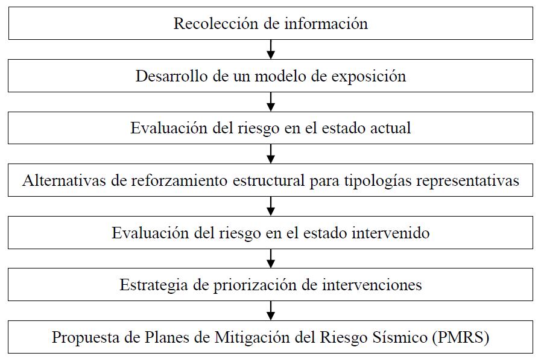
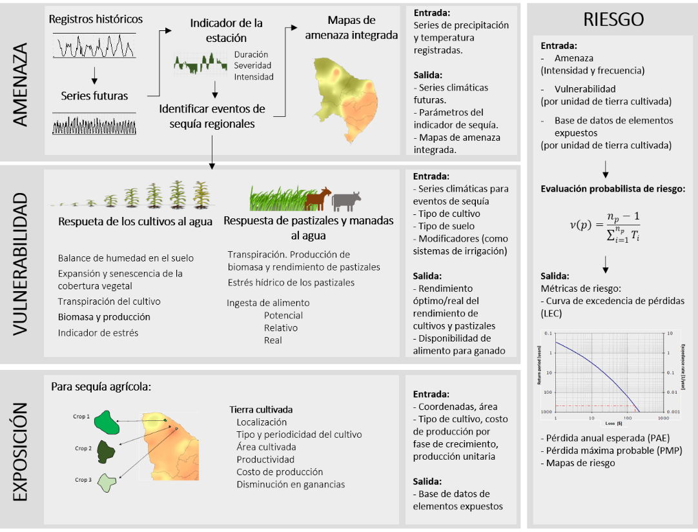
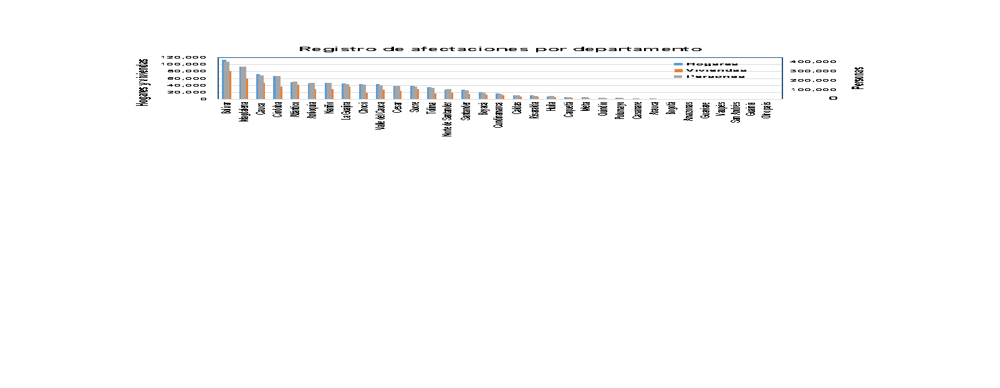
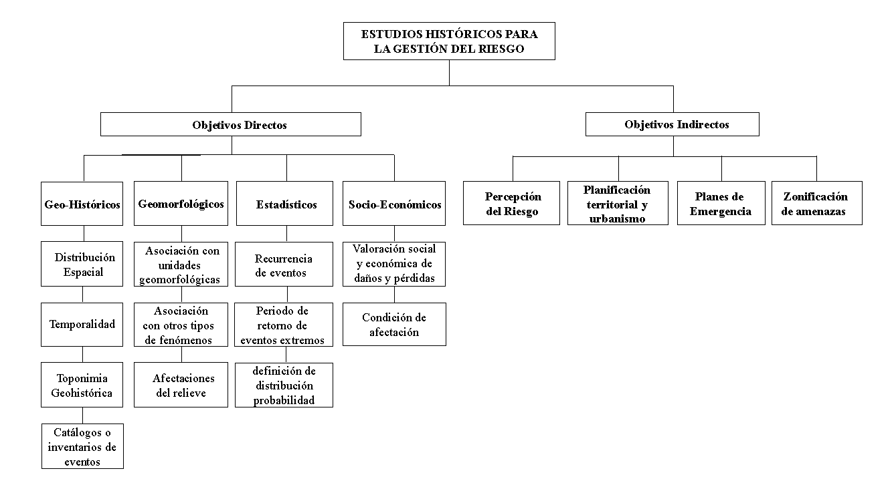
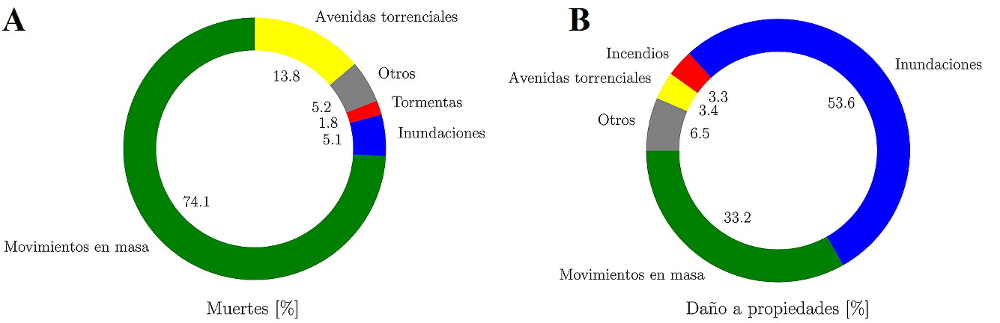
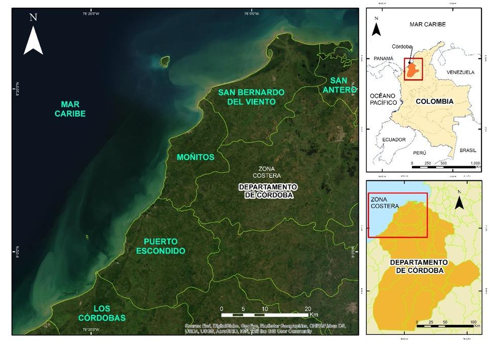
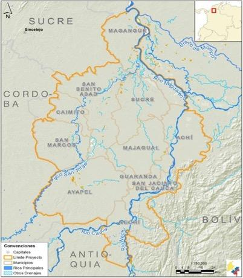

# Inicio {.unnumbered}

::::::::::::::::::::::::::::::::: {layout-ncol="2"}
::::: card
::: {.card-header .bg-white}
**[Capítulo 1: Actualización de los coeficientes sísmicos de diseño estructural para la Norma Colombiana de Construcción Sismo Resistente NSR-22](01-capitulo-1-actualizacion-de-los-coeficientes-.html)**
:::

::: card-body
{fig-align="left" width="250"}

**Autores:** Gabriel Bernal, Omar Darío Cardona
:::
:::::

::::: card
::: {.card-header .bg-white}
**[Capítulo 2: Mitigación del riesgo sísmico de la infraestructura escolar](02-capitulo-2-mitigacion-del-riesgo-sismico-de-l.html)**
:::

::: card-body
{fig-align="left" width="250"}

**Autores:** Rafael Fernández, Luis Yamin, Juan Carlos Reyes, Angie Garcia, Gustavo Fuentes, Juan Echeverry
:::
:::::

::::: card
::: {.card-header .bg-white}
**[Capítulo 3: Evaluación probabilista del riesgo por sequía en el sector agrícola de Colombia](03-capitulo-3-evaluacion-probabilista-del-riesgo.html)**
:::

::: card-body
{fig-align="left" width="250"}

**Autores:** Omar Darío Cardona, Gabriel Bernal, María Alejandra Escovar
:::
:::::

::::: card
::: {.card-header .bg-white}
**[Capítulo 4: Contribución de la geodesia espacial en la gestión del riesgo en Colombia. Casos de estudio](04-capitulo-4-contribucion-de-la-geodesia-espaci.html)**
:::

::: card-body
{fig-align="left" width="250"}

**Autores:** Héctor Mora-Páez, Fredy Díaz Mila, Takeshi Sagiya, Leidy Giraldo Londoño, Yuli Corchuelo Cuervo
:::
:::::

::::: card
::: {.card-header .bg-white}
**[Capítulo 5: Nociones performativas del reasentamiento social por riesgo de desastre en Colombia: componentes psicosociales estratégicos para la sostenibilidad](05-capitulo-5-nociones-performativas-del-reasent.html)**
:::

::: card-body
{fig-align="left" width="250"}

**Autores:** William Oswaldo Gaviria Gutiérrez, Viviana Ramírez Loaiza, Lina Andrea Zambrano Hernández
:::
:::::

::::: card
::: {.card-header .bg-white}
**[Capítulo 6: Animales en la gestión del riesgo de los desastres](06-capitulo-6-animales-en-la-gestion-del-riesgo-.html)**
:::

::: card-body
**Autores:** Diego Hernández Pulido, Nicolás Hernández Gallo, Leonardo Arias Bernal, Rodrigo Forero Carrillo, Gonzalo Jiménez Alonso
:::
:::::

::::: card
::: {.card-header .bg-white}
**[Capítulo 7: Iniciativas para la reducción del riesgo de desastres en el programa de Ingeniería Ambiental y Sanitaria de la Universidad de La Salle: un tema de responsabilidad social universitaria](07-capitulo-7-iniciativas-para-la-reduccion-del-.html)**
:::

::: card-body
{fig-align="left" width="250"}

**Autores:** Víctor Leonardo López Jiménez
:::
:::::

::::: card
::: {.card-header .bg-white}
**[Capítulo 8: Comunicación del riesgo: reflexiones y experiencias locales en el departamento del Valle del Cauca](08-capitulo-8-comunicacion-del-riesgo-reflexione.html)**
:::

::: card-body
{fig-align="left" width="250"}

**Autores:** Javier Thomas, Julio Rubio
:::
:::::

::::: card
::: {.card-header .bg-white}
**[Capítulo 9: La perspectiva histórica en la gestión del riesgo de desastres: aplicación en Santiago de Cali, Colombia](09-capitulo-9-la-perspectiva-historica-en-la-ges.html)**
:::

::: card-body
{fig-align="left" width="250"}

**Autores:** Nathalie García-Millán, Jorge A. Vélez-Correa, Karen A. Sánchez-Estupiñán
:::
:::::

::::: card
::: {.card-header .bg-white}
**[Capítulo 10: Estudio de riesgo por movimientos en masa en cuencas hidrográficas abastecedoras en el suroeste antioqueño usando métodos probabilistas](10-capitulo-10-estudio-de-riesgo-por-movimientos.html)**
:::

::: card-body
{fig-align="left" width="250"}

**Autores:** Cesar Augusto Hidalgo M., Johnny Alexander Vega G.
:::
:::::

::::: card
::: {.card-header .bg-white}
**[Capítulo 11: De la percepción de la amenaza a su cuantificación. Caso de estudio: desbordamiento del río Unete en Aguazul, Casanare, Colombia](11-capitulo-11-de-la-percepcion-de-la-amenaza-a-.html)**
:::

::: card-body
{fig-align="left" width="250"}

**Autores:** Rafael Muñoz Quintero, Daniela Jácome Hernández, Alejandro Franco Rojas, Alexander Padilla González
:::
:::::

::::: card
::: {.card-header .bg-white}
**[Capítulo 12: Obras costeras y clima marítimo: casos del Caribe colombiano](12-capitulo-12-obras-costeras-y-clima-maritimo-c.html)**
:::

::: card-body
{fig-align="left" width="250"}

**Autores:** Serguei Lonin, Julio Monroy
:::
:::::

::::: card
::: {.card-header .bg-white}
**[Capítulo 13: Modelo de gestión y análisis del riesgo por erosión costera. Caso de estudio departamento de Córdoba](13-capitulo-13-modelo-de-gestion-y-analisis-del-.html)**
:::

::: card-body
{fig-align="left" width="250"}

**Autores:** Oswaldo Coca-Domínguez, Constanza Ricaurte-Villota, David Fernando Morales Giraldo
:::
:::::

::::: card
::: {.card-header .bg-white}
**[Capítulo 14: Gestión del riesgo por inundaciones: un metamodelo para el desarrollo de artefactos participativos. Caso de estudio en la ecorregión de La Mojana (Colombia)](14-capitulo-14-gestion-del-riesgo-por-inundacion.html)**
:::

::: card-body
{fig-align="left" width="250"}

**Autores:** Paula Andrea Villegas González, Nelson Obregón Neira
:::
:::::

:::::::::::::::::::::::::::::::::
