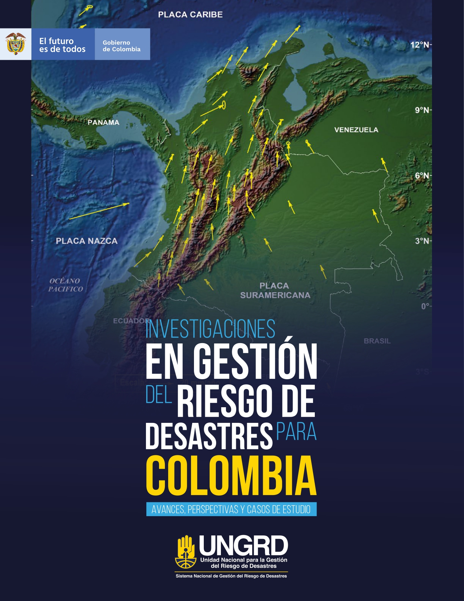

# Presentación del libro {.unnumbered}

:::: {.columns}

::: {.column width="60%"}

Desde las instancias de coordinación del Sistema Nacional de Gestión del Riesgo de Desastres (SNGRD) como el Comité Nacional para el Conocimiento del Riesgo y la Comisión Nacional Asesora de Investigación de Gestión del Riesgo de Desastres, se aprobó la Estrategia para la Promoción de la Ciencia, Tecnología e Innovación (CTeI) en Gestión del Riesgo de Desastres, la cual pretende la articulación de la academia, el estado, la sociedad civil y la industria para fomentar la ciencia, tecnología, e innovación.

En este contexto, la Unidad Nacional para la Gestión del Riesgo de Desastres (UNGRD) a través de la Comisión Nacional Asesora de Investigación en Gestión del Riesgo de Desastres en cumplimiento de la misionalidad, de los planes y la agenda internacional, presentan el Libro de Investigaciones en Gestión del Riesgo de Desastres para Colombia, el cual recopila avances, perspectivas y casos de estudio; reconociendo la importancia de las investigaciones.

Esta publicación desarrolla capítulos relacionados con: ingeniería sísmica, fenómenos hidrometeorológicos, análisis y evaluación del riesgo, reducción del riesgo, aspectos históricos, educación del riesgo, comunicación del riesgo y casos de estudio; permitiendo presentar al público en general las investigaciones actuales en materia de gestión del riesgo de desastres, puntos clave y recomendaciones, el cual es el inicio de diferentes publicaciones divulgativas en conocimiento del riesgo, que muestran los aportes de la academia, entidades técnico-científicas y otros actores del SNGRD.

Hoy, la Unidad Nacional para la Gestión del Riesgo de Desastres resalta la importancia de la promoción de nuevos resultados y avances en materia de investigación. En este sentido, continuará fortaleciendo los espacios de intercambio de experiencias, aportes al nuevo conocimiento del riesgo, enfoque de resolución de problemas integrando la visión de multiamenaza y la diversidad de disciplinas, considerando entre otras, la generación y uso de conocimiento científico, el uso de datos, los avances en ciencia, tecnología e innovación, con el propósito de avanzar en la comprensión del riesgo de desastres.

**EDUARDO JOSÉ GONZÁLEZ ANGULO**
Director General
Unidad Nacional para la Gestión del Riesgo de Desastres

:::

::: {.column width="40%"}
{fig-align="center" width="80%"}
:::

::::
